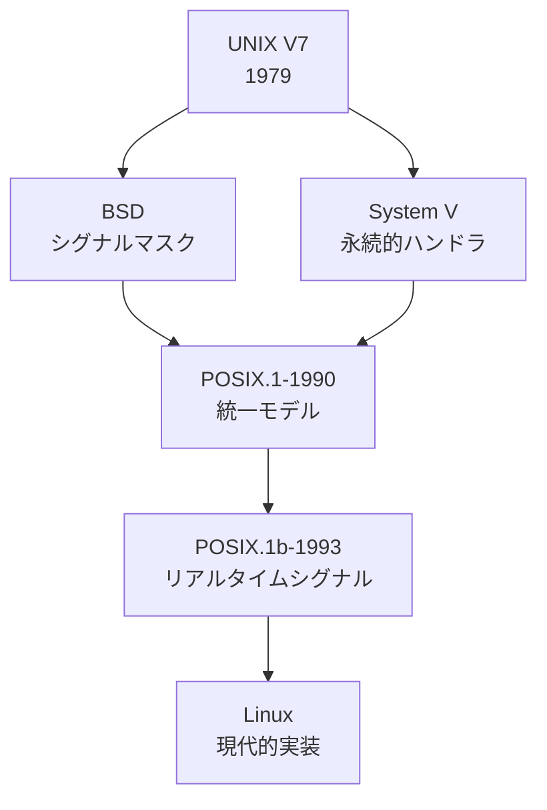
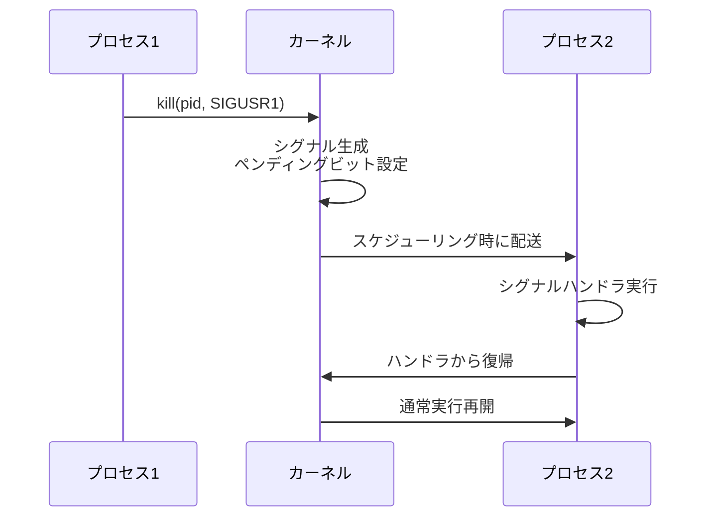
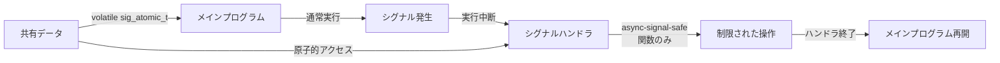
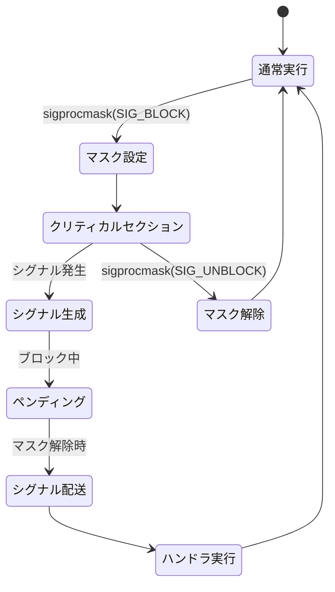

# Signal

シグナルは、UNIXおよびLinuxシステムにおける最も基本的なプロセス間通信メカニズムの一つである。その起源は1970年代のUNIX Version 7まで遡り、以来、システムプログラミングにおいて不可欠な役割を果たしてきた。シグナルは非同期イベントの通知という一見単純な概念でありながら、その実装と正しい使用には深い理解が必要となる。本稿では、シグナルの本質的な仕組みから、POSIXによる標準化、そして現代のLinuxカーネルにおける実装まで、包括的に解説する。

## シグナルの本質と歴史的発展

シグナルとは、プロセスに対して特定のイベントが発生したことを通知する、ソフトウェア割り込みの一種である。ハードウェア割り込みがCPUレベルで発生するのに対し、シグナルはカーネルによって管理されるソフトウェアレベルの通知機構として機能する。この概念は、リアルタイムシステムや組み込みシステムで一般的な割り込み処理を、マルチプロセス環境に適応させたものと理解できる。

初期のUNIXでは、シグナルは極めて単純な仕組みであった。プロセスはシグナルを受信すると、デフォルトの動作（通常はプロセスの終了）を実行するか、事前に登録されたハンドラ関数を呼び出すかのいずれかの動作を行った。しかし、この単純なモデルには重大な問題があった。シグナルハンドラの実行中に同じシグナルが再度発生した場合の動作が未定義であり、いわゆる「信頼できないシグナル」として知られる問題が存在していた[^1]。

BSD UNIXは、この問題に対処するため、シグナルマスクという概念を導入した。これにより、特定のシグナルを一時的にブロックし、クリティカルセクションの保護が可能となった。一方、System Vは異なるアプローチを採用し、シグナルハンドラが呼び出された後も自動的に再設定される「永続的なハンドラ」を実装した。これらの異なる実装は、後にPOSIXによって統一されることになる。



## POSIXシグナルモデル

POSIX.1-1990は、BSDとSystem Vの両方の長所を取り入れた統一的なシグナルモデルを定義した[^2]。このモデルは、シグナルの送信、配送、処理という三つの段階を明確に区別している。

シグナルの生成（generation）は、特定のイベントが発生したときにカーネルによって行われる。例えば、ゼロ除算が発生した場合にはSIGFPEが、不正なメモリアクセスが発生した場合にはSIGSEGVが生成される。生成されたシグナルは、対象プロセスに対して「ペンディング」状態となる。

シグナルの配送（delivery）は、カーネルがペンディング状態のシグナルを実際にプロセスに通知する段階である。重要な点は、シグナルの生成と配送の間には時間的な遅延が存在し得ることである。プロセスがシグナルをブロックしている場合、シグナルはペンディング状態のまま保持される。

POSIXは、標準シグナルとして31種類を定義している。これらは大きく以下のカテゴリに分類される：

プログラムエラーに関連するシグナル（SIGFPE、SIGSEGV、SIGILL、SIGBUS）は、プログラムの実行中に検出された異常状態を通知する。これらのシグナルは同期的に生成され、エラーが発生した命令の実行コンテキストと密接に関連している。

プロセス制御シグナル（SIGTERM、SIGKILL、SIGSTOP、SIGCONT）は、プロセスのライフサイクル管理に使用される。SIGKILLとSIGSTOPは特別なシグナルであり、捕捉、ブロック、無視することができない。これは、システム管理者が確実にプロセスを制御できることを保証するための設計である。

ジョブ制御シグナル（SIGTSTP、SIGTTIN、SIGTTOU）は、端末ベースのジョブ制御機能をサポートする。これらは、バックグラウンドプロセスが端末の入出力を試みた場合や、ユーザーが端末から停止コマンドを入力した場合に生成される。

## シグナルの送受信メカニズム

シグナルの送信は、kill()システムコールを通じて行われる。その名前とは裏腹に、kill()は任意のシグナルを送信するための汎用的なインターフェースである。より新しいsigqueue()システムコールは、シグナルと共に追加のデータを送信することを可能にする。

```c
int kill(pid_t pid, int sig);
int sigqueue(pid_t pid, int sig, const union sigval value);
```

カーネル内部では、シグナルの管理は各プロセスのtask_struct構造体に含まれるシグナル関連のフィールドによって行われる。ペンディングシグナルはビットマスクとして管理され、標準シグナルについては同じシグナルが複数回ペンディング状態になることはない。これは、シグナルがエッジトリガではなくレベルトリガ的な性質を持つことを意味する。



シグナルの配送タイミングは、プロセスのスケジューリングと密接に関連している。カーネルは、以下のタイミングでペンディングシグナルをチェックし、配送を試みる：

1. システムコールからユーザー空間に戻る直前
2. 割り込みハンドラからユーザー空間に戻る直前
3. プロセスがスケジューリングされて実行を再開する時

この設計により、シグナルの配送はカーネルモードからユーザーモードへの遷移時に限定され、カーネル内部の一貫性が保たれる。

## シグナルハンドラの実装と制約

シグナルハンドラは、通常のプログラムフローを中断して実行される特殊な関数である。POSIXは、sigaction()システムコールを通じてシグナルハンドラを設定する標準的な方法を定義している。

```c
struct sigaction {
    void (*sa_handler)(int);
    void (*sa_sigaction)(int, siginfo_t *, void *);
    sigset_t sa_mask;
    int sa_flags;
    void (*sa_restorer)(void);
};
```

シグナルハンドラの実行には、重要な制約が存在する。最も基本的な制約は、シグナルハンドラ内で呼び出すことができる関数が限定されることである。POSIXは「async-signal-safe」な関数のリストを定義しており、これらの関数のみがシグナルハンドラ内で安全に呼び出せることを保証している[^3]。

この制約の背景には、シグナルハンドラが任意のタイミングで実行される可能性があるという事実がある。例えば、malloc()の実行中にシグナルが発生し、ハンドラ内で再度malloc()を呼び出すと、内部のデータ構造が不整合な状態でアクセスされ、デッドロックやメモリ破壊を引き起こす可能性がある。

シグナルハンドラとメインプログラムの間でのデータ共有も慎重に設計する必要がある。共有される変数は`volatile sig_atomic_t`型として宣言されるべきである。volatileは最適化によるアクセスの削除を防ぎ、sig_atomic_tは原子的な読み書きを保証する。



## リアルタイムシグナル

POSIX.1b-1993（旧称POSIX.4）は、リアルタイムシグナルという新しい概念を導入した[^4]。リアルタイムシグナルは、SIGRTMIN（通常34）からSIGRTMAX（通常64）までの範囲で定義され、標準シグナルにはない重要な特性を持つ。

第一に、リアルタイムシグナルはキューイングされる。同じリアルタイムシグナルが複数回生成された場合、それぞれが個別に配送される。これは、標準シグナルが単一のペンディングビットで管理されるのとは対照的である。

第二に、リアルタイムシグナルは優先度を持つ。番号の小さいシグナルほど高い優先度を持ち、複数のリアルタイムシグナルがペンディング状態にある場合、優先度の高いものから順に配送される。

第三に、sigqueue()システムコールを使用することで、シグナルと共に追加のデータ（sigval共用体）を送信できる。これにより、シグナルを使用したより豊富な情報伝達が可能となる。

Linuxカーネルの実装では、リアルタイムシグナルのキューは、プロセスごとおよびシステム全体でのリソース制限（RLIMIT_SIGPENDING）によって管理される。キューがいっぱいになった場合、sigqueue()はEAGAINエラーを返す。

## シグナルマスクとブロッキング

シグナルマスクは、特定のシグナルの配送を一時的に延期するメカニズムである。各プロセス（正確には各スレッド）は、ブロックされたシグナルのセットを保持している。ブロックされたシグナルが生成されても、そのシグナルはペンディング状態に留まり、ブロックが解除されるまで配送されない。

シグナルマスクの操作は、sigprocmask()（シングルスレッドプロセス）またはpthread_sigmask()（マルチスレッドプロセス）を通じて行われる。これらの関数は、現在のマスクに対してシグナルを追加（SIG_BLOCK）、削除（SIG_UNBLOCK）、または完全に置換（SIG_SETMASK）することができる。

```c
int sigprocmask(int how, const sigset_t *set, sigset_t *oldset);
```

シグナルマスクの重要な用途の一つは、クリティカルセクションの保護である。例えば、複数のシグナルハンドラが共有データ構造にアクセスする場合、一方のハンドラの実行中に他のシグナルをブロックすることで、データの一貫性を保つことができる。

sigsuspend()システムコールは、アトミックにシグナルマスクを変更し、シグナルの到着を待機する。これは、競合状態を避けながらシグナルを待つための標準的な方法である。単純にsigprocmask()でマスクを変更してからpause()を呼ぶと、マスクの変更とpause()の間にシグナルが到着した場合、そのシグナルを見逃す可能性がある。



## 実装の詳細と性能特性

Linuxカーネルにおけるシグナルの実装は、効率性と正確性のバランスを追求した結果である。カーネル2.6以降では、シグナル処理のスケーラビリティが大幅に改善された。

各プロセスのtask_struct構造体には、シグナル関連の情報を格納するsignal_struct構造体とsighand_struct構造体へのポインタが含まれる。signal_structはプロセスグループ全体で共有されるシグナル情報を、sighand_structはシグナルハンドラの情報を保持する。

ペンディングシグナルは、二つのレベルで管理される。プロセス全体のペンディングシグナル（shared_pending）と、スレッド固有のペンディングシグナル（pending）である。これにより、POSIXスレッドのセマンティクスが正しく実装される。

シグナルハンドラの呼び出しは、アーキテクチャ固有のコードによって実装される。x86-64アーキテクチャの場合、カーネルはユーザースタック上にシグナルフレームを構築し、リターンアドレスをrt_sigreturn()システムコールのトランポリンコードに設定する。これにより、ハンドラの実行後に自動的にカーネルに制御が戻り、元のコンテキストが復元される。

性能面では、シグナルの送信と配送は比較的高コストな操作である。特に、シグナルハンドラの呼び出しには、完全なコンテキストスイッチに匹敵するオーバーヘッドが発生する。このため、高頻度の通信にはシグナルは適さず、共有メモリやパイプなどの他のIPC機構の使用が推奨される。

## マルチスレッド環境でのシグナル

POSIXスレッドの導入により、シグナルの扱いはより複雑になった。マルチスレッドプロセスでは、各スレッドが独自のシグナルマスクを持つ一方、シグナルハンドラはプロセス全体で共有される。

シグナルの生成時、カーネルは適切な配送先スレッドを選択する必要がある。同期シグナル（SIGSEGV、SIGFPEなど）は、それを引き起こしたスレッドに配送される。非同期シグナルの場合、そのシグナルをブロックしていない任意のスレッドが選択される。

pthread_kill()関数を使用することで、特定のスレッドにシグナルを送信することができる。しかし、シグナルハンドラ自体はプロセス全体で共有されるため、どのスレッドでハンドラが実行されるかに依存しないよう設計する必要がある。

sigwait()関数ファミリ（sigwait()、sigwaitinfo()、sigtimedwait()）は、マルチスレッド環境でシグナルを扱うための推奨される方法である。専用のスレッドがこれらの関数でシグナルを同期的に待機し、他のスレッドでは該当シグナルをブロックする設計パターンが一般的である。

## 設計指針とベストプラクティス

シグナルを使用したプログラムの設計には、慎重な考慮が必要である。以下は、長年の経験から導き出された重要な指針である。

第一に、シグナルハンドラは可能な限り単純に保つべきである。理想的には、volatile sig_atomic_t型のフラグを設定するだけに留め、実際の処理はメインプログラムで行う。これにより、async-signal-safeでない関数の呼び出しによる問題を回避できる。

第二に、シグナルハンドラ内でのエラー処理は特に注意が必要である。多くのエラー報告関数（syslog()、fprintf()など）はasync-signal-safeではない。必要に応じて、write()システムコールを直接使用してエラーメッセージを出力する。

第三に、シグナルマスクの操作は、必要最小限の範囲で行う。過度に広範囲のシグナルをブロックすると、システムの応答性が低下し、デバッグが困難になる。特に、SIGKILLとSIGSTOPはブロックできないことを前提とした設計が必要である。

第四に、リアルタイムシグナルとタイマーの組み合わせは、高精度のタイミング制御を可能にする。timer_create()でPOSIXタイマーを作成し、SIGEV_SIGNALを指定することで、タイマー満了時にリアルタイムシグナルを生成できる。

第五に、シグナルハンドラの再入可能性を常に考慮する。同じシグナルが短期間に複数回発生する可能性がある場合、SA_RESTARTフラグやシグナルマスクの適切な設定により、予期しない動作を防ぐ。

移植性の観点からは、POSIX.1-2001で定義された関数のみを使用することが推奨される。Linux固有の拡張（signalfd()、eventfd()など）は便利であるが、他のUNIX系システムでは利用できない可能性がある。

パフォーマンスが重要なアプリケーションでは、シグナルの使用を最小限に抑えるべきである。代替手段として、epoll()やio_uringなどの非同期I/O機構、あるいは共有メモリとfutexを組み合わせた通信方法を検討する価値がある。

デバッグとトラブルシューティングの観点では、straceやgdbなどのツールがシグナルの挙動を理解する上で invaluableである。特に、`strace -e signal`オプションは、シグナル関連のシステムコールのみをトレースし、問題の特定に役立つ。

シグナルは、その長い歴史と広範な使用にもかかわらず、あるいはそれゆえに、正しく扱うことが難しい機能の一つである。しかし、その基本的なメカニズムと制約を理解することで、堅牢で移植性の高いシステムプログラムを構築することが可能となる。カーネルとユーザー空間の境界で動作するこの機構は、UNIXの設計哲学を体現しており、現代のシステムプログラミングにおいても重要な役割を果たし続けている。

[^1]: W. Richard Stevens, "Advanced Programming in the UNIX Environment", Addison-Wesley, 1992, Chapter 10: Signals

[^2]: IEEE Std 1003.1-1990, "IEEE Standard for Information Technology - Portable Operating System Interface (POSIX) Part 1: System Application Program Interface (API) [C Language]", 1990

[^3]: IEEE Std 1003.1-2017, "The Open Group Base Specifications Issue 7", 2018 Edition, Section 2.4.3: Signal Actions

[^4]: IEEE Std 1003.1b-1993, "IEEE Standard for Information Technology - Portable Operating System Interface (POSIX) Part 1: System Application Program Interface (API) Amendment 1: Realtime Extension [C Language]", 1993