# Signal

シグナルは、Unixおよびその派生システムにおけるプロセス間通信の最も基本的なメカニズムの一つである。本質的には、プロセスに対して送信される非同期通知であり、特定のイベントの発生を伝える役割を果たす。シグナルメカニズムは1970年代初頭のUnix開発初期から存在し、システムプログラミングにおいて不可欠な要素として進化を続けてきた。

シグナルの概念は、ハードウェア割り込みのソフトウェア版として理解できる。ハードウェア割り込みがCPUの実行フローを中断して特定のルーチンを実行するように、シグナルはプロセスの通常の実行フローを中断し、事前に定義されたハンドラを実行する。この非同期性により、プロセスは予期しないタイミングで発生するイベントに対応できるようになる。

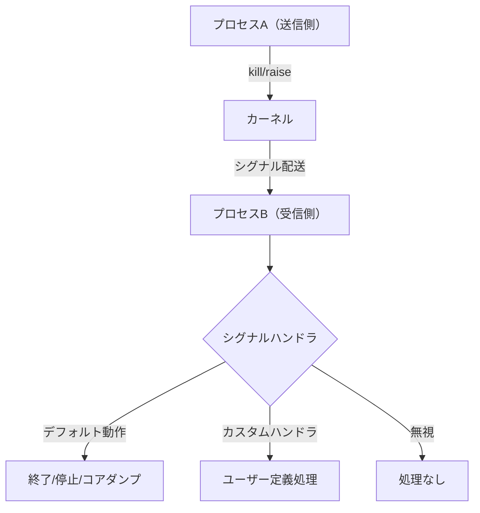

## シグナルの歴史的発展と設計哲学

Unix Version 7（1979年）で初めて導入されたシグナルメカニズムは、当初は極めて単純な実装であった。プロセスは15種類のシグナルを受信でき、各シグナルに対してデフォルトの動作を実行するか、ユーザー定義のハンドラを呼び出すかを選択できた。しかし、この初期実装には「信頼できないシグナル」として知られる重大な問題があった[^1]。

問題の核心は、シグナルハンドラが呼び出されると、そのシグナルに対する処理方法が自動的にデフォルトにリセットされることにあった。これにより、ハンドラ内で再度signal()を呼び出して再設定する必要があったが、その間に同じシグナルが到着すると、意図しない動作（通常はプロセスの終了）が発生する可能性があった。

```c
// Unix V7での問題のあるパターン
void handler(int sig) {
    // この時点でSIGINTはデフォルト動作（終了）にリセットされている
    // 次の行が実行される前にSIGINTが到着するとプロセスが終了する
    signal(SIGINT, handler);  // 再設定
    // 実際の処理
}
```

この問題に対して、BSDとSystem Vは異なるアプローチを採用した。BSD Unixは、シグナルマスクという革新的な概念を導入し、シグナルハンドラの実行中に特定のシグナルを自動的にブロックする仕組みを実装した。一方、System Vは「永続的なハンドラ」を実装し、ハンドラが呼び出されても自動的にリセットされないようにした。

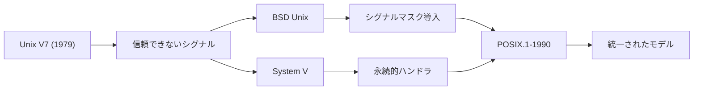

## シグナルの分類と番号体系

POSIXは標準シグナルを定義しており、各シグナルには番号と記号定数が割り当てられている。シグナル番号は1から始まり、0は特殊な用途（プロセスの存在確認）に予約されている。Linux環境では、標準シグナル（1-31）とリアルタイムシグナル（通常34-64）の2種類が存在する。

標準シグナルは、その発生原因と用途によって以下のように分類される：

**プログラムエラーシグナル**は、実行中のプログラムで検出されたエラー条件を表す。SIGSEGV（セグメンテーション違反）は不正なメモリアクセス、SIGFPE（浮動小数点例外）は算術エラー、SIGILL（不正命令）は無効なCPU命令の実行、SIGBUS（バスエラー）はアライメント違反などを示す。これらは同期シグナルと呼ばれ、特定の命令の実行に直接起因する。

**プロセス制御シグナル**は、プロセスのライフサイクル管理に使用される。SIGTERM（15）は協調的な終了要求、SIGKILL（9）は強制終了、SIGSTOP（19）は一時停止、SIGCONT（18）は再開を指示する。SIGKILLとSIGSTOPは特別な扱いを受け、キャッチ、ブロック、無視することができない。この設計により、システム管理者は常にプロセスを制御できることが保証される。

**ジョブ制御シグナル**は、端末ベースのジョブ制御をサポートする。SIGTSTP（20）は端末からの停止要求（通常Ctrl+Z）、SIGTTIN（21）とSIGTTOU（22）は、バックグラウンドプロセスが端末の入出力を試みた際に生成される。

**通知シグナル**は、様々なシステムイベントを通知する。SIGCHLD（17）は子プロセスの状態変化、SIGPIPE（13）は読み手のいないパイプへの書き込み、SIGALRM（14）はタイマーの満了を示す。

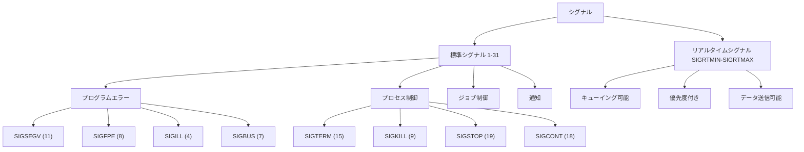

## シグナルの生成と配送メカニズム

シグナルの生成から配送までのプロセスは、カーネルによって厳密に管理される。シグナルは様々な要因によって生成される：ハードウェア例外（SIGFPE、SIGSEGV）、ソフトウェア条件（SIGPIPE、SIGALRM）、ユーザーアクション（SIGINT、SIGQUIT）、そして明示的なシステムコール（kill、raise）である。

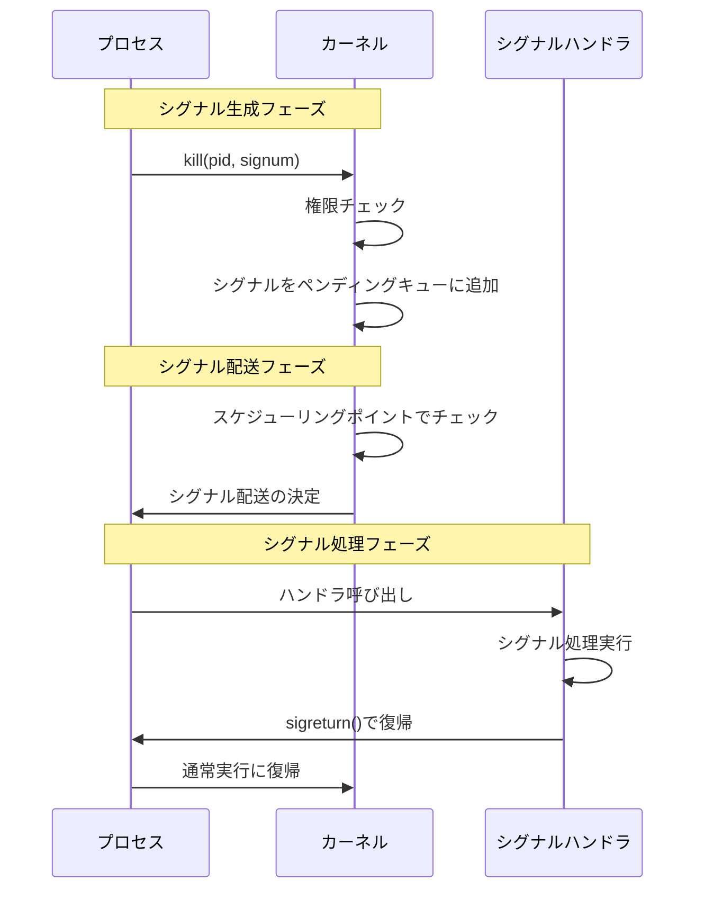

カーネルは各プロセスに対してシグナルペンディングビットマスクを維持する。シグナルが生成されると、対応するビットがセットされる。標準シグナルの場合、同じシグナルが複数回生成されても、ペンディング状態は1つだけ記録される。これはシグナルがキューイングされないことを意味し、高頻度で発生するシグナルによるリソース枯渇を防ぐ設計となっている。

シグナルの配送は、プロセスがカーネルモードからユーザーモードに戻る際のスケジューリングポイントで行われる。具体的には以下のタイミングである：

1. **システムコールの完了時** - プロセスがread()、write()などのシステムコールから戻る際
2. **割り込みハンドラの終了時** - タイマー割り込みやI/O割り込みの処理後
3. **プロセスのスケジューリング時** - CPUスケジューラがプロセスを選択して実行を再開する際

この設計により、カーネルは一貫した状態でシグナルを配送でき、カーネル内部でのレースコンディションを回避できる。

## シグナルハンドリングの進化：signal()からsigaction()へ

初期のUnixでは、signal()システムコールがシグナルハンドリングの唯一の方法であった。しかし、前述の「信頼できないシグナル」問題に加えて、signal()には移植性の問題もあった。異なるUnix実装間で動作が一貫していなかったのである。

POSIX.1では、これらの問題を解決するためにsigaction()システムコールが標準化された。sigaction()は、より豊富な制御オプションを提供し、信頼性の高いシグナルハンドリングを実現する。

```c
struct sigaction {
    void (*sa_handler)(int);                  // 基本的なハンドラ
    void (*sa_sigaction)(int, siginfo_t *, void *);  // 拡張ハンドラ
    sigset_t sa_mask;                         // ハンドラ実行中のマスク
    int sa_flags;                             // 動作フラグ
    void (*sa_restorer)(void);                // 内部使用（廃止予定）
};
```

sigaction構造体の各フィールドは重要な役割を持つ：

**sa_handler**は従来のシグナルハンドラ関数へのポインタである。SIG_DFL（デフォルト動作）やSIG_IGN（無視）を指定することもできる。

**sa_sigaction**はSA_SIGINFOフラグと共に使用され、シグナルに関する詳細な情報を受け取ることができる。siginfo_t構造体には、シグナルを送信したプロセスのPID、UID、シグナルの原因となったアドレスなどが含まれる。

**sa_mask**は、ハンドラ実行中に自動的にブロックされる追加のシグナルセットを指定する。これにより、複雑なハンドラ内でのレースコンディションを防止できる。

**sa_flags**は様々な動作制御フラグを指定できる：
- SA_RESTART：システムコールの自動再開
- SA_SIGINFO：拡張情報付きハンドラの使用
- SA_ONSTACK：代替シグナルスタックの使用
- SA_NODEFER：ハンドラ実行中の同一シグナルをブロックしない
- SA_RESETHAND：ハンドラ実行後にSIG_DFLにリセット（Unix V7互換）

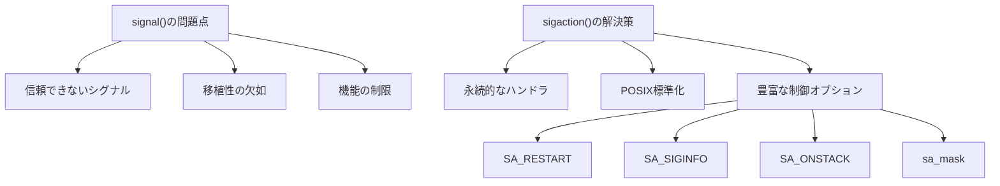

## シグナルマスクとブロッキング

プロセスは、特定のシグナルを一時的にブロックすることで、クリティカルセクションを保護できる。シグナルマスクは、現在ブロックされているシグナルの集合を表し、sigprocmask()システムコールによって操作される。

```c
int sigprocmask(int how, const sigset_t *set, sigset_t *oldset);
```

howパラメータは以下の値を取る：
- **SIG_BLOCK**：setで指定されたシグナルを現在のマスクに追加
- **SIG_UNBLOCK**：setで指定されたシグナルを現在のマスクから削除
- **SIG_SETMASK**：現在のマスクをsetで完全に置き換え

シグナルマスクの操作は、アトミックな操作の実装において重要である。例えば、グローバル変数の更新中に割り込まれないようにする必要がある場合：

```c
sigset_t newmask, oldmask;
sigemptyset(&newmask);
sigaddset(&newmask, SIGINT);
sigaddset(&newmask, SIGTERM);

// Critical section
sigprocmask(SIG_BLOCK, &newmask, &oldmask);
// グローバル変数の更新など
sigprocmask(SIG_SETMASK, &oldmask, NULL);
```

**sigsuspend()**システムコールは、シグナルマスクの変更とプロセスの一時停止をアトミックに行う。これにより、シグナル待機時のレースコンディションを回避できる。

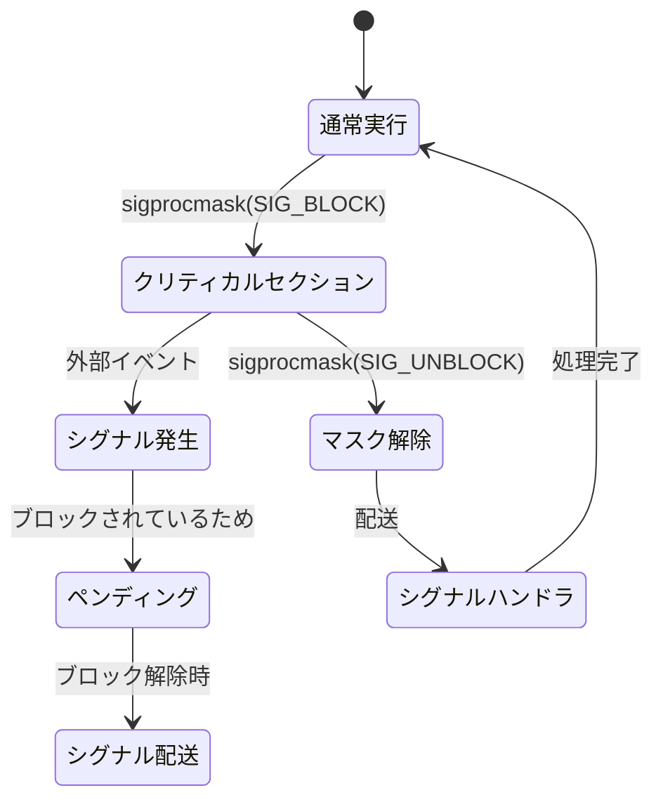

## リアルタイムシグナルの革新

POSIX.1b（1993年）で導入されたリアルタイムシグナルは、標準シグナルの制限を克服するために設計された。リアルタイムシグナルの範囲はSIGRTMINからSIGRTMAXまでで、Linuxでは通常34から64の範囲となる[^2]。

リアルタイムシグナルの主要な特徴：

**キューイング機能**：同じリアルタイムシグナルが複数回生成された場合、それぞれが個別にキューイングされる。これは標準シグナルの「失われるシグナル」問題を解決する。

**優先度付け**：番号の小さいシグナルほど高い優先度を持つ。複数のシグナルがペンディングの場合、優先度順に配送される。

**データ伝送**：sigqueue()システムコールにより、シグナルと共にデータを送信できる。

```c
union sigval {
    int sival_int;
    void *sival_ptr;
};

int sigqueue(pid_t pid, int sig, const union sigval value);
```

リアルタイムシグナルの使用例：

```c
// 送信側
union sigval value;
value.sival_int = 42;
sigqueue(target_pid, SIGRTMIN, value);

// 受信側（SA_SIGINFOフラグ必須）
void handler(int sig, siginfo_t *info, void *context) {
    printf("Received value: %d\n", info->si_value.sival_int);
}
```

Linuxカーネルは、リアルタイムシグナルのキューをリンクリストで管理する。RLIMIT_SIGPENDINGリソース制限により、プロセスごとのキューサイズが制限される。

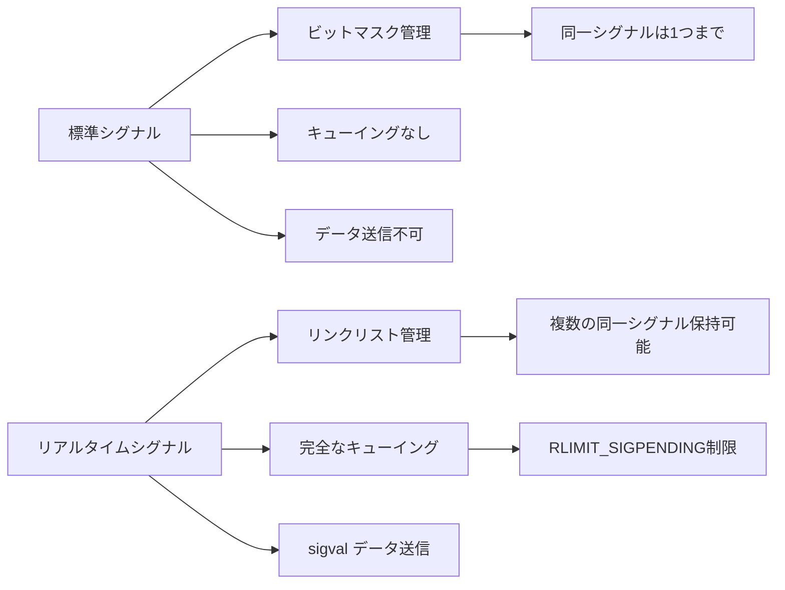

## シグナルハンドラの制約とシグナルセーフティ

シグナルハンドラ内で実行できる操作には厳しい制約がある。シグナルは非同期に発生するため、ハンドラはプログラムの任意の時点で実行される可能性がある。これにより、多くの関数がシグナルハンドラ内で安全に使用できない。

POSIX.1-2017では、async-signal-safe関数のリストが定義されている[^3]。主要なasync-signal-safe関数には以下がある：

- **基本的なI/O**: read(), write(), open(), close()
- **プロセス制御**: _exit(), fork(), execve()
- **シグナル操作**: sigaction(), sigprocmask(), kill()
- **その他**: dup(), pipe(), select(), poll()

一方、以下の関数は**async-signal-safeではない**：
- **stdio関数**: printf(), fprintf(), fopen()
- **メモリ管理**: malloc(), free()
- **スレッド関数**: pthread_mutex_lock()
- **その他多くの標準ライブラリ関数**

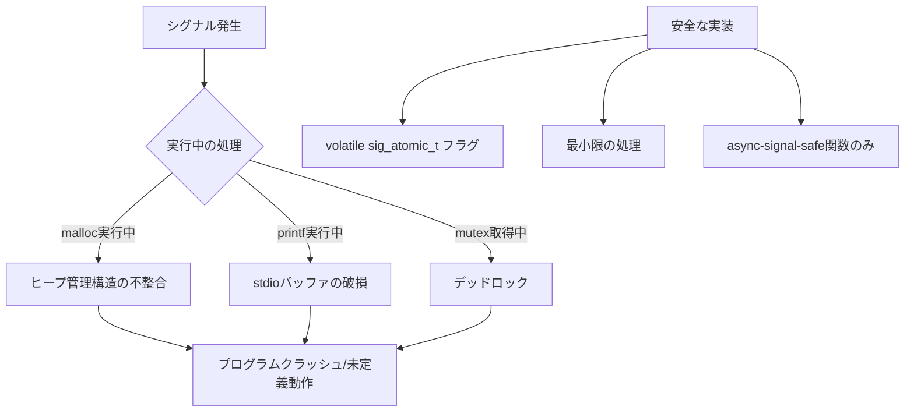

この制約に対処する一般的なパターン：

```c
volatile sig_atomic_t sig_flag = 0;

void signal_handler(int sig) {
    sig_flag = 1;  // フラグを設定するだけ
}

int main() {
    // メインループでフラグをチェック
    while (1) {
        if (sig_flag) {
            sig_flag = 0;
            // ここで実際の処理を実行
            handle_signal_event();
        }
        // 通常の処理
    }
}
```

## シグナルとマルチスレッド環境

POSIXスレッドの導入により、シグナル処理はさらに複雑になった。マルチスレッドプログラムにおけるシグナルの動作は以下の規則に従う：

1. **シグナルハンドラはプロセス全体で共有される**
2. **各スレッドは独自のシグナルマスクを持つ**
3. **同期シグナル（SIGSEGV等）は原因となったスレッドに配送される**
4. **非同期シグナルは、ブロックしていない任意のスレッドに配送される**

pthread_sigmask()は、スレッド単位でシグナルマスクを制御する：

```c
int pthread_sigmask(int how, const sigset_t *set, sigset_t *oldset);
```

推奨される設計パターンは、専用のシグナル処理スレッドを作成することである：

```c
void *signal_thread(void *arg) {
    sigset_t set;
    int sig;
    
    // 処理するシグナルを設定
    sigemptyset(&set);
    sigaddset(&set, SIGTERM);
    sigaddset(&set, SIGINT);
    sigaddset(&set, SIGUSR1);
    
    while (1) {
        // シグナルを同期的に待機
        if (sigwait(&set, &sig) == 0) {
            switch (sig) {
                case SIGTERM:
                case SIGINT:
                    // 終了処理
                    cleanup_and_exit();
                    break;
                case SIGUSR1:
                    // カスタム処理
                    handle_user_signal();
                    break;
            }
        }
    }
    return NULL;
}

int main() {
    pthread_t sig_thread;
    sigset_t set;
    
    // すべてのスレッドでシグナルをブロック
    sigfillset(&set);
    pthread_sigmask(SIG_BLOCK, &set, NULL);
    
    // シグナル処理スレッドを作成
    pthread_create(&sig_thread, NULL, signal_thread, NULL);
    
    // メイン処理
    // ...
}
```

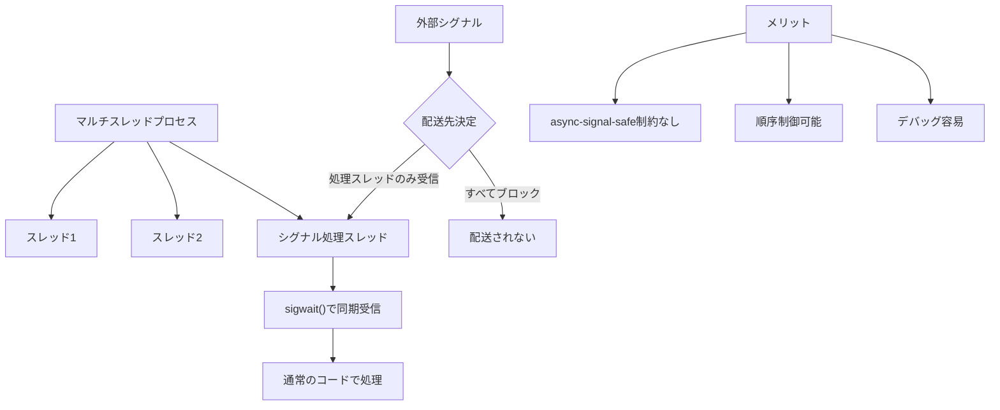

## signalfd()とイベント駆動アーキテクチャ

Linux 2.6.22で導入されたsignalfd()は、シグナルをファイルディスクリプタ経由で受信する革新的な仕組みである[^4]。これにより、シグナルをselect()、poll()、epoll()などの多重化メカニズムと統合できるようになった。

```c
#include <sys/signalfd.h>

int signalfd(int fd, const sigset_t *mask, int flags);
```

signalfd()の使用例：

```c
sigset_t mask;
int sfd;

// シグナルをブロック（重要！）
sigemptyset(&mask);
sigaddset(&mask, SIGTERM);
sigaddset(&mask, SIGINT);
sigprocmask(SIG_BLOCK, &mask, NULL);

// signalfdを作成
sfd = signalfd(-1, &mask, SFD_CLOEXEC);

// epollと統合
struct epoll_event ev;
ev.events = EPOLLIN;
ev.data.fd = sfd;
epoll_ctl(epfd, EPOLL_CTL_ADD, sfd, &ev);

// イベントループ内で処理
struct signalfd_siginfo fdsi;
ssize_t s = read(sfd, &fdsi, sizeof(fdsi));
if (s == sizeof(fdsi)) {
    printf("Received signal %d from PID %d\n", 
           fdsi.ssi_signo, fdsi.ssi_pid);
}
```

signalfd()の利点：
- シグナルハンドラの制約を回避
- 他のI/Oイベントと統一的に処理可能
- エラー処理が容易
- デバッグが簡単

## io_uringとシグナル処理の未来

最新のLinuxカーネル（5.1以降）では、io_uringが新しいI/O処理パラダイムを提供している。io_uringは、シグナルを含む様々なイベントを統一的に扱うことができる。

```c
struct io_uring_sqe *sqe = io_uring_get_sqe(&ring);
io_uring_prep_poll_add(sqe, signalfd, POLLIN);
io_uring_submit(&ring);
```

この統合により、従来のシグナル処理の複雑さが大幅に軽減される可能性がある。

## カーネル実装の詳細

Linuxカーネルにおけるシグナル実装は、効率性と正確性のバランスを追求している。主要なデータ構造は以下の通り：

```c
// task_struct内のシグナル関連フィールド
struct task_struct {
    struct signal_struct *signal;     // プロセスグループ共有
    struct sighand_struct *sighand;   // ハンドラ情報
    sigset_t blocked;                 // スレッド固有のマスク
    struct sigpending pending;        // スレッド固有のペンディング
    // ...
};

struct sigpending {
    struct list_head list;            // シグナルキューのリスト
    sigset_t signal;                  // ペンディングシグナルのビットマスク
};
```

シグナル配送のアルゴリズム：

1. **do_signal()**がアーキテクチャ非依存のエントリポイント
2. **get_signal()**でペンディングシグナルを取得
3. **handle_signal()**でユーザー空間スタックにシグナルフレームを構築
4. ハンドラのアドレスをセットしてユーザー空間に復帰

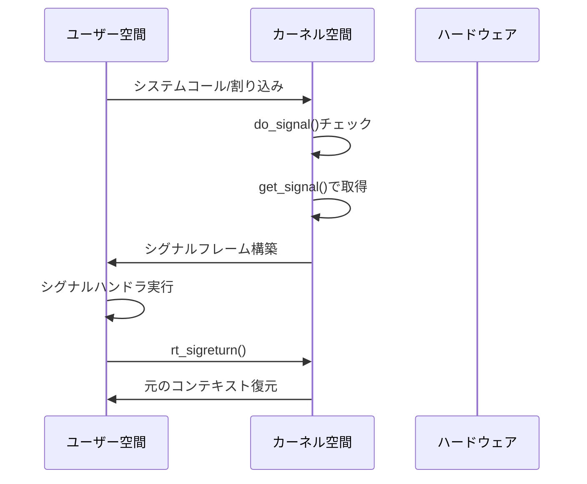

## パフォーマンスとスケーラビリティ

シグナル処理のパフォーマンス特性を理解することは、高性能システムの設計において重要である。主要なオーバーヘッドは以下の要因から生じる：

1. **コンテキストスイッチ** - シグナルハンドラの呼び出しには完全なコンテキストの保存と復元が必要
2. **キャッシュ効果** - シグナルハンドラの実行によりCPUキャッシュが乱される
3. **システムコール** - sigprocmask()等の頻繁な呼び出しはオーバーヘッドとなる

ベンチマーク結果（典型的な値）：
- シグナル送信（kill）: 1-2 マイクロ秒
- シグナル配送とハンドラ実行: 5-10 マイクロ秒
- sigprocmask()呼び出し: 0.5-1 マイクロ秒

高頻度のイベント処理には、シグナル以外のメカニズム（eventfd、futex、共有メモリ）の使用が推奨される。

## セキュリティとシグナル

シグナルはセキュリティの観点からも重要な考慮事項である。基本的なセキュリティ規則：

1. **権限チェック** - プロセスは同じUID、または特権（CAP_KILL）を持つ場合のみシグナル送信可能
2. **PID名前空間** - コンテナ環境では、PID名前空間によりシグナルの影響範囲が制限される
3. **seccompフィルタ** - システムコールレベルでシグナル関連の操作を制限可能

シグナルハンドラのセキュリティ脆弱性：
- **TOCTOU（Time-of-check to time-of-use）** - チェックと使用の間の競合状態
- **再入攻撃** - 同じハンドラの多重実行による予期しない動作
- **情報漏洩** - シグナルハンドラ経由での意図しない情報開示

## 実装のベストプラクティス

長年の経験から導かれたシグナル処理のベストプラクティス：

**設計原則**：
1. シグナルハンドラは最小限の処理に留める
2. 可能な限りsignalfd()やsigwait()を使用して同期的に処理
3. マルチスレッドプログラムでは専用スレッドでシグナル処理
4. リアルタイムシグナルは本当に必要な場合のみ使用

**実装指針**：
```c
// 推奨: self-pipe trick
int signal_pipe[2];
void signal_handler(int sig) {
    char a = 1;
    write(signal_pipe[1], &a, 1);  // async-signal-safe
}

// メインループでpipeを監視
```

**デバッグとトラブルシューティング**：
- `strace -e trace=signal` - シグナル関連システムコールのトレース
- `/proc/[pid]/status` - SigBlk、SigIgn、SigPndフィールドでシグナル状態確認
- `gdb` - handle commandでシグナル処理を制御

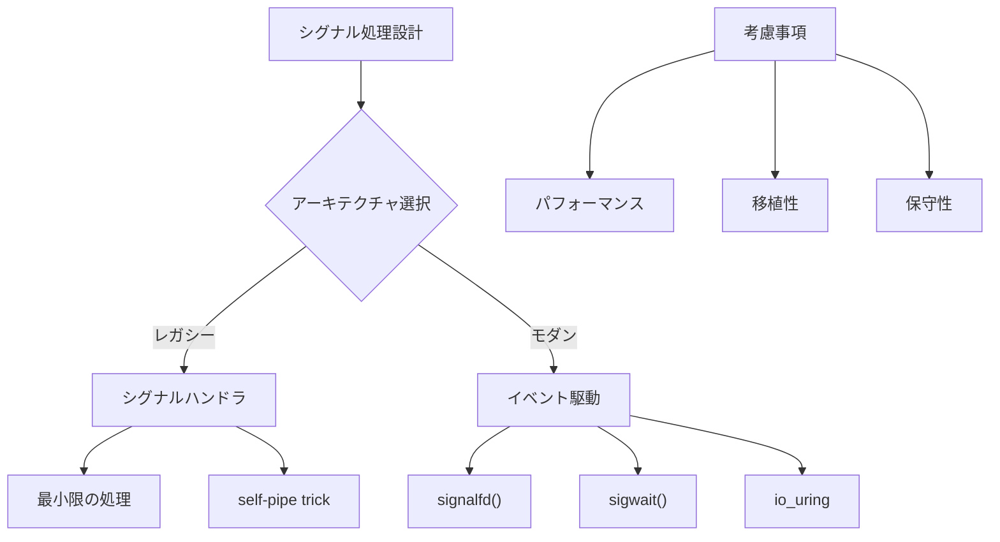

シグナルメカニズムは、Unixシステムの基礎を成す重要な機能として、40年以上にわたって進化を続けてきた。その複雑性と制約にもかかわらず、あるいはそれゆえに、システムプログラミングの本質を理解する上で不可欠な知識となっている。新しい非同期I/Oメカニズムが登場しても、シグナルの基本概念は、オペレーティングシステムとアプリケーションの相互作用を理解する上で重要であり続けるだろう。

---

[^1]: W. Richard Stevens, Stephen A. Rago, "Advanced Programming in the UNIX Environment, 3rd Edition", Addison-Wesley Professional, 2013
[^2]: IEEE Std 1003.1b-1993, "IEEE Standard for Information Technology—Portable Operating System Interface (POSIX®)—Part 1: System Application Program Interface (API)—Amendment 1: Realtime Extension [C Language]"
[^3]: The Open Group Base Specifications Issue 7, 2018 Edition, IEEE Std 1003.1-2017
[^4]: Michael Kerrisk, "The Linux Programming Interface: A Linux and UNIX System Programming Handbook", No Starch Press, 2010