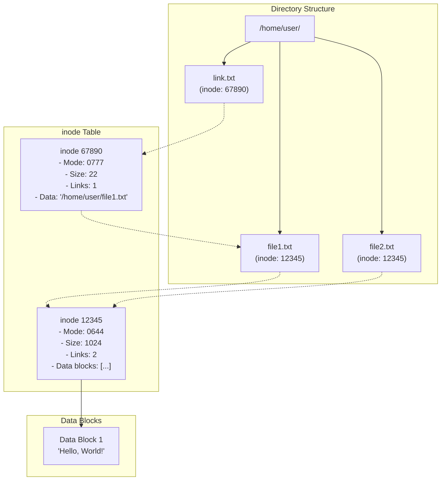
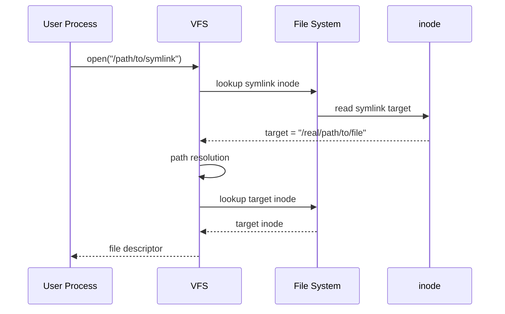
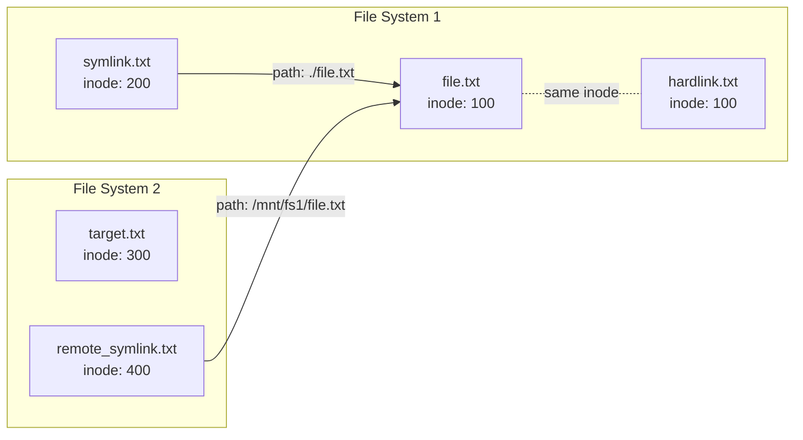

# Soft Link と Hard Link：Linuxファイルシステムにおけるリンク機構の深層理解

Linuxファイルシステムにおけるリンク機構は、ファイルへの複数のアクセスパスを提供する重要な機能である。ハードリンクとソフトリンク（シンボリックリンク）という2つの異なるメカニズムは、それぞれ独自の特性と用途を持ち、ファイルシステムの柔軟性と効率性を大幅に向上させている。本稿では、これらのリンク機構の内部動作、実装詳細、そして実践的な利用指針について詳細に解説する。

## ファイルシステムの基本構造とinode

リンク機構を理解するためには、まずLinuxファイルシステムの基本構造、特にinodeの概念を正確に把握する必要がある。POSIX.1-2017標準[^1]において、inodeは「ファイルに関するすべての情報を含むオブジェクト」として定義されている。より具体的には、inodeはファイルのメタデータを格納するデータ構造であり、ファイル名を除くすべての属性情報を保持している。



inodeには以下の情報が含まれる：
- ファイルタイプとアクセス権限（mode）
- 所有者とグループのID（uid、gid）
- ファイルサイズ
- タイムスタンプ（atime、mtime、ctime）
- リンク数（hard link count）
- データブロックへのポインタ

ext4ファイルシステムの実装では、struct ext4_inode構造体が256バイトのサイズを持ち、拡張属性やextentツリーなどの高度な機能をサポートしている[^2]。ファイル名とinodeの関連付けは、ディレクトリエントリ（dentry）によって管理される。つまり、ディレクトリは本質的に「ファイル名からinode番号へのマッピング」を提供するテーブルとして機能している。

## ハードリンクの仕組みと内部動作

ハードリンクは、同一のinodeを指す複数のディレクトリエントリを作成することで実現される。link(2)システムコール[^3]は、既存ファイルのinodeに対して新しいディレクトリエントリを追加し、inodeのリンクカウントをインクリメントする。この操作は原子的に実行され、ファイルシステムの整合性が保たれる。

```c
// Simplified kernel implementation of link system call
int do_linkat(int olddfd, const char __user *oldname, 
              int newdfd, const char __user *newname, int flags)
{
    struct path old_path, new_path;
    struct dentry *new_dentry;
    struct inode *inode;
    int error;
    
    // Resolve old path and get inode
    error = user_path_at(olddfd, oldname, lookup_flags, &old_path);
    if (error)
        return error;
    
    inode = old_path.dentry->d_inode;
    
    // Create new directory entry pointing to same inode
    new_dentry = kern_path_create(newdfd, newname, &new_path, lookup_flags);
    
    // Increment link count and add directory entry
    error = vfs_link(old_path.dentry, new_path.dentry->d_inode, new_dentry, NULL);
    
    return error;
}
```

ハードリンクの重要な特性として、すべてのリンクが対等であることが挙げられる。「オリジナル」と「リンク」の区別は存在せず、どのディレクトリエントリも同じinodeを指している。ファイルの削除（unlink(2)）は、実際にはディレクトリエントリの削除とリンクカウントのデクリメントを行い、カウントが0になった時点で初めてinodeとデータブロックが解放される。

ハードリンクには以下の制約が存在する：
1. **同一ファイルシステム内でのみ作成可能**：inodeはファイルシステム固有の識別子であるため、異なるファイルシステム間でのハードリンクは不可能である
2. **ディレクトリへのハードリンク作成は禁止**：ディレクトリ構造の循環を防ぐため、POSIX標準では明示的に禁止されている（ただし、"."と".."は例外）
3. **特殊ファイルへの制限**：デバイスファイルやソケットなど、一部の特殊ファイルへのハードリンク作成は制限される場合がある

## ソフトリンク（シンボリックリンク）の実装と特性

ソフトリンクは、symlink(2)システムコール[^4]によって作成される特殊なファイルタイプである。通常のファイルとは異なり、ソフトリンクのinodeは実際のデータではなく、ターゲットファイルへのパス名を格納している。カーネルのVFS（Virtual File System）層は、ソフトリンクへのアクセス時に自動的にパス解決を行い、ターゲットファイルへリダイレクトする。



ext4ファイルシステムでは、60バイト以下の短いパス名は「fast symlink」として、inodeの中に直接格納される。これにより、追加のディスクI/Oを回避し、パフォーマンスを向上させている。より長いパス名の場合は、通常のファイルと同様にデータブロックが割り当てられる。

ソフトリンクの解決プロセスは、以下の手順で実行される：
1. VFS層がファイルアクセス要求を受け取る
2. パス解決中にS_ISLNKフラグを持つinodeを検出
3. follow_link()メソッドを呼び出してターゲットパスを取得
4. 取得したパスで再帰的にパス解決を実行
5. ELOOP（シンボリックリンクループ）検出のため、解決回数をカウント（通常は40回が上限）

ソフトリンクの重要な特性として、ターゲットファイルの存在を前提としないことがある。これにより、存在しないファイルへのリンク（dangling link）が作成可能であり、後からターゲットファイルを作成することができる。この柔軟性は、動的な環境構築やパッケージ管理システムで広く活用されている。

## ハードリンクとソフトリンクの比較分析

両リンク機構の違いは、ファイルシステムレベルでの実装方法に起因している。以下の表は、主要な違いを整理したものである：

| 特性 | ハードリンク | ソフトリンク |
|------|------------|------------|
| inode共有 | 同一inodeを共有 | 独自のinodeを持つ |
| ファイルシステム跨ぎ | 不可 | 可能 |
| ディレクトリリンク | 不可 | 可能 |
| リンク切れ | 発生しない | 発生する可能性あり |
| ディスク使用量 | 追加使用なし | パス名分の容量使用 |
| パフォーマンス | 直接アクセス | パス解決のオーバーヘッド |

性能面では、ハードリンクは追加のパス解決が不要なため、アクセス速度で優位性を持つ。一方、ソフトリンクは柔軟性に優れ、異なるファイルシステム間のリンクや、マウントポイントを跨ぐリンクの作成が可能である。



## 実装の詳細と性能特性

Linuxカーネルにおけるリンク操作の実装は、VFS層で抽象化されており、各ファイルシステムは独自の最適化を実装できる。ext4では、ディレクトリエントリの検索にHTreeインデックス[^5]を使用し、大規模ディレクトリでのリンク作成・削除のパフォーマンスを向上させている。

ハードリンクの作成は、以下のコストを伴う：
- ディレクトリエントリの追加：O(1)〜O(log n)（ディレクトリサイズに依存）
- inodeのリンクカウント更新：O(1)
- ジャーナリング（ext4の場合）：メタデータ変更の記録

ソフトリンクの作成コストは：
- 新規inode割り当て：O(1)
- パス名の格納：O(パス長)
- ディレクトリエントリの追加：O(1)〜O(log n)

アクセス時のパフォーマンス差は、ワークロードに大きく依存する。頻繁にアクセスされるソフトリンクは、dentryキャッシュとinodeキャッシュによって高速化される。しかし、コールドキャッシュ状態では、ソフトリンクの解決に追加のディスクI/Oが発生する可能性がある。

## 実践的な設計指針と利用パターン

リンク機構の選択は、システムの要件と制約に基づいて行うべきである。以下に、実践的な利用指針を示す：

**ハードリンクが適している場合：**
- 同一ファイルシステム内でのファイル共有
- ディスク容量の節約が重要な場合（大容量ファイルの複製回避）
- 高頻度アクセスでパフォーマンスが重要な場合
- バックアップシステム（rsyncの--link-destオプションなど）

**ソフトリンクが適している場合：**
- ファイルシステムを跨ぐ必要がある場合
- 動的な設定管理（/etc/alternativesなど）
- ディレクトリ構造の再編成
- バージョン管理（current -> version-2.0のようなリンク）

セキュリティ面では、両リンク機構に異なる考慮事項がある。ハードリンクは、ファイルの所有者が変更されても、既存のハードリンクから引き続きアクセス可能であるため、機密ファイルの管理には注意が必要である。一方、ソフトリンクは、シンボリックリンク攻撃の対象となる可能性があり、特に一時ディレクトリでの使用には注意が必要である。

パフォーマンスチューニングの観点では、ファイルシステムのマウントオプションも重要である。ext4のdir_indexオプションは、大規模ディレクトリでのリンク操作を高速化する。また、relatimeやnoatimeオプションは、アクセス時刻の更新を制御し、I/O負荷を軽減できる。

現代的なアプリケーションでは、コンテナ技術との組み合わせでリンク機構が活用されている。Dockerのレイヤーファイルシステムは、ハードリンクを使用してイメージレイヤー間でファイルを共有し、ストレージ効率を向上させている。また、Kubernetesのボリュームマウントでは、ソフトリンクを使用して設定ファイルの動的な切り替えを実現している。

[^1]: IEEE Std 1003.1-2017 (POSIX.1-2017), The Open Group Base Specifications Issue 7
[^2]: Linux Kernel Documentation, "ext4 Data Structures and Algorithms", https://www.kernel.org/doc/html/latest/filesystems/ext4/
[^3]: Linux Programmer's Manual, link(2) - make a new name for a file
[^4]: Linux Programmer's Manual, symlink(2) - make a new name for a file
[^5]: Theodore Ts'o, "HTree Directory Indexing for Ext2", Ottawa Linux Symposium 2002