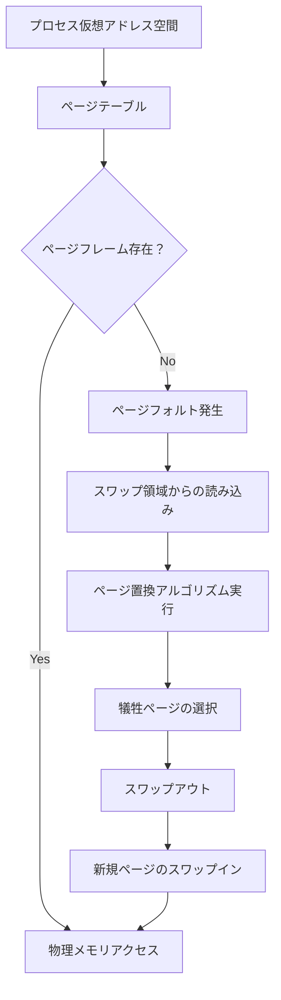
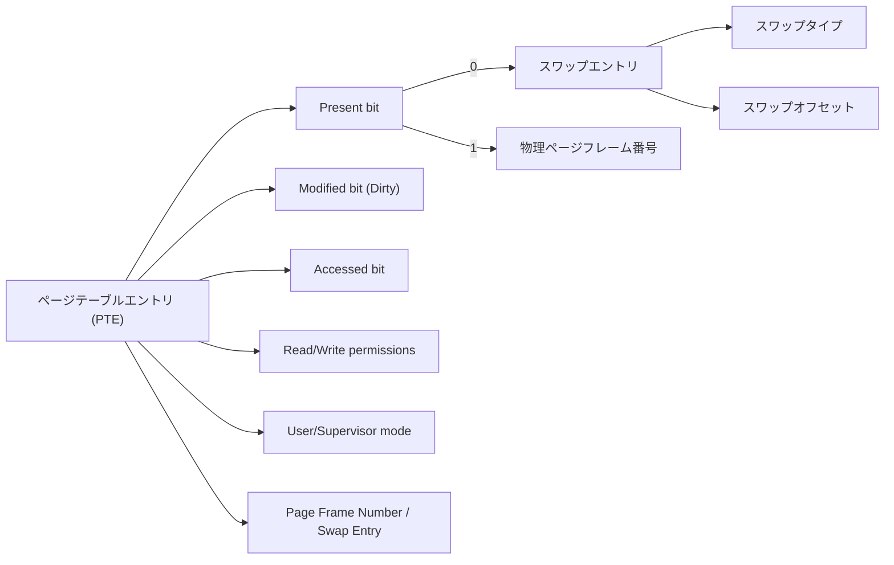
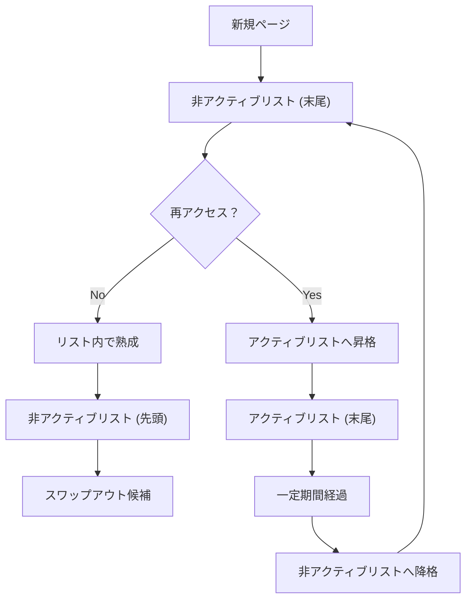
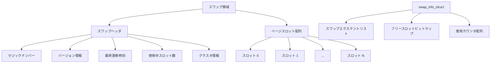
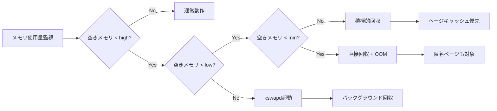
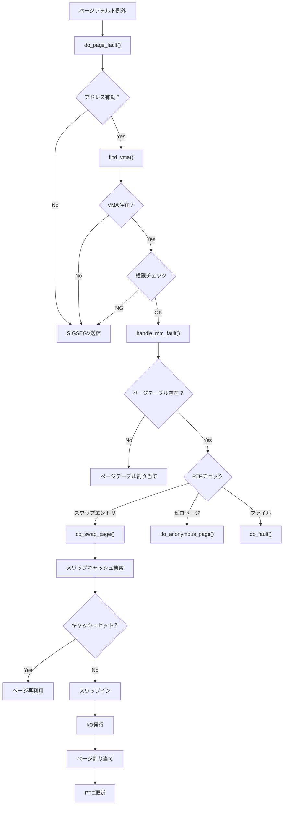
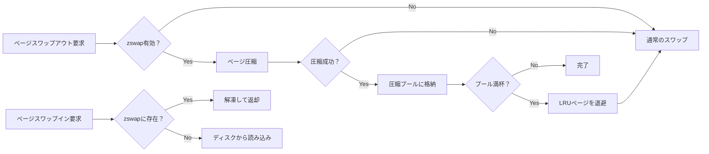
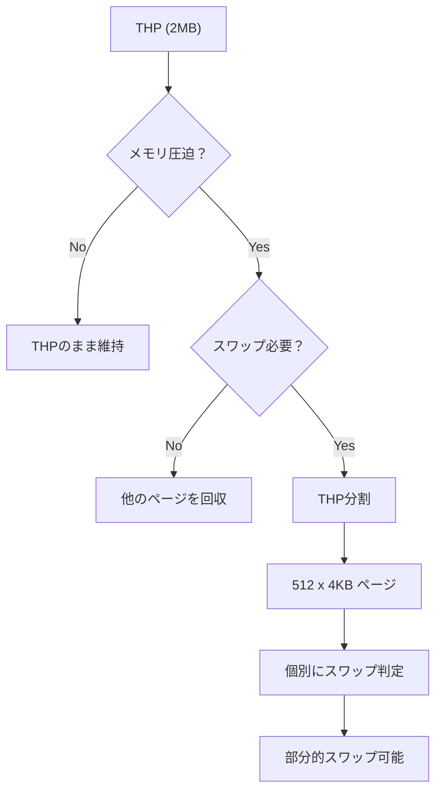
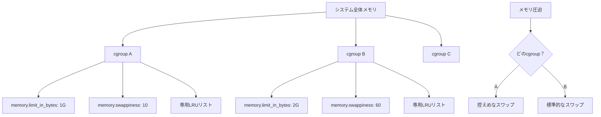
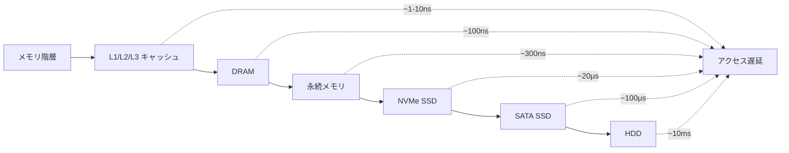

# スワッピング

スワッピングは、物理メモリの容量を超える仮想メモリ空間をプロセスに提供するための基本的なメカニズムである。現代のオペレーティングシステムにおいて、スワッピングは仮想記憶システムの中核を成す技術であり、限られた物理メモリ資源を効率的に活用することを可能にする。本稿では、スワッピングの動作原理、実装の詳細、性能への影響、そしてLinuxカーネルにおける具体的な実装について、深く掘り下げて解説する。

## 仮想記憶とスワッピングの基本概念

仮想記憶システムは、プロセスが物理メモリの実アドレスを直接扱うのではなく、仮想アドレス空間を通じてメモリにアクセスする仕組みを提供する。この抽象化により、各プロセスは独立した連続的なアドレス空間を持つことができ、物理メモリの断片化や他のプロセスとの干渉を意識する必要がなくなる。スワッピングは、この仮想記憶システムにおいて、物理メモリに収まりきらないデータを二次記憶装置（通常はディスク）に退避させ、必要に応じて再度メモリに読み込む機能を指す。



スワッピングの必要性は、現代のコンピュータシステムにおけるメモリ需要の増大から生じる。多数のプロセスが同時に実行され、それぞれが大量のメモリを要求する環境では、物理メモリの容量は常に制約となる。スワッピングにより、システムは物理メモリを超える仮想メモリ空間を提供でき、メモリ不足によるプロセスの実行不能を回避できる。ただし、この機能には性能面でのトレードオフが存在し、ディスクアクセスの遅延がシステム全体のパフォーマンスに大きな影響を与える可能性がある。

## ページング方式とスワッピングメカニズム

現代のシステムでは、スワッピングは主にページング方式で実装される。ページングは、仮想アドレス空間と物理メモリを固定サイズのページ（通常4KB）に分割し、必要に応じて個々のページを独立してスワップする方式である。この方式は、プロセス全体をスワップするセグメント方式と比較して、より細かい粒度でメモリ管理を行うことができ、効率的なメモリ利用を可能にする。

ページテーブルは、仮想ページから物理ページフレームへのマッピングを管理する重要なデータ構造である。各ページテーブルエントリ（PTE）には、対応する物理ページフレームのアドレスに加えて、そのページの状態を示す各種フラグが含まれる。特に重要なのはPresentビットであり、このビットがクリアされている場合、該当ページは物理メモリ上に存在せず、スワップ領域に退避されていることを示す。



プロセスがスワップアウトされたページにアクセスしようとすると、MMU（Memory Management Unit）はPresentビットがクリアされていることを検出し、ページフォルト例外を発生させる。この例外はカーネルのページフォルトハンドラによって処理され、必要なページをスワップ領域から物理メモリに読み込む処理が開始される。この一連の処理は、アプリケーションプログラムからは透過的に行われるため、プログラマはスワッピングの存在を意識することなくプログラムを記述できる。

## ページ置換アルゴリズム

メモリが逼迫した状況でスワップインが必要になった場合、新しいページを格納するための空き領域を確保する必要がある。このとき、どのページをスワップアウトするかを決定するのがページ置換アルゴリズムである。理想的には、将来最も長く使用されないページを選択すべきだが、これは未来の参照パターンを予測する必要があり、実用的ではない。そのため、過去の参照履歴に基づいて将来の挙動を推測する各種のアルゴリズムが開発されている。

LRU（Least Recently Used）アルゴリズムは、最も長く参照されていないページを置換対象とする方式である。このアルゴリズムは、時間的局所性の原理に基づいており、最近参照されたページは近い将来再び参照される可能性が高いという仮定に立っている。純粋なLRUの実装には、すべてのメモリアクセスを追跡する必要があり、ハードウェアサポートなしには実現が困難である。

Linuxカーネルでは、LRUの近似アルゴリズムとして、アクティブリストと非アクティブリストを用いた2段階LRUが実装されている。新しくアクセスされたページは非アクティブリストに追加され、再度アクセスされるとアクティブリストに昇格する。メモリ回収時には、まず非アクティブリストの末尾からページが選択される。この方式により、純粋なLRUに近い効果を、より少ないオーバーヘッドで実現している。



Clock アルゴリズム（Second Chance アルゴリズムとも呼ばれる）は、LRUの簡略化された実装である。各ページにはアクセスビット（参照ビット）が設定され、ページがアクセスされるとハードウェアによってこのビットがセットされる。ページ置換時には、循環リストを時計回りに走査し、アクセスビットがクリアされているページを見つけたらそれを置換対象とする。アクセスビットがセットされているページに遭遇した場合は、そのビットをクリアして次のページに進む。これにより、最近アクセスされたページには「セカンドチャンス」が与えられる。

## スワップ領域の管理と実装

スワップ領域は、スワップアウトされたページを格納するための二次記憶装置上の領域である。Linuxでは、専用のスワップパーティションまたはスワップファイルとして実装される。スワップパーティションは、ファイルシステムのオーバーヘッドを避けることができるため、わずかに高速である。一方、スワップファイルは柔軟性が高く、動的にサイズを変更したり、複数のファイルシステムにまたがって配置したりすることができる。

スワップ領域の内部構造は、効率的なページの格納と検索を可能にするよう設計されている。各スワップ領域の先頭には、スワップヘッダが配置され、そこにはマジックナンバー、バージョン情報、使用中のスロット数などのメタデータが格納される。実際のページデータは、ページサイズと同じ大きさのスロットに格納される。



カーネルは、各スワップ領域に対してswap_info_struct構造体を維持する。この構造体には、スワップ領域の物理的な配置を記述するエクステントリスト、空きスロットを追跡するビットマップ、各スロットの使用回数を記録するカウンタ配列などが含まれる。エクステントリストは、スワップファイルが断片化している場合でも効率的なアクセスを可能にする。

スワップエントリは、スワップされたページの位置を一意に識別する64ビットの値である。この値は、スワップタイプ（どのスワップ領域か）とオフセット（その領域内のどのスロットか）から構成される。ページテーブルエントリがスワップされたページを指す場合、物理ページフレーム番号の代わりにこのスワップエントリが格納される。

## メモリ圧迫とスワップの発動

Linuxカーネルは、メモリ圧迫を検出し、適切なタイミングでスワップを開始するための洗練されたメカニズムを持っている。メモリ圧迫の判定には、ゾーンごとの空きメモリ量、ファイルキャッシュの量、匿名ページの量などが考慮される。カーネルは、各メモリゾーンに対して最小（min）、低（low）、高（high）の3つの閾値を設定し、これらを基準にメモリ回収の必要性を判断する。



kswapdは、各NUMAノードに対して1つずつ存在するカーネルスレッドで、バックグラウンドでメモリ回収を行う。空きメモリがlow閾値を下回ると起動され、high閾値に達するまでメモリを回収し続ける。この予防的なアプローチにより、多くの場合、アプリケーションが直接メモリ回収の遅延を経験することを避けることができる。

直接回収は、メモリ割り当て要求を行ったプロセスのコンテキストで実行される同期的なメモリ回収である。kswapdが十分な速度でメモリを回収できない場合や、特定のゾーンからのメモリ要求に対応する必要がある場合に発生する。直接回収は、要求されたメモリが確保できるまでブロックするため、アプリケーションの遅延に直接影響する。

## スワップの性能特性とチューニング

スワップの性能は、システム全体のパフォーマンスに重大な影響を与える。ディスクアクセスは、メモリアクセスと比較して桁違いに遅い。DDR4メモリのアクセス遅延が数十ナノ秒であるのに対し、SSDでも数十マイクロ秒、HDDでは数ミリ秒に達する。この遅延の差は、頻繁にスワップが発生する状況では、システム全体の応答性を著しく低下させる。

swappinessパラメータは、カーネルがファイルキャッシュと匿名ページのどちらを優先的に回収するかを制御する重要なチューニングパラメータである。値の範囲は0から100で、デフォルトは60である。低い値は匿名ページのスワップアウトを抑制し、高い値はより積極的にスワップを使用する。データベースサーバーなど、メモリ内のデータの維持が重要なワークロードでは、swappinessを低く設定することが推奨される。

```bash
# swappiness の確認と変更
cat /proc/sys/vm/swappiness
echo 10 > /proc/sys/vm/swappiness
# 永続化する場合は /etc/sysctl.conf に記述
# vm.swappiness = 10
```

ゾーン回収モード（zone_reclaim_mode）は、NUMAシステムにおいて、リモートノードからメモリを割り当てる前に、ローカルノードでメモリ回収を試みるかどうかを制御する。このパラメータの設定は、メモリアクセスのローカリティとメモリ利用効率のトレードオフを表す。

スワップの使用状況は、/proc/meminfoや各種監視ツールで確認できる。SwapTotal、SwapFree、SwapCachedなどの値を監視することで、システムのスワップ使用パターンを把握できる。特にSwapCachedは、スワップ領域とメモリの両方に存在するページの量を示し、効率的なスワップ管理の指標となる。

## ページフォルトの処理フロー

ページフォルトは、プロセスが有効でないページテーブルエントリを参照したときに発生する例外である。スワップに関連するページフォルトは、メジャーページフォルトと呼ばれ、ディスクI/Oを伴うため、処理に相対的に長い時間を要する。ページフォルトハンドラは、フォルトの原因を特定し、適切な処理を実行する複雑なロジックを持つ。



do_swap_page()関数は、スワップされたページの処理を担当する。まず、スワップキャッシュを検索し、該当ページが既にメモリ上に存在するかを確認する。スワップキャッシュは、最近スワップインされたページや、スワップアウト予定だがまだメモリ上に残っているページを管理する。キャッシュヒットした場合は、ディスクI/Oを避けてページを再利用できる。

キャッシュミスの場合は、実際のスワップイン処理が必要となる。この処理には、新しいページの割り当て、スワップ領域からのデータ読み込み、ページテーブルエントリの更新などが含まれる。読み込みが完了すると、ページはプロセスのアドレス空間にマップされ、フォルトを起こした命令の再実行が可能になる。

## スワップの最適化技術

現代のLinuxカーネルには、スワップの性能を改善するための様々な最適化技術が実装されている。スワップクラスタリングは、連続した複数のページをまとめてスワップすることで、ディスクI/Oの効率を向上させる。多くのプログラムは、メモリアクセスに空間的局所性を示すため、隣接するページも近い将来アクセスされる可能性が高い。

フロントスワップ（Frontswap）は、スワップデータを圧縮メモリやリモートメモリなど、ディスクよりも高速な代替ストレージに格納する機構である。zswapは、フロントスワップの実装の一つで、スワップアウトされるページを圧縮してメモリ内に保持する。圧縮により、実効的なメモリ容量を増加させつつ、ディスクI/Oを削減できる。



MADVISE_FREEやMADVISE_COLDなどのメモリアドバイザリは、アプリケーションがカーネルにメモリ使用パターンのヒントを提供する機構である。これらのヒントを活用することで、カーネルはより効果的なページ置換決定を行うことができる。例えば、MADVISE_FREEでマークされたページは、メモリ圧迫時に内容を保存することなく即座に回収できる。

## トランスペアレントヒュージページとスワップ

トランスペアレントヒュージページ（THP）は、通常の4KBページの代わりに2MBの大きなページを透過的に使用する機能である。THPは、TLB（Translation Lookaside Buffer）ミスを削減し、アドレス変換のオーバーヘッドを軽減する。しかし、THPのスワップには特別な考慮が必要である。

2MBのページ全体をスワップすることは、I/O量が大きくなり、レイテンシが増大する。そのため、カーネルはTHPをスワップする前に、512個の4KBページに分割（split）することがある。この分割処理自体にもオーバーヘッドがあるため、THPとスワップの相互作用は複雑な性能特性を示す。



khugepaged は、断片化した4KBページを定期的にスキャンし、可能な場合は2MBのヒュージページに統合するカーネルスレッドである。スワップインされたページも、条件が整えば再度ヒュージページに統合される可能性がある。この動的な統合と分割により、メモリ使用効率とスワップ性能のバランスが保たれる。

## コンテナ環境でのスワップ管理

コンテナ技術の普及により、スワップ管理にも新たな課題が生じている。cgroupsのメモリコントローラは、コンテナごとにメモリ使用量を制限し、独立したメモリ圧迫の検出と回収を可能にする。各cgroupは独自のLRUリストを持ち、グループ内でのページ置換が行われる。

memory.swappinessパラメータは、cgroupレベルでスワップの積極性を制御する。これにより、重要なサービスを実行するコンテナではスワップを抑制し、バッチ処理用のコンテナでは積極的にスワップを使用するといった、きめ細かな制御が可能になる。



memory.swap.maxパラメータは、cgroup v2で導入された、スワップ使用量の上限を設定する機能である。これにより、特定のコンテナがスワップ領域を独占することを防ぎ、公平なリソース配分を実現できる。ただし、スワップ制限に達したコンテナは、OOM（Out of Memory）キラーの対象となりやすくなるため、適切な設定が重要である。

## 最新のハードウェアとスワップ戦略

NVMe SSDの普及により、スワップデバイスのレイテンシは大幅に改善された。従来のHDDでは数ミリ秒だったランダムアクセス時間が、NVMe SSDでは数十マイクロ秒にまで短縮されている。この性能向上により、スワップのコストが相対的に低下し、より積極的なスワップ戦略が現実的になっている。

Intel Optane DCPMMなどの永続メモリ技術は、DRAMに近い性能を持ちながら、電源断でもデータを保持する特性を持つ。これらのデバイスをスワップデバイスとして使用することで、従来のスワップとは異なる性能特性を実現できる。カーネルは、これらの新しいメモリ階層に対応するため、継続的に進化している。



Multi-queue block layerは、現代の高速ストレージデバイスの性能を最大限に引き出すためのI/Oスタックである。スワップI/Oも、このマルチキューアーキテクチャの恩恵を受け、複数のCPUコアから並列にI/O要求を発行できる。これにより、高IOPS（Input/Output Operations Per Second）のデバイスでも、スワップ性能のボトルネックを回避できる。

## デバッグとトラブルシューティング

スワップ関連の問題を診断するには、様々なツールと手法が利用できる。/proc/vminfoは、仮想メモリサブシステムの詳細な統計情報を提供する。pswpin、pswpout カウンタは、スワップインとスワップアウトの回数を示し、システムのスワップ活動を定量的に把握できる。

```bash
# スワップ統計の確認
vmstat 1
# si: スワップイン (KB/s)
# so: スワップアウト (KB/s)

# プロセスごとのスワップ使用量
for pid in $(ls /proc | grep -E '^[0-9]+$'); do
    if [ -r /proc/$pid/status ]; then
        vmswap=$(awk '/VmSwap/ {print $2}' /proc/$pid/status 2>/dev/null)
        if [ -n "$vmswap" ] && [ "$vmswap" -gt 0 ]; then
            echo "PID: $pid, Swap: ${vmswap}kB, Process: $(cat /proc/$pid/comm 2>/dev/null)"
        fi
    fi
done | sort -k4 -n
```

tracepoints とkprobesは、カーネル内のスワップ処理を詳細に追跡するための機構である。mm_vmscan_*やmm_page_*などのトレースポイントを使用することで、ページ回収やスワップの動作をリアルタイムで観察できる。これらのツールは、性能問題の根本原因を特定する際に特に有用である。

OOMキラーは、システムが極度のメモリ不足に陥った際の最終手段である。スワップ領域も含めてすべてのメモリが枯渇した場合、カーネルはプロセスを強制終了してメモリを回収する。OOMスコアアルゴリズムは、どのプロセスを終了するかを決定し、システムへの影響を最小限に抑えようとする。/proc/[pid]/oom_score_adjを調整することで、特定のプロセスの終了優先度を制御できる。

スワップストームは、過度なスワップ活動によりシステムがほぼ停止状態になる現象である。この状態では、プロセスがページフォルトを起こすたびに他のページをスワップアウトする必要があり、連鎖的にページフォルトが発生する。スワップストームの検出と回避は、システムの安定性維持において重要な課題である。

本稿では、Linuxにおけるスワッピングの包括的な技術詳細を解説した。スワッピングは、限られた物理メモリリソースを効率的に活用するための基本的なメカニズムであり、その実装には多くの最適化と複雑な制御ロジックが含まれている。ハードウェアの進化とワークロードの多様化に伴い、スワッピング技術も継続的に進化している。システム管理者や開発者は、これらの仕組みを理解することで、より効果的なシステムチューニングと問題解決が可能になる。