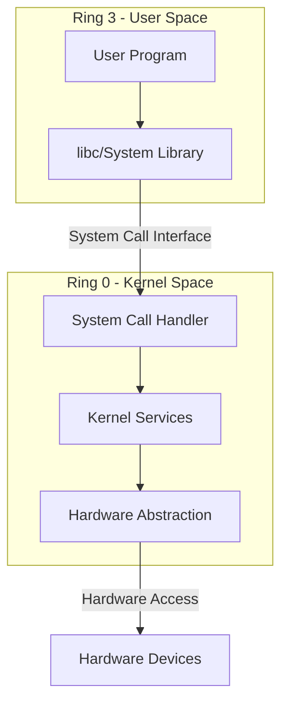
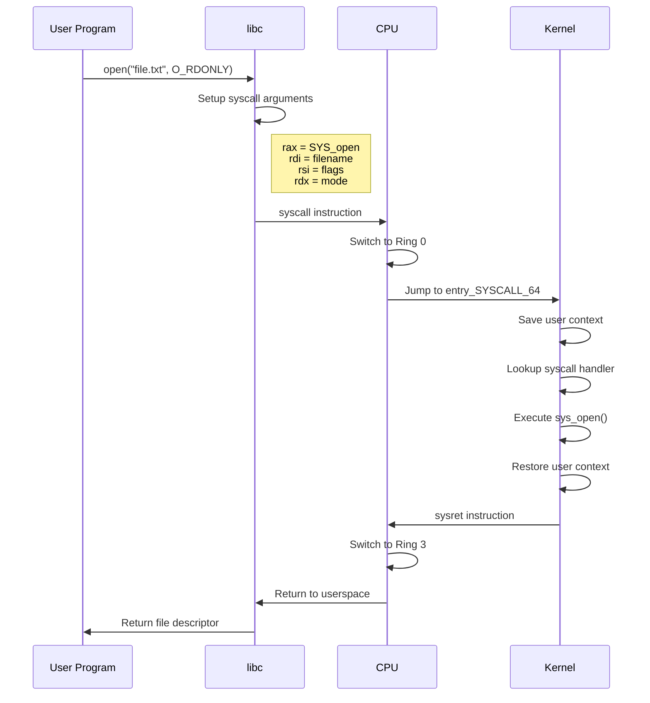
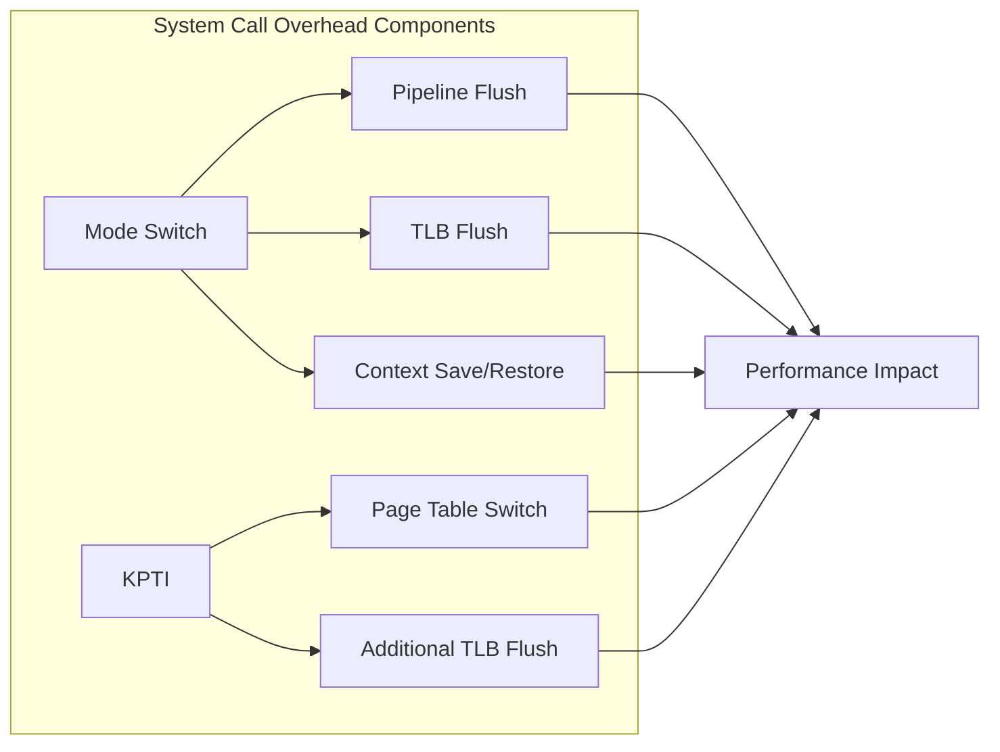

# System Call

システムコールは、オペレーティングシステムにおいてユーザープログラムがカーネルの提供するサービスを利用するための基本的なインターフェースである。プロセスがファイルの読み書き、ネットワーク通信、メモリ管理などの特権的な操作を実行する際には、必ずシステムコールを経由してカーネルに制御を移す必要がある。この仕組みは、現代のオペレーティングシステムのセキュリティモデルとリソース管理の根幹を支えており、ユーザースペースとカーネルスペースという2つの異なる実行環境を明確に分離する役割を果たしている。

## ユーザースペースとカーネルスペースの分離

現代のプロセッサは、実行モードを複数持つことでメモリアクセスや命令実行の権限を制御している。x86-64アーキテクチャでは、Ring 0からRing 3までの4つの特権レベルが定義されているが[^1]、Linuxを含む多くのオペレーティングシステムでは、Ring 0（カーネルモード）とRing 3（ユーザーモード）の2つのみを使用する。この設計により、ユーザープログラムは直接ハードウェアやメモリの任意の領域にアクセスすることができず、システム全体の安定性とセキュリティが保たれる。



ユーザースペースで実行されるプログラムがファイルを開く、メモリを確保する、プロセスを生成するといった操作を行う場合、これらの操作は最終的にハードウェアレベルでの特権的な命令実行を必要とする。しかし、セキュリティと安定性の観点から、ユーザープログラムに直接これらの特権命令の実行を許可することはできない。そこで、システムコールという制御された入り口を通じて、必要な権限チェックとリソース管理を行った上で、カーネルが代理で特権的な操作を実行する仕組みが採用されている。

## システムコールの実行メカニズム

システムコールの実行は、CPUの特殊な命令を使用してユーザーモードからカーネルモードへの遷移を行うことから始まる。x86-64 Linuxでは、従来の`int 0x80`命令に代わって、より高速な`syscall`命令が使用される[^2]。この命令は、CPUの実行モードを切り替え、事前に設定されたエントリポイントへジャンプする。



システムコールの実行において重要なのは、ユーザースペースとカーネルスペース間でのコンテキストスイッチである。`syscall`命令が実行されると、CPUは自動的に以下の処理を行う：

1. 現在の命令ポインタ（RIP）とフラグレジスタ（RFLAGS）を保存
2. カーネルスタックへの切り替え
3. MSR（Model Specific Register）に設定されたカーネルエントリポイントへのジャンプ

Linuxカーネルでは、`entry_SYSCALL_64`がこのエントリポイントとして機能し、ユーザースペースのレジスタ状態を保存した後、システムコール番号に基づいて適切なハンドラ関数を呼び出す。

## システムコールテーブルとABI

システムコールは番号によって識別され、各番号は特定のカーネル関数に対応している。x86-64 Linuxでは、システムコール番号はRAXレジスタに格納され、引数は順にRDI、RSI、RDX、R10、R8、R9レジスタに格納される[^3]。この規約はApplication Binary Interface（ABI）として標準化されており、ユーザースペースのプログラムとカーネルの間の安定したインターフェースを提供している。

```c
// System call table entry structure (simplified)
typedef long (*sys_call_ptr_t)(unsigned long, unsigned long,
                               unsigned long, unsigned long,
                               unsigned long, unsigned long);

const sys_call_ptr_t sys_call_table[__NR_syscall_max+1] = {
    [0 ... __NR_syscall_max] = &sys_ni_syscall,
    [__NR_read] = sys_read,
    [__NR_write] = sys_write,
    [__NR_open] = sys_open,
    [__NR_close] = sys_close,
    // ... more system calls ...
};
```

システムコールテーブルは、カーネル内で静的に定義された関数ポインタの配列であり、各エントリはシステムコール番号に対応するカーネル関数を指している。このテーブルは、カーネルのセキュリティにとって極めて重要な構造体であり、不正な変更を防ぐために読み取り専用メモリに配置される。

## パフォーマンスとオーバーヘッド

システムコールの実行には、避けることのできないオーバーヘッドが存在する。このオーバーヘッドは主に以下の要因によって発生する：

モード切り替えに伴うオーバーヘッドは、CPUパイプラインのフラッシュ、TLB（Translation Lookaside Buffer）のフラッシュ、そしてコンテキストの保存と復元によって生じる。特に、Meltdown脆弱性への対策として導入されたKPTI（Kernel Page Table Isolation）[^4]は、ユーザースペースとカーネルスペースで異なるページテーブルを使用するため、システムコールのたびにCR3レジスタの切り替えが必要となり、追加的なオーバーヘッドをもたらしている。



このオーバーヘッドを軽減するために、様々な最適化技術が導入されている。vDSO（virtual Dynamic Shared Object）は、一部のシステムコール（`gettimeofday`、`clock_gettime`など）をユーザースペースで実行可能にすることで、カーネルモードへの遷移を回避する。また、`io_uring`のような新しいインターフェースは、バッチ処理とリング バッファを使用して、I/O操作におけるシステムコールの回数を大幅に削減している。

## セキュリティ考慮事項

システムコールは、ユーザースペースからカーネルへの唯一の正規の入り口であるため、セキュリティの観点から極めて重要である。カーネルは、システムコールハンドラにおいて以下のようなセキュリティチェックを実装している：

引数の検証は、システムコールセキュリティの第一の防御線である。ユーザースペースから渡されたポインタは、必ず有効なユーザースペースアドレスであることを確認する必要がある。Linuxカーネルでは、`copy_from_user`や`copy_to_user`といった関数が、アドレスの検証とデータのコピーを安全に行う。これらの関数は、ページフォルトハンドラと連携して、無効なアドレスへのアクセスを検出し、適切にエラーを返す。

```c
// Example of argument validation in a system call
SYSCALL_DEFINE3(read, unsigned int, fd, char __user *, buf, size_t, count)
{
    struct fd f = fdget_pos(fd);
    ssize_t ret = -EBADF;

    if (!f.file)
        return -EBADF;

    // Verify that buf points to valid user memory
    if (!access_ok(buf, count))
        return -EFAULT;

    // Perform the actual read operation
    ret = vfs_read(f.file, buf, count, &f.file->f_pos);
    
    fdput_pos(f);
    return ret;
}
```

権限チェックは、リソースへのアクセス制御を実装する上で不可欠である。各システムコールは、現在のプロセスの資格情報（UID、GID、capabilities）を確認し、要求された操作が許可されているかを判断する。特に、`CAP_SYS_ADMIN`のような強力なcapabilityを要求する操作では、慎重な権限チェックが行われる。

## システムコールの実装詳細

システムコールの実装を理解するために、簡単な例として`getpid`システムコールの実装を見てみる。このシステムコールは、現在のプロセスのプロセスIDを返すだけの単純な機能を持つが、システムコールの基本的な構造を理解するのに適している。

```c
SYSCALL_DEFINE0(getpid)
{
    return task_tgid_vnr(current);
}
```

`SYSCALL_DEFINE0`マクロは、引数を持たないシステムコールを定義するためのマクロであり、適切な関数シグネチャとメタデータを生成する。`current`は、現在実行中のタスクを指すper-CPU変数であり、`task_tgid_vnr`関数は、そのタスクのプロセスID（正確にはThread Group ID）を名前空間を考慮して返す。

より複雑なシステムコールでは、複数の段階を経て処理が実行される。例えば、`open`システムコールは以下のような流れで処理される：

1. パス名の解決：ユーザースペースから渡されたファイルパスを解析し、対応するiノードを特定
2. 権限チェック：ファイルのアクセス権限と、プロセスの資格情報を照合
3. ファイル記述子の割り当て：プロセスのファイルテーブルから空きエントリを探す
4. ファイル構造体の初期化：ファイル操作に必要な各種データ構造を設定
5. ファイル記述子の返却：割り当てられたファイル記述子番号をユーザースペースに返す

## システムコールのトレースとデバッグ

システムコールの動作を理解し、デバッグするためには、適切なトレース機能が不可欠である。Linuxは、システムコールのトレースのために複数のメカニズムを提供している。

`strace`は、最も広く使用されるシステムコールトレースツールである。このツールは、`ptrace`システムコールを使用して、対象プロセスのシステムコール実行を監視する。各システムコールの引数と戻り値、さらには実行時間まで詳細に記録できる。

```bash
$ strace -e trace=open,read,write,close cat /etc/passwd
open("/etc/passwd", O_RDONLY)          = 3
read(3, "root:x:0:0:root:/root:/bin/bash\n"..., 131072) = 2145
write(1, "root:x:0:0:root:/root:/bin/bash\n"..., 2145) = 2145
close(3)                                = 0
```

より高度なトレース機能として、eBPF（extended Berkeley Packet Filter）とftrace がある。これらの技術により、カーネル内部でのシステムコールの処理を詳細に追跡し、パフォーマンス分析やセキュリティ監視を行うことができる。特にeBPFは、JITコンパイルされた安全なプログラムをカーネル内で実行できるため、オーバーヘッドを最小限に抑えながら高度な分析が可能である。

## システムコールの進化と将来

システムコールインターフェースは、後方互換性を保ちながら進化を続けている。新しいシステムコールの追加は慎重に行われ、既存のシステムコールの変更はほぼ不可能である。これは、一度公開されたABIは永続的にサポートする必要があるというLinuxカーネルの方針による。

近年では、より効率的なI/O処理のための`io_uring`、セキュアなメモリ管理のための`memfd_secret`、ファイルシステム操作の原子性を保証する`openat2`など、新しいシステムコールが追加されている。これらの新しいインターフェースは、既存の問題を解決しつつ、将来の拡張性を考慮して設計されている。

システムコールの設計において重要なトレードオフは、機能の豊富さとインターフェースの単純さのバランスである。過度に複雑なシステムコールは、実装のバグやセキュリティ脆弱性のリスクを高める。一方で、単純すぎるインターフェースは、効率的な実装を妨げる可能性がある。このバランスを適切に保つことが、オペレーティングシステムの長期的な成功にとって重要である。

[^1]: Intel® 64 and IA-32 Architectures Software Developer's Manual, Volume 3A: System Programming Guide, Part 1, Chapter 5: Protection
[^2]: AMD64 Architecture Programmer's Manual Volume 2: System Programming, Chapter 6: System-Call and System-Return Instructions
[^3]: System V Application Binary Interface AMD64 Architecture Processor Supplement, Version 1.0, Section 3.2.3: Parameter Passing
[^4]: Lipp, M., et al. (2018). "Meltdown: Reading Kernel Memory from User Space." 27th USENIX Security Symposium.