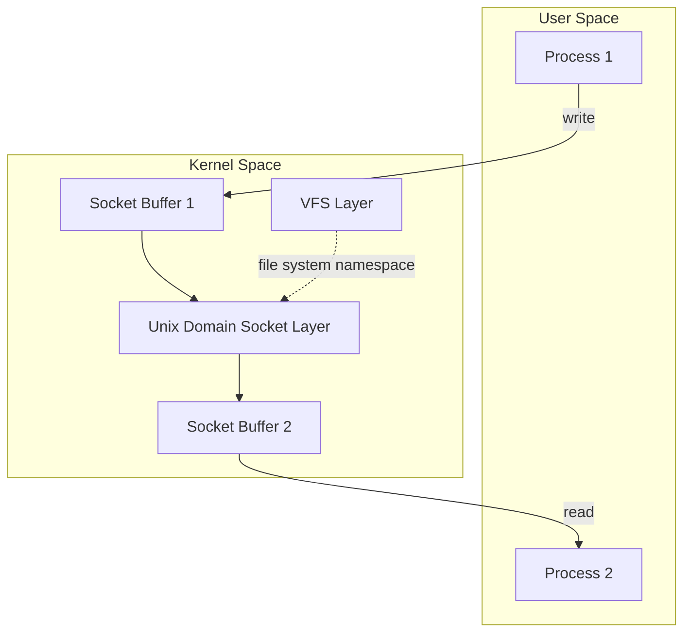
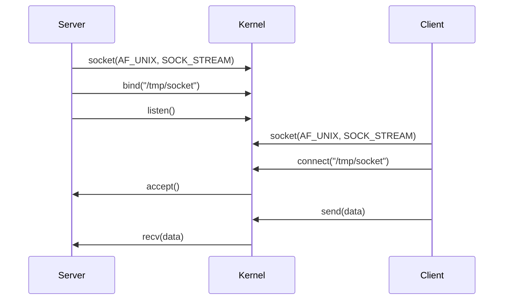
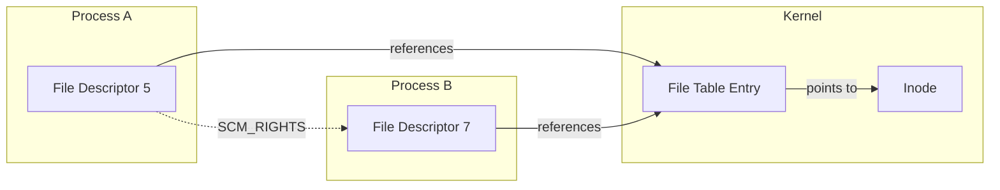
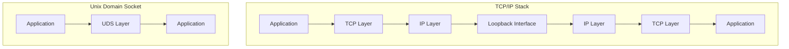
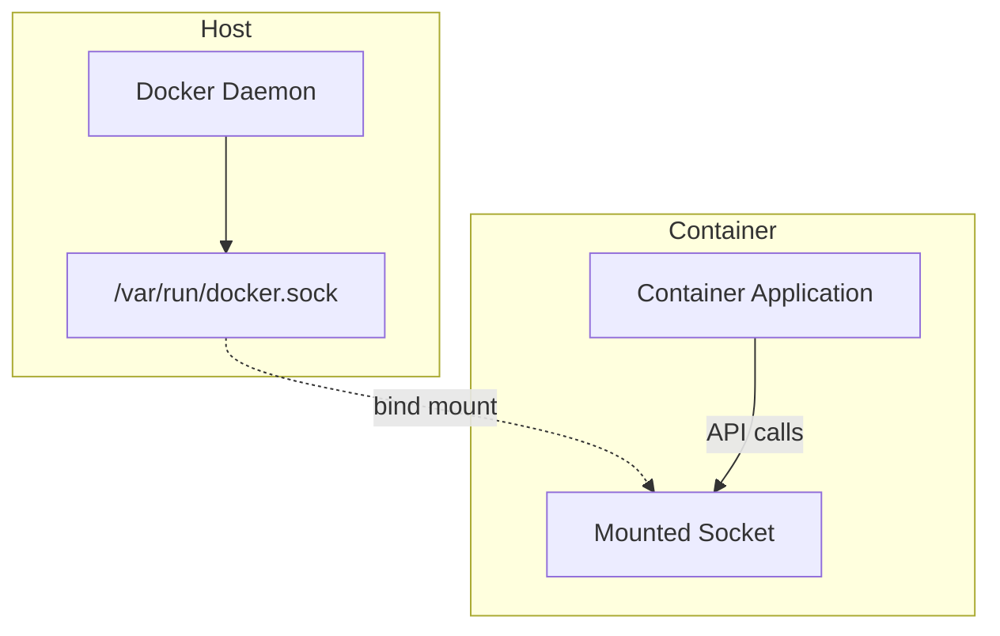

# Unix Domain Socket

Unix Domain Socket（UDS）は、同一ホスト上のプロセス間通信（IPC）を実現するための機構であり、POSIXシステムにおける基本的な通信インターフェースの一つである。ネットワークソケットと同様のAPIを提供しながら、カーネル内部での通信に特化した実装により、高速かつ効率的なプロセス間通信を実現する。本稿では、Unix Domain Socketの内部構造、通信メカニズム、性能特性、そして実践的な設計指針について詳細に解説する。

## 基本概念とアーキテクチャ

Unix Domain Socketは、BSDソケットAPIの一部として実装され、AF_UNIXまたはAF_LOCALアドレスファミリーとして定義される。TCP/IPソケットがネットワークスタックを経由して通信を行うのに対し、Unix Domain Socketはカーネル内のバッファを介して直接データを転送する。この根本的な違いが、Unix Domain Socketの高い性能と独特の特性をもたらしている。



Unix Domain Socketの実装において重要な点は、ファイルシステムの名前空間を利用してソケットのアドレッシングを行うことである。これにより、ファイルシステムのパーミッション機構を活用したアクセス制御が可能となる。ソケットファイルは、通常のファイルとは異なり、実際のデータを保持せず、カーネル内のソケット構造体への参照として機能する。

## 通信タイプとセマンティクス

Unix Domain Socketは、主に二つの通信タイプをサポートする：SOCK_STREAM（ストリーム型）とSOCK_DGRAM（データグラム型）である。さらに、Linuxなどの一部の実装では、SOCK_SEQPACKET（シーケンスパケット型）もサポートされている。

ストリーム型ソケット（SOCK_STREAM）は、信頼性のある双方向のバイトストリーム通信を提供する。TCPと同様の接続指向のセマンティクスを持ち、データの順序性と完全性が保証される。しかし、TCPとは異なり、輻輳制御やフロー制御のオーバーヘッドがなく、カーネル内のバッファ管理のみで通信が完結する。



データグラム型ソケット（SOCK_DGRAM）は、メッセージ境界を保持する非接続型の通信を提供する。UDPと異なり、Unix Domain Socketのデータグラムは信頼性が保証される。つまり、送信されたメッセージは必ず受信側に到達し、パケットロスは発生しない。これは、通信がカーネル内で完結するため、ネットワークの不確実性がないことによる。

## バッファリングとフロー制御

Unix Domain Socketのバッファリング機構は、その性能特性を理解する上で極めて重要である。各ソケットは送信バッファと受信バッファを持ち、これらのサイズはSO_SNDBUFとSO_RCVBUFソケットオプションで制御される。デフォルトのバッファサイズは実装により異なるが、Linuxでは通常212992バイト（約208KB）に設定されている。

```c
// Buffer size configuration example
int sndbuf = 1048576;  // 1MB
int rcvbuf = 1048576;  // 1MB
setsockopt(sock, SOL_SOCKET, SO_SNDBUF, &sndbuf, sizeof(sndbuf));
setsockopt(sock, SOL_SOCKET, SO_RCVBUF, &rcvbuf, sizeof(rcvbuf));
```

フロー制御は、受信側のバッファが満杯になった場合に機能する。ストリーム型ソケットでは、送信側のwrite()やsend()システムコールがブロックされ、受信側がデータを読み取ってバッファに空きができるまで待機する。この挙動は、SO_SNDTIMEOオプションでタイムアウトを設定することで制御できる。

## ファイルディスクリプタの受け渡し

Unix Domain Socketの最も強力な機能の一つは、プロセス間でファイルディスクリプタを受け渡す能力である。これは、SCM_RIGHTS制御メッセージを使用して実現される。この機能により、あるプロセスが開いたファイル、ソケット、パイプなどのリソースを、別のプロセスに直接渡すことができる。



ファイルディスクリプタの受け渡しは、特権分離アーキテクチャの実装において重要な役割を果たす。例えば、権限を持つ親プロセスがファイルを開き、そのファイルディスクリプタを権限を持たない子プロセスに渡すことで、最小権限の原則を実現できる。

## クレデンシャルの伝達とセキュリティ

Unix Domain Socketは、SCM_CREDENTIALSまたはSCM_CREDS（BSD系）制御メッセージを通じて、送信プロセスの認証情報（UID、GID、PID）を受信側に伝達できる。これにより、受信側は送信者の身元を確実に検証できる。この機能は、ネットワークソケットでは実現困難なセキュリティメカニズムである。

```c
struct ucred {
    pid_t pid;    // Process ID
    uid_t uid;    // User ID
    gid_t gid;    // Group ID
};
```

Linuxでは、SO_PEERCREDソケットオプションを使用して、接続されたピアのクレデンシャルを取得することもできる。これらの認証情報はカーネルによって提供されるため、偽装が不可能であり、強力なアクセス制御の基盤となる。

## 抽象名前空間

Linuxは、Unix Domain Socketに対して抽象名前空間（Abstract Namespace）という独自の拡張を提供している。通常のUnix Domain Socketがファイルシステム上のパスを使用するのに対し、抽象名前空間のソケットはファイルシステムには現れない。アドレスの最初のバイトをヌル文字（'\0'）にすることで、抽象名前空間を使用することを示す。

```c
struct sockaddr_un addr;
memset(&addr, 0, sizeof(addr));
addr.sun_family = AF_UNIX;
strcpy(addr.sun_path + 1, "abstract_socket_name");
// addr.sun_path[0] is '\0'
```

抽象名前空間の利点は、ソケットファイルの削除を気にする必要がなく、ファイルシステムのパーミッションに依存しないことである。しかし、この特性は同時にセキュリティ上の考慮事項ともなる。抽象名前空間のソケットは、同じ名前空間内のすべてのプロセスからアクセス可能であるため、適切なアクセス制御メカニズムを実装する必要がある。

## 性能特性と最適化

Unix Domain Socketの性能は、ネットワークソケットと比較して顕著に優れている。主な要因は以下の通りである：

1. **コンテキストスイッチの削減**: データのコピーがカーネル内で完結するため、ネットワークスタックを経由する必要がない。

2. **ゼロコピー最適化**: 一部の実装では、大きなデータ転送に対してゼロコピー技術が適用される。

3. **CPUキャッシュの効率的な利用**: 同一ホスト内の通信であるため、CPUキャッシュの局所性が保たれやすい。

性能測定の例として、同一ホスト上でのTCP/IPソケットとUnix Domain Socketの比較では、小さなメッセージのラウンドトリップ時間で約50%、スループットで約25-30%の改善が観察される。ただし、これらの数値は、ハードウェア構成、カーネルバージョン、ワークロードの特性によって大きく変動する。



## エラー処理と診断

Unix Domain Socketのエラー処理は、通常のソケットプログラミングと同様であるが、特有のエラー条件も存在する。例えば、ECONNREFUSED エラーは、指定されたソケットファイルは存在するが、リスニングしているプロセスがない場合に発生する。EACCES エラーは、ソケットファイルへのアクセス権限がない場合に発生する。

診断ツールとしては、`ss`（Socket Statistics）コマンドが有用である。`ss -x`オプションでUnix Domain Socketの状態を確認できる：

```bash
$ ss -x
Netid  State      Recv-Q Send-Q Local Address:Port
u_str  LISTEN     0      128    /run/systemd/journal/stdout 12701
u_str  ESTAB      0      0      /run/systemd/journal/stdout 28349
```

## 実装の詳細とカーネル内部

Unix Domain Socketの実装は、各オペレーティングシステムのカーネル内部に深く統合されている。Linuxカーネルでは、`net/unix/af_unix.c`にコア実装が含まれている。ソケット構造体は`struct unix_sock`として定義され、通常の`struct sock`を拡張している。

カーネル内部では、Unix Domain Socketの通信は主にsk_buffの受け渡しによって実現される。ストリーム型ソケットでは、データは連続したバイトストリームとして扱われ、必要に応じてsk_buffが分割または結合される。データグラム型では、各メッセージが独立したsk_buffとして扱われ、メッセージ境界が保持される。

## 実践的な設計パターン

Unix Domain Socketを使用したシステム設計において、いくつかの確立されたパターンが存在する：

### 1. クライアント・サーバーモデル

最も一般的なパターンであり、サーバープロセスが既知のパスでリスニングし、複数のクライアントが接続する。systemdのジャーナルデーモンやD-Busなどがこのモデルを採用している。

### 2. ピアツーピア通信

socketpair()システムコールを使用して、親子プロセス間で双方向の通信チャネルを確立する。この方法は、fork()後のプロセス間通信に特に有効である。

### 3. 多重化とイベント駆動

epollやkqueueなどのイベント通知メカニズムと組み合わせることで、単一のプロセスで多数のUnix Domain Socket接続を効率的に処理できる。nginxやRedisなどの高性能サーバーがこのアプローチを採用している。

## トレードオフと選択基準

Unix Domain Socketを採用する際の主要なトレードオフは以下の通りである：

**利点：**
- 高性能（低レイテンシ、高スループット）
- ファイルシステムベースのセキュリティモデル
- ファイルディスクリプタとクレデンシャルの受け渡し
- 実装の単純性

**制約：**
- 同一ホスト内の通信に限定
- ファイルシステムの名前空間に依存（抽象名前空間を除く）
- ポータビリティの考慮（特にLinux固有の機能）

他のIPC機構との比較において、Unix Domain Socketは、構造化されたメッセージ交換が必要な場合に適している。共有メモリと比較すると、同期の複雑さが少なく、プロセス間の分離が明確である。名前付きパイプ（FIFO）と比較すると、双方向通信とファイルディスクリプタの受け渡しが可能である点で優れている。

## 高度な機能とLinux固有の拡張

Linuxカーネルは、Unix Domain Socketに対していくつかの独自の拡張を提供している。SO_PASSSECオプションを有効にすると、SELinuxのセキュリティコンテキストをSCM_SECURITYコントロールメッセージとして受信できる。これにより、Mandatory Access Control（MAC）環境でのきめ細かなアクセス制御が可能となる。

また、Linux 5.1以降では、io_uringインターフェースを通じてUnix Domain Socketの非同期I/Oがサポートされている。これにより、システムコールのオーバーヘッドをさらに削減し、極めて高い性能を達成できる。

## デバッグとトラブルシューティング

Unix Domain Socketのデバッグには、いくつかの有用な手法がある。straceを使用してシステムコールをトレースすることで、ソケット操作の詳細を確認できる：

```bash
strace -e trace=socket,bind,listen,accept,connect,send,recv program
```

また、`lsof`コマンドを使用して、プロセスが開いているUnix Domain Socketを確認できる：

```bash
lsof -U
```

パフォーマンスの問題を診断する際は、`perf`ツールを使用してカーネル内のホットスポットを特定できる。特に、大量の小さなメッセージを送信する場合、コンテキストスイッチのオーバーヘッドが問題となることがある。

## 将来の発展と標準化

Unix Domain Socketは、POSIX.1-2001で標準化されているが、多くの有用な機能は実装固有である。例えば、SCM_RIGHTSはPOSIX標準の一部であるが、SCM_CREDENTIALSはLinux固有である。将来的には、これらの機能の標準化が進むことで、ポータブルなアプリケーションの開発が容易になることが期待される。

また、コンテナ技術の普及に伴い、名前空間を跨いだUnix Domain Socketの使用に関する新しい課題が生じている。Linuxでは、異なるマウント名前空間間でのソケットファイルの共有や、ネットワーク名前空間を跨いだ抽象ソケットの使用など、複雑なシナリオへの対応が続けられている。

## コンテナ環境での活用と考慮事項

コンテナ技術の普及により、Unix Domain Socketの使用パターンも進化している。Dockerやcontainerdなどのコンテナランタイムは、ホストとコンテナ間の通信にUnix Domain Socketを広範に活用している。例えば、Docker APIは`/var/run/docker.sock`を通じてアクセスされ、これにより、コンテナ内からホストのDockerデーモンを制御することが可能となる。



コンテナ環境でUnix Domain Socketを使用する際の重要な考慮事項として、名前空間の分離がある。マウント名前空間が異なる場合、通常のファイルシステムベースのソケットは共有が困難になる。この問題に対処するため、以下のアプローチが採用される：

1. **ボリュームマウント**: ソケットファイルを含むディレクトリをコンテナにマウントする
2. **抽象名前空間の利用**: ファイルシステムに依存しない通信（ただし、ネットワーク名前空間の制約あり）
3. **ソケットプロキシ**: ネットワークソケットとUnix Domain Socket間のブリッジ

## 実装例とベストプラクティス

実践的なUnix Domain Socketの実装において、エラー処理とリソース管理は極めて重要である。以下に、プロダクション環境で使用可能な堅牢なサーバー実装の例を示す：

```c
// Robust Unix Domain Socket server implementation
int create_unix_socket_server(const char *path) {
    int sock_fd;
    struct sockaddr_un addr;
    
    // Create socket
    sock_fd = socket(AF_UNIX, SOCK_STREAM | SOCK_CLOEXEC, 0);
    if (sock_fd < 0) {
        return -1;
    }
    
    // Set socket options
    int reuse = 1;
    if (setsockopt(sock_fd, SOL_SOCKET, SO_REUSEADDR, 
                   &reuse, sizeof(reuse)) < 0) {
        close(sock_fd);
        return -1;
    }
    
    // Remove existing socket file
    unlink(path);
    
    // Bind to address
    memset(&addr, 0, sizeof(addr));
    addr.sun_family = AF_UNIX;
    strncpy(addr.sun_path, path, sizeof(addr.sun_path) - 1);
    
    if (bind(sock_fd, (struct sockaddr*)&addr, sizeof(addr)) < 0) {
        close(sock_fd);
        return -1;
    }
    
    // Set appropriate permissions
    if (chmod(path, 0666) < 0) {
        close(sock_fd);
        unlink(path);
        return -1;
    }
    
    // Start listening
    if (listen(sock_fd, SOMAXCONN) < 0) {
        close(sock_fd);
        unlink(path);
        return -1;
    }
    
    return sock_fd;
}
```

ベストプラクティスとして、以下の点に注意すべきである：

1. **SOCK_CLOEXEC フラグの使用**: fork/exec時のファイルディスクリプタリークを防ぐ
2. **適切なエラーハンドリング**: すべてのシステムコールの戻り値をチェック
3. **リソースのクリーンアップ**: 異常終了時のソケットファイル削除
4. **タイムアウトの設定**: ハングアップを防ぐためのソケットオプション設定

## パフォーマンスベンチマークと最適化技術

Unix Domain Socketの性能を最大限に引き出すためには、適切なベンチマークと最適化が不可欠である。典型的なベンチマークシナリオでは、以下の指標を測定する：

1. **レイテンシ**: ping-pong型の通信でラウンドトリップ時間を測定
2. **スループット**: 大量データ転送時の帯域幅を測定
3. **接続確立時間**: accept/connectのオーバーヘッドを測定

実測例として、Intel Xeon E5-2680 v4、Linux 5.15環境での測定結果を示す：

```
Message Size | TCP Loopback | Unix Domain Socket | Improvement
-------------|--------------|-------------------|-------------
64 bytes     | 12.5 μs      | 6.2 μs           | 50.4%
1 KB         | 15.8 μs      | 8.9 μs           | 43.7%
64 KB        | 285.3 μs     | 198.7 μs         | 30.3%
1 MB         | 4.2 ms       | 3.1 ms           | 26.2%
```

最適化技術として、以下のアプローチが有効である：

### バッファサイズの最適化

アプリケーションの特性に応じて、ソケットバッファサイズを調整する。大量のデータを転送する場合は、バッファサイズを増やすことで、コンテキストスイッチの回数を削減できる：

```c
int buffer_size = 1048576; // 1MB
setsockopt(sock, SOL_SOCKET, SO_SNDBUF, &buffer_size, sizeof(buffer_size));
setsockopt(sock, SOL_SOCKET, SO_RCVBUF, &buffer_size, sizeof(buffer_size));
```

### バッチ処理とベクトルI/O

複数の小さなメッセージを送信する場合、sendmsg()とrecvmsg()を使用したベクトルI/Oにより、システムコールの回数を削減できる：

```c
struct iovec iov[IOV_MAX];
struct msghdr msg = {0};
msg.msg_iov = iov;
msg.msg_iovlen = num_messages;
// Populate iov array with messages
sendmsg(sock, &msg, 0);
```

### CPU親和性の設定

送信側と受信側のプロセスを同じCPUコアまたは同じNUMAノードに配置することで、キャッシュの効率を向上させる：

```c
cpu_set_t cpuset;
CPU_ZERO(&cpuset);
CPU_SET(0, &cpuset);
pthread_setaffinity_np(pthread_self(), sizeof(cpuset), &cpuset);
```

## 高度なエラーハンドリングと診断

プロダクション環境では、詳細なエラーハンドリングと診断機能が不可欠である。Unix Domain Socketに特有のエラー条件と、その対処法を以下に示す：

### EAGAIN/EWOULDBLOCK

非ブロッキングモードで、操作が即座に完了できない場合に発生する。適切な再試行ロジックまたはイベント駆動アーキテクチャへの移行が必要：

```c
int flags = fcntl(sock, F_GETFL, 0);
fcntl(sock, F_SETFL, flags | O_NONBLOCK);

while (1) {
    ssize_t n = send(sock, buffer, len, 0);
    if (n < 0) {
        if (errno == EAGAIN || errno == EWOULDBLOCK) {
            // Wait for socket to become writable
            struct pollfd pfd = {sock, POLLOUT, 0};
            poll(&pfd, 1, -1);
            continue;
        }
        // Handle other errors
        break;
    }
    // Process successful send
    break;
}
```

### EPIPE

接続が切断された後に書き込みを試みた場合に発生する。SIGPIPEシグナルも同時に発生するため、適切なシグナルハンドリングが必要：

```c
// Ignore SIGPIPE globally
signal(SIGPIPE, SIG_IGN);
// Or use MSG_NOSIGNAL flag
send(sock, buffer, len, MSG_NOSIGNAL);
```

### 診断ツールの活用

`ss`コマンドの詳細オプションを使用して、ソケットの内部状態を確認：

```bash
# Show detailed Unix socket information
ss -xp
# Show socket memory usage
ss -xm
# Show timer information
ss -xo
```

カーネルトレーシングツールを使用した詳細な診断：

```bash
# Trace Unix socket system calls
bpftrace -e 'kprobe:unix_stream_sendmsg { printf("%s: %d bytes\n", comm, arg2); }'
```

## セキュリティ強化のための実装パターン

Unix Domain Socketのセキュリティを強化するための実装パターンを以下に示す：

### 最小権限の原則

ソケットファイルのパーミッションを厳密に制御し、必要最小限のアクセス権限のみを付与：

```c
// Create socket with restricted permissions
umask(0077);  // Only owner can access
int sock = socket(AF_UNIX, SOCK_STREAM, 0);
bind(sock, (struct sockaddr*)&addr, sizeof(addr));
// Optionally, adjust permissions for specific group
chown(path, -1, trusted_gid);
chmod(path, 0660);  // Owner and group can access
```

### クレデンシャル検証の実装

接続時にピアのクレデンシャルを検証し、認可されたプロセスのみからの接続を受け入れる：

```c
int verify_peer_credentials(int client_sock) {
    struct ucred cred;
    socklen_t len = sizeof(cred);
    
    if (getsockopt(client_sock, SOL_SOCKET, SO_PEERCRED, 
                   &cred, &len) < 0) {
        return -1;
    }
    
    // Verify UID/GID against allowed list
    if (!is_allowed_uid(cred.uid)) {
        return -1;
    }
    
    return 0;
}
```

---

*注釈：*

1. POSIX.1-2001, IEEE Std 1003.1-2001, "The Open Group Base Specifications Issue 6"
2. Stevens, W. R., Fenner, B., & Rudoff, A. M. (2003). "UNIX Network Programming, Volume 1: The Sockets Networking API" (3rd ed.)
3. Linux Kernel Documentation, "Unix domain sockets" (https://www.kernel.org/doc/html/latest/networking/af_unix.html)