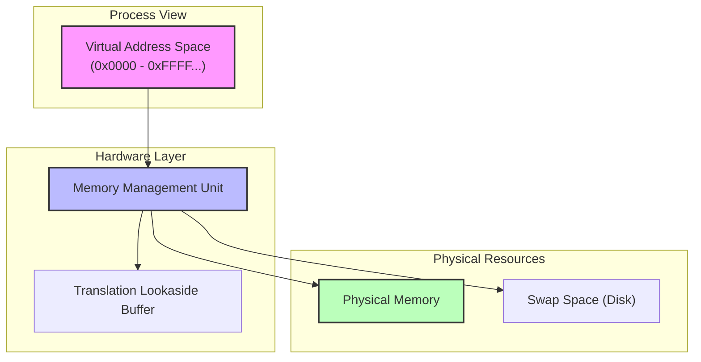
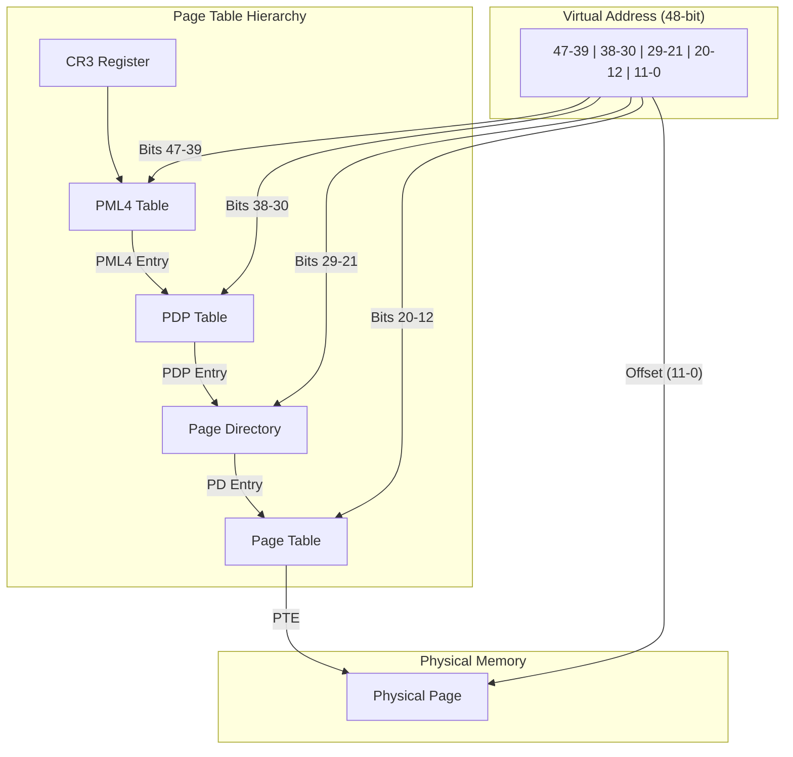
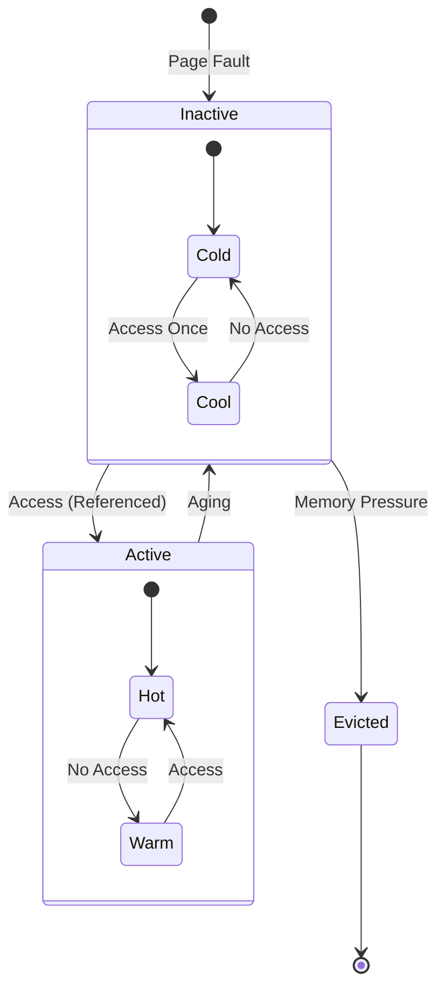
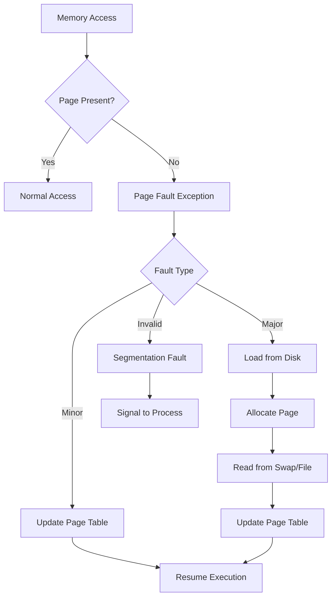
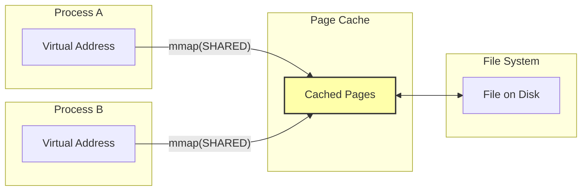
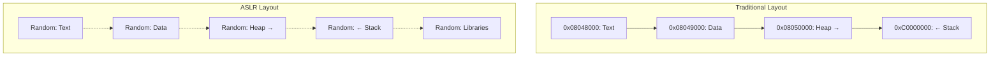
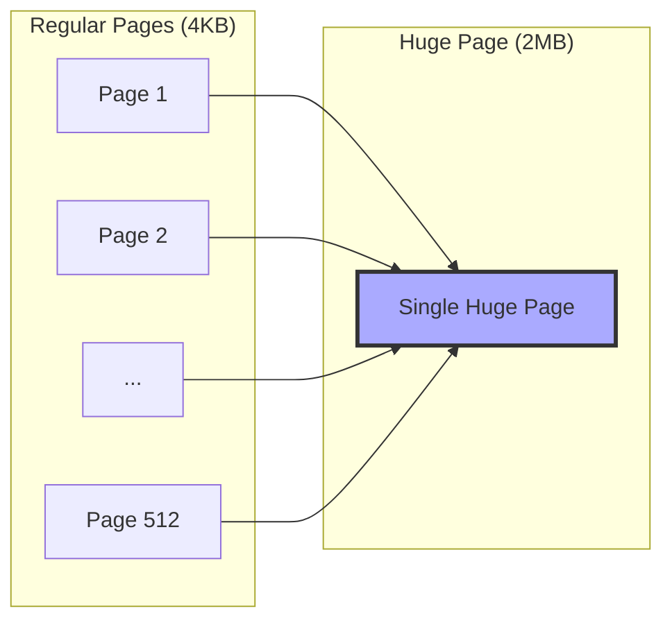
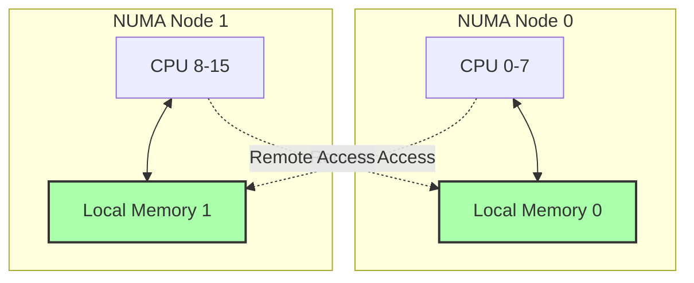
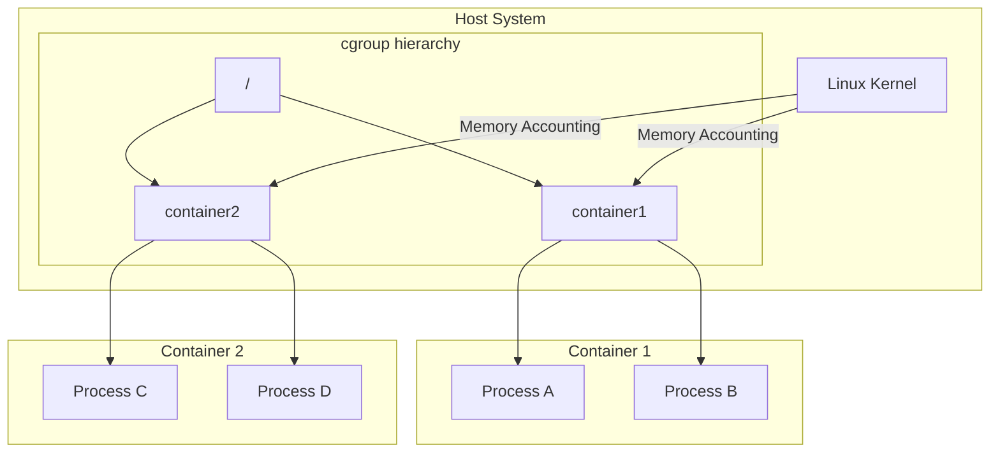
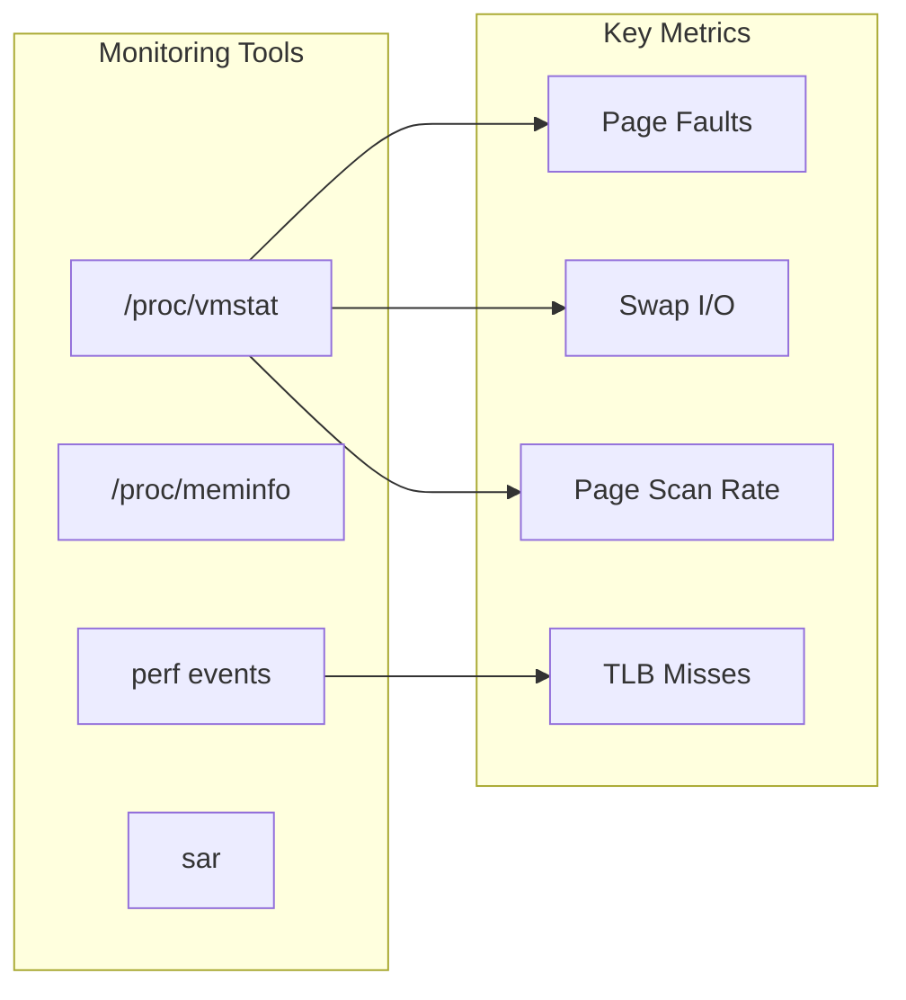

# 仮想メモリ

仮想メモリは現代のオペレーティングシステムにおける中核的なメモリ管理機構であり、プロセスに対して物理メモリの制約から独立した連続的なアドレス空間を提供する。この抽象化により、物理メモリよりも大きなプログラムの実行、プロセス間のメモリ保護、効率的なメモリ共有、そして柔軟なメモリ配置が可能となる。仮想メモリシステムは、ハードウェアのメモリ管理ユニット（MMU）とオペレーティングシステムのメモリ管理サブシステムの緊密な協調によって実現される。

## アーキテクチャの概要

仮想メモリシステムは、プロセスが使用する仮想アドレスを物理アドレスに変換することで機能する。各プロセスは独立した仮想アドレス空間を持ち、これは通常0番地から始まる連続的なアドレス範囲として見える。しかし実際には、この仮想アドレス空間は物理メモリの任意の位置にマッピングされており、さらに一部はディスク上のスワップ領域に退避されている可能性がある。



この変換処理は、通常ページと呼ばれる固定サイズのメモリブロック単位で行われる。x86-64アーキテクチャでは標準的なページサイズは4KBであるが、2MBや1GBの大きなページ（ヒュージページ）もサポートされている。ページ単位での管理により、メモリの断片化を防ぎ、効率的なメモリ割り当てと回収が可能となる。

## ページテーブルの構造と多段階変換

仮想アドレスから物理アドレスへの変換は、ページテーブルと呼ばれるデータ構造を介して行われる。現代のプロセッサでは、アドレス空間の大きさに対応するため、多段階のページテーブル構造が採用されている。x86-64アーキテクチャでは、4段階のページテーブル（PML4、PDPT、PD、PT）を使用し、48ビットの仮想アドレス空間をサポートする[^1]。



各ページテーブルエントリ（PTE）は、対応する物理ページのアドレスに加えて、アクセス権限、キャッシュ属性、ダーティビット、アクセスビットなどの制御情報を含む。これらのメタデータは、メモリ保護、ページ置換アルゴリズム、Copy-on-Write（CoW）などの高度な機能を実現するために使用される。

ページテーブルウォークと呼ばれるこの多段階の変換処理は、メモリアクセスのたびに実行されると大きなオーバーヘッドとなる。そのため、最近アクセスされた仮想-物理アドレス変換をキャッシュするTranslation Lookaside Buffer（TLB）が導入されている。TLBは通常、命令用とデータ用に分離されており、各エントリは仮想ページ番号、物理ページ番号、プロセスID（ASID）、アクセス権限などを保持する。

## メモリ管理ポリシーとページ置換

物理メモリが不足した場合、オペレーティングシステムは使用頻度の低いページをディスクのスワップ領域に退避させる必要がある。この際、どのページを退避させるかを決定するページ置換アルゴリズムが重要となる。理論的に最適なアルゴリズムは、将来最も長く使用されないページを選択するBelady's OPTアルゴリズムであるが、これは将来の参照パターンを知る必要があるため実装不可能である。

実際のシステムでは、過去のアクセスパターンに基づいて将来の振る舞いを予測する近似アルゴリズムが使用される。Linuxカーネルでは、LRU（Least Recently Used）アルゴリズムの変種であるTwo-list LRUが採用されている。このアルゴリズムは、アクティブリストと非アクティブリストの2つのLRUリストを維持し、ページの昇格と降格を通じて作業セットを適応的に管理する[^2]。



ページ置換の決定には、ページテーブルエントリのアクセスビットとダーティビットが活用される。アクセスビットはページが参照されるとハードウェアによって自動的にセットされ、オペレーティングシステムが定期的にクリアすることで、ページの活性度を追跡できる。ダーティビットは、ページが書き込まれたことを示し、スワップアウト時に実際にディスクへの書き込みが必要かどうかを判断するために使用される。

## デマンドページングとページフォルト処理

仮想メモリシステムの重要な特性の一つは、デマンドページングである。これは、プログラムの実行開始時にすべてのページを物理メモリにロードするのではなく、実際にアクセスされた時点で初めてページを割り当てる遅延評価戦略である。プロセスが物理メモリに存在しないページにアクセスすると、ページフォルトが発生し、CPUは例外を発生させてオペレーティングシステムに制御を移す。

ページフォルトには主に3つのタイプが存在する。マイナーページフォルトは、要求されたページが既に物理メモリに存在するが、ページテーブルエントリが設定されていない場合に発生する。これは、fork()システムコール後のCopy-on-Writeや、共有ライブラリの初回アクセス時などに見られる。メジャーページフォルトは、ページがディスクから読み込まれる必要がある場合に発生し、I/O待機を伴うため大きなレイテンシを引き起こす。無効ページフォルトは、プロセスが割り当てられていないメモリ領域にアクセスした場合に発生し、通常はセグメンテーション違反として処理される。



ページフォルト処理のパフォーマンスは、システム全体の性能に大きな影響を与える。Linuxカーネルでは、ページフォルトハンドラは高度に最適化されており、ファストパスとスローパスに分離されている。ファストパスは、単純なケースを迅速に処理し、複雑な状況ではスローパスに移行する。また、ページフォルトの原因を予測し、事前にページを読み込むプリフェッチ機構も実装されている。

## メモリマッピングとファイルシステムの統合

仮想メモリシステムは、ファイルシステムと密接に統合されており、mmap()システムコールを通じてファイルを直接メモリ空間にマッピングすることができる。この機能により、ファイルの内容をメモリアクセスと同じ方法で読み書きでき、大規模なデータ処理やデータベースシステムで広く活用されている。

メモリマップドファイルは、プライベートマッピングと共有マッピングの2種類に分類される。プライベートマッピング（MAP_PRIVATE）では、ファイルへの変更はプロセスローカルであり、Copy-on-Writeメカニズムによって実装される。共有マッピング（MAP_SHARED）では、変更は他のプロセスからも見え、最終的にファイルシステムに書き戻される。



Linuxのページキャッシュは、ファイルシステムとメモリ管理の統合において中心的な役割を果たす。すべてのファイルI/Oはページキャッシュを経由し、同じファイルを複数のプロセスがマッピングしている場合でも、物理メモリ上では単一のコピーが共有される。この統一されたキャッシュアーキテクチャにより、メモリの効率的な利用とI/O性能の向上が実現される。

## アドレス空間レイアウトとASLR

プロセスの仮想アドレス空間は、テキストセグメント、データセグメント、ヒープ、スタック、共有ライブラリなど、異なる用途の領域に分割されている。伝統的なUNIXシステムでは、これらの領域は固定的なアドレスに配置されていたが、セキュリティ上の脆弱性を悪用した攻撃を困難にするため、現代のシステムではAddress Space Layout Randomization（ASLR）が導入されている。

ASLRは、プロセス起動時に各メモリ領域の開始アドレスをランダム化することで、Return-Oriented Programming（ROP）やその他のメモリ破壊攻撃を困難にする。Linuxでは、/proc/sys/kernel/randomize_va_spaceを通じてASLRのレベルを制御でき、0（無効）、1（部分的有効）、2（完全有効）の3段階が設定可能である[^3]。



ASLRの実装は、エントロピーの量とパフォーマンスのトレードオフを考慮する必要がある。x86-64アーキテクチャでは、アドレス空間が十分に大きいため、高いエントロピーを確保しつつ、メモリの断片化を最小限に抑えることができる。しかし、32ビットシステムでは、利用可能なアドレス空間が限られているため、ASLRの効果は制限される。

## 大規模システムにおける最適化技術

大規模なメモリを扱うシステムでは、標準的な4KBページサイズではページテーブルのオーバーヘッドが無視できなくなる。例えば、1TBの仮想メモリをマッピングする場合、4KBページでは約2GBのページテーブルが必要となる。この問題に対処するため、Transparent Huge Pages（THP）やHugetlbfsなどの大ページサポートが導入されている。

THPは、カーネルが自動的に連続した物理メモリ領域を検出し、複数の小さなページを2MBまたは1GBの大きなページに統合する機能である。これにより、TLBミス率が減少し、ページテーブルのメモリ消費が削減される。一方、メモリの断片化やページ分割のオーバーヘッドなどの課題も存在し、ワークロードによってはTHPを無効にすることが推奨される場合もある。



メモリ圧縮も、物理メモリの効率的な利用を実現する技術の一つである。zswapやzramなどの機構は、スワップアウトされるページを圧縮してメモリ内に保持することで、ディスクI/Oを削減する。圧縮アルゴリズムの選択は、圧縮率とCPUオーバーヘッドのバランスを考慮する必要があり、LZ4やzstdなどの高速アルゴリズムが一般的に使用される。

## NUMAアーキテクチャにおける仮想メモリ

Non-Uniform Memory Access（NUMA）アーキテクチャでは、各CPUソケットがローカルメモリを持ち、他のソケットのメモリへのアクセスはインターコネクトを経由するため遅延が大きくなる。仮想メモリシステムは、このメモリアクセスの非対称性を考慮し、可能な限りプロセスが実行されているCPUのローカルメモリにページを配置するよう最適化される。

Linuxカーネルは、NUMAポリシーを通じてメモリ配置を制御する機能を提供する。デフォルトポリシーでは、ページフォルト時に現在のCPUのローカルノードからメモリを割り当てる。また、mbind()システムコールを使用して、特定のメモリ領域に対して明示的なNUMAポリシーを設定することも可能である。インターリーブポリシーでは、ページを複数のNUMAノードに分散配置し、メモリ帯域幅を最大化する。



NUMAシステムでは、ページマイグレーションが重要な最適化技術となる。AutoNUMAは、定期的にページのアクセスパターンを監視し、頻繁にリモートアクセスされるページを適切なノードに移動する。この機構は、numa_hint_faultsを使用してページへのアクセスを追跡し、移動のコストと利益を評価して最適な配置を決定する。

## コンテナと仮想メモリの分離

コンテナ技術の普及に伴い、仮想メモリシステムも名前空間とcgroupsを通じた分離とリソース制限をサポートするよう拡張されている。memory cgroupは、コンテナごとのメモリ使用量を追跡し、制限を超えた場合にOOM（Out of Memory）キラーを起動する。また、各コンテナは独立したページキャッシュの統計を持ち、メモリ使用の公平性を保証する。

cgroupsのメモリコントローラーは、階層的な制限をサポートし、親cgroupの制限は子cgroupに継承される。memory.limit_in_bytesは物理メモリとスワップの合計使用量を制限し、memory.memsw.limit_in_bytesは物理メモリのみの使用量を制限する。これらの制限は、ソフトリミットとハードリミットの両方をサポートし、柔軟なリソース管理を可能にする。



メモリの分離に加えて、コンテナ環境では/proc/meminfoや/proc/vmallocなどの仮想ファイルシステムも名前空間化され、コンテナ内のプロセスは自身に割り当てられたリソースのみを認識する。これにより、既存のアプリケーションをコンテナ環境で透過的に実行できる。

## パフォーマンス測定と最適化

仮想メモリシステムのパフォーマンスを理解し最適化するためには、適切な測定とプロファイリングが不可欠である。Linuxは、/proc/vmstatや/proc/meminfoを通じて詳細な統計情報を提供する。特に重要な指標として、ページフォルト率、TLBミス率、スワップ活動、ページスキャン率などがある。

perfツールは、ハードウェアパフォーマンスカウンタを使用してTLBミスやキャッシュミスを測定できる。例えば、`perf stat -e dTLB-load-misses,iTLB-load-misses`コマンドは、データTLBと命令TLBのミス数を報告する。これらの情報は、アプリケーションのメモリアクセスパターンを最適化する際の指針となる。



メモリアクセスパターンの最適化には、空間的局所性と時間的局所性の両方を考慮する必要がある。データ構造のレイアウトを工夫し、関連するデータを同じキャッシュラインやページに配置することで、キャッシュ効率とTLB効率を向上させることができる。また、メモリプリフェッチ命令を適切に使用することで、メモリアクセスレイテンシを隠蔽できる。

## セキュリティ機能と保護メカニズム

仮想メモリシステムは、プロセス間の分離とメモリ保護において重要な役割を果たす。各ページテーブルエントリには、読み取り、書き込み、実行の権限ビットが含まれており、不正なメモリアクセスを防ぐ。NX（No eXecute）ビットは、データ領域でのコード実行を防ぎ、バッファオーバーフロー攻撃を困難にする。

Kernel Page Table Isolation（KPTI）は、Meltdown脆弱性への対策として導入された機能で、ユーザー空間とカーネル空間で異なるページテーブルを使用する。これにより、投機的実行を悪用したカーネルメモリの読み取りを防ぐが、コンテキストスイッチのオーバーヘッドが増加するトレードオフがある[^4]。

```mermaid
stateDiagram-v2
    [*] --> UserMode: Process Start
    
    state UserMode {
        [*] --> UserPT: User Page Table
        UserPT --> UserMem: Access User Memory
    }
    
    state KernelMode {
        [*] --> KernelPT: Kernel Page Table
        KernelPT --> KernelMem: Access Kernel Memory
    }
    
    UserMode --> KernelMode: System Call
    KernelMode --> UserMode: Return
    
    note right of UserMode: KPTI: User cannot see kernel mappings
    note right of KernelMode: Full page table with all mappings
```

Control Flow Integrity（CFI）や Shadow Stackなどの追加的なセキュリティ機能も、仮想メモリシステムと連携して実装されている。これらの機能は、関数ポインタの改ざんやReturn-Oriented Programming攻撃を検出し防止する。Intel CETやARM Pointer Authenticationなどのハードウェア支援機能は、これらの保護メカニズムのパフォーマンスオーバーヘッドを削減する。

仮想メモリシステムは、オペレーティングシステムの中核として、メモリの抽象化、保護、効率的な利用を実現する複雑で洗練された機構である。ハードウェアとソフトウェアの緊密な協調、多様な最適化技術、そしてセキュリティとパフォーマンスのバランスを取りながら、現代のコンピューティング環境の要求に応え続けている。今後も新しいハードウェア機能やワークロードの変化に適応しながら、進化を続けていくことが期待される。

---

[^1]: Intel® 64 and IA-32 Architectures Software Developer's Manual, Volume 3A: System Programming Guide, Part 1, Chapter 4: Paging

[^2]: Rik van Riel, "Page replacement in Linux 2.4 memory management", USENIX Annual Technical Conference, FREENIX Track, 2001

[^3]: PaX Team, "PaX address space layout randomization (ASLR)", https://pax.grsecurity.net/docs/aslr.txt

[^4]: Lipp, M., Schwarz, M., Gruss, D., et al. "Meltdown: Reading Kernel Memory from User Space", 27th USENIX Security Symposium, 2018