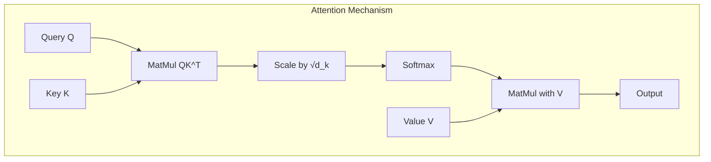
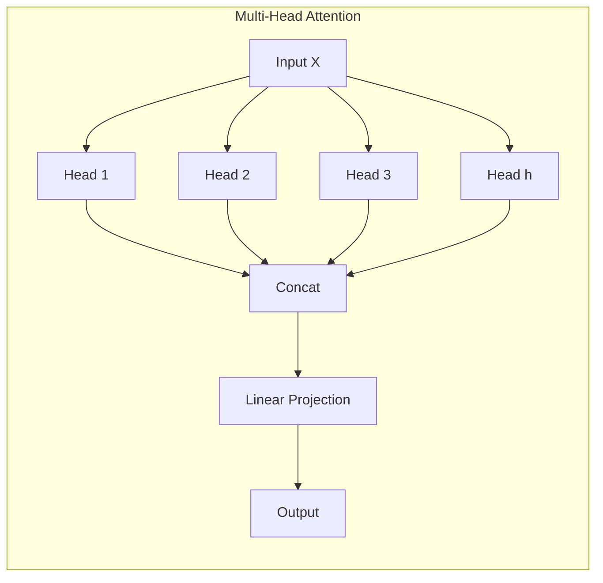
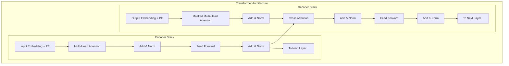

# Transformer

Transformerは2017年に提案された深層学習アーキテクチャであり、自然言語処理の分野に革命をもたらした技術である[^1]。従来のRNNやLSTMに依存していたシーケンス処理タスクにおいて、Attention機構のみを用いることで並列処理を可能にし、学習の高速化と性能向上を同時に実現した。この革新的なアプローチは「Attention is All You Need」という論文タイトルが示すように、再帰的な構造を完全に排除し、Attentionメカニズムだけでシーケンス間の依存関係を捉えることに成功している。

## Attention機構の本質

Transformerの中核をなすAttention機構は、入力シーケンスの各要素が他の全ての要素との関連性を動的に計算する仕組みである。この機構により、文章中の離れた位置にある単語間の長距離依存関係を効率的に捉えることが可能となる。従来のRNNでは、情報が順次的に伝播するため、長いシーケンスでは勾配消失問題や情報の減衰が避けられなかったが、Attentionはこの問題を根本的に解決した。



数学的には、Attention機構は以下の式で表現される：

$$\text{Attention}(Q, K, V) = \text{softmax}\left(\frac{QK^T}{\sqrt{d_k}}\right)V$$

ここで、$Q$（Query）、$K$（Key）、$V$（Value）はそれぞれ入力の線形変換であり、$d_k$はKeyの次元数である。この計算において重要なのは、$\sqrt{d_k}$によるスケーリングである。これは、内積の値が次元数に比例して大きくなることを補正し、softmax関数の勾配消失を防ぐ役割を果たしている。

## Self-Attentionの実装詳細

Self-Attentionは、同一シーケンス内の要素間でAttentionを計算する機構である。入力シーケンス$X \in \mathbb{R}^{n \times d_{model}}$（$n$はシーケンス長、$d_{model}$は埋め込み次元）に対して、学習可能な重み行列$W_Q$、$W_K$、$W_V$を用いて以下のように変換する：

$$Q = XW_Q, \quad K = XW_K, \quad V = XW_V$$

これらの変換により、各位置の表現が他の全ての位置との関連性を計算するための異なる役割（Query、Key、Value）を持つようになる。Queryは「何を探しているか」、Keyは「何を提供できるか」、Valueは「実際に提供する情報」を表現すると解釈できる。

実装上の重要な点として、Attention重みの計算時にマスキングを適用することがある。特にデコーダーにおいては、未来の情報を参照しないようにするため、上三角行列のマスクを適用する：

$$\text{mask}_{ij} = \begin{cases}
0 & \text{if } i \geq j \\
-\infty & \text{if } i < j
\end{cases}$$

## Multi-Head Attentionの並列化戦略

Multi-Head Attentionは、異なる表現部分空間で並列にAttentionを計算することで、モデルの表現力を向上させる機構である。$h$個のヘッドそれぞれが異なる線形変換を学習し、独立してAttentionを計算する：



各ヘッド$i$は以下のように計算される：

$$\text{head}_i = \text{Attention}(XW_Q^{(i)}, XW_K^{(i)}, XW_V^{(i)})$$

ここで、$W_Q^{(i)} \in \mathbb{R}^{d_{model} \times d_k}$、$W_K^{(i)} \in \mathbb{R}^{d_{model} \times d_k}$、$W_V^{(i)} \in \mathbb{R}^{d_{model} \times d_v}$であり、通常$d_k = d_v = d_{model} / h$と設定される。これにより、計算量は単一ヘッドのAttentionとほぼ同等に保たれる。

最終的な出力は、全てのヘッドを連結して線形変換を適用することで得られる：

$$\text{MultiHead}(X) = \text{Concat}(\text{head}_1, ..., \text{head}_h)W_O$$

ここで$W_O \in \mathbb{R}^{hd_v \times d_{model}}$は出力の射影行列である。

## Positional Encodingの必要性と設計

TransformerはRNNと異なり、本質的に順序情報を持たない。そのため、シーケンス内の位置情報を明示的に与える必要がある。元論文では、以下の三角関数を用いたPositional Encodingが提案されている：

$$PE_{(pos, 2i)} = \sin\left(\frac{pos}{10000^{2i/d_{model}}}\right)$$
$$PE_{(pos, 2i+1)} = \cos\left(\frac{pos}{10000^{2i/d_{model}}}\right)$$

ここで、$pos$は位置、$i$は次元のインデックスである。この設計には以下の利点がある：

1. **相対位置の表現可能性**: 任意の固定オフセット$k$に対して、$PE_{pos+k}$を$PE_{pos}$の線形変換で表現できる
2. **外挿可能性**: 学習時より長いシーケンスに対しても適用可能
3. **連続性**: 隣接する位置のエンコーディングが滑らかに変化する

実装では、これらのPositional Encodingは入力埋め込みに直接加算される：

$$X' = X + PE$$

近年では、学習可能なPositional Embeddingや、相対位置を直接Attention計算に組み込むRotary Position Embedding (RoPE)[^2]などの手法も提案されており、タスクやモデルサイズに応じて選択される。

## Encoder-Decoderアーキテクチャの詳細

Transformerの全体アーキテクチャは、6層のEncoderと6層のDecoderから構成される。各層は以下の要素を含む：



### Encoder層の構成

各Encoder層は2つのサブレイヤーから構成される：

1. **Multi-Head Self-Attention層**: 入力シーケンス全体を参照し、各位置の表現を更新
2. **Position-wise Feed-Forward Network**: 各位置に独立して適用される2層のニューラルネットワーク

各サブレイヤーの周りには残差接続とLayer Normalizationが適用される：

$$\text{LayerNorm}(x + \text{Sublayer}(x))$$

### Decoder層の構成

Decoder層は3つのサブレイヤーを持つ：

1. **Masked Multi-Head Self-Attention層**: 自己回帰的な生成のため、未来の位置をマスク
2. **Encoder-Decoder Attention層**: EncoderのoutputをKey/Valueとして使用
3. **Position-wise Feed-Forward Network**: Encoderと同様の構造

Encoder-Decoder Attention（Cross Attention）では、DecoderのhiddenステートをQueryとし、EncoderのoutputをKey/Valueとして使用する。これにより、生成する各トークンがソースシーケンスの関連部分に注目できる。

## Layer NormalizationとResidual Connectionの役割

深層ネットワークの学習安定化のため、TransformerはLayer Normalization[^3]とResidual Connectionを採用している。Layer Normalizationは各サンプルの特徴次元方向で正規化を行う：

$$\text{LayerNorm}(x) = \gamma \frac{x - \mu}{\sigma + \epsilon} + \beta$$

ここで、$\mu$と$\sigma$は特徴次元での平均と標準偏差、$\gamma$と$\beta$は学習可能なパラメータである。

Residual Connectionは、勾配の流れを改善し、深い層でも効果的な学習を可能にする。TransformerではPost-LN（サブレイヤーの後にLayer Norm）が使用されているが、最近の研究ではPre-LN（サブレイヤーの前にLayer Norm）の方が学習が安定することが報告されている[^4]。

## Feed-Forward Networkの設計思想

Position-wise Feed-Forward Network（FFN）は、各位置に独立して適用される2層のニューラルネットワークである：

$$\text{FFN}(x) = \max(0, xW_1 + b_1)W_2 + b_2$$

ここで、$W_1 \in \mathbb{R}^{d_{model} \times d_{ff}}$、$W_2 \in \mathbb{R}^{d_{ff} \times d_{model}}$であり、通常$d_{ff} = 4 \times d_{model}$と設定される。

FFNの役割について、最近の研究では「key-value memory」として機能していることが示唆されている[^5]。第一層で特定のパターンを検出し、第二層でそのパターンに対応する出力を生成するという解釈である。また、活性化関数としてReLUの代わりにGELU（Gaussian Error Linear Unit）を使用することで、性能が向上することも報告されている。

## 計算量とメモリ効率の分析

Transformerの計算量は主にAttention機構に起因する。シーケンス長を$n$、モデル次元を$d$とすると：

- **Self-Attention**: $O(n^2 \cdot d)$
- **Feed-Forward**: $O(n \cdot d^2)$
- **メモリ使用量**: $O(n^2 + n \cdot d)$

シーケンス長に対して二次の計算量となるため、長いシーケンスの処理が困難である。この問題に対して、以下のような改良手法が提案されている：

1. **Sparse Attention**: 全ての位置ペアではなく、一部のみでAttentionを計算
2. **Linear Attention**: カーネルトリックを用いて線形時間でAttentionを近似
3. **Flash Attention**: GPUメモリ階層を考慮した効率的な実装[^6]

## 学習の安定化技術

大規模なTransformerモデルの学習には、いくつかの安定化技術が不可欠である：

### Gradient Clipping
勾配爆発を防ぐため、勾配のノルムに上限を設ける：

$$g' = \min\left(1, \frac{\text{threshold}}{||g||}\right) \cdot g$$

### Learning Rate Scheduling
Transformerでは特殊な学習率スケジュールが使用される：

$$lr = d_{model}^{-0.5} \cdot \min(step^{-0.5}, step \cdot warmup\_steps^{-1.5})$$

このスケジュールは、最初のwarmup期間で線形に増加し、その後ステップ数の平方根に反比例して減少する。

### Mixed Precision Training
計算効率とメモリ使用量を改善するため、FP16とFP32を混在させて学習を行う。重要な演算（損失のスケーリングなど）はFP32で行い、それ以外はFP16で計算する。

## 派生モデルとアーキテクチャの進化

Transformerの成功は、多くの派生モデルを生み出した。主要なものを以下に示す：

### BERT (Bidirectional Encoder Representations from Transformers)
Encoderのみを使用し、Masked Language ModelingとNext Sentence Predictionで事前学習を行う[^7]。双方向のコンテキストを活用できるため、文章理解タスクで高い性能を示す。

### GPT (Generative Pre-trained Transformer)
Decoderのみを使用し、自己回帰的な言語モデリングで学習する[^8]。生成タスクに適しており、few-shot学習能力を持つ。

### T5 (Text-to-Text Transfer Transformer)
全てのNLPタスクをtext-to-textフォーマットに統一し、同一のモデルで扱う[^9]。アーキテクチャの統一により、マルチタスク学習が容易になる。

これらのモデルは、基本的なTransformerアーキテクチャを維持しながら、タスクに応じた最適化を行っている。例えば、BERTではSegment EmbeddingやNSP headの追加、GPTではCausal Maskingの適用などがある。

## 実装上の考慮事項

実際のTransformer実装では、以下の点に注意が必要である：

### 数値安定性
Softmax計算時のオーバーフローを防ぐため、最大値を引く：

```python
def stable_softmax(x):
    x_max = x.max(dim=-1, keepdim=True)[0]
    exp_x = torch.exp(x - x_max)
    return exp_x / exp_x.sum(dim=-1, keepdim=True)
```

### 効率的なマスキング
Causal maskは上三角行列として事前計算し、キャッシュして再利用する。また、パディングマスクと組み合わせる際は、論理和を取る。

### メモリ効率的な実装
Attention重みを全て保持するとメモリを大量に消費するため、勾配計算時のみ保持し、推論時は破棄する。また、Gradient Checkpointingを使用して、メモリと計算時間のトレードオフを調整する。

## 性能特性とボトルネック

Transformerの性能は、以下の要因に大きく依存する：

1. **メモリバンド幅**: Attention計算はメモリバンド幅に制約される
2. **並列度**: バッチサイズとシーケンス長により並列化効率が変化
3. **精度**: FP16使用時は数値安定性に注意が必要

特に推論時は、Key-Valueキャッシュのメモリ使用量が問題となる。シーケンス長$n$、バッチサイズ$b$、レイヤー数$l$、ヘッド数$h$に対して、$O(b \cdot n \cdot l \cdot h \cdot d_k)$のメモリが必要となる。

## 最新の研究動向

Transformerアーキテクチャは継続的に改良されている。主要な研究方向として：

1. **効率化**: Reformer、Performer、Linformerなど、計算量を削減する手法
2. **長文処理**: Longformer、BigBirdなど、長いシーケンスを扱う手法
3. **マルチモーダル**: CLIP、DALL-E、Flamingoなど、異なるモダリティを統合する手法

これらの改良は、Transformerの基本原理を維持しながら、特定の制約や要求に対応している。例えば、ReformerはLSH（Locality Sensitive Hashing）を用いてAttentionの計算量を$O(n \log n)$に削減し、PerformerはカーネルトリックでPositive Orthogonal Random Featuresを使用して線形時間のAttentionを実現している。

Transformerは、その柔軟性と拡張性により、自然言語処理を超えて、コンピュータビジョン（Vision Transformer）、音声処理（Conformer）、強化学習（Decision Transformer）など、様々な分野で応用されている。この汎用性は、Attentionメカニズムが持つ「任意の要素間の関係を学習できる」という本質的な特性に由来している。

[^1]: Vaswani, A., Shazeer, N., Parmar, N., Uszkoreit, J., Jones, L., Gomez, A. N., ... & Polosukhin, I. (2017). Attention is all you need. In Advances in neural information processing systems (pp. 5998-6008).

[^2]: Su, J., Lu, Y., Pan, S., Murtadha, A., Wen, B., & Liu, Y. (2021). Roformer: Enhanced transformer with rotary position embedding. arXiv preprint arXiv:2104.09864.

[^3]: Ba, J. L., Kiros, J. R., & Hinton, G. E. (2016). Layer normalization. arXiv preprint arXiv:1607.06450.

[^4]: Xiong, R., Yang, Y., He, D., Zheng, K., Zheng, S., Xing, C., ... & Liu, T. Y. (2020). On layer normalization in the transformer architecture. In International Conference on Machine Learning (pp. 10524-10533). PMLR.

[^5]: Geva, M., Schuster, R., Berant, J., & Levy, O. (2021). Transformer feed-forward layers are key-value memories. In Proceedings of the 2021 Conference on Empirical Methods in Natural Language Processing (pp. 5484-5495).

[^6]: Dao, T., Fu, D., Ermon, S., Rudra, A., & Ré, C. (2022). Flashattention: Fast and memory-efficient exact attention with io-awareness. Advances in Neural Information Processing Systems, 35, 16344-16359.

[^7]: Devlin, J., Chang, M. W., Lee, K., & Toutanova, K. (2018). Bert: Pre-training of deep bidirectional transformers for language understanding. arXiv preprint arXiv:1810.04805.

[^8]: Radford, A., Narasimhan, K., Salimans, T., & Sutskever, I. (2018). Improving language understanding by generative pre-training.

[^9]: Raffel, C., Shazeer, N., Roberts, A., Lee, K., Narang, S., Matena, M., ... & Liu, P. J. (2020). Exploring the limits of transfer learning with a unified text-to-text transformer. The Journal of Machine Learning Research, 21(1), 5485-5551.