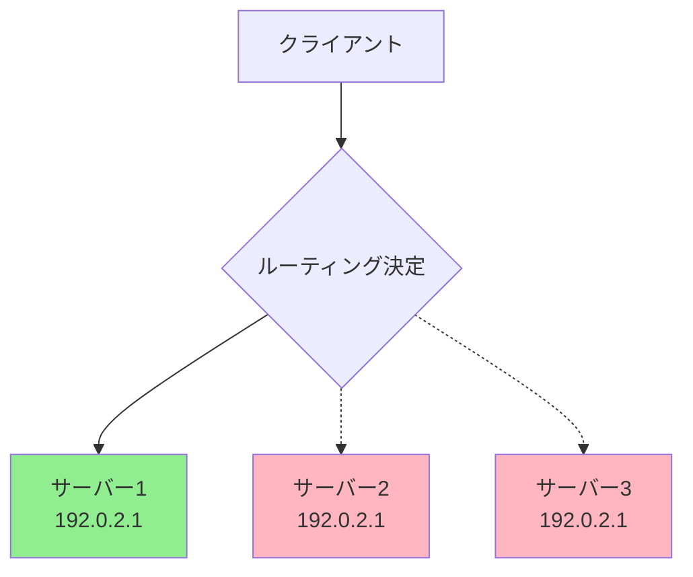
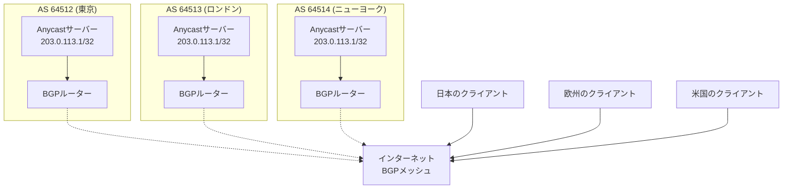
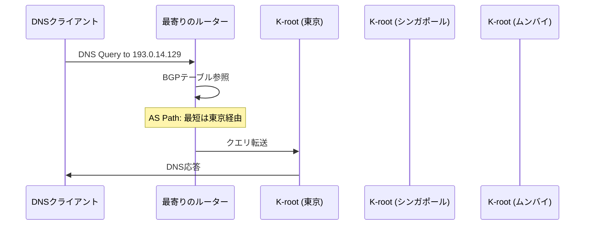
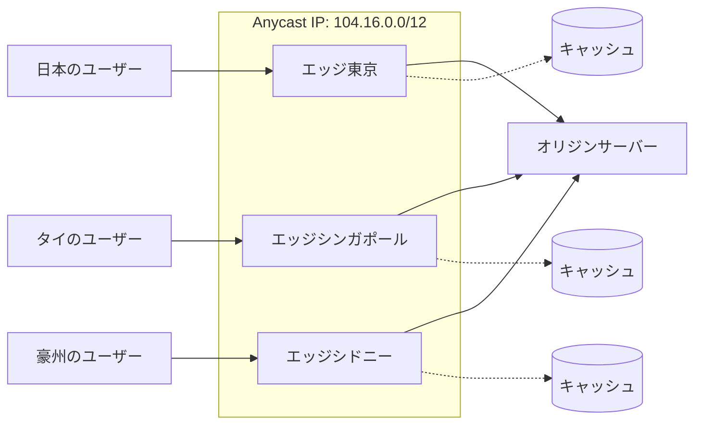
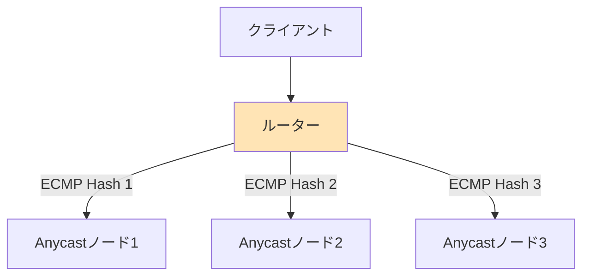

# Anycast

Anycastは、インターネットルーティングアーキテクチャにおける特殊なアドレッシング方式であり、単一のIPアドレスを複数の物理的に離れたサーバーが共有する技術である。この技術は、パケットが「最も近い」あるいは「最適な」サーバーに自動的にルーティングされるという特性を持ち、現代のインターネットインフラストラクチャにおいて、DNS、CDN、DDoS対策などの重要なサービスの基盤となっている。

## IPアドレッシングモデルとAnycastの位置づけ

インターネットプロトコルにおけるアドレッシング方式は、パケットの配送先をどのように決定するかによって分類される。RFC 1546[^1]およびRFC 4291[^2]では、以下の主要なアドレッシング方式が定義されている。

Unicastは最も一般的な方式であり、1つのIPアドレスが1つのネットワークインターフェースに対応する。送信元から宛先への通信は一対一で行われ、パケットは特定の単一の受信者に配送される。Multicastは、1つのIPアドレスが複数の受信者グループを表し、送信されたパケットはそのグループに属するすべてのメンバーに配送される。Broadcastは、特定のネットワークセグメント内のすべてのノードにパケットを配送する方式である。

Anycastは、これらとは異なる独特の特性を持つ。1つのIPアドレスが複数のノードに割り当てられるが、送信されたパケットはそのうちの「1つ」のノードにのみ配送される。どのノードが選択されるかは、ルーティングプロトコルによって決定される「最適性」に基づく。



## BGPとAnycastの実装原理

Anycastの実装は、Border Gateway Protocol（BGP）の特性を巧みに活用することで実現される。BGPは自律システム（AS）間でルーティング情報を交換するプロトコルであり、インターネットの基幹ルーティングを担っている[^3]。

通常のBGP運用では、各IPプレフィックスは単一の場所から広告される。しかし、Anycastでは同一のIPプレフィックスを複数の地理的に離れた場所から同時に広告する。BGPの経路選択アルゴリズムは、複数の経路が存在する場合、以下の属性を順番に評価して最適な経路を選択する：

1. Local Preference（同一AS内での優先度）
2. AS Path長（経由するASの数）
3. Origin Type（経路の起源）
4. Multi-Exit Discriminator（MED）
5. eBGP/iBGPの区別
6. IGPメトリック（AS内部のコスト）
7. Router ID

この経路選択メカニズムにより、各ルーターは自身から「最も近い」Anycastノードへの経路を選択する。ここでの「近さ」は、物理的な距離ではなく、BGPのメトリックによって定義される論理的な近接性である。



## Anycastの動作メカニズムと経路収束

Anycastシステムが正常に機能するためには、BGPの経路収束（convergence）が重要な役割を果たす。あるAnycastノードが障害やメンテナンスによって利用不可能になった場合、そのノードはBGP広告を停止する。この情報は隣接するBGPピアに伝播し、最終的にグローバルなルーティングテーブルから該当する経路が削除される。

経路の撤回（withdrawal）が完了すると、そのノードに向かっていたトラフィックは自動的に次に最適な別のAnycastノードにリダイレクトされる。この過程は通常数秒から数十秒で完了するが、BGPの収束時間はネットワークトポロジーの複雑さやBGPタイマーの設定に依存する。

BGP Route Flap Dampingのような機構は、頻繁な経路の追加・削除によるルーティングの不安定性を抑制するが、Anycastの文脈では障害時の迅速な切り替えを妨げる可能性がある。そのため、Anycastを運用する際は、これらの機構の調整が必要となる場合がある。

## DNSルートサーバーにおけるAnycastの実装

DNSルートサーバーは、Anycast技術の最も成功した実装例の一つである。現在、13のルートサーバー識別子（A〜M）が存在するが、実際にはAnycastにより世界中に数百のインスタンスが分散配置されている[^4]。

例えば、K-rootサーバー（193.0.14.129）は、RIPE NCCによって運用され、世界中に70以上のインスタンスを持つ。各インスタンスは同一のIPアドレスを使用し、地域のインターネットエクスチェンジポイント（IXP）でBGPを通じて経路を広告する。



この実装により、DNSクエリの応答時間が大幅に短縮され、単一障害点が排除される。また、DDoS攻撃に対する耐性も向上する。攻撃トラフィックは最も近いAnycastノードに吸収され、攻撃の影響が局所化される。

## CDNとエッジコンピューティングにおけるAnycast

Content Delivery Network（CDN）プロバイダーは、Anycastを使用してグローバルなトラフィック分散を実現している。CloudflareやFastlyなどの主要CDNは、HTTPSトラフィックの終端にAnycastを活用し、ユーザーを最寄りのエッジサーバーに自動的に誘導する。

CDNにおけるAnycastの実装は、単純なIPレベルのルーティングを超えた高度な最適化を含む。エッジサーバーは、受信したHTTPリクエストのHost headerを検査し、適切なオリジンサーバーからコンテンツを取得する。この際、キャッシュの有効性、サーバーの負荷、ネットワークの状態などを考慮した動的な判断が行われる。



## TCPセッションの課題と解決策

AnycastとTCPの組み合わせは、特有の技術的課題を提示する。TCPはコネクション指向のプロトコルであり、セッションの確立後は同一のエンドポイント間で通信が継続することを前提としている。しかし、ルーティングの変更によりパケットが異なるAnycastノードに到達すると、TCPセッションが中断される可能性がある。

この問題に対する主要な解決策には以下がある：

**セッション同期**: 複数のAnycastノード間でTCPセッション状態を同期する。これにより、パケットがどのノードに到達してもセッションを継続できる。ただし、同期のオーバーヘッドとレイテンシが課題となる。

**Anycast範囲の制限**: BGPコミュニティやAS-Path prependingを使用して、各Anycastノードがカバーする地理的範囲を制限する。これにより、ルーティング変更の可能性を低減する。

**アプリケーションレベルの対策**: HTTPのようなステートレスプロトコルを使用し、必要に応じてセッション情報をクッキーやトークンで管理する。

## Equal-Cost Multi-Path (ECMP)との相互作用

現代のルーターは、複数の等コスト経路が存在する場合、Equal-Cost Multi-Path（ECMP）ルーティングを使用してトラフィックを分散する[^5]。Anycast環境では、これが予期しない動作を引き起こす可能性がある。

ECMPは通常、送信元/宛先IPアドレスとポート番号のハッシュに基づいてパケットを振り分ける。同一のTCPセッションに属するパケットは同じ経路を通るが、異なるセッションは異なるAnycastノードに到達する可能性がある。これは負荷分散の観点では望ましいが、セッション管理が複雑になる。



## 測定と監視の課題

Anycastシステムの運用において、各ノードのパフォーマンスと可用性を監視することは重要だが、技術的に困難である。従来の監視手法では、特定のノードを指定してテストすることが難しい。

RIPE Atlas[^6]のような分散測定プラットフォームは、世界中の複数の地点からAnycastサービスをテストし、各地域でどのノードが応答しているかを特定できる。また、EDNS Client Subnet（ECS）[^7]を使用することで、DNSクエリがどのAnycastノードで処理されたかを追跡できる。

監視システムは、以下の指標を継続的に収集する必要がある：
- 各ノードへの到達可能性
- 応答時間の分布
- トラフィック量の偏り
- BGP経路の安定性
- ノード間の負荷バランス

## セキュリティ考慮事項

Anycastは、分散型サービス拒否（DDoS）攻撃に対する防御メカニズムとして機能する一方で、新たなセキュリティ上の考慮事項も導入する。

**BGPハイジャック**: 悪意のある第三者が、正当なAnycastプレフィックスよりも具体的な経路を広告することで、トラフィックを横取りする可能性がある。Resource Public Key Infrastructure（RPKI）[^8]の実装により、この脅威を軽減できる。

**経路の漏洩**: 設定ミスにより、Anycastプレフィックスが意図しない範囲に広告される可能性がある。これは、BGPフィルタリングとコミュニティの適切な使用により防止できる。

**ノードの偽装**: 攻撃者が正当なAnycastアドレスを持つ偽のノードを設置する可能性がある。これに対しては、アプリケーションレベルの認証と暗号化が必要である。

## 実装上の詳細設計

Anycastを実装する際の具体的な設計要素には、以下のような考慮事項がある：

**プレフィックス長の選択**: /24以上の具体的なプレフィックスを使用することが推奨される。これより大きなプレフィックス（例：/25）は、一部のISPでフィルタリングされる可能性がある。

**ヘルスチェックとBGP連携**: 各Anycastノードでは、サービスの健全性を監視し、問題が検出された場合は自動的にBGP広告を停止する仕組みが必要である。ExaBGP[^9]のようなプログラマブルBGPデーモンを使用することで、アプリケーションの状態とBGP広告を連携させることができる。

```python
# ExaBGPヘルスチェックスクリプトの例
def health_check():
    try:
        response = requests.get('http://localhost/health', timeout=5)
        if response.status_code == 200:
            return True
    except:
        pass
    return False

if health_check():
    print('announce route 203.0.113.0/24 next-hop self')
else:
    print('withdraw route 203.0.113.0/24')
```

**BGPコミュニティの活用**: 地理的な範囲制御やトラフィックエンジニアリングのために、BGPコミュニティを使用する。例えば、特定の地域のみに広告を制限したり、特定のピアに対してAS-Path prependingを適用したりできる。

## パフォーマンス特性とトレードオフ

Anycastの採用には、明確なトレードオフが存在する。レイテンシの削減とサービスの可用性向上という利点がある一方で、運用の複雑性とデバッグの困難さというコストが伴う。

パフォーマンスの観点では、Anycastは以下の特性を示す：
- 平均レイテンシの大幅な削減（特に地理的に分散したユーザーベースの場合）
- トラフィックの自動的な地域分散
- 単一ノードへの負荷集中の回避

一方で、以下の課題も存在する：
- 非対称ルーティングによるトラブルシューティングの困難さ
- キャッシュ効率の低下（複数ノードで同じコンテンツをキャッシュする必要がある）
- グローバルな一貫性の維持の困難さ

## 実世界での大規模展開事例

Cloudflareは、世界200以上の都市でAnycastを使用し、毎秒2500万以上のHTTPリクエストを処理している。各ポイント・オブ・プレゼンス（PoP）は、同一のIPアドレスレンジを広告し、ローカルのインターネットエクスチェンジでピアリングを行う。

Google Public DNS（8.8.8.8）は、Anycastを使用して世界中で低レイテンシのDNS解決を提供している。興味深いことに、GoogleはAnycast実装において、各地域でのキャッシュヒット率を最適化するために、ECS情報を活用した高度なトラフィックステアリングを行っている。

## 将来の発展方向

Anycast技術は、IPv6の普及とともに新たな可能性を開いている。IPv6の広大なアドレス空間により、より細かい粒度でのAnycast実装が可能になる。また、Segment Routing（SR）[^10]との組み合わせにより、パケットレベルでより精密なトラフィックエンジニアリングが実現できる。

Software-Defined Networking（SDN）の文脈では、Anycastの動的な制御が可能になりつつある。OpenFlowコントローラーを使用して、リアルタイムのネットワーク状態に基づいてAnycastトラフィックの振り分けを調整できる。

エッジコンピューティングの普及に伴い、Anycastはコンピュート資源の動的な配置にも応用されている。関数型サービス（FaaS）プラットフォームでは、Anycastを使用してリクエストを最も適切なコンピュートノードにルーティングし、レイテンシを最小化しながらリソース利用を最適化している。

[^1]: Partridge, C., Mendez, T., & Milliken, W. (1993). Host Anycasting Service. RFC 1546.
[^2]: Hinden, R., & Deering, S. (2006). IP Version 6 Addressing Architecture. RFC 4291.
[^3]: Rekhter, Y., Li, T., & Hares, S. (2006). A Border Gateway Protocol 4 (BGP-4). RFC 4271.
[^4]: Root Server Technical Operations Association. (2023). Root Server System. https://root-servers.org/
[^5]: Thaler, D., & Hopps, C. (2000). Multipath Issues in Unicast and Multicast Next-Hop Selection. RFC 2991.
[^6]: RIPE NCC. (2023). RIPE Atlas. https://atlas.ripe.net/
[^7]: Contavalli, C., van der Gaast, W., Lawrence, D., & Kumari, W. (2016). Client Subnet in DNS Queries. RFC 7871.
[^8]: Lepinski, M., & Kent, S. (2012). An Infrastructure to Support Secure Internet Routing. RFC 6480.
[^9]: Exa Networks. (2023). ExaBGP. https://github.com/Exa-Networks/exabgp
[^10]: Filsfils, C., Previdi, S., Ginsberg, L., Decraene, B., Litkowski, S., & Shakir, R. (2018). Segment Routing Architecture. RFC 8402.