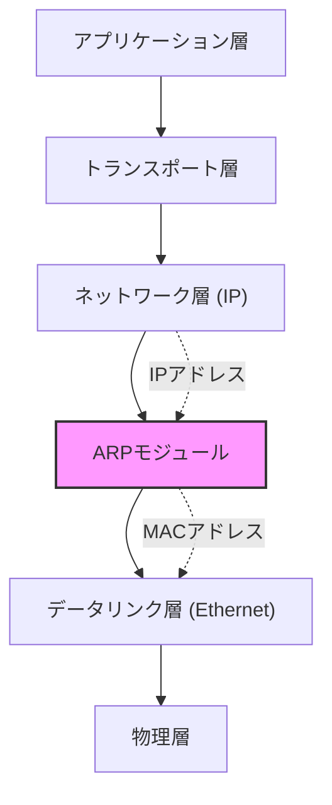
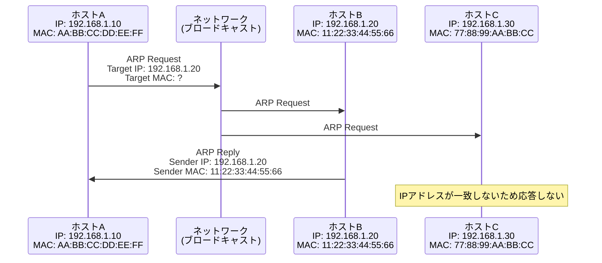
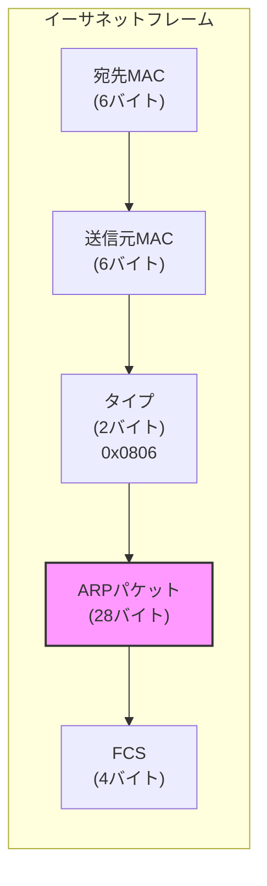
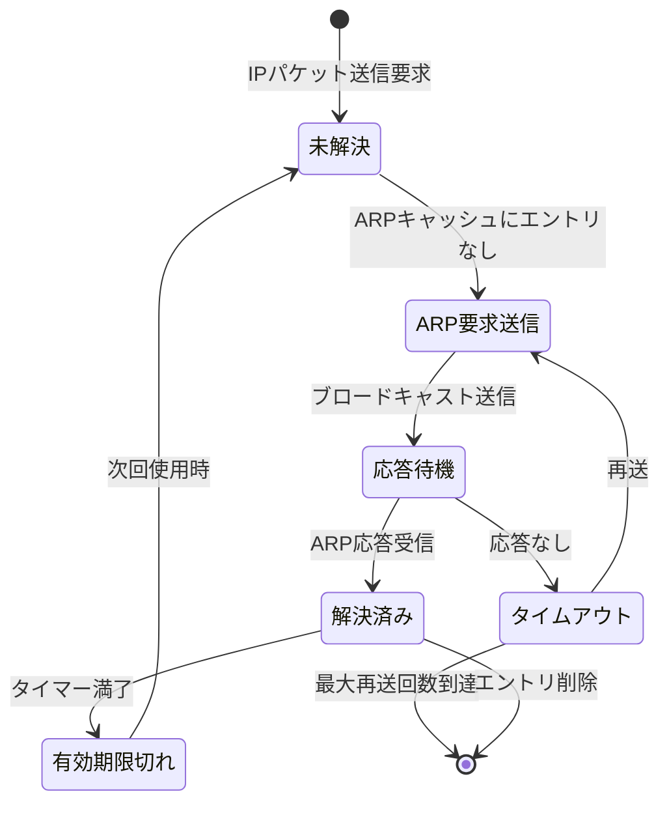
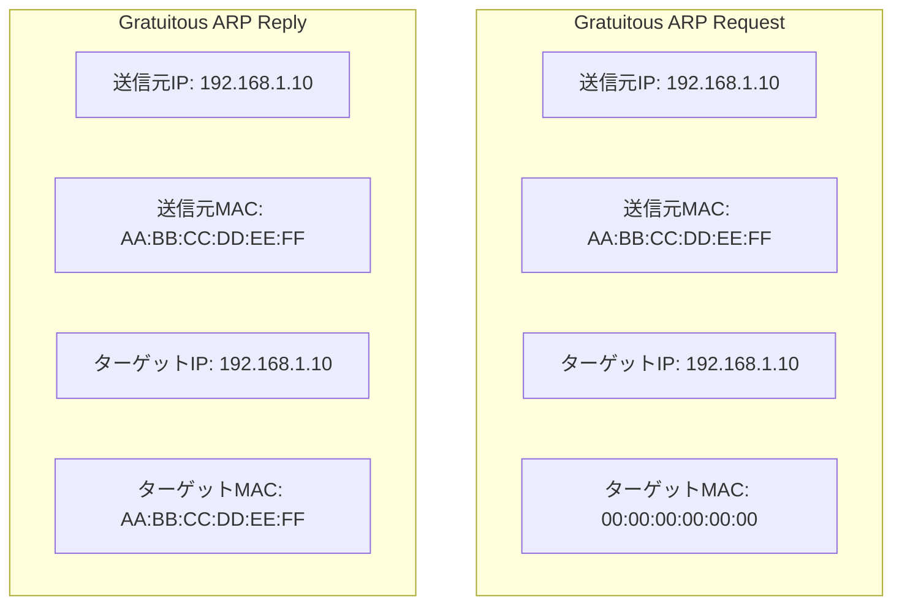
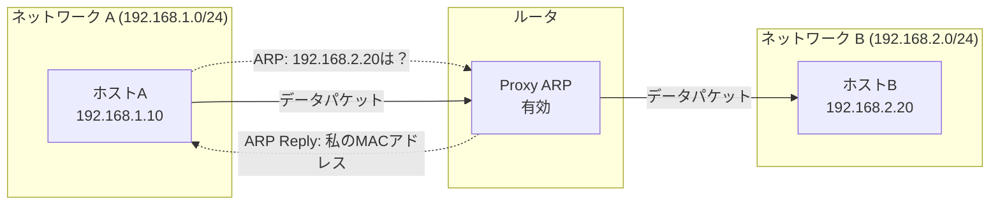
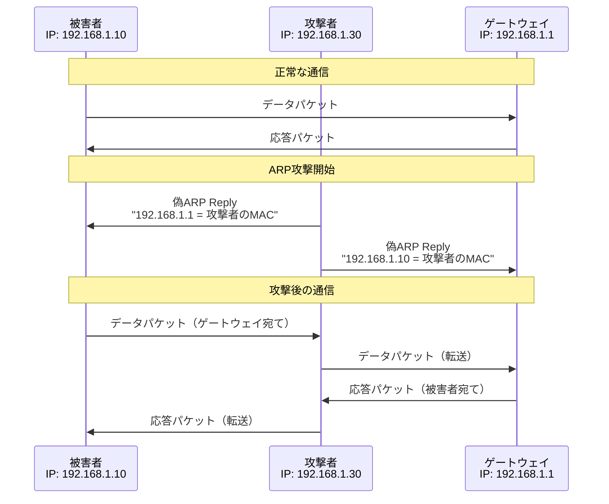
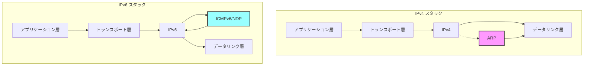
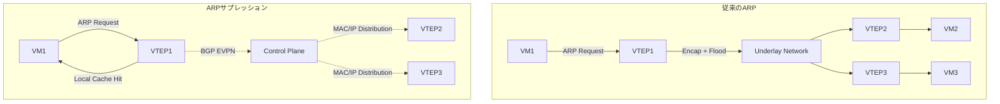

# ARP（Address Resolution Protocol）

イーサネットのような共有メディア型ネットワークにおいて、IPアドレスからMACアドレスへの変換は通信の基本的な要件となる。TCP/IPプロトコルスタックはネットワーク層でIPアドレスを用いて経路制御を行うが、実際のフレーム転送はデータリンク層のMACアドレスに基づいて行われる。この二つのアドレス体系を橋渡しする役割を担うのがARP（Address Resolution Protocol）である。

ARPはRFC 826で定義されたプロトコルで、ネットワーク層アドレス（典型的にはIPアドレス）からデータリンク層アドレス（典型的にはMACアドレス）への動的な変換を可能にする。このプロトコルは主にイーサネットとIPv4の組み合わせで使用されるが、設計上は他のネットワーク技術やプロトコルにも適用可能な汎用性を持つ。



ネットワーク通信において、送信元ホストが宛先ホストにパケットを送信する際、IPルーティングによって次ホップのIPアドレスが決定される。しかし、実際にイーサネットフレームを構築して送信するためには、その次ホップのMACアドレスが必要となる。ARPはこの変換を動的に実現するメカニズムを提供する。

## ARPの動作原理

ARPプロトコルの基本的な動作は、ブロードキャストによる問い合わせとユニキャストによる応答という非常にシンプルなモデルに基づいている。ホストAがホストBと通信したい場合、まずホストBのIPアドレスに対応するMACアドレスを知る必要がある。ホストAは自身のARPキャッシュを確認し、該当するエントリが存在しない場合、ARP要求（ARP Request）をブロードキャストする。



ARP要求パケットには送信元のIPアドレスとMACアドレス、そして問い合わせ対象のIPアドレスが含まれる。このパケットはイーサネットのブロードキャストアドレス（FF:FF:FF:FF:FF:FF）宛てに送信されるため、同一ネットワークセグメント上のすべてのホストがこのパケットを受信する。受信したホストは、ARP要求に含まれるターゲットIPアドレスが自身のIPアドレスと一致するかを確認する。

ターゲットIPアドレスを持つホストは、ARP応答（ARP Reply）を送信元ホストに直接送信する。この応答にはターゲットホストのMACアドレスが含まれており、送信元ホストはこの情報を用いて通信を開始できるようになる。また、効率化のため、ARP要求を受信したターゲットホストは、送信元ホストのIPアドレスとMACアドレスの対応を自身のARPキャッシュに記録する。

## ARPパケットフォーマット

ARPパケットはイーサネットフレームのペイロードとして送信される。イーサネットヘッダのタイプフィールドには0x0806が設定され、これによってARPパケットであることが識別される。ARPパケット自体は28バイトの固定長構造を持つ（イーサネットとIPv4の場合）。



ARPパケットの詳細な構造は以下の通りである：

| フィールド | サイズ（バイト） | 説明 |
|-----------|----------------|------|
| Hardware Type | 2 | ハードウェアタイプ（イーサネット: 0x0001） |
| Protocol Type | 2 | プロトコルタイプ（IPv4: 0x0800） |
| Hardware Length | 1 | ハードウェアアドレス長（イーサネット: 6） |
| Protocol Length | 1 | プロトコルアドレス長（IPv4: 4） |
| Operation | 2 | 操作コード（Request: 1, Reply: 2） |
| Sender Hardware Address | 6 | 送信元MACアドレス |
| Sender Protocol Address | 4 | 送信元IPアドレス |
| Target Hardware Address | 6 | ターゲットMACアドレス |
| Target Protocol Address | 4 | ターゲットIPアドレス |

Hardware TypeとProtocol Typeフィールドによって、ARPは様々なネットワーク技術とプロトコルの組み合わせに対応できる汎用性を持つ。ただし、実際にはイーサネットとIPv4の組み合わせが圧倒的に多く使用されている。

ARP要求の場合、Target Hardware Addressフィールドは通常すべて0で埋められる（00:00:00:00:00:00）。これは、まさにこのアドレスを知りたいという要求の性質を反映している。一方、ARP応答では、このフィールドに実際のMACアドレスが設定される。

## ARPキャッシュとタイミング特性

ARPによるアドレス解決は、ネットワーク上でブロードキャストトラフィックを発生させるため、毎回の通信でARPを実行することは非効率的である。このため、オペレーティングシステムはARPキャッシュ（ARPテーブル）を維持し、一度解決したIPアドレスとMACアドレスの対応関係を一定期間保存する。



ARPキャッシュのエントリには通常、以下の情報が含まれる：

- IPアドレス
- MACアドレス
- インターフェース識別子
- 状態（完全、不完全、スタティック等）
- 有効期限タイマー

Linuxシステムでは、`/proc/sys/net/ipv4/neigh/default/`以下のパラメータでARPキャッシュの動作を制御できる。主要なパラメータには以下のものがある：

| パラメータ | デフォルト値 | 説明 |
|-----------|------------|------|
| base_reachable_time | 30秒 | エントリが到達可能と見なされる基本時間 |
| gc_stale_time | 60秒 | 古いエントリがガベージコレクションされるまでの時間 |
| retrans_time | 1秒 | ARP要求の再送間隔 |
| app_solicit | 0 | アプリケーションレベルでの解決試行回数 |
| ucast_solicit | 3 | ユニキャストARP要求の送信回数 |
| mcast_solicit | 3 | マルチキャストARP要求の送信回数 |

ARPキャッシュの状態遷移は、Neighbor Unreachability Detection (NUD) と呼ばれるメカニズムによって管理される。エントリは以下の状態を遷移する：

1. **INCOMPLETE**: ARP要求を送信したが、まだ応答を受信していない状態
2. **REACHABLE**: 有効なエントリで、到達可能性が確認されている状態
3. **STALE**: 有効期限が切れたが、まだキャッシュに残っている状態
4. **DELAY**: 到達可能性の再確認を開始する前の遅延状態
5. **PROBE**: 到達可能性を積極的に確認している状態
6. **FAILED**: 到達不可能と判断された状態

この状態管理により、ネットワークの動的な変化（ホストの移動、NICの交換等）に対応しながら、不要なARPトラフィックを最小限に抑えることができる。

## Gratuitous ARP

Gratuitous ARP（GARP）は、ホストが自身のIPアドレスに対するARP要求またはARP応答を送信する特殊なARPの使用法である。つまり、送信元IPアドレスとターゲットIPアドレスが同一のARPパケットである。この一見無意味に見える動作には、実は重要な用途がある。



Gratuitous ARPの主な用途は以下の通りである：

**1. IPアドレスの重複検出**
ホストが新しいIPアドレスを設定する際、そのアドレスがネットワーク上で既に使用されていないかを確認するためにGratuitous ARP要求を送信する。もし同じIPアドレスを持つ他のホストが存在する場合、そのホストからARP応答が返される。

**2. ARPキャッシュの更新**
ホストのMACアドレスが変更された場合（NICの交換等）、Gratuitous ARPを送信することで、ネットワーク上の他のホストのARPキャッシュを更新できる。これにより、古いMACアドレスへのパケット送信による通信障害を防ぐことができる。

**3. 高可用性構成での切り替え通知**
VRRP（Virtual Router Redundancy Protocol）やHSRP（Hot Standby Router Protocol）などの冗長化プロトコルでは、アクティブ機器が切り替わった際にGratuitous ARPを送信する。これにより、仮想IPアドレスに対応する物理MACアドレスの変更を即座にネットワーク全体に通知できる。

**4. スイッチのMACアドレステーブル更新**
L2スイッチは受信フレームの送信元MACアドレスを学習してMACアドレステーブルを構築する。Gratuitous ARPを送信することで、スイッチのMACアドレステーブルを強制的に更新し、適切なポートへのフレーム転送を確保できる。

Gratuitous ARPの実装には注意すべき点がある。RFC 5227では、IPアドレスの重複検出のためのAddress Conflict Detection（ACD）が標準化されており、以下のような推奨事項が示されている：

- ARP Probeの送信：IPアドレスを使用する前に、送信元IPアドレスを0.0.0.0としたARP要求を送信する
- 待機時間：最初のProbeを送信する前に0〜1秒のランダムな待機時間を設ける
- 再送：応答がない場合、1〜2秒間隔で合計3回のProbeを送信する
- ARP Announcementの送信：重複が検出されなかった場合、Gratuitous ARPを2回送信してアドレスの使用を通知する

## Proxy ARP

Proxy ARPは、ルータやゲートウェイが他のホストの代わりにARP要求に応答する機能である。この機能により、異なるネットワークセグメントに存在するホスト間で、あたかも同一セグメントにいるかのような透過的な通信が可能になる。



Proxy ARPが有効な場合の動作シーケンスは以下のようになる：

1. ホストA（192.168.1.10）がホストB（192.168.2.20）と通信しようとする
2. ホストAは誤った設定（例：/16のサブネットマスク）により、ホストBが同一セグメントにいると判断
3. ホストAは192.168.2.20のMACアドレスを解決するためARP要求をブロードキャスト
4. ルータはProxy ARPが有効で、192.168.2.0/24への経路を持っているため、自身のMACアドレスでARP応答
5. ホストAはルータのMACアドレス宛てにパケットを送信
6. ルータは受信したパケットを通常通りルーティングしてホストBに転送

Proxy ARPには以下のような利点がある：

- **設定の簡素化**: ホストのルーティング設定が不適切でも通信が可能
- **透過的なネットワーク拡張**: 物理的に異なるセグメントを論理的に統合
- **レガシーシステムのサポート**: 静的ルーティングしかサポートしないシステムへの対応

一方で、以下のような問題点も存在する：

- **セキュリティリスク**: 本来到達できないホストへのアクセスを許可する可能性
- **トラブルシューティングの困難化**: ネットワークトポロジーが不明瞭になる
- **スケーラビリティの問題**: 大規模ネットワークではARPキャッシュが肥大化
- **ブロードキャストドメインの実質的な拡大**: ARP要求の増加によるトラフィック増

現代のネットワーク設計では、Proxy ARPの使用は推奨されない。代わりに、適切なルーティング設定とVLANによるセグメンテーションが推奨される。ただし、特定の移行シナリオや互換性要件がある場合には、依然として有用な技術である。

## ARPスプーフィングとセキュリティ脅威

ARPプロトコルは認証メカニズムを持たないため、悪意のあるホストが偽のARP応答を送信することが可能である。このような攻撃はARPスプーフィング（ARPポイズニング）と呼ばれ、中間者攻撃（Man-in-the-Middle Attack）の基礎となる。



ARPスプーフィング攻撃の典型的なシナリオは以下の通りである：

**1. 基本的なARP キャッシュポイズニング**
攻撃者は被害者に対して、ゲートウェイのIPアドレスと攻撃者のMACアドレスを結びつける偽のARP応答を送信する。同様に、ゲートウェイに対しても被害者のIPアドレスと攻撃者のMACアドレスを結びつける偽のARP応答を送信する。

**2. 攻撃の影響**
- **トラフィックの盗聴**: すべての通信が攻撃者を経由するため、平文通信の内容が露見する
- **データの改ざん**: 攻撃者は転送するパケットの内容を任意に変更できる
- **サービス妨害**: 攻撃者がパケットを転送しない場合、通信が遮断される
- **セッションハイジャック**: HTTPSなどの暗号化通信でも、初期接続時の攻撃により証明書の検証を回避される可能性

**3. 検出手法**
ARPスプーフィングの検出には以下のような手法が用いられる：

- **ARPキャッシュの監視**: 同一IPアドレスに対するMACアドレスの急激な変更を検出
- **重複するARP応答の検出**: 要求していないARP応答や過度に頻繁なARP応答を監視
- **静的ARPエントリとの比較**: 重要なホストについて静的エントリを設定し、動的な変更を検出
- **双方向ARP検証**: IPアドレスからMACアドレス、MACアドレスからIPアドレスの両方向の整合性確認

**4. 防御手法**

静的ARPエントリの使用は最も確実な防御手法であるが、管理の手間が大きいため実用的でない場合が多い。そのため、以下のような動的な防御手法が開発されている：

**Dynamic ARP Inspection (DAI)**
スイッチレベルでARPパケットを検査し、DHCPスヌーピングデータベースやスタティックに設定されたバインディングと照合する。不正なARPパケットは破棄される。

```
interface GigabitEthernet0/1
 ip arp inspection limit rate 15
 ip arp inspection trust
!
ip arp inspection vlan 10-20
ip arp inspection validate src-mac dst-mac ip
```

**DHCP Snooping**
DHCPメッセージを監視し、正当なIPアドレスとMACアドレスのバインディングを学習する。このデータベースはDAIの参照情報として使用される。

**Port Security**
スイッチポートに接続可能なMACアドレスを制限し、不正なデバイスの接続を防ぐ。

**ArpON、XArp等のツール**
ホストレベルでARPキャッシュを保護し、不正な更新を防ぐツール。静的エントリと動的エントリのハイブリッド管理を提供する。

**5. 実装例：ARPスプーフィング検出スクリプト**

```python
#!/usr/bin/env python3
import scapy.all as scapy
import time
from collections import defaultdict

class ARPMonitor:
    def __init__(self):
        self.arp_table = {}
        self.alert_threshold = 5
        self.mac_changes = defaultdict(list)
    
    def process_packet(self, packet):
        if packet.haslayer(scapy.ARP) and packet[scapy.ARP].op == 2:  # ARP Reply
            ip = packet[scapy.ARP].psrc
            mac = packet[scapy.ARP].hwsrc
            
            if ip in self.arp_table and self.arp_table[ip] != mac:
                print(f"[ALERT] MAC address change detected!")
                print(f"  IP: {ip}")
                print(f"  Old MAC: {self.arp_table[ip]}")
                print(f"  New MAC: {mac}")
                
                self.mac_changes[ip].append({
                    'time': time.time(),
                    'old_mac': self.arp_table[ip],
                    'new_mac': mac
                })
                
                # Check for rapid changes
                recent_changes = [c for c in self.mac_changes[ip] 
                                if time.time() - c['time'] < 60]
                if len(recent_changes) > self.alert_threshold:
                    print(f"[CRITICAL] Possible ARP spoofing attack on {ip}")
            
            self.arp_table[ip] = mac
    
    def start_monitoring(self, interface):
        print(f"Starting ARP monitoring on {interface}")
        scapy.sniff(iface=interface, store=False, 
                   prn=self.process_packet, filter="arp")

if __name__ == "__main__":
    monitor = ARPMonitor()
    monitor.start_monitoring("eth0")
```

## IPv6とNeighbor Discovery Protocol

IPv6環境では、ARPの役割はNeighbor Discovery Protocol（NDP）のNeighbor Solicitation（NS）とNeighbor Advertisement（NA）メッセージによって置き換えられる。NDPはICMPv6をベースとしており、ARPと比較して以下のような改良が加えられている：



**NDPの主要な改良点：**

1. **セキュアな実装の考慮**
   - SEND（Secure Neighbor Discovery）による暗号学的な保護
   - Cryptographically Generated Addresses（CGA）のサポート
   - RSA署名オプションによる認証

2. **効率的なマルチキャスト使用**
   - Solicited-nodeマルチキャストアドレスによる限定的なマルチキャスト
   - ブロードキャストの完全な排除

3. **統合されたプロトコル設計**
   - ルータ発見、プレフィックス発見、パラメータ発見の統合
   - リダイレクト機能の改良
   - Duplicate Address Detection（DAD）の標準化

4. **拡張性の向上**
   - オプションフィールドによる将来の拡張への対応
   - より大きなアドレス空間への対応（128ビット）

**Neighbor Solicitationメッセージフォーマット：**

```
 0                   1                   2                   3
 0 1 2 3 4 5 6 7 8 9 0 1 2 3 4 5 6 7 8 9 0 1 2 3 4 5 6 7 8 9 0 1
+-+-+-+-+-+-+-+-+-+-+-+-+-+-+-+-+-+-+-+-+-+-+-+-+-+-+-+-+-+-+-+-+
|     Type      |     Code      |          Checksum             |
+-+-+-+-+-+-+-+-+-+-+-+-+-+-+-+-+-+-+-+-+-+-+-+-+-+-+-+-+-+-+-+-+
|                           Reserved                            |
+-+-+-+-+-+-+-+-+-+-+-+-+-+-+-+-+-+-+-+-+-+-+-+-+-+-+-+-+-+-+-+-+
|                                                               |
+                                                               +
|                                                               |
+                       Target Address                          +
|                                                               |
+                                                               +
|                                                               |
+-+-+-+-+-+-+-+-+-+-+-+-+-+-+-+-+-+-+-+-+-+-+-+-+-+-+-+-+-+-+-+-+
|   Options ...
+-+-+-+-+-+-+-+-+-+-+-+-
```

IPv4からIPv6への移行期においては、両プロトコルが共存する環境（デュアルスタック）での運用が必要となる。この場合、以下の考慮事項がある：

- ARPとNDPの両方のキャッシュ管理
- セキュリティポリシーの一貫性確保
- 監視ツールの両プロトコル対応
- トラブルシューティング手法の習得

## 性能特性と最適化

ARPの性能は、ネットワーク全体のパフォーマンスに大きな影響を与える。特に大規模なデータセンターやクラウド環境では、ARPトラフィックの最適化が重要な課題となる。

**1. ARPストームとその対策**

仮想化環境やコンテナ環境では、多数の仮想インターフェースが動的に作成・削除される。これにより、以下のような問題が発生する可能性がある：

- 大量のGratuitous ARPによるブロードキャストストーム
- ARPキャッシュのオーバーフロー
- スイッチのMACアドレステーブルの枯渇

対策として、以下のような手法が用いられる：

```bash
# Linux での ARP キャッシュサイズの調整
echo 8192 > /proc/sys/net/ipv4/neigh/default/gc_thresh3
echo 4096 > /proc/sys/net/ipv4/neigh/default/gc_thresh2
echo 2048 > /proc/sys/net/ipv4/neigh/default/gc_thresh1

# ARP 要求レート制限
echo 100 > /proc/sys/net/ipv4/neigh/default/app_solicit
echo 200 > /proc/sys/net/ipv4/neigh/default/gc_interval
```

**2. VXLANとARPサプレッション**

オーバーレイネットワーク技術であるVXLANでは、ARPサプレッション機能によってARPトラフィックを削減する：



VTEPがローカルにMAC/IPバインディングをキャッシュし、可能な限りローカルで応答することで、オーバーレイネットワーク全体へのフラッディングを回避する。

**3. ハードウェアオフロード**

現代のNICやスマートNICでは、ARPプロセシングのハードウェアオフロードがサポートされている：

- ARP応答の自動生成
- ARPフィルタリング
- レート制限
- キャッシュ管理

これにより、CPUリソースの消費を削減し、低レイテンシでのARP処理が可能となる。

## 実装の詳細と相互運用性

ARPの実装は、RFCの仕様に加えて、各オペレーティングシステムやネットワーク機器ベンダーによる拡張や最適化が行われている。これらの実装の違いは、時として相互運用性の問題を引き起こす。

**Linuxカーネルの実装**

Linuxカーネルでは、ARPの処理は`net/ipv4/arp.c`で実装されている。主要な特徴として：

- Neighbor Subsystemとの統合（IPv6 NDPと共通の基盤）
- 非同期処理によるパフォーマンス最適化
- Netfilterフレームワークとの統合によるフィルタリング機能
- `/proc/sys/net/ipv4/conf/*/arp_*`による細かな動作制御

特に注目すべきパラメータ：

```bash
# ARP flux の制御
echo 1 > /proc/sys/net/ipv4/conf/all/arp_filter
echo 2 > /proc/sys/net/ipv4/conf/all/arp_announce
echo 1 > /proc/sys/net/ipv4/conf/all/arp_ignore

# Proxy ARP の有効化/無効化
echo 0 > /proc/sys/net/ipv4/conf/all/proxy_arp

# Gratuitous ARP の受け入れ
echo 1 > /proc/sys/net/ipv4/conf/all/arp_accept
```

**Windows実装の特徴**

Windowsでは、ARPキャッシュの管理がより保守的に行われる：

- デフォルトでのARPキャッシュ有効期限が長い（最大10分）
- 不完全なエントリの積極的な削除
- NetBIOSとの統合による名前解決の補完

**BSD系実装**

FreeBSDやOpenBSDでは、以下のような特徴がある：

- `arp -s`による永続的な静的エントリ
- `ifconfig`のlink0-2フラグによるARP動作の制御
- より厳格なセキュリティデフォルト設定

**相互運用性の問題と解決策**

1. **ARP Flux問題**
   複数のインターフェースを持つLinuxホストが、異なるインターフェースのIPアドレスに対してもARP応答を返す問題。

   解決策：
   ```bash
   # 厳格なARP応答制御
   echo 1 > /proc/sys/net/ipv4/conf/all/arp_ignore
   echo 2 > /proc/sys/net/ipv4/conf/all/arp_announce
   ```

2. **Gratuitous ARPの解釈の違い**
   一部の実装では、Gratuitous ARP要求とGratuitous ARP応答を異なって処理する。

3. **タイミングの違い**
   ARPキャッシュの有効期限やプローブ間隔の違いによる不整合。

## トラブルシューティングと診断

ARPに関連する問題は、ネットワーク接続性の問題として現れることが多い。効果的なトラブルシューティングには、適切なツールと手法の理解が必要である。

**一般的な問題パターン：**

1. **ARPキャッシュの不整合**
   - 症状：特定のホストとの通信が断続的に失敗
   - 原因：古いARPエントリ、重複IPアドレス
   - 診断：`arp -a`でキャッシュ確認、`arping`で応答確認

2. **ARPスプーフィング攻撃**
   - 症状：通信の盗聴、改ざん、遮断
   - 原因：悪意のあるARP応答の注入
   - 診断：`arpwatch`による監視、パケットキャプチャ解析

3. **ネットワーク設定の誤り**
   - 症状：ローカルセグメント外との通信不能
   - 原因：サブネットマスクの誤設定、VLANの設定ミス
   - 診断：`ip addr`、`ip route`による設定確認

**診断ツールの使用例：**

```bash
# arping による到達性確認
arping -I eth0 192.168.1.1

# tcpdump による ARP トラフィックの監視
tcpdump -i eth0 -nn arp

# Wireshark フィルタ
arp.opcode == 1  # ARP Request
arp.opcode == 2  # ARP Reply
arp.duplicate-address-detected  # 重複アドレス検出

# arp コマンドによるキャッシュ操作
arp -d 192.168.1.100  # エントリ削除
arp -s 192.168.1.100 00:11:22:33:44:55  # 静的エントリ追加
```

**高度な診断手法：**

1. **パケットトレース解析**
   ```python
   # Scapy を使用した ARP パケット解析
   from scapy.all import *
   
   def analyze_arp(packet):
       if ARP in packet:
           if packet[ARP].op == 1:  # Request
               print(f"ARP Request: {packet[ARP].psrc} asking for {packet[ARP].pdst}")
           elif packet[ARP].op == 2:  # Reply
               print(f"ARP Reply: {packet[ARP].psrc} is at {packet[ARP].hwsrc}")
   
   sniff(filter="arp", prn=analyze_arp, count=100)
   ```

2. **統計情報の収集**
   ```bash
   # Linux
   ip -s neigh show
   nstat -az | grep -i arp
   
   # パフォーマンスカウンタ
   cat /proc/net/stat/arp_cache
   ```

## 将来の展望と代替技術

ARPは40年以上にわたってイーサネットネットワークの基盤技術として使用されてきたが、現代のネットワーク要件に対していくつかの限界が明らかになっている。

**ARPの限界：**

1. **スケーラビリティ**: ブロードキャストベースの設計は大規模ネットワークに適さない
2. **セキュリティ**: 認証メカニズムの欠如
3. **効率性**: キャッシュ管理のオーバーヘッド
4. **柔軟性**: 動的なネットワーク環境への対応の困難さ

**代替・補完技術：**

1. **Software Defined Networking (SDN)**
   - OpenFlowによる集中的なフロー管理
   - ARPの機能をコントローラで実装
   - プロアクティブなフロールール設定

2. **LISP (Locator/ID Separation Protocol)**
   - エンドポイントIDとロケータの分離
   - ARPのようなマッピングをコントロールプレーンで解決

3. **Segment Routing over IPv6 (SRv6)**
   - ソースルーティングによる明示的なパス指定
   - エンドポイントの直接指定によるARP不要化

4. **Named Data Networking (NDN)**
   - コンテンツ中心のネットワーキング
   - 名前ベースのルーティング

これらの新技術は、特定の環境や用途においてARPの代替となる可能性があるが、既存のインフラストラクチャとの互換性や移行コストを考慮すると、ARPは当面の間、イーサネットネットワークの重要な構成要素として残り続けるであろう。

ネットワークエンジニアとしては、ARPの基本的な動作原理を理解した上で、その限界を認識し、適切な補完技術や代替技術を選択・適用する能力が求められる。特に、セキュリティ面での脆弱性に対する理解と対策は、現代のネットワーク運用において不可欠な要素となっている。

---

[^1]: Plummer, D. (1982). *An Ethernet Address Resolution Protocol*. RFC 826. IETF. https://datatracker.ietf.org/doc/html/rfc826

[^2]: Cheshire, S. (2008). *IPv4 Address Conflict Detection*. RFC 5227. IETF. https://datatracker.ietf.org/doc/html/rfc5227

[^3]: Arkko, J., Kempf, J., Zill, B., & Nikander, P. (2005). *SEcure Neighbor Discovery (SEND)*. RFC 3971. IETF. https://datatracker.ietf.org/doc/html/rfc3971

[^4]: Narten, T., Nordmark, E., Simpson, W., & Soliman, H. (2007). *Neighbor Discovery for IP version 6 (IPv6)*. RFC 4861. IETF. https://datatracker.ietf.org/doc/html/rfc4861

[^5]: Atkinson, R. (1998). *Security Architecture for the Internet Protocol*. RFC 2401. IETF. https://datatracker.ietf.org/doc/html/rfc2401