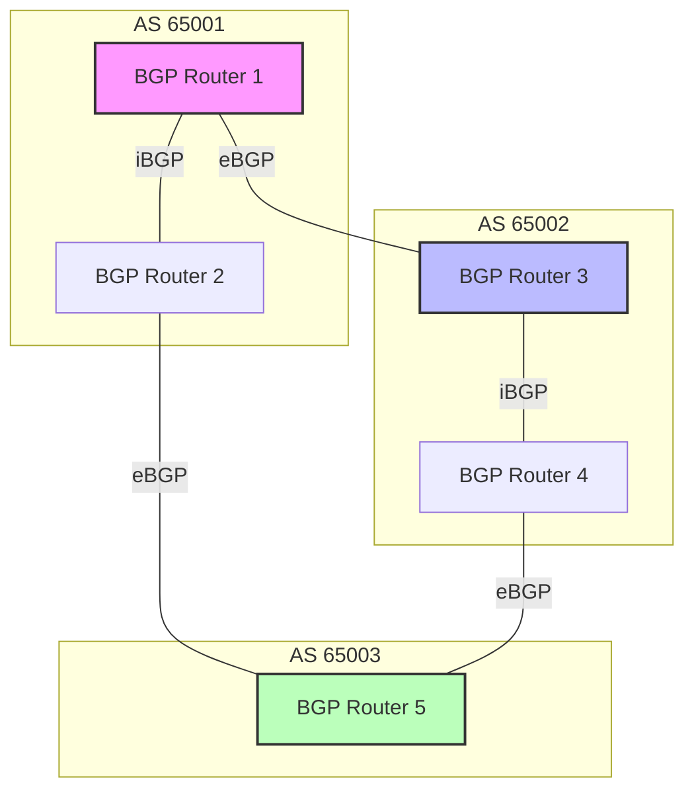
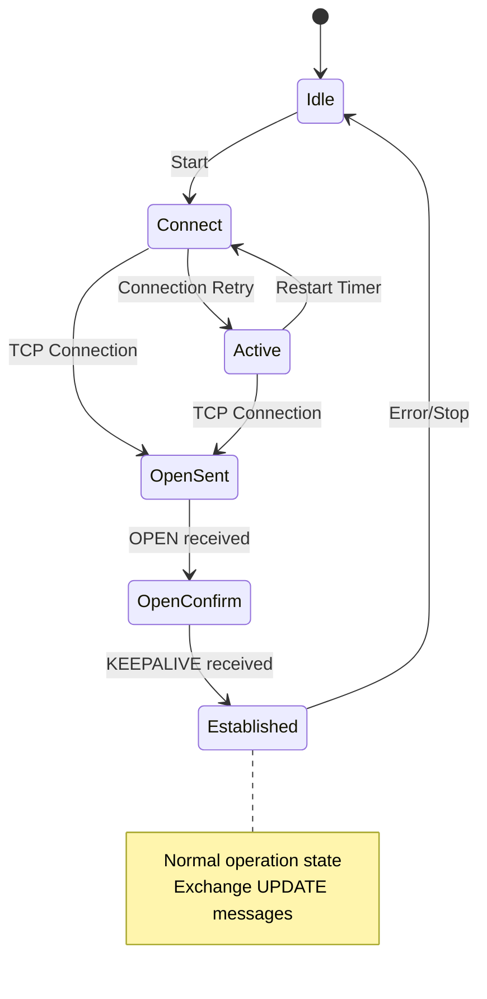
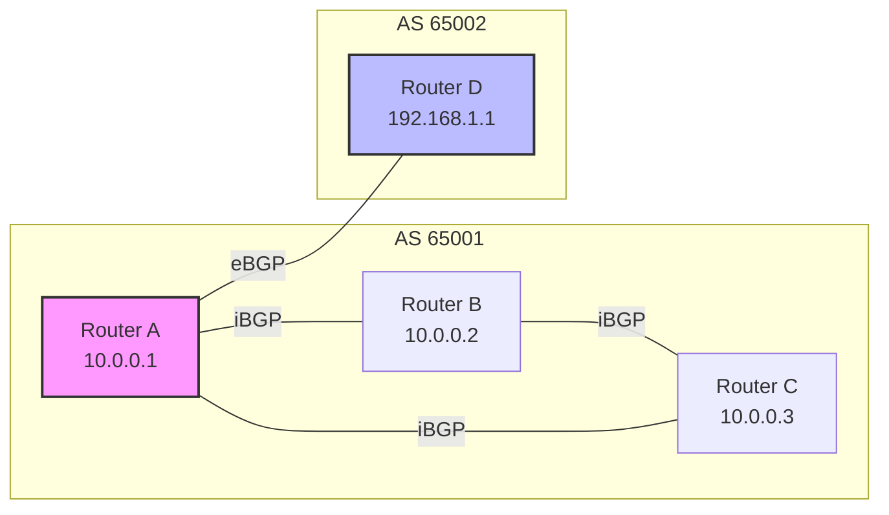

# BGP (Border Gateway Protocol)

インターネットの基盤を支えるBGP（Border Gateway Protocol）は、自律システム（AS: Autonomous System）間で経路情報を交換するパスベクタープロトコルである。RFC 4271[^1]で標準化されているBGP-4は、現在のインターネットにおけるデファクトスタンダードとなっており、その設計哲学と実装は、分散システムにおける一貫性と可用性のトレードオフを体現している。

BGPの本質は、異なる管理ドメイン間での協調的な経路制御にある。各ASは独自のポリシーに基づいて経路を選択し、隣接ASに広告する。この自律的な振る舞いの集合体として、グローバルな到達可能性が実現される。しかし、この分散性ゆえに、経路のループや振動（route flapping）、ブラックホールといった問題も内在している。



## プロトコルの基本動作

BGPはTCPポート179を使用し、信頼性のある接続上でメッセージを交換する。この設計選択は、UDPベースのルーティングプロトコルとは対照的であり、経路情報の確実な伝達を優先している。BGPセッションの確立は、有限状態機械（FSM）として定義され、Idle、Connect、Active、OpenSent、OpenConfirm、Establishedの6つの状態を遷移する。

セッション確立後、BGPピアは4種類のメッセージを交換する。OPENメッセージはセッション確立時のパラメータ交換に使用され、KEEPALIVEメッセージは接続の生存確認を行う。UPDATEメッセージは経路情報の追加・削除を通知し、NOTIFICATIONメッセージはエラー通知とセッション終了に使用される。



UPDATEメッセージの構造は、BGPの設計思想を反映している。撤回される経路（Withdrawn Routes）、パスアトリビュート（Path Attributes）、新たに広告される経路（Network Layer Reachability Information: NLRI）の3つの部分から構成される。この構造により、単一のメッセージで複数の経路の追加と削除を効率的に伝達できる。

## 経路選択アルゴリズム

BGPの経路選択プロセスは、複数の基準を段階的に適用する決定論的アルゴリズムである。同一宛先への複数の経路が存在する場合、以下の順序で最適経路が選択される[^2]：

1. **NEXT_HOPの到達可能性確認**：到達不可能なNEXT_HOPを持つ経路は選択対象から除外される
2. **LOCAL_PREFの比較**：iBGPピアから学習した経路間で、最も高いLOCAL_PREF値を持つ経路を優先
3. **AS_PATHの長さ**：最も短いAS_PATH長を持つ経路を選択
4. **ORIGINアトリビュート**：IGP < EGP < INCOMPLETEの順で優先
5. **MEDの比較**：同一隣接ASからの経路間で、最も低いMED値を選択
6. **eBGP/iBGPの区別**：eBGP経路をiBGP経路より優先
7. **IGPメトリック**：NEXT_HOPへの最も低いIGPメトリックを持つ経路を選択

この階層的な選択基準により、各ASは自身のポリシーを反映しつつ、グローバルな経路の一貫性を保つことができる。しかし、異なるASが異なるポリシーを適用することで、非対称経路や予期しない経路選択が発生する可能性がある。

## パスアトリビュートの詳細

BGPのパスアトリビュートは、経路に関するメタデータを伝達する仕組みであり、Well-known mandatory、Well-known discretionary、Optional transitive、Optional non-transitiveの4つのカテゴリに分類される。

**AS_PATH**アトリビュートは、経路が通過したASの順序付きリストであり、ループ検出の主要な仕組みとなっている。AS_PATHには、AS_SEQUENCEとAS_SETの2つの形式があり、経路集約時にはAS_SETが使用される。AS_PATHの操作は、経路ポリシーの実装において重要な役割を果たす。例えば、AS_PATH prependingにより、特定の経路を意図的に長く見せることで、トラフィックエンジニアリングを実現できる。

```python
# AS_PATH manipulation example
def prepend_as_path(route, as_number, count=1):
    """Prepend AS number to AS_PATH for traffic engineering"""
    current_path = route.get('as_path', [])
    prepended = [as_number] * count + current_path
    route['as_path'] = prepended
    return route
```

**COMMUNITY**アトリビュート[^3]は、32ビットの値として経路にタグを付ける機能を提供する。上位16ビットはAS番号、下位16ビットはAS内での意味を表す。Well-known communityとして、NO_EXPORT（0xFFFFFF01）、NO_ADVERTISE（0xFFFFFF02）、NO_EXPORT_SUBCONFED（0xFFFFFF03）が定義されている。Large Community[^4]は、4オクテットAS番号に対応するため、96ビットに拡張された。

## iBGPとeBGPの相違点

iBGP（Internal BGP）とeBGP（External BGP）は、同一AS内と異なるAS間での動作という基本的な違いを超えて、いくつかの重要な差異がある。

eBGPセッションでは、受信した経路のNEXT_HOPアトリビュートを自身のアドレスに書き換える。一方、iBGPセッションではNEXT_HOPは変更されない。この設計により、AS境界での次ホップの一貫性が保たれるが、iBGP環境では適切なNEXT_HOPの到達可能性確保が必要となる。



iBGPには経路の再広告に関する重要な制約がある。iBGPピアから学習した経路は、他のiBGPピアに再広告されない。この「iBGPスプリットホライズン」ルールは、AS内でのループを防ぐが、全てのiBGPルータ間でフルメッシュの接続が必要となる。n台のルータでは $\frac{n(n-1)}{2}$ 本のiBGPセッションが必要となり、スケーラビリティの課題となる。

この課題に対処するため、Route Reflector[^5]とConfederation[^6]という2つのアプローチが開発された。Route Reflectorは、特定のルータがiBGP経路を選択的に再広告することを許可し、Confederationは大きなASを複数のサブASに分割する。両方式とも、ループ防止のための追加メカニズムを実装している。

## セキュリティと堅牢性

BGPのセキュリティは、インターネットの安定性に直結する重要な課題である。基本的なBGPには、経路情報の正当性を検証する仕組みが存在しないため、意図的または偶発的な誤った経路広告により、大規模な障害が発生する可能性がある。

BGPハイジャックは、正当な権限を持たないASが他者のIPプレフィックスを広告する攻撃である。2008年のYouTube事件[^7]では、パキスタンのISPが誤ってYouTubeのプレフィックスをより具体的なプレフィックスとして広告し、世界中でYouTubeへのアクセスが遮断された。この事件は、BGPの信頼モデルの脆弱性を浮き彫りにした。

RPKI（Resource Public Key Infrastructure）[^8]は、IPアドレスとAS番号の割り当てを暗号学的に検証可能にする仕組みである。ROA（Route Origin Authorization）により、特定のASが特定のプレフィックスを広告する権限を持つことを証明できる。しかし、RPKIの展開は段階的であり、完全な保護には至っていない。

BGPsec[^9]は、AS_PATHの完全性を保証するため、各ASが経路広告にデジタル署名を付加する拡張である。しかし、計算コストとプロトコルの複雑性から、実運用での採用は限定的である。

実装レベルでのセキュリティ対策として、以下が推奨される：

1. **最大プレフィックス制限**：ピアから受信する経路数の上限設定
2. **プレフィックスフィルタリング**：Bogonアドレスや自AS宛の経路を拒否
3. **AS_PATHフィルタリング**：異常に長いAS_PATHや特定のASを含む経路の拒否
4. **MD5認証**：TCPセッションの完全性保護（ただし、暗号学的には弱い）
5. **GTSM（Generalized TTL Security Mechanism）**[^10]：TTL値による隣接性検証

## パフォーマンスと収束性

BGPの収束時間は、経路変更がネットワーク全体に伝播するまでの時間であり、数秒から数分に及ぶことがある。この遅延は、MRAI（Minimum Route Advertisement Interval）タイマー、経路ダンピング、および段階的な経路選択プロセスに起因する。

MRAIは、同一ピアへの連続したUPDATEメッセージ間の最小間隔を定義し、デフォルトではeBGPで30秒、iBGPで5秒である。この設計は、経路の振動を抑制するが、正当な経路変更の伝播も遅延させる。

経路ダンピング[^11]は、頻繁に状態が変化する経路を一時的に抑制する仕組みである。各経路にペナルティ値を付与し、閾値を超えた経路を抑制する。しかし、過度のダンピングは正当な経路回復を妨げる可能性があるため、RFC 7196[^12]では緩和されたパラメータが推奨されている。

BGPの収束性解析では、経路の撤回が広告より遅いという「BGP収束の非対称性」が知られている。これは、代替経路の探索過程で一時的に長いAS_PATHを持つ経路が選択され、段階的により短い経路に収束するためである。

## 実装上の考慮事項

実運用環境でのBGP実装には、プロトコル仕様を超えた多くの考慮事項がある。メモリ管理は特に重要であり、フルルートを受信する場合、100万経路以上を効率的に格納・検索する必要がある。Radix TreeやPatricia Trieといったデータ構造が一般的に使用されるが、各実装は独自の最適化を行っている。

BGPスピーカーの実装では、以下の機能が重要となる：

```python
class BGPRib:
    """Simplified BGP RIB implementation"""
    def __init__(self):
        self.adj_rib_in = {}   # Received routes from peers
        self.loc_rib = {}      # Best path selection results
        self.adj_rib_out = {}  # Routes to advertise to peers
        
    def process_update(self, peer, prefix, attributes):
        # Store in Adj-RIB-In
        self.adj_rib_in[(peer, prefix)] = attributes
        
        # Run best path selection
        best_path = self.select_best_path(prefix)
        
        # Update Loc-RIB if changed
        if self.loc_rib.get(prefix) != best_path:
            self.loc_rib[prefix] = best_path
            self.generate_updates(prefix)
```

Graceful Restart[^13]は、BGPスピーカーの再起動時にデータプレーンの転送を継続する機能である。制御プレーンとデータプレーンの分離により、ソフトウェアアップデートやメンテナンス時のサービス中断を最小化できる。

BGP Additional Paths[^14]は、同一プレフィックスに対して複数の経路を広告する拡張である。これにより、高速な障害切り替えやロードバランシングが可能となるが、メモリ使用量と処理負荷が増加する。

大規模ネットワークでは、BGPポリシーの管理が複雑化する。RPSL（Routing Policy Specification Language）[^15]などの高レベル言語により、ポリシーを宣言的に記述し、自動的にルータ設定に変換することが一般的である。

BGPのモニタリングとトラブルシューティングには、MRT（Multi-threaded Routing Toolkit）形式[^16]でのダンプ収集、BMP（BGP Monitoring Protocol）[^17]によるリアルタイム監視、Looking Glassサービスによる外部視点の確認などが活用される。パフォーマンス分析では、収束時間、経路数、アップデート頻度、メモリ使用量などのメトリクスが重要となる。

現代のインターネットにおいて、BGPは単なるルーティングプロトコルを超えて、ビジネスポリシーの実装手段となっている。トランジット、ピアリング、カスタマーといった関係性は、LOCAL_PREF、MED、COMMUNITYアトリビュートを通じて技術的に表現される。この経済的側面と技術的側面の融合が、BGPの複雑性と重要性を形作っている。

[^1]: RFC 4271: A Border Gateway Protocol 4 (BGP-4), Y. Rekhter, Ed., T. Li, Ed., S. Hares, Ed., January 2006
[^2]: RFC 4271, Section 9.1: Decision Process
[^3]: RFC 1997: BGP Communities Attribute, R. Chandra, P. Traina, T. Li, August 1996
[^4]: RFC 8092: BGP Large Communities Attribute, J. Heitz, Ed., J. Snijders, Ed., K. Patel, I. Bagdonas, N. Hilliard, February 2017
[^5]: RFC 4456: BGP Route Reflection: An Alternative to Full Mesh Internal BGP (IBGP), T. Bates, E. Chen, R. Chandra, April 2006
[^6]: RFC 5065: Autonomous System Confederations for BGP, P. Traina, D. McPherson, J. Scudder, August 2007
[^7]: Dyn Research: Pakistan hijacks YouTube, February 24, 2008
[^8]: RFC 6480: An Infrastructure to Support Secure Internet Routing, M. Lepinski, S. Kent, February 2012
[^9]: RFC 8205: BGPsec Protocol Specification, M. Lepinski, Ed., K. Sriram, Ed., September 2017
[^10]: RFC 5082: The Generalized TTL Security Mechanism (GTSM), V. Gill, J. Heasley, D. Meyer, P. Savola, Ed., C. Pignataro, October 2007
[^11]: RFC 2439: BGP Route Flap Damping, C. Villamizar, R. Chandra, R. Govindan, November 1998
[^12]: RFC 7196: Making Route Flap Damping Usable, C. Pelsser, R. Bush, K. Patel, P. Mohapatra, O. Maennel, May 2014
[^13]: RFC 4724: Graceful Restart Mechanism for BGP, S. Sangli, E. Chen, R. Fernando, J. Scudder, Y. Rekhter, January 2007
[^14]: RFC 7911: Advertisement of Multiple Paths in BGP, D. Walton, A. Retana, E. Chen, J. Scudder, July 2016
[^15]: RFC 2622: Routing Policy Specification Language (RPSL), C. Alaettinoglu, C. Villamizar, E. Gerich, D. Kessens, D. Meyer, T. Bates, D. Karrenberg, M. Terpstra, June 1999
[^16]: RFC 6396: Multi-Threaded Routing Toolkit (MRT) Routing Information Export Format, L. Blunk, M. Karir, C. Labovitz, October 2011
[^17]: RFC 7854: BGP Monitoring Protocol (BMP), J. Scudder, Ed., R. Fernando, S. Stuart, June 2016