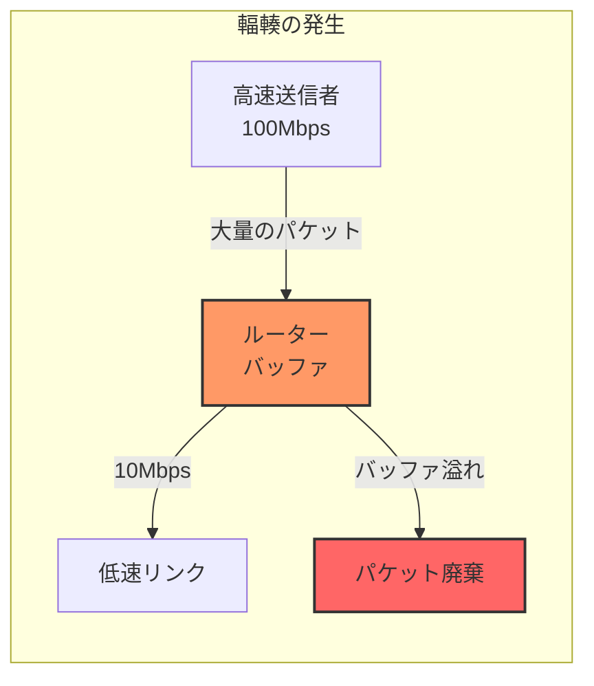
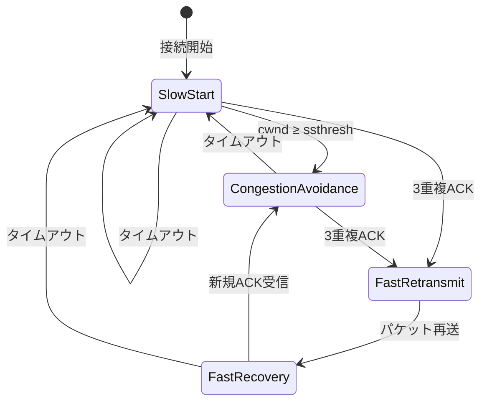
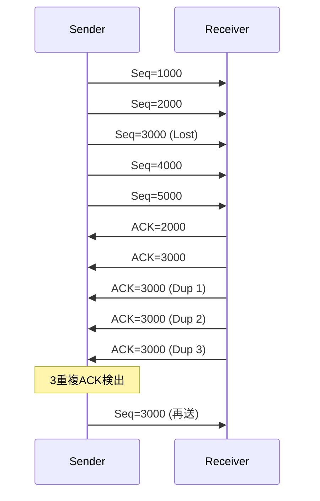
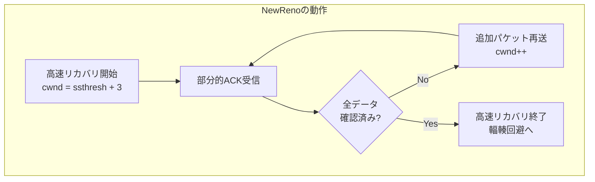
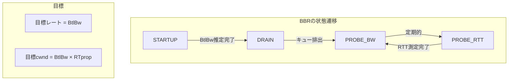
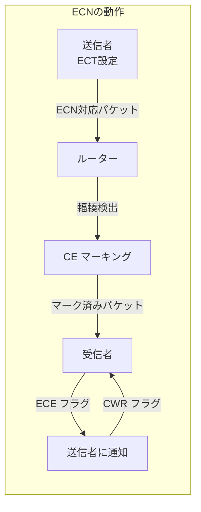
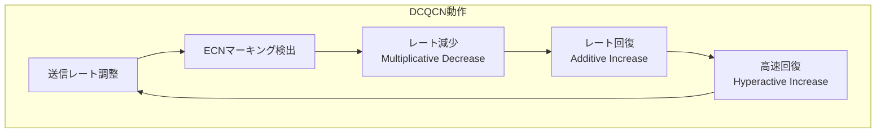

# 輻輳制御

輻輳制御（Congestion Control）は、インターネットの安定性と効率性を維持するための根幹的なメカニズムである。ネットワークにおける輻輳とは、ネットワークリンクやルーターの処理能力を超えるトラフィックが流入することで、パケット損失や遅延の増大が発生する状態を指す。1980年代後期のインターネットで発生した「輻輳崩壊」[^1]と呼ばれる深刻な性能劣化を契機として、Van JacobsonらによってTCPに輻輳制御メカニズムが導入された。

## 輻輳の発生メカニズムと影響

ネットワークにおける輻輳は、本質的にはリソースの需要と供給のミスマッチから生じる。インターネットは、異なる帯域幅と処理能力を持つ多数のリンクとルーターから構成されるヘテロジニアスなシステムである。データパケットが高帯域リンクから低帯域リンクへ流入する際、またはルーターの処理能力を超える速度でパケットが到着する際に、ルーターのバッファにパケットが蓄積される。



バッファが満杯になると、新たに到着するパケットは廃棄される。この状態が継続すると、TCPの再送メカニズムによって廃棄されたパケットが再送され、さらなるトラフィックが生成される。この正のフィードバックループにより、ネットワーク全体のスループットが劇的に低下する「輻輳崩壊」が発生する可能性がある。

輻輳の影響は単なるパケット損失にとどまらない。バッファブロート（Bufferbloat）と呼ばれる現象では、過度に大きなバッファがルーターに実装されることで、パケット損失は減少するものの、キューイング遅延が著しく増大する。これは、リアルタイム通信やインタラクティブなアプリケーションにとって深刻な問題となる。

## TCP輻輳制御の基本原理

TCP輻輳制御の中核となる概念は、輻輳ウィンドウ（congestion window, cwnd）である。輻輳ウィンドウは、送信者が確認応答（ACK）を待たずに送信できるデータ量を制限する。実際の送信ウィンドウは、輻輳ウィンドウと受信者が広告する受信ウィンドウ（rwnd）の最小値として決定される。

$$\text{送信ウィンドウ} = \min(\text{cwnd}, \text{rwnd})$$

TCP輻輳制御は、ネットワークの状態を明示的に知ることができないため、パケット損失を輻輳のシグナルとして利用する。この暗黙的フィードバックメカニズムは、以下の4つの主要なアルゴリズムから構成される：



### スロースタート（Slow Start）

スロースタートは、TCP接続の初期段階において、ネットワークの利用可能な帯域幅を探索するメカニズムである。"スロー"という名称は誤解を招きやすいが、実際にはcwndを指数関数的に増加させる積極的なアルゴリズムである。

接続開始時、cwndは初期ウィンドウサイズ（IW）に設定される。RFC 6928[^2]では、IWは以下のように定義されている：

$$\text{IW} = \min(10 \times \text{MSS}, \max(2 \times \text{MSS}, 14600))$$

ここで、MSS（Maximum Segment Size）は最大セグメントサイズである。各RTT（Round Trip Time）ごとに、受信したACKに対してcwndは1 MSS増加する。これにより、cwndは各RTTで倍増する。

```python
# スロースタートの疑似コード
def slow_start(cwnd, ssthresh, ack_received):
    if cwnd < ssthresh:
        cwnd += MSS  # ACKごとに1MSS増加
        # 結果として各RTTでcwndは倍増
    return cwnd
```

### 輻輳回避（Congestion Avoidance）

cwndがスロースタート閾値（ssthresh）に達すると、TCPは輻輳回避フェーズに移行する。このフェーズでは、cwndの増加速度を線形に抑制し、より慎重にネットワークの限界を探る。

輻輳回避アルゴリズムでは、各RTTごとにcwndを1 MSS増加させる。これは、各ACKに対してcwnd/MSS分の1 MSSを増加させることで実現される：

$$\text{cwnd}_{\text{new}} = \text{cwnd}_{\text{old}} + \frac{\text{MSS}^2}{\text{cwnd}_{\text{old}}}$$

### 高速再送と高速リカバリ

従来のTCPでは、パケット損失の検出はタイムアウトに依存していたが、これは非効率的であった。高速再送（Fast Retransmit）は、3つの重複ACKの受信をパケット損失のシグナルとして利用する。



高速リカバリ（Fast Recovery）は、高速再送後の輻輳ウィンドウの管理を行う。パケット損失を検出した際、ssthreshをcwndの半分に設定し、cwndをssthresh + 3 MSSに設定する。この「3 MSS」は、重複ACKを生成した3つのパケットがネットワークから抜けたことを反映している。

## 主要な輻輳制御アルゴリズムの進化

### TCP Tahoe

TCP Tahoeは、Van Jacobsonによって1988年に提案された最初の包括的な輻輳制御実装である。Tahoeは、スロースタートと輻輳回避を実装したが、パケット損失検出時（タイムアウトまたは3重複ACK）には常にスロースタートから再開する保守的なアプローチを採用していた。

### TCP Reno

TCP Renoは、高速再送と高速リカバリを追加することで、Tahoeの性能を大幅に改善した。単一のパケット損失に対しては効率的に動作するが、同一ウィンドウ内で複数のパケット損失が発生した場合、性能が劇的に低下するという問題があった。

### TCP NewReno

TCP NewRenoは、部分的ACK（partial ACK）の概念を導入することで、Renoの複数パケット損失問題に対処した。高速リカバリ中に受信したACKが、送信したすべてのデータを確認していない場合、追加のパケット損失が発生したと推定し、高速リカバリを継続する。



### CUBIC

CUBICは、現在Linux カーネルのデフォルト輻輳制御アルゴリズムとして採用されている。2008年にRFC 8312[^3]として標準化されたCUBICは、高帯域遅延積（BDP）ネットワークでの性能を改善するために設計された。

CUBICの特徴は、パケット損失後のウィンドウ増加を3次関数でモデル化することである：

$$W(t) = C(t - K)^3 + W_{\max}$$

ここで、$W_{\max}$は最後の損失イベント時のウィンドウサイズ、$K$は$W_{\max}$に到達するまでの時間、$C$はスケーリング定数である。この3次関数により、CUBICは損失直後は慎重に、その後積極的に、そして$W_{\max}$付近では再び慎重にウィンドウを増加させる。

### BBR (Bottleneck Bandwidth and Round-trip propagation time)

GoogleによってBBR[^4]が2016年に発表されたことは、輻輳制御の分野における重要な転換点となった。BBRは、従来のロスベースアルゴリズムとは根本的に異なるアプローチを採用し、ネットワークのボトルネック帯域幅（BtlBw）とラウンドトリップ伝播時間（RTprop）を継続的に推定する。



BBRの革新性は、パケット損失を輻輳のシグナルとして使用しないことにある。代わりに、送信レートとRTTの関係を観測することで、ネットワークの動作点を最適化する。これにより、バッファブロートの影響を受けにくく、ランダムなパケット損失が存在する環境でも高いスループットを維持できる。

## 明示的輻輳通知（ECN）

ECN（Explicit Congestion Notification）は、RFC 3168[^5]で標準化された、ルーターが輻輳を明示的に通知するメカニズムである。ECNを使用することで、パケット廃棄なしに輻輳を通知できるため、ネットワーク効率が向上する。

ECNは、IPヘッダーのToSフィールドの2ビットとTCPヘッダーのフラグを使用する：



- **ECT (ECN-Capable Transport)**: 送信者がECN対応であることを示す
- **CE (Congestion Experienced)**: ルーターが輻輳を検出したことを示す
- **ECE (ECN-Echo)**: 受信者が輻輳を送信者に通知
- **CWR (Congestion Window Reduced)**: 送信者が輻輳に対応したことを確認

## アクティブキュー管理（AQM）

従来のルーターは、バッファが満杯になるまでパケットを受け入れ、その後到着するパケットをすべて廃棄する「テールドロップ」方式を採用していた。この方式は、グローバル同期やバースト的な損失といった問題を引き起こす。

### Random Early Detection (RED)

RED[^6]は、最も広く知られたAQMアルゴリズムである。REDは、平均キュー長に基づいて、確率的にパケットを廃棄またはマーキングする：

```python
# REDアルゴリズムの概要
def red_algorithm(avg_queue_len, min_th, max_th, max_p):
    if avg_queue_len < min_th:
        # パケットを通過
        return "ACCEPT"
    elif min_th <= avg_queue_len < max_th:
        # 確率的に廃棄/マーキング
        p = max_p * (avg_queue_len - min_th) / (max_th - min_th)
        if random() < p:
            return "DROP/MARK"
        else:
            return "ACCEPT"
    else:  # avg_queue_len >= max_th
        # すべて廃棄/マーキング
        return "DROP/MARK"
```

### CoDel (Controlled Delay)

CoDel[^7]は、キュー遅延を直接制御することを目的とした新しいAQMアルゴリズムである。REDと異なり、パラメータチューニングがほとんど不要で、自己適応的に動作する。

CoDelは、パケットの滞留時間（sojourn time）を測定し、これが目標値（通常5ms）を超える状態が一定期間（通常100ms）継続した場合、パケットの廃棄を開始する。廃棄間隔は、制御理論に基づいて動的に調整される。

## データセンターネットワークにおける輻輳制御

データセンター環境は、従来のインターネットとは異なる特性を持つ。低遅延、高帯域幅、予測可能なトポロジーといった特徴により、特化した輻輳制御メカニズムが開発されている。

### DCTCP (Data Center TCP)

DCTCP[^8]は、ECNを積極的に活用してキュー長を低く保つ。従来のTCPがECNシグナルに対してバイナリ（輻輳あり/なし）に反応するのに対し、DCTCPはECNマーキングの割合に比例してウィンドウを調整する：

$$\text{cwnd}_{\text{new}} = \text{cwnd}_{\text{old}} \times (1 - \frac{\alpha}{2})$$

ここで、$\alpha$はECNマーキング率の指数加重移動平均である。

### RDMA輻輳制御

RDMA（Remote Direct Memory Access）ネットワークでは、CPUバイパスによる超低遅延通信が可能だが、輻輳制御も特殊な考慮が必要となる。RoCEv2（RDMA over Converged Ethernet v2）では、DCQCN（Data Center Quantized Congestion Notification）[^9]が広く採用されている。



## 輻輳制御の現代的課題

### バッファサイジング問題

従来のルール・オブ・サム（BDP = 帯域幅 × 遅延）に基づくバッファサイジングは、現代の高速ネットワークでは非現実的に大きなバッファを要求する。Stanford大学の研究[^10]では、統計的多重化を考慮することで、必要バッファサイズを$\frac{BDP}{\sqrt{n}}$（nはフロー数）まで削減できることが示されている。

### 異種プロトコルの共存

異なる輻輳制御アルゴリズムが同一ボトルネックを共有する場合、公平性の問題が発生する。特に、ロスベースアルゴリズム（CUBIC）と遅延ベースアルゴリズム（BBR）の共存は、複雑な相互作用を引き起こす。

### マルチパス輻輳制御

MPTCP（Multipath TCP）[^11]のような技術では、複数の経路を同時に使用するため、輻輳制御も複雑化する。各サブフローの輻輳制御を独立に行うと、単一パスTCPよりも積極的になり、不公平性を生じる。MPTCPは、結合輻輳制御（Coupled Congestion Control）により、この問題に対処している。

## 機械学習ベースの輻輳制御

近年、強化学習を用いた輻輳制御の研究が活発化している。MIT のPCC（Performance-oriented Congestion Control）[^12]やGoogle のPCC Vivace[^13]は、オンラインで効用関数を最適化することで、多様なネットワーク条件に適応する。

これらのアプローチは、従来のヒューリスティックベースのアルゴリズムと異なり、明示的な性能目標（スループット、遅延、損失率の組み合わせ）を最適化できる。ただし、収束性、安定性、公平性の理論的保証は依然として課題である。

## プログラマブル輻輳制御

P4[^14]などのプログラマブルデータプレーン技術の登場により、輻輳制御メカニズムをネットワーク内で実装することが可能になった。これにより、より細粒度で高速な輻輳制御が実現できる。

ABM（Approximate Bandwidth and RTT Monitoring）[^15]のような手法では、スイッチがフロー単位の帯域幅とRTTを追跡し、この情報を輻輳制御に活用する。エンドホストとネットワークの協調により、従来のエンドツーエンド原則を超えた最適化が可能となっている。

---

[^1]: Jacobson, V. (1988). "Congestion Avoidance and Control". ACM SIGCOMM Computer Communication Review, 18(4), 314-329.

[^2]: Chu, J., Dukkipati, N., Cheng, Y., & Mathis, M. (2013). "Increasing TCP's Initial Window". RFC 6928, IETF.

[^3]: Rhee, I., Xu, L., Ha, S., Zimmermann, A., Eggert, L., & Scheffenegger, R. (2018). "CUBIC for Fast Long-Distance Networks". RFC 8312, IETF.

[^4]: Cardwell, N., Cheng, Y., Gunn, C. S., Yeganeh, S. H., & Jacobson, V. (2016). "BBR: Congestion-Based Congestion Control". ACM Queue, 14(5), 20-53.

[^5]: Ramakrishnan, K., Floyd, S., & Black, D. (2001). "The Addition of Explicit Congestion Notification (ECN) to IP". RFC 3168, IETF.

[^6]: Floyd, S., & Jacobson, V. (1993). "Random Early Detection Gateways for Congestion Avoidance". IEEE/ACM Transactions on Networking, 1(4), 397-413.

[^7]: Nichols, K., & Jacobson, V. (2012). "Controlling Queue Delay". Communications of the ACM, 55(7), 42-50.

[^8]: Alizadeh, M., Greenberg, A., Maltz, D. A., Padhye, J., Patel, P., Prabhakar, B., ... & Sridharan, M. (2010). "Data Center TCP (DCTCP)". ACM SIGCOMM Computer Communication Review, 40(4), 63-74.

[^9]: Zhu, Y., Eran, H., Firestone, D., Guo, C., Lipshteyn, M., Liron, Y., ... & Yahia, M. (2015). "Congestion Control for Large-Scale RDMA Deployments". ACM SIGCOMM Computer Communication Review, 45(4), 523-536.

[^10]: Appenzeller, G., Keslassy, I., & McKeown, N. (2004). "Sizing Router Buffers". ACM SIGCOMM Computer Communication Review, 34(4), 281-292.

[^11]: Ford, A., Raiciu, C., Handley, M., & Bonaventure, O. (2013). "TCP Extensions for Multipath Operation with Multiple Addresses". RFC 6824, IETF.

[^12]: Dong, M., Li, Q., Zarchy, D., Godfrey, P. B., & Schapira, M. (2015). "PCC: Re-architecting Congestion Control for Consistent High Performance". NSDI, 15, 395-408.

[^13]: Dong, M., Meng, T., Zarchy, D., Arslan, E., Gilad, Y., Godfrey, B., & Schapira, M. (2018). "PCC Vivace: Online-Learning Congestion Control". NSDI, 18, 343-356.

[^14]: Bosshart, P., Daly, D., Gibb, G., Izzard, M., McKeown, N., Rexford, J., ... & Walker, D. (2014). "P4: Programming Protocol-Independent Packet Processors". ACM SIGCOMM Computer Communication Review, 44(3), 87-95.

[^15]: Kumar, P., Yuan, Y., Yu, C., Foster, N., Kleinberg, R., Lapukhov, P., ... & Soulé, R. (2020). "ABM: Active Buffer Management in Datacenters". ACM SIGCOMM 2020.