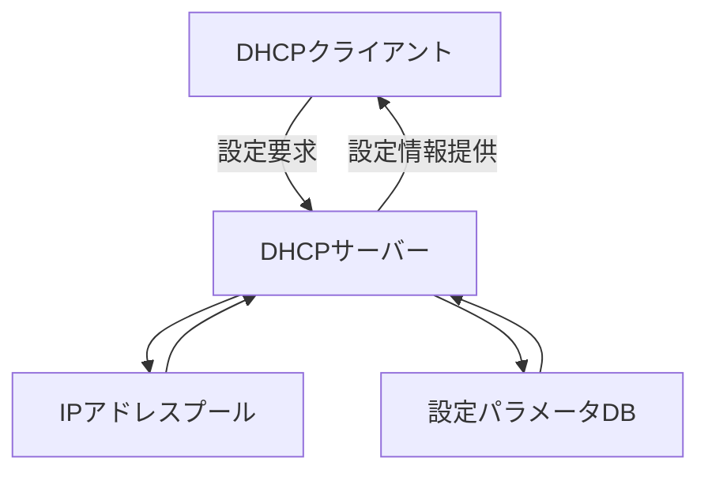
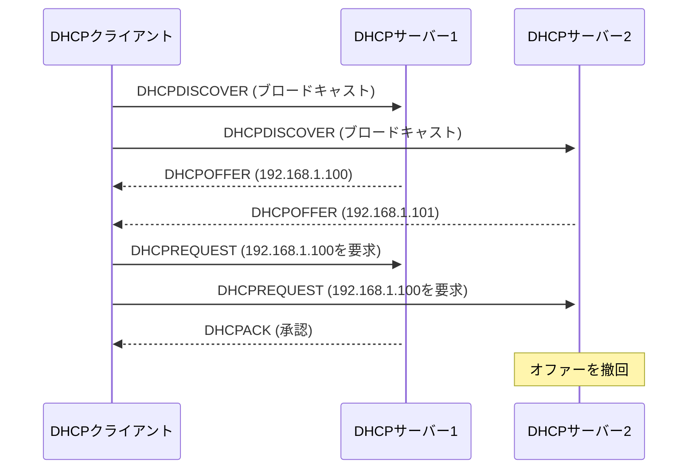
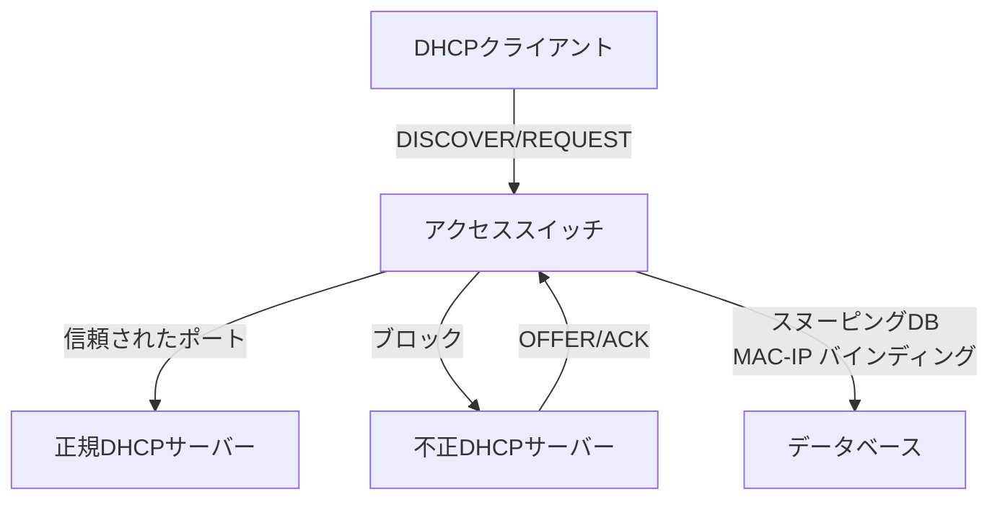

# DHCP (Dynamic Host Configuration Protocol)

## DHCPの基本概念と目的

Dynamic Host Configuration Protocol（DHCP）は、TCP/IPネットワークにおいてホストの設定情報を動的に割り当てるためのアプリケーション層プロトコルである。RFC 2131で標準化されたDHCPは、BOOTPの拡張として設計され、IPアドレスだけでなく、サブネットマスク、デフォルトゲートウェイ、DNSサーバーアドレスなど、ネットワーク通信に必要な包括的な設定情報を提供する¹。

DHCPの主要な設計目的は、ネットワーク管理の自動化と簡素化にある。手動でのIPアドレス設定は、大規模ネットワークにおいて管理負荷が高く、設定ミスによる通信障害のリスクも高い。DHCPはこれらの問題を解決し、中央集権的な設定管理を可能にする。また、IPアドレスの動的な再利用により、限られたアドレス空間を効率的に活用できる点も重要な利点である。

DHCPはクライアント・サーバーモデルに基づいて動作する。DHCPクライアントは、ネットワークに接続した際に設定情報を要求し、DHCPサーバーはアドレスプールから適切な設定を選択して提供する。この過程は完全に自動化されており、エンドユーザーは特別な設定を行う必要がない。



## DHCPの動作原理とメッセージフロー

DHCPの動作は、4つの基本的なメッセージ交換によって実現される。この一連の流れは「DORA」（Discover、Offer、Request、Acknowledge）として知られている。各メッセージはUDPを使用して送信され、クライアントはポート68、サーバーはポート67を使用する²。

### 初期リース取得プロセス

クライアントがネットワークに初めて接続する際、まずDHCPDISCOVERメッセージをブロードキャストする。この時点でクライアントはIPアドレスを持たないため、送信元IPアドレスは0.0.0.0、宛先IPアドレスは255.255.255.255（限定ブロードキャスト）を使用する。DHCPDISCOVERには、クライアントのMACアドレスと、要求する設定パラメータのリストが含まれる。

DHCPサーバーは、DHCPDISCOVERを受信すると、利用可能なIPアドレスをアドレスプールから選択し、DHCPOFFERメッセージで応答する。複数のDHCPサーバーが存在する場合、クライアントは複数のオファーを受信する可能性がある。DHCPOFFERには、提供するIPアドレス、リース期間、サブネットマスク、その他の設定情報が含まれる。

クライアントは受信したオファーの中から一つを選択し、DHCPREQUESTメッセージをブロードキャストする。このメッセージには、選択したサーバーの識別子と要求するIPアドレスが含まれる。ブロードキャストすることで、選択されなかったサーバーも、提供したアドレスを他のクライアントに割り当て可能であることを認識できる。

選択されたDHCPサーバーは、DHCPACKメッセージで最終的な承認を送信する。このメッセージには、確定した設定情報とリース期間が含まれる。クライアントはDHCPACKを受信すると、提供された設定を適用し、ネットワーク通信を開始する。



### リース更新プロセス

DHCPで割り当てられたIPアドレスには有効期限（リース期間）が設定されている。クライアントは、リース期間の50%が経過した時点で、現在のアドレスの継続使用を要求するリース更新プロセスを開始する³。この時点では、クライアントは既に有効なIPアドレスを持っているため、DHCPサーバーに対してユニキャストでDHCPREQUESTを送信する。

サーバーがリース更新を承認する場合、DHCPACKで新しいリース期間を通知する。もしサーバーが応答しない場合、クライアントはリース期間の87.5%が経過した時点で、ブロードキャストでDHCPREQUESTを送信し、ネットワーク上の任意のDHCPサーバーからリース更新を試みる。

リース期間が満了するまでに更新が成功しなかった場合、クライアントは現在の設定を破棄し、初期リース取得プロセスを最初から実行する必要がある。この仕組みにより、使用されていないIPアドレスが自動的にアドレスプールに返却され、アドレス空間の効率的な利用が実現される。

### 特殊なケースの処理

クライアントが以前使用していたIPアドレスの再割り当てを要求する場合、初期化時にDHCPREQUESTを直接送信することができる。これは「INIT-REBOOT」状態と呼ばれ、クライアントの再起動時間を短縮する最適化である。サーバーは、要求されたアドレスが利用可能であれば承認し、そうでなければDHCPNAKで拒否する。

クライアントが異なるネットワークに移動した場合、以前のIPアドレスは無効となる。DHCPサーバーは、クライアントが要求するアドレスが現在のサブネットに属していない場合、DHCPNAKを送信する。クライアントはDHCPNAKを受信すると、DHCPDISCOVERから処理を開始する。

## DHCPパケットフォーマットとプロトコル詳細

DHCPメッセージは、固定長のヘッダーと可変長のオプションフィールドで構成される。ヘッダーは236バイトの固定サイズで、BOOTPとの後方互換性を維持している⁴。

### 基本的なメッセージフォーマット

DHCPメッセージの先頭バイトは操作コード（op）で、1がクライアントからサーバーへの要求（BOOTREQUEST）、2がサーバーからクライアントへの応答（BOOTREPLY）を示す。続くハードウェアタイプ（htype）とハードウェアアドレス長（hlen）は、通常イーサネットの場合それぞれ1と6になる。

トランザクションID（xid）は4バイトの値で、クライアントが要求と応答を対応付けるために使用する。クライアントは各トランザクションで異なるxidを生成し、サーバーは受信したxidをそのまま応答に含める。この仕組みにより、複数のDHCPトランザクションが同時に進行しても、正しく処理される。

フラグフィールドの最上位ビットはブロードキャストフラグで、クライアントがユニキャスト受信できない場合に設定される。一部のクライアントは、IPアドレスが確定する前にユニキャストパケットを受信できないため、このフラグを設定してサーバーにブロードキャスト応答を要求する。

```
 0                   1                   2                   3
 0 1 2 3 4 5 6 7 8 9 0 1 2 3 4 5 6 7 8 9 0 1 2 3 4 5 6 7 8 9 0 1
+-+-+-+-+-+-+-+-+-+-+-+-+-+-+-+-+-+-+-+-+-+-+-+-+-+-+-+-+-+-+-+-+
|     op (1)    |   htype (1)   |   hlen (1)    |   hops (1)    |
+-+-+-+-+-+-+-+-+-+-+-+-+-+-+-+-+-+-+-+-+-+-+-+-+-+-+-+-+-+-+-+-+
|                            xid (4)                              |
+-+-+-+-+-+-+-+-+-+-+-+-+-+-+-+-+-+-+-+-+-+-+-+-+-+-+-+-+-+-+-+-+
|           secs (2)            |           flags (2)            |
+-+-+-+-+-+-+-+-+-+-+-+-+-+-+-+-+-+-+-+-+-+-+-+-+-+-+-+-+-+-+-+-+
|                          ciaddr (4)                             |
+-+-+-+-+-+-+-+-+-+-+-+-+-+-+-+-+-+-+-+-+-+-+-+-+-+-+-+-+-+-+-+-+
|                          yiaddr (4)                             |
+-+-+-+-+-+-+-+-+-+-+-+-+-+-+-+-+-+-+-+-+-+-+-+-+-+-+-+-+-+-+-+-+
|                          siaddr (4)                             |
+-+-+-+-+-+-+-+-+-+-+-+-+-+-+-+-+-+-+-+-+-+-+-+-+-+-+-+-+-+-+-+-+
|                          giaddr (4)                             |
+-+-+-+-+-+-+-+-+-+-+-+-+-+-+-+-+-+-+-+-+-+-+-+-+-+-+-+-+-+-+-+-+
|                                                                 |
|                          chaddr (16)                            |
|                                                                 |
|                                                                 |
+-+-+-+-+-+-+-+-+-+-+-+-+-+-+-+-+-+-+-+-+-+-+-+-+-+-+-+-+-+-+-+-+
|                                                                 |
|                          sname (64)                             |
+-+-+-+-+-+-+-+-+-+-+-+-+-+-+-+-+-+-+-+-+-+-+-+-+-+-+-+-+-+-+-+-+
|                                                                 |
|                          file (128)                             |
+-+-+-+-+-+-+-+-+-+-+-+-+-+-+-+-+-+-+-+-+-+-+-+-+-+-+-+-+-+-+-+-+
|                          options (variable)                     |
+-+-+-+-+-+-+-+-+-+-+-+-+-+-+-+-+-+-+-+-+-+-+-+-+-+-+-+-+-+-+-+-+
```

### IPアドレスフィールドの使用法

DHCPメッセージには4つのIPアドレスフィールドが存在し、それぞれ異なる目的で使用される。ciaddr（Client IP Address）は、クライアントが既に有効なIPアドレスを持っている場合に設定される。リース更新時やREBINDING状態では、現在使用中のアドレスがここに入る。

yiaddr（Your IP Address）は、サーバーがクライアントに割り当てるIPアドレスを示す。DHCPOFFERとDHCPACKで使用され、クライアントはこのアドレスを自身のインターフェースに設定する。siaddr（Server IP Address）は、次の起動段階で使用するサーバーのアドレスで、通常はTFTPサーバーを指定する際に使用される。

giaddr（Gateway IP Address）は、DHCPリレーエージェントによって設定される。クライアントとサーバーが異なるサブネットに存在する場合、リレーエージェントがこのフィールドに自身のIPアドレスを設定することで、サーバーはクライアントの所属するサブネットを識別できる。

### DHCPオプションの構造と重要性

DHCPの真の力は、オプションフィールドにある。オプションは、タイプ・長さ・値（TLV）形式で符号化され、柔軟な拡張性を提供する。各オプションは1バイトのタイプコード、1バイトの長さフィールド、そして可変長のデータで構成される⁵。

必須のオプションとして、DHCPメッセージタイプ（オプション53）がある。このオプションは、DHCPメッセージの種類（DISCOVER、OFFER、REQUEST、ACK、NAK、RELEASE、INFORM）を識別する。オプション53なしでは、受信側はメッセージの意図を判断できない。


サブネットマスク（オプション1）は、クライアントが自身のネットワークセグメントを識別するために不可欠である。ルーター（オプション3）は、デフォルトゲートウェイのリストを提供し、クライアントが他のネットワークと通信できるようにする。ドメインネームサーバー（オプション6）は、名前解決に使用するDNSサーバーのアドレスリストを含む。

リース時間（オプション51）は、IPアドレスの有効期間を秒単位で指定する。この値は、ネットワークの特性とポリシーに基づいて管理者が決定する。短いリース時間は、アドレスの迅速な再利用を可能にするが、ネットワークトラフィックが増加する。長いリース時間は、安定性を提供するが、アドレスプールの枯渇リスクが高まる。

## DHCPリレーエージェントとネットワーク設計

大規模なエンタープライズネットワークでは、すべてのサブネットにDHCPサーバーを配置することは非現実的である。DHCPリレーエージェント（RFC 3046で拡張）は、この問題を解決し、中央集権的なDHCP管理を可能にする⁶。

### リレーエージェントの動作メカニズム

DHCPリレーエージェントは、通常ルーターやレイヤー3スイッチに実装される。クライアントからのDHCPブロードキャストを受信すると、リレーエージェントはパケットのgiaddrフィールドに自身のIPアドレスを設定し、設定されたDHCPサーバーにユニキャストで転送する。

この転送プロセスにおいて、リレーエージェントは元のブロードキャストパケットの内容を保持しながら、必要な情報を追加する。特に重要なのは、クライアントが属するサブネットの情報である。DHCPサーバーは、giaddrの値を基に、どのアドレスプールから割り当てを行うべきかを判断する。

サーバーからの応答は、giaddrに指定されたリレーエージェントにユニキャストで送信される。リレーエージェントは、応答をクライアントのサブネットにブロードキャストまたはユニキャストで転送する。この判断は、クライアントのブロードキャストフラグとchaddrフィールドの情報に基づいて行われる。

### Option 82 - リレーエージェント情報オプション

リレーエージェント情報オプション（Option 82）は、セキュリティとアカウンタビリティを強化する重要な拡張である。このオプションにより、リレーエージェントはクライアントの物理的な接続情報をDHCPサーバーに提供できる。

Circuit IDサブオプションは、クライアントが接続されている物理ポートやVLANを識別する。Remote IDサブオプションは、リレーエージェント自体を識別する情報を含む。これらの情報により、DHCPサーバーは単なるMACアドレスではなく、物理的な接続位置に基づいてポリシーを適用できる。

```
+------------------------+
|  Option 82 (2 bytes)   |
+------------------------+
|  Circuit ID sub-option |
|  - Type (1)            |
|  - Length              |
|  - Port identifier     |
+------------------------+
|  Remote ID sub-option  |
|  - Type (2)            |
|  - Length              |
|  - Switch MAC/ID       |
+------------------------+
```

### 冗長性とフェイルオーバー設計

エンタープライズ環境では、DHCPサービスの可用性が重要である。一般的なアプローチは、複数のDHCPサーバーを配置し、アドレスプールを分割する「スプリットスコープ」構成である。例えば、プライマリサーバーがアドレス範囲の80%を管理し、セカンダリサーバーが残りの20%を管理する。

より高度なアプローチとして、DHCPフェイルオーバープロトコル（RFC 8156）がある⁷。このプロトコルは、2台のサーバー間でリース情報を同期し、アクティブ-アクティブまたはアクティブ-パッシブの冗長性を提供する。サーバー間の通信には、専用のTCP接続が使用され、リース情報の整合性が保たれる。

フェイルオーバー構成では、Maximum Client Lead Time（MCLT）が重要なパラメータとなる。MCLTは、パートナーサーバーとの通信なしに、サーバーがリースを延長できる最大時間を定義する。この値は、ネットワーク分断時のリース重複を防ぎながら、サービスの継続性を確保するバランスを取る。

## セキュリティ考慮事項と実装指針

DHCPは、その設計上、多くのセキュリティ脆弱性を持つ。認証メカニズムの欠如、ブロードキャスト通信の使用、動的な設定変更の性質は、様々な攻撃ベクトルを生み出す。

### 主要な脅威とその対策

DHCPスプーフィング攻撃は、最も一般的な脅威の一つである。攻撃者が偽のDHCPサーバーを設置し、誤った設定情報を配布することで、中間者攻撃やDNSリダイレクトを実行できる。この攻撃への対策として、DHCPスヌーピングが広く実装されている。

DHCPスヌーピングは、スイッチレベルでDHCPメッセージを検査し、信頼できないポートからのDHCPサーバー応答をブロックする。信頼されたポート（アップリンクポート）からのみDHCPOFFERとDHCPACKの通過を許可することで、不正なDHCPサーバーを排除する。



DHCPスターベーション攻撃は、攻撃者が大量の偽のDHCPREQUESTを送信し、アドレスプールを枯渇させる攻撃である。各要求で異なるMACアドレスを偽装することで、サーバーのアドレスプールを消費する。対策として、ポートあたりのMACアドレス数制限、レート制限、異常なリース要求パターンの検出が有効である。

### 認証の実装

RFC 3118で定義されたDHCP認証は、メッセージの完全性と送信元の検証を提供する⁸。しかし、実装の複雑さと互換性の問題から、広く採用されていない。代替として、802.1Xポートベース認証との組み合わせが推奨される。

802.1X認証に成功したクライアントのみがネットワークアクセスを許可され、その後DHCPによる設定を受ける。この多層防御アプローチは、未認証デバイスによるアドレス取得を防ぎ、ネットワークセキュリティを大幅に向上させる。

### 実装上のベストプラクティス

DHCPサーバーの実装において、アドレスプールの設計は重要な考慮事項である。静的予約と動的割り当ての適切なバランス、将来の成長を見込んだサイジング、管理用アドレスの確保が必要である。一般的に、サブネットの20-30%を静的予約用に確保することが推奨される。

ロギングとモニタリングは、セキュリティと運用の両面で不可欠である。すべてのDHCPトランザクション、特にDHCPNAKやアドレス枯渇イベントを記録すべきである。異常なパターン（短時間での大量のDISCOVER、頻繁なNAK）は、攻撃や設定ミスの兆候である可能性がある。

リース時間の設定は、環境に応じて最適化する必要がある。オフィス環境では8-24時間、ゲストネットワークでは1-2時間、固定的なデバイスには長期間（数日から数週間）が適切である。短すぎるリース時間は不要なトラフィックを生成し、長すぎるとアドレスの有効活用を妨げる。

### パフォーマンスとスケーラビリティ

大規模環境でのDHCPサーバーのパフォーマンスは、データベースの実装に大きく依存する。インメモリデータベースの使用、インデックスの最適化、定期的なリースデータベースのクリーンアップが重要である。一般的に、単一のDHCPサーバーは毎秒数百から数千のリクエストを処理できるが、実際の性能は実装とハードウェアに依存する。

地理的に分散した環境では、DHCPサーバーの配置戦略が重要になる。各サイトにローカルDHCPサーバーを配置することで、WANリンクの障害に対する耐性を確保できる。ただし、これは管理の複雑さを増すため、中央管理ツールとの統合が不可欠である。

## DHCPv6との比較と移行戦略

DHCPv6（RFC 8415）は、IPv6環境でのホスト設定を提供するが、DHCPv4とは多くの点で異なる⁹。最も顕著な違いは、IPv6のステートレスアドレス自動設定（SLAAC）との共存である。

DHCPv6では、クライアント識別にMACアドレスではなくDUID（DHCP Unique Identifier）を使用する。DUIDは、デバイスの再起動やネットワークインターフェースの変更を越えて永続的である。これにより、より確実なクライアント追跡が可能になるが、プライバシーの懸念も生じる。

メッセージフローも異なり、DHCPv6ではSOLICIT、ADVERTISE、REQUEST、REPLYという4つの基本メッセージを使用する。また、Rapid Commitオプションにより、2メッセージでの設定も可能である。マルチキャストアドレス（ff02::1:2）の使用により、ブロードキャストの必要がなくなった。

デュアルスタック環境では、DHCPv4とDHCPv6の両方を運用する必要がある。これらは独立したプロトコルであり、設定の一貫性を保つために注意深い管理が必要である。多くの組織では、IPv6ではSLAACを使用し、DHCPv6は追加の設定情報（DNSサーバーなど）の配布にのみ使用するハイブリッドアプローチを採用している。

---

¹ Droms, R., "Dynamic Host Configuration Protocol", RFC 2131, March 1997.
² Alexander, S. and R. Droms, "DHCP Options and BOOTP Vendor Extensions", RFC 2132, March 1997.
³ リース時間の50%と87.5%というタイミングは、T1とT2タイマーとして知られ、RFC 2131で定義されている標準的な値である。
⁴ Croft, W.J. and J. Gilmore, "Bootstrap Protocol", RFC 951, September 1985.
⁵ DHCPオプションの完全なリストは、IANAによって管理されており、現在200以上のオプションが定義されている。
⁶ Patrick, M., "DHCP Relay Agent Information Option", RFC 3046, January 2001.
⁷ Mrugalski, T., Kinnear, K., "DHCPv6 Failover Protocol", RFC 8156, June 2017.
⁸ Droms, R. and W. Arbaugh, "Authentication for DHCP Messages", RFC 3118, June 2001.
⁹ Mrugalski, T., et al., "Dynamic Host Configuration Protocol for IPv6 (DHCPv6)", RFC 8415, November 2018.