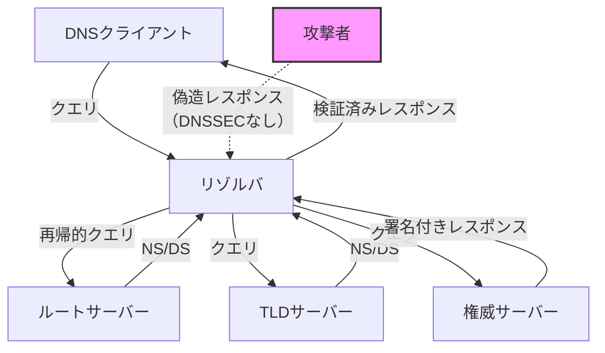
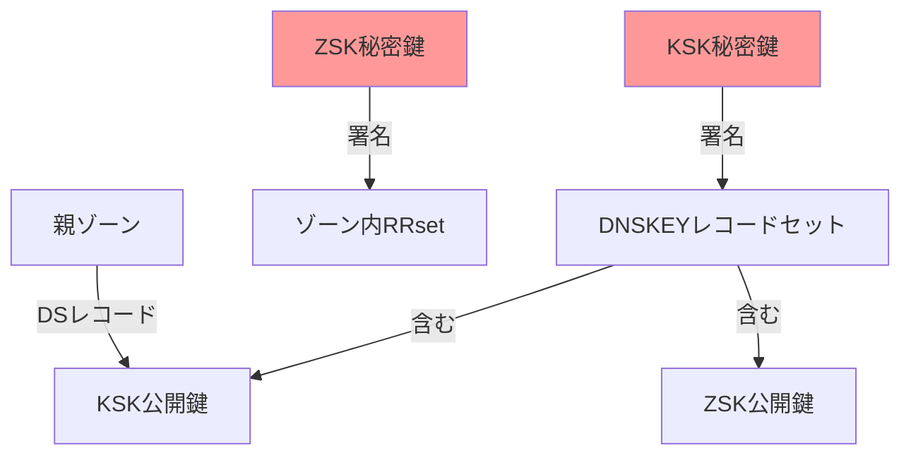
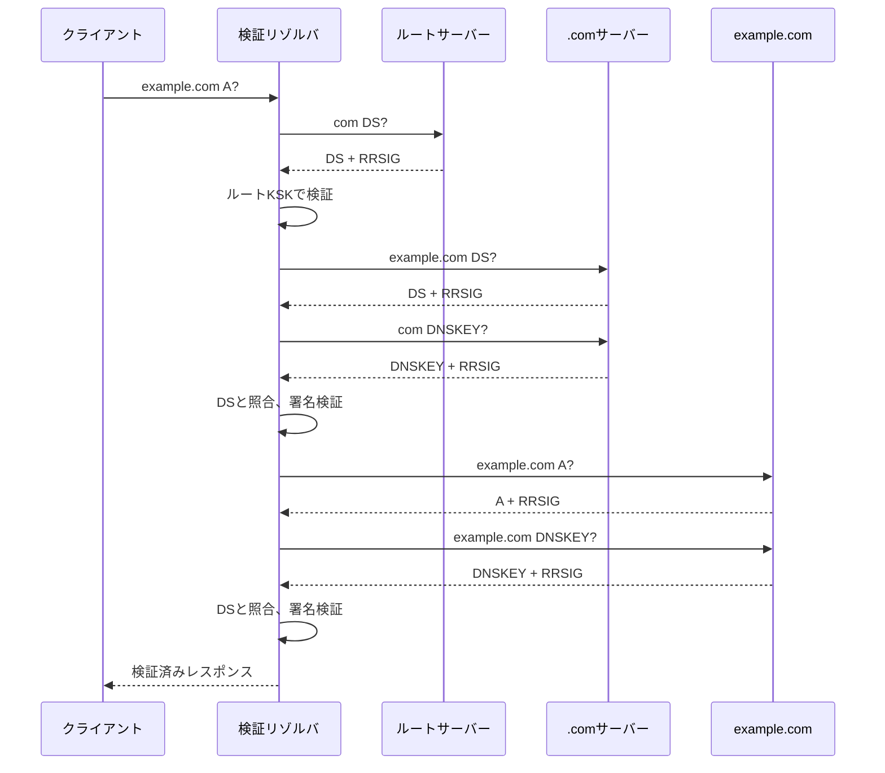
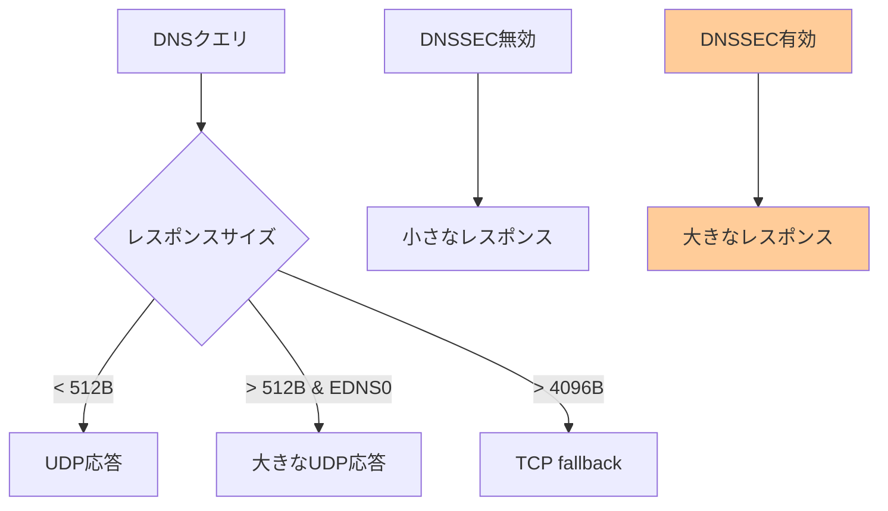
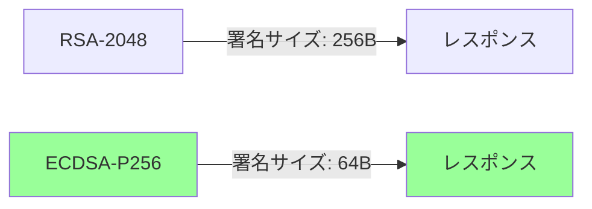

# DNSSEC

Domain Name System Security Extensions（DNSSEC）は、DNSレスポンスの完全性と認証を保証するための拡張仕様である。1990年代後半から2000年代初頭にかけて、DNSキャッシュポイズニング攻撃への対策として開発され、現在はRFC 4033、4034、4035で標準化されている[^1]。DNSSECは公開鍵暗号を使用してDNSデータに電子署名を付与し、クライアントがレスポンスの正当性を検証できる仕組みを提供する。

インターネットの基盤技術であるDNSは、設計当初セキュリティを考慮していなかった。このため、攻撃者が偽のDNSレスポンスを注入し、ユーザーを悪意のあるサイトに誘導することが可能であった。2008年にDan Kaminskyが発見した深刻な脆弱性[^2]は、DNSキャッシュポイズニング攻撃の現実的な脅威を示し、DNSSECの必要性を改めて認識させることとなった。



DNSSECの基本的な考え方は、DNSデータに対して階層的な信頼の連鎖（Chain of Trust）を構築することである。ルートゾーンから始まり、各階層のゾーンが下位のゾーンに対して暗号学的な信頼を委譲していく。この仕組みにより、エンドユーザーは受け取ったDNSレスポンスが正当な権威サーバーから発信され、改ざんされていないことを検証できる。

## 暗号学的基盤

DNSSECは公開鍵暗号方式、特にRSAやECDSAアルゴリズムを使用する。各ゾーンは少なくとも一つの鍵ペア（公開鍵と秘密鍵）を保持し、秘密鍵でDNSレコードに署名を生成する。公開鍵はDNSKEYレコードとしてゾーン内に公開され、クライアントはこの公開鍵を使用して署名を検証する。

鍵の役割は以下の2種類に分けられる：

**Zone Signing Key (ZSK)**: ゾーン内の個々のリソースレコードセット（RRset）に署名するための鍵。通常、比較的短い鍵長（RSAの場合1024-2048ビット）を使用し、頻繁にローテーションされる。

**Key Signing Key (KSK)**: DNSKEYレコードセット自体に署名するための鍵。より長い鍵長（RSAの場合2048-4096ビット）を使用し、ローテーション頻度は低い。KSKの公開鍵のハッシュ値がDSレコードとして親ゾーンに登録される。



## DNSSECレコードタイプ

DNSSECは既存のDNSに以下の新しいレコードタイプを追加する：

### RRSIG（Resource Record Signature）

RRSIGレコードは、特定のリソースレコードセット（同じ名前、クラス、タイプを持つレコードの集合）に対する電子署名である。署名は該当するRRsetのデータと、署名アルゴリズム、有効期限、署名者の情報を含む。RFC 4034のセクション3.1で定義される構造は以下の通り：

```
Type Covered: 署名対象のRRタイプ
Algorithm: 署名アルゴリズム番号
Labels: ドメイン名のラベル数
Original TTL: 元のTTL値
Signature Expiration: 署名有効期限
Signature Inception: 署名開始時刻
Key Tag: 署名に使用した鍵の識別子
Signer's Name: 署名者のドメイン名
Signature: 実際の署名データ
```

### DNSKEY

DNSKEYレコードは、ゾーンの公開鍵を含む。各鍵には以下のフラグが設定される：

- **SEP (Secure Entry Point)**: KSKであることを示すフラグ（ビット15）
- **Zone Key**: ゾーン署名用の鍵であることを示すフラグ（ビット7）
- **REVOKE**: 鍵が失効したことを示すフラグ（ビット8）

### DS（Delegation Signer）

DSレコードは、子ゾーンのKSKのハッシュ値を親ゾーンに登録するためのレコードである。これにより親子間の信頼の連鎖が確立される。DSレコードには以下の情報が含まれる：

```
Key Tag: 参照するDNSKEYのキータグ
Algorithm: DNSKEYで使用されるアルゴリズム
Digest Type: ハッシュアルゴリズム（SHA-256等）
Digest: DNSKEYのハッシュ値
```

### NSEC/NSEC3

NSECレコードは、ゾーン内に存在しないドメイン名やレコードタイプの不存在を証明する。これにより、攻撃者が「レコードが存在しない」という偽の応答を返すことを防ぐ。しかし、NSECレコードはゾーン内の全ドメイン名を列挙可能にしてしまう問題があった。

NSEC3はこの問題を解決するために開発された。ドメイン名をソルト付きハッシュ化し、ハッシュ値の順序で連鎖させることで、ゾーンの内容を隠蔽しながら不存在証明を提供する[^3]。

```mermaid
graph LR
    A[example.com] -->|NSEC| B[mail.example.com]
    B -->|NSEC| C[www.example.com]
    C -->|NSEC| A
    
    D[H(example.com)] -->|NSEC3| E[H(mail.example.com)]
    E -->|NSEC3| F[H(www.example.com)]
    F -->|NSEC3| D
    
    style A fill:#99ccff
    style B fill:#99ccff
    style C fill:#99ccff
    style D fill:#ffcc99
    style E fill:#ffcc99
    style F fill:#ffcc99
```

## 信頼の連鎖と検証プロセス

DNSSECの信頼モデルは、ルートゾーンから始まる階層的な構造を持つ。ルートゾーンの公開鍵（トラストアンカー）は、OSやリゾルバソフトウェアに事前に組み込まれている。2010年7月15日にルートゾーンがDNSSEC署名され、2017年にはKSKロールオーバーが実施された[^4]。

検証プロセスは以下の手順で行われる：

1. **トラストアンカーの確認**: リゾルバは事前に設定されたルートゾーンのKSK公開鍵を保持する

2. **DSレコードの取得**: 検証対象のゾーンに対して、親ゾーンからDSレコードを取得する

3. **DNSKEYの検証**: 子ゾーンのDNSKEYレコードを取得し、親ゾーンのDSレコードと照合する

4. **RRSIGの検証**: 個々のRRsetに対するRRSIG署名を、対応するDNSKEYで検証する



検証が失敗した場合、リゾルバはSERVFAILエラーを返す。これは、署名の期限切れ、鍵の不一致、改ざんの検出などが原因となる。ただし、すべてのリゾルバがDNSSEC検証を行うわけではなく、検証を行わないリゾルバは署名を無視して通常のDNSレスポンスとして処理する。

## 鍵管理とロールオーバー

DNSSECの運用において、鍵管理は最も複雑で重要な側面の一つである。鍵は定期的に更新（ロールオーバー）する必要があり、これは暗号学的な安全性を維持し、鍵の漏洩リスクを最小化するためである。

### ZSKロールオーバー

ZSKは比較的頻繁（月次または四半期ごと）にロールオーバーされる。Pre-publish方式では、新しい鍵を事前に公開し、TTL期間経過後に署名を切り替える：

1. 新しいZSKをDNSKEYレコードセットに追加
2. TTL期間待機（通常24-48時間）
3. 新しいZSKで署名開始
4. 古いZSKでの署名を停止
5. TTL期間待機
6. 古いZSKをDNSKEYレコードセットから削除

### KSKロールオーバー

KSKのロールオーバーはより複雑で、親ゾーンとの調整が必要となる。Double-DS方式では：

1. 新しいKSKを生成し、DNSKEYレコードセットに追加
2. 新しいKSKのDSレコードを親ゾーンに登録
3. 両方のDSレコードが伝播するまで待機
4. 新しいKSKでDNSKEYレコードセットに署名
5. 古いKSKのDSレコードを親ゾーンから削除
6. DSレコードの削除が伝播するまで待機
7. 古いKSKをDNSKEYレコードセットから削除

RFC 7583で定義される自動化されたKSKロールオーバープロトコルや、CDS/CDNSKEYレコードを使用した親子間の自動同期メカニズムも開発されている[^5]。

## 実装上の課題とトレードオフ

DNSSECの導入には多くの技術的課題が存在する。最も顕著な問題は、レスポンスサイズの増大である。署名データの追加により、DNSレスポンスは従来の3-5倍のサイズになることがある。これはUDPの512バイト制限を超えることが多く、EDNS0やTCP fallbackが必要となる。



パフォーマンスへの影響も無視できない。署名の生成と検証には計算リソースが必要であり、特に大規模なゾーンや高トラフィックな環境では顕著になる。楕円曲線暗号（ECDSA）の採用により、署名サイズと計算負荷の削減が図られているが、RSAと比較して互換性の問題が残る。

運用の複雑性も大きな課題である。鍵管理、ロールオーバー手順、親子ゾーン間の調整など、従来のDNS運用と比較して高度な技術知識と慎重な計画が必要となる。特に、DSレコードの更新ミスによるゾーンの到達不能化（"going dark"）は深刻な障害となりうる。

### 負の信頼アンカー（Negative Trust Anchors）

RFC 7646で定義される負の信頼アンカーは、DNSSEC検証の一時的な無効化メカニズムである[^6]。ゾーン管理者の設定ミスにより検証が失敗する場合、リゾルバ管理者は特定のゾーンに対して一時的に検証を無効化できる。これは運用上の柔軟性を提供する一方で、セキュリティの妥協点となる。

### フラグメンテーションとパスMTU問題

大きなDNSSECレスポンスは、ネットワーク上でIPフラグメンテーションを引き起こす可能性がある。フラグメントされたパケットは、ファイアウォールやNATデバイスで問題を起こすことがあり、また、フラグメンテーション攻撃の対象となりやすい。このため、DNSSECを導入する際は、ネットワークインフラストラクチャ全体での対応が必要となる。

## 現実世界での展開状況

DNSSECの展開は、技術的な成熟度に比して緩慢である。2023年時点で、.comゾーンの署名率は約5%に留まっている。一方で、.nlや.seなどの一部のccTLDでは90%を超える署名率を達成している。この差は、レジストリの方針、技術支援、経済的インセンティブの違いに起因する。

検証側の普及も課題である。Google Public DNSやCloudflare DNSなどの大規模パブリックリゾルバはDNSSEC検証を行っているが、多くのISPリゾルバは依然として検証を行っていない。APNIC Labsの統計によると、グローバルでのDNSSEC検証率は約30%程度である[^7]。

企業環境では、DNSSECの導入はさらに複雑である。内部DNSとの統合、ロードバランサーやCDNとの互換性、監視システムの対応など、既存のインフラストラクチャとの調整が必要となる。また、DNSSECの誤設定による可用性への影響を懸念し、導入を見送る組織も多い。

## 性能最適化とベストプラクティス

DNSSECの性能影響を最小化するため、以下の最適化手法が推奨される：

**署名の事前生成**: オンライン署名ではなく、オフラインで事前に署名を生成することで、クエリ時の遅延を削減する。ただし、動的なレコードには適用できない。

**NSEC3の最適化**: NSEC3のイテレーション回数を適切に設定する。過度なイテレーションは、DoS攻撃の標的となる可能性がある。RFC 9276では、イテレーション回数を0に設定することが推奨されている[^8]。

**署名有効期間の調整**: 署名の有効期間を適切に設定することで、再署名の頻度とキャッシュ効率のバランスを取る。一般的には、1-4週間の有効期間が使用される。

**アルゴリズムの選択**: ECDSA（アルゴリズム13、14）は、RSAと比較して署名サイズが小さく、計算も高速である。新規導入の場合は、ECDSAの採用が推奨される。



## DNSSECの限界と代替技術

DNSSECは、DNSレスポンスの完全性と認証を提供するが、機密性は提供しない。つまり、DNSクエリとレスポンスは平文で送信され、盗聴可能である。この問題に対処するため、DNS over HTTPS (DoH)やDNS over TLS (DoT)などの暗号化プロトコルが開発されている。

また、DNSSECは「last mile」の保護を提供しない。検証リゾルバからエンドクライアントまでの通信は保護されないため、ローカルネットワークでの攻撃には脆弱である。この問題を解決するため、スタブリゾルバでのDNSSEC検証や、AD（Authenticated Data）ビットの適切な処理が重要となる。

DANEやTLSAレコードなど、DNSSECを基盤とした新しいセキュリティメカニズムも開発されている。これらは、TLS証明書の信頼性をDNSSECで保護されたDNSレコードで検証する仕組みを提供する[^9]。

## 結論

DNSSECは、DNSインフラストラクチャのセキュリティを大幅に向上させる技術である。公開鍵暗号を使用した階層的な信頼モデルにより、DNSレスポンスの完全性と認証を保証する。しかし、その複雑性、性能への影響、運用上の課題により、普及は依然として限定的である。

今後のDNSセキュリティは、DNSSECとDoH/DoTなどの暗号化技術の組み合わせ、自動化ツールの改善、そしてより簡素な鍵管理メカニズムの開発により進化していくと考えられる。エンジニアとしては、これらの技術の特性と限界を理解し、適切なセキュリティアーキテクチャを設計することが重要である。

[^1]: Arends, R., et al. "DNS Security Introduction and Requirements." RFC 4033, March 2005.
[^2]: Kaminsky, D. "Black Ops 2008: It's the End of the Cache As We Know It." Black Hat USA, 2008.
[^3]: Laurie, B., et al. "DNS Security (DNSSEC) Hashed Authenticated Denial of Existence." RFC 5155, March 2008.
[^4]: ICANN. "Root DNSSEC KSK Rollover." https://www.icann.org/resources/pages/ksk-rollover
[^5]: Kumari, W., et al. "Automating DNSSEC Delegation Trust Maintenance." RFC 7344, September 2014.
[^6]: Ebersman, P., et al. "Negative Trust Anchors for DNSSEC." RFC 7646, September 2015.
[^7]: APNIC Labs. "DNSSEC Validation Rate." https://stats.labs.apnic.net/dnssec
[^8]: Hardaker, W. "Guidance for NSEC3 Parameter Settings." RFC 9276, August 2022.
[^9]: Hoffman, P., and Schlyter, J. "The DNS-Based Authentication of Named Entities (DANE) Transport Layer Security (TLS) Protocol: TLSA." RFC 6698, August 2012.