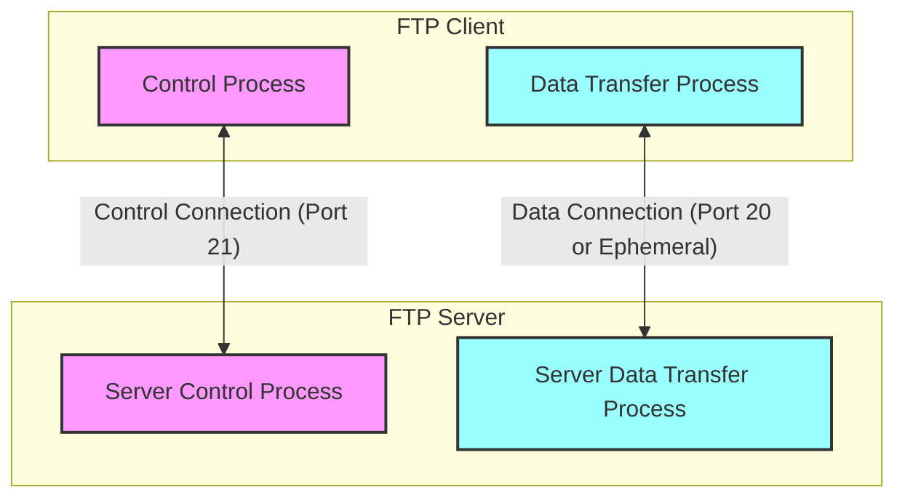
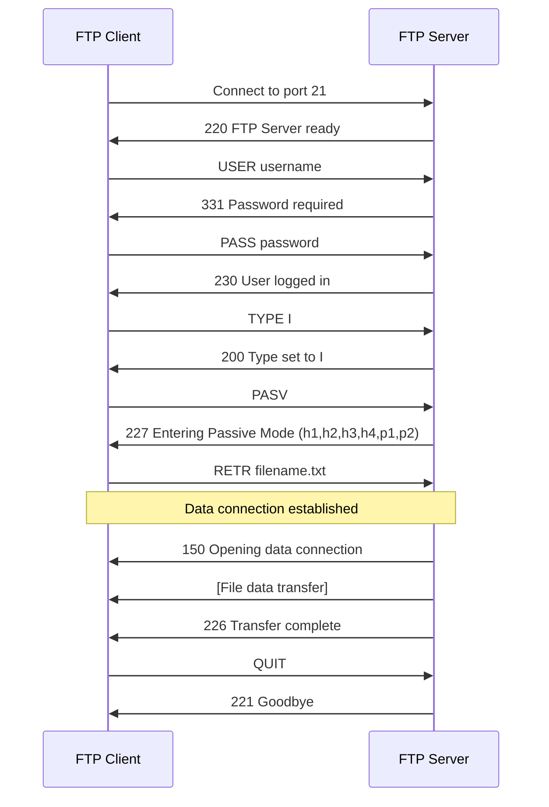
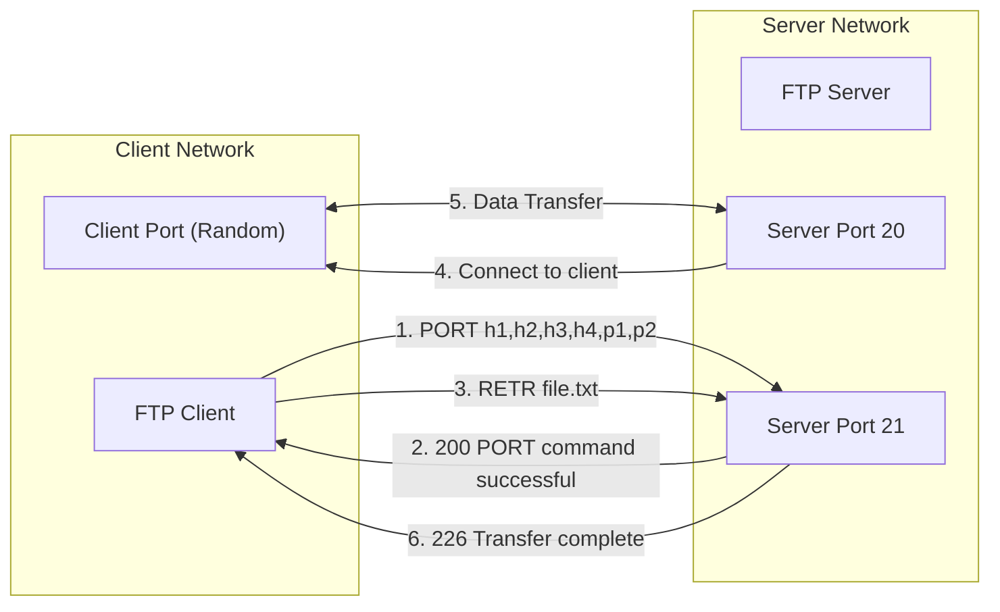
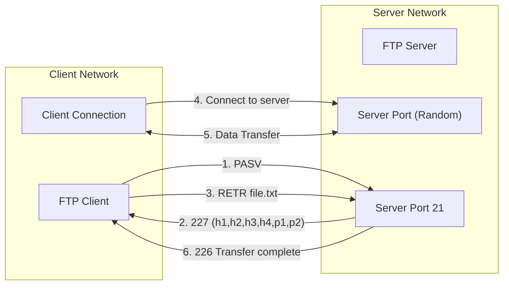
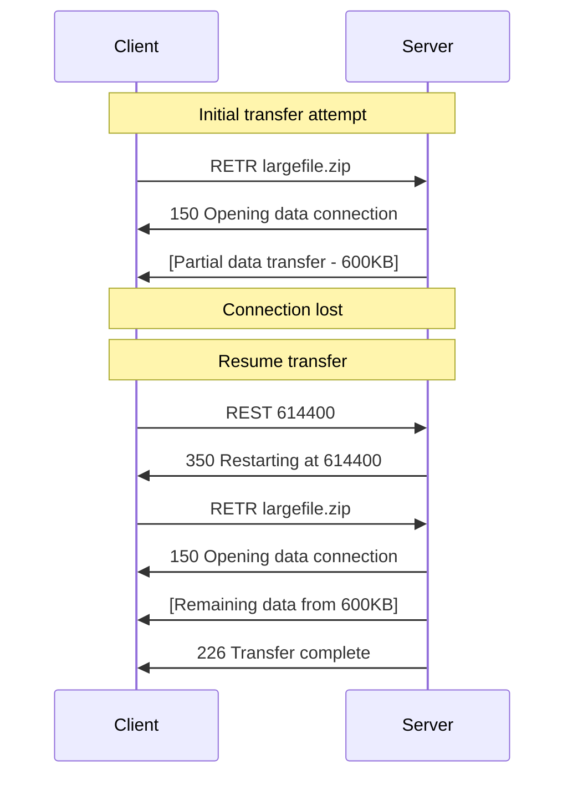
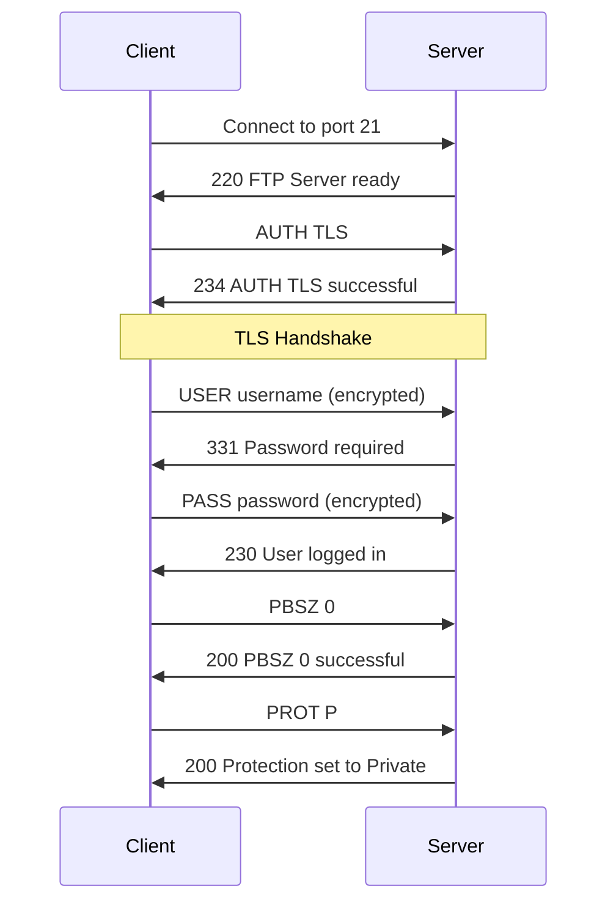
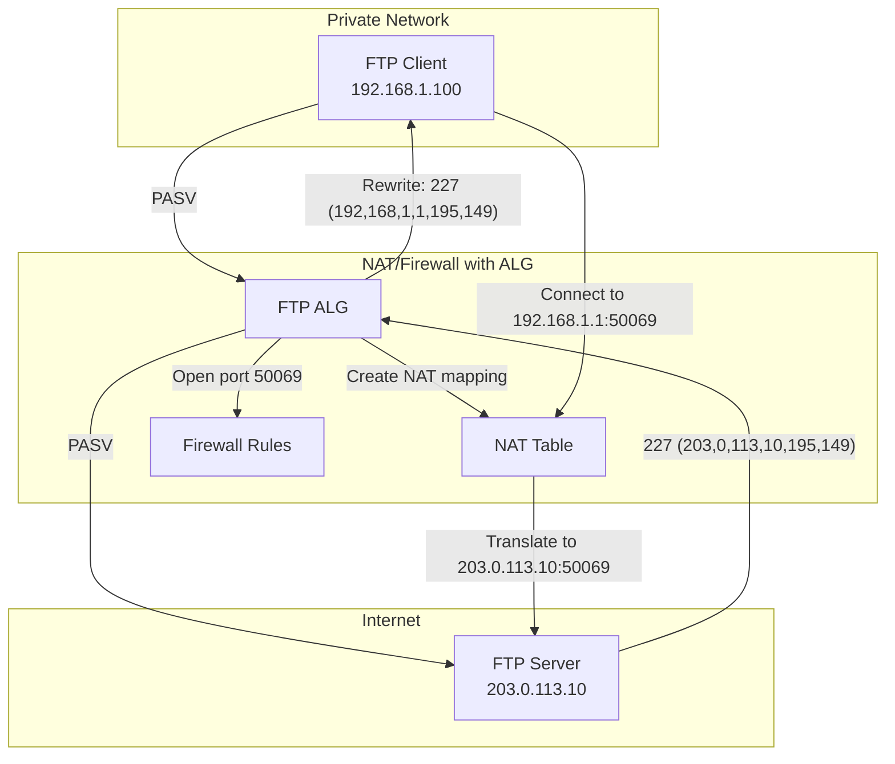

# FTP (File Transfer Protocol)

FTP（File Transfer Protocol）は、TCP/IPネットワーク上でファイルを転送するための標準プロトコルである。1971年にAbhay Bhushan[^1]によってARPANET向けに最初の仕様が策定されて以来、インターネットの黎明期から現在に至るまで、ファイル転送の基盤技術として広く利用されてきた。現在の標準仕様はRFC 959[^2]として1985年に定義され、その後も拡張仕様が追加されている。

FTPプロトコルの設計思想は、当時のネットワーク環境と計算機資源の制約を反映したものとなっている。プロトコルは制御接続とデータ接続を明確に分離し、テキストベースのコマンドとステータスコードによる対話型の通信を実現している。この設計により、人間が直接telnetクライアントを使用してFTPサーバーと対話することも可能となっており、プロトコルのデバッグや学習が容易になっている。しかし、同時にこの設計は現代のネットワーク環境、特にNATやファイアウォールが普及した環境では様々な課題を生じさせることになった。

## プロトコルアーキテクチャ

FTPの最も特徴的な設計は、制御接続とデータ接続の分離である。この二重接続モデルは、制御情報とデータの転送を独立して管理することを可能にし、大容量ファイルの転送中でも制御コマンドの送受信を継続できるという利点をもたらしている。



制御接続はFTPセッション全体を通じて維持される永続的な接続である。クライアントはサーバーの標準ポート21に接続し、この接続上でコマンドの送信とレスポンスの受信を行う。制御接続は、NVT-ASCII（Network Virtual Terminal ASCII）と呼ばれる7ビットASCII文字セットを使用し、各行はCRLF（\r\n）で終端される。この仕様により、異なるシステム間でも一貫した文字表現が保証される。

データ接続は実際のファイル転送やディレクトリリストの取得時に一時的に確立される接続である。データ接続の確立方法には、アクティブモードとパッシブモードという2つの動作モードが存在し、これがFTPの複雑性と柔軟性の源泉となっている。

## コマンドとレスポンスの仕組み

FTPプロトコルのコマンドは、3文字または4文字の大文字のASCII文字列で構成される。各コマンドは0個以上のパラメータを持ち、スペース文字で区切られる。主要なコマンドは以下のように分類される：

**アクセス制御コマンド**
- USER: ユーザー名の指定
- PASS: パスワードの指定
- ACCT: アカウント情報の指定
- CWD: 作業ディレクトリの変更
- CDUP: 親ディレクトリへの移動
- QUIT: 接続の終了

**転送パラメータコマンド**
- PORT: データ接続のアドレスとポートの指定（アクティブモード）
- PASV: パッシブモードへの移行
- TYPE: 転送タイプの指定（ASCII/Binary）
- STRU: ファイル構造の指定
- MODE: 転送モードの指定

**FTPサービスコマンド**
- RETR: ファイルの取得
- STOR: ファイルの保存
- STOU: 一意な名前でのファイル保存
- APPE: ファイルへの追加
- ALLO: ストレージの割り当て
- REST: 転送の再開位置指定
- RNFR/RNTO: ファイル名の変更
- ABOR: 転送の中断
- DELE: ファイルの削除
- RMD: ディレクトリの削除
- MKD: ディレクトリの作成
- PWD: 現在の作業ディレクトリの表示
- LIST: ディレクトリの詳細リスト
- NLST: ファイル名リスト
- SITE: サイト固有コマンド
- SYST: システムタイプの取得
- STAT: 状態情報の取得
- HELP: ヘルプ情報の取得
- NOOP: 何もしない（キープアライブ）

レスポンスは3桁の数字コードとそれに続く説明テキストで構成される。数字コードの各桁には以下の意味が定められている：

第1桁（応答の種類）：
- 1xx: 肯定的な予備応答（コマンドは開始されたが、別の応答を待つ必要がある）
- 2xx: 肯定的な完了応答（コマンドは正常に完了した）
- 3xx: 肯定的な中間応答（コマンドは受理されたが、追加情報が必要）
- 4xx: 一時的な否定応答（エラーは一時的なもので、再試行可能）
- 5xx: 永続的な否定応答（エラーは永続的で、同じコマンドは失敗する）

第2桁（応答のカテゴリ）：
- x0x: 構文（構文エラーなど）
- x1x: 情報（ヘルプメッセージなど）
- x2x: 接続（制御接続とデータ接続に関する応答）
- x3x: 認証とアカウンティング
- x4x: 未定義
- x5x: ファイルシステム



## データ転送モード

FTPにおけるデータ接続の確立方法は、ネットワーク環境の変化に伴い進化してきた。当初はアクティブモードのみが定義されていたが、ファイアウォールやNATの普及により、パッシブモードが必要不可欠となった。

### アクティブモード（PORT）

アクティブモードでは、クライアントがデータ接続を受け入れるためのリスニングソケットを作成し、そのアドレスとポート番号をPORTコマンドでサーバーに通知する。サーバーは、自身のポート20からクライアントが指定したアドレスとポートに対して接続を開始する。



PORTコマンドのパラメータは、IPv4アドレスの4オクテットとポート番号の上位・下位バイトを表す6つの10進数値として指定される。例えば、IPアドレス192.168.1.100、ポート番号5000（0x1388）の場合、「PORT 192,168,1,100,19,136」となる。

アクティブモードの最大の問題は、クライアント側のファイアウォールやNATとの相性の悪さである。サーバーからクライアントへの接続は、多くのファイアウォール設定では外部からの新規接続として扱われ、デフォルトでブロックされる。また、NATを使用している環境では、プライベートIPアドレスを外部に通知しても接続が確立できない。

### パッシブモード（PASV）

パッシブモードは、これらの問題を解決するために導入された。パッシブモードでは、データ接続の方向が逆転し、クライアントからサーバーに対して接続を開始する。



PASVコマンドに対するレスポンスは、サーバーがリスニングしているアドレスとポート番号を含む。クライアントはこの情報を解析し、指定されたアドレスとポートに接続する。パッシブモードでは、すべての接続がクライアント側から開始されるため、クライアント側のファイアウォールやNATの問題を回避できる。

しかし、パッシブモードにも課題は存在する。サーバー側では、データ接続用に多数のポートを開放する必要があり、これがセキュリティ上の懸念となる。また、サーバー側でNATを使用している場合、レスポンスに含まれるアドレスがプライベートアドレスになってしまう問題がある。

## 拡張パッシブモード（EPSV）とIPv6対応

IPv6の登場により、従来のPORTとPASVコマンドでは対応できない状況が生じた。RFC 2428[^3]では、プロトコル独立なEPRT（Extended PORT）とEPSV（Extended Passive）コマンドが定義された。

EPSVコマンドは、アドレスファミリーを指定できるように拡張されており、IPv4とIPv6の両方に対応している。レスポンスフォーマットも簡潔になり、「229 Entering Extended Passive Mode (|||port|)」のような形式でポート番号のみを返す。アドレスは制御接続と同じものを使用するため、NAT環境でも問題が少ない。

## データ表現とタイプ

FTPは異なるシステム間でのファイル転送を考慮し、複数のデータ表現タイプをサポートしている。主要なタイプは以下の通りである：

**ASCIIタイプ（TYPE A）**
テキストファイルの転送に使用される。改行コードの変換が行われ、送信側のシステムの改行コード（Unix: LF、Windows: CRLF、古いMac: CR）が、ネットワーク上ではCRLFに統一され、受信側では再びローカルシステムの形式に変換される。この変換により、異なるプラットフォーム間でテキストファイルを正しく扱うことができるが、バイナリファイルをASCIIモードで転送すると破損する。

**イメージタイプ（TYPE I）**
バイナリモードとも呼ばれ、データを一切変換せずにそのまま転送する。実行ファイル、画像、圧縮ファイルなど、バイナリデータを含むファイルの転送に使用される。現代では、テキストファイルも含めてほとんどの転送でバイナリモードが使用される傾向にある。

**EBCDICタイプ（TYPE E）**
IBM メインフレームで使用されるEBCDIC文字コードのための転送モード。現在ではほとんど使用されない。

## 転送の再開とRESTコマンド

大容量ファイルの転送において、ネットワークの不安定性による転送の中断は重大な問題となる。FTPは、REST（Restart）コマンドによる転送の再開機能を提供している。

RESTコマンドは、次のRETRまたはSTORコマンドの開始位置をバイト単位で指定する。例えば、1MBのファイルの転送が600KBで中断した場合、「REST 614400」に続いて「RETR filename」を送信することで、600KB目から転送を再開できる。



ただし、RESTコマンドの動作は転送タイプに依存する。バイナリモードでは単純にバイト位置から再開できるが、ASCIIモードでは改行コード変換のため、正確な再開位置の計算が複雑になる。

## セキュリティの課題と進化

FTPプロトコルの設計は、インターネットがより信頼できる環境であった時代のものであり、セキュリティは主要な設計目標ではなかった。その結果、以下のような深刻なセキュリティ上の問題を抱えている：

**認証情報の平文送信**
USERコマンドとPASSコマンドで送信されるユーザー名とパスワードは、暗号化されずに平文で送信される。ネットワーク上でパケットキャプチャを行えば、容易に認証情報を取得できる。

**データの平文転送**
転送されるファイルの内容も暗号化されない。機密情報を含むファイルの転送には適さない。

**コマンドインジェクション**
制御接続とデータ接続が分離しているため、攻撃者がデータ接続を横取りすることで、偽のデータを注入する可能性がある。

**バウンス攻撃**
PORTコマンドで任意のIPアドレスとポートを指定できるため、FTPサーバーを踏み台として第三者への攻撃に利用される可能性がある。多くの実装では、制御接続と異なるIPアドレスへのデータ接続を拒否することでこの攻撃を防いでいる。

これらの問題に対処するため、複数のセキュアなファイル転送プロトコルが開発された：

### FTPS (FTP over SSL/TLS)

FTPSは、既存のFTPプロトコルにSSL/TLS暗号化層を追加したものである。RFC 4217[^4]で標準化されており、2つの動作モードが存在する：

**Implicit FTPS**
専用のポート（通常990）に接続し、最初からSSL/TLS接続を確立する。制御接続とデータ接続の両方が暗号化される。

**Explicit FTPS**
通常のFTPポート（21）に接続した後、AUTHコマンドでTLS暗号化をネゴシエートする。より柔軟で、必要に応じて暗号化を有効/無効にできる。



FTPSは既存のFTPインフラストラクチャを活用できる利点があるが、NAT/ファイアウォール環境での問題は解決されない。また、制御接続は暗号化されても、PASVレスポンスに含まれるIPアドレスとポート情報は暗号化前の段階で処理されるため、NAT環境では追加の設定が必要となる。

### SFTP (SSH File Transfer Protocol)

SFTPは、SSHプロトコルのサブシステムとして動作する、完全に新しいプロトコルである。FTPとは名前が似ているが、プロトコルレベルでの互換性はない。単一の暗号化された接続上ですべての操作を行うため、NAT/ファイアウォールとの親和性が高い。

## NAT/ファイアウォール環境での課題

現代のネットワーク環境では、セキュリティとIPv4アドレスの枯渇対策として、NAT（Network Address Translation）とファイアウォールが広く使用されている。FTPプロトコルは、これらの技術と本質的に相性が悪い。

**アプリケーション層情報の埋め込み**
FTPは、IPアドレスとポート番号をアプリケーション層のペイロードに埋め込む。NATデバイスは通常、IPヘッダーとTCP/UDPヘッダーのアドレス情報のみを変換するため、ペイロード内のアドレス情報は変換されない。

**動的ポートの使用**
データ接続は動的に割り当てられたポートを使用する。ファイアウォールは事前にこれらのポートを開放することができず、動的なルール作成が必要となる。

**双方向の接続開始**
アクティブモードではサーバーからクライアントへ、パッシブモードではクライアントからサーバーへと、モードによって接続の方向が異なる。これにより、ファイアウォールルールの設定が複雑になる。

これらの問題に対処するため、多くのNAT/ファイアウォール製品は「FTP ALG（Application Layer Gateway）」機能を実装している。ALGは、FTPの制御接続を監視し、PORTやPASVコマンドを検出すると、ペイロード内のアドレス情報を書き換え、必要なポートを動的に開放する。



しかし、ALGにも問題がある。暗号化された接続（FTPS）では、ALGがペイロードを解析できないため機能しない。また、ALGの実装にバグがあると、正常な通信が妨げられることがある。

## 実装の詳細と性能特性

FTPサーバーとクライアントの実装には、多くの考慮事項が存在する。主要な実装上の課題と最適化手法について説明する。

**接続管理とリソース制限**
FTPサーバーは、同時接続数の制限、アイドルタイムアウト、帯域幅制限などのリソース管理機能を実装する必要がある。制御接続は長時間維持される可能性があるため、効率的なメモリ管理が重要となる。

**ディレクトリリストの形式**
LISTコマンドの出力形式は標準化されていない。多くのサーバーはUnixのls -lコマンドの出力形式を模倣しているが、WindowsサーバーはDOSのdirコマンド形式を使用することがある。この非互換性により、クライアントは複数の形式を解析する必要がある。

**文字エンコーディング**
FTPプロトコルは元々ASCII文字セットのみを想定していたが、現代では多言語ファイル名のサポートが必要である。RFC 2640[^5]では、UTF-8エンコーディングの使用が推奨されているが、すべての実装がこれに従っているわけではない。

**転送性能の最適化**
大容量ファイルの転送では、TCPのウィンドウサイズ、バッファサイズ、並列転送などの最適化が重要となる。一部の実装では、複数のデータ接続を使用して並列転送を行う拡張機能を提供している。

```python
# Example: Optimal buffer size calculation based on bandwidth-delay product
def calculate_buffer_size(bandwidth_mbps, rtt_ms):
    """
    Calculate optimal TCP buffer size for FTP transfers
    
    bandwidth_mbps: Available bandwidth in Mbps
    rtt_ms: Round-trip time in milliseconds
    """
    # Convert to bytes and seconds
    bandwidth_bps = bandwidth_mbps * 1000000
    rtt_s = rtt_ms / 1000.0
    
    # Bandwidth-delay product
    bdp = bandwidth_bps * rtt_s / 8  # Convert bits to bytes
    
    # Add 20% overhead for TCP headers and retransmissions
    optimal_buffer = int(bdp * 1.2)
    
    # Align to OS page size (typically 4KB)
    page_size = 4096
    return ((optimal_buffer + page_size - 1) // page_size) * page_size
```

**エラー処理とリトライ戦略**
ネットワークの一時的な障害に対処するため、適切なリトライ戦略が必要である。指数バックオフアルゴリズムを使用した自動リトライ、部分転送の検出と再開、タイムアウト値の動的調整などが実装される。

## プロトコルの拡張と派生

FTPプロトコルは、様々な要求に応じて拡張されてきた。主要な拡張には以下のものがある：

**MLST/MLSD（RFC 3659）[^6]**
機械可読な標準化されたディレクトリリスト形式を提供する。ファイルサイズ、更新時刻、パーミッションなどの属性が構造化された形式で返される。

**FEAT（RFC 2389）[^7]**
サーバーがサポートする拡張機能を問い合わせるためのコマンド。クライアントは、サーバーの機能に応じて動作を調整できる。

**HOST（RFC 7151）[^8]**
仮想ホスティング環境で、接続先のホスト名を指定するためのコマンド。HTTPのHostヘッダーに相当する機能を提供する。

**LANG（RFC 2640）**
サーバーのメッセージ言語を設定するためのコマンド。国際化対応の一環として導入された。

## 現代におけるFTPの位置づけ

FTPは50年以上の歴史を持つプロトコルであり、その間にインターネット環境は劇的に変化した。セキュリティ、NAT/ファイアウォール、IPv6、モバイルネットワークなど、FTPが設計された当時には存在しなかった課題に直面している。

それにもかかわらず、FTPは依然として広く使用されている。その理由として、以下の点が挙げられる：

**普遍的なサポート**
ほぼすべてのオペレーティングシステムとプログラミング言語がFTPをサポートしている。この普遍性により、異種システム間でのファイル交換が容易である。

**シンプルなプロトコル**
テキストベースのコマンドとレスポンスは、人間が理解しやすく、デバッグが容易である。telnetクライアントでFTPサーバーと直接対話できることは、トラブルシューティングにおいて大きな利点となる。

**成熟したエコシステム**
数十年にわたる使用により、安定した実装、豊富なドキュメント、経験豊富な管理者が存在する。多くの既存システムがFTPに依存しており、移行コストが高い。

一方で、新規システムでは、よりセキュアで現代的なプロトコル（SFTP、HTTPS、WebDAV等）が選択されることが多い。FTPは、レガシーシステムとの互換性が必要な場合や、セキュリティ要件が低い内部ネットワークでの使用に限定される傾向にある。

プロトコル設計の観点から見ると、FTPは多くの教訓を提供している。制御とデータの分離、テキストベースのプロトコル、拡張性の考慮などの設計判断は、後続のプロトコル設計に影響を与えた。同時に、セキュリティの後付け、NAT非対応、複雑な状態管理などの問題は、プロトコル設計における将来の課題を予測することの重要性を示している。

FTPプロトコルの研究と理解は、ネットワークプロトコルの進化と、技術的決定が長期にわたって及ぼす影響を学ぶ上で、今なお価値がある。その複雑さと課題は、現代のプロトコル設計者にとって重要な参考事例となっている。

[^1]: Bhushan, A., "File Transfer Protocol", RFC 114, April 1971
[^2]: Postel, J. and Reynolds, J., "File Transfer Protocol", RFC 959, October 1985
[^3]: Allman, M., Ostermann, S., and Metz, C., "FTP Extensions for IPv6 and NATs", RFC 2428, September 1998
[^4]: Ford-Hutchinson, P., "Securing FTP with TLS", RFC 4217, October 2005
[^5]: Curtin, B., "Internationalization of the File Transfer Protocol", RFC 2640, July 1999
[^6]: Elz, R. and Hethmon, P., "Extensions to FTP", RFC 3659, March 2007
[^7]: Elz, R., "Feature negotiation mechanism for the File Transfer Protocol", RFC 2389, August 1998
[^8]: Hethmon, P. and McMurray, R., "File Transfer Protocol HOST Command for Virtual Hosts", RFC 7151, March 2014