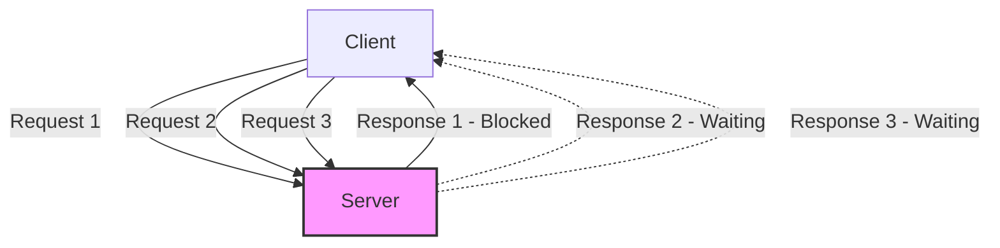
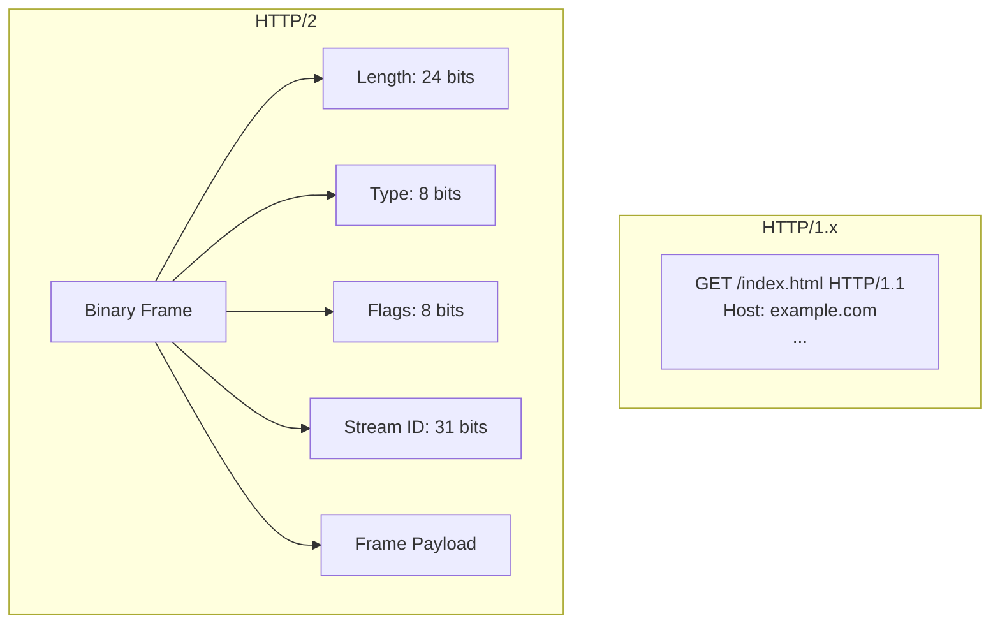
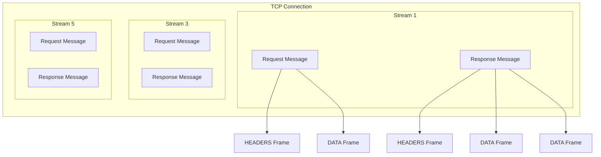
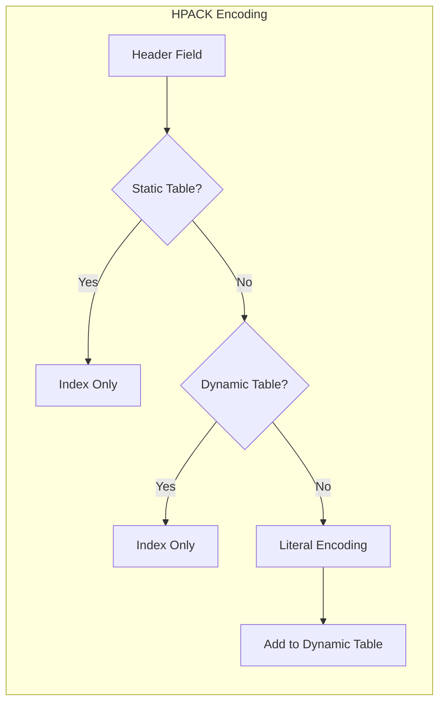
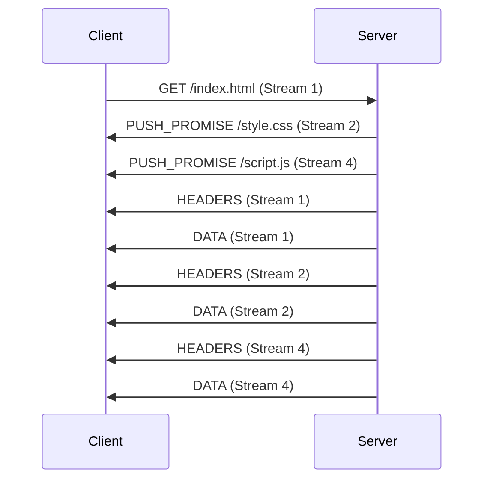
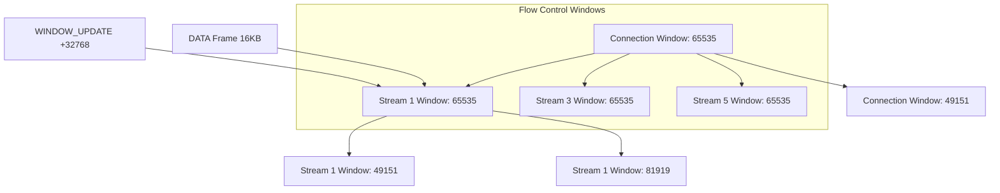
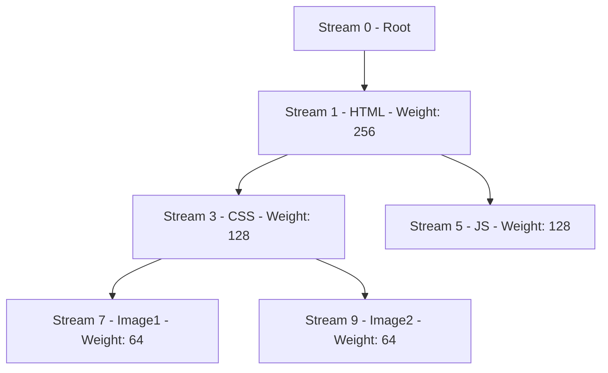

# HTTP/2

HTTP/2は、2015年5月にRFC 7540[^1]として標準化された、HTTPプロトコルの第2バージョンである。その前身であるHTTP/1.1は1999年に標準化されて以来、長きにわたってWebの基盤を支えてきたが、現代のWebアプリケーションが要求する性能特性には対応しきれなくなっていた。HTTP/2は、HTTP/1.xの意味論を維持しながら、転送効率を劇的に改善するために設計された。

## HTTP/1.xの限界とHTTP/2の必要性

HTTP/1.xが抱えていた根本的な問題は、単一のTCP接続上で複数のリクエスト・レスポンスを同時に処理できない「Head-of-Line（HOL）ブロッキング」である。HTTP/1.1ではパイプライニングという仕組みが導入されたものの、レスポンスの順序が保証されるため、先頭のレスポンスが遅れると後続のすべてのレスポンスがブロックされてしまう。この問題を回避するため、ブラウザは同一オリジンに対して複数のTCP接続（通常6本程度）を確立するという対症療法的なアプローチを採用していた。

この複数接続アプローチは、TCP接続の確立に伴うオーバーヘッド、スロースタートによる初期スループットの低下、クライアントとサーバーの両方でのリソース消費の増大といった副作用をもたらした。さらに、現代のWebページは平均して100を超えるリソースをロードすることが一般的となり、これらの制約はWebパフォーマンスの深刻なボトルネックとなっていた。

HTTP/2は、これらの問題を根本的に解決するために、Googleが開発したSPDY[^2]プロトコルをベースとして標準化された。SPDYは2009年から実験的に導入され、多重化、ヘッダー圧縮、サーバープッシュといった革新的な機能により、実世界のWebトラフィックで大幅な性能改善を実証していた。

## バイナリフレーミング層

HTTP/2の最も根本的な変更は、テキストベースのプロトコルからバイナリプロトコルへの移行である。HTTP/1.xでは、リクエストとレスポンスは人間が読めるテキスト形式で表現されていたが、HTTP/2では構造化されたバイナリフレームとして符号化される。

各フレームは9バイトの固定長ヘッダーとそれに続く可変長のペイロードで構成される。フレームヘッダーには、ペイロード長（24ビット）、フレームタイプ（8ビット）、フラグ（8ビット）、およびストリーム識別子（31ビット + 1ビットの予約ビット）が含まれる。この構造により、受信側は各フレームを確実に識別し、適切に処理することができる。

フレームタイプは、DATA、HEADERS、PRIORITY、RST_STREAM、SETTINGS、PUSH_PROMISE、PING、GOAWAY、WINDOW_UPDATE、CONTINUATIONの10種類が定義されている[^3]。各フレームタイプは特定の目的を持ち、プロトコルの様々な機能を実現するために使用される。

## ストリーム、メッセージ、フレームの階層構造

HTTP/2では、通信の抽象化が3つの階層で構成される。最上位の「ストリーム」は、クライアントとサーバー間の双方向のメッセージ交換を表す独立した仮想チャネルである。各ストリームは、1から始まる奇数（クライアント起動）または偶数（サーバー起動）の一意な識別子を持つ。

「メッセージ」は、論理的に完全なHTTPリクエストまたはレスポンスを表し、1つ以上のフレームから構成される。例えば、HTTPリクエストメッセージは、HEADERSフレーム（リクエストヘッダーを含む）と、オプションでDATAフレーム（リクエストボディを含む）から構成される。

「フレーム」は、HTTP/2における最小の通信単位であり、特定のタイプとストリームIDを持つ。フレームは任意の順序で送信でき、受信側はストリームIDに基づいて適切なストリームに再構成する。この設計により、複数のストリームのフレームをインターリーブして送信することが可能となり、HOLブロッキングの問題を解決している。

## 多重化の実現メカニズム

HTTP/2の多重化は、単一のTCP接続上で複数のストリームを同時に処理することを可能にする。各フレームにはストリームIDが含まれているため、受信側は異なるストリームのフレームが混在して到着しても、それぞれを適切に識別し、元のメッセージに再構成できる。

多重化の利点は単にHOLブロッキングの解消だけではない。TCP接続を再利用することで、接続確立のオーバーヘッドを削減し、TCPの輻輳制御メカニズムをより効率的に活用できる。単一の接続では、利用可能な帯域幅の推定がより正確になり、パケットロスの検出と回復もより効率的に行える。

ストリームの並行性は、SETTINGSフレームのMAX_CONCURRENT_STREAMSパラメータによって制御される。サーバーは、同時に処理可能なストリーム数を制限することで、リソース使用量を管理できる。クライアントはこの制限を尊重し、新しいストリームの作成を適切に調整する必要がある。

## HPACK：ヘッダー圧縮アルゴリズム

HTTP/1.xでは、各リクエスト・レスポンスで完全なヘッダーセットが送信されていた。現代のWebアプリケーションでは、Cookie、User-Agent、Acceptヘッダーなど、多くのヘッダーが繰り返し送信される。これらの冗長なデータは、特にモバイルネットワークなどの帯域制限のある環境では、大きなオーバーヘッドとなっていた。

HTTP/2では、HPACK[^4]と呼ばれる専用のヘッダー圧縮アルゴリズムを採用している。HPACKは、静的テーブルと動的テーブルという2つのコンポーネントを使用して、ヘッダーフィールドを効率的に符号化する。

静的テーブルは、頻繁に使用される61個のヘッダーフィールドとその値の組み合わせを事前定義している。例えば、インデックス2は「:method: GET」、インデックス4は「:path: /」を表す。これらの一般的なヘッダーは、単一のバイト（インデックス値）で表現できる。

動的テーブルは、接続中に観測されたヘッダーフィールドを記憶し、後続のリクエストで参照できるようにする。エンコーダーは、新しいヘッダーフィールドを動的テーブルに追加するか、既存のエントリを参照するかを選択できる。動的テーブルのサイズは、SETTINGSフレームのHEADER_TABLE_SIZEパラメータで制御され、メモリ使用量とのトレードオフを管理する。

HPACKは、ハフマン符号化もサポートしており、文字列値をさらに圧縮できる。HTTPヘッダーで使用される文字の頻度分析に基づいて設計されたハフマンテーブルを使用し、平均して30%程度の追加圧縮を実現する。

## サーバープッシュ

サーバープッシュは、HTTP/2の革新的な機能の1つで、クライアントが明示的に要求していないリソースをサーバーが先行して送信することを可能にする。この機能は、Webページのロード時間を短縮するために設計されており、サーバーは、クライアントが将来必要とするであろうリソース（CSS、JavaScript、画像など）を予測して送信できる。

サーバープッシュのプロセスは、PUSH_PROMISEフレームから始まる。サーバーは、プッシュするリソースの疑似ヘッダー（:method、:path、:scheme、:authority）を含むPUSH_PROMISEフレームを送信し、新しいストリームIDを予約する。クライアントは、このフレームを受信すると、そのリソースがプッシュされることを認識し、重複したリクエストを送信しないようにする。

クライアントは、SETTINGS_ENABLE_PUSHパラメータを0に設定することで、サーバープッシュを無効化できる。また、不要なプッシュストリームに対してRST_STREAMフレームを送信することで、個別のプッシュをキャンセルすることも可能である。

サーバープッシュの効果的な使用には注意が必要である。過度なプッシュは帯域幅を浪費し、かえってパフォーマンスを低下させる可能性がある。また、クライアントのキャッシュ状態を考慮せずにプッシュを行うと、既にキャッシュされているリソースを再送信してしまう問題もある。

## フロー制御

HTTP/2のフロー制御は、受信側が処理できる速度を超えてデータが送信されることを防ぐメカニズムである。TCP自体もフロー制御を提供するが、HTTP/2では、個々のストリームレベルでより細かい制御が必要となる。特に、多重化により複数のストリームが単一のTCP接続を共有するため、あるストリームが他のストリームの帯域を独占することを防ぐ必要がある。

フロー制御は、クレジットベースのシステムとして実装されている。各エンドポイントは、接続レベルとストリームレベルの両方でウィンドウサイズを管理する。初期ウィンドウサイズは65,535バイトで、SETTINGSフレームのINITIAL_WINDOW_SIZEパラメータで調整できる。

送信側は、利用可能なウィンドウサイズを超えてDATAフレームを送信することはできない。受信側は、データを処理した後、WINDOW_UPDATEフレームを送信してウィンドウサイズを増加させる。このメカニズムにより、受信側は自身の処理能力に応じてデータフローを制御できる。

フロー制御は、DATAフレームにのみ適用され、他のフレームタイプには適用されない。これは、制御フレームが常に送信可能であることを保証し、プロトコルのデッドロックを防ぐための設計である。

## ストリーム優先度と依存関係

HTTP/2では、ストリーム間の優先度と依存関係を表現するメカニズムが提供されている。クライアントは、各ストリームに重み（1〜256）を割り当て、他のストリームへの依存関係を指定できる。この情報により、サーバーはリソースの割り当てとスケジューリングを最適化できる。

優先度システムは、依存関係ツリーとして構成される。各ストリームは、親ストリームに依存することができ、兄弟ストリーム間では重みに基づいて帯域幅が配分される。例えば、HTMLドキュメントは最高優先度を持ち、CSSとJavaScriptがそれに依存し、画像はさらに低い優先度を持つという階層を構築できる。

PRIORITYフレームを使用して、ストリームの優先度を動的に変更することも可能である。これにより、ユーザーのインタラクションやアプリケーションの状態に応じて、リソースの配信順序を調整できる。

ただし、優先度はあくまでヒントであり、サーバーは必ずしもクライアントの指定に従う必要はない。サーバーの実装によっては、優先度情報を無視したり、独自のヒューリスティックと組み合わせて使用したりすることがある。

## 接続管理とエラー処理

HTTP/2の接続は、クライアントが送信する接続プリアンブルから始まる。これは、「PRI * HTTP/2.0\r\n\r\nSM\r\n\r\n」という24バイトのマジック文字列で、HTTP/1.xサーバーへの誤接続を検出するために設計されている。続いて、両エンドポイントはSETTINGSフレームを交換し、接続パラメータをネゴシエートする。

エラー処理は、接続レベルとストリームレベルの2つのレベルで行われる。ストリームレベルのエラーは、RST_STREAMフレームで通知され、該当するストリームのみが終了する。接続レベルのエラーは、GOAWAYフレームで通知され、接続全体が終了する。

GOAWAYフレームは、グレースフルシャットダウンのメカニズムも提供する。サーバーは、メンテナンスやリソース制限のために接続を終了する必要がある場合、GOAWAYフレームを送信して、最後に処理されるストリームIDを通知する。クライアントは、新しい接続を確立して、未処理のリクエストを再送信できる。

## 実装上の考慮事項

HTTP/2の実装には、いくつかの重要な考慮事項がある。まず、TLSの使用に関してである。仕様上、HTTP/2はTLSなしでも動作可能であるが、主要なブラウザはすべてTLS上のHTTP/2（h2）のみをサポートしている。これは、ネットワーク中間装置との互換性問題を回避し、プライバシーを保護するための実用的な判断である。

ALPNの (Application-Layer Protocol Negotiation) 拡張[^5]は、TLSハンドシェイク中にHTTP/2のサポートをネゴシエートするために使用される。クライアントは、サポートするプロトコル（h2、http/1.1）のリストを提示し、サーバーは選択したプロトコルを返す。

メモリ管理も重要な考慮事項である。HTTP/2では、各接続で多数のストリームと、HPACKの動的テーブル、フロー制御ウィンドウなどの状態を維持する必要がある。不適切な実装では、メモリ消費が急速に増大し、サービス拒否攻撃の脆弱性となる可能性がある。

サーバーの実装では、ストリームの多重化によるCPU使用率の増加にも注意が必要である。各フレームの処理、ストリームの状態管理、優先度に基づくスケジューリングなど、HTTP/1.xと比較して計算量が増加する。適切なスレッドモデルと効率的なデータ構造の選択が、パフォーマンスに大きく影響する。

## パフォーマンス特性と最適化

HTTP/2のパフォーマンス特性は、アプリケーションの特性とネットワーク条件に大きく依存する。低遅延ネットワークでは、多重化の利点が最大化され、ページロード時間の大幅な短縮が期待できる。一方、高遅延ネットワークでは、単一のTCP接続に依存することで、パケットロスの影響がすべてのストリームに波及するという問題がある。

最適化のアプローチも、HTTP/1.xとは異なる。ドメインシャーディング、リソースの結合、インライン化といった従来の最適化手法は、HTTP/2では不要または逆効果となる場合がある。代わりに、細かいリソースの粒度を維持し、キャッシュの効率を高めることが推奨される。

サーバープッシュの活用には、慎重な戦略が必要である。Critical Rendering Pathに含まれるリソースのプッシュは効果的だが、条件付きリクエストやキャッシュの考慮なしにプッシュを行うと、帯域幅の無駄遣いとなる。Link preloadヘッダーやプッシュのキャッシュダイジェストといった提案が、この問題に対処するために検討されている。

TCP の head-of-line ブロッキングは、HTTP/2でも完全には解決されていない。単一のTCP接続でパケットロスが発生すると、すべてのHTTP/2ストリームが影響を受ける。この問題は、HTTP/3（QUIC上のHTTP）で根本的に解決されることになる。

HTTP/2は、現代のWebアプリケーションのパフォーマンス要求に応えるための重要な進化である。バイナリフレーミング、多重化、ヘッダー圧縮、サーバープッシュといった機能により、ネットワークリソースをより効率的に活用し、エンドユーザーの体験を大幅に改善する。その複雑性にもかかわらず、主要なWebサーバーとブラウザでの広範な採用により、HTTP/2は現代のWebの標準プロトコルとしての地位を確立している。

[^1]: Belshe, M., Peon, R., and M. Thomson, Ed., "Hypertext Transfer Protocol Version 2 (HTTP/2)", RFC 7540, DOI 10.17487/RFC7540, May 2015, <https://www.rfc-editor.org/info/rfc7540>.

[^2]: Belshe, M. and R. Peon, "SPDY Protocol", Draft, February 2012, <https://www.chromium.org/spdy/spdy-protocol/spdy-protocol-draft3-1>.

[^3]: "HTTP/2 Frame Type Registry", IANA, <https://www.iana.org/assignments/http2-parameters/http2-parameters.xhtml#frame-type>.

[^4]: Peon, R. and H. Ruellan, "HPACK: Header Compression for HTTP/2", RFC 7541, DOI 10.17487/RFC7541, May 2015, <https://www.rfc-editor.org/info/rfc7541>.

[^5]: Friedl, S., Popov, A., Langley, A., and E. Stephan, "Transport Layer Security (TLS) Application-Layer Protocol Negotiation Extension", RFC 7301, DOI 10.17487/RFC7301, July 2014, <https://www.rfc-editor.org/info/rfc7301>.