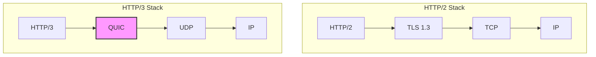
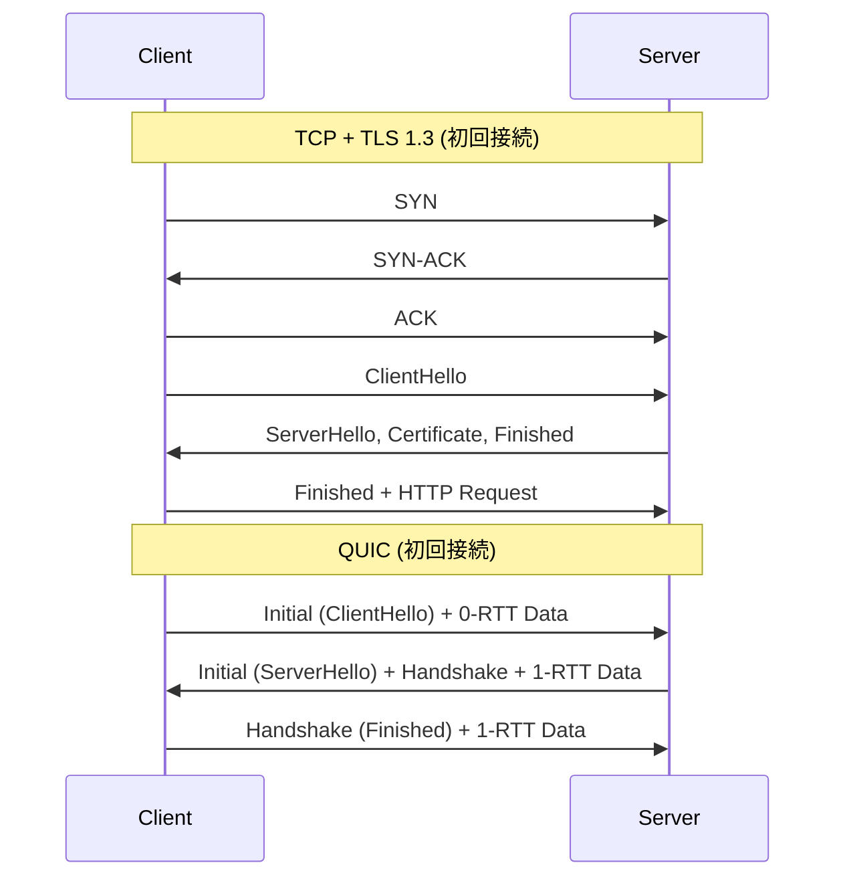
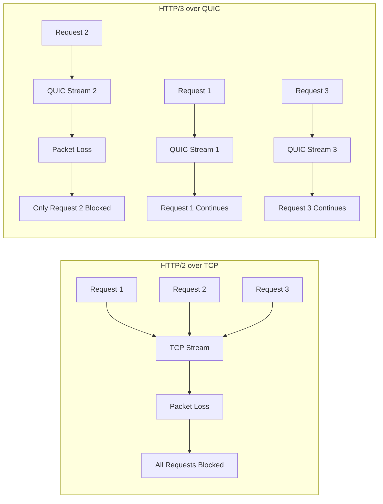
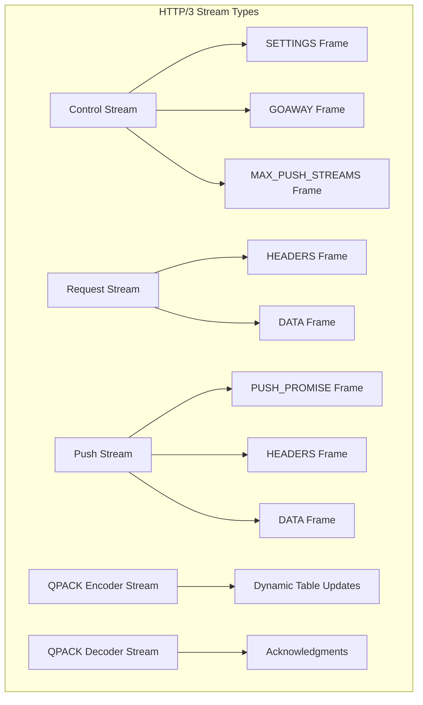
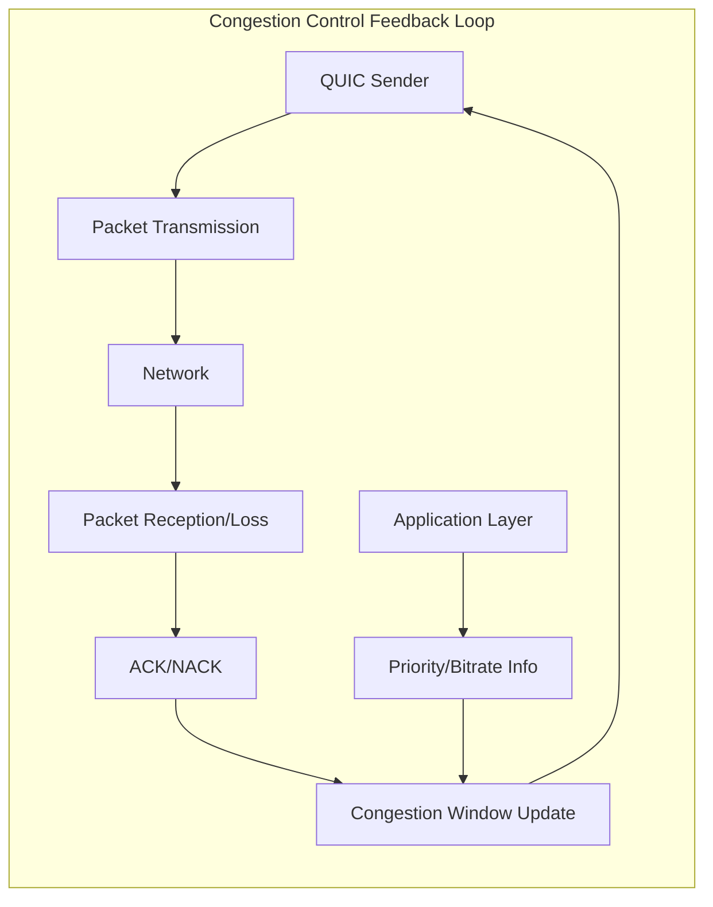

# HTTP/3

HTTP/3は、Webの基盤プロトコルであるHTTPの最新バージョンであり、トランスポート層にQUICを採用することで、従来のTCP上で動作するHTTP/1.1やHTTP/2の制約を根本的に解決しようとする試みである[^1]。2022年6月にRFC 9114として正式に標準化されたHTTP/3は、パケットロスやネットワーク遅延が存在する現実のインターネット環境において、より効率的なWeb通信を実現することを目的としている。

HTTP/3の最も革新的な点は、TCPではなくUDP上に構築されたQUICプロトコルを使用することである。この設計判断は、TCPが抱える本質的な問題、特にHOL（Head-of-Line）ブロッキングや、コネクション確立時のレイテンシを解決するために行われた。QUICは、信頼性のあるデータ転送、輻輳制御、暗号化をトランスポート層で統合的に実装することで、従来のTCP+TLSスタックよりも効率的な通信を実現している。

## QUICプロトコルの基礎

QUICプロトコルは、UDP上に構築された多重化されたセキュアなトランスポートプロトコルである[^2]。Googleが2012年頃から開発を開始し、後にIETFで標準化作業が行われ、2021年5月にRFC 9000として正式に標準化された。QUICの設計は、TCPとTLSが長年にわたって蓄積してきた問題を解決することを目的としている。



QUICの最も重要な特徴は、ストリームの多重化である。TCPでは、単一の接続上で複数のHTTPリクエスト/レスポンスを多重化する際、一つのパケットロスが全てのストリームに影響を与えるHOLブロッキングが発生する。QUICは各ストリームを独立して管理することで、この問題を解決している。具体的には、QUICパケット内で異なるストリームのデータは独立してシーケンス番号が管理され、一つのストリームでパケットロスが発生しても、他のストリームのデータ配送には影響しない。

QUICのもう一つの重要な特徴は、0-RTT接続確立である。TCPでは3ウェイハンドシェイク、さらにTLSハンドシェイクが必要となり、初回接続時には最低でも2-3 RTT（Round Trip Time）が必要となる。QUICは、暗号化をトランスポート層に統合することで、多くの場合1-RTTで接続を確立でき、さらに以前接続したサーバーに対しては0-RTTでデータ送信を開始できる。



QUICは、接続の移行（Connection Migration）もサポートしている。TCPでは、IPアドレスとポート番号の4タプルで接続が識別されるため、モバイルデバイスがWi-Fiからセルラーネットワークに切り替わると、新しい接続を確立する必要がある。QUICは接続IDという概念を導入し、IPアドレスが変更されても同じ接続を維持できる。これにより、ユーザーエクスペリエンスの向上とパフォーマンスの改善が実現される。

## HTTP/3の技術的詳細

HTTP/3は、QUICの上に構築されたアプリケーション層プロトコルであり、HTTP/2の意味論を維持しながら、トランスポート層の違いに対応するための変更が加えられている。HTTP/3の最も重要な変更点は、HTTP/2で使用されていたバイナリフレーミング層がQUICのストリーム機能に置き換えられたことである。

HTTP/3では、各HTTPリクエスト/レスポンスは独立したQUICストリーム上で送信される。これにより、HTTP/2で問題となっていたTCPレベルのHOLブロッキングが解消される。ただし、HTTP/3でもQPACK（後述）によるヘッダー圧縮において、限定的なHOLブロッキングが発生する可能性がある点には注意が必要である。



HTTPヘッダーの圧縮については、HTTP/2で使用されていたHPACKに代わり、QPACKという新しい圧縮方式が採用されている[^3]。HPACKは、TCPの順序保証を前提として設計されていたため、QUICの非順序配送と互換性がなかった。QPACKは、動的テーブルの更新を専用のユニディレクショナルストリームで行い、エンコードされたヘッダーブロックには動的テーブルへの参照のみを含めることで、順序に依存しない圧縮を実現している。

QPACKの動作原理は複雑であるが、その本質は、動的テーブルの状態管理とヘッダーのエンコード/デコードを分離することにある。エンコーダーは、動的テーブルに新しいエントリを追加する際、専用のエンコーダーストリームを使用してテーブルの更新を通知する。デコーダーは、この更新を受信してから、対応するヘッダーブロックをデコードする。この仕組みにより、ヘッダーブロックが到着順序に関係なくデコード可能となる。

HTTP/3のフレーム構造も、HTTP/2から大きく変更されている。HTTP/2では、すべてのフレームがTCPストリーム上で多重化されていたが、HTTP/3では各フレームタイプが適切なQUICストリームタイプにマッピングされる。例えば、制御フレーム（SETTINGS、GOAWAY等）は制御ストリームで、データフレームは各リクエスト/レスポンスストリームで送信される。



## パフォーマンス特性と最適化

HTTP/3のパフォーマンス特性は、ネットワーク環境に大きく依存する。低遅延・低パケットロス率の環境では、HTTP/2との差は小さいが、高遅延・高パケットロス率の環境では、HTTP/3が大幅に優れたパフォーマンスを示す。Googleの研究によると、YouTube動画の再生において、HTTP/3は再バッファリング率を9-15%削減し、特にモバイルネットワークでの改善が顕著であった[^4]。

HTTP/3の0-RTT機能は、リピートビジターに対して大きなパフォーマンス向上をもたらす。ただし、0-RTTデータはリプレイ攻撃に対して脆弱であるため、冪等でない操作（POSTリクエスト等）には使用すべきではない。実装では、GETリクエストのみを0-RTTで送信し、その他のメソッドは1-RTT確立後に送信するという戦略が一般的である。

QUICの輻輳制御アルゴリズムも、パフォーマンスに大きな影響を与える。QUICは、TCPで使用される様々な輻輳制御アルゴリズム（Cubic、BBR等）を実装可能であり、さらにアプリケーション層での情報を活用した最適化も可能である。例えば、動画ストリーミングでは、ビットレートの情報を輻輳制御にフィードバックすることで、より適切な帯域幅の推定が可能となる。



HTTP/3の実装における重要な最適化の一つは、UDPソケットのバッファサイズ調整である。デフォルトのUDPバッファサイズは小さく設定されていることが多く、高スループットを実現するためには、適切なサイズへの調整が必要である。Linuxでは、`setsockopt()`でSO_RCVBUFとSO_SNDBUFを設定し、システムレベルでは`/proc/sys/net/core/rmem_max`と`/proc/sys/net/core/wmem_max`の調整が必要となる。

## 実装の課題と対策

HTTP/3の実装には、いくつかの技術的課題が存在する。最も大きな課題の一つは、UDPトラフィックに対するミドルボックスの挙動である。多くの企業ネットワークやISPでは、UDPトラフィックに対して厳しい制限やレート制限が適用されており、HTTP/3の展開を妨げる要因となっている。この問題に対処するため、HTTP/3実装では必ずHTTP/2へのフォールバック機構を備える必要がある。

Alt-Svcヘッダーは、HTTP/3への移行を可能にする重要なメカニズムである[^5]。サーバーは、HTTP/1.1やHTTP/2でのレスポンスにAlt-Svcヘッダーを含めることで、HTTP/3のサポートをクライアントに通知する。クライアントは、次回の接続時にHTTP/3を試み、失敗した場合は従来のプロトコルにフォールバックする。

```
Alt-Svc: h3=":443"; ma=86400
```

カーネルバイパスも、高性能HTTP/3実装における重要な技術である。従来のTCPスタックはカーネル内に実装されているが、QUICはユーザー空間で実装されるため、頻繁なシステムコールがボトルネックとなる。DPDK（Data Plane Development Kit）やXDP（eXpress Data Path）などの技術を使用することで、パケット処理をユーザー空間で直接行い、大幅なパフォーマンス向上を実現できる。

CPU使用率も、HTTP/3実装の課題である。QUICの暗号化処理とパケット処理は、TCPと比較してより多くのCPUリソースを消費する。特に、各パケットに対する認証タグの計算と検証は、高トラフィック環境では大きな負荷となる。AES-NIやAVX-512などのハードウェアアクセラレーションの活用が重要であり、また、マルチコアシステムでは、接続を複数のCPUコアに適切に分散させる必要がある。

## セキュリティ考慮事項

HTTP/3のセキュリティモデルは、QUICに組み込まれた暗号化に基づいている。すべてのQUICパケットは暗号化され、中間者攻撃やパケット改ざんから保護される。ただし、新しいプロトコルであるがゆえに、いくつかの固有のセキュリティ課題も存在する。

増幅攻撃は、UDPベースのプロトコルに共通する問題である。攻撃者が偽造した送信元アドレスでInitialパケットを送信し、サーバーからの大きなレスポンスを被害者に向けさせる可能性がある。QUICは、この問題に対処するため、Initialパケットのサイズを最小1200バイトにパディングすることを要求し、また、アドレス検証トークンを使用して送信元の正当性を確認する。

0-RTT再生攻撃も重要なセキュリティ考慮事項である。0-RTTデータは、ネットワーク上で傍受され、後で再送信される可能性がある。このため、0-RTTデータは冪等な操作のみに制限すべきであり、サーバー側では0-RTTデータに対する適切な検証とレート制限を実装する必要がある。

## 運用とモニタリング

HTTP/3の運用では、従来のHTTPプロトコルとは異なるモニタリング戦略が必要となる。QUICパケットは暗号化されているため、従来のパケットキャプチャツールでは内容を解析できない。このため、エンドポイントでのロギングとメトリクス収集が重要となる。

qlogは、QUIC接続の詳細なデバッグ情報を記録するための標準フォーマットである[^6]。主要なQUIC実装は、qlog出力をサポートしており、接続の確立、パケットの送受信、輻輳制御の動作などを詳細に記録できる。これらのログは、パフォーマンス問題の診断や、プロトコルの動作理解に不可欠である。

```json
{
  "qlog_version": "0.3",
  "events": [
    {
      "time": 0,
      "name": "transport:packet_sent",
      "data": {
        "packet_type": "initial",
        "packet_number": 0,
        "frames": [
          {
            "frame_type": "crypto",
            "offset": 0,
            "length": 285
          }
        ]
      }
    }
  ]
}
```

エラー率とレイテンシの監視も重要である。HTTP/3では、接続の失敗やフォールバックの発生率を監視し、ネットワーク環境やミドルボックスの問題を早期に検出する必要がある。また、0-RTTの成功率、ハンドシェイクレイテンシ、ストリームレベルの遅延なども重要なメトリクスである。

負荷分散の実装も、HTTP/3特有の課題を持つ。QUICの接続IDは、同一接続のパケットを同じサーバーにルーティングするために使用できるが、暗号化されているため、L4ロードバランサーでは内容を解析できない。このため、QUIC対応のロードバランサーは、接続IDの構造を理解し、適切にルーティングを行う必要がある。実装によっては、サーバー側で接続IDに情報をエンコードし、ロードバランサーがそれを解析する方式が採用されている。

HTTP/3は、現代のWeb通信における重要な進化であり、特にモバイルネットワークや高遅延環境でのパフォーマンス向上に寄与している。しかし、その導入には技術的な課題も多く、既存のインフラストラクチャとの互換性を保ちながら、段階的に展開していく必要がある。プロトコルの成熟とともに、これらの課題は徐々に解決されていくと期待されるが、現時点では慎重な計画と実装が求められる。

[^1]: Iyengar, J. and M. Thomson, "QUIC: A UDP-Based Multiplexed and Secure Transport", RFC 9000, May 2021.
[^2]: Bishop, M., "HTTP/3", RFC 9114, June 2022.
[^3]: Krasic, C., Bishop, M., and A. Frindell, "QPACK: Field Compression for HTTP/3", RFC 9204, June 2022.
[^4]: Langley, A. et al., "The QUIC Transport Protocol: Design and Internet-Scale Deployment", SIGCOMM '17.
[^5]: Nottingham, M., McManus, P., and J. Reschke, "HTTP Alternative Services", RFC 7838, April 2016.
[^6]: Marx, R., "Main logging schema for qlog", draft-ietf-quic-qlog-main-schema, Internet-Draft.