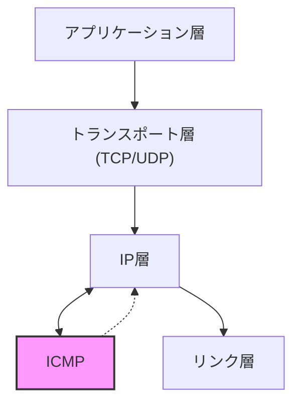
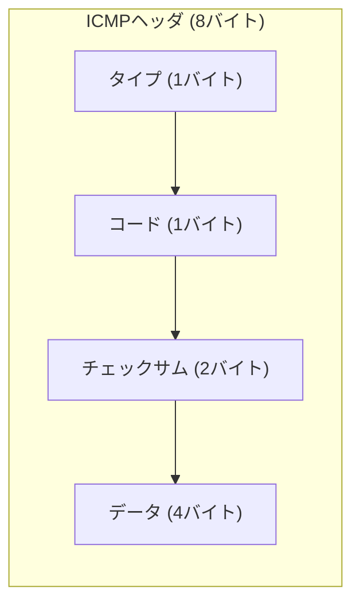
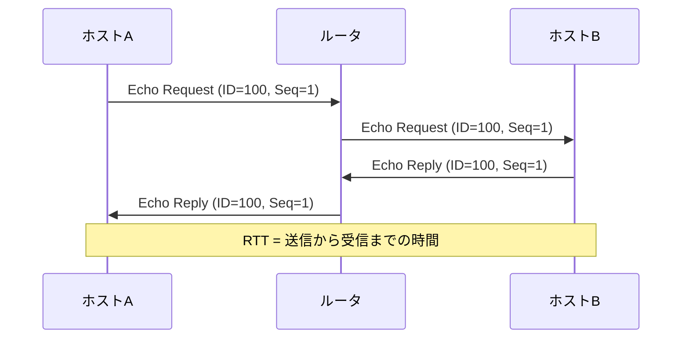
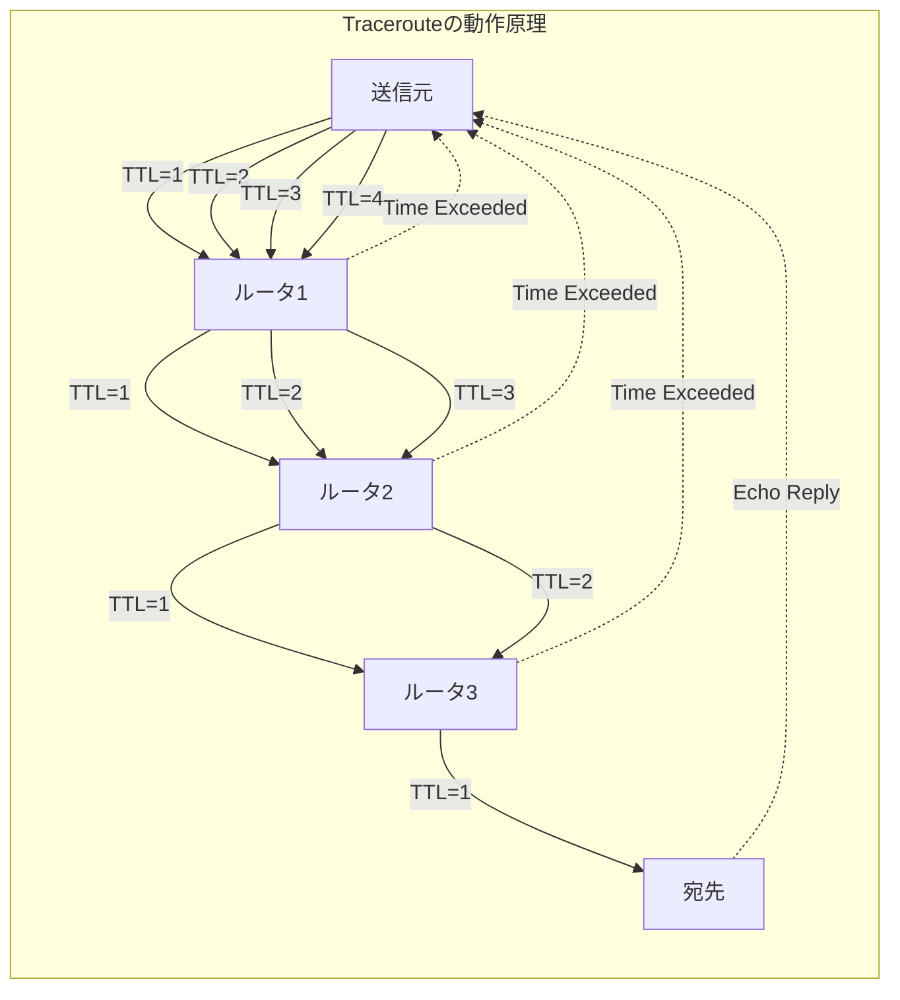
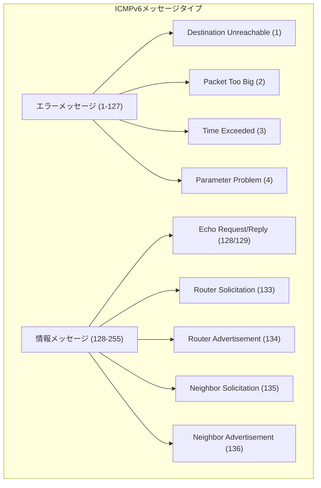
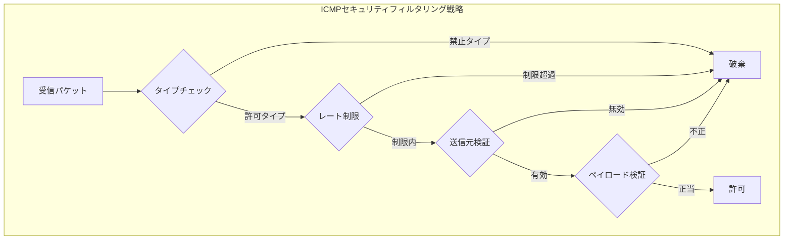

# ICMP (Internet Control Message Protocol)

Internet Control Message Protocol（ICMP）は、IP層における制御メッセージの交換を担うプロトコルであり、インターネットプロトコルスイートの中核的な構成要素の一つとして機能している。RFC 792[^1]で定義されたICMPv4は、IPネットワークにおけるエラー報告と診断情報の伝達を可能にし、ネットワークの健全性維持と問題診断において不可欠な役割を果たしている。

ICMPは、データ転送そのものを目的とするプロトコルではなく、IPデータグラムの配送中に発生した問題をソースホストに通知したり、ネットワークの状態を調査するための仕組みを提供する。このプロトコルは、IPヘッダに続いて配置され、IPデータグラムのペイロードとして伝送されるが、概念的にはIP層の一部として動作し、全てのIPノード（ホストおよびルータ）に実装が要求されている。

## ICMPの設計原理と制約

ICMPの設計には、いくつかの重要な原則と制約が組み込まれている。最も基本的な原則は、ICMPメッセージ自体がさらなるICMPメッセージを生成してはならないというものである。この原則により、エラー報告の無限ループを防ぎ、ネットワークの輻輳を回避している。

RFC 792では、以下の条件下でICMPエラーメッセージを送信してはならないと規定している：

1. **ICMPエラーメッセージに対する応答として**：既にエラー報告を行っているメッセージに対して、さらなるエラー報告を行うことは禁止されている。
2. **フラグメントされたデータグラムの最初のフラグメント以外に対して**：フラグメントの処理に関するエラーは、最初のフラグメントに対してのみ報告される。
3. **マルチキャストまたはブロードキャストアドレス宛のデータグラムに対して**：多数の受信者に同時に配送されるパケットに対するエラー報告は、送信元への大量のICMPメッセージによる輻輳を防ぐために制限されている。
4. **リンク層ブロードキャストとして送信されたデータグラムに対して**：物理層でのブロードキャストも同様の理由で制限される。
5. **ソースアドレスが0.0.0.0または127.0.0.0/8のデータグラムに対して**：無効または特殊なアドレスからのパケットに対するエラー報告は意味を持たない。

これらの制約は、ICMPが診断とエラー報告の役割を果たしながら、同時にネットワークの安定性を損なわないように設計されていることを示している。

## ICMPメッセージの構造

ICMPメッセージは、共通のヘッダ構造を持ち、その後にメッセージタイプ固有のデータが続く。基本的なICMPヘッダは8バイトで構成され、以下の要素を含む：

**タイプフィールド**は、ICMPメッセージの主要な分類を示す。RFC 792で定義された主要なタイプには、Echo Reply (0)、Destination Unreachable (3)、Source Quench (4)、Redirect (5)、Echo Request (8)、Time Exceeded (11)、Parameter Problem (12)などがある。その後、RFC 1122[^2]、RFC 1812[^3]などで追加のタイプが定義されている。

**コードフィールド**は、タイプフィールドで示されたメッセージの詳細な分類を提供する。例えば、Destination Unreachableタイプ（タイプ3）には、Network Unreachable（コード0）、Host Unreachable（コード1）、Protocol Unreachable（コード2）、Port Unreachable（コード3）などの異なるコードが定義されている。

**チェックサムフィールド**は、ICMPメッセージ全体の整合性を検証するために使用される。このチェックサムは、IPヘッダのチェックサムとは独立して計算され、ICMPヘッダとデータ部分全体に対して適用される。計算方法は、16ビット単位での1の補数和の1の補数として定義されている。

**データフィールド**の内容は、メッセージタイプによって異なる。エラーメッセージの場合、通常はエラーを引き起こした元のIPデータグラムのIPヘッダと、そのデータグラムの最初の8バイト（通常はトランスポート層のヘッダの一部）が含まれる。これにより、受信側は問題のあったパケットを特定できる。

## 主要なICMPメッセージタイプの詳細

### Echo Request/Reply（タイプ8/0）

Echo RequestとEcho Replyは、最も広く知られたICMPメッセージペアであり、pingコマンドの基礎となっている。これらのメッセージは、ネットワークの到達可能性テストと往復時間（RTT）の測定に使用される。

Echo Requestメッセージは、識別子とシーケンス番号を含み、送信側がリクエストとリプライを対応付けることを可能にする。データ部分には任意のデータを含めることができ、受信側はEcho Replyで同じデータを返送する義務がある。これにより、データの整合性チェックも可能となる。

実装において重要な点は、Echo Replyの送信がカーネル空間で行われることが多いため、アプリケーション層の負荷状態に関わらず応答が返されることである。これにより、ネットワーク層の到達可能性を正確に測定できるが、同時にアプリケーション層の問題を検出できない可能性があることも意味している。

### Destination Unreachable（タイプ3）

Destination Unreachableメッセージは、IPデータグラムが宛先に到達できなかった場合に送信される。このメッセージタイプには、問題の性質を示す複数のコードが定義されている。

最も一般的なコードは以下の通りである：

- **Network Unreachable（コード0）**：ルータが宛先ネットワークへの経路を持たない場合に生成される。これは通常、ルーティングテーブルにデフォルトルートも含めて適切なエントリが存在しないことを示す。

- **Host Unreachable（コード1）**：最終的な配送を担当するルータが、同一サブネット上の宛先ホストに到達できない場合に生成される。ARPリクエストへの応答がない場合などがこれに該当する。

- **Protocol Unreachable（コード2）**：宛先ホストがIPヘッダで指定されたプロトコルをサポートしていない場合に生成される。

- **Port Unreachable（コード3）**：UDPデータグラムが到達したが、指定されたポートでリスニングしているプロセスが存在しない場合に生成される。TCPの場合は、RSTセグメントで同様の状況を通知するため、このICMPメッセージは使用されない。

- **Fragmentation Needed and DF Set（コード4）**：Path MTU Discoveryにおいて重要な役割を果たすコードである。ルータがパケットを転送する際、出力インターフェースのMTUよりもパケットサイズが大きく、かつDon't Fragment（DF）ビットが設定されている場合に生成される。

### Time Exceeded（タイプ11）

Time Exceededメッセージは、IPデータグラムのTTL（Time To Live）が0に達した場合（コード0）、またはフラグメントの再構成タイムアウトが発生した場合（コード1）に生成される。

TTLフィールドは、パケットがネットワーク内で無限にループすることを防ぐための機構である。各ルータはパケットを転送する際にTTLを1減らし、0になった時点でパケットを破棄してTime Exceededメッセージを送信元に返す。この仕組みは、tracerouteツールの基礎となっている。

フラグメント再構成タイムアウトは、IPフラグメンテーションが発生した際に、全てのフラグメントが一定時間内に到着しなかった場合に発生する。RFC 1122では、この再構成タイマーの推奠値を60秒としているが、実装によっては異なる値が使用されることがある。

### Redirect（タイプ5）

Redirectメッセージは、ルータがホストに対して、特定の宛先への最適な次ホップを通知するために使用される。このメッセージは、同一サブネット上により適切なルータが存在する場合に生成される。

Redirectメッセージの生成条件は厳密に定義されている：

1. パケットの入力インターフェースと出力インターフェースが同一である
2. パケットのソースアドレスが、出力インターフェースと同一サブネットに属する
3. パケットがソースルーティングされていない
4. ルータがパケットを転送するように設定されている

セキュリティの観点から、現代の多くのシステムではICMP Redirectの処理がデフォルトで無効化されているか、厳しく制限されている。これは、悪意のあるRedirectメッセージによってトラフィックが不正にリダイレクトされる可能性があるためである。

## ICMPv6の拡張と改良

IPv6の導入に伴い、ICMPも大幅に拡張され、ICMPv6としてRFC 4443[^4]で再定義された。ICMPv6は、ICMPv4の基本的な機能を継承しながら、IPv6の新しい要求に対応するための追加機能を提供している。

ICMPv6の最も重要な拡張の一つは、Neighbor Discovery Protocol（NDP）の統合である。NDPは、ARPの機能を置き換え、さらに多くの機能を提供する。これには、アドレス解決、重複アドレス検出、ルータ発見、プレフィックス発見、パラメータ発見、次ホップ決定、到達可能性確認などが含まれる。

ICMPv6では、メッセージタイプの割り当てに新しい規則が導入された。タイプ値の最上位ビットが0の場合はエラーメッセージ、1の場合は情報メッセージとして分類される。これにより、未知のメッセージタイプを受信した際の処理方法を決定できる。

Path MTU Discovery（PMTUD）は、ICMPv6において必須の機能となった。IPv6ではルータでのフラグメンテーションが禁止されているため、送信元がパス上の最小MTUを発見し、適切なサイズでパケットを送信する必要がある。ICMPv6のPacket Too Big（タイプ2）メッセージは、この目的のために使用される。

## ICMPのセキュリティ考察

ICMPは、その診断的な性質から、セキュリティ上の懸念事項と密接に関連している。攻撃者は、ICMPメッセージを悪用して情報収集、サービス拒否攻撃、中間者攻撃などを実行する可能性がある。

**情報漏洩の脅威**として、ICMPメッセージは内部ネットワークの構造に関する情報を外部に漏らす可能性がある。例えば、Time Exceededメッセージは内部ルータのIPアドレスを露呈し、Destination Unreachableメッセージはファイアウォールのフィルタリングポリシーに関する情報を提供する可能性がある。

**ICMP Floodingは、大量のICMPメッセージを送信することで帯域幅を消費し、正当なトラフィックを妨害する攻撃手法である。特にICMP Echo Requestを使用したPing Floodは、単純ながら効果的な攻撃となりうる。SmurfAttackは、この原理を利用し、ブロードキャストアドレスにEcho Requestを送信することで増幅効果を得る攻撃である。

**ICMP Redirectの悪用**は、トラフィックを攻撃者のコントロール下にあるホストにリダイレクトすることを可能にする。このため、多くのセキュリティガイドラインでは、ICMP Redirectの処理を無効化することを推奨している。

これらの脅威に対抗するため、以下のセキュリティ対策が一般的に実装されている：

1. **レート制限**：ICMPメッセージの送信レートを制限し、flooding攻撃の影響を軽減する。RFC 1812では、ICMPエラーメッセージの送信レートを制限することを推奨している。

2. **フィルタリング**：ファイアウォールでICMPメッセージタイプを選択的にフィルタリングする。必要最小限のICMPメッセージタイプのみを許可し、それ以外はブロックする。

3. **送信元検証**：ICMPメッセージの送信元アドレスを検証し、spoofingされたメッセージを検出する。

4. **ペイロード検証**：ICMPエラーメッセージに含まれる元のパケット情報を検証し、正当性を確認する。

## ICMPの実装における考慮事項

ICMPの実装には、プロトコル仕様の遵守だけでなく、パフォーマンスとセキュリティのバランスを考慮した設計が必要である。カーネル空間での実装では、高速な処理が可能である一方、柔軟性に欠ける面がある。

**エラーメッセージの生成タイミング**は、実装において重要な決定事項である。エラーを検出した時点で即座にICMPメッセージを生成すると、一時的なネットワークの輻輳時に大量のICMPメッセージが生成される可能性がある。そのため、多くの実装では、トークンバケットアルゴリズムなどを使用してレート制限を行っている。

**メモリ管理**の観点では、ICMPメッセージの処理に必要なバッファの管理が重要である。特に、フラグメント再構成のためのバッファは、DoS攻撃の標的となりやすい。タイムアウト値の適切な設定と、バッファサイズの制限が必要である。

**マルチスレッド環境**での実装では、ICMPメッセージの処理における競合状態を避ける必要がある。特に、統計情報の更新やレート制限のカウンタ管理において、適切な同期機構が必要となる。

実装の品質を評価する際には、以下の点を考慮する必要がある：

1. **標準準拠性**：RFC 792、RFC 1122、RFC 1812などの仕様に準拠しているか
2. **相互運用性**：他の実装との間で正しく通信できるか
3. **性能**：高負荷時でも適切に動作するか
4. **セキュリティ**：既知の攻撃手法に対する耐性があるか
5. **診断機能**：トラブルシューティングに必要な情報を提供できるか

## プロトコルの進化と将来の展望

ICMPは、インターネットの成長と共に進化を続けている。新しい要求に応じて、追加のメッセージタイプが定義され、既存のメッセージタイプの使用方法も変化している。

**Path MTU Discovery**の改良は、継続的な研究テーマである。従来のPMTUDは、ICMPメッセージがフィルタリングされている環境では機能しない問題があった。これに対処するため、RFC 4821[^5]ではPacketization Layer Path MTU Discovery（PLPMTUD）が提案され、ICMPメッセージに依存しない方法でPMTUを発見する手法が定義された。

**IPv4とIPv6の共存環境**では、ICMPメッセージの変換が必要となる場合がある。RFC 7915[^6]では、IP/ICMP変換アルゴリズムが定義されており、IPv4とIPv6間でICMPメッセージを適切に変換する方法が示されている。

**SDN（Software Defined Networking）環境**では、ICMPの役割も変化している。コントローラベースのネットワーク管理では、従来のICMPによる分散的なエラー報告に加えて、集中的な監視と制御が可能となっている。しかし、ICMPは依然として基本的な診断ツールとして重要な役割を果たしている。

ICMPの基本的な設計原理は、40年以上前に確立されたものであるが、その簡潔さと汎用性により、現代のネットワークにおいても中核的な役割を果たし続けている。ネットワーク技術の進化に伴い、ICMPも適応と拡張を続けながら、IPネットワークの信頼性と診断可能性を支える基盤プロトコルとして機能し続けるだろう。

[^1]: Postel, J., "Internet Control Message Protocol", STD 5, RFC 792, September 1981.
[^2]: Braden, R., Ed., "Requirements for Internet Hosts - Communication Layers", STD 3, RFC 1122, October 1989.
[^3]: Baker, F., Ed., "Requirements for IP Version 4 Routers", RFC 1812, June 1995.
[^4]: Conta, A., Deering, S., and M. Gupta, Ed., "Internet Control Message Protocol (ICMPv6) for the Internet Protocol Version 6 (IPv6) Specification", STD 89, RFC 4443, March 2006.
[^5]: Mathis, M. and J. Heffner, "Packetization Layer Path MTU Discovery", RFC 4821, March 2007.
[^6]: Bao, C., Li, X., Baker, F., Anderson, T., and F. Gont, "IP/ICMP Translation Algorithm", RFC 7915, June 2016.