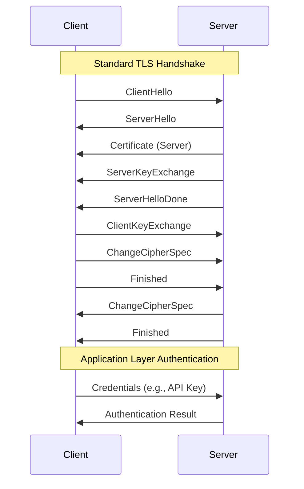
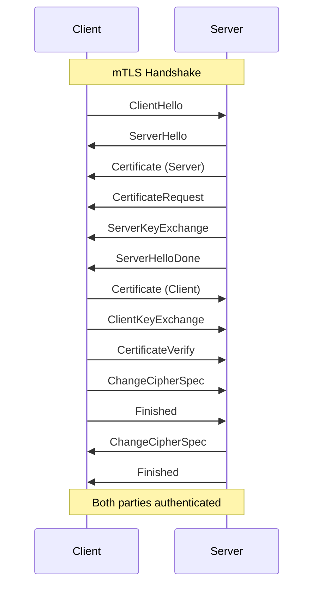
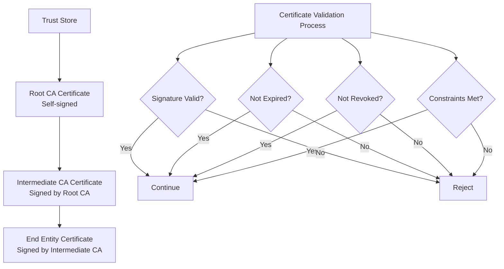
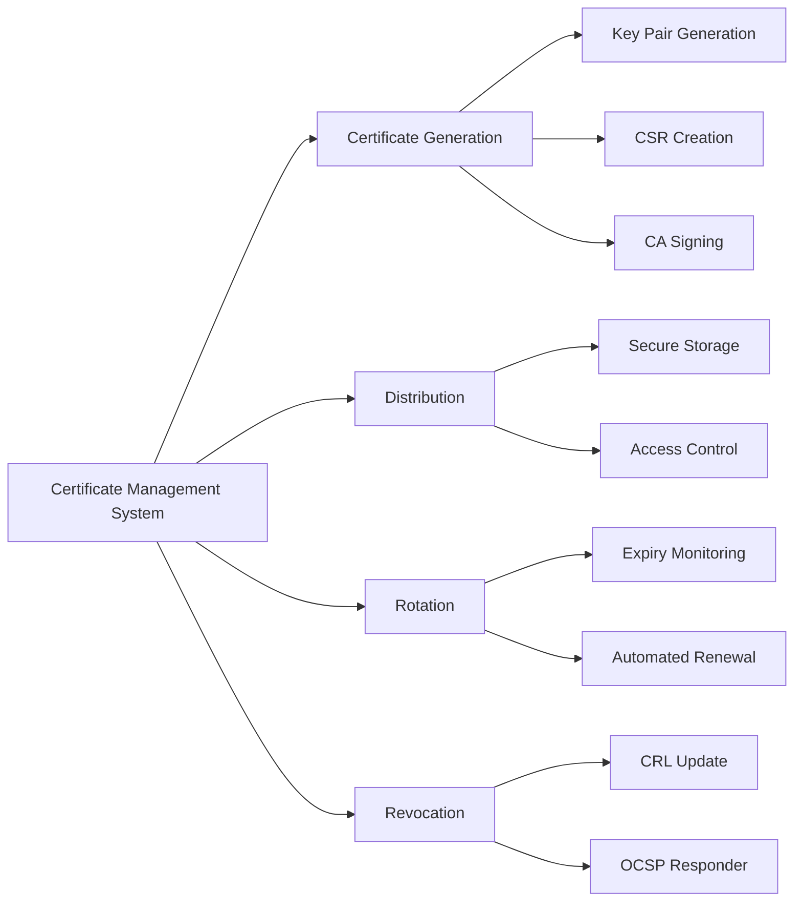
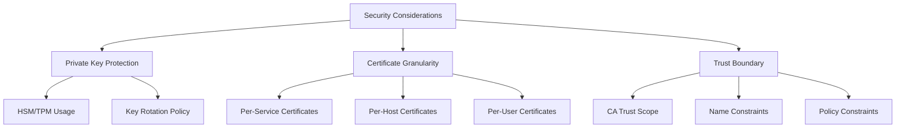

# mTLS (Mutual TLS)

## TLSプロトコルとその限界

Transport Layer Security (TLS) は、インターネット上の通信を暗号化し、完全性と認証を提供するプロトコルとして広く普及している。TLS 1.3[^1]に至るまでの進化の中で、プロトコルは様々な脅威に対する耐性を獲得してきた。しかし、通常のTLSは本質的に片方向の認証メカニズムである。クライアントがサーバーの身元を検証することはできるが、サーバーがクライアントの身元を暗号学的に検証する手段は提供されていない。

この非対称性は、多くのアプリケーションにとって問題となる。特に、マイクロサービスアーキテクチャやゼロトラストネットワークモデルにおいて、すべての通信参加者の相互認証が不可欠となっている。パスワードやAPIキーなどの応用層での認証メカニズムは存在するが、これらはTLSハンドシェイク後に交換されるため、中間者攻撃やリプレイ攻撃に対して脆弱性を持つ可能性がある。

## mTLSの本質と動作原理

Mutual TLS (mTLS) は、TLSプロトコルを拡張し、クライアントとサーバーの双方向認証を実現する。RFC 8446[^1]のSection 4.3.2で定義されているクライアント認証メカニズムを活用し、両者が互いの証明書を検証することで、通信の開始前に相互の身元を暗号学的に保証する。

mTLSの中核は、公開鍵基盤（PKI）に基づく証明書の相互検証にある。各通信参加者は、信頼できる認証局（CA）によって署名されたX.509証明書を保持し、ハンドシェイクプロセスの中でこれらを交換・検証する。この検証プロセスは、証明書チェーンの検証、有効期限の確認、失効状態の確認など、複数の段階を含む。

mTLSハンドシェイクにおける重要な差異は、`CertificateRequest`メッセージの存在である。サーバーはこのメッセージを通じて、クライアントに証明書の提示を要求する。クライアントは自身の証明書を`Certificate`メッセージで送信し、さらに`CertificateVerify`メッセージで自身が証明書の秘密鍵を保持していることを証明する。

## 証明書検証の詳細メカニズム

mTLSにおける証明書検証は、RFC 5280[^2]で定義されたX.509証明書パス検証アルゴリズムに従う。このプロセスは単なる署名検証以上の複雑さを持ち、以下の要素を含む：

証明書チェーンの構築と検証は、エンドエンティティ証明書からトラストアンカー（通常はルートCA）までの信頼の連鎖を確立する。各証明書の署名は、その発行者の公開鍵によって検証される。この過程で、基本制約（Basic Constraints）拡張、鍵用途（Key Usage）拡張、拡張鍵用途（Extended Key Usage）拡張などの証明書拡張も検証される。

証明書の有効期限検証は、現在時刻が証明書の`notBefore`と`notAfter`フィールドで定義される有効期間内にあることを確認する。時刻同期の問題を考慮し、実装では通常数分のマージンを設けることが推奨される。

失効検証は、証明書失効リスト（CRL）またはオンライン証明書状態プロトコル（OCSP）を通じて行われる。CRLは定期的に更新される失効証明書のリストであり、OCSPはリアルタイムで証明書の状態を照会できる。OCSP Stapling[^3]は、サーバーが事前にOCSP応答を取得し、ハンドシェイク中にクライアントに提供することで、パフォーマンスとプライバシーを改善する技術である。

## 実装における考慮事項

mTLSの実装には、通常のTLS実装を超える複雑さが伴う。証明書管理の自動化は、特に大規模なシステムにおいて重要な課題となる。証明書の有効期限が近づいた際の自動更新、新しい証明書の配布、古い証明書の失効処理など、ライフサイクル全体を管理する必要がある。

パフォーマンスへの影響も無視できない。mTLSハンドシェイクは、追加の証明書交換と検証により、通常のTLSよりも多くの計算リソースとネットワークラウンドトリップを必要とする。特に、証明書チェーンが長い場合や、CRL/OCSP検証が必要な場合、レイテンシーが大幅に増加する可能性がある。

セッション再開メカニズムの活用は、パフォーマンス問題を緩和する重要な手段である。TLS 1.2ではセッションIDやセッションチケット、TLS 1.3ではPre-Shared Key (PSK)メカニズムを使用して、完全なハンドシェイクを回避できる。ただし、これらのメカニズムは適切に実装されなければ、前方秘匿性（Forward Secrecy）を損なう可能性がある。

## セキュリティ上の考慮事項とトレードオフ

mTLSは強力な相互認証を提供するが、新たなセキュリティ上の考慮事項も生じる。秘密鍵の管理は最も重要な課題の一つである。クライアント証明書の秘密鍵が漏洩した場合、攻撃者はそのクライアントとして認証を受けることができる。ハードウェアセキュリティモジュール（HSM）やTrusted Platform Module（TPM）の使用は、秘密鍵の保護を強化する手段となる。

証明書の粒度も重要な設計上の決定事項である。サービスごと、ホストごと、あるいはユーザーごとに証明書を発行するかは、セキュリティ要件と管理の複雑さのトレードオフとなる。細かい粒度は、侵害時の影響範囲を限定できるが、証明書の数が増加し管理が複雑になる。

信頼境界の明確な定義も不可欠である。どのCAを信頼するか、証明書のどの属性を検証するか、名前制約（Name Constraints）をどのように設定するかなど、PKIの設計は組織のセキュリティポリシーと密接に関連する。

## 現代的なアーキテクチャにおけるmTLS

マイクロサービスアーキテクチャの普及により、mTLSの重要性は増している。サービスメッシュ技術（Istio、Linkerdなど）は、mTLSを透過的に実装し、サービス間通信の自動的な暗号化と認証を提供する。これらのシステムは、証明書の自動発行、ローテーション、失効を管理し、開発者がmTLSの複雑さを意識することなくセキュアな通信を実現できるようにする。

ゼロトラストネットワークモデルにおいても、mTLSは中核的な技術である。「決して信頼せず、常に検証する」という原則の下、すべての通信において相互認証を要求することで、ネットワーク境界に依存しないセキュリティモデルを実現する。

Kubernetesなどのコンテナオーケストレーションプラットフォームでは、mTLSはPod間通信のセキュリティを確保する標準的な手段となっている。Kubernetes独自の証明書管理APIと組み合わせることで、動的に変化するコンテナ環境でも一貫したセキュリティを維持できる。

## 実践的な設計と実装の指針

mTLSを実装する際の実践的な指針として、まず段階的な導入アプローチを推奨する。すべての通信を一度にmTLS化するのではなく、重要度の高いサービスから順次適用していく。この過程で、証明書管理プロセスの成熟度を高め、運用上の課題を早期に発見・解決できる。

監視とロギングの重要性も強調したい。証明書の有効期限、ハンドシェイクの失敗率、認証エラーの頻度などのメトリクスを継続的に監視することで、問題を予防的に検出できる。特に、証明書の有効期限切れは、サービス停止の一般的な原因であるため、十分な余裕を持った警告システムが必要である。

災害復旧計画においても、mTLSは特別な考慮を必要とする。CAの秘密鍵が侵害された場合の対応手順、大量の証明書を迅速に再発行する能力、バックアップCAへの切り替え手順などを事前に計画し、定期的に訓練することが重要である。

パフォーマンスの最適化においては、証明書キャッシュの活用、OCSP Staplingの実装、セッション再開の適切な設定が効果的である。また、証明書チェーンの長さを最小限に抑え、必要に応じて中間CA証明書をバンドルすることで、ハンドシェイクのオーバーヘッドを削減できる。

mTLSは、現代の分散システムにおいて不可欠なセキュリティ技術となっている。その実装には技術的な複雑さが伴うが、適切に設計・運用されたmTLSシステムは、強固な相互認証基盤を提供し、ゼロトラストアーキテクチャの実現を可能にする。技術の進化とともに、証明書管理の自動化やパフォーマンスの最適化は継続的に改善されており、今後もセキュアな通信の基盤技術として重要な役割を果たし続けるだろう。

[^1]: Rescorla, E., "The Transport Layer Security (TLS) Protocol Version 1.3", RFC 8446, DOI 10.17487/RFC8446, August 2018, <https://www.rfc-editor.org/info/rfc8446>.

[^2]: Cooper, D., Santesson, S., Farrell, S., Boeyen, S., Housley, R., and W. Polk, "Internet X.509 Public Key Infrastructure Certificate and Certificate Revocation List (CRL) Profile", RFC 5280, DOI 10.17487/RFC5280, May 2008, <https://www.rfc-editor.org/info/rfc5280>.

[^3]: Eastlake 3rd, D., "Transport Layer Security (TLS) Extensions: Extension Definitions", RFC 6066, DOI 10.17487/RFC6066, January 2011, <https://www.rfc-editor.org/info/rfc6066>.