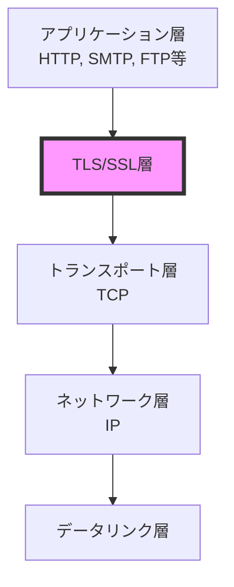
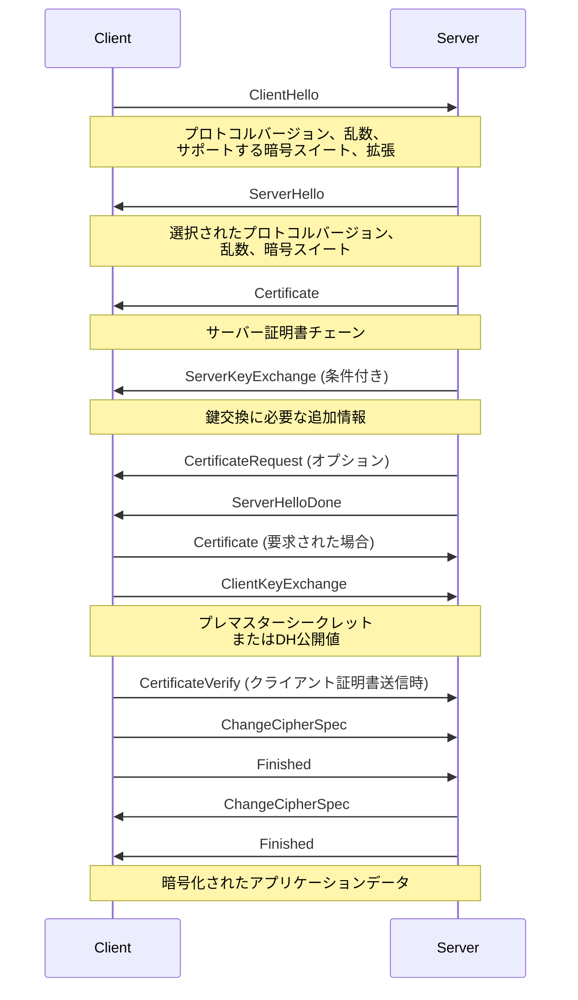
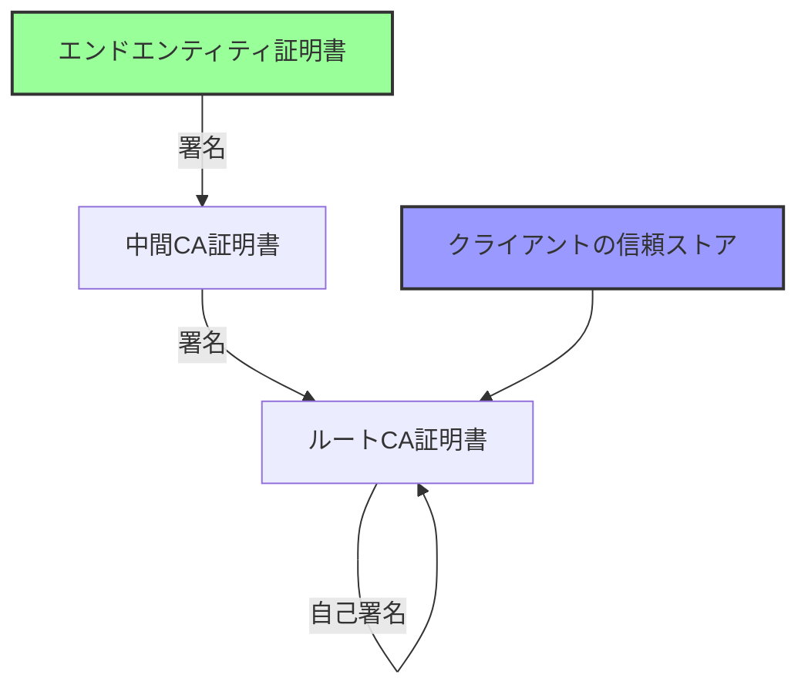
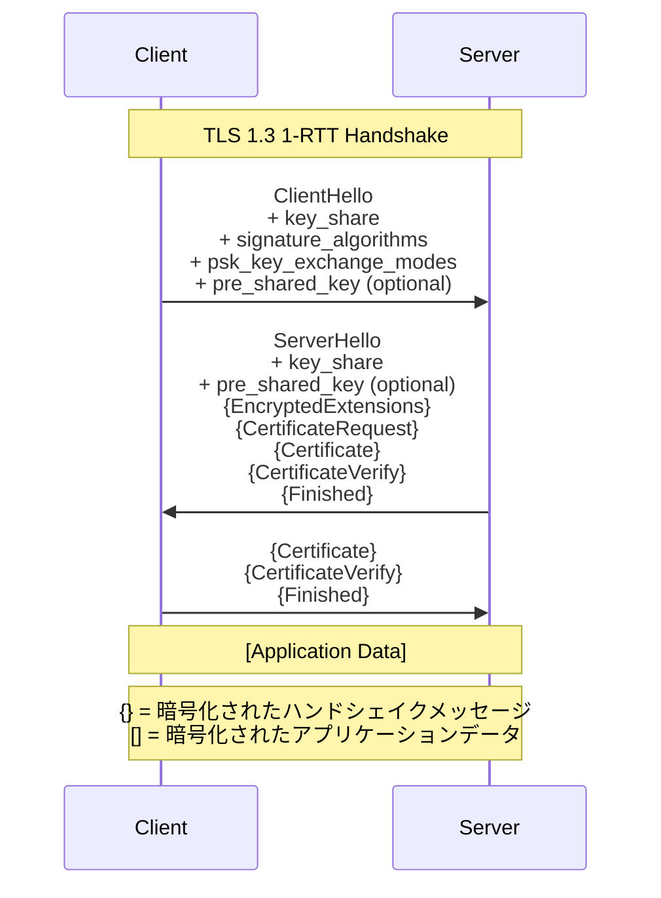

# SSL/TLS

インターネット上の通信において、機密性と完全性を保証することは現代のWebアプリケーションにとって不可欠な要件となっている。SSL（Secure Sockets Layer）およびその後継であるTLS（Transport Layer Security）は、この要件を満たすために開発されたプロトコルであり、HTTPSをはじめとする多くのアプリケーションプロトコルの基盤として機能している。本稿では、SSL/TLSプロトコルの内部構造、暗号学的基盤、そして実装上の考慮事項について詳細に解説する。

## プロトコルの歴史と進化

SSL/TLSの歴史は、1994年にNetscape社が開発したSSL 1.0に遡る。ただし、SSL 1.0は深刻なセキュリティ上の欠陥が発見されたため、公開されることはなかった。1995年にSSL 2.0が公開されたが、これも中間者攻撃に対する脆弱性などの問題を抱えていた。1996年にリリースされたSSL 3.0は、これらの問題を解決し、広く採用されることとなった。

1999年、IETFはSSL 3.0を基にTLS 1.0を標準化した[^1]。TLSという名称への変更は、Netscapeの商標を避けるためのものであったが、プロトコルの本質的な構造はSSL 3.0から大きく変わっていない。その後、TLS 1.1（2006年）、TLS 1.2（2008年）、そしてTLS 1.3（2018年）と改良が重ねられてきた。

[^1]: RFC 2246, "The TLS Protocol Version 1.0", T. Dierks and C. Allen, January 1999

各バージョンの進化において、暗号アルゴリズムの強化、プロトコルの効率化、そして新たに発見された攻撃手法への対策が施されてきた。特にTLS 1.3では、ハンドシェイクプロセスの大幅な簡素化と1-RTT（Round Trip Time）での接続確立が実現され、パフォーマンスの向上が図られている。

## プロトコルの階層構造

TLS/SSLプロトコルは、OSI参照モデルのセッション層に位置し、トランスポート層（通常はTCP）とアプリケーション層の間で動作する。この階層構造により、既存のアプリケーションプロトコルに対して透過的にセキュリティ機能を提供することが可能となっている。



TLSプロトコルは内部的に複数のサブプロトコルから構成されている。主要なコンポーネントは、Record Protocol、Handshake Protocol、Change Cipher Spec Protocol、Alert Protocol、そしてApplication Data Protocolである。Record Protocolは最下層に位置し、上位プロトコルからのメッセージをフラグメント化、圧縮（現在は非推奨）、暗号化して送信する役割を担う。

## ハンドシェイクプロトコルの詳細

TLSの中核となるのがハンドシェイクプロトコルである。このプロトコルは、クライアントとサーバー間で暗号パラメータのネゴシエーション、相互認証、そして暗号鍵の生成を行う。TLS 1.2までのフルハンドシェイクは以下のシーケンスで実行される。



ClientHelloメッセージには、クライアントがサポートするTLSバージョンの最高値、32バイトのランダム値（うち4バイトはタイムスタンプ）、セッションIDフィールド、サポートする暗号スイートのリスト、そして圧縮方式のリストが含まれる。TLS拡張機能により、SNI（Server Name Indication）やALPN（Application-Layer Protocol Negotiation）などの追加情報も送信される。

サーバーはServerHelloで使用するプロトコルバージョンと暗号スイートを選択し、自身のランダム値と共に返送する。続いて送信されるCertificateメッセージには、サーバーのX.509証明書とその証明書チェーンが含まれる。クライアントはこの証明書チェーンを検証し、ルート認証局まで辿ることでサーバーの正当性を確認する。

鍵交換アルゴリズムによっては、ServerKeyExchangeメッセージが必要となる。例えば、DHE（Diffie-Hellman Ephemeral）やECDHE（Elliptic Curve Diffie-Hellman Ephemeral）を使用する場合、サーバーはDHパラメータや公開鍵を送信する必要がある。

## 暗号スイートと鍵導出

暗号スイートは、TLSで使用される暗号アルゴリズムの組み合わせを定義する。典型的な暗号スイートは以下の要素から構成される：

- 鍵交換アルゴリズム（RSA、DHE、ECDHE等）
- 認証アルゴリズム（RSA、DSA、ECDSA等）
- 対称暗号アルゴリズム（AES、ChaCha20等）
- ハッシュ関数（SHA-256、SHA-384等）

例えば、`TLS_ECDHE_RSA_WITH_AES_128_GCM_SHA256`という暗号スイートは、ECDHEによる鍵交換、RSAによる認証、AES-128-GCMによる暗号化、SHA-256によるハッシュを使用することを示している。

マスターシークレットの導出は、クライアントとサーバーが交換した乱数値とプレマスターシークレットを基に行われる。TLS 1.2では、PRF（Pseudo-Random Function）を使用して以下のように計算される：

```
master_secret = PRF(pre_master_secret, "master secret",
                    ClientHello.random + ServerHello.random)[0..47]
```

このマスターシークレットから、実際の暗号化に使用される鍵素材が導出される。具体的には、クライアント用MAC鍵、サーバー用MAC鍵、クライアント用暗号鍵、サーバー用暗号鍵、そして必要に応じてIV（Initialization Vector）が生成される。

## 証明書と公開鍵基盤

TLSにおける認証は、X.509証明書[^2]と公開鍵基盤（PKI）に依存している。証明書は、公開鍵とその所有者の身元情報を結びつける電子文書であり、信頼できる第三者機関である認証局（CA）によってデジタル署名される。

[^2]: RFC 5280, "Internet X.509 Public Key Infrastructure Certificate and Certificate Revocation List (CRL) Profile", D. Cooper et al., May 2008

証明書の検証プロセスは複数の段階から成る。まず、証明書チェーンの各証明書について、発行者の署名が正しいことを確認する。次に、証明書の有効期限を確認し、必要に応じてCRL（Certificate Revocation List）やOCSP（Online Certificate Status Protocol）を使用して失効状態をチェックする。最後に、証明書のサブジェクト名またはSAN（Subject Alternative Name）が接続先のホスト名と一致することを確認する。



証明書の信頼性は、ルートCAへの信頼に基づく推移的な信頼モデルに依存している。オペレーティングシステムやブラウザは、信頼できるルートCAのリストを保持しており、これらのCAから発行された証明書チェーンのみを有効とみなす。

## Forward SecrecyとPerfect Forward Secrecy

Forward Secrecy（前方秘匿性）は、長期的な秘密鍵が将来漏洩した場合でも、過去の通信内容が解読できないことを保証する性質である。RSA鍵交換では、サーバーの秘密鍵が漏洩すると過去に記録された暗号化通信をすべて復号できてしまう。これに対し、DHEやECDHEを使用した鍵交換では、各セッションで一時的な鍵ペアを生成するため、長期秘密鍵の漏洩が過去の通信に影響を与えない。

Perfect Forward Secrecy（PFS）を実現するためには、以下の条件を満たす必要がある：

1. 各セッションで新しい一時的な鍵ペアを生成する
2. セッション終了後、一時的な秘密鍵を確実に破棄する
3. 鍵導出に使用される乱数が予測不可能である

現代のTLS実装では、ECDHEが最も広く使用されているPFS対応の鍵交換アルゴリズムである。楕円曲線暗号の計算効率の高さにより、従来のDHEと比較してパフォーマンスへの影響を最小限に抑えながらPFSを実現できる。

## TLS 1.3の革新

2018年に標準化されたTLS 1.3[^3]は、プロトコルの大幅な簡素化と性能向上を実現した。主要な変更点として、レガシーな暗号アルゴリズムの削除、ハンドシェイクプロセスの最適化、そして0-RTTデータ送信のサポートが挙げられる。

[^3]: RFC 8446, "The Transport Layer Security (TLS) Protocol Version 1.3", E. Rescorla, August 2018

TLS 1.3では、サポートされる暗号スイートが5つに絞られ、すべてがAEAD（Authenticated Encryption with Associated Data）暗号を使用する：

- TLS_AES_128_GCM_SHA256
- TLS_AES_256_GCM_SHA384
- TLS_CHACHA20_POLY1305_SHA256
- TLS_AES_128_CCM_SHA256
- TLS_AES_128_CCM_8_SHA256

ハンドシェイクプロトコルも大幅に簡素化され、1-RTTでの接続確立が標準となった。さらに、PSK（Pre-Shared Key）を使用した0-RTTデータ送信により、再接続時のレイテンシをほぼゼロにすることが可能となった。



TLS 1.3では、ServerHelloメッセージの後、すべてのハンドシェイクメッセージが暗号化される。これにより、証明書情報を含むハンドシェイクの大部分が盗聴から保護される。

## 実装上の考慮事項

TLSの実装において考慮すべき重要な要素は多岐にわたる。まず、暗号ライブラリの選択が挙げられる。OpenSSL、BoringSSL、LibreSSL、mbedTLS、wolfSSLなど、各ライブラリには特徴とトレードオフが存在する。OpenSSLは最も広く使用されているが、コードベースが複雑で脆弱性の温床となりやすい。一方、BoringSSLはGoogleがOpenSSLをフォークして開発したもので、不要な機能を削除してセキュリティを向上させている。

証明書の管理も重要な課題である。Let's Encryptの登場により、無料でドメイン検証証明書を取得できるようになったが、自動更新の仕組みを適切に実装する必要がある。証明書の有効期限切れは、サービス停止の一般的な原因となっている。

```python
# Example: Certificate expiration monitoring
import ssl
import socket
from datetime import datetime

def check_certificate_expiration(hostname, port=443):
    context = ssl.create_default_context()
    with socket.create_connection((hostname, port)) as sock:
        with context.wrap_socket(sock, server_hostname=hostname) as ssock:
            cert = ssock.getpeercert()
            not_after = datetime.strptime(cert['notAfter'], '%b %d %H:%M:%S %Y %Z')
            days_remaining = (not_after - datetime.now()).days
            return days_remaining
```

パフォーマンスの最適化も重要な考慮事項である。TLSハンドシェイクは計算コストが高く、特に大規模なサービスではCPU使用率のボトルネックとなる可能性がある。セッション再開機能（Session ResumptionやSession Ticket）の活用、ハードウェアアクセラレーションの利用、適切な暗号アルゴリズムの選択などにより、パフォーマンスを改善できる。

## セキュリティ上の脅威と対策

TLSプロトコルに対する攻撃は、実装の脆弱性を突くものとプロトコル自体の弱点を利用するものに大別される。BEAST、CRIME、BREACH、POODLE、Heartbleedなど、過去に発見された攻撃は、TLSエコシステムの進化を促してきた。

Heartbleed脆弱性は、OpenSSLのHeartbeat拡張の実装バグにより、サーバーのメモリ内容を読み取ることができる深刻な脆弱性であった。この事件は、暗号ライブラリの実装品質の重要性を改めて認識させ、コードレビューとファジングテストの強化につながった。

プロトコルレベルの攻撃に対しては、以下のような対策が推奨される：

- 古いプロトコルバージョン（SSL 3.0、TLS 1.0、TLS 1.1）の無効化
- 弱い暗号スイートの無効化
- HSTS（HTTP Strict Transport Security）の実装
- Certificate Pinningの検討（モバイルアプリケーションなど）
- OCSP Staplingの有効化

また、実装においては、タイミング攻撃への対策も重要である。暗号処理において、処理時間が入力データに依存しないよう、定時間アルゴリズムを使用する必要がある。

## プロトコルの将来と量子耐性

量子コンピュータの実用化が視野に入る中、現在の公開鍵暗号アルゴリズムは量子コンピュータによる攻撃に脆弱であることが知られている。Shorのアルゴリズムにより、RSAやECDSAなどの暗号は多項式時間で破られる可能性がある。

NISTは量子耐性暗号の標準化プロセスを進めており、格子ベース暗号、コードベース暗号、多変数多項式暗号などが候補として検討されている。TLSにおいても、これらの量子耐性アルゴリズムへの移行が必要となるが、鍵サイズの増大やパフォーマンスへの影響など、解決すべき課題は多い。

ハイブリッドアプローチとして、従来の暗号アルゴリズムと量子耐性アルゴリズムを組み合わせる方法も提案されている。これにより、量子コンピュータの脅威に備えつつ、従来のセキュリティレベルを維持することができる。

TLS/SSLは、インターネットセキュリティの基盤として今後も進化を続けるだろう。プロトコルの簡素化、パフォーマンスの向上、新たな脅威への対応など、継続的な改善が求められている。エンジニアとして、これらの技術的詳細を理解し、適切に実装・運用することが、安全なインターネットサービスの提供において不可欠である。