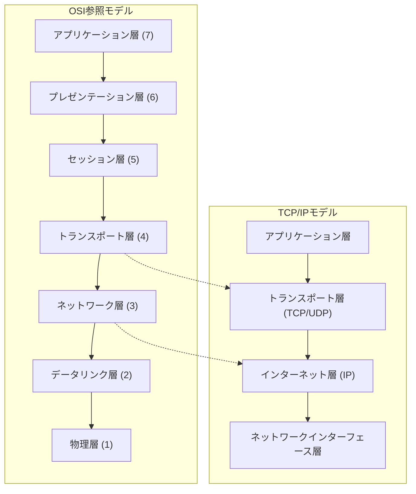
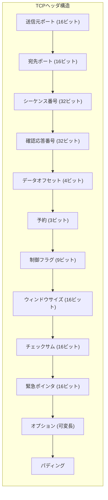
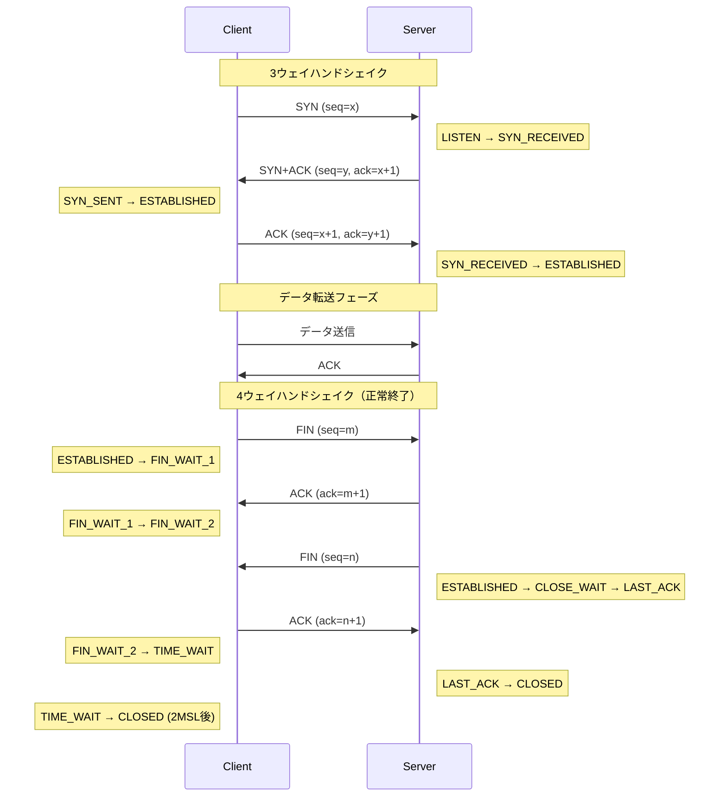
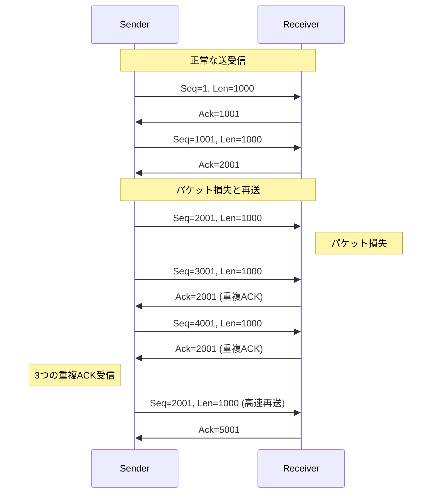
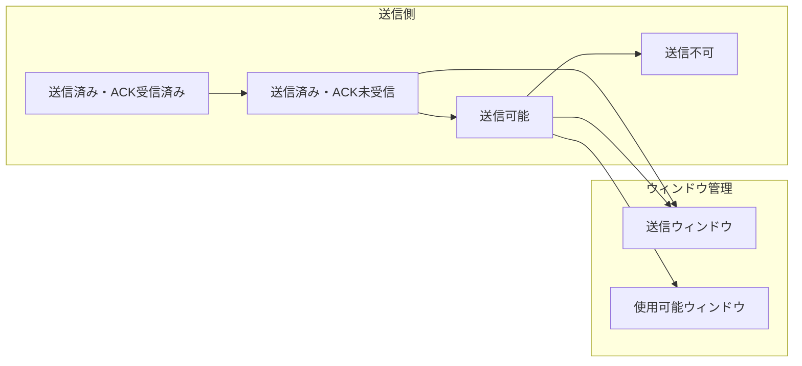
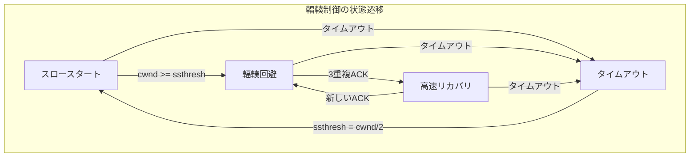
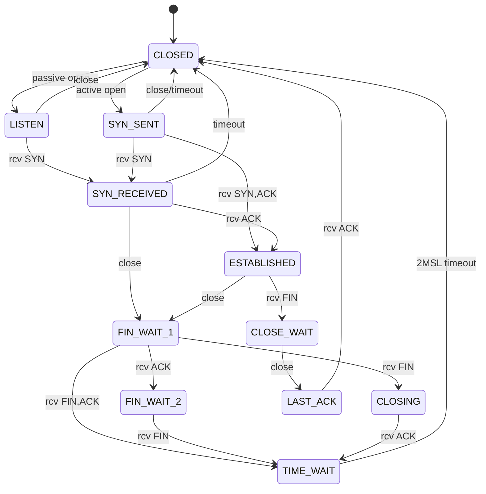

# TCP (Transmission Control Protocol)

TCP（Transmission Control Protocol）は、インターネットプロトコルスイートの中核を成すトランスポート層プロトコルである。1974年にVint CerfとBob Kahnによって最初の仕様が提案され[^1]、1981年にRFC 793として標準化された[^2]。TCPは信頼性のあるバイトストリーム配送サービスを提供し、現代のインターネット通信の基盤となっている。

インターネットプロトコルスイートにおいて、TCPはトランスポート層に位置し、アプリケーション層とネットワーク層の間で動作する。下位のIP層が提供するベストエフォート型のパケット配送サービスの上に、信頼性、順序制御、フロー制御、輻輳制御といった高度な機能を実装することで、アプリケーションに対して堅牢な通信基盤を提供する。



## TCPの基本概念と設計原理

TCPの設計は、当時の不安定なネットワーク環境を前提としている。パケットの損失、重複、順序の入れ替わりが頻繁に発生する環境において、アプリケーションに対して透過的に信頼性のある通信を提供することが主要な設計目標であった。この目標を達成するため、TCPは以下の基本機能を実装している。

**コネクション指向通信**は、TCPの最も重要な特徴の一つである。データ転送を開始する前に、送信側と受信側の間で明示的にコネクションを確立し、通信が終了したらコネクションを解放する。このコネクションは仮想的なものであり、中間のルータやスイッチはコネクションの存在を認識しない。コネクションの状態はエンドポイントでのみ管理される。

**信頼性のあるデータ転送**は、シーケンス番号と確認応答（ACK）メカニズムによって実現される。送信されるすべてのバイトには一意のシーケンス番号が割り当てられ、受信側は正しく受信したデータの範囲を確認応答で送信側に通知する。送信側は確認応答を受信するまでデータを保持し、必要に応じて再送を行う。

**順序制御**により、アプリケーションは送信した順序でデータを受信することが保証される。ネットワーク層でパケットの順序が入れ替わっても、TCPは受信側でシーケンス番号に基づいてデータを正しい順序に並べ替える。

**フロー制御**は、受信側の処理能力を超えてデータが送信されることを防ぐ。受信側は受信ウィンドウサイズを通知し、送信側はこのウィンドウサイズを超えてデータを送信しない。これにより、受信側のバッファオーバーフローを防ぐ。

**輻輳制御**は、ネットワーク全体の輻輳を防ぐメカニズムである。送信側は輻輳ウィンドウを管理し、ネットワークの状態に応じて送信レートを動的に調整する。これにより、ネットワーク全体の安定性を維持する。

## TCPヘッダの構造と意味

TCPヘッダは、最小20バイトから最大60バイトの可変長構造を持つ。各フィールドは特定の機能を担い、プロトコルの動作に不可欠な情報を含んでいる。



**送信元ポート番号と宛先ポート番号**（各16ビット）は、アプリケーションを識別するために使用される。IPアドレスと組み合わせることで、一意のソケットを形成する。ポート番号は0から65535の範囲を持ち、0から1023はウェルノウンポート、1024から49151は登録済みポート、49152から65535は動的ポートとして分類される。

**シーケンス番号**（32ビット）は、送信データストリーム内の各バイトの位置を示す。初期シーケンス番号（ISN）はコネクション確立時にランダムに選択され、セキュリティ上の理由から予測困難な値が使用される。シーケンス番号は送信されたバイト数に応じて増加し、2^32を超えるとラップアラウンドする。

**確認応答番号**（32ビット）は、次に受信を期待するバイトのシーケンス番号を示す。これは累積確認応答であり、指定された番号より前のすべてのバイトが正しく受信されたことを意味する。選択的確認応答（SACK）オプションを使用することで、不連続な受信範囲を通知することも可能である。

**データオフセット**（4ビット）は、TCPヘッダの長さを32ビット（4バイト）単位で示す。最小値は5（20バイト）、最大値は15（60バイト）である。この値により、可変長のオプションフィールドを含むヘッダの終端位置を特定できる。

**制御フラグ**（9ビット）は、TCPセグメントの性質と処理方法を示す。RFC 3168で定義されたECNフラグを含め、以下の9つのフラグが存在する：

- **URG（Urgent）**：緊急データの存在を示す
- **ACK（Acknowledgment）**：確認応答番号フィールドが有効であることを示す
- **PSH（Push）**：受信データを即座にアプリケーションに渡すよう指示
- **RST（Reset）**：コネクションの強制終了
- **SYN（Synchronize）**：コネクション確立時のシーケンス番号の同期
- **FIN（Finish）**：送信側のデータ送信完了を通知
- **ECE（ECN-Echo）**：明示的輻輳通知のエコー
- **CWR（Congestion Window Reduced）**：輻輳ウィンドウの縮小を通知
- **NS（Nonce Sum）**：ECNナンスの保護

**ウィンドウサイズ**（16ビット）は、受信側が受け入れ可能なデータ量をバイト単位で示す。実際のウィンドウサイズは、ウィンドウスケールオプションによって最大2^30バイトまで拡張可能である。これは高速ネットワークにおいて重要な機能である。

**チェックサム**（16ビット）は、TCPヘッダとデータの整合性を検証するために使用される。計算には擬似ヘッダ（送信元IPアドレス、宛先IPアドレス、プロトコル番号、TCPセグメント長）も含まれる。これにより、IPヘッダの一部の誤りも検出できる。

**緊急ポインタ**（16ビット）は、URGフラグがセットされている場合に有効となり、緊急データの終端位置を示す。ただし、緊急データの処理方法についてはRFC 1122とRFC 793で解釈が異なり、実装によって動作が異なる場合がある。

**オプションフィールド**は、基本的な機能を拡張するために使用される。主要なオプションには以下がある：

- **Maximum Segment Size (MSS)**：受信可能な最大セグメントサイズを通知
- **Window Scale**：ウィンドウサイズフィールドのスケーリング係数を指定
- **Selective Acknowledgment (SACK)**：不連続な受信範囲を通知
- **Timestamps**：往復時間測定と重複データ検出に使用
- **TCP Fast Open (TFO)**：初期データ送信によるレイテンシ削減

## コネクションの確立と終了

TCPコネクションの確立は、3ウェイハンドシェイクと呼ばれるプロセスによって行われる。このプロセスは、両端のシーケンス番号を同期し、各種パラメータをネゴシエートする。



**3ウェイハンドシェイク**の詳細なプロセスは以下の通りである：

1. **SYNセグメント**：クライアントは、SYNフラグをセットし、初期シーケンス番号（ISN）xを含むセグメントを送信する。同時に、MSSオプションやウィンドウスケールオプションなど、使用したいTCPオプションを通知する。

2. **SYN+ACKセグメント**：サーバーは、SYNフラグとACKフラグの両方をセットしたセグメントで応答する。このセグメントには、サーバーのISN（y）と、クライアントのISNに1を加えた確認応答番号（x+1）が含まれる。サーバーも自身が対応するTCPオプションを通知する。

3. **ACKセグメント**：クライアントは、ACKフラグをセットし、サーバーのISNに1を加えた確認応答番号（y+1）を含むセグメントを送信する。これによりコネクションが確立される。

初期シーケンス番号の選択は、セキュリティ上重要である。RFC 6528では、暗号学的に安全な擬似乱数生成器を使用してISNを生成することが推奨されている[^3]。これにより、シーケンス番号予測攻撃を防ぐ。

**コネクションの終了**は、通常4ウェイハンドシェイクによって行われる。各方向のデータストリームは独立して終了されるため、半閉鎖（half-close）状態が存在する。

1. **アクティブクローズ**：一方の端点（通常はクライアント）がFINフラグをセットしたセグメントを送信し、その方向のデータ送信が完了したことを通知する。

2. **パッシブクローズ**：FINを受信した側は、ACKを返送してFINの受信を確認する。この時点で、半閉鎖状態となり、FINを送信した側はデータを送信できないが、受信は可能である。

3. **双方向の終了**：パッシブクローズ側も自身のデータ送信が完了したら、FINを送信する。

4. **最終確認**：最後のFINに対するACKが送信され、両方向のデータストリームが終了する。

**TIME_WAIT状態**は、TCPの重要な機能である。アクティブクローズを行った側は、最後のACKを送信した後、2×MSL（Maximum Segment Lifetime）の間TIME_WAIT状態に留まる。この期間は通常2分間（MSL=30秒の場合）である。TIME_WAIT状態の目的は以下の通りである：

- **重複セグメントの処理**：古いコネクションからの遅延セグメントが新しいコネクションに影響を与えることを防ぐ。
- **最終ACKの保証**：最後のACKが失われた場合、相手側がFINを再送できるようにする。

## 信頼性のあるデータ転送メカニズム

TCPの信頼性は、複数のメカニズムの組み合わせによって実現される。これらのメカニズムは相互に関連し、協調して動作する。

**シーケンス番号とセグメント化**において、TCPはアプリケーションから受け取ったバイトストリームを適切なサイズのセグメントに分割する。セグメントサイズは、パスMTU探索やMSSオプションによって決定される。各バイトには連続したシーケンス番号が割り当てられ、セグメントのヘッダにはそのセグメントの最初のバイトのシーケンス番号が記録される。

**累積確認応答**は、TCPの基本的な確認メカニズムである。受信側は、正しく受信した連続するバイトの次のシーケンス番号を確認応答番号として送信する。例えば、シーケンス番号1から1000までのデータを受信した場合、確認応答番号1001を送信する。これは、1000番目までのすべてのバイトが正しく受信されたことを意味する。



**再送メカニズム**は、パケット損失に対する主要な対策である。TCPは以下の2つの主要な再送トリガーを持つ：

1. **タイムアウトベースの再送**：送信側は各セグメントに対して再送タイマーを設定する。タイマーが満了するまでに確認応答を受信しなかった場合、セグメントを再送する。再送タイムアウト（RTO）は、往復時間（RTT）の測定値に基づいて動的に計算される。

2. **高速再送**：同じ確認応答番号を3回受信した場合（3つの重複ACK）、タイムアウトを待たずに即座に再送を行う。これは、後続のセグメントが受信されているがギャップが存在することを示すため、損失したセグメントを素早く再送できる。

**往復時間の測定とRTO計算**は、効率的な再送制御に不可欠である。TCPは、Jacobsonのアルゴリズム[^4]を使用してRTTを測定し、RTOを計算する：

```
SRTT = (1 - α) × SRTT + α × RTT_sample
RTTVAR = (1 - β) × RTTVAR + β × |SRTT - RTT_sample|
RTO = SRTT + 4 × RTTVAR
```

ここで、α = 1/8、β = 1/4が一般的に使用される。SRTTは平滑化されたRTT、RTTVARはRTTの変動を表す。

**選択的確認応答（SACK）**は、不連続な受信範囲を効率的に通知するメカニズムである。基本的な累積確認応答では、ギャップより後のすべてのセグメントの受信を通知できないが、SACKオプションを使用することで、受信済みの範囲を明示的に通知できる。これにより、送信側は損失したセグメントのみを選択的に再送できる。

## フロー制御

フロー制御は、受信側の処理能力を超えてデータが送信されることを防ぐメカニズムである。TCPは、スライディングウィンドウプロトコルを使用してフロー制御を実現する。

**受信ウィンドウ**は、受信側が現在受け入れ可能なデータ量を示す。受信側は各ACKセグメントでウィンドウサイズを通知し、送信側はこの値を超えてデータを送信しない。ウィンドウサイズは、受信バッファの空き容量とアプリケーションのデータ読み取り速度に応じて動的に変化する。



**ゼロウィンドウ処理**は、受信側のバッファが満杯になった場合の特別な処理である。受信側がウィンドウサイズ0を通知した場合、送信側はデータ送信を停止する。ただし、ウィンドウが再び開いたことを検出するため、送信側は定期的にウィンドウプローブセグメント（1バイトのデータを含む）を送信する。

**Silly Window Syndrome (SWS)**は、小さなウィンドウ更新が頻繁に発生することで、ネットワーク効率が低下する現象である。これを防ぐため、以下の対策が実装されている：

- **受信側のSWS回避**（Clark's solution）：受信側は、十分な大きさ（通常はMSSの半分以上）のウィンドウが利用可能になるまで、ウィンドウ更新を遅延させる。
- **送信側のSWS回避**（Nagle's algorithm）：送信側は、小さなデータを即座に送信せず、より多くのデータが蓄積されるか、未確認データがなくなるまで待機する。

## 輻輳制御

輻輳制御は、ネットワーク全体の安定性を維持するためのメカニズムである。1980年代後半のインターネットの輻輳崩壊を受けて、Van Jacobsonによって開発された[^5]。現代のTCP実装は、複数の輻輳制御アルゴリズムを組み合わせて使用する。

**輻輳ウィンドウ（cwnd）**は、ネットワークが処理できると推定されるデータ量を表す。送信側は、受信ウィンドウと輻輳ウィンドウの小さい方を実際の送信ウィンドウとして使用する：

```
送信ウィンドウ = min(受信ウィンドウ, 輻輳ウィンドウ)
```

**スロースタート**は、コネクション開始時や輻輳後の送信レートを徐々に増加させるアルゴリズムである。初期輻輳ウィンドウ（IW）は、RFC 6928により10セグメントまで増加された[^6]。スロースタートでは、ACKを受信するたびに輻輳ウィンドウを1MSS増加させるため、RTTごとに輻輳ウィンドウは指数関数的に増加する。



**輻輳回避**は、輻輳ウィンドウがスロースタート閾値（ssthresh）に達した後のより保守的な増加アルゴリズムである。RTTごとに輻輳ウィンドウを1MSS増加させる（線形増加）。これは、以下の式で実現される：

```
cwnd = cwnd + MSS × MSS / cwnd
```

**高速再送と高速リカバリ**は、軽度の輻輳に対する効率的な対処法である。3つの重複ACKを受信した場合：

1. ssthreshを現在の輻輳ウィンドウの半分に設定
2. 損失したセグメントを即座に再送
3. 輻輳ウィンドウをssthresh + 3×MSSに設定（高速リカバリ開始）
4. 追加の重複ACKごとに輻輳ウィンドウを1MSS増加
5. 新しいデータのACKを受信したら、輻輳ウィンドウをssthreshに設定

**輻輳制御アルゴリズムの進化**により、様々な改良版が開発されている：

- **TCP Reno**：基本的な高速再送・高速リカバリを実装
- **TCP NewReno**：部分的なACKの処理を改善
- **TCP CUBIC**：3次関数を使用した輻輳ウィンドウ増加（Linuxのデフォルト）
- **TCP BBR**：ボトルネック帯域幅と往復伝播時間に基づく制御[^7]

## TCPの状態遷移

TCPコネクションは、明確に定義された状態遷移図に従って動作する。各状態は特定の意味を持ち、許可される操作が制限される。



主要な状態の意味と遷移条件は以下の通りである：

**CLOSED**：コネクションが存在しない初期状態。TCBが割り当てられていない。

**LISTEN**：サーバーがコネクション要求を待機している状態。パッシブオープンによって遷移する。

**SYN_SENT**：クライアントがSYNを送信し、対応するSYN+ACKを待機している状態。アクティブオープンによって遷移する。

**SYN_RECEIVED**：SYNを受信し、SYN+ACKを送信した状態。相手からのACKを待機している。

**ESTABLISHED**：コネクションが確立され、双方向のデータ転送が可能な状態。

**FIN_WAIT_1**：アプリケーションがクローズを要求し、FINを送信した状態。

**FIN_WAIT_2**：自身のFINに対するACKを受信したが、相手のFINをまだ受信していない状態。

**CLOSE_WAIT**：相手からFINを受信し、アプリケーションにクローズを通知した状態。

**CLOSING**：両端が同時にクローズを開始した場合の状態。

**LAST_ACK**：パッシブクローズ側がFINを送信し、最後のACKを待機している状態。

**TIME_WAIT**：コネクションの終了後、2MSLの間待機する状態。

## 性能最適化とスケーラビリティ

TCPの性能は、様々な要因によって制限される。高速ネットワークや長距離通信において最適な性能を達成するには、複数の最適化技術が必要である。

**帯域幅遅延積（BDP）**は、ネットワークの「容量」を表す重要な指標である：

```
BDP = 帯域幅 × 往復遅延時間
```

例えば、10Gbpsのリンクで往復遅延が100msの場合、BDPは125MBとなる。最適な性能を得るには、送受信バッファとウィンドウサイズをBDP以上に設定する必要がある。

**ウィンドウスケーリング**は、16ビットのウィンドウサイズフィールドの制限（最大65,535バイト）を克服するオプションである。スケールファクタ（0-14）により、最大1GBのウィンドウサイズを表現できる。これは高速・長距離ネットワークで不可欠である。

**タイムスタンプオプション**は、正確なRTT測定とPAWS（Protection Against Wrapped Sequences）を提供する。32ビットのシーケンス番号は高速ネットワークで短時間でラップアラウンドする可能性があるが、タイムスタンプにより古いセグメントを識別できる。

**TCP Fast Open（TFO）**は、ハンドシェイク中にデータを送信することで、レイテンシを削減する。初回接続時にサーバーがクッキーを発行し、後続の接続でクライアントがこのクッキーとともに初期データを送信できる[^8]。

**セグメンテーションオフロード**は、TCPセグメント化をネットワークインターフェースカード（NIC）にオフロードする技術である：

- **TSO（TCP Segmentation Offload）**：送信時の大きなセグメントの分割をNICが実行
- **LRO（Large Receive Offload）**：受信時の複数セグメントの結合をNICが実行
- **GSO（Generic Segmentation Offload）**：プロトコル非依存のセグメンテーション

## 実装上の考慮事項とトレードオフ

TCP実装では、多くの設計上のトレードオフが存在する。これらの選択は、アプリケーションの特性やネットワーク環境に応じて最適化される必要がある。

**Nagleアルゴリズムとレイテンシ**のトレードオフは、対話的アプリケーションで重要である。Nagleアルゴリズムは小さなパケットの送信を遅延させることで効率を向上させるが、レイテンシが増加する。TCP_NODELAYオプションにより無効化できるが、ネットワーク効率とのバランスを考慮する必要がある。

**バッファ管理**は、メモリ使用量と性能のバランスを取る必要がある。動的バッファ調整により、接続ごとに適切なバッファサイズを割り当てることができる。Linuxでは、tcp_rmemとtcp_wmemパラメータで制御される。

**接続管理とリソース**において、各TCP接続はTransmission Control Block（TCB）と呼ばれるデータ構造を必要とする。大量の接続を扱うサーバーでは、メモリ使用量が問題となる。接続ごとに必要なメモリは通常数KBから数十KBであり、接続数に応じてスケールする。

**SYN flood攻撃への対策**として、SYN cookieが実装されている。これは、SYN_RECEIVED状態でTCBを割り当てず、クッキーとして状態情報をエンコードすることで、リソース枯渇を防ぐ[^9]。

## TCPの限界と代替プロトコル

TCPは広く使用されているが、特定のユースケースでは限界がある。これらの限界を理解することで、適切なプロトコル選択が可能となる。

**Head-of-Line Blocking**は、TCPの順序保証により発生する問題である。1つのセグメントが損失した場合、後続のセグメントが受信されていても、アプリケーションに渡すことができない。これは、特に多重化されたストリームで問題となる。

**接続確立のオーバーヘッド**は、短命な接続で顕著である。3ウェイハンドシェイクは最低1RTTを必要とし、TLSを使用する場合はさらに遅延が増加する。

**輻輳制御の保守性**により、利用可能な帯域幅を完全に活用できない場合がある。特に、パケット損失が輻輳以外の原因（無線リンクのエラーなど）で発生する環境では、不必要な性能低下が生じる。

これらの限界に対処するため、様々な代替プロトコルが開発されている：

- **QUIC**：UDPベースで、ストリーム多重化、0-RTT接続確立、改善された輻輳制御を提供[^10]
- **SCTP**：マルチストリーミング、マルチホーミング、メッセージ境界の保持を提供
- **MPTCP**：複数のパスを同時に使用してスループットと信頼性を向上

TCPは、その信頼性と広範な実装により、インターネットの基盤プロトコルとして今後も重要な役割を果たし続ける。同時に、新しいプロトコルの開発により、特定のユースケースに最適化された選択肢が提供されている。プロトコルの選択は、アプリケーションの要件、ネットワーク環境、互換性の考慮に基づいて行われるべきである。

[^1]: Cerf, V. and Kahn, R., "A Protocol for Packet Network Intercommunication", IEEE Transactions on Communications, May 1974
[^2]: RFC 793, "Transmission Control Protocol", September 1981
[^3]: RFC 6528, "Defending against Sequence Number Attacks", February 2012
[^4]: Jacobson, V., "Congestion Avoidance and Control", SIGCOMM 1988
[^5]: Jacobson, V., "Congestion Avoidance and Control", Computer Communication Review, vol. 18, no. 4, August 1988
[^6]: RFC 6928, "Increasing TCP's Initial Window", April 2013
[^7]: Cardwell, N., et al., "BBR: Congestion-Based Congestion Control", ACM Queue, September 2016
[^8]: RFC 7413, "TCP Fast Open", December 2014
[^9]: Bernstein, D.J., "SYN cookies", http://cr.yp.to/syncookies.html, 1996
[^10]: RFC 9000, "QUIC: A UDP-Based Multiplexed and Secure Transport", May 2021