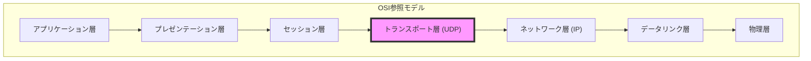
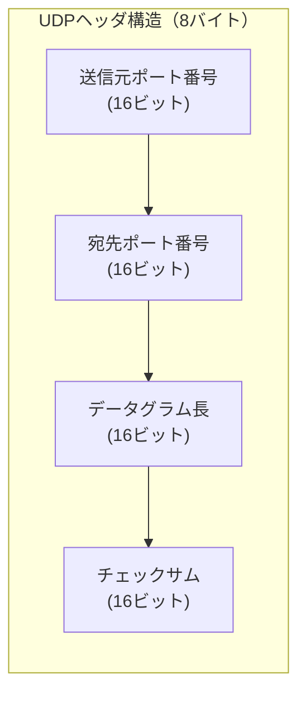
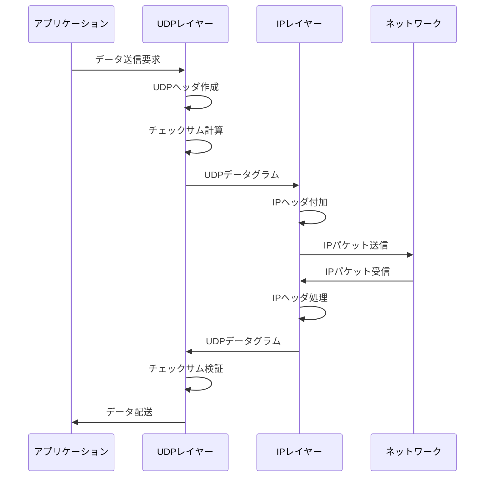
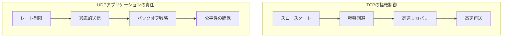
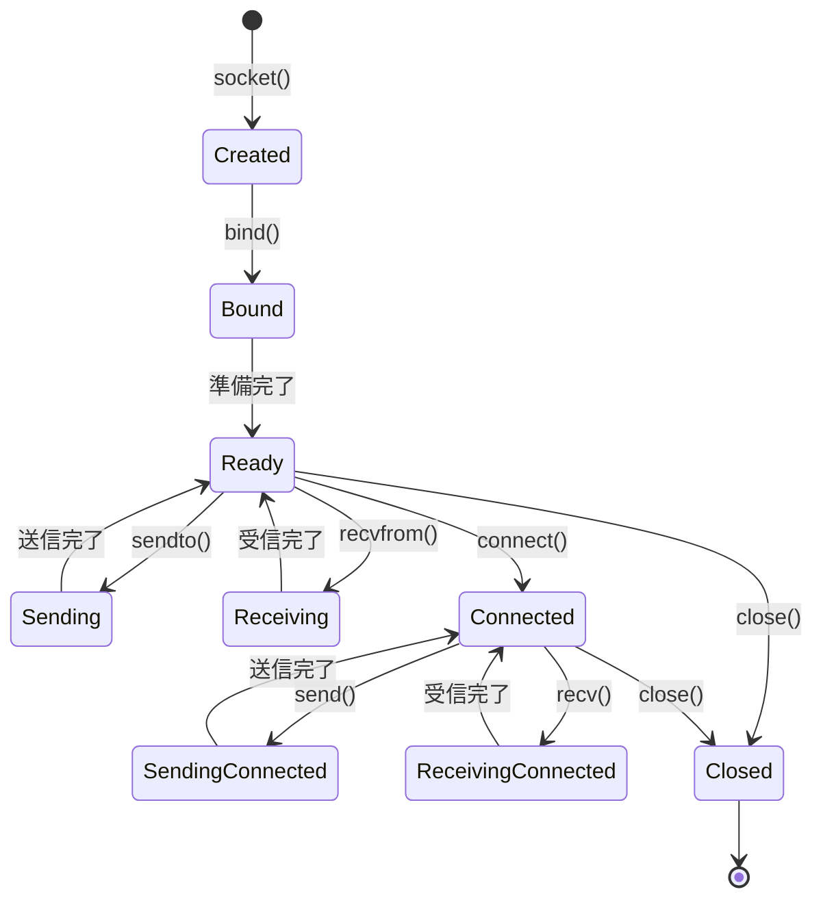
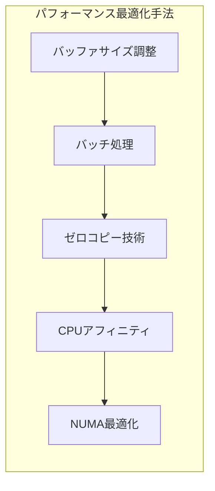
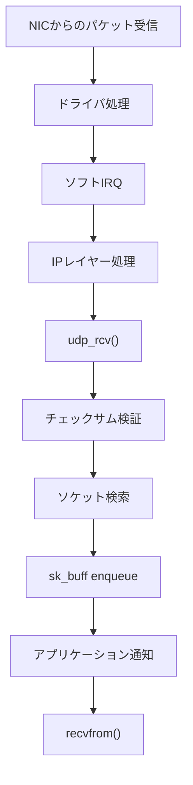
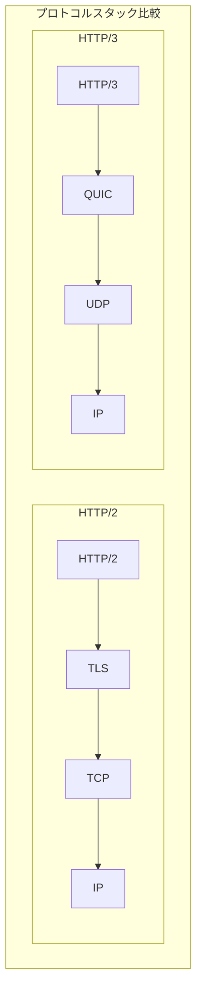

# UDP (User Datagram Protocol)

User Datagram Protocol（UDP）は、インターネットプロトコルスイートのトランスポート層プロトコルとして、1980年にJon Postelによって定義されました[^1]。UDPは、その名前が示すように、データグラム指向の通信を提供し、アプリケーション層に対してIPの基本的なデータグラム配送サービスへの最小限のインターフェースを提供します。TCPが提供する信頼性、順序保証、フロー制御といった機能を意図的に省略することで、低遅延かつ軽量な通信を実現しています。

UDPの設計思想は、エンドツーエンドの原則（end-to-end principle）に基づいています。この原則は、ネットワークの中間ノードではなく、通信の端点であるアプリケーションが必要な機能を実装すべきであるという考え方です。UDPは、この原則を極限まで推し進め、トランスポート層として最小限の機能のみを提供します。

## プロトコルの基本構造

UDPヘッダは、わずか8バイトという極めてコンパクトな構造を持ちます。この簡潔さは、プロトコルの処理オーバーヘッドを最小限に抑え、高速な処理を可能にします。

送信元ポート番号フィールドは16ビットで構成され、0から65535までの値を取ることができます。このフィールドは、送信元ホスト上のアプリケーションを識別します。宛先ポート番号も同様に16ビットで、宛先ホスト上のアプリケーションを特定します。ポート番号の割り当ては、Internet Assigned Numbers Authority（IANA）によって管理されており、0から1023までのウェルノウンポート、1024から49151までの登録済みポート、49152から65535までの動的・プライベートポートに分類されています[^2]。

データグラム長フィールドは、UDPヘッダとペイロードを含む全体の長さをバイト単位で表します。理論上の最大値は65535バイトですが、IPプロトコルの制約により、実際の最大ペイロードサイズは65507バイト（65535 - 8バイトのUDPヘッダ - 20バイトのIPヘッダ）となります。しかし、多くのネットワーク環境では、パスMTU（Maximum Transmission Unit）の制約により、より小さなサイズに制限されます。

チェックサムフィールドは、データの整合性を検証するための16ビットの値です。UDPのチェックサム計算は、擬似ヘッダと呼ばれる概念を使用します。擬似ヘッダには、IPヘッダから抽出された送信元IPアドレス、宛先IPアドレス、プロトコル番号（UDPの場合は17）、およびUDPデータグラム長が含まれます。この設計により、IPヘッダの重要な情報も保護対象に含まれ、誤配送を防ぐことができます。

## チェックサム計算の詳細

UDPチェックサムの計算アルゴリズムは、16ビット単位の1の補数和を使用します。計算手順は以下の通りです：

1. 擬似ヘッダを構築する
2. UDPヘッダのチェックサムフィールドを0に設定する
3. 擬似ヘッダ、UDPヘッダ、およびデータを16ビット単位で加算する
4. データが奇数バイトの場合、最後のバイトの後に0を付加する
5. 加算結果の1の補数を取る

IPv4では、チェックサムの計算はオプションであり、チェックサムフィールドに0を設定することで省略できます。しかし、IPv6では、UDPチェックサムは必須となっています[^3]。これは、IPv6がIPレベルでのチェックサムを持たないため、トランスポート層での整合性チェックがより重要になるためです。

## 信頼性の欠如とその影響

UDPは、意図的に信頼性メカニズムを省略しています。これは、パケットロス、重複、順序の入れ替わりが発生する可能性があることを意味します。この特性は、アプリケーション設計に重要な影響を与えます。

パケットロスは、ネットワークの輻輳、ビットエラー、ルーティングの問題など、様々な原因で発生します。UDPは、パケットロスを検出する機能を持たないため、アプリケーション層で独自の検出メカニズムを実装する必要があります。一般的な手法として、シーケンス番号の付与、タイムアウトベースの再送、前方誤り訂正（FEC）などがあります。

パケットの重複は、ネットワーク層でのルーティングループや、下位層での再送によって発生することがあります。UDPは重複パケットを検出・除去する機能を持たないため、アプリケーションは受信したパケットの一意性を保証する必要があります。これは通常、メッセージIDやタイムスタンプを使用して実現されます。

順序の入れ替わりは、パケットが異なる経路を通過することで発生します。インターネットでは、各パケットが独立してルーティングされるため、送信順序と受信順序が一致しない場合があります。UDPアプリケーションは、この可能性を考慮し、必要に応じて順序の復元メカニズムを実装する必要があります。

## フロー制御と輻輳制御の不在

TCPが提供する主要な機能の一つに、フロー制御と輻輳制御があります。フロー制御は、受信側の処理能力を超えないようにデータ送信速度を調整する機能です。輻輳制御は、ネットワーク全体の負荷を考慮して送信速度を調整する機能です。UDPは、これらの機能を一切提供しません。

フロー制御の不在は、受信側アプリケーションが送信側の速度に追いつけない場合、受信バッファのオーバーフローによるパケットロスを引き起こす可能性があります。オペレーティングシステムは、各ソケットに対して受信バッファを割り当てますが、このバッファがいっぱいになると、新しく到着したパケットは破棄されます。

輻輳制御の不在は、より深刻な問題を引き起こす可能性があります。UDPアプリケーションが無制限にトラフィックを生成すると、ネットワークの輻輳を悪化させ、他の通信に悪影響を与える可能性があります。これは「輻輳崩壊」と呼ばれる現象につながる可能性があり、ネットワーク全体のスループットが著しく低下します。

責任あるUDPアプリケーションの開発者は、これらの問題を認識し、適切な対策を実装する必要があります。Real-time Transport Protocol（RTP）のような上位プロトコルは、UDPの上に構築され、アプリケーション固有の輻輳制御メカニズムを提供します[^4]。

## マルチキャストとブロードキャスト

UDPの重要な特徴の一つは、マルチキャストとブロードキャストのネイティブサポートです。TCPは本質的にユニキャスト（1対1）通信のみをサポートしますが、UDPは1対多の通信パターンを効率的に実現できます。

IPマルチキャストは、224.0.0.0から239.255.255.255までのクラスDアドレス空間を使用します。マルチキャストグループへの参加は、Internet Group Management Protocol（IGMP）for IPv4またはMulticast Listener Discovery（MLD）for IPv6を使用して管理されます。UDPデータグラムをマルチキャストアドレスに送信すると、そのグループに参加しているすべてのホストに配信されます。

ブロードキャストは、特定のネットワークセグメント内のすべてのホストにデータグラムを送信します。限定ブロードキャスト（255.255.255.255）は、ローカルネットワークセグメントに制限されます。指定ブロードキャスト（例：192.168.1.255）は、特定のサブネットに向けられます。

マルチキャストとブロードキャストの使用には、特別な考慮が必要です。これらの通信パターンは、ネットワークリソースを効率的に使用できる一方で、不適切に使用すると「ブロードキャストストーム」のような問題を引き起こす可能性があります。

## ソケットプログラミングインターフェース

UDPソケットプログラミングは、TCPと比較して単純です。基本的なAPIは、socket()、bind()、sendto()、recvfrom()、close()の5つの関数で構成されます。TCPのようなconnect()、listen()、accept()は必要ありません（ただし、connect()はUDPソケットでも使用可能で、デフォルトの宛先を設定できます）。

ソケットの作成時には、socket(AF_INET, SOCK_DGRAM, 0)またはsocket(AF_INET6, SOCK_DGRAM, 0)を使用します。SOCK_DGRAMフラグが、UDPソケットを指定します。bind()関数は、ソケットを特定のローカルアドレスとポートに関連付けます。サーバーアプリケーションは通常、既知のポートにバインドしますが、クライアントアプリケーションは、オペレーティングシステムに動的ポートの割り当てを任せることが一般的です。

sendto()関数は、データグラムを指定された宛先に送信します。各呼び出しで宛先を指定する必要があるため、同じソケットから異なる宛先にデータグラムを送信できます。recvfrom()関数は、到着したデータグラムを受信し、送信元のアドレス情報も返します。

## 非同期I/Oとイベント駆動プログラミング

UDPソケットは、非同期I/Oやイベント駆動プログラミングと相性が良いです。select()、poll()、epoll()（Linux）、kqueue()（BSD系）などのシステムコールを使用して、複数のソケットを効率的に監視できます。

イベント駆動アーキテクチャでは、UDPソケットの読み取り可能イベントは、少なくとも1つのデータグラムが受信バッファに存在することを示します。書き込み可能イベントは、送信バッファに空きがあることを示します。UDPの場合、送信バッファは通常すぐに空くため、書き込み可能イベントはほぼ常に発生します。

現代的なアプローチとして、io_uring（Linux）のような新しいI/Oインターフェースは、システムコールのオーバーヘッドを削減し、より高いパフォーマンスを実現します。これらのインターフェースは、特に高頻度のUDP通信において、顕著なパフォーマンス向上をもたらします。

## パフォーマンス特性と最適化

UDPのパフォーマンス特性は、その設計の単純さに由来します。コネクション確立のオーバーヘッドがないため、最初のデータグラムから即座に通信を開始できます。状態管理が不要なため、サーバーは多数のクライアントを効率的に処理できます。

カーネルレベルでのUDP処理は、TCPと比較して大幅に軽量です。パケット到着時の処理は、基本的にチェックサムの検証、適切なソケットの検索、受信バッファへのコピーのみです。送信時も同様に、UDPヘッダの構築、チェックサムの計算、IPレイヤーへの引き渡しという最小限の処理で済みます。

しかし、UDPアプリケーションのパフォーマンスを最大化するには、いくつかの考慮事項があります。受信バッファサイズの適切な設定は重要です。デフォルトのバッファサイズは、高速なデータストリームには不十分な場合があります。setsockopt()を使用してSO_RCVBUFオプションを調整できます。

バッチ処理は、システムコールのオーバーヘッドを削減する効果的な手法です。recvmmsg()やsendmmsg()（Linux）を使用すると、単一のシステムコールで複数のデータグラムを処理できます。これにより、高頻度の通信におけるCPU使用率を大幅に削減できます。

## セキュリティ考慮事項

UDPは、いくつかのセキュリティ上の課題を抱えています。コネクションレスの性質により、送信元アドレスの偽装が容易です。これは、反射型DDoS攻撃の基盤となります。攻撃者は、偽装した送信元アドレスでUDPパケットを送信し、応答を標的に向けさせることができます。

DNS増幅攻撃は、この種の攻撃の典型例です。小さなDNSクエリに対して大きな応答が返されるため、攻撃トラフィックが増幅されます。NTP、SNMP、SSDPなどの他のUDPベースのプロトコルも、同様の攻撃に悪用される可能性があります。

アプリケーションレベルでの対策として、レート制限、送信元検証、認証メカニズムの実装が重要です。Datagram Transport Layer Security（DTLS）は、UDPトラフィックに暗号化と認証を提供するプロトコルです[^5]。DTLSは、TLSの設計を基にしていますが、パケットロスや順序の入れ替わりに対処するための追加機能を持っています。

## 実装の詳細とカーネル内部

LinuxカーネルにおけるUDPの実装を例に、内部動作を詳しく見てみましょう。UDPソケットは、struct sockとstruct udp_sockの2つの主要な構造体で表現されます。struct sockは、すべてのソケットタイプに共通の情報を保持し、struct udp_sockは、UDP固有の情報を保持します。

受信パスでは、IPレイヤーからudp_rcv()関数が呼び出されます。この関数は、UDPヘッダを解析し、チェックサムを検証し、適切なソケットを検索します。ソケットの検索は、ハッシュテーブルを使用して効率的に行われます。ハッシュキーは、宛先ポート、宛先アドレス、送信元ポート、送信元アドレスの組み合わせです。

送信パスでは、アプリケーションがsendto()を呼び出すと、最終的にudp_sendmsg()関数が実行されます。この関数は、UDPヘッダを構築し、必要に応じてチェックサムを計算し、IPレイヤーに引き渡します。

カーネルは、UDP-Liteと呼ばれるUDPの変種もサポートしています[^6]。UDP-Liteは、部分的なチェックサムカバレッジを提供し、ペイロードの一部にエラーがあってもパケットを配信できます。これは、エラー耐性のあるマルチメディアアプリケーションに有用です。

## 現実世界での使用例と設計パターン

UDPは、特定の要件を持つ多くのアプリケーションで使用されています。Domain Name System（DNS）は、UDPの最も古典的な使用例の一つです。DNSクエリとレスポンスは通常小さく、単一のUDPデータグラムに収まります。低遅延が重要であり、必要に応じてアプリケーションレベルで再送を実装できます。

Voice over IP（VoIP）やビデオストリーミングなどのリアルタイムメディアアプリケーションは、UDPを基盤として使用します。これらのアプリケーションでは、古いデータの再送よりも、新しいデータの迅速な配信が重要です。パケットロスは、音声や映像の品質低下として現れますが、適切なコーデックとエラー訂正技術により、許容可能なレベルに抑えることができます。

オンラインゲームは、UDPの低遅延特性を活用する別の重要な分野です。ゲームの状態更新は頻繁に送信され、最新の状態が最も重要です。古い状態更新は無視できるため、信頼性のある配信は必要ありません。多くのゲームエンジンは、重要なイベント（プレイヤーの死亡など）に対してのみ、アプリケーションレベルの確認応答を実装します。

QUIC（Quick UDP Internet Connections）は、Googleが開発した新しいトランスポートプロトコルで、UDPの上に構築されています[^7]。QUICは、TCPの信頼性とTLSのセキュリティを提供しながら、接続確立の遅延を削減し、ヘッドオブラインブロッキングを回避します。HTTP/3は、QUICを基盤として使用します。

## 将来の展望と標準化動向

UDPは40年以上の歴史を持つプロトコルですが、その重要性は増し続けています。Internet Engineering Task Force（IETF）では、UDPに関連するいくつかの標準化活動が進行中です。

UDPオプションの提案は、UDPヘッダに拡張可能なオプションフィールドを追加することを目指しています[^8]。これにより、後方互換性を保ちながら、新しい機能を追加できるようになります。提案されているオプションには、タイムスタンプ、エコー要求/応答、認証などがあります。

輻輳制御に関しては、Circuit Breakers for UDPという概念が提案されています。これは、UDPアプリケーションが過度のパケットロスを検出した場合に、送信を停止または大幅に削減することを推奨しています。これにより、輻輳崩壊のリスクを軽減できます。

5Gネットワークの展開に伴い、UDPの使用はさらに増加すると予想されます。超低遅延通信（URLLC）のような5Gのユースケースは、UDPの特性と良く合致します。エッジコンピューティングとの組み合わせにより、新しいアプリケーションシナリオが可能になります。

UDPは、その単純さゆえに、将来のインターネットアーキテクチャにおいても重要な役割を果たし続けるでしょう。新しいトランスポートプロトコルの多くは、展開の容易さからUDPの上に構築されています。この傾向は、UDPが提供する基本的なデータグラムサービスの普遍的な価値を示しています。

プロトコル設計における「少ないことは豊かである」という哲学を体現するUDPは、特定の要件を持つアプリケーションに対して、最適なソリューションを提供し続けています。開発者は、UDPの特性を深く理解し、適切に活用することで、効率的で革新的なネットワークアプリケーションを構築できます。

[^1]: Postel, J. "User Datagram Protocol." RFC 768, August 1980. https://www.rfc-editor.org/rfc/rfc768.html

[^2]: Internet Assigned Numbers Authority. "Service Name and Transport Protocol Port Number Registry." https://www.iana.org/assignments/service-names-port-numbers/

[^3]: Deering, S., and R. Hinden. "Internet Protocol, Version 6 (IPv6) Specification." RFC 8200, July 2017. https://www.rfc-editor.org/rfc/rfc8200.html

[^4]: Schulzrinne, H., et al. "RTP: A Transport Protocol for Real-Time Applications." RFC 3550, July 2003. https://www.rfc-editor.org/rfc/rfc3550.html

[^5]: Rescorla, E., and N. Modadugu. "Datagram Transport Layer Security Version 1.2." RFC 6347, January 2012. https://www.rfc-editor.org/rfc/rfc6347.html

[^6]: Larzon, L-A., et al. "The Lightweight User Datagram Protocol (UDP-Lite)." RFC 3828, July 2004. https://www.rfc-editor.org/rfc/rfc3828.html

[^7]: Iyengar, J., and M. Thomson. "QUIC: A UDP-Based Multiplexed and Secure Transport." RFC 9000, May 2021. https://www.rfc-editor.org/rfc/rfc9000.html

[^8]: Touch, J. "Transport Options for UDP." Internet-Draft, work in progress. https://datatracker.ietf.org/doc/draft-ietf-tsvwg-udp-options/