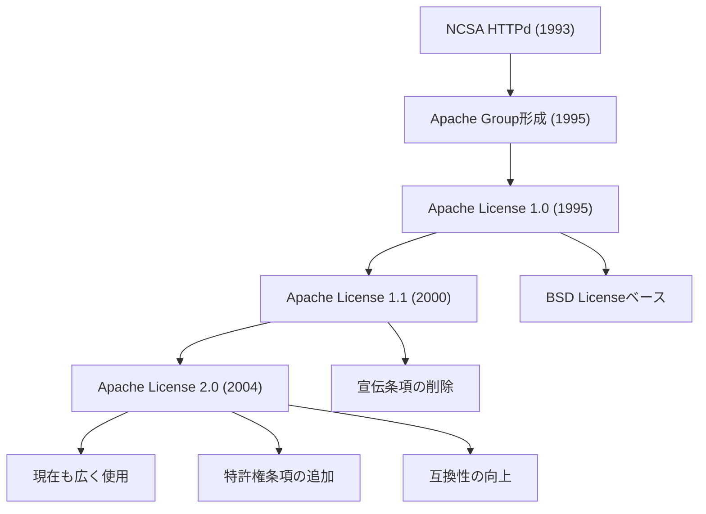
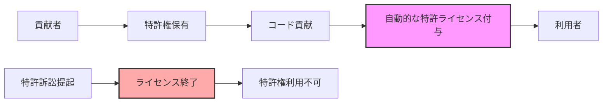
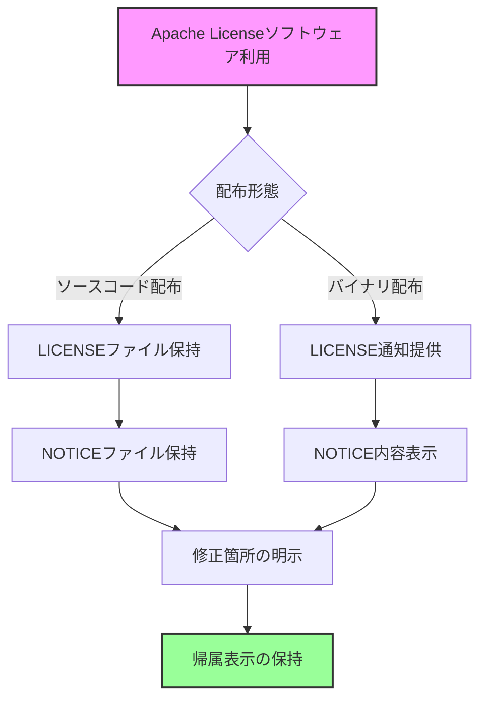
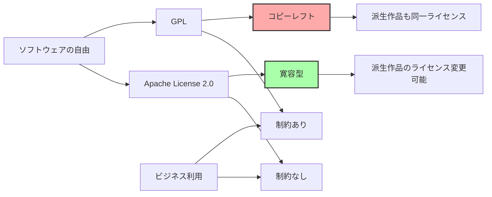
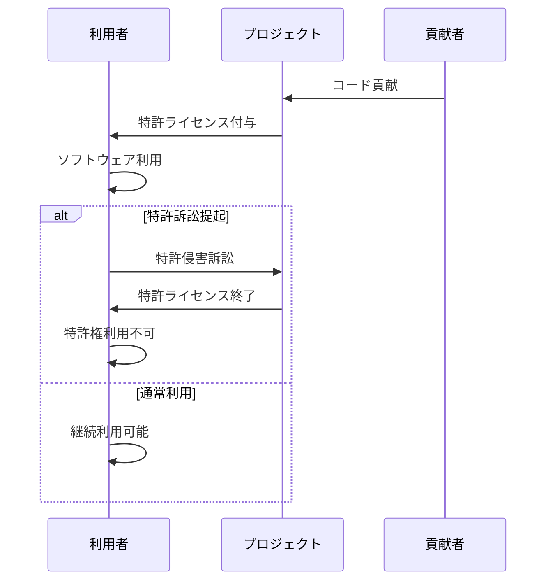
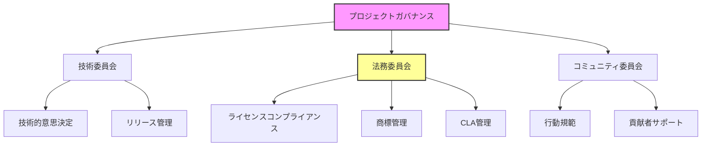

# Apache License

Apache Licenseは、Apache Software Foundation (ASF) によって策定されたオープンソースライセンスであり、現代のソフトウェア開発において最も広く採用されているライセンスの一つである。その特徴は、寛容な条件下でソフトウェアの利用、修正、配布を許可しながら、特許権に関する明確な規定を含むことにある。本稿では、Apache Licenseの歴史的背景から現在のバージョン2.0に至るまでの進化、ライセンスの詳細な条項、実践的な適用方法、そして他のオープンソースライセンスとの比較を通じて、このライセンスの本質的な理解を深めていく。

## 歴史的背景と進化

Apache Licenseの起源は、1995年にApache HTTPサーバープロジェクトが始まった時期にまで遡る。当初、このプロジェクトはNCSA HTTPdサーバーのコードベースを基にしており、そのライセンス条件を継承していた。しかし、プロジェクトが成長するにつれて、より明確で包括的なライセンスの必要性が認識されるようになった。



Apache License 1.0は、BSD Licenseに強く影響を受けた形で1995年に策定された。このバージョンは、著作権表示と免責事項の保持を要求する一方で、ソフトウェアの商用利用を含む幅広い用途での使用を許可していた。しかし、このバージョンには「宣伝条項」と呼ばれる、Apache Software Foundationの名前を宣伝材料に使用する際の制限が含まれていた¹。

2000年に発表されたApache License 1.1では、この宣伝条項が削除された。これは、複数のオープンソースプロジェクトが異なる宣伝条項を持つ場合に生じる「ライセンスの非互換性」問題を解決するための重要な変更であった。また、このバージョンでは、貢献者が提供するコードに関する規定がより明確化された。

2004年に発表されたApache License 2.0は、現在最も広く使用されているバージョンである。このバージョンの最も重要な改良点は、特許権に関する明示的な条項の追加である。これにより、貢献者が提供するコードに関連する特許権について、自動的にライセンスが付与されることが明確化された。また、GPL v3との互換性も考慮された設計となっている²。

## Apache License 2.0の詳細な条項分析

Apache License 2.0は、14のセクションで構成されており、それぞれが特定の側面を規定している。ここでは、各条項の詳細な分析を通じて、このライセンスの本質的な特徴を理解していく。

### 定義と基本概念

ライセンスの冒頭では、重要な用語の定義が行われている。「ライセンス」「法的実体」「あなた」「ソース」形式、「オブジェクト」形式、「作品」「派生作品」「貢献」「貢献者」などの用語が明確に定義されることで、ライセンス全体の解釈における曖昧さが排除されている。

特に重要なのは「派生作品」の定義である。Apache License 2.0では、派生作品を「作品に基づいて、またはそれから派生した、編集上の改訂、注釈、詳述、その他の修正を表す、全体として独創的な著作物を構成するような、ソースまたはオブジェクト形式のあらゆる作品」と定義している。この定義は、単なる機械的な変換や形式の変更は派生作品に含まれないことを明確にしている。

### 著作権ライセンスの付与

セクション2では、著作権ライセンスの付与について規定されている。各貢献者は、ソース形式またはオブジェクト形式で、作品および派生作品を複製、派生作品を作成、公に展示、公に実行、サブライセンス、および配布するための、永続的で、世界規模で、非独占的で、無料で、ロイヤリティフリーで、取消不能な著作権ライセンスを付与する。

この条項の重要な点は、ライセンスが「取消不能」であることだ。一度Apache License 2.0の下でコードが公開されると、後からライセンスを変更しても、既に配布されたバージョンに対するライセンスは有効のまま残る。これは、ソフトウェアを利用する側にとって重要な保証となる。

### 特許ライセンスの付与

セクション3は、Apache License 2.0の最も革新的な特徴の一つである特許ライセンスの付与について規定している。各貢献者は、作品を作成、使用、販売の申し出、販売、インポート、その他の方法で転送するための、永続的で、世界規模で、非独占的で、無料で、ロイヤリティフリーで、取消不能な特許ライセンスを付与する。



さらに重要なのは、特許訴訟に関する終了条項である。もし利用者が作品に関して特許侵害訴訟を提起した場合、その利用者に付与された特許ライセンスは自動的に終了する。これは「特許報復条項」と呼ばれ、特許訴訟の抑止効果を持つ。

### 再配布の条件

セクション4では、作品または派生作品を再配布する際の条件が規定されている。再配布する際には、以下の条件を満たす必要がある：

1. 作品または派生作品の他の受領者に、このライセンスのコピーを提供すること
2. 修正したファイルに、ファイルを変更したことを示す目立つ通知を付けること
3. 派生作品のソース形式において、元の作品のソース形式から保持したすべての著作権、特許、商標、および帰属の通知を保持すること
4. 作品に「NOTICE」テキストファイルが含まれている場合、配布する派生作品に含まれる読み取り可能な帰属通知内に、そのNOTICEファイルに含まれる帰属通知のコピーを含めること

これらの条件は、原著作者の権利を保護しつつ、派生作品の作成と配布を可能にするバランスの取れたアプローチを提供している。

### 貢献の提出

セクション5では、貢献の提出に関する規定が設けられている。明示的に別段の定めがない限り、作品に含めるために意図的に提出された貢献は、追加の条項や条件なしに、このライセンスの条項および条件に従うものとされる。

この規定により、プロジェクトへの貢献プロセスが簡素化される。貢献者は特別な貢献者ライセンス契約（CLA）に署名する必要がない場合でも、その貢献は自動的にApache License 2.0の下でライセンスされることになる。

### 商標の使用

セクション6では、商標の使用について明確な制限を設けている。このライセンスは、ライセンサーの商号、商標、サービスマーク、または製品名の使用許可を与えるものではない。ただし、作品の出所を記述し、NOTICEファイルの内容を複製するために必要な合理的かつ慣習的な使用は除外される。

この条項は、オープンソースソフトウェアと商標権の関係を明確にする重要な役割を果たしている。コードは自由に使用できるが、元のプロジェクトの名前やブランドを勝手に使用することはできない。

### 保証の否認と責任の制限

セクション7および8では、保証の否認と責任の制限について規定されている。作品は「現状のまま」提供され、明示的または黙示的を問わず、いかなる種類の保証も伴わない。また、貢献者は、直接的、間接的、偶発的、特別、懲罰的、または結果的な損害について責任を負わない。

これらの条項は、オープンソースソフトウェアの本質的な性質を反映している。無償で提供されるソフトウェアに対して、商用ソフトウェアと同等の保証や責任を求めることは現実的ではない。

## 実践的な適用方法

Apache License 2.0を実際のプロジェクトに適用する際には、いくつかの重要な手順を踏む必要がある。ここでは、新規プロジェクトでの適用と既存プロジェクトへの適用、そして第三者のApache Licenseソフトウェアを利用する場合の注意点について詳しく説明する。

### 新規プロジェクトへの適用

新規プロジェクトにApache License 2.0を適用する場合、以下の手順を実行する必要がある：

1. **LICENSEファイルの作成**: プロジェクトのルートディレクトリに「LICENSE」または「LICENSE.txt」という名前のファイルを作成し、Apache License 2.0の全文をコピーする³。

2. **NOTICEファイルの作成**: 同じくルートディレクトリに「NOTICE」または「NOTICE.txt」というファイルを作成する。このファイルには、プロジェクトの名前、著作権表示、および必要に応じて第三者ソフトウェアの帰属情報を記載する。

3. **ソースファイルへのヘッダー追加**: 各ソースファイルの冒頭に、Apache License 2.0のヘッダーを追加する。標準的なヘッダーは以下の形式となる：

```
Copyright [yyyy] [name of copyright owner]

Licensed under the Apache License, Version 2.0 (the "License");
you may not use this file except in compliance with the License.
You may obtain a copy of the License at

    http://www.apache.org/licenses/LICENSE-2.0

Unless required by applicable law or agreed to in writing, software
distributed under the License is distributed on an "AS IS" BASIS,
WITHOUT WARRANTIES OR CONDITIONS OF ANY KIND, either express or implied.
See the License for the specific language governing permissions and
limitations under the License.
```

### 既存プロジェクトへの移行

既存のプロジェクトをApache License 2.0に移行する場合は、より慎重なアプローチが必要である。まず、現在のライセンスがApache License 2.0への変更を許可しているかを確認する必要がある。また、すべての貢献者から同意を得る必要がある場合もある。

移行プロセスでは、以下の点に特に注意を払う必要がある：

1. **貢献者の同意**: 過去のすべての貢献者から、ライセンス変更への同意を得る。これは、特に多くの貢献者がいるプロジェクトでは困難な作業となる可能性がある。

2. **依存関係の確認**: プロジェクトが依存している第三者ライブラリのライセンスが、Apache License 2.0と互換性があることを確認する。

3. **段階的な移行**: 大規模なプロジェクトの場合、すべてのコードを一度に移行するのではなく、モジュール単位で段階的に移行することを検討する。

### 第三者ソフトウェアの利用

Apache License 2.0の下でライセンスされたソフトウェアを利用する場合、以下の義務を果たす必要がある：



1. **ライセンス通知の保持**: 配布する際には、必ずApache License 2.0の全文を含める必要がある。

2. **帰属表示の保持**: 元のソフトウェアに含まれていた著作権表示、特許表示、商標表示、および帰属表示をすべて保持する。

3. **NOTICEファイルの内容**: 元のソフトウェアにNOTICEファイルが含まれている場合、その内容を適切な場所（ドキュメント、UIのAbout画面など）に表示する必要がある。

4. **修正の明示**: ソフトウェアを修正した場合は、修正したファイルに修正したことを示す通知を追加する。

## 他のオープンソースライセンスとの比較

Apache License 2.0の特徴をより深く理解するために、他の主要なオープンソースライセンスとの比較を行う。ここでは、MIT License、BSD License、GPL、およびMPLとの比較を通じて、それぞれのライセンスの特徴と適用場面を明確にする。

### MIT Licenseとの比較

MIT Licenseは、最もシンプルで寛容なオープンソースライセンスの一つである。Apache License 2.0と比較すると、以下の違いがある：

1. **長さと複雑さ**: MIT Licenseは非常に短く（約20行）、理解しやすい。一方、Apache License 2.0は14セクションにわたる詳細な規定を含む。

2. **特許権の扱い**: MIT Licenseは特許権について明示的に言及していない。対して、Apache License 2.0は明確な特許ライセンス付与条項を含む。

3. **貢献者の保護**: Apache License 2.0は、貢献者をより強力に保護する条項（特に特許報復条項）を含む。

4. **帰属要件**: 両ライセンスとも著作権表示の保持を要求するが、Apache License 2.0はより詳細な帰属要件を持つ。

### BSD Licenseとの比較

BSD License（特に2条項および3条項BSD）は、Apache Licenseの前身的な存在である。主な違いは：

1. **特許条項**: BSD Licenseは特許権について言及していない。

2. **貢献の扱い**: Apache License 2.0は、貢献の提出に関する明確な規定を持つ。

3. **互換性**: Apache License 2.0は、より多くのライセンスとの互換性を考慮して設計されている。

### GPLとの比較

GNU General Public License (GPL)は、コピーレフト型ライセンスの代表例であり、Apache License 2.0とは根本的に異なる哲学を持つ：



1. **コピーレフト**: GPLは強力なコピーレフト条項を持ち、派生作品も同じライセンスで配布することを要求する。Apache License 2.0にはこのような要求はない。

2. **商用利用**: Apache License 2.0は、プロプライエタリソフトウェアへの組み込みを許可する。GPLではこれは制限される。

3. **特許条項**: 両ライセンスとも特許に関する条項を持つが、アプローチが異なる。GPL v3は、より広範な特許保護を提供する。

4. **互換性**: Apache License 2.0はGPL v3と一方向の互換性がある（Apache → GPLは可能だが、逆は不可）。

### Mozilla Public License (MPL)との比較

MPLは、ファイル単位のコピーレフトを採用する中間的なアプローチを取る：

1. **コピーレフトの範囲**: MPLはファイル単位でコピーレフトを適用する。Apache License 2.0はコピーレフト条項を持たない。

2. **特許条項**: 両ライセンスとも明確な特許条項を持つが、MPLの特許条項はより複雑である。

3. **複雑さ**: MPLはApache License 2.0よりもさらに複雑で、理解が困難な場合がある。

## 実装上の考慮事項とベストプラクティス

Apache License 2.0を採用したプロジェクトを運営する際には、いくつかの重要な実装上の考慮事項がある。これらは、ライセンスの要件を満たしつつ、プロジェクトの健全な発展を促進するためのものである。

### 貢献者ライセンス契約（CLA）の検討

Apache License 2.0のセクション5では、貢献は自動的にこのライセンスの下で提出されると規定されているが、多くの大規模プロジェクトでは追加的にCLAを要求している。CLAを採用する理由には以下がある：

1. **法的明確性**: 貢献者が実際に貢献する権利を持っていることを確認する。

2. **特許保護の強化**: より明確な特許権の付与を得る。

3. **将来のライセンス変更**: プロジェクトのライセンスを将来変更する可能性を保持する。

ただし、CLAの導入は貢献の障壁となる可能性もあるため、プロジェクトの規模と性質に応じて慎重に検討する必要がある。

### 依存関係管理

Apache License 2.0プロジェクトで他のライブラリを使用する際の依存関係管理は重要である：

1. **ライセンスの互換性確認**: 使用するすべての依存関係のライセンスがApache License 2.0と互換性があることを確認する。

2. **NOTICE文書の更新**: 第三者ライブラリの帰属情報をNOTICEファイルに適切に記載する。

3. **自動化ツールの活用**: ライセンススキャンツールを使用して、依存関係のライセンスを自動的にチェックする。

### 商標ポリシーの策定

Apache License 2.0は商標の使用を許可しないため、プロジェクトは別途商標ポリシーを策定する必要がある：

1. **商標の登録**: 重要なプロジェクト名やロゴを商標として登録することを検討する。

2. **使用ガイドライン**: コミュニティメンバーや第三者がプロジェクトの名前やロゴをどのように使用できるかを明確にする。

3. **承認プロセス**: 商標使用の承認プロセスを確立する。

## 特許条項の詳細な分析

Apache License 2.0の特許条項は、このライセンスの最も重要な特徴の一つである。ここでは、特許ライセンスの付与と終了条件について、より詳細に分析する。

### 特許ライセンスの範囲

セクション3で付与される特許ライセンスは、以下の範囲に限定される：

1. **貢献者の特許のみ**: ライセンスは、貢献者が所有または管理する特許請求項にのみ適用される。

2. **貢献によって侵害される範囲**: 貢献単独で、または貢献と作品の組み合わせによって侵害される特許請求項のみが対象となる。

3. **必然的侵害**: ライセンスは「必然的に侵害される」特許請求項に限定される。これは、貢献を使用する際に避けることができない侵害を意味する。

### 特許報復条項の仕組み

特許報復条項は、以下のように機能する：



この仕組みにより、特許訴訟のリスクが大幅に軽減される。利用者は、プロジェクトに対して特許訴訟を提起すると、そのプロジェクトから得ていた特許ライセンスを失うリスクを負うことになる。

### 実務上の影響

特許条項は、以下のような実務上の影響を持つ：

1. **企業の採用促進**: 明確な特許保護により、企業がApache Licenseプロジェクトを採用しやすくなる。

2. **貢献のリスク評価**: 企業は、貢献する前に自社の特許ポートフォリオを評価する必要がある。

3. **防御的特許プール**: 一部のプロジェクトでは、メンバー間で防御的な特許プールを形成することがある。

## 国際的な視点とローカライゼーション

Apache License 2.0は英語で書かれているが、世界中で使用されている。国際的な文脈での適用には、いくつかの考慮事項がある。

### 法域による解釈の違い

異なる法域では、ライセンス条項の解釈が異なる可能性がある：

1. **著作権法の違い**: 著作者人格権の扱いなど、国によって著作権法の内容が異なる。

2. **特許法の違い**: ソフトウェア特許の有効性は、国によって大きく異なる。

3. **契約法の違い**: ライセンスが契約として解釈される方法も、法域によって異なる。

### 翻訳の問題

Apache License 2.0の公式翻訳は存在しないが、非公式な翻訳は多数存在する。翻訳に関する注意点：

1. **法的効力**: 英語版のみが法的効力を持つことを明確にする。

2. **翻訳の品質**: 法律用語の正確な翻訳は困難であり、専門家によるレビューが必要。

3. **更新の追跡**: ライセンスの更新や解釈の変更を翻訳に反映する必要がある。

## コンプライアンスとガバナンス

Apache License 2.0を採用したプロジェクトにおけるコンプライアンスとガバナンスは、プロジェクトの持続可能性にとって重要である。

### コンプライアンスプログラムの構築

効果的なコンプライアンスプログラムには以下の要素が含まれる：

1. **ポリシーの策定**: ライセンスコンプライアンスに関する明確なポリシーを策定する。

2. **トレーニング**: 開発者やコントリビューターに対するライセンス教育を実施する。

3. **監査プロセス**: 定期的なライセンス監査を実施し、コンプライアンスを確認する。

4. **問題対応手順**: コンプライアンス違反が発見された場合の対応手順を確立する。

### ガバナンス構造

大規模なApache Licenseプロジェクトでは、以下のようなガバナンス構造を検討する：



### リスク管理

Apache Licenseプロジェクトにおけるリスク管理には以下が含まれる：

1. **法的リスク**: ライセンス違反、特許侵害、商標侵害などのリスクを評価し、対策を講じる。

2. **技術的リスク**: セキュリティ脆弱性やコード品質の問題に対処する。

3. **コミュニティリスク**: 主要貢献者の離脱やコミュニティの分裂などのリスクを管理する。

4. **財務リスク**: プロジェクトの持続可能性を確保するための資金調達戦略を策定する。

## トレードオフと戦略的考慮事項

Apache License 2.0の採用には、いくつかのトレードオフが存在する。プロジェクトの目的と状況に応じて、これらを慎重に評価する必要がある。

### ビジネスモデルとの整合性

Apache License 2.0は、さまざまなビジネスモデルと互換性があるが、それぞれに考慮事項がある：

1. **デュアルライセンス**: Apache Licenseプロジェクトをデュアルライセンスモデルで提供することは困難である。すべての貢献者から同意を得る必要があるためだ。

2. **サポートとサービス**: オープンソースソフトウェアの周辺でサポートやコンサルティングサービスを提供するモデルとは良好な互換性がある。

3. **SaaS提供**: Apache LicenseはSaaSでの利用に制限を設けないため、SaaSビジネスモデルとの相性が良い。

4. **プロプライエタリ拡張**: 基本機能をApache Licenseで提供し、追加機能をプロプライエタリライセンスで提供することが可能。

### コミュニティ構築への影響

ライセンス選択は、コミュニティの性質に大きな影響を与える：

1. **企業の参加**: Apache License 2.0は企業にとって受け入れやすく、企業からの貢献を促進する。

2. **個人開発者**: 一部の個人開発者は、よりコピーレフト的なライセンスを好む場合がある。

3. **フォークの可能性**: 寛容なライセンスは、プロジェクトのフォークを容易にする。これは良い面と悪い面の両方がある。

### 長期的な持続可能性

プロジェクトの長期的な持続可能性を考える際の要因：

1. **ライセンスの安定性**: Apache License 2.0は成熟したライセンスであり、将来的な大きな変更は予想されない。

2. **エコシステムの発展**: 寛容なライセンスは、周辺エコシステムの発展を促進する。

3. **標準化への道**: 多くの標準化団体は、Apache License 2.0を受け入れやすい。

## 実装例と事例研究

Apache License 2.0は、多くの著名なプロジェクトで採用されている。これらの事例から、実践的な教訓を得ることができる。

### Apache Software Foundationのプロジェクト

ASF自身が管理するプロジェクトは、Apache License 2.0の模範的な実装例である：

1. **統一的なガバナンス**: すべてのASFプロジェクトは、Apache Wayと呼ばれる共通の原則に従う。

2. **CLAの使用**: ASFは、個人および企業向けのCLAを要求する。

3. **商標管理**: ASFは、すべてのプロジェクトの商標を中央で管理する。

4. **インキュベーションプロセス**: 新しいプロジェクトは、成熟度を確保するためのインキュベーションプロセスを経る。

### Kubernetesプロジェクト

Kubernetesは、Apache License 2.0を採用した大規模プロジェクトの例である：

1. **CNCFの下での運営**: Cloud Native Computing Foundationの下で、独自のガバナンス構造を持つ。

2. **大規模なコントリビューター基盤**: 数千人のコントリビューターを持ち、複雑な貢献プロセスを管理。

3. **エコシステムの発展**: 周辺プロジェクトの多くもApache License 2.0を採用し、一貫性のあるエコシステムを形成。

### Android Open Source Project

GoogleのAndroid OSは、Apache License 2.0の商業的成功例である：

1. **デバイスメーカーとの協力**: ライセンスの寛容性により、多くのデバイスメーカーが参加。

2. **プロプライエタリ拡張**: Google Play ServicesなどのプロプライエタリコンポーネントとOSSの組み合わせ。

3. **特許プール**: Open Handset Allianceを通じた防御的特許プールの形成。

## 将来の展望と進化

Apache License 2.0は2004年に発表されて以来、大きな変更は加えられていないが、ソフトウェア開発の環境は大きく変化している。将来の課題と可能性について考察する。

### 新たな技術トレンドへの対応

現在のApache License 2.0が直面する新たな課題：

1. **AI/機械学習モデル**: 訓練されたモデルやデータセットへのライセンス適用の曖昧さ。

2. **ブロックチェーン**: 分散型システムにおけるライセンス執行の困難さ。

3. **コンテナ化**: コンテナイメージに含まれる複数のコンポーネントのライセンス管理。

4. **マイクロサービス**: ネットワーク越しの利用におけるライセンス条件の適用。

### 法的環境の変化

将来のライセンス改訂で考慮される可能性のある法的変化：

1. **データ保護規制**: GDPRなどのデータ保護規制との整合性。

2. **サイバーセキュリティ法**: セキュリティ脆弱性の開示要件との調整。

3. **輸出規制**: 技術輸出規制の強化への対応。

4. **AI規制**: 人工知能の利用に関する新たな規制への適応。

### コミュニティの進化

オープンソースコミュニティの進化がライセンスに与える影響：

1. **資金調達モデル**: クラウドファンディングや暗号通貨による新たな資金調達方法。

2. **分散型ガバナンス**: DAOなどの新たなガバナンス構造との整合性。

3. **グローバル化**: より多様な文化的・法的背景を持つ貢献者への対応。

4. **自動化**: ボットやAIによる貢献の扱い。

---

¹ Apache Software Foundation. "Apache License, Version 1.0" (1995).
² Apache Software Foundation. "Apache License, Version 2.0" (2004). https://www.apache.org/licenses/LICENSE-2.0
³ Apache Software Foundation. "Applying the Apache License, Version 2.0" (2023). https://www.apache.org/licenses/LICENSE-2.0.html#apply