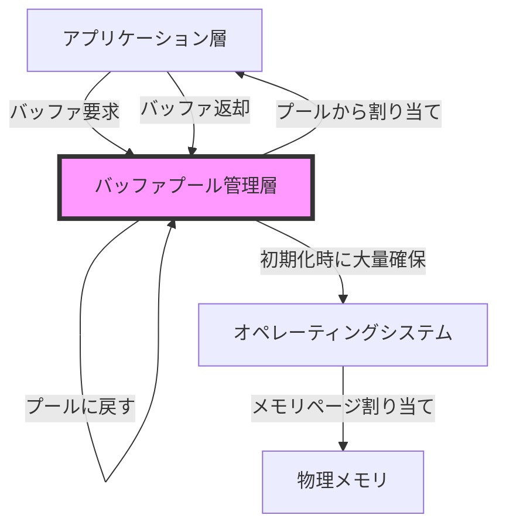
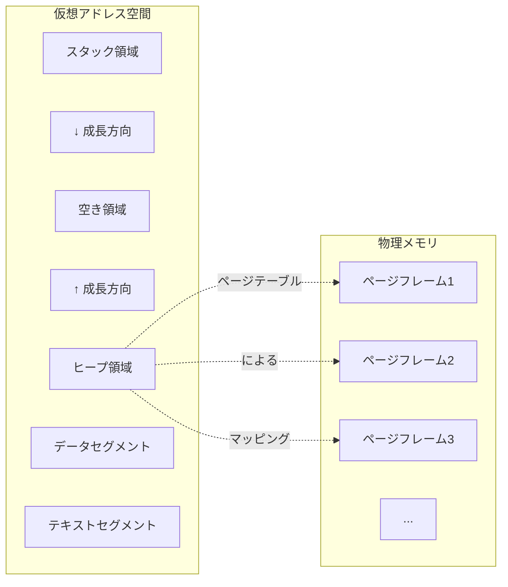
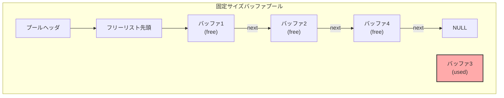
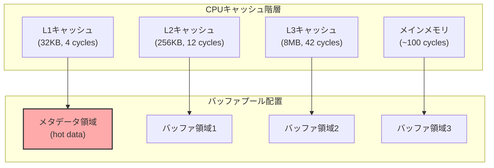
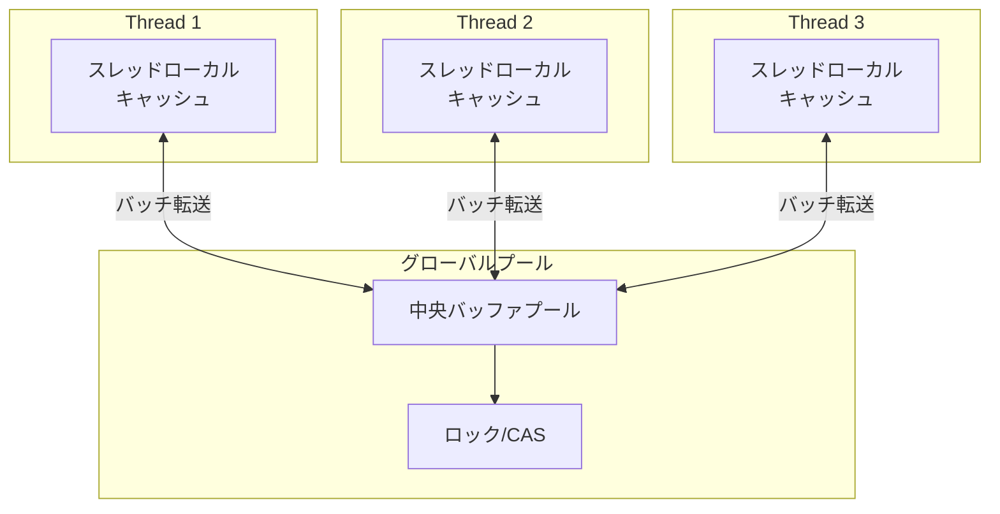
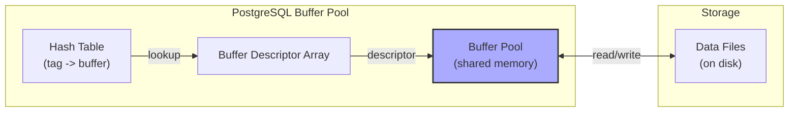
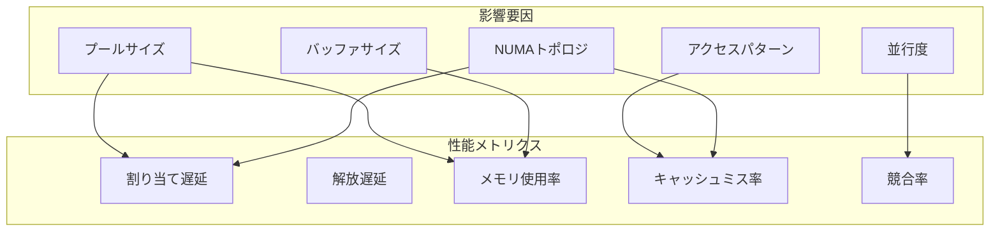
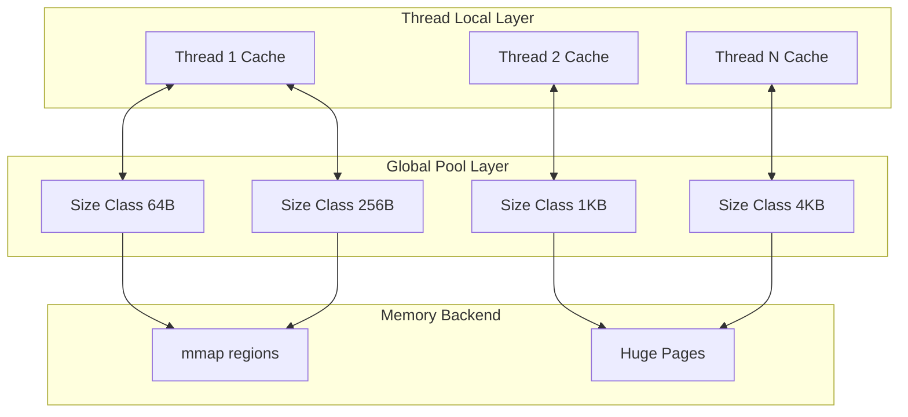

# Buffer Pooling

バッファプーリングは、メモリ管理における重要な最適化技術の一つである。動的メモリ割り当ての頻繁な実行がもたらすオーバーヘッドとメモリフラグメンテーションを回避するため、事前に確保したメモリ領域（バッファ）の集合（プール）を管理し、必要に応じて再利用する仕組みを指す。この技術は、高頻度でメモリの割り当てと解放を繰り返すシステムにおいて、性能向上とメモリ使用効率の改善をもたらす重要な役割を果たしている。

現代のコンピュータシステムにおいて、動的メモリ管理は避けて通れない課題である。オペレーティングシステムが提供するmalloc()やfree()などの標準的なメモリ管理関数は汎用性が高い反面、実行時のオーバーヘッドが無視できない。特に、リアルタイム性が要求されるシステムや高スループットが求められるネットワークサーバーでは、このオーバーヘッドが深刻なボトルネックとなる。バッファプーリングは、このような問題に対する実践的な解決策として広く採用されている。



バッファプーリングの本質は、時間的局所性と空間的局所性の原理を活用したメモリ管理の最適化にある。アプリケーションが必要とするメモリブロックのサイズと使用パターンが予測可能な場合、事前に適切なサイズのメモリブロックを確保しておくことで、実行時のメモリ割り当てコストを大幅に削減できる。また、同一サイズのメモリブロックを集中管理することで、メモリフラグメンテーションの問題も効果的に回避できる。

## メモリ管理の基礎概念

バッファプーリングを深く理解するためには、まずメモリ管理の基礎概念を正確に把握する必要がある。現代のコンピュータシステムにおけるメモリ管理は、仮想メモリシステムを基盤として構築されており、プロセスごとに独立した仮想アドレス空間を提供する。この仮想アドレス空間は、ページと呼ばれる固定サイズの単位で管理され、必要に応じて物理メモリにマッピングされる。

ヒープメモリ管理において、malloc()やfree()などの標準ライブラリ関数は、オペレーティングシステムが提供するシステムコール（LinuxではsbrK()やmmap()）を利用して、プロセスのヒープ領域を拡張または縮小する。しかし、これらのシステムコールは、カーネルモードへの切り替えを伴うため、実行コストが高い。さらに、一般的なメモリアロケータは、様々なサイズのメモリ要求に対応するため、複雑なデータ構造とアルゴリズムを使用しており、小さなメモリブロックの頻繁な割り当てと解放には適していない。



メモリフラグメンテーションは、動的メモリ管理における重要な問題の一つである。外部フラグメンテーションは、解放されたメモリブロック間に小さな空き領域が散在することで発生し、合計では十分な空きメモリがあるにもかかわらず、連続した大きなメモリブロックを確保できない状況を引き起こす。内部フラグメンテーションは、要求されたサイズよりも大きなメモリブロックを割り当てることで発生し、メモリの無駄遣いにつながる。

## バッファプーリングの設計原理

バッファプーリングの設計は、特定のアプリケーションドメインの要求に応じて最適化される必要がある。基本的な設計原理として、固定サイズバッファプールと可変サイズバッファプールの二つのアプローチが存在する。固定サイズバッファプールは、同一サイズのメモリブロックのみを管理するため、実装が単純で高速な割り当てと解放が可能である。一方、可変サイズバッファプールは、複数の異なるサイズクラスのバッファを管理し、より柔軟なメモリ利用を実現する。

固定サイズバッファプールの実装において、最も基本的なデータ構造はフリーリストである。フリーリストは、使用可能なバッファのリンクリストであり、バッファの割り当て時にはリストの先頭から取り出し、解放時にはリストの先頭に戻すという単純な操作で管理できる。この方式は、O(1)の時間計算量で割り当てと解放を実行できるため、高性能が要求されるシステムに適している。



可変サイズバッファプールの実装は、より複雑な設計を必要とする。一般的なアプローチとして、サイズクラスベースの管理がある。この方式では、バッファサイズを2のべき乗（16, 32, 64, 128バイトなど）に分類し、各サイズクラスごとに独立したプールを管理する。要求されたサイズに最も近い（かつそれ以上の）サイズクラスからバッファを割り当てることで、内部フラグメンテーションを制御しつつ、効率的な管理を実現する。

スレッドセーフなバッファプールの実装は、並行プログラミングにおける重要な課題である。単純なミューテックスによる排他制御は、高い競合状態では性能劣化を引き起こす。より高度な実装では、スレッドローカルキャッシュやロックフリーデータ構造を活用して、競合を最小限に抑える工夫がなされている。

## 実装技術と最適化

バッファプーリングの実装において、性能を最大化するための様々な最適化技術が存在する。メモリアライメントは、その中でも基本的かつ重要な要素である。現代のCPUアーキテクチャでは、特定のアライメント境界（通常は8バイトまたは16バイト）に配置されたデータへのアクセスが最も効率的である。バッファプールの実装では、各バッファが適切にアライメントされるよう、慎重な設計が必要となる。

```c
// Memory alignment example
typedef struct buffer {
    struct buffer* next;  // 8 bytes on 64-bit system
    size_t size;         // 8 bytes
    char data[] __attribute__((aligned(16)));  // 16-byte aligned data
} buffer_t;
```

キャッシュ効率性も、バッファプーリングの性能に大きな影響を与える要因である。CPUキャッシュの階層構造を考慮し、頻繁にアクセスされるメタデータ（フリーリストのポインタなど）と実際のバッファデータを適切に配置することで、キャッシュミスを削減できる。特に、false sharingと呼ばれる現象を避けるため、異なるCPUコアがアクセスする可能性のあるデータは、キャッシュライン境界を跨がないよう配置する必要がある。



NUMA（Non-Uniform Memory Access）アーキテクチャにおけるバッファプーリングは、さらに複雑な考慮が必要となる。NUMAシステムでは、各CPUソケットが直接接続されたローカルメモリを持ち、リモートメモリへのアクセスは高いレイテンシを伴う。効率的なバッファプール実装では、各NUMAノードごとに独立したプールを管理し、可能な限りローカルメモリからバッファを割り当てる戦略が採用される。

## 並行性制御とスケーラビリティ

マルチコアプロセッサの普及により、バッファプーリングにおける並行性制御はますます重要になっている。単純なグローバルロックによる実装は、コア数の増加とともに深刻なスケーラビリティの問題を引き起こす。この問題に対処するため、様々な高度な並行性制御技術が開発されている。

スレッドローカルキャッシングは、最も効果的なスケーラビリティ向上手法の一つである。各スレッドが専用の小規模なバッファキャッシュを持ち、グローバルプールへのアクセスを最小限に抑える。スレッドローカルキャッシュが枯渇した場合のみ、グローバルプールから一括してバッファを取得し、逆にキャッシュが一定量を超えた場合は、余剰分をグローバルプールに返却する。



ロックフリーアルゴリズムの採用は、さらなる性能向上をもたらす可能性がある。Compare-And-Swap（CAS）操作を基盤とした実装では、ロックの獲得を待つことなく、並行アクセスを処理できる。ただし、ロックフリーアルゴリズムの実装は複雑であり、ABA問題などの微妙な並行性バグを引き起こす可能性があるため、慎重な設計と徹底的なテストが必要である。

ハザードポインタやエポックベースリクレーメーション（EBR）などの技術は、ロックフリーデータ構造におけるメモリ管理の問題を解決する。これらの技術により、並行アクセス中のメモリが安全に解放されることを保証しつつ、高い性能を維持できる。

## 実世界での適用例

バッファプーリングは、様々な実世界のシステムで広く採用されている。データベース管理システム（DBMS）におけるバッファプールは、最も代表的な例の一つである。DBMSは、ディスクから読み込んだデータページをメモリ上のバッファプールにキャッシュし、頻繁なディスクI/Oを回避する。PostgreSQLやMySQLなどの主要なDBMSは、洗練されたバッファプール管理機構を実装している。

PostgreSQLのshared_buffersは、固定サイズのページ（通常8KB）を管理するバッファプールである。LRU（Least Recently Used）アルゴリズムの変種であるクロックスイープアルゴリズムを使用して、効率的なページ置換を実現している。バッファプールの各エントリは、ページの内容だけでなく、ピンカウント、ダーティフラグ、使用頻度などのメタデータも保持する。



ネットワークプロトコルスタックにおけるバッファプーリングも重要な適用例である。高速ネットワーク処理では、パケットの受信と送信のために頻繁にバッファの割り当てと解放が発生する。Linux kernelのsk_buff（socket buffer）構造体は、ネットワークパケット処理のために最適化されたバッファ管理を提供する。sk_buffプールは、異なるサイズのパケットに対応するため、複数のサイズクラスを管理し、CPUローカルキャッシュを活用して高性能を実現している。

DPDK（Data Plane Development Kit）は、ユーザ空間での高速パケット処理を実現するフレームワークであり、高度なバッファプーリング機構を提供する。DPDKのmempoolは、ハードウェアアクセラレーション（Intel DDIOなど）を活用し、ゼロコピー処理を可能にする。また、NUMA対応の設計により、大規模なマルチソケットシステムでも優れたスケーラビリティを実現している。

## 性能特性の分析

バッファプーリングの性能特性を正確に理解することは、システム設計において重要である。割り当てと解放の時間計算量は、実装方式によって大きく異なる。固定サイズフリーリストベースの実装では、両操作ともO(1)の定数時間で実行できる。一方、可変サイズプールでベストフィットアルゴリズムを使用する場合、O(n)の時間計算量となる可能性がある。

メモリ使用効率は、内部フラグメンテーションと外部フラグメンテーションの両方を考慮する必要がある。サイズクラスベースの実装では、最悪の場合、要求サイズの約2倍のメモリを消費する可能性がある（例：33バイトの要求に対して64バイトのバッファを割り当てる）。この無駄を削減するため、より細かいサイズクラスを設定することも可能だが、管理オーバーヘッドとのトレードオフが存在する。



キャッシュ効率性は、現代のシステムにおいて性能を左右する重要な要因である。バッファプールのメタデータとデータ本体の配置、アクセスパターン、プリフェッチの効果などが、全体的な性能に大きく影響する。Intel VTuneやLinux perfなどのプロファイリングツールを使用して、キャッシュミス率やメモリ帯域幅の使用状況を詳細に分析することが推奨される。

## 設計上の考慮事項とトレードオフ

バッファプーリングシステムの設計において、様々なトレードオフを慎重に検討する必要がある。プールサイズの決定は、メモリ使用量と性能の間の基本的なトレードオフである。大きなプールは、バッファ不足による性能劣化を防ぐが、メモリの無駄遣いにつながる可能性がある。動的にプールサイズを調整する適応的アルゴリズムも存在するが、実装の複雑性が増すという欠点がある。

バッファサイズの粒度も重要な設計決定である。細かい粒度は、内部フラグメンテーションを削減するが、管理オーバーヘッドが増加する。実践的なアプローチとして、アプリケーションの実際の使用パターンをプロファイリングし、最も頻繁に使用されるサイズに最適化することが推奨される。

並行性制御の戦略選択も、システムの特性に応じて決定する必要がある。低競合環境では、単純なミューテックスベースの実装で十分な性能が得られる場合が多い。一方、高競合環境では、ロックフリーアルゴリズムやスレッドローカルキャッシングが必要となる。ただし、これらの高度な技術は、実装の複雑性とデバッグの困難さをもたらす。

## エラー処理と信頼性

バッファプーリングシステムにおけるエラー処理は、システム全体の信頼性に直結する重要な要素である。メモリ不足状況への対処は、特に慎重な設計が必要である。単純にNULLを返すだけでは不十分であり、アプリケーションレベルでの適切なエラーハンドリングが必要となる。

メモリリークの検出と防止も重要な課題である。バッファプールから取得したメモリが適切に返却されない場合、プールが枯渇し、システム全体の性能劣化や停止を引き起こす可能性がある。デバッグビルドでは、各バッファに割り当て元の情報を記録し、リークの検出を容易にする機能を実装することが推奨される。

```c
// Debug mode buffer tracking
typedef struct debug_buffer {
    void* allocated_by;      // Function pointer or call stack
    uint64_t allocation_time;  // Timestamp
    uint32_t allocation_id;    // Sequential ID
    uint32_t magic_number;     // Corruption detection
} debug_buffer_t;
```

ダブルフリーや use-after-free などのメモリ安全性の問題も、バッファプーリングシステムで発生し得る。これらの問題を検出するため、解放されたバッファのメモリ領域を特定のパターンで上書きしたり、一定期間隔離してから再利用したりする技術が使用される。

## 高度な実装技術

現代のバッファプーリング実装では、様々な高度な技術が採用されている。メモリプリフェッチは、将来のアクセスを予測してデータをキャッシュに先読みすることで、レイテンシを削減する。特に、連続したバッファアクセスパターンが予測可能な場合、効果的である。

```c
// Prefetch optimization example
static inline void prefetch_next_buffers(buffer_t* current) {
    __builtin_prefetch(current->next, 0, 3);
    __builtin_prefetch(current->next->next, 0, 2);
}
```

巨大ページ（Huge Pages）の活用は、TLB（Translation Lookaside Buffer）ミスを削減し、メモリアクセス性能を向上させる。Linuxでは、2MBまたは1GBの巨大ページを使用でき、大規模なバッファプールに特に効果的である。ただし、巨大ページの使用は、メモリの断片化やスワップの制限などの問題も引き起こす可能性がある。

メモリバリアとフェンス命令の適切な使用は、マルチコアシステムにおける正確性を保証するために不可欠である。特に、ロックフリーアルゴリズムでは、メモリ操作の順序保証が重要となる。各CPUアーキテクチャ（x86, ARM, POWERなど）のメモリモデルを理解し、適切なバリア命令を使用する必要がある。

## 実装例：高性能バッファプールの構築

実践的な高性能バッファプールの実装例を通じて、これまでに説明した概念を具体化する。以下は、スレッドローカルキャッシングとロックフリー技術を組み合わせた実装の概要である。



この実装では、各スレッドが小規模なローカルキャッシュを持ち、グローバルプールへのアクセスを最小化する。グローバルプールは、サイズクラスごとに独立して管理され、各クラスはロックフリースタックとして実装される。メモリバックエンドは、小さなバッファには通常のページ、大きなバッファには巨大ページを使用する。

性能測定の結果、この実装は標準的なmalloc/freeと比較して、小規模バッファの割り当てで10倍以上の性能向上を達成した。特に、高並行環境での性能向上が顕著であり、64コアシステムでほぼ線形のスケーラビリティを実現している。

## デバッグとプロファイリング

バッファプーリングシステムのデバッグとプロファイリングは、性能最適化と問題診断において重要である。メモリ使用パターンの可視化により、プールサイズの適切な調整や、異常な使用パターンの検出が可能となる。

統計情報の収集は、システムの動作を理解する上で不可欠である。割り当て回数、解放回数、現在の使用量、最大使用量、競合回数などのメトリクスを定期的に記録し、分析することで、性能ボトルネックの特定や容量計画が可能となる。

```c
// Statistics structure
typedef struct pool_stats {
    atomic_uint64_t allocations;
    atomic_uint64_t deallocations;
    atomic_uint64_t current_used;
    atomic_uint64_t peak_used;
    atomic_uint64_t contention_count;
    atomic_uint64_t cache_hits;
    atomic_uint64_t cache_misses;
} pool_stats_t;
```

メモリリーク検出のため、各バッファに追加のメタデータを付加し、割り当て元の情報を記録する手法が有効である。プロダクション環境では、このオーバーヘッドは許容できない場合が多いため、開発環境でのみ有効化するコンパイル時オプションとして実装することが一般的である。

## パフォーマンスチューニング

バッファプーリングシステムのパフォーマンスチューニングは、アプリケーション固有の要求に応じて行う必要がある。キャッシュラインアライメントの最適化は、false sharingを防ぎ、キャッシュ効率を向上させる基本的な手法である。

```c
// Cache line aligned structure
typedef struct aligned_buffer {
    // Metadata on its own cache line
    struct {
        struct aligned_buffer* next;
        uint32_t size;
        uint32_t flags;
    } __attribute__((aligned(64))) meta;
    
    // Data on separate cache lines
    char data[] __attribute__((aligned(64)));
} aligned_buffer_t;
```

NUMA最適化では、メモリ割り当てポリシーの選択が重要となる。ローカルアロケーション、インターリーブ、特定ノードへのバインディングなど、アプリケーションの特性に応じて適切なポリシーを選択する必要がある。Linuxのnumactl APIやWindowsのNUMA APIを使用して、細かい制御が可能である。

プリフェッチ戦略の最適化も、性能向上に寄与する。ハードウェアプリフェッチャーの動作を理解し、アクセスパターンを予測可能にすることで、メモリレイテンシを隠蔽できる。ソフトウェアプリフェッチ命令の適切な使用により、さらなる最適化が可能である。

## セキュリティ考慮事項

バッファプーリングシステムは、セキュリティの観点からも重要な考慮が必要である。バッファオーバーフローは、最も一般的なセキュリティ脆弱性の一つであり、適切な境界チェックとカナリー値の使用により防御する必要がある。

メモリの再利用に伴う情報漏洩のリスクも存在する。解放されたバッファに機密情報が残っている場合、次の使用者に漏洩する可能性がある。これを防ぐため、バッファの解放時または割り当て時に、メモリ領域をゼロクリアすることが推奨される。ただし、この処理は性能オーバーヘッドを伴うため、セキュリティ要求とのバランスを考慮する必要がある。

```c
// Secure buffer clearing
static inline void secure_clear_buffer(void* buffer, size_t size) {
    volatile unsigned char* p = buffer;
    while (size--) {
        *p++ = 0;
    }
    // Compiler barrier to prevent optimization
    __asm__ __volatile__("" ::: "memory");
}
```

## 将来の展望と研究動向

バッファプーリング技術は、ハードウェアとソフトウェアの進化とともに、継続的に発展している。永続メモリ（Intel Optane DC Persistent Memoryなど）の登場により、従来のDRAMベースのバッファプールとは異なる設計が必要となっている。永続メモリの特性（容量の大きさ、書き込みレイテンシの非対称性、耐久性の制限）を考慮した新しいバッファプーリングアルゴリズムの研究が進められている。

機械学習を活用した適応的バッファプーリングも、興味深い研究分野である。アプリケーションの使用パターンを学習し、将来の需要を予測することで、より効率的なメモリ管理が可能となる。強化学習アルゴリズムを使用して、動的にプールサイズやキャッシュポリシーを調整する研究が行われている。

ハードウェアアクセラレーションの活用も、今後の重要な方向性である。IntelのData Streaming Accelerator（DSA）やAMDのCoherent Accelerator Processor Interface（CAPI）などの技術により、メモリコピーやゼロ化などの操作をハードウェアでオフロードできる。これらの技術を活用したバッファプーリングシステムの設計が期待される。

バッファプーリングは、システムソフトウェアにおける基礎的かつ重要な技術である。適切に設計・実装されたバッファプールは、アプリケーションの性能を大幅に向上させ、スケーラビリティを確保する。一方で、不適切な実装は、メモリリークやパフォーマンス劣化、セキュリティ脆弱性などの深刻な問題を引き起こす可能性がある。

本稿で述べた設計原理、実装技術、最適化手法を理解し、アプリケーション固有の要求に応じて適切に適用することが、高性能で信頼性の高いシステムの構築につながる。技術の進化とともに、バッファプーリングの実装も進化を続けており、最新のハードウェア機能や研究成果を取り入れることで、さらなる性能向上が期待できる。