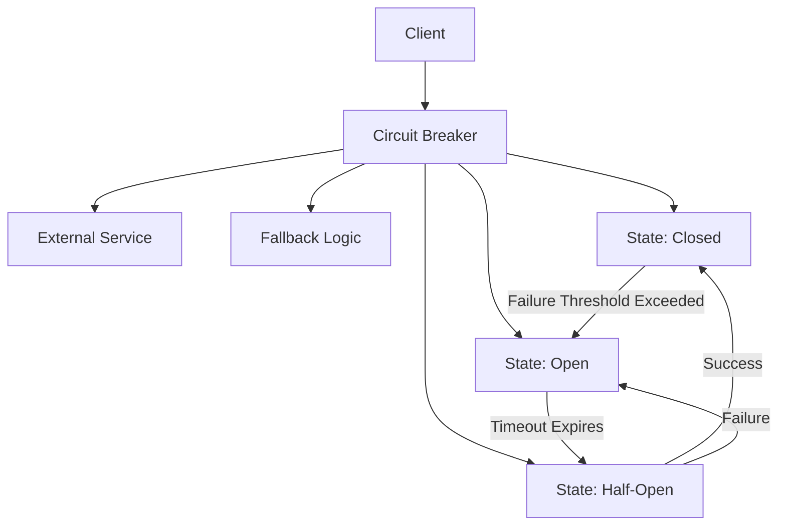
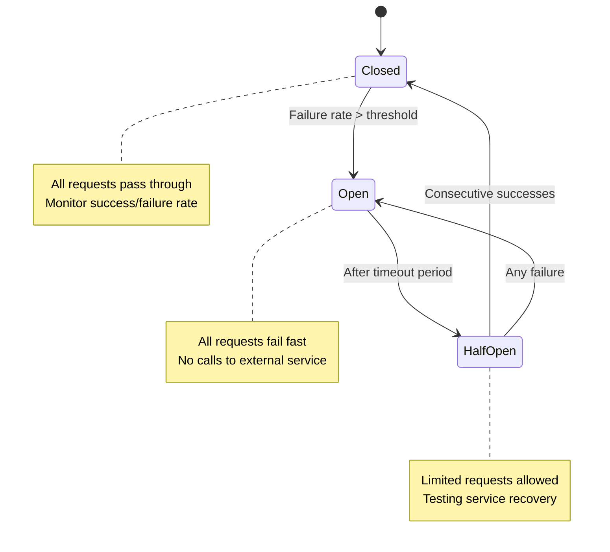
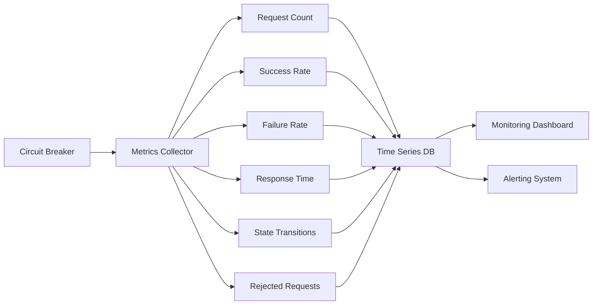
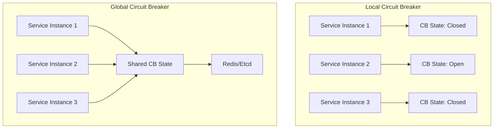
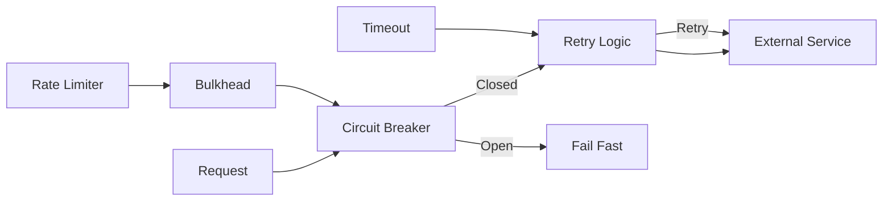
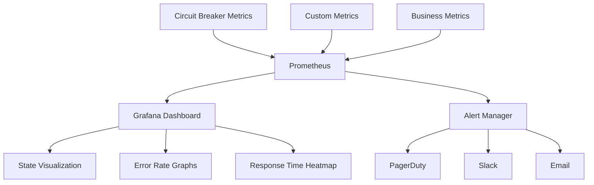

# Circuit Breaker

Circuit Breakerパターンは、分散システムにおける障害の連鎖的な伝播を防ぐための重要な設計パターンである。電気回路のブレーカーから着想を得たこのパターンは、外部サービスへの呼び出しを監視し、一定の失敗率を超えた場合に自動的に通信を遮断することで、システム全体の可用性を維持する。マイクロサービスアーキテクチャの普及に伴い、サービス間の依存関係が複雑化する中で、Circuit Breakerパターンはシステムの復元力（レジリエンス）を高める基本的な機構として広く採用されている。

## 基本概念と動作原理

Circuit Breakerパターンの本質は、失敗する可能性の高い操作を事前に検知し、無駄なリトライや待機時間を回避することにある。従来のタイムアウトやリトライ機構だけでは、障害が発生している外部サービスに対して継続的にリクエストを送信し続けることで、呼び出し元のリソース（スレッド、コネクション、メモリなど）を枯渇させる可能性がある。Circuit Breakerは、このような状況を検知し、一時的に外部サービスへの呼び出しを停止することで、システム全体の健全性を保つ。



Circuit Breakerの動作原理は、三つの基本状態を中心に構築されている。Closed状態では、すべてのリクエストが通常通り外部サービスに転送される。この状態では、Circuit Breakerは各リクエストの成功・失敗を記録し、失敗率を計算する。Open状態では、すべてのリクエストが即座に失敗として扱われ、外部サービスへの呼び出しは行われない。Half-Open状態は、システムの回復を確認するための試験的な状態であり、限定的な数のリクエストのみを外部サービスに転送する。

## 状態遷移の詳細な仕組み

Circuit Breakerの状態遷移は、時間窓（time window）と呼ばれる概念に基づいて管理される。最も一般的な実装では、スライディングウィンドウ（sliding window）アプローチを採用し、直近の一定期間内のリクエスト結果を基に状態を判定する。



Closed状態における失敗率の計算は、実装によって異なる戦略を採用する。カウントベースの戦略では、直近N個のリクエストのうち、失敗した数が閾値を超えた場合にOpenに遷移する。時間ベースの戦略では、過去T秒間の失敗率が閾値を超えた場合に遷移する。より洗練された実装では、これらを組み合わせたハイブリッドアプローチを採用し、「過去60秒間に最低10個のリクエストがあり、その失敗率が50%を超えた場合」といった条件を設定する。

Open状態からHalf-Open状態への遷移は、タイムアウト期間の経過によって自動的に行われる。このタイムアウト期間は、外部サービスが回復するのに必要と想定される時間に基づいて設定される。一般的には、固定値（例：30秒）から始まり、連続的な失敗に応じて指数関数的に増加させる実装が多い。この指数バックオフ戦略により、頻繁に障害を起こすサービスに対する無駄な回復試行を減らすことができる。

## 失敗判定のアルゴリズム

Circuit Breakerにおける「失敗」の定義は、システムの要件によって柔軟に設定される必要がある。最も基本的な失敗判定は、例外の発生やHTTPステータスコードによる判定であるが、実際のシステムでは、より複雑な判定ロジックが必要となる。

```java
// Pseudocode for failure detection
interface FailureDetector {
    boolean isFailure(Response response, Exception exception);
}

class DefaultFailureDetector implements FailureDetector {
    public boolean isFailure(Response response, Exception exception) {
        // Exception-based detection
        if (exception != null) {
            if (exception instanceof TimeoutException ||
                exception instanceof ConnectionException) {
                return true;
            }
        }
        
        // Response-based detection
        if (response != null) {
            // HTTP status codes
            if (response.statusCode >= 500) {
                return true;
            }
            
            // Slow responses
            if (response.latency > thresholdLatency) {
                return true;
            }
        }
        
        return false;
    }
}
```

レイテンシベースの失敗判定は、特に重要な考慮点である。外部サービスが技術的には応答を返していても、その応答時間が許容範囲を超えている場合、それは実質的な障害と見なすべきである。このような「スローダウン」は、しばしばサービスの完全な障害の前兆となるため、早期に検知することでより大きな障害を防ぐことができる。

## メトリクスの収集と管理

Circuit Breakerの効果的な運用には、詳細なメトリクスの収集が不可欠である。これらのメトリクスは、Circuit Breaker自体の動作を最適化するだけでなく、システム全体の健全性を監視するための重要な指標となる。



収集すべき主要なメトリクスには、単位時間あたりのリクエスト数、成功率、失敗率、平均応答時間、パーセンタイル応答時間（P50、P90、P99）、状態遷移の頻度、Open状態で拒否されたリクエスト数などが含まれる。これらのメトリクスは、時系列データベースに格納され、リアルタイムダッシュボードやアラートシステムと連携する。

メトリクスの保持期間と精度は、トレードオフの関係にある。高精度のメトリクスを長期間保持することは、ストレージコストとクエリパフォーマンスの観点から現実的ではない。一般的なアプローチとして、直近のデータは秒単位で保持し、古いデータは段階的に集約（1分、5分、1時間単位）することで、必要な可視性を維持しながらリソース使用を最適化する。

## フォールバック戦略

Circuit BreakerがOpen状態にある場合、単にエラーを返すだけでなく、適切なフォールバック戦略を実装することが重要である。フォールバック戦略は、システムの要件と利用可能なリソースに応じて選択される。

最も単純なフォールバック戦略は、デフォルト値の返却である。例えば、ユーザーの推奨商品を取得するサービスが利用できない場合、人気商品のリストを返すといった対応が考えられる。より洗練されたアプローチとして、キャッシュからの値の返却がある。この場合、最後に成功したリクエストの結果をキャッシュしておき、Circuit BreakerがOpen状態の間はキャッシュされた値を返す。

```java
// Fallback strategy implementation
class CachedFallbackStrategy<T> implements FallbackStrategy<T> {
    private final Cache<String, T> cache;
    private final Duration cacheExpiry;
    
    public T fallback(String key, Throwable cause) {
        // Try to get from cache
        T cachedValue = cache.get(key);
        if (cachedValue != null && !isExpired(key)) {
            return cachedValue;
        }
        
        // Return default value if cache miss
        return getDefaultValue();
    }
    
    public void onSuccess(String key, T value) {
        // Update cache on successful calls
        cache.put(key, value, cacheExpiry);
    }
}
```

フォールバック戦略の選択は、ビジネス要件とユーザーエクスペリエンスのバランスを考慮する必要がある。完全に正確なデータを要求するシステムでは、エラーを明示的に返すことが適切かもしれない。一方、ユーザーエクスペリエンスを重視するシステムでは、多少古いデータでも表示することが望ましい場合がある。

## 分散環境での実装考慮事項

マイクロサービス環境では、Circuit Breakerの状態を複数のインスタンス間で共有するかどうかが重要な設計上の決定となる。ローカルCircuit Breaker（各インスタンスが独立した状態を持つ）とグローバルCircuit Breaker（全インスタンスが状態を共有する）には、それぞれ長所と短所がある。

ローカルCircuit Breakerは、実装が単純で、外部依存がなく、低レイテンシで動作する。しかし、各インスタンスが独立して障害を検知する必要があるため、システム全体での反応が遅くなる可能性がある。また、トラフィックが不均等に分散している場合、一部のインスタンスだけがCircuit Breakerを開く状況が発生し、一貫性のない動作につながる可能性がある。



グローバルCircuit Breakerは、RedisやEtcdなどの分散ストレージを使用して状態を共有する。これにより、システム全体で一貫した動作を保証できるが、状態の同期にかかるオーバーヘッドと、分散ストレージ自体の可用性が新たな考慮点となる。実践的なアプローチとして、ローカルキャッシュと定期的な同期を組み合わせたハイブリッド実装が採用されることが多い。

## パフォーマンスへの影響と最適化

Circuit Breakerの実装は、通常のリクエスト処理パスに追加のオーバーヘッドをもたらす。このオーバーヘッドを最小限に抑えることは、特に高スループットシステムにおいて重要である。

状態チェックの最適化として、ロックフリーアルゴリズムの採用が効果的である。Java実装では、AtomicReferenceやAtomicIntegerを使用して、状態の読み取りと更新を非ブロッキングで行うことができる。また、状態チェックの結果をスレッドローカルにキャッシュすることで、短時間内の繰り返しチェックを高速化できる。

```java
// Lock-free state management
class OptimizedCircuitBreaker {
    private final AtomicReference<State> state = 
        new AtomicReference<>(State.CLOSED);
    private final AtomicInteger consecutiveFailures = 
        new AtomicInteger(0);
    
    public boolean allowRequest() {
        State currentState = state.get();
        
        if (currentState == State.OPEN) {
            // Check if timeout has expired
            if (shouldTransitionToHalfOpen()) {
                state.compareAndSet(State.OPEN, State.HALF_OPEN);
                return true;
            }
            return false;
        }
        
        return true;
    }
}
```

メトリクス収集の最適化も重要な考慮点である。すべてのリクエストに対して詳細なメトリクスを収集することは、パフォーマンスに大きな影響を与える可能性がある。サンプリング戦略を採用し、一定の割合のリクエストのみを詳細に記録することで、統計的に有意な情報を維持しながらオーバーヘッドを削減できる。

## 他のレジリエンスパターンとの統合

Circuit Breakerは、単独で使用されることは稀であり、通常は他のレジリエンスパターンと組み合わせて使用される。Retryパターンとの統合は最も一般的な組み合わせである。Circuit BreakerがClosed状態の場合のみリトライを行い、Open状態では即座に失敗することで、無駄なリトライを防ぐ。



Bulkheadパターンとの組み合わせでは、リソースの分離を行い、一つのサービスの障害が他のサービスに影響を与えることを防ぐ。各外部サービスに対して専用のスレッドプールや接続プールを割り当て、Circuit Breakerと組み合わせることで、障害の影響範囲を限定する。

Rate Limiterとの統合では、Circuit Breakerの前段にRate Limiterを配置することで、過度なリクエストによるサービスの過負荷を防ぐ。これは特に、Circuit BreakerがHalf-Open状態からClosed状態に復帰した直後の「サンダリングハード」問題を防ぐのに効果的である。

## 実装上の落とし穴と対策

Circuit Breakerの実装において、いくつかの一般的な落とし穴が存在する。最も重要なのは、Circuit Breaker自体が単一障害点（Single Point of Failure）とならないようにすることである。Circuit Breakerの状態管理や判定ロジックに不具合があると、正常なサービスへのアクセスを不必要にブロックしてしまう可能性がある。

設定値の硬直化も避けるべき問題である。失敗閾値やタイムアウト値を固定値として実装すると、トラフィックパターンの変化やサービスの特性変更に対応できない。動的な設定変更機能を実装し、運用中に調整可能にすることが重要である。設定変更の際は、変更履歴を記録し、問題が発生した場合に迅速にロールバックできるようにする。

```java
// Dynamic configuration support
class ConfigurableCircuitBreaker {
    private volatile CircuitBreakerConfig config;
    private final ConfigurationSource configSource;
    
    public ConfigurableCircuitBreaker(ConfigurationSource source) {
        this.configSource = source;
        this.config = source.getInitialConfig();
        
        // Register for configuration updates
        source.addListener(this::updateConfiguration);
    }
    
    private void updateConfiguration(CircuitBreakerConfig newConfig) {
        // Validate new configuration
        if (isValidConfig(newConfig)) {
            // Log configuration change
            logger.info("Updating circuit breaker config: {} -> {}", 
                       config, newConfig);
            this.config = newConfig;
        }
    }
}
```

## テスト戦略

Circuit Breakerの動作を検証するためのテスト戦略は、単体テスト、統合テスト、カオスエンジニアリングの三つのレベルで構築される。単体テストでは、状態遷移ロジック、失敗判定ロジック、メトリクス収集の正確性を検証する。モックを使用して様々な失敗シナリオをシミュレートし、Circuit Breakerが期待通りに動作することを確認する。

統合テストでは、実際の外部サービスまたはそのスタブを使用して、エンドツーエンドのシナリオを検証する。特に重要なのは、Circuit BreakerがOpen状態からClosed状態に復帰する際の動作確認である。サービスが部分的に回復している状況や、断続的に失敗する状況での動作も検証する必要がある。

カオスエンジニアリングの実践では、本番環境または本番に近い環境で意図的に障害を注入し、Circuit Breakerが期待通りに機能することを確認する。Netflix社のChaos Monkeyに代表されるツールを使用して、ランダムなサービス障害、ネットワーク遅延、パケットロスなどを発生させ、システム全体のレジリエンスを検証する。

## 監視とアラート

Circuit Breakerの運用において、適切な監視とアラートの設定は不可欠である。監視すべき主要な指標には、各Circuit Breakerの現在の状態、状態遷移の頻度、Open状態の継続時間、拒否されたリクエストの数と率が含まれる。



アラートルールの設計では、ノイズと有用な情報のバランスを取ることが重要である。Circuit BreakerがOpen状態に遷移することは、必ずしも緊急対応が必要な事象ではない。むしろ、Circuit Breakerが正常に機能している証拠である場合もある。アラートは、Open状態が異常に長く続く場合や、頻繁にOpen/Closed間を行き来する「フラッピング」が発生した場合に設定することが適切である。

ビジネスメトリクスとの相関分析も重要である。Circuit Breakerの動作が実際のビジネス指標（売上、ユーザーエンゲージメントなど）にどのような影響を与えているかを理解することで、より適切な設定値の調整が可能となる。

## 実装例とベストプラクティス

実際のプロダクション環境でのCircuit Breaker実装では、言語やフレームワークに応じた成熟したライブラリを使用することが推奨される。JavaエコシステムではNetflix Hystrix（現在はメンテナンスモード）やResilience4j、Spring Cloud Circuit Breakerが広く使用されている。これらのライブラリは、本記事で説明した概念を実装し、プロダクションレディな機能を提供している。

実装時のベストプラクティスとして、まず小さく始めることが重要である。最も重要な外部依存関係から Circuit Breakerを適用し、その効果を測定してから段階的に展開する。初期設定は保守的に（失敗閾値を高めに、タイムアウトを短めに）設定し、実際の運用データに基づいて調整する。

```java
// Production-ready configuration example
CircuitBreakerConfig config = CircuitBreakerConfig.custom()
    .failureRateThreshold(50)                    // 50% failure rate
    .waitDurationInOpenState(Duration.ofSeconds(30))
    .permittedNumberOfCallsInHalfOpenState(3)
    .slidingWindowSize(100)                      // Last 100 calls
    .minimumNumberOfCalls(10)                    // Minimum 10 calls
    .recordExceptions(IOException.class, TimeoutException.class)
    .ignoreExceptions(BusinessException.class)
    .build();
```

Circuit Breakerの名前付けも重要な考慮点である。各Circuit Breakerには、その保護対象となるリソースや操作を明確に示す名前を付ける。これにより、監視ダッシュボードやログでの識別が容易になり、運用時のトラブルシューティングが効率化される。

## 理論的背景と数学的モデル

Circuit Breakerの動作は、確率論的な観点から分析することができる。失敗率の推定には、ベイズ推定や移動平均などの統計的手法が応用される。特に、限られたサンプル数から信頼性の高い失敗率を推定することは、Circuit Breakerの誤動作を防ぐ上で重要である。

失敗率の信頼区間は、二項分布の性質を利用して計算できる。n回の試行でk回失敗した場合、真の失敗率pの95%信頼区間は、Wilson score intervalを使用して以下のように計算される：

$$\frac{k + \frac{z^2}{2} \pm z\sqrt{\frac{k(n-k)}{n} + \frac{z^2}{4}}}{n + z^2}$$

ここで、zは標準正規分布の97.5パーセンタイル値（約1.96）である。この信頼区間を考慮することで、少数のサンプルに基づく過度に敏感な状態遷移を防ぐことができる。

Circuit Breakerの効果は、待ち行列理論の観点からも分析できる。外部サービスをM/M/c/K待ち行列としてモデル化すると、Circuit Breakerによる負荷制御の効果を定量的に評価できる。特に、Little's Lawを適用することで、平均応答時間と同時処理数の関係を明確にし、適切な閾値設定の指針を得ることができる。

## 進化するアーキテクチャへの適応

クラウドネイティブアーキテクチャの進化に伴い、Circuit Breakerパターンも新しい課題に直面している。サーバーレスアーキテクチャでは、関数のコールドスタートがCircuit Breakerの状態管理を複雑にする。各関数インスタンスが短命であるため、状態を外部ストレージに永続化する必要があるが、これはレイテンシとのトレードオフとなる。

サービスメッシュ（Istio、Linkerdなど）の普及により、Circuit Breakerの実装がアプリケーションレイヤーからインフラストラクチャレイヤーに移行する傾向がある。これにより、言語に依存しない統一的なCircuit Breaker実装が可能となる一方で、アプリケーション固有のビジネスロジックに基づく失敗判定が困難になるという課題もある。

エッジコンピューティング環境では、Circuit Breakerの分散実装がさらに重要となる。エッジノード間での状態共有は、ネットワーク遅延とパーティション耐性の観点から課題が多い。CRDTｓ（Conflict-free Replicated Data Types）などの技術を活用した、最終的一貫性を持つCircuit Breaker実装が研究されている。

Circuit Breakerパターンは、分散システムのレジリエンスを高める基本的なパターンとして、今後も進化を続けるだろう。機械学習を活用した動的な閾値調整、予測的な障害検知、自己修復機能との統合など、新しい技術との融合により、より洗練された障害対策メカニズムが実現されることが期待される。システムアーキテクトは、これらの進化を理解し、適切に活用することで、より堅牢で可用性の高いシステムを構築することができる。