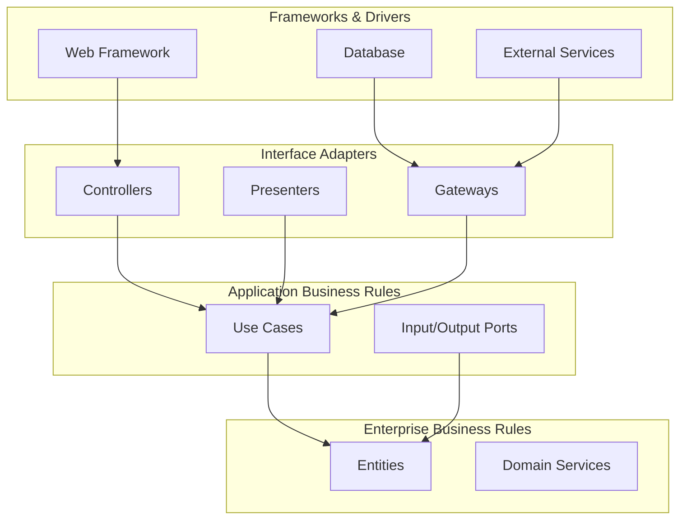
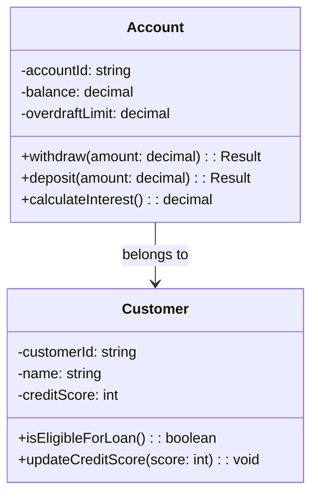
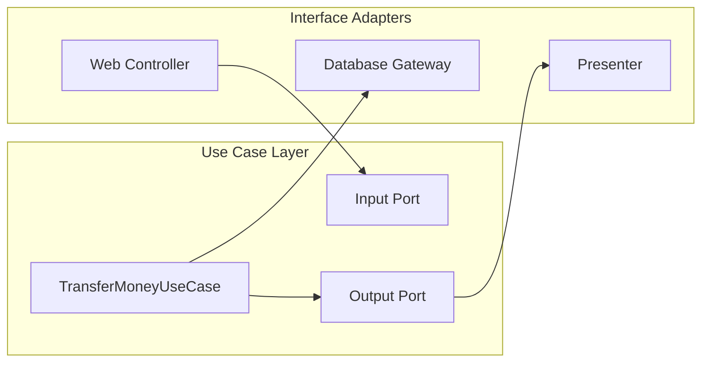
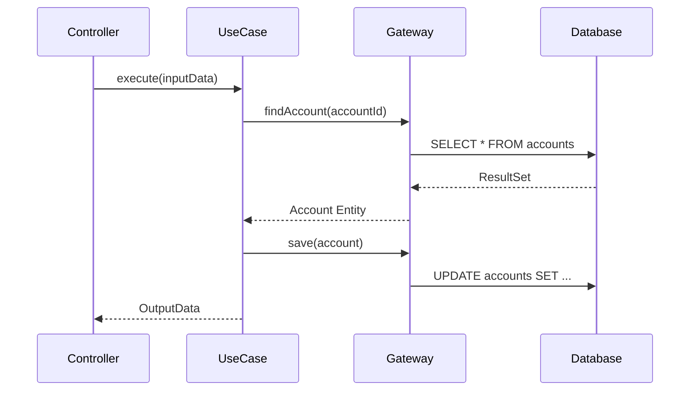
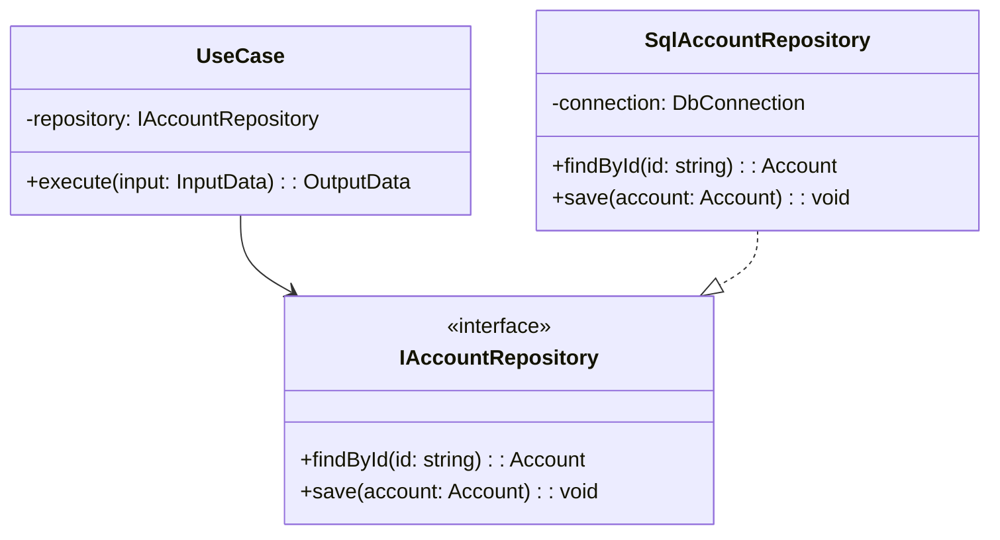
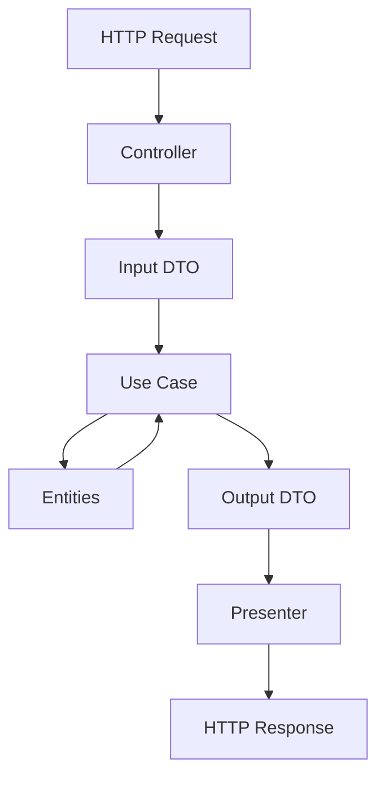
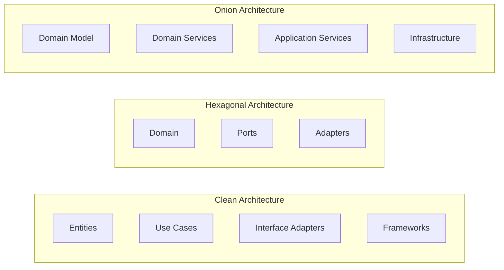
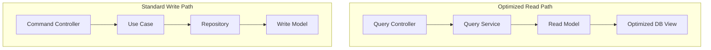
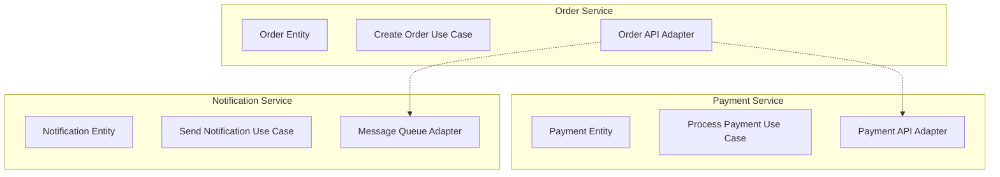

# Clean Architecture

Clean Architectureは、Robert C. Martin（Uncle Bob）が2012年に提唱したソフトウェアアーキテクチャの設計原則です。この設計思想は、ビジネスルールをフレームワークやデータベース、UIなどの外部要因から分離し、テスタブルで変更に強いシステムを構築することを目的としています。本質的には、依存性の方向を制御することで、ビジネスロジックを中心に据えたアーキテクチャを実現します。

## 依存性の規則

Clean Architectureの核心は「依存性の規則」にあります。この規則は、ソースコードの依存関係は内側（ビジネスルール）に向かってのみ許可され、外側から内側への依存のみが許されるというものです。つまり、内側の円は外側の円について何も知らないという状態を保ちます。



この依存性の方向は、変更の頻度と重要度に基づいて設計されています。ビジネスルールは最も変更頻度が低く、最も重要な部分であるため、他のコンポーネントから独立している必要があります。一方、UIやデータベースのような技術的詳細は頻繁に変更される可能性があるため、最外層に配置されます。

## エンティティ層

エンティティ層は、Clean Architectureの最も内側の円を構成し、エンタープライズワイドなビジネスルールをカプセル化します。エンティティは、企業全体で使用される最も一般的で高レベルのルールを含むオブジェクトです。これらは、外部の変更から最も遠く、最も保護されるべき部分です。

エンティティは単なるデータ構造ではありません。それらは、ビジネスルールとデータの両方を含む、完全にカプセル化されたオブジェクトです。例えば、銀行システムにおける「口座」エンティティは、残高だけでなく、引き出し制限や利息計算のルールも含みます。



エンティティ層の重要な特徴は、フレームワークやデータベース、UIに関する知識を一切持たないことです。これらは純粋なビジネスロジックであり、どのようなアプリケーションでも再利用可能です。

## ユースケース層

ユースケース層は、アプリケーション固有のビジネスルールを含みます。この層は、システムのすべてのユースケースを実装し、エンティティとの間でデータの流れを指揮します。ユースケースは、エンティティに含まれるエンタープライズワイドなビジネスルールを使用して、アプリケーション固有の目標を達成します。

ユースケースは、入力ポートと出力ポートを通じて外部世界と通信します。これらのポートはインターフェースであり、ユースケースが必要とするデータや、ユースケースが生成するデータの形式を定義します。この設計により、ユースケースは特定のUIやデータベースの実装から独立します。



ユースケースの実装において重要なのは、単一責任の原則を守ることです。各ユースケースは一つの特定のビジネス操作のみを扱うべきです。例えば、「送金」ユースケースは送金のロジックのみを含み、ユーザー認証や通知送信などは別のユースケースとして実装されるべきです。

## インターフェースアダプター層

インターフェースアダプター層は、ユースケースとエンティティに最も便利な形式から、データベースやウェブなどの外部機関に最も便利な形式にデータを変換します。この層には、MVCアーキテクチャのコントローラー、プレゼンター、ビューが含まれます。

この層の主な責任は、データの変換です。例えば、SQLデータベースから取得したデータをエンティティに変換したり、エンティティからウェブページに表示するためのビューモデルを生成したりします。重要なのは、この層がビジネスルールを含まないことです。純粋にデータ形式の変換のみを行います。



インターフェースアダプター層では、依存性逆転の原則（Dependency Inversion Principle）が重要な役割を果たします。内側の層（ユースケース）がインターフェースを定義し、外側の層（アダプター）がそれを実装することで、依存性の方向を制御します。

## フレームワーク・ドライバー層

最外層は、フレームワークやツール、ドライバーなどの技術的詳細で構成されます。この層には、ウェブフレームワーク、データベース、メッセージングシステムなどが含まれます。これらは詳細実装であり、ビジネスロジックに影響を与えることなく変更可能であるべきです。

この層の特徴は、可能な限り薄く保つことです。フレームワーク固有のコードは最小限に抑え、ビジネスロジックがフレームワークに侵食されないようにします。例えば、Spring BootやDjangoのようなフレームワークを使用する場合でも、ビジネスロジックはフレームワークのアノテーションや基底クラスから独立している必要があります。

## 依存性逆転の実装パターン

Clean Architectureを実装する上で、依存性逆転の原則の適用は不可欠です。内側の層が外側の層の詳細を知らないようにするため、インターフェースを活用します。具体的な実装パターンとして、Repository パターンやAdapter パターンが頻繁に使用されます。



この設計により、ユースケースはデータベースの実装詳細を知ることなく、必要なデータ操作を行えます。テスト時には、インメモリ実装やモック実装に簡単に置き換えることができ、高いテスタビリティを実現します。

## データフローと境界の横断

Clean Architectureにおけるデータフローは、常に依存性の規則に従う必要があります。外側から内側へデータが流れる際、各層の境界でデータ構造の変換が行われます。この変換プロセスは、各層の独立性を保つために重要です。

典型的なリクエスト処理のフローは以下のようになります。HTTPリクエストがコントローラーに到達すると、コントローラーはリクエストデータを入力DTOに変換します。この入力DTOはユースケースに渡され、ユースケースはビジネスロジックを実行します。結果は出力DTOとして返され、プレゼンターがこれをHTTPレスポンスに適した形式に変換します。



境界を横断する際のデータ構造は、シンプルなデータ転送オブジェクト（DTO）であるべきです。これらは、基本的なデータ型とその集合体のみを含み、ビジネスロジックを含みません。この設計により、各層の独立性が保たれ、一方の層の変更が他方に波及することを防ぎます。

## テスタビリティとモックの活用

Clean Architectureの大きな利点の一つは、高いテスタビリティです。各層が明確に分離され、依存性が制御されているため、単体テストが容易になります。特に、ビジネスロジックを含むユースケースとエンティティは、外部依存なしにテストできます。

ユースケースのテストでは、リポジトリやゲートウェイのインターフェースをモック化します。これにより、データベースやネットワーク接続なしに、ビジネスロジックの正確性を検証できます。エンティティのテストはさらにシンプルで、純粋な単体テストとして実装できます。

```python
# Use case test example
class TestTransferMoneyUseCase:
    def test_successful_transfer(self):
        # Arrange
        mock_repo = Mock(spec=IAccountRepository)
        source_account = Account(id="1", balance=1000)
        target_account = Account(id="2", balance=500)
        mock_repo.find_by_id.side_effect = lambda id: {
            "1": source_account,
            "2": target_account
        }[id]
        
        use_case = TransferMoneyUseCase(mock_repo)
        
        # Act
        result = use_case.execute(
            TransferMoneyInput(
                source_id="1",
                target_id="2",
                amount=200
            )
        )
        
        # Assert
        assert result.success == True
        assert source_account.balance == 800
        assert target_account.balance == 700
```

## 実装における実践的考慮事項

Clean Architectureを実際のプロジェクトに適用する際、いくつかの実践的な考慮事項があります。まず、完全な分離を達成することは、特に小規模プロジェクトでは過剰設計になる可能性があります。プロジェクトの規模と複雑さに応じて、適切なレベルの抽象化を選択することが重要です。

パッケージ構造の設計も重要な考慮事項です。一般的なアプローチとして、機能別（feature-based）と層別（layer-based）の構造があります。Clean Architectureでは、内側の層ほど安定しているという原則から、層別の構造が推奨されることが多いですが、大規模プロジェクトでは機能別の構造と組み合わせることも有効です。

```
project/
├── domain/
│   ├── entities/
│   │   ├── account.py
│   │   └── customer.py
│   └── value_objects/
│       └── money.py
├── application/
│   ├── use_cases/
│   │   ├── transfer_money.py
│   │   └── create_account.py
│   └── ports/
│       ├── input/
│       └── output/
├── infrastructure/
│   ├── adapters/
│   │   ├── web/
│   │   └── persistence/
│   └── config/
└── main.py
```

## トレードオフと代替アーキテクチャとの比較

Clean Architectureは万能ではなく、特定のトレードオフを伴います。最も顕著なのは、初期開発コストの増加です。多くの抽象化層とインターフェースの定義により、シンプルなCRUDアプリケーションでは過剰な複雑さをもたらす可能性があります。

代替アーキテクチャとしては、Hexagonal Architecture（Ports and Adapters）、Onion Architecture、Domain-Driven Design（DDD）のLayered Architectureなどがあります。これらはClean Architectureと多くの原則を共有していますが、実装の詳細や強調点が異なります。

Hexagonal Architectureは、Clean Architectureの前身とも言える設計で、ポートとアダプターの概念を中心に据えています。Clean Architectureはこの概念を取り入れつつ、より詳細な層構造を定義しています。Onion Architectureも同様の依存性の方向を持ちますが、ドメインモデルをより中心的に扱います。



プロジェクトの特性に応じて適切なアーキテクチャを選択することが重要です。高度なビジネスロジックを持つエンタープライズアプリケーションではClean Architectureが有効ですが、シンプルなWebアプリケーションではMVCパターンで十分な場合もあります。

## パフォーマンスと最適化の考慮事項

Clean Architectureの層構造は、パフォーマンスへの影響を懸念する声もあります。確かに、各層でのデータ変換やインターフェースを通じた間接的な呼び出しは、理論上のオーバーヘッドを生じさせます。しかし、現代のコンパイラやJITコンパイラの最適化により、実際のパフォーマンスへの影響は多くの場合無視できる程度です。

パフォーマンスが重要な場合、以下の最適化戦略を考慮できます。第一に、頻繁にアクセスされるデータに対してキャッシング層を導入することです。これは、リポジトリの実装レベルで透過的に行えます。第二に、複雑なクエリやバッチ処理では、専用のクエリサービスを作成し、読み取り専用の最適化されたパスを提供することです。



このようなCQRS（Command Query Responsibility Segregation）パターンとの組み合わせにより、Clean Architectureの原則を維持しながら、必要な箇所でパフォーマンスを最適化できます。

## マイクロサービスアーキテクチャへの適用

Clean Architectureの原則は、マイクロサービスアーキテクチャにも効果的に適用できます。各マイクロサービスを独立したClean Architectureとして設計することで、サービス間の結合度を低く保ちながら、各サービス内部の凝集度を高めることができます。

マイクロサービス環境では、サービス間通信がインターフェースアダプター層で処理されます。REST APIやgRPC、メッセージキューなどの通信メカニズムは、この層に実装されます。重要なのは、ユースケースやエンティティがこれらの通信詳細を知らないことです。



各サービスの境界は、ビジネス能力やドメイン境界に基づいて定義されるべきです。Clean Architectureの層構造により、サービスの内部実装を変更しても、他のサービスへの影響を最小限に抑えることができます。

## エラーハンドリングと例外管理

Clean Architectureにおけるエラーハンドリングは、各層の責任範囲に応じて設計される必要があります。ビジネスルール違反はドメイン例外として、技術的な問題はインフラストラクチャ例外として扱われます。重要なのは、内側の層が外側の層の例外について知らないことです。

ユースケース層では、ビジネスルール違反を表現するための専用の結果型やエラー型を定義することが推奨されます。これにより、成功と失敗の両方のケースを型安全に扱えます。外側の層では、これらのビジネスエラーを適切なHTTPステータスコードやユーザーメッセージに変換します。

```python
# Domain exception
class InsufficientFundsError(DomainError):
    def __init__(self, account_id: str, requested: Money, available: Money):
        self.account_id = account_id
        self.requested = requested
        self.available = available
        super().__init__(
            f"Insufficient funds in account {account_id}: "
            f"requested {requested}, available {available}"
        )

# Use case result type
@dataclass
class TransferResult:
    success: bool
    transaction_id: Optional[str] = None
    error: Optional[DomainError] = None

# Controller error handling
def transfer_money(self, request: Request) -> Response:
    result = self.use_case.execute(self._map_request(request))
    
    if result.success:
        return Response(
            status=200,
            body={"transaction_id": result.transaction_id}
        )
    elif isinstance(result.error, InsufficientFundsError):
        return Response(
            status=400,
            body={"error": "Insufficient funds"}
        )
    else:
        return Response(
            status=500,
            body={"error": "Internal server error"}
        )
```

## 進化的アーキテクチャとしての適用

Clean Architectureは、必ずしも最初から完全な形で実装する必要はありません。むしろ、システムの成長に応じて段階的に適用することが現実的です。初期段階では簡潔な実装から始め、複雑さが増すにつれて層を分離していくアプローチが有効です。

リファクタリングの指針として、以下のような兆候が現れたら層の分離を検討すべきです：ビジネスロジックがコントローラーに漏れ出している、テストが困難になっている、特定のフレームワークへの依存が強すぎる、同じビジネスルールが複数箇所に散在している、などです。

段階的な移行では、まず最も重要なビジネスロジックから分離を始めます。既存のコードベースに対しては、新機能の追加時にClean Architectureの原則を適用し、徐々に既存部分もリファクタリングしていく戦略が効果的です。

Clean Architectureは、ソフトウェア設計における重要な原則を体系化したものです。依存性の方向を制御し、ビジネスロジックを技術的詳細から分離することで、変更に強く、テスタブルで、理解しやすいシステムを構築できます。その適用には初期コストが伴いますが、長期的な保守性と拡張性の向上という形で投資は回収されます。重要なのは、プロジェクトの特性と要求に応じて、適切なレベルでこれらの原則を適用することです。

---

**参考文献**

1. Martin, Robert C. "Clean Architecture: A Craftsman's Guide to Software Structure and Design" (2017) Prentice Hall.
2. Cockburn, Alistair. "Hexagonal Architecture" (2005) https://alistair.cockburn.us/hexagonal-architecture/
3. Palermo, Jeffrey. "The Onion Architecture" (2008) https://jeffreypalermo.com/2008/07/the-onion-architecture-part-1/