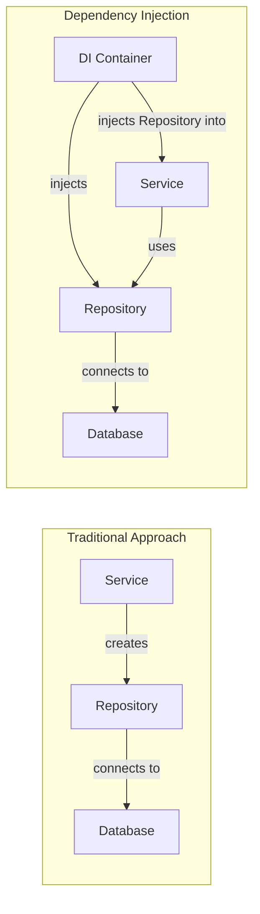
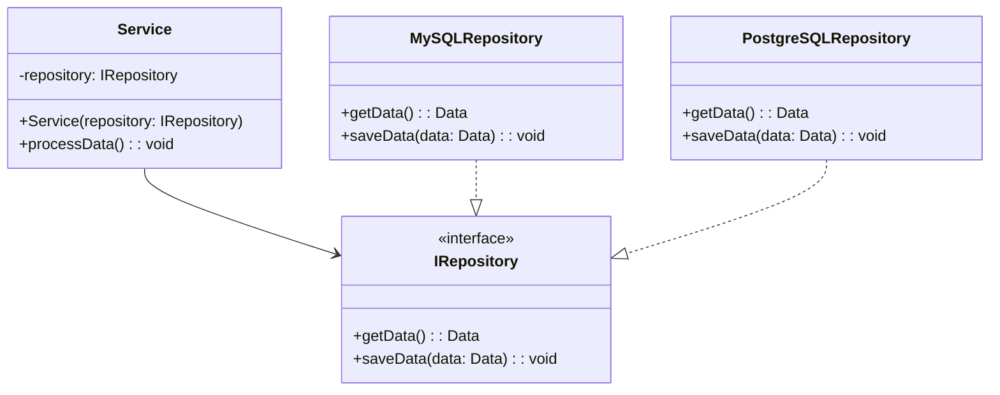
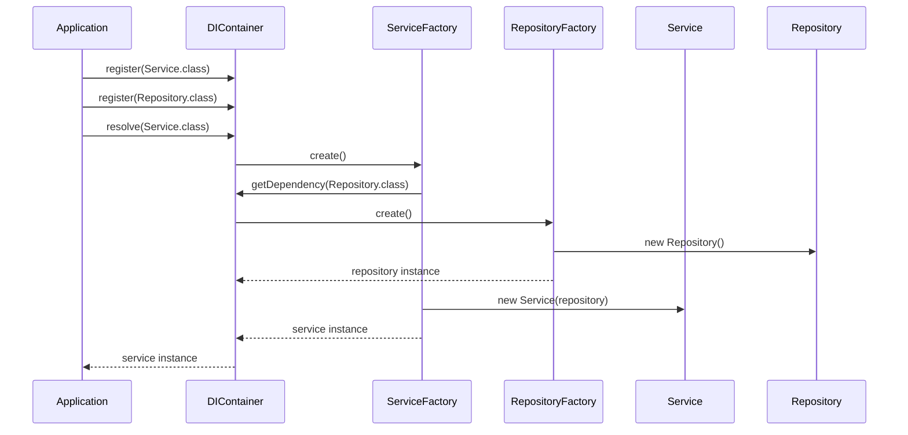

# Dependency Injection

Dependency Injection（依存性注入、以下DI）は、オブジェクト指向プログラミングにおける設計パターンの一つであり、オブジェクト間の依存関係を管理するための手法である。Martin Fowlerは2004年の論文[^1]でこの概念を体系的に整理し、現代のソフトウェア開発において不可欠な設計原則として確立された。DIの本質は、オブジェクトが自身の依存するコンポーネントを直接生成するのではなく、外部から受け取ることにより、疎結合で柔軟なシステムを構築することにある。

## 依存関係の問題と制御の反転

従来のオブジェクト指向プログラミングでは、クラスが必要とする他のクラスのインスタンスを、コンストラクタ内でnewキーワードを使って直接生成することが一般的であった。この方法は直感的で理解しやすいが、クラス間の結合度が高くなり、テストの困難性や再利用性の低下といった問題を引き起こす。例えば、データベースアクセスを行うRepositoryクラスを利用するServiceクラスを考えてみよう。Serviceクラスが内部でRepositoryクラスを直接インスタンス化している場合、Serviceクラスのユニットテストを行う際に実際のデータベース接続が必要となり、テストの独立性が損なわれる。

この問題に対する解決策として提唱されたのが、Inversion of Control（IoC、制御の反転）の原則である。IoCは、プログラムの制御フローを反転させ、フレームワークやコンテナがアプリケーションコードを呼び出すという考え方である。DIはこのIoCを実現する具体的な手法の一つであり、オブジェクトの生成と依存関係の解決を、オブジェクト自身ではなく外部のメカニズムに委譲する。

Robert C. Martinが提唱したSOLID原則[^2]の中でも、依存性逆転の原則（Dependency Inversion Principle）はDIと密接に関連している。この原則は「高レベルのモジュールは低レベルのモジュールに依存してはならない。双方とも抽象に依存すべきである」と述べており、DIはこの原則を実現するための実装パターンとして機能する。

## DIの実現方法

DIを実現する方法は主に3つのパターンに分類される：コンストラクタインジェクション、セッターインジェクション、そしてインターフェースインジェクションである。それぞれに特徴があり、使用する文脈によって適切な方法を選択する必要がある。

コンストラクタインジェクションは、依存関係をコンストラクタの引数として受け取る方法である。この方法の最大の利点は、オブジェクトの不変性を保証できることである。コンストラクタで全ての依存関係を受け取ることで、オブジェクトは生成時点で完全に初期化され、その後の状態変化を防ぐことができる。また、必須の依存関係を明確にできるため、コンパイル時に依存関係の不足を検出できる。

セッターインジェクションは、依存関係をセッターメソッドを通じて注入する方法である。この方法はオプショナルな依存関係を扱う場合に適しており、オブジェクトの生成後に依存関係を変更できる柔軟性を提供する。しかし、オブジェクトが不完全な状態で存在する可能性があるため、使用時には注意が必要である。

インターフェースインジェクションは、依存関係を注入するための専用のインターフェースを定義し、そのインターフェースを通じて依存関係を設定する方法である。この方法は最も形式的であり、DIコンテナとの統合が明確になるが、実装の複雑性が増すため、現代のフレームワークではあまり使用されない。

## DIコンテナの仕組み

DIコンテナ（またはIoCコンテナ）は、依存関係の解決とオブジェクトのライフサイクル管理を自動化するフレームワークである。Spring Framework[^3]、Google Guice[^4]、Microsoft Unity[^5]などが代表的な実装である。これらのコンテナは、設定ファイルやアノテーションを通じて依存関係のマッピングを定義し、実行時に適切なオブジェクトを生成・注入する。

DIコンテナの内部では、リフレクションやプロキシパターンを使用して動的にオブジェクトを生成し、依存関係を解決する。コンテナは通常、以下の機能を提供する：

1. **オブジェクトの生成とライフサイクル管理**：シングルトン、プロトタイプ、リクエストスコープなど、様々なスコープでオブジェクトを管理する。

2. **依存関係の自動解決**：型情報やアノテーションを基に、適切な実装クラスを選択し注入する。

3. **循環依存の検出**：オブジェクト間の循環依存を検出し、適切なエラーメッセージを提供する。

4. **遅延初期化**：必要になるまでオブジェクトの生成を遅延させ、起動時間とメモリ使用量を最適化する。

## 実装上の考慮事項とベストプラクティス

DIを効果的に活用するためには、いくつかの重要な考慮事項がある。まず、過度なDIの使用は「設定地獄」と呼ばれる問題を引き起こす可能性がある。全てのオブジェクトをDIコンテナで管理しようとすると、設定が複雑になり、かえってシステムの理解を困難にする。Value ObjectやEntity、単純なユーティリティクラスなど、状態を持たないか、依存関係を持たないオブジェクトは、DIの対象から除外することが推奨される。

パフォーマンスの観点からも注意が必要である。DIコンテナは実行時にリフレクションを使用することが多く、これはコンパイル時の最適化を妨げる可能性がある。特に、起動時間が重要なアプリケーションやリアルタイム性が要求されるシステムでは、DIコンテナのオーバーヘッドを慎重に評価する必要がある。Google Daggerのようなコンパイル時DIフレームワーク[^6]は、この問題に対する一つの解決策を提供している。

テスタビリティの向上はDIの主要な利点の一つであるが、これを最大限に活用するためには適切な抽象化が必要である。具体的なクラスではなくインターフェースに依存することで、テスト時にモックオブジェクトを容易に注入できるようになる。しかし、過度な抽象化は「インターフェース爆発」と呼ばれる問題を引き起こし、コードの可読性を損なう可能性がある。

## トレードオフと代替アプローチ

DIは多くの利点を提供するが、全ての状況において最適な解決策ではない。Service Locatorパターンは、DIの代替アプローチの一つである。Service Locatorでは、中央のレジストリからサービスを取得するため、依存関係が明示的でなくなるという欠点があるが、既存のコードベースへの導入が容易であるという利点がある。

関数型プログラミングの文脈では、DIとは異なるアプローチが取られることが多い。高階関数や部分適用を使用することで、明示的なDIコンテナなしに依存関係を管理できる。ReaderモナドやFree Monadなどの抽象化は、関数型プログラミングにおけるDIの代替として機能する[^7]。

マイクロサービスアーキテクチャの普及に伴い、DIの適用範囲も変化している。サービス間の依存関係は、DIコンテナではなくサービスメッシュやAPI Gatewayによって管理されることが多い。しかし、個々のマイクロサービス内部では依然としてDIが有効であり、サービスの境界とDIの適用範囲を適切に設計することが重要である。

現代のクラウドネイティブアプリケーションでは、環境変数や設定ファイルを通じた外部化設定（Externalized Configuration）とDIを組み合わせることが一般的である。Twelve-Factor App[^8]の原則に従い、環境固有の設定を外部化しつつ、アプリケーション内部の依存関係はDIで管理するという二層構造のアプローチが推奨される。

DIの採用は、チームの技術レベルや既存のコードベース、アプリケーションの特性を考慮して決定すべきである。小規模なアプリケーションや短期間のプロトタイプでは、DIの導入コストが利益を上回る可能性がある。一方、長期間メンテナンスされる大規模なエンタープライズアプリケーションでは、DIによる保守性とテスタビリティの向上は、初期の複雑性を補って余りある価値を提供する。

[^1]: Fowler, M. (2004). "Inversion of Control Containers and the Dependency Injection pattern". https://martinfowler.com/articles/injection.html

[^2]: Martin, R. C. (2003). "Agile Software Development, Principles, Patterns, and Practices". Prentice Hall.

[^3]: Spring Framework Reference Documentation. https://docs.spring.io/spring-framework/docs/current/reference/html/

[^4]: Google Guice User Guide. https://github.com/google/guice/wiki/GettingStarted

[^5]: Unity Container Documentation. https://unitycontainer.github.io/documentation/

[^6]: Dagger 2 Documentation. https://dagger.dev/dev-guide/

[^7]: Kmett, E. (2012). "The Reader Monad and Dependency Injection". http://www.haskellforall.com/2012/06/reader-monad-and-dependency-injection.html

[^8]: Wiggins, A. (2017). "The Twelve-Factor App". https://12factor.net/