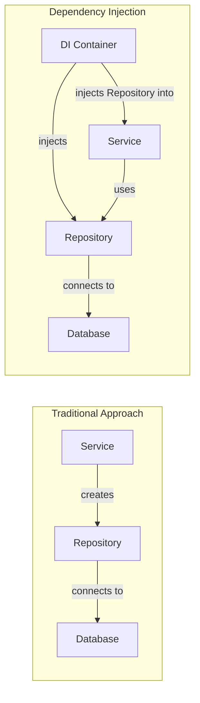
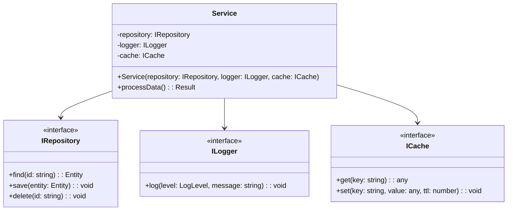
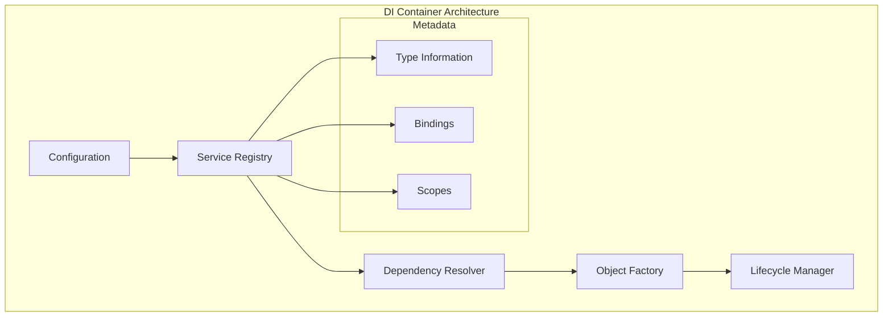
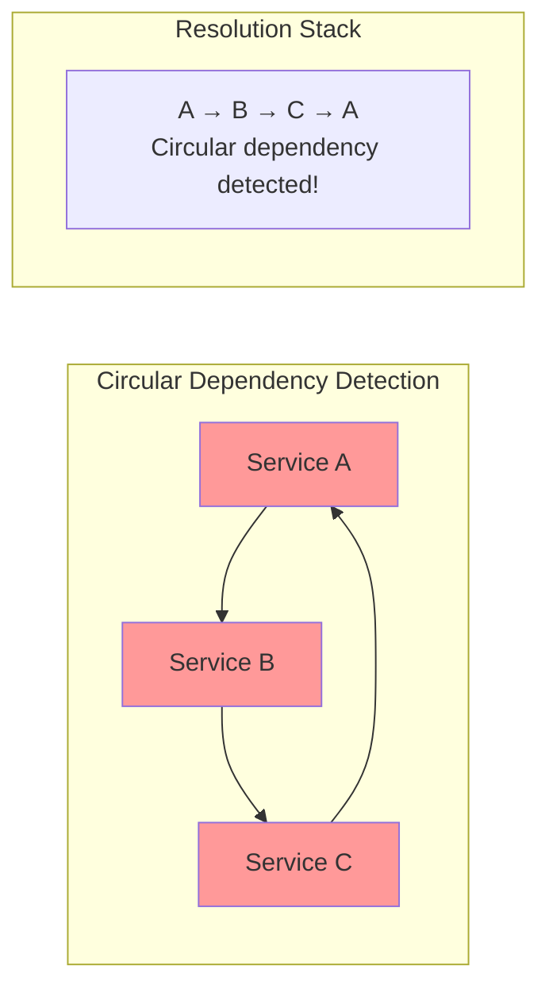
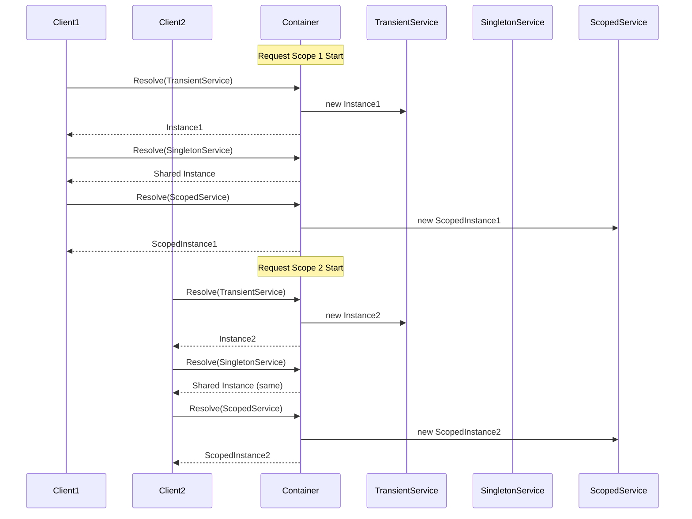
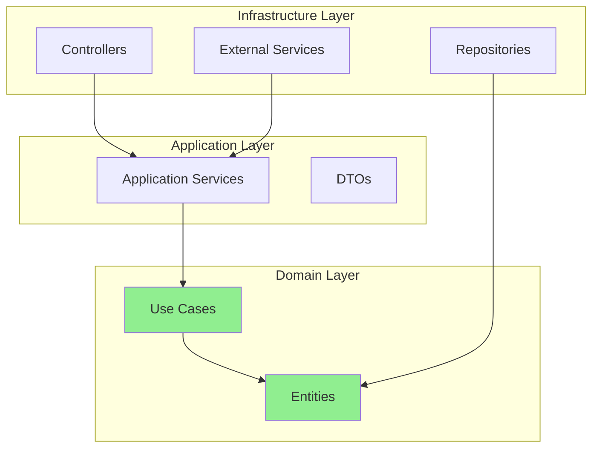
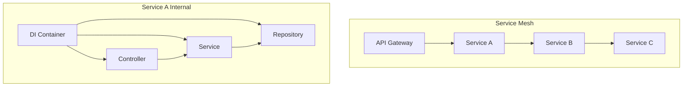

# Dependency Injection

Dependency Injection（依存性注入、以下DI）は、オブジェクト指向プログラミングにおける設計パターンの一つであり、オブジェクト間の依存関係を管理するための手法である。Martin Fowlerは2004年の論文[^1]でこの概念を体系的に整理し、現代のソフトウェア開発において不可欠な設計原則として確立された。DIの本質は、オブジェクトが自身の依存するコンポーネントを直接生成するのではなく、外部から受け取ることにより、疎結合で柔軟なシステムを構築することにある。

[^1]: Fowler, M. (2004). "Inversion of Control Containers and the Dependency Injection pattern". https://martinfowler.com/articles/injection.html

## 依存関係の問題と制御の反転

従来のオブジェクト指向プログラミングでは、クラスが必要とする他のクラスのインスタンスを、コンストラクタ内でnewキーワードを使って直接生成することが一般的であった。この方法は直感的で理解しやすいが、クラス間の結合度が高くなり、テストの困難性や再利用性の低下といった問題を引き起こす。例えば、データベースアクセスを行うRepositoryクラスを利用するServiceクラスを考えてみよう。Serviceクラスが内部でRepositoryクラスを直接インスタンス化している場合、Serviceクラスのユニットテストを行う際に実際のデータベース接続が必要となり、テストの独立性が損なわれる。



この問題に対する解決策として提唱されたのが、Inversion of Control（IoC、制御の反転）の原則である。IoCは、プログラムの制御フローを反転させ、フレームワークやコンテナがアプリケーションコードを呼び出すという考え方である。DIはこのIoCを実現する具体的な手法の一つであり、オブジェクトの生成と依存関係の解決を、オブジェクト自身ではなく外部のメカニズムに委譲する。

### 理論的基盤：SOLID原則との関係

Robert C. Martinが提唱したSOLID原則[^2]は、オブジェクト指向設計の基本原則として広く受け入れられているが、DIはこれらの原則と密接に関連している。特に重要なのは以下の2つである：

[^2]: Martin, R. C. (2003). "Agile Software Development, Principles, Patterns, and Practices". Prentice Hall.

**依存性逆転の原則（Dependency Inversion Principle, DIP）**: 「高レベルのモジュールは低レベルのモジュールに依存してはならない。双方とも抽象に依存すべきである」という原則は、DIの理論的基盤を形成している。DIはこの原則を実現するための実装パターンとして機能し、具体的な実装ではなく抽象（インターフェース）に依存することで、システムの柔軟性を高める。

**単一責任の原則（Single Responsibility Principle, SRP）**: DIを適用することで、オブジェクトは自身の主要な責務に集中でき、依存関係の管理という副次的な責務から解放される。これにより、各クラスがより明確で単一の責任を持つようになる。

### Hollywood Principle

"Don't call us, we'll call you"として知られるHollywood Principleは、IoCの本質を端的に表現している。従来のプログラミングでは、アプリケーションコードがライブラリを呼び出すが、IoCではフレームワークがアプリケーションコードを呼び出す。この反転により、アプリケーションコードはフレームワークの詳細な実装から独立し、より再利用可能になる。

## DIの実現方法と実装パターン

DIを実現する方法は主に3つのパターンに分類される：コンストラクタインジェクション、セッターインジェクション、そしてインターフェースインジェクションである。それぞれに特徴があり、使用する文脈によって適切な方法を選択する必要がある。

### コンストラクタインジェクション

コンストラクタインジェクションは、依存関係をコンストラクタの引数として受け取る方法である。この方法の最大の利点は、オブジェクトの不変性を保証できることである。コンストラクタで全ての依存関係を受け取ることで、オブジェクトは生成時点で完全に初期化され、その後の状態変化を防ぐことができる。



コンストラクタインジェクションの利点：
- **不変性の保証**: オブジェクトが生成された後、依存関係を変更できない
- **必須依存関係の明確化**: コンパイル時に依存関係の不足を検出できる
- **テストの容易性**: コンストラクタに明示的に依存関係を渡せるため、モックの注入が簡単

欠点：
- **コンストラクタの肥大化**: 依存関係が多い場合、コンストラクタが複雑になる
- **循環依存の解決困難**: コンストラクタインジェクションでは循環依存を解決できない

### セッターインジェクション

セッターインジェクションは、依存関係をセッターメソッドを通じて注入する方法である。この方法はオプショナルな依存関係を扱う場合に適しており、オブジェクトの生成後に依存関係を変更できる柔軟性を提供する。

```java
public class NotificationService {
    private EmailSender emailSender;
    private SmsSender smsSender;  // Optional dependency
    
    // Required dependency via constructor
    public NotificationService(EmailSender emailSender) {
        this.emailSender = emailSender;
    }
    
    // Optional dependency via setter
    public void setSmsSender(SmsSender smsSender) {
        this.smsSender = smsSender;
    }
    
    public void notify(User user, String message) {
        emailSender.send(user.getEmail(), message);
        
        if (smsSender != null && user.hasPhoneNumber()) {
            smsSender.send(user.getPhoneNumber(), message);
        }
    }
}
```

### インターフェースインジェクション

インターフェースインジェクションは、依存関係を注入するための専用のインターフェースを定義し、そのインターフェースを通じて依存関係を設定する方法である。

```java
public interface RepositoryAware {
    void setRepository(Repository repository);
}

public class UserService implements RepositoryAware {
    private Repository repository;
    
    @Override
    public void setRepository(Repository repository) {
        this.repository = repository;
    }
}
```

## DIコンテナの内部実装

DIコンテナ（またはIoCコンテナ）は、依存関係の解決とオブジェクトのライフサイクル管理を自動化するフレームワークである。Spring Framework[^3]、Google Guice[^4]、Microsoft Unity[^5]などが代表的な実装である。

[^3]: Spring Framework Reference Documentation. https://docs.spring.io/spring-framework/docs/current/reference/html/
[^4]: Google Guice User Guide. https://github.com/google/guice/wiki/GettingStarted
[^5]: Unity Container Documentation. https://unitycontainer.github.io/documentation/

### コンテナの基本アーキテクチャ

DIコンテナの中核は、以下のコンポーネントから構成される：



### リフレクションベースの実装

多くのDIコンテナは、実行時にリフレクションを使用してオブジェクトを生成し、依存関係を解決する。以下は簡略化された実装例である：

```python
import inspect
from typing import Dict, Type, Any, Callable

class SimpleDIContainer:
    def __init__(self):
        self._services: Dict[Type, Callable] = {}
        self._singletons: Dict[Type, Any] = {}
        
    def register(self, interface: Type, implementation: Type, scope='transient'):
        """Register a service with the container"""
        def factory():
            # Get constructor parameters
            sig = inspect.signature(implementation.__init__)
            params = {}
            
            for param_name, param in sig.parameters.items():
                if param_name == 'self':
                    continue
                    
                # Resolve parameter type
                param_type = param.annotation
                if param_type != inspect.Parameter.empty:
                    params[param_name] = self.resolve(param_type)
                    
            return implementation(**params)
            
        if scope == 'singleton':
            self._services[interface] = lambda: self._get_singleton(interface, factory)
        else:
            self._services[interface] = factory
            
    def _get_singleton(self, interface: Type, factory: Callable):
        if interface not in self._singletons:
            self._singletons[interface] = factory()
        return self._singletons[interface]
        
    def resolve(self, interface: Type):
        """Resolve a service from the container"""
        if interface not in self._services:
            raise ValueError(f"Service {interface} not registered")
            
        return self._services[interface]()
```

### 循環依存の検出

DIコンテナは循環依存を検出し、適切なエラーメッセージを提供する必要がある。これは通常、依存関係グラフを構築し、深さ優先探索（DFS）を使用して実装される：



```python
class DependencyResolver:
    def __init__(self):
        self._resolving_stack = []
        
    def resolve_with_cycle_detection(self, service_type: Type):
        if service_type in self._resolving_stack:
            cycle = " -> ".join(str(t) for t in self._resolving_stack)
            raise CircularDependencyError(f"Circular dependency detected: {cycle} -> {service_type}")
            
        self._resolving_stack.append(service_type)
        try:
            return self._resolve_internal(service_type)
        finally:
            self._resolving_stack.pop()
```

## スコープとライフサイクル管理

DIコンテナは、オブジェクトのライフサイクルを管理するために様々なスコープを提供する。一般的なスコープには以下がある：

### Transient（一時的）
リクエストごとに新しいインスタンスを生成する。ステートレスなサービスに適している。

### Singleton（シングルトン）
アプリケーション全体で単一のインスタンスを共有する。設定やキャッシュなど、グローバルな状態を持つサービスに適している。

### Scoped（スコープ付き）
特定のスコープ（例：HTTPリクエスト、データベーストランザクション）内で同一のインスタンスを共有する。



## パフォーマンスの考慮事項

DIコンテナの使用は、アプリケーションのパフォーマンスに影響を与える可能性がある。主な考慮事項は以下の通りである：

### リフレクションのオーバーヘッド

実行時リフレクションは、コンパイル時の最適化を妨げ、パフォーマンスに影響を与える。Java HotSpot VMでの測定例：

| 操作 | 直接インスタンス化 | リフレクション | 相対コスト |
|-----|------------------|--------------|-----------|
| オブジェクト生成 | 1ns | 150ns | 150x |
| メソッド呼び出し | 0.5ns | 30ns | 60x |
| フィールドアクセス | 0.3ns | 25ns | 83x |

### コンパイル時DIの利点

Google Dagger[^6]のようなコンパイル時DIフレームワークは、コード生成を使用してリフレクションのオーバーヘッドを回避する：

[^6]: Dagger 2 Documentation. https://dagger.dev/dev-guide/

```java
// Dagger generates code at compile time
@Component
public interface AppComponent {
    UserService userService();
}

// Generated code (simplified)
public final class DaggerAppComponent implements AppComponent {
    private Provider<UserRepository> userRepositoryProvider;
    private Provider<UserService> userServiceProvider;
    
    private DaggerAppComponent() {
        initialize();
    }
    
    private void initialize() {
        this.userRepositoryProvider = 
            DoubleCheck.provider(UserRepository_Factory.create());
        this.userServiceProvider = 
            UserService_Factory.create(userRepositoryProvider);
    }
    
    @Override
    public UserService userService() {
        return userServiceProvider.get();
    }
}
```

### メモリ使用量の最適化

DIコンテナは、オブジェクトグラフとメタデータを保持するため、メモリ使用量が増加する可能性がある。最適化戦略：

1. **遅延初期化**: 必要になるまでオブジェクトの生成を遅延
2. **弱参照の使用**: キャッシュされたオブジェクトに対して弱参照を使用
3. **スコープの適切な設定**: 不要なシングルトンを避ける

## 各プログラミング言語での実装

### Java: Spring Framework

Spring Frameworkは、Javaエコシステムで最も広く使用されているDIフレームワークである。アノテーションベースの設定が主流となっている：

```java
@Configuration
@ComponentScan(basePackages = "com.example")
public class AppConfig {
    
    @Bean
    @Scope("prototype")
    public DataSource dataSource() {
        HikariDataSource ds = new HikariDataSource();
        ds.setJdbcUrl("jdbc:postgresql://localhost/mydb");
        return ds;
    }
    
    @Bean
    public TransactionManager transactionManager(DataSource dataSource) {
        return new DataSourceTransactionManager(dataSource);
    }
}

@Service
public class UserService {
    private final UserRepository repository;
    private final EmailService emailService;
    
    @Autowired
    public UserService(UserRepository repository, EmailService emailService) {
        this.repository = repository;
        this.emailService = emailService;
    }
}
```

### C#: .NET Core DI

.NET Coreは、DIを標準機能として組み込んでいる：

```csharp
public class Startup
{
    public void ConfigureServices(IServiceCollection services)
    {
        // Transient lifetime
        services.AddTransient<IEmailSender, EmailSender>();
        
        // Scoped lifetime (per request in web apps)
        services.AddScoped<IUserRepository, UserRepository>();
        
        // Singleton lifetime
        services.AddSingleton<IConfiguration>(Configuration);
        
        // Factory pattern
        services.AddTransient<Func<string, IPaymentGateway>>(provider => key =>
        {
            return key switch
            {
                "stripe" => provider.GetService<StripeGateway>(),
                "paypal" => provider.GetService<PayPalGateway>(),
                _ => throw new KeyNotFoundException($"Gateway {key} not found")
            };
        });
    }
}
```

### Python: 依存性注入ライブラリ

Pythonは動的型付け言語であるため、DIの実装は異なるアプローチを取る：

```python
from dependency_injector import containers, providers

class Container(containers.DeclarativeContainer):
    config = providers.Configuration()
    
    # Database connection
    database = providers.Singleton(
        Database,
        url=config.database.url,
        pool_size=config.database.pool_size
    )
    
    # Repositories
    user_repository = providers.Factory(
        UserRepository,
        database=database
    )
    
    # Services
    user_service = providers.Factory(
        UserService,
        repository=user_repository,
        email_sender=providers.Factory(EmailSender)
    )

# Usage
container = Container()
container.config.from_yaml('config.yml')

user_service = container.user_service()
```

### TypeScript: InversifyJS

TypeScriptでは、デコレータとメタデータリフレクションを活用してDIを実装する：

```typescript
import { Container, injectable, inject } from "inversify";
import "reflect-metadata";

const TYPES = {
    UserRepository: Symbol.for("UserRepository"),
    EmailService: Symbol.for("EmailService"),
    Logger: Symbol.for("Logger")
};

@injectable()
class UserRepository {
    async findById(id: string): Promise<User> {
        // Implementation
    }
}

@injectable()
class UserService {
    constructor(
        @inject(TYPES.UserRepository) private repository: UserRepository,
        @inject(TYPES.EmailService) private emailService: EmailService,
        @inject(TYPES.Logger) private logger: Logger
    ) {}
    
    async getUser(id: string): Promise<User> {
        this.logger.info(`Fetching user ${id}`);
        return await this.repository.findById(id);
    }
}

// Container configuration
const container = new Container();
container.bind<UserRepository>(TYPES.UserRepository).to(UserRepository);
container.bind<EmailService>(TYPES.EmailService).to(EmailService);
container.bind<Logger>(TYPES.Logger).toConstantValue(new ConsoleLogger());
```

## アンチパターンと落とし穴

### Service Locatorアンチパターン

Service Locatorパターンは、一見DIに似ているが、実際には異なる問題を引き起こす：

```java
// Anti-pattern: Service Locator
public class UserService {
    public void processUser(String userId) {
        // Dependencies are hidden
        var repository = ServiceLocator.get(UserRepository.class);
        var emailService = ServiceLocator.get(EmailService.class);
        
        var user = repository.findById(userId);
        emailService.sendEmail(user.getEmail(), "processed");
    }
}
```

問題点：
- 依存関係が隠蔽され、コードの理解が困難
- テスト時に予期しない依存関係が発覚
- コンパイル時の型安全性が損なわれる

### 過度な抽象化

すべてのクラスに対してインターフェースを作成する「インターフェース爆発」は避けるべきである：

```java
// Over-abstraction
public interface IUserValidator {  // Unnecessary interface
    boolean validate(User user);
}

public class UserValidator implements IUserValidator {
    public boolean validate(User user) {
        return user.getEmail() != null && user.getName() != null;
    }
}
```

単純なロジックや、実装が1つしか存在しないクラスには、インターフェースは不要である。

### コンストラクタの肥大化

多数の依存関係を持つクラスは、設計の見直しが必要なサインである：

```java
// Constructor over-injection
public class OrderService {
    public OrderService(
        UserRepository userRepository,
        ProductRepository productRepository,
        InventoryService inventoryService,
        PaymentGateway paymentGateway,
        EmailService emailService,
        SmsService smsService,
        LoggingService loggingService,
        MetricsService metricsService,
        CacheService cacheService,
        QueueService queueService
    ) {
        // Too many dependencies!
    }
}
```

解決策：
- ファサードパターンの適用
- 責務の分割
- 関連する依存関係のグループ化

## 実践的な設計指針

### 依存関係の方向性

依存関係は、より安定したコンポーネントに向かうべきである。Clean Architecture[^7]の原則に従い、ビジネスロジックはインフラストラクチャの詳細に依存すべきではない：

[^7]: Martin, R. C. (2017). "Clean Architecture: A Craftsman's Guide to Software Structure and Design". Prentice Hall.



### テスト戦略

DIを活用したテスト戦略では、テストダブル（モック、スタブ、フェイク）を効果的に使用する：

```java
@Test
public void testUserServiceWithMocks() {
    // Arrange
    UserRepository mockRepository = Mockito.mock(UserRepository.class);
    EmailService mockEmailService = Mockito.mock(EmailService.class);
    User testUser = new User("1", "test@example.com");
    
    when(mockRepository.findById("1")).thenReturn(testUser);
    
    UserService service = new UserService(mockRepository, mockEmailService);
    
    // Act
    service.notifyUser("1", "Hello");
    
    // Assert
    verify(mockEmailService).sendEmail("test@example.com", "Hello");
}
```

### 設定の外部化

Twelve-Factor App[^8]の原則に従い、環境固有の設定は外部化する：

[^8]: Wiggins, A. (2017). "The Twelve-Factor App". https://12factor.net/

```yaml
# application.yml
database:
  url: ${DATABASE_URL:jdbc:postgresql://localhost/dev}
  pool:
    size: ${DB_POOL_SIZE:10}
    
services:
  email:
    provider: ${EMAIL_PROVIDER:smtp}
    host: ${SMTP_HOST:localhost}
    
cache:
  type: ${CACHE_TYPE:redis}
  ttl: ${CACHE_TTL:3600}
```

## マイクロサービスとDI

マイクロサービスアーキテクチャでは、DIの適用範囲が変化する。サービス間の依存関係は、サービスメッシュやAPI Gatewayで管理されるが、各サービス内部では依然としてDIが重要である：



### 分散トレーシングとDI

分散システムでは、トレーシング情報の伝播が重要である。DIを使用してトレーシングコンテキストを透過的に注入できる：

```java
@Component
@Scope("request")
public class TraceContext {
    private final String traceId;
    private final String spanId;
    
    public TraceContext(HttpServletRequest request) {
        this.traceId = extractOrGenerate(request, "X-Trace-Id");
        this.spanId = generateSpanId();
    }
}

@Service
public class UserService {
    private final UserRepository repository;
    private final TraceContext traceContext;
    
    public UserService(UserRepository repository, TraceContext traceContext) {
        this.repository = repository;
        this.traceContext = traceContext;
    }
    
    public User getUser(String id) {
        log.info("Getting user {} [traceId={}]", id, traceContext.getTraceId());
        return repository.findById(id);
    }
}
```

## 関数型プログラミングとDI

関数型プログラミングでは、高階関数や部分適用を使用して依存関係を管理する。ReaderモナドやFree Monadは、関数型のDIパターンとして機能する：

### Reader Monad

```haskell
-- Haskell example
newtype Reader r a = Reader { runReader :: r -> a }

type UserRepository = String -> IO (Maybe User)
type EmailService = String -> String -> IO ()

data AppEnv = AppEnv 
    { userRepo :: UserRepository
    , emailSvc :: EmailService
    }

notifyUser :: String -> String -> Reader AppEnv (IO ())
notifyUser userId message = do
    env <- ask
    return $ do
        maybeUser <- userRepo env userId
        case maybeUser of
            Just user -> emailSvc env (userEmail user) message
            Nothing -> return ()
```

### 部分適用による依存性注入

```javascript
// JavaScript example with partial application
const createUserService = (repository, emailService) => ({
    notifyUser: async (userId, message) => {
        const user = await repository.findById(userId);
        if (user) {
            await emailService.send(user.email, message);
        }
    }
});

// Injection
const userService = createUserService(
    mongoRepository,
    sendGridEmailService
);
```

## パフォーマンスベンチマークと最適化

実際のアプリケーションでのDIコンテナのパフォーマンス影響を測定した結果：

### 起動時間の比較

| フレームワーク | コンテナなし | Spring (Runtime) | Dagger (Compile) | Guice |
|--------------|------------|-----------------|------------------|-------|
| 起動時間 | 50ms | 1200ms | 80ms | 450ms |
| メモリ使用量 | 25MB | 150MB | 30MB | 75MB |

### 実行時パフォーマンス

1秒あたりのオブジェクト生成数（シンプルなオブジェクトグラフ）：

```
Direct instantiation:     10,000,000 ops/sec
Dagger (compile-time):     9,500,000 ops/sec
Guice (runtime):             800,000 ops/sec
Spring (runtime):            500,000 ops/sec
```

### 最適化テクニック

1. **プロトタイプスコープの最小化**: 頻繁に生成されるオブジェクトは、DIコンテナを避けて直接生成
2. **起動時の事前初期化**: アプリケーション起動時に重要なシングルトンを事前に初期化
3. **コンパイル時DIの採用**: パフォーマンスが重要な場合は、Daggerのようなコンパイル時DIを使用

## 将来の展望

### Native Image対応

GraalVMのようなネイティブイメージ技術の普及により、リフレクションベースのDIに課題が生じている。Spring Native[^9]やQuarkus[^10]は、ビルド時処理によってこの問題に対処している：

[^9]: Spring Native Documentation. https://docs.spring.io/spring-native/docs/current/reference/htmlsingle/
[^10]: Quarkus Dependency Injection. https://quarkus.io/guides/cdi

```java
@RegisterReflectionForBinding({UserService.class, UserRepository.class})
@Configuration
public class NativeConfig {
    // Build-time configuration for native image
}
```

### コンテナレスアーキテクチャ

サーバーレスやエッジコンピューティングの文脈では、軽量なDIメカニズムが求められている。コンパイル時DIや、より単純な依存関係管理手法が注目されている。

Dependency Injectionは、ソフトウェア設計における基本的なパターンとして確立されているが、その適用には慎重な判断が必要である。プロジェクトの規模、チームの技術レベル、パフォーマンス要件を考慮し、適切なレベルの抽象化とツールを選択することが、成功への鍵となる。DIは銀の弾丸ではないが、適切に使用されたとき、保守性、テスタビリティ、拡張性に優れたシステムの構築を可能にする強力なツールである。