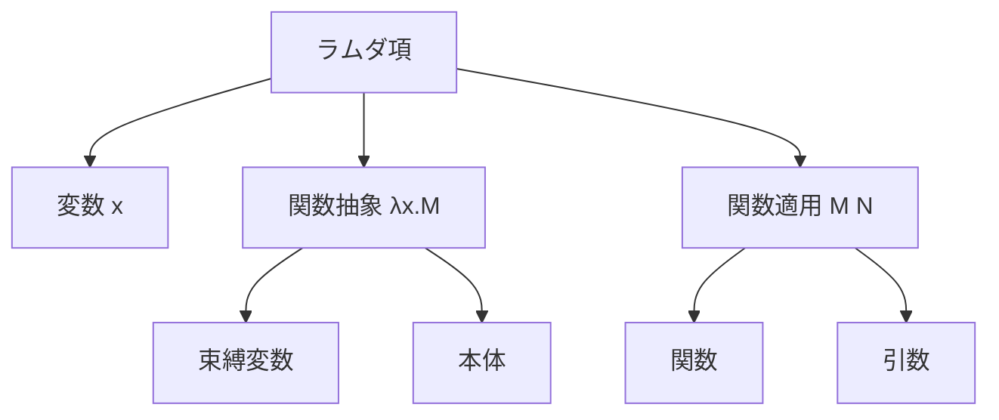
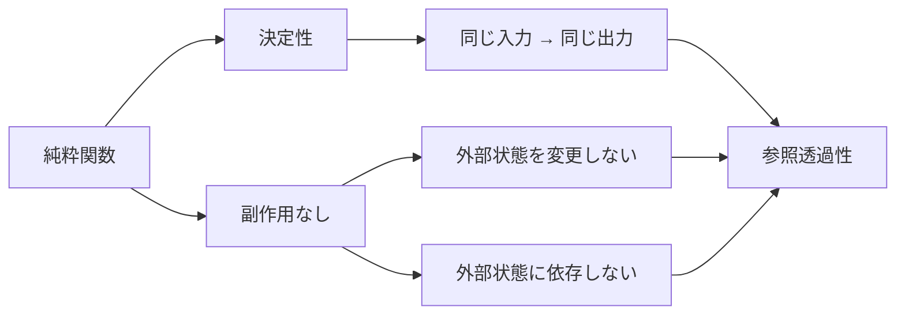
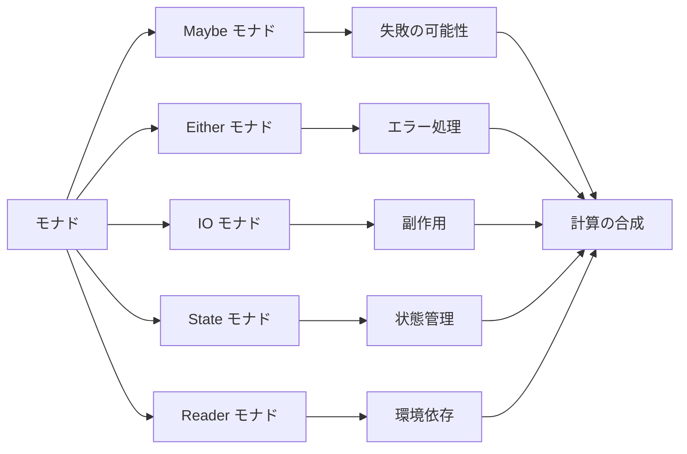
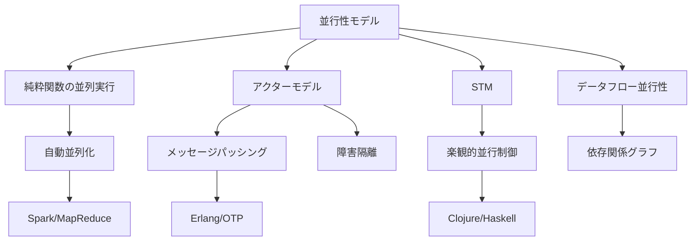
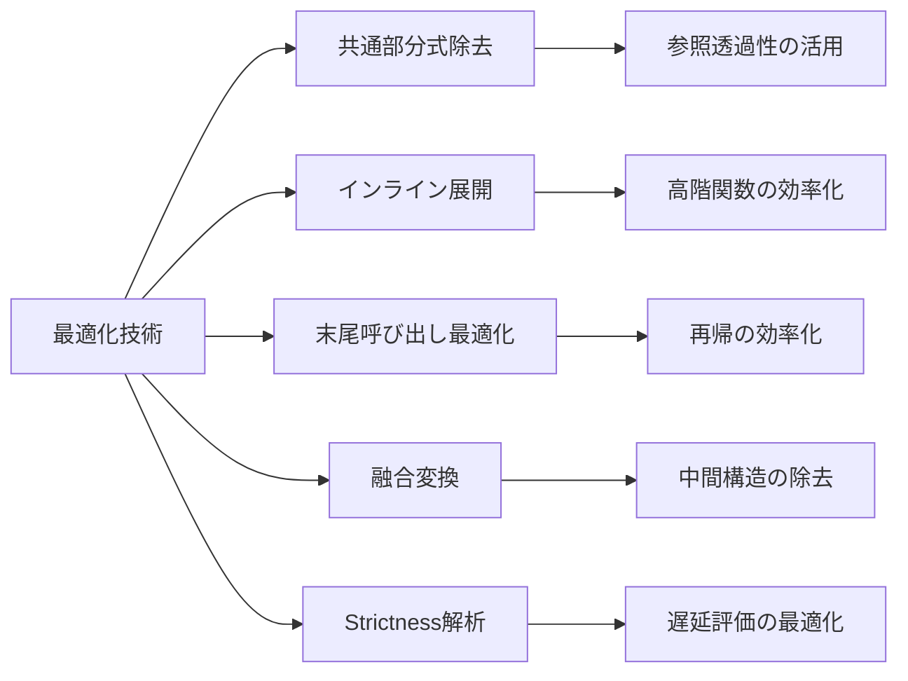

# 関数型プログラミング

関数型プログラミングは、計算を数学的関数の評価として扱い、状態の変更や可変データを避けるプログラミングパラダイムである。1930年代のアロンゾ・チャーチによるラムダ計算[^1]に理論的基礎を持ち、1950年代後半のLISP[^2]の登場以来、プログラミング言語設計と計算理論の両面で重要な役割を果たしてきた。現代においては、並行処理の複雑性への対処、プログラムの正確性の保証、コードの再利用性の向上といった観点から、その重要性が再認識されている。

## ラムダ計算と理論的基礎

関数型プログラミングの理論的基盤となるラムダ計算は、関数の定義と適用のみで計算を表現する形式体系である。ラムダ計算における項は以下の3つの形式で構成される。



変数は単純な識別子であり、関数抽象 $\lambda x.M$ は引数 $x$ を受け取って本体 $M$ を返す関数を表現する。関数適用 $M\ N$ は関数 $M$ に引数 $N$ を適用する操作を表す。この単純な体系が、チューリングマシンと同等の計算能力を持つことが証明されており[^3]、これがチャーチ＝チューリングのテーゼの基礎となっている。

β簡約と呼ばれる計算規則により、$(\lambda x.M)\ N$ は $M[x := N]$（$M$ 中の自由な $x$ を $N$ で置換）に簡約される。この過程で変数の捕獲を避けるためのα変換や、関数の外延性を保証するη変換といった規則も定義される。これらの変換規則が、関数型プログラミング言語における評価戦略の理論的基礎を提供している。

## 純粋性と参照透過性

関数型プログラミングの中核的概念である純粋性は、関数が同じ入力に対して常に同じ出力を返し、かつ副作用を持たないという性質を指す。この性質は参照透過性と密接に関連しており、プログラム中の任意の式をその評価結果で置き換えても、プログラムの意味が変わらないことを保証する。



参照透過性がもたらす利点は多岐にわたる。まず、プログラムの理解が容易になる。関数の振る舞いがその定義のみから完全に決定されるため、コードの局所的な理解が可能となる。また、等式推論によるプログラムの変換が可能となり、最適化やリファクタリングの正当性を数学的に保証できる。さらに、関数の実行順序に依存しないため、並列実行の機会を自動的に見出すことが可能となる。

しかし、現実のプログラムでは入出力、状態の更新、例外処理といった副作用が不可欠である。純粋関数型言語はこれらの副作用をモナドやエフェクトシステムといった抽象化により扱う。Haskellにおけるモナド[^4]は、副作用を型システムで明示的に追跡し、純粋性を保ちながら実用的なプログラムを記述することを可能にしている。

## 型システムと型推論

関数型プログラミング言語の多くは、強力な静的型システムを備えている。特に、Hindley-Milner型システム[^5]は、型注釈なしで多相的な型を推論できる実用的な型システムとして広く採用されている。このシステムは、最も一般的な型（principal type）を自動的に導出し、型安全性を保証しながらプログラマの負担を軽減する。

型推論のアルゴリズムは、制約生成と単一化の2段階で構成される。まず、プログラムの各部分から型制約を生成し、次にこれらの制約を満たす最も一般的な代入を見つける。このプロセスは、以下のような推論規則に基づいて行われる。

$$\frac{\Gamma \vdash e_1 : \tau_1 \rightarrow \tau_2 \quad \Gamma \vdash e_2 : \tau_1}{\Gamma \vdash e_1\ e_2 : \tau_2}$$

この規則は関数適用の型付けを示しており、関数 $e_1$ の型が $\tau_1 \rightarrow \tau_2$ で、引数 $e_2$ の型が $\tau_1$ ならば、適用結果の型は $\tau_2$ となることを表している。

現代の関数型言語は、Hindley-Milner型システムを様々な方向に拡張している。型クラス（Haskell）、モジュールシステム（ML系言語）、依存型（Agda、Idris）、線形型（Rust、Linear Haskell）などがその例である。これらの拡張は、より表現力の高い型システムを提供する一方で、型推論の決定可能性や効率性とのトレードオフを伴う。

## 高階関数と関数合成

高階関数は、関数を引数として受け取るか、関数を返り値として返す関数である。これは関数型プログラミングにおける抽象化の主要な手段であり、コードの再利用性と表現力を大幅に向上させる。map、filter、foldといった基本的な高階関数は、リスト処理の共通パターンを抽象化し、宣言的なプログラミングスタイルを可能にする。

```mermaid
graph TD
    A[高階関数] --> B[map: (a → b) → [a] → [b]]
    A --> C[filter: (a → Bool) → [a] → [a]]
    A --> D[fold: (a → b → b) → b → [a] → b]
    B --> E[要素の変換]
    C --> F[要素の選択]
    D --> G[構造の畳み込み]
    G --> H[リストの総和]
    G --> I[リストの連結]
    G --> J[任意の集約操作]
```

関数合成は、複数の関数を組み合わせて新しい関数を作る操作である。数学的には $(f \circ g)(x) = f(g(x))$ として定義され、プログラムの構造を簡潔に表現する。ポイントフリースタイルと呼ばれる記法では、引数を明示せずに関数の合成のみでプログラムを記述する。これにより、データの流れよりも変換の連鎖に焦点を当てたプログラミングが可能となる。

カリー化は、複数引数の関数を単一引数の関数の連鎖に変換する技法である。これにより部分適用が可能となり、関数の再利用性が向上する。理論的には、カリー・ハワード同型対応[^6]により、カリー化された関数の型は論理における含意に対応し、プログラムと証明の深い関係を示している。

## 遅延評価と無限データ構造

遅延評価は、式の評価を実際に値が必要になるまで遅延させる評価戦略である。これにより、無限データ構造の扱いが可能となり、必要な部分のみを計算することで効率的なプログラムが記述できる。Haskellのような遅延評価を採用する言語では、無限リストや循環データ構造を自然に扱うことができる。

```haskell
-- 無限リストの例（概念理解のための最小限のコード）
fibs = 0 : 1 : zipWith (+) fibs (tail fibs)
```

この定義は、フィボナッチ数列を無限リストとして表現している。遅延評価により、実際にアクセスされる要素のみが計算され、メモリ効率的な実装となる。

遅延評価は、制御構造の抽象化も可能にする。短絡評価を自然に実現し、条件分岐や繰り返しといった制御構造をユーザー定義関数として実装できる。しかし、遅延評価には空間計算量の予測が困難になるという欠点もある。サンクと呼ばれる未評価の式が蓄積され、予期しないメモリ使用量の増大を引き起こす可能性がある。

正格評価と遅延評価のトレードオフは、関数型言語設計における重要な選択である。MLやOCamlは正格評価を採用し、予測可能な性能特性を提供する。一方、Haskellは遅延評価を採用し、より高い抽象度を実現している。現代の言語では、両者の利点を活かすため、明示的な遅延評価機構や正格性注釈を提供することが一般的である。

## 代数的データ型とパターンマッチング

代数的データ型は、直積型（タプル、レコード）と直和型（バリアント、列挙型）を組み合わせてデータ構造を定義する方法である。これは型理論における基本的な構成要素であり、複雑なデータ構造を型安全に表現することを可能にする。

```mermaid
graph TD
    A[代数的データ型] --> B[直積型]
    A --> C[直和型]
    B --> D[タプル (A, B)]
    B --> E[レコード {x: A, y: B}]
    C --> F[バリアント A | B]
    C --> G[Option型 None | Some a]
    C --> H[Result型 Ok a | Err e]
    F --> I[網羅的パターンマッチング]
    G --> J[null安全性]
    H --> K[エラー処理]
```

パターンマッチングは、代数的データ型の値を分解し、その構造に基づいて処理を分岐させる機構である。これにより、データの構造と処理を密接に結びつけた、表現力の高いプログラムが記述できる。コンパイラは、パターンの網羅性と重複をチェックし、実行時エラーを防ぐ。

代数的データ型とパターンマッチングの組み合わせは、型安全なエラー処理を可能にする。Option型やResult型といったデータ型により、nullや例外を使わずにエラーを表現できる。これらの型は、モナド的な操作と組み合わせることで、エラー処理を含む複雑な制御フローを簡潔に記述できる。

再帰的な代数的データ型は、リストや木といった再帰的データ構造を自然に表現する。これらのデータ型に対する構造的再帰は、数学的帰納法に対応し、プログラムの正当性を推論しやすくする。また、一般化された代数的データ型（GADT）[^7]は、より精密な型情報を保持し、型レベルでの計算を可能にする。

## モナドと計算の抽象化

モナドは、計算の文脈や効果を抽象化する強力な設計パターンである。圏論における概念を基礎とし、様々な計算パターンを統一的に扱うことを可能にする。モナドは、型コンストラクタ `M`、`return`（または`pure`）関数、`bind`（`>>=`）演算子の組で定義され、以下のモナド則を満たす必要がある。

```
左単位則: return a >>= f ≡ f a
右単位則: m >>= return ≡ m
結合則: (m >>= f) >>= g ≡ m >>= (λx. f x >>= g)
```

これらの法則は、モナド的計算の合成が結合的であり、`return`が単位元として振る舞うことを保証する。



モナドの実用的な側面として、do記法（Haskell）やfor内包表記（Scala）といった糖衣構文により、命令型プログラミングに似た直感的な記述が可能となる。これにより、純粋関数型の枠組みの中で、状態を持つ計算や入出力を扱うことができる。

モナド変換子は、複数のモナドを組み合わせて使用することを可能にする。これにより、エラー処理、状態管理、非同期処理といった複数の効果を組み合わせた複雑な計算を表現できる。しかし、モナド変換子の積み重ねは性能上のオーバーヘッドを生じさせることがあり、代替手段としてエフェクトシステムやフリーモナドといったアプローチも研究されている。

## 永続データ構造と効率性

関数型プログラミングでは、データの不変性を保つため、更新操作は新しいデータ構造を作成する。永続データ構造[^8]は、この操作を効率的に行うために設計されたデータ構造である。構造共有により、変更されない部分を元のデータ構造と共有し、メモリ使用量と計算時間を削減する。

永続データ構造の実装には、パスコピーやファットノードといった技法が用いられる。例えば、永続的な平衡二分探索木では、更新時に根から変更箇所までのパスのみをコピーし、それ以外の部分は元の木と共有する。これにより、$O(\log n)$の時間計算量で更新操作を実現できる。

```mermaid
graph TD
    A[永続データ構造] --> B[構造共有]
    A --> C[コピーオンライト]
    B --> D[メモリ効率]
    B --> E[履歴の保持]
    C --> F[遅延コピー]
    D --> G[O(log n) 更新]
    E --> H[アンドゥ/リドゥ]
    E --> I[バージョン管理]
    F --> J[実装の複雑性]
```

Hash Array Mapped Trie（HAMT）[^9]は、効率的な永続マップの実装として広く採用されている。32方向の分岐を持つトライ構造により、実質的に定数時間での検索、挿入、削除を実現する。ClojureやScalaのイミュータブルコレクションは、HAMTを基礎として実装されている。

永続データ構造は、並行プログラミングにおいても重要な役割を果たす。データの不変性により、ロックなしで複数のスレッドから安全にアクセスできる。また、Software Transactional Memory（STM）との組み合わせにより、複雑な並行制御を簡潔に記述できる。

## 並行性と並列性

関数型プログラミングの純粋性と不変性は、並行・並列プログラミングに自然に適合する。副作用がないため、関数の実行順序に依存せず、自動的な並列化の機会が豊富に存在する。また、データ競合が原理的に発生しないため、並行プログラムの正確性を推論しやすい。

アクターモデル[^10]は、並行計算の数学的モデルであり、ErlangやAkkaで採用されている。各アクターは独立した計算主体であり、メッセージパッシングによってのみ通信する。この隔離性により、障害の局所化と耐障害性の向上が実現される。



関数型リアクティブプログラミング（FRP）は、時間とともに変化する値を扱うための抽象化である。イベントストリームと時変値を一級の値として扱い、宣言的に反応的なシステムを記述できる。これは、ユーザーインターフェース、ゲーム、リアルタイムシステムの実装に適している。

並列コレクション操作は、データ並列性を活用する実用的なアプローチである。map、filter、reduceといった操作を並列化することで、マルチコアプロセッサの性能を効果的に活用できる。これらの操作の結合性と交換性により、自動的な並列化が可能となる。

## 最適化技術とコンパイラ

関数型言語のコンパイラは、純粋性と参照透過性を活用した強力な最適化を行う。共通部分式の除去、インライン展開、部分評価といった最適化は、副作用がないことで安全に適用できる。また、遅延評価の場合は、strictness解析により不要なサンクの生成を避ける最適化が行われる。

末尾呼び出し最適化は、再帰的な関数をループと同等の効率で実行することを可能にする。これにより、関数型プログラミングの自然なスタイルである再帰を、スタックオーバーフローの心配なく使用できる。Scheme言語仕様[^11]では、この最適化が必須要件として定められている。

融合変換（fusion transformation）は、中間データ構造の生成を避ける最適化技術である。例えば、`map f . map g`を`map (f . g)`に変換することで、中間リストの生成を回避できる。GHCのstream fusionやClojureのtransducerは、この原理に基づいて実装されている。



部分評価とステージングは、プログラムの一部を実行時ではなくコンパイル時に評価する技術である。これにより、ドメイン特化言語の効率的な実装や、高性能な数値計算コードの生成が可能となる。MetaOCamlやScala LMSは、型安全なステージングを提供する。

## 実践的な設計パターン

関数型プログラミングにおける設計パターンは、オブジェクト指向のそれとは異なる形を取る。多くの古典的なデザインパターンは、高階関数や型システムの機能により不要となるか、より簡潔に表現される。一方で、関数型特有のパターンも存在する。

レンズパターンは、不変データ構造の深い階層にアクセスし更新するための抽象化である。関数合成により、複雑なデータ構造の一部分に焦点を当てた操作を構築できる。これは、大規模なアプリケーションにおけるデータ管理を大幅に簡素化する。

タグレスファイナルスタイルは、型クラスを用いて抽象構文木を定義せずにDSLを実装する技法である。これにより、複数の解釈を持つ柔軟なDSLを、型安全に実装できる。効果的な抽象化と実行時性能の両立が可能となる。

依存性注入は、関数型プログラミングではReaderモナドや暗黙的パラメータにより実現される。これにより、設定や環境への依存を明示的に管理し、テスタビリティを向上させる。型システムにより依存関係が明確になり、保守性が向上する。

[^1]: Church, A. (1936). "An Unsolvable Problem of Elementary Number Theory". American Journal of Mathematics, 58(2), 345-363.

[^2]: McCarthy, J. (1960). "Recursive functions of symbolic expressions and their computation by machine, Part I". Communications of the ACM, 3(4), 184-195.

[^3]: Turing, A. M. (1937). "Computability and λ-definability". The Journal of Symbolic Logic, 2(4), 153-163.

[^4]: Wadler, P. (1995). "Monads for functional programming". In Advanced Functional Programming, First International Spring School on Advanced Functional Programming Techniques-Tutorial Text (pp. 24-52). Springer-Verlag.

[^5]: Hindley, R. (1969). "The Principal Type-Scheme of an Object in Combinatory Logic". Transactions of the American Mathematical Society, 146, 29-60.

[^6]: Howard, W. A. (1980). "The formulae-as-types notion of construction". In To H. B. Curry: Essays on Combinatory Logic, Lambda Calculus and Formalism (pp. 479-490). Academic Press.

[^7]: Peyton Jones, S., Vytiniotis, D., Weirich, S., & Washburn, G. (2006). "Simple unification-based type inference for GADTs". ACM SIGPLAN Notices, 41(9), 50-61.

[^8]: Okasaki, C. (1998). "Purely Functional Data Structures". Cambridge University Press.

[^9]: Bagwell, P. (2001). "Ideal Hash Trees". Technical Report, École Polytechnique Fédérale de Lausanne.

[^10]: Hewitt, C., Bishop, P., & Steiger, R. (1973). "A universal modular ACTOR formalism for artificial intelligence". In Proceedings of the 3rd international joint conference on Artificial intelligence (pp. 235-245).

[^11]: Sperber, M., Dybvig, R. K., Flatt, M., & Van Straaten, A. (2009). "Revised6 Report on the Algorithmic Language Scheme". Journal of Functional Programming, 19(S1), 1-301.