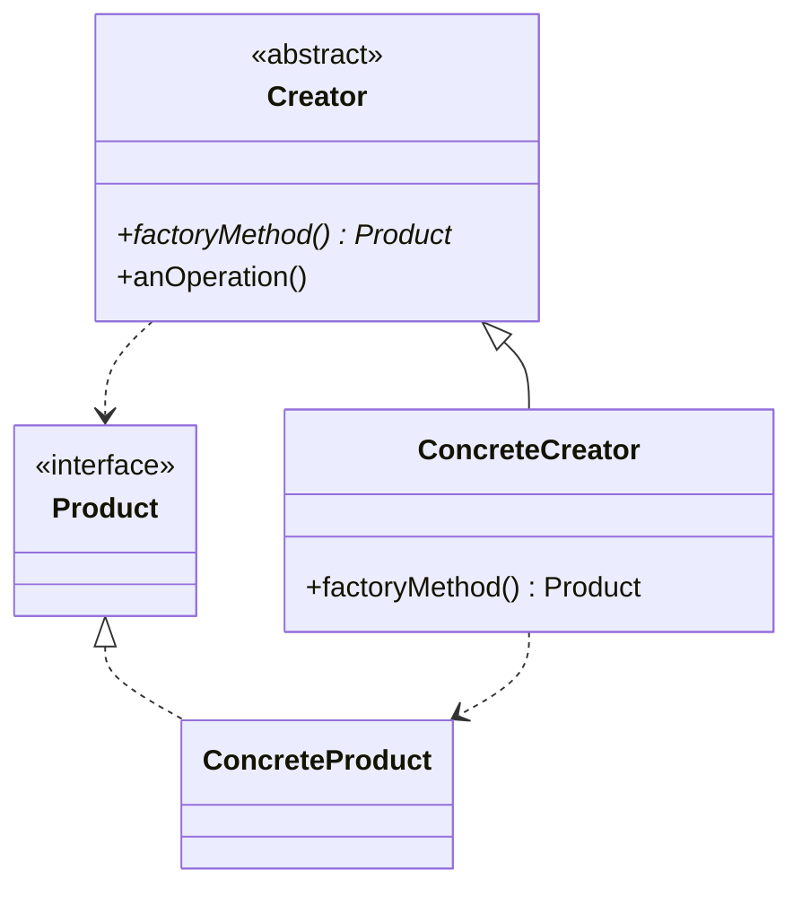
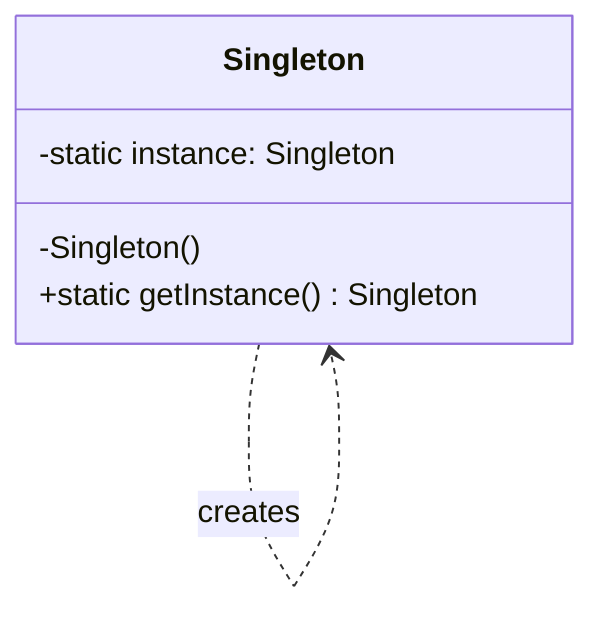
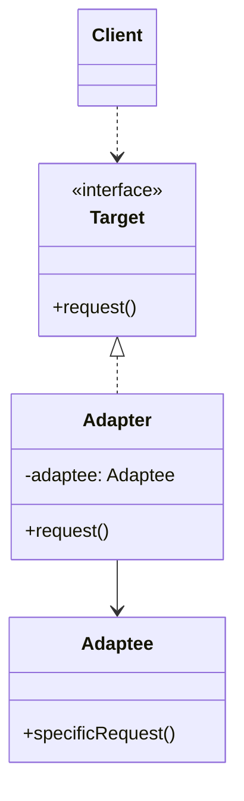
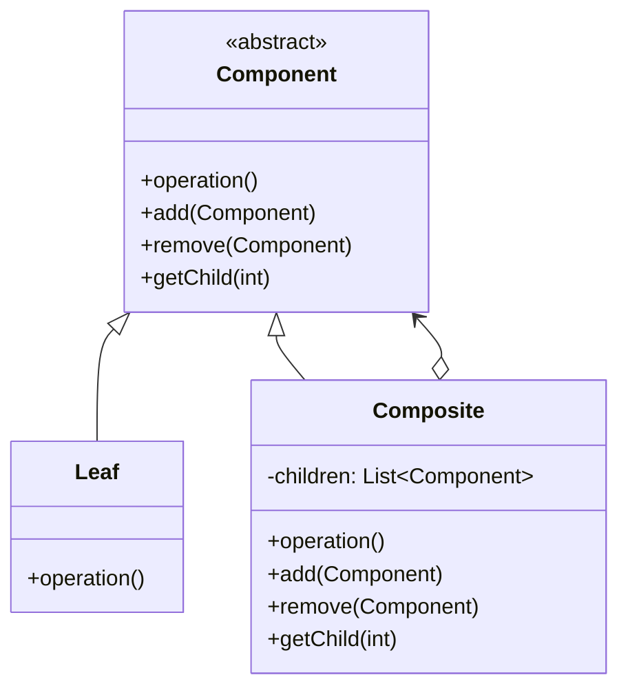
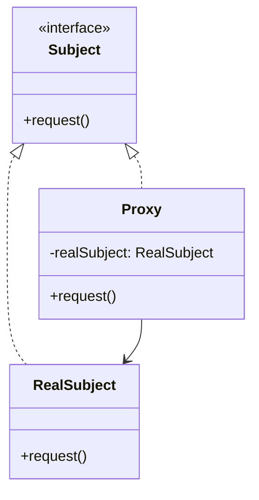
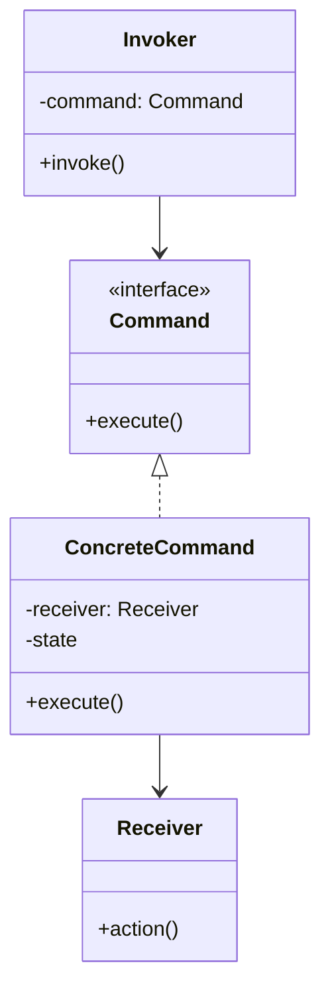
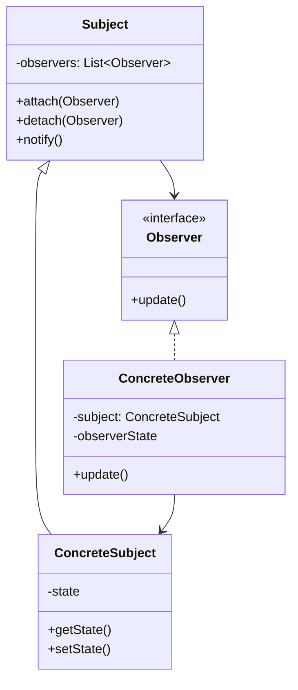
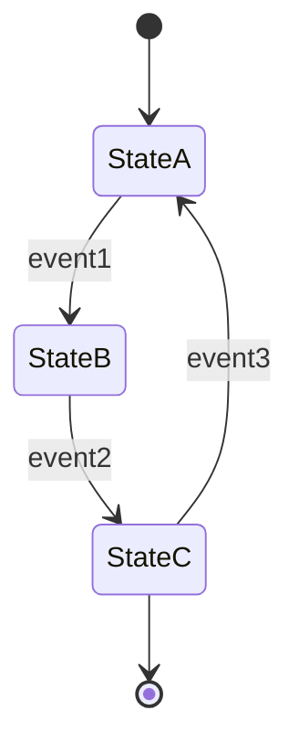
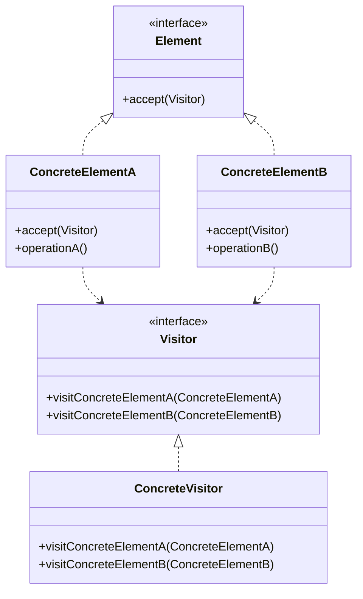

# GoF Design Patterns

デザインパターンという概念は、1994年にErich Gamma、Richard Helm、Ralph Johnson、John Vlissidesの4人によって体系化され、「Design Patterns: Elements of Reusable Object-Oriented Software」として出版された。この4人は「Gang of Four」（GoF）と呼ばれ、彼らが定義した23のパターンは現在でもオブジェクト指向設計の基礎として広く認識されている。

デザインパターンの本質は、繰り返し発生する設計上の問題に対する再利用可能な解決策の記述である。これらのパターンは、特定のプログラミング言語や実装技術に依存せず、抽象的なレベルで問題解決のアプローチを提供する。Christopher Alexanderの建築パターンの概念から着想を得て、ソフトウェア設計に適用されたこのアプローチは、開発者間の共通言語として機能し、設計の意図を明確に伝達する手段となっている[^1]。

## パターンの分類体系

GoFパターンは、その目的と適用範囲によって3つのカテゴリに分類される。生成に関するパターン（Creational Patterns）はオブジェクトの生成プロセスを抽象化し、構造に関するパターン（Structural Patterns）はクラスやオブジェクトの構成方法を扱い、振る舞いに関するパターン（Behavioral Patterns）はオブジェクト間の責任分担と相互作用を定義する。

```mermaid
graph TB
    GP["GoF Design Patterns"]
    CP["Creational Patterns"]
    SP["Structural Patterns"]
    BP["Behavioral Patterns"]
    
    GP --> CP
    GP --> SP
    GP --> BP
    
    CP --> AF["Abstract Factory"]
    CP --> B["Builder"]
    CP --> FM["Factory Method"]
    CP --> P["Prototype"]
    CP --> S["Singleton"]
    
    SP --> A["Adapter"]
    SP --> BR["Bridge"]
    SP --> C["Composite"]
    SP --> D["Decorator"]
    SP --> F["Facade"]
    SP --> FW["Flyweight"]
    SP --> PR["Proxy"]
    
    BP --> COR["Chain of Responsibility"]
    BP --> CMD["Command"]
    BP --> INT["Interpreter"]
    BP --> IT["Iterator"]
    BP --> MED["Mediator"]
    BP --> MEM["Memento"]
    BP --> OBS["Observer"]
    BP --> ST["State"]
    BP --> STR["Strategy"]
    BP --> TM["Template Method"]
    BP --> V["Visitor"]
```

この分類体系は単なる整理のための枠組みではなく、パターンの本質的な性質を反映している。生成パターンはシステムが「何を」生成するかではなく「どのように」生成するかに焦点を当て、構造パターンは静的な構成を、振る舞いパターンは動的な相互作用を扱う。

## 生成に関するパターン（Creational Patterns）

生成パターンの中核的な関心事は、オブジェクト生成の詳細を隠蔽し、システムを特定の実装から独立させることにある。これらのパターンは、直接的なオブジェクト生成（new演算子の使用）がもたらす結合度の問題に対処する。

### Factory Method パターン

Factory Methodパターンは、オブジェクト生成のためのインターフェースを定義し、実際にどのクラスのインスタンスを生成するかをサブクラスに委ねる。このパターンの本質は、生成の責任をクライアントコードから分離し、拡張に対して開かれた設計を実現することにある。

Factory Methodパターンの実装において重要なのは、生成ロジックの局所化である。これにより、新しい製品タイプの追加が既存コードの変更を最小限に抑えながら可能となる。ただし、このパターンは製品ごとに新しいサブクラスを必要とするため、クラス階層が複雑になる可能性がある。

### Abstract Factory パターン

Abstract Factoryパターンは、関連する一連のオブジェクトを生成するためのインターフェースを提供する。このパターンは、プラットフォーム固有の実装や、一貫性のあるオブジェクトファミリーの生成が必要な場合に特に有効である。

Abstract FactoryとFactory Methodの本質的な違いは、前者が複数の関連するオブジェクトの生成を扱うのに対し、後者は単一のオブジェクトの生成に焦点を当てる点にある。Abstract Factoryは、システム全体の一貫性を保証する強力な手段となるが、新しい製品タイプの追加には全てのファクトリー実装の変更が必要となるというトレードオフが存在する。

### Singleton パターン

Singletonパターンは、クラスのインスタンスが唯一であることを保証し、そのインスタンスへのグローバルなアクセスポイントを提供する。このパターンは単純に見えるが、マルチスレッド環境での実装、テスタビリティの問題、グローバル状態の管理など、多くの実装上の課題を含んでいる。

現代的な実装では、遅延初期化、ダブルチェックロッキング、初期化ホルダーパターンなど、様々な技法が用いられる。しかし、Singletonパターンの過度な使用は、隠れた依存関係を生み出し、システムの保守性を損なう可能性があるため、その使用は慎重に検討されるべきである。

### Builder パターン

Builderパターンは、複雑なオブジェクトの構築プロセスを、その表現から分離する。このパターンは、多数のパラメータを持つオブジェクトや、構築プロセスに複数のステップが必要なオブジェクトの生成において特に有効である。

Builderパターンの重要な特徴は、同じ構築プロセスで異なる表現を作成できることである。これにより、クライアントコードは構築の詳細から解放され、可読性の高いインターフェースを通じてオブジェクトを生成できる。現代的な実装では、メソッドチェーンを用いたフルエントインターフェースとして実装されることが多い。

### Prototype パターン

Prototypeパターンは、既存のインスタンスをコピーすることで新しいオブジェクトを生成する。このパターンは、オブジェクトの生成コストが高い場合や、生成プロセスが複雑な場合に特に有効である。

Prototypeパターンの実装における重要な考慮事項は、浅いコピーと深いコピーの区別である。参照型のフィールドを持つオブジェクトの場合、適切なコピー戦略の選択が不可欠となる。また、循環参照の処理やイミュータブルオブジェクトの扱いなど、実装上の課題も存在する。

## 構造に関するパターン（Structural Patterns）

構造パターンは、クラスやオブジェクトを組み合わせてより大きな構造を形成する方法を扱う。これらのパターンは、インターフェースの不一致の解決、機能の動的な追加、複雑な構造の単純化など、様々な構造的問題に対処する。

### Adapter パターン

Adapterパターンは、互換性のないインターフェースを持つクラスを協調動作させる。このパターンは、既存のクラスを新しいコンテキストで再利用する際に不可欠である。実装には、継承を用いるクラスアダプターと、コンポジションを用いるオブジェクトアダプターの2つのアプローチが存在する。

オブジェクトアダプターは、実行時に異なるAdapteeを扱える柔軟性を提供する一方、クラスアダプターはAdapteeの保護されたメンバーへのアクセスが可能という利点がある。選択は、具体的な要件とプログラミング言語の制約に依存する。

### Bridge パターン

Bridgeパターンは、抽象と実装を分離し、それぞれを独立に変更可能にする。このパターンは、実装の詳細が抽象の変更に影響を与えないようにすることで、システムの柔軟性を大幅に向上させる。

Bridgeパターンの本質は、「is-a」関係を「has-a」関係に置き換えることにある。これにより、継承による静的な結合を避け、実行時の動的な組み合わせを可能にする。このパターンは、プラットフォーム固有の実装を扱う場合や、複数の直交する次元で変化する可能性がある場合に特に有効である。

### Composite パターン

Compositeパターンは、オブジェクトを木構造に組み立て、個々のオブジェクトとオブジェクトの集合を同一視して扱える。このパターンは、部分-全体階層を表現する必要がある場合に自然な解決策を提供する。

Compositeパターンの実装における重要な設計決定は、子要素管理のインターフェースをどこに配置するかである。Componentインターフェースに配置すると透過性が向上するが、型安全性が犠牲になる。一方、Compositeクラスにのみ配置すると、クライアントコードで型チェックが必要になる。

### Decorator パターン

Decoratorパターンは、オブジェクトに動的に責任を追加する。このパターンは、継承による静的な機能拡張の代替として、より柔軟な拡張メカニズムを提供する。

Decoratorパターンの強力な特徴は、複数のデコレータを組み合わせて複雑な機能を構築できることである。各デコレータは単一の責任を持ち、それらを任意の順序で組み合わせることができる。ただし、多数のデコレータを使用すると、オブジェクトの識別が困難になり、デバッグが複雑になる可能性がある。

### Facade パターン

Facadeパターンは、複雑なサブシステムに対する統一された単純なインターフェースを提供する。このパターンは、サブシステムの複雑性を隠蔽し、クライアントとサブシステム間の結合度を低減する。

Facadeパターンの実装において重要なのは、適切な抽象レベルの選択である。過度に単純化されたファサードは、サブシステムの能力を十分に活用できない可能性がある一方、過度に複雑なファサードは、その存在意義を失う。また、ファサードは必要に応じてサブシステムへの直接アクセスを許可すべきかという設計上の選択も重要である。

### Flyweight パターン

Flyweightパターンは、多数の細粒度オブジェクトを効率的にサポートするため、共有を活用する。このパターンは、大量のオブジェクトがメモリ使用量の問題を引き起こす場合に有効である。

Flyweightパターンの核心は、内部状態（intrinsic state）と外部状態（extrinsic state）の分離にある。内部状態は共有可能で、Flyweightオブジェクト内に格納される。外部状態はコンテキスト依存で、クライアントによって管理される。この分離により、少数のFlyweightオブジェクトで多数の論理的オブジェクトを表現できる。

### Proxy パターン

Proxyパターンは、他のオブジェクトへのアクセスを制御するための代理オブジェクトを提供する。このパターンは、リモートプロキシ、仮想プロキシ、保護プロキシなど、様々な形態で実装される。

各種のプロキシは異なる目的を持つ。リモートプロキシはネットワーク越しのオブジェクトアクセスを透過的に扱い、仮想プロキシは高コストなオブジェクトの生成を遅延させ、保護プロキシはアクセス制御を実装する。現代的な実装では、動的プロキシやAOPフレームワークがこのパターンの実装を簡素化している。

## 振る舞いに関するパターン（Behavioral Patterns）

振る舞いパターンは、オブジェクト間の責任分担と、それらの間のコミュニケーションパターンに焦点を当てる。これらのパターンは、複雑な制御フローを管理し、オブジェクト間の結合度を低減する。

### Chain of Responsibility パターン

Chain of Responsibilityパターンは、要求を処理する可能性のある複数のオブジェクトを連鎖させ、要求を受信したオブジェクトが処理するか、連鎖内の次のオブジェクトに転送する。このパターンは、要求の送信者と受信者を分離し、複数のオブジェクトに要求処理の機会を与える。

このパターンの実装における重要な考慮事項は、連鎖の構築と管理である。連鎖は静的に構築することも、動的に変更することも可能である。また、要求が処理されない場合の扱いや、複数のハンドラーが要求を処理する場合の制御など、実装上の選択肢が存在する。

### Command パターン

Commandパターンは、要求をオブジェクトとしてカプセル化し、異なる要求、キュー、ログ、アンドゥ操作でクライアントをパラメータ化できるようにする。このパターンは、操作の実行を、その操作を知っているオブジェクトから分離する。

Commandパターンの強力な応用の一つは、アンドゥ/リドゥ機能の実装である。各コマンドオブジェクトは、実行前の状態を保存し、操作を取り消すためのunexecute()メソッドを提供できる。また、マクロコマンドの実装により、複数のコマンドを組み合わせて複雑な操作を構築することも可能である。

### Iterator パターン

Iteratorパターンは、集約オブジェクトの要素に順次アクセスする方法を提供し、その内部表現を公開しない。このパターンは、コレクションの走査を、コレクションの実装から分離する。

現代のプログラミング言語の多くは、言語レベルでイテレータをサポートしており、foreach構文や拡張forループとして実装されている。しかし、カスタムイテレータの実装は、特殊な走査順序や、走査中の要素のフィルタリングなど、高度な要件に対応する際に依然として有用である。

### Observer パターン

Observerパターンは、オブジェクト間の一対多の依存関係を定義し、あるオブジェクトの状態が変化したときに、その依存オブジェクトに自動的に通知される仕組みを提供する。このパターンは、Model-View-Controller（MVC）アーキテクチャの基礎となっている。

Observerパターンの実装における重要な課題は、通知の粒度とタイミングの制御である。過度に細かい通知は性能問題を引き起こし、過度に粗い通知は不要な更新を引き起こす。また、循環依存の防止、メモリリークの回避、マルチスレッド環境での同期など、実装上の考慮事項も多い。

### Strategy パターン

Strategyパターンは、アルゴリズムのファミリーを定義し、それらを交換可能にする。このパターンは、アルゴリズムを使用するクライアントから独立して、アルゴリズムを変更できるようにする。

Strategyパターンの本質は、継承による静的なアルゴリズムの選択を、コンポジションによる動的な選択に置き換えることである。これにより、実行時のアルゴリズム切り替えが可能となり、新しいアルゴリズムの追加も既存コードの変更なしに行える。ただし、クライアントが適切なストラテジーを選択する必要があるため、この責任の配置が設計上の重要な決定となる。

### Template Method パターン

Template Methodパターンは、操作のアルゴリズムの骨格を定義し、いくつかのステップをサブクラスに委ねる。このパターンは、アルゴリズムの構造を変えることなく、アルゴリズムの特定のステップを再定義できるようにする。

Template Methodパターンは、「ハリウッドの原則」（Don't call us, we'll call you）を体現している。親クラスが制御の流れを定義し、サブクラスは特定のステップの実装のみを提供する。このアプローチは、コードの重複を削減し、アルゴリズムの一貫性を保証するが、継承に基づくため、柔軟性に制限がある。

### State パターン

Stateパターンは、オブジェクトの内部状態が変化したときに、オブジェクトの振る舞いを変更できるようにする。このパターンは、状態遷移ロジックをカプセル化し、複雑な条件分岐を回避する。

Stateパターンの実装では、状態遷移の責任をどこに配置するかが重要な設計決定となる。状態オブジェクト自身が次の状態を決定する場合、各状態は他の状態を知る必要がある。一方、コンテキストオブジェクトが遷移を管理する場合、状態オブジェクトは独立性を保てるが、コンテキストが複雑になる可能性がある。

### Mediator パターン

Mediatorパターンは、オブジェクト群の相互作用をカプセル化するオブジェクトを定義する。このパターンは、オブジェクト間の多対多の関係を、メディエータを介した一対多の関係に変換する。

Mediatorパターンは、複雑な相互作用を持つシステムにおいて、オブジェクト間の結合度を大幅に削減する。各オブジェクトはメディエータのみを知り、他のオブジェクトを直接参照しない。ただし、メディエータ自体が複雑になりすぎる可能性があり、適切な責任分割が重要となる。

### Memento パターン

Mementoパターンは、オブジェクトの内部状態を保存し、後でその状態に復元できるようにする。このパターンは、カプセル化を破壊することなく、オブジェクトの状態のスナップショットを取得する。

Mementoパターンの実装における重要な考慮事項は、状態の保存コストとメモリ使用量である。完全な状態を保存する代わりに、差分のみを保存する増分メメントの実装や、必要に応じて古いメメントを削除するメモリ管理戦略が必要となる場合がある。

### Interpreter パターン

Interpreterパターンは、言語の文法表現と、その文法を使用して文を解釈するインタープリタを定義する。このパターンは、特定の問題領域に対するドメイン固有言語（DSL）の実装に適している。

Interpreterパターンは、単純な文法に対しては効果的だが、複雑な文法に対してはクラス階層が巨大になる傾向がある。そのため、このパターンは、文法が単純で、効率性が最重要でない場合に最も適している。複雑な言語の場合は、パーサージェネレータの使用が推奨される。

### Visitor パターン

Visitorパターンは、オブジェクト構造の要素に対して実行される操作を表現する。このパターンは、操作を定義するクラスを変更することなく、新しい操作を定義できるようにする。

Visitorパターンは、ダブルディスパッチを実現し、要素の型と訪問者の型の両方に基づいて適切な操作を選択する。このパターンは、要素クラスが安定しており、新しい操作を頻繁に追加する必要がある場合に最も効果的である。しかし、新しい要素クラスの追加は、全ての訪問者クラスの変更を必要とするため、このトレードオフを理解することが重要である。

## パターン間の関係性と組み合わせ

GoFパターンは独立して存在するのではなく、相互に関連し、組み合わせて使用されることが多い。例えば、Abstract FactoryパターンはしばしばFactory Methodパターンを使用して実装され、Prototypeパターンと組み合わせることも可能である。Compositeパターンは、IteratorパターンやVisitorパターンと自然に組み合わせられ、複雑な構造の走査と操作を可能にする。

パターンの組み合わせにおいて重要なのは、各パターンの責任範囲を明確に保つことである。過度に複雑な組み合わせは、システムの理解を困難にし、保守性を損なう可能性がある。パターンの選択と組み合わせは、具体的な問題領域と制約条件に基づいて慎重に行われるべきである。

## 現代的なソフトウェア開発における適用

GoFパターンが発表されてから約30年が経過し、ソフトウェア開発の環境は大きく変化した。関数型プログラミングの普及、並行プログラミングの重要性の増大、マイクロサービスアーキテクチャの登場など、新しいパラダイムが登場している。

これらの変化にもかかわらず、GoFパターンの基本的な原則は依然として有効である。ただし、その適用方法は進化している。例えば、関数型言語では、多くの振る舞いパターンが高階関数として自然に表現される。Strategyパターンは関数パラメータとして、Commandパターンはクロージャとして実装される。

並行プログラミングの文脈では、Singletonパターンのスレッドセーフな実装、Observerパターンの非同期通知、Proxyパターンを使用した並行アクセス制御など、新しい考慮事項が加わる。また、分散システムでは、これらのパターンがネットワーク境界を越えて適用され、新しい課題と解決策を生み出している。

マイクロサービスアーキテクチャでは、GoFパターンはサービス間の相互作用に適用される。例えば、API Gatewayは本質的にFacadeパターンの分散版であり、Service Meshは Proxyパターンの大規模な適用と見なすことができる。

## 実装における考慮事項

GoFパターンの実装において最も重要なのは、パターンの適用が目的ではなく、具体的な問題解決が目的であることを認識することである。パターンの過度な使用は「パターン病」と呼ばれ、不必要な複雑性をもたらす。各パターンには適用すべき文脈があり、その文脈を正しく識別することが成功の鍵となる。

パフォーマンスの観点からも、パターンの選択は重要である。例えば、Decoratorパターンの多層適用は、メソッド呼び出しのオーバーヘッドを増加させる。Flyweightパターンは、メモリ使用量を削減する一方で、外部状態の管理によるCPU使用量の増加をもたらす可能性がある。これらのトレードオフを理解し、システムの要件に基づいて適切な選択を行うことが重要である。

テスタビリティの観点では、多くのGoFパターンが依存性注入と自然に組み合わせられ、モックオブジェクトの使用を容易にする。特に、Strategy、State、Observerパターンは、テスト可能な設計を促進する。一方、Singletonパターンは、グローバル状態によりテストを困難にする傾向がある。

保守性の観点では、パターンの使用は設計意図を明確に伝達する効果がある。開発チーム内でパターンの語彙が共有されていれば、「ここではStrategyパターンを使用している」という一言で、設計の意図が伝わる。ただし、この効果は、チームメンバーがパターンを正しく理解していることが前提となる。

## 結論的考察

GoFデザインパターンは、オブジェクト指向設計の基礎的な語彙を提供し、繰り返し発生する設計問題に対する実証済みの解決策を示している。これらのパターンは、単なる実装テクニックではなく、ソフトウェア設計の本質的な原則を体現している。

パターンの真の価値は、具体的な実装詳細ではなく、問題解決のアプローチと、設計上の力の解決方法にある。各パターンは、特定のトレードオフを表現しており、これらのトレードオフを理解することが、適切なパターンの選択と適用の鍵となる。

現代のソフトウェア開発において、GoFパターンは進化し続けている。新しいプログラミングパラダイム、実行環境、アーキテクチャスタイルに適応しながら、その基本的な原則は有効性を保っている。重要なのは、パターンを教条的に適用するのではなく、その背後にある原則を理解し、具体的な文脈に応じて適切に適用することである。

最終的に、GoFパターンは、ソフトウェア設計者のツールボックスの重要な要素であり続ける。これらのパターンを理解し、適切に適用する能力は、高品質なソフトウェアシステムの構築に不可欠である。しかし、パターンはあくまでも手段であり、目的は常に、保守可能で、拡張可能で、理解しやすいソフトウェアの構築であることを忘れてはならない。

[^1]: Gamma, E., Helm, R., Johnson, R., & Vlissides, J. (1994). Design Patterns: Elements of Reusable Object-Oriented Software. Addison-Wesley Professional.