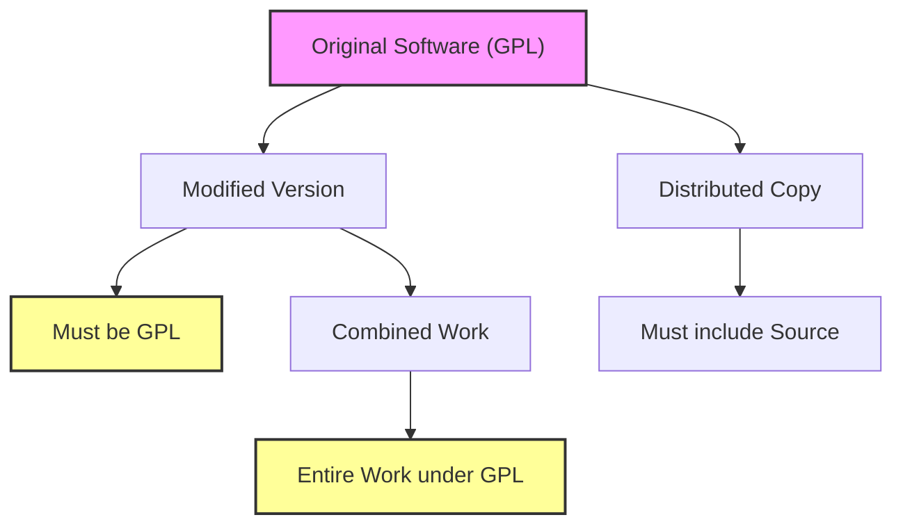
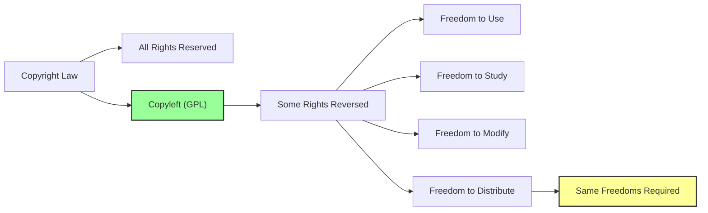
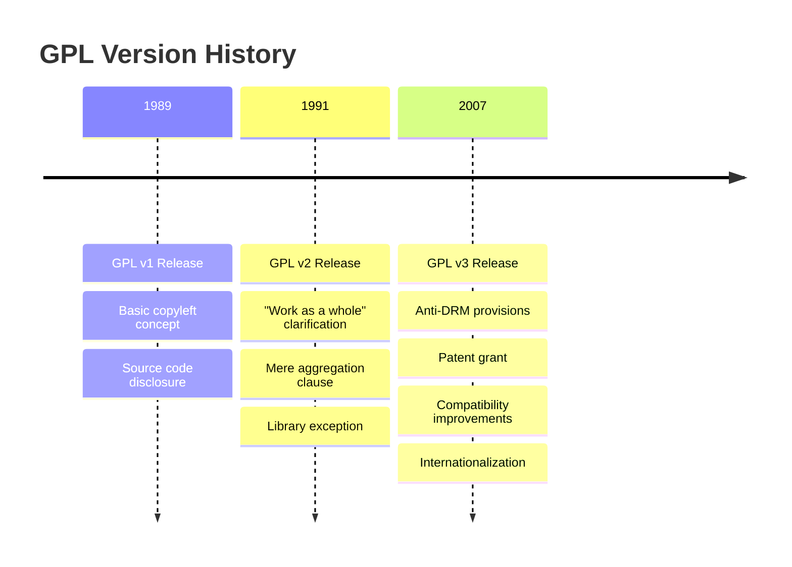
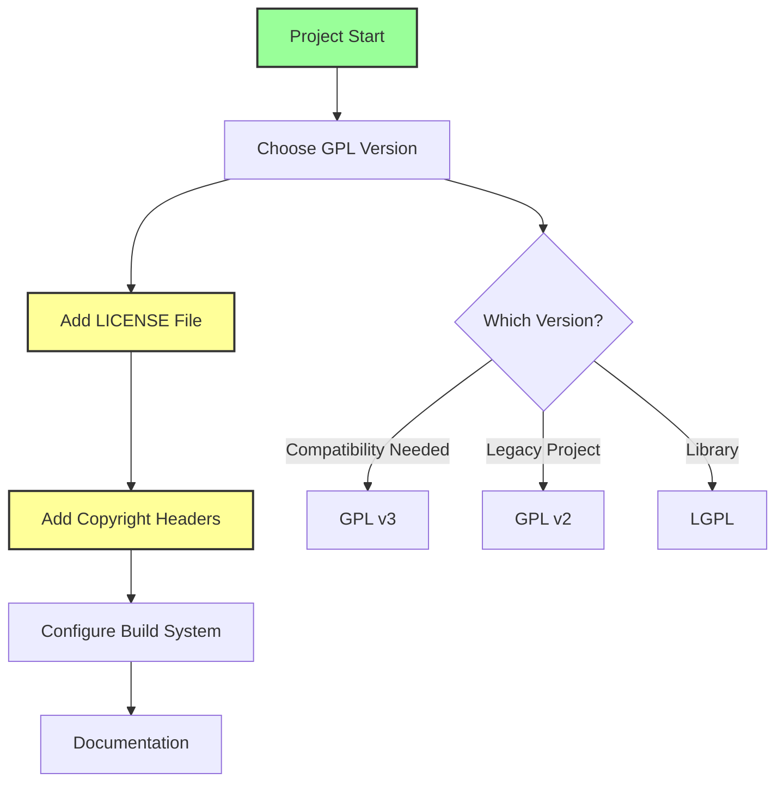
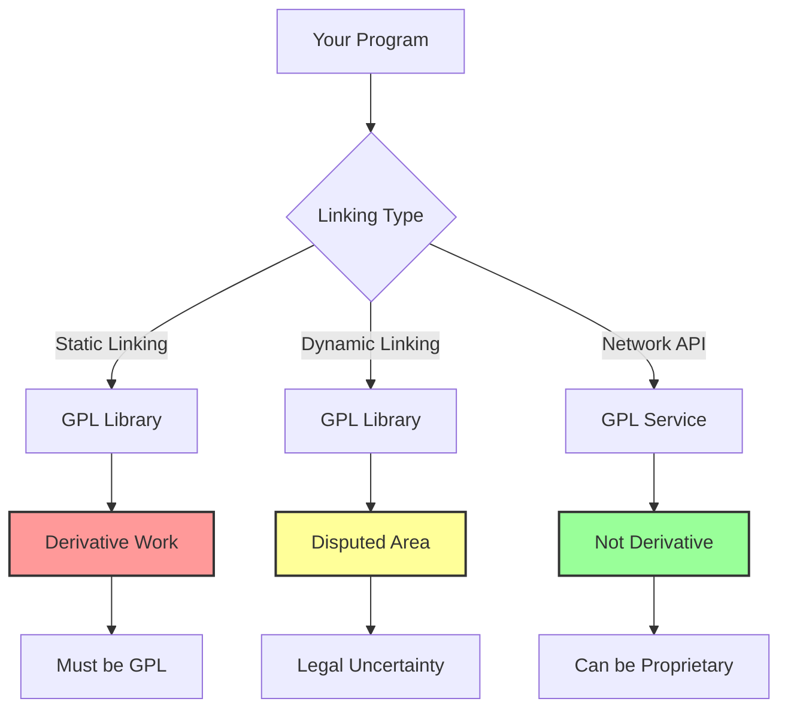
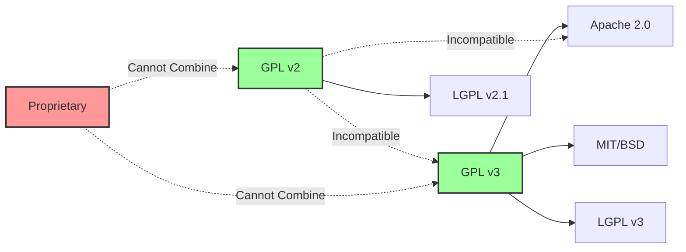
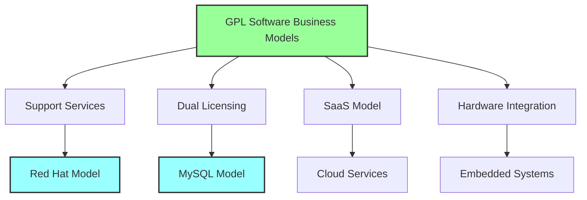
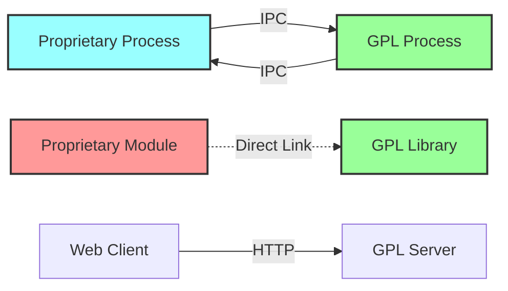

# GPL

GNU General Public License（GPL）は、自由ソフトウェア財団（Free Software Foundation、FSF）によって策定されたソフトウェアライセンスであり、ソフトウェアの自由を保証することを目的としている。1989年にリチャード・ストールマンによって最初のバージョンが公開されて以来、オープンソースソフトウェアの世界において最も影響力のあるライセンスの一つとなっている。GPLの核心は「コピーレフト」という概念にあり、これは著作権法を利用してソフトウェアの自由を永続的に保証する仕組みである。



## 自由ソフトウェアの思想とGPLの誕生

GPLの理解には、まず自由ソフトウェア運動の背景を把握することが不可欠である。1970年代まで、ソフトウェアは主にハードウェアの付属品として扱われ、研究者や技術者の間で自由に共有されていた。しかし、1980年代に入ると、ソフトウェアの商業化が進み、プロプライエタリなライセンスが主流となった。この状況に対して、MITの研究者であったリチャード・ストールマンは、ソフトウェアの自由を取り戻すべく、1983年にGNUプロジェクトを立ち上げた[^1]。

ストールマンが定義する「自由ソフトウェア」とは、以下の4つの自由を利用者に保証するソフトウェアを指す：

0. プログラムを目的を問わず実行する自由
1. プログラムの動作を研究し、必要に応じて改造する自由
2. 複製物を再配布する自由
3. プログラムを改良し、改良版を公開する自由

これらの自由を法的に保証するために考案されたのがGPLである。従来の著作権法は、著作物の複製や改変を制限することで著作者の権利を保護するが、GPLは逆に、これらの行為を明示的に許可し、さらに派生物にも同じ自由を要求することで、ソフトウェアの自由を永続的に保証する。

## コピーレフトのメカニズム

コピーレフトは、GPLの最も特徴的な要素であり、その仕組みは巧妙である。通常の著作権（コピーライト）が「複製する権利」を制限するのに対し、コピーレフトは著作権法の枠組みを利用しながら、逆に複製や改変の自由を保証し、その自由が派生物にも継承されることを要求する。



GPLライセンスの下でソフトウェアを受け取った者は、そのソフトウェアを自由に使用、研究、改変、再配布することができる。しかし、改変版を配布する場合、その改変版も必ずGPLライセンスの下で公開しなければならない。これにより、一度GPLライセンスで公開されたソフトウェアは、その派生物も含めて永続的に自由ソフトウェアとして維持される。

この仕組みは「ウイルス的」と批判されることもある。なぜなら、GPLライセンスのソフトウェアを組み込んだプログラムは、全体がGPLライセンスに「感染」し、そのソースコードを公開する義務が生じるからである。しかし、これは設計思想に基づく意図的な特徴であり、ソフトウェアの自由を保護するための核心的なメカニズムである。

## GPLのバージョンと進化

GPLは時代の変化に応じて改訂されており、現在までに3つの主要なバージョンが存在する。各バージョンは、新たな技術的・法的課題に対応するために策定された。

### GPL v1（1989年）

最初のGPLは1989年2月に公開された[^2]。このバージョンは基本的なコピーレフトの概念を確立し、ソフトウェアの自由を保証する法的枠組みを提供した。主な特徴として、ソースコードの公開義務、改変版の同一ライセンスでの配布要求、無保証条項などが含まれていた。

### GPL v2（1991年）

GPL v2は1991年6月に公開され、v1の曖昧な部分を明確化し、より広範な状況に対応できるよう改良された[^3]。このバージョンで導入された重要な概念の一つが「作品全体」（work as a whole）の定義である。GPLライセンスのコードを含むプログラムは、その全体がGPLの条件に従わなければならないことが明確化された。

また、「mere aggregation」条項により、単に同じ記憶媒体に収録されているだけの独立したプログラムは、GPLの影響を受けないことも明記された。これにより、Linuxディストリビューションのようなソフトウェアコレクションにおいて、GPLソフトウェアと非GPLソフトウェアが共存できることが保証された。

### GPL v3（2007年）

GPL v3は2007年6月29日に公開され、デジタル著作権管理（DRM）、ソフトウェア特許、ライセンス互換性など、21世紀の新たな課題に対応した[^4]。このバージョンの策定には18ヶ月の公開討論期間が設けられ、世界中の開発者、企業、法律専門家からの意見が反映された。



GPL v3の主要な改良点には以下が含まれる：

**DRM対策条項**：GPL v3は、GPLソフトウェアを使用したシステムにおいて、ユーザーが改変版を実行する能力を技術的に制限することを禁止している。これは、TiVoのような機器がGPLソフトウェアを使用しながら、デジタル署名によってユーザーの改変版の実行を阻止する「TiVo化」への対応である。

**特許条項の強化**：GPL v3では、GPLソフトウェアの配布者は、自動的にその配布に必要な特許ライセンスを付与することが明確化された。また、特許訴訟を起こした場合のライセンス終了条項も追加された。

**国際化**：GPL v2がアメリカ法を前提としていたのに対し、GPL v3は各国の法制度の違いを考慮し、より国際的に適用可能な文言に改められた。

**互換性の改善**：Apache License 2.0など、他の主要なオープンソースライセンスとの互換性が改善された。

## ライセンスの技術的適用

GPLをソフトウェアプロジェクトに適用する際には、いくつかの技術的な手順を踏む必要がある。単にライセンス文書を添付するだけでは不十分であり、適切な著作権表示とライセンス通知を各ソースファイルに含める必要がある。



標準的なGPLヘッダーは以下のような形式を取る：

```
Copyright (C) <year> <name of author>

This program is free software: you can redistribute it and/or modify
it under the terms of the GNU General Public License as published by
the Free Software Foundation, either version 3 of the License, or
(at your option) any later version.

This program is distributed in the hope that it will be useful,
but WITHOUT ANY WARRANTY; without even the implied warranty of
MERCHANTABILITY or FITNESS FOR A PARTICULAR PURPOSE. See the
GNU General Public License for more details.

You should have received a copy of the GNU General Public License
along with this program. If not, see <https://www.gnu.org/licenses/>.
```

プロジェクトのルートディレクトリには、GPL全文を含むLICENSEファイルまたはCOPYINGファイルを配置する。また、READMEファイルにライセンス情報を明記し、ソースコードの入手方法を説明することも推奨される。

## 派生物とリンキングの問題

GPLの適用において最も複雑な問題の一つが、何が「派生物」（derivative work）に該当するかという点である。この判断は、GPLの「感染性」がどこまで及ぶかを決定する重要な要素となる。

静的リンキングの場合、GPLライブラリをリンクしたプログラムは一般的に派生物とみなされ、全体がGPLの対象となる。一方、動的リンキングについては解釈が分かれており、FSFは動的リンキングも派生物を形成すると主張しているが、この見解には異論も存在する。



この問題に対処するため、FSFはライブラリ用のライセンスとしてLGPL（Lesser General Public License）を策定した。LGPLは、ライブラリ自体の改変にはコピーレフトを適用するが、そのライブラリを使用するプログラムには適用しないという、より緩やかな条件を提供している。

システムライブラリ例外も重要な概念である。GPL v3では、「システムライブラリ」（オペレーティングシステムやコンパイラに通常含まれるライブラリ）とのリンクは、派生物を形成しないことが明確化されている。これにより、GPLプログラムをプロプライエタリなオペレーティングシステム上で実行することが可能となっている。

## ライセンス両立性の課題

オープンソースソフトウェアの世界には多数のライセンスが存在し、それらの間の両立性は複雑な問題となっている。GPLは強いコピーレフト条項を持つため、他のライセンスとの組み合わせには制約がある。



GPL v2とGPL v3の間には互換性がないため、異なるバージョンのGPLでライセンスされたコードを組み合わせることはできない。この問題を回避するため、多くのプロジェクトは「GPL v2 or later」という形式でライセンスを指定し、将来のバージョンへの移行を可能にしている。

パーミッシブライセンス（MIT、BSD、Apache等）のコードは、一般的にGPLプロジェクトに組み込むことができる。しかし、結果として生成される作品全体はGPLライセンスに従う必要がある。逆に、GPLコードをパーミッシブライセンスのプロジェクトに組み込むことはできない。

## 法的側面と判例

GPLの法的有効性は、世界各国の裁判所で検証されており、概ね支持されている。ドイツでは、2004年のNetfilter/iptables事件において、GPLの法的拘束力が初めて司法的に確認された[^5]。アメリカでは、BusyBoxプロジェクトに関する一連の訴訟において、GPLの執行可能性が実証された。

GPLの執行において重要な役割を果たしているのが、Software Freedom Law Center（SFLC）やSoftware Freedom Conservancy（SFC）などの組織である。これらの組織は、GPL違反の調査、交渉、必要に応じて法的措置を取ることで、GPLの遵守を促進している。

GPL違反の典型的なパターンには以下が含まれる：

**ソースコードの非公開**：GPLソフトウェアを含む製品を配布しながら、対応するソースコードを提供しない。これは最も一般的な違反形態である。

**ライセンス通知の削除**：著作権表示やライセンス通知を削除または改変する行為は、GPLの明確な違反となる。

**追加的制限の付加**：GPLソフトウェアの使用や再配布に、GPLで許可されていない追加的な制限を課すこと。

違反が発見された場合、通常は以下のプロセスで解決が図られる：

1. 違反者への通知と是正要求
2. 協議による解決（ソースコード公開、ライセンス遵守の確約等）
3. 継続的な違反の場合、法的措置の検討
4. 裁判所での強制執行

## ビジネスモデルとGPL

GPLソフトウェアでビジネスを行うことは十分可能であり、実際に多くの成功例が存在する。Red Hat、SUSE、Canonicalなどの企業は、GPLソフトウェアを基盤としたビジネスモデルを確立している。



**サポートサービスモデル**：Red Hatに代表されるこのモデルでは、ソフトウェア自体は無料で提供し、企業向けのサポート、トレーニング、認証などのサービスで収益を得る。GPLはソフトウェアの販売を禁止していないため、便宜性のための配布料金を請求することも可能である。

**デュアルライセンシング**：MySQLが採用していたこのモデルでは、同じソフトウェアをGPLと商用ライセンスの両方で提供する。GPLを避けたい企業は商用ライセンスを購入し、コミュニティはGPL版を使用する。

**SaaSモデル**：ソフトウェアをサービスとして提供する場合、GPLの配布条項は適用されない。これは「ASPループホール」として知られ、AGPLはこの問題に対処するために作成された。

**付加価値統合**：GPLソフトウェアを特定のハードウェアやプロプライエタリなコンポーネントと統合し、総合的なソリューションとして提供する。

## 技術アーキテクチャへの影響

GPLの採用は、ソフトウェアのアーキテクチャ設計に大きな影響を与える。特に、プロプライエタリなコンポーネントとGPLコンポーネントを組み合わせる必要がある場合、慎重な設計が必要となる。

**プロセス分離アーキテクチャ**：GPLコンポーネントとプロプライエタリコンポーネントを別々のプロセスとして実行し、明確に定義されたインターフェース（ソケット、パイプ、ファイル等）で通信する。この方法により、GPLの「感染」を防ぐことができる。



**プラグインアーキテクチャ**：GPLアプリケーションにプロプライエタリなプラグインを追加する場合、プラグインインターフェースの設計が重要となる。明確に定義された、限定的なインターフェースを通じた疎結合な設計により、法的リスクを軽減できる。

**マイクロサービスアーキテクチャ**：各サービスを独立したプロセスとして実装し、ネットワークAPIで通信することで、ライセンスの境界を明確にできる。

## コミュニティダイナミクスとガバナンス

GPLプロジェクトのガバナンスは、そのコピーレフト性質により特別な考慮が必要となる。貢献者からの著作権譲渡（CLA: Contributor License Agreement）や、ライセンス変更の可能性について、プロジェクト開始時に明確な方針を定めることが重要である。

LinuxカーネルのようにGPL v2のみを採用しているプロジェクトでは、すべての貢献者の同意なしにライセンスを変更することは実質的に不可能である。一方、FSFが管理するGNUプロジェクトでは、貢献者に著作権をFSFに譲渡することを要求し、将来的なライセンス変更の柔軟性を確保している。

## パフォーマンスとセキュリティの考慮事項

GPLソフトウェアの採用は、直接的にはパフォーマンスに影響しないが、アーキテクチャの制約により間接的な影響が生じる可能性がある。プロセス間通信のオーバーヘッドや、最適化されたプロプライエタリライブラリを使用できないことによる性能低下などが考えられる。

セキュリティの観点では、GPLは透明性を促進する。ソースコードが公開されることで、セキュリティ監査が容易になり、脆弱性の発見と修正が迅速に行われる。「多くの目があればバグは浅い」というレイモンドの法則は、GPLプロジェクトにおいて特に有効である[^6]。

[^1]: Richard Stallman, "Free Software, Free Society: Selected Essays of Richard M. Stallman", GNU Press, 2002
[^2]: Free Software Foundation, "GNU General Public License, version 1", February 1989, https://www.gnu.org/licenses/old-licenses/gpl-1.0.html
[^3]: Free Software Foundation, "GNU General Public License, version 2", June 1991, https://www.gnu.org/licenses/old-licenses/gpl-2.0.html
[^4]: Free Software Foundation, "GNU General Public License, version 3", June 2007, https://www.gnu.org/licenses/gpl-3.0.html
[^5]: Landgericht München I, "Welte v. Sitecom Deutschland GmbH", 2004
[^6]: Eric S. Raymond, "The Cathedral and the Bazaar", O'Reilly Media, 1999