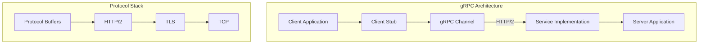
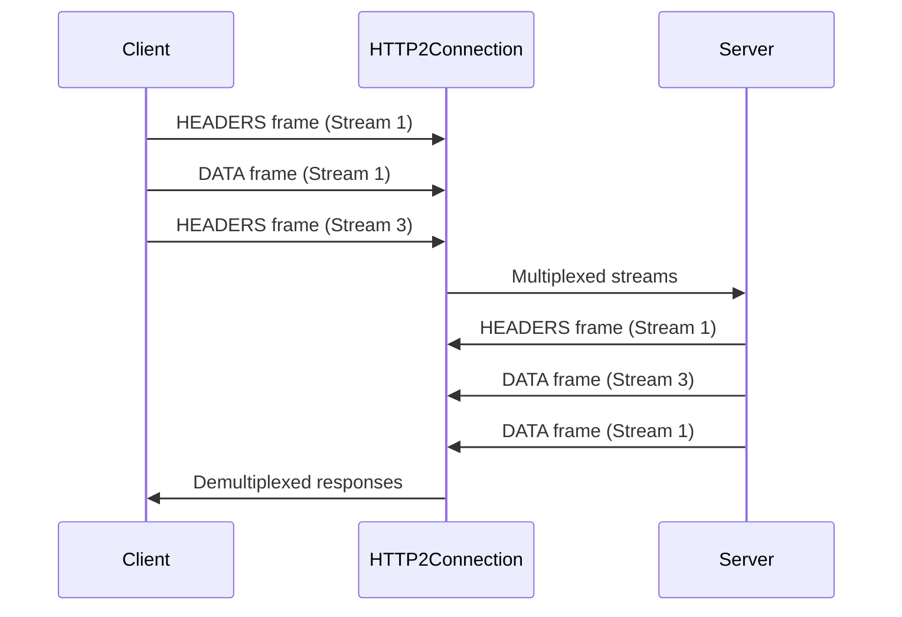
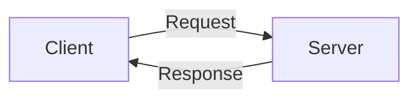
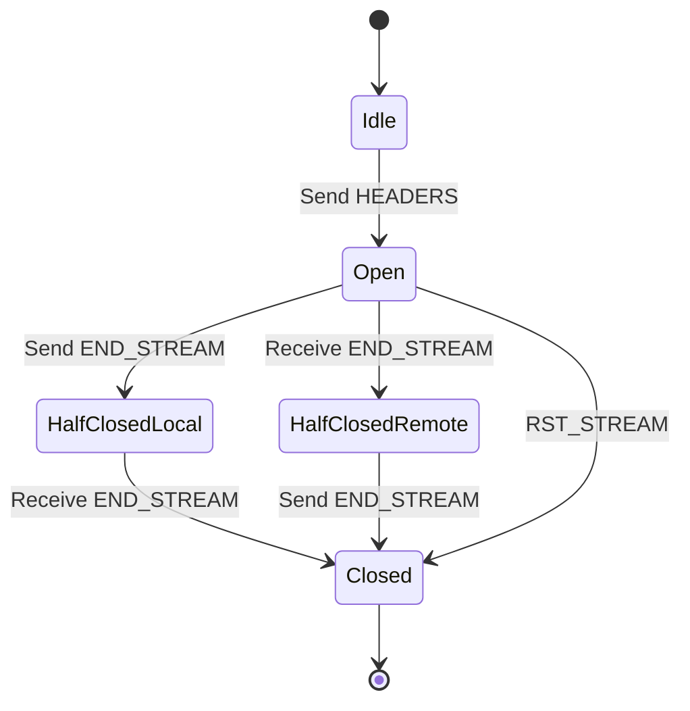
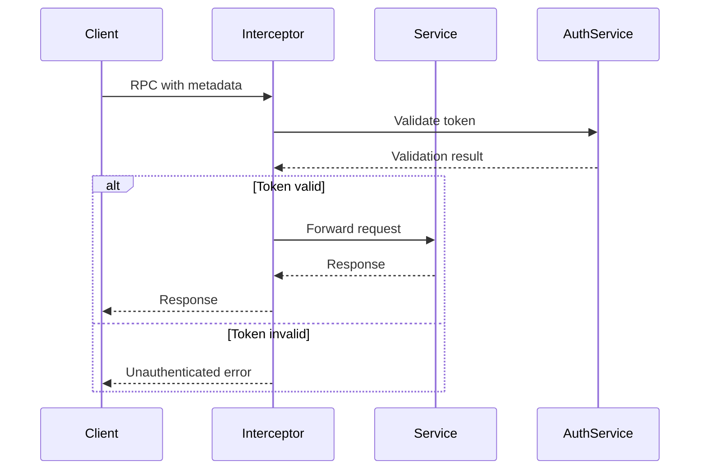
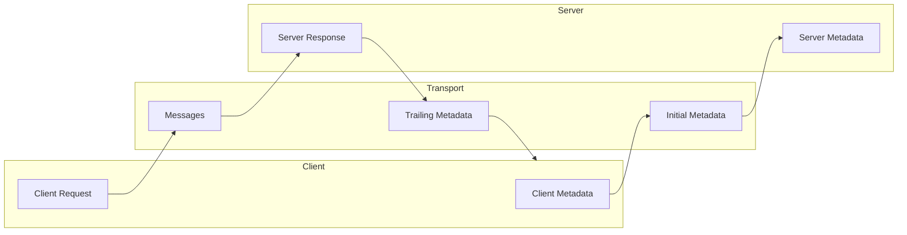
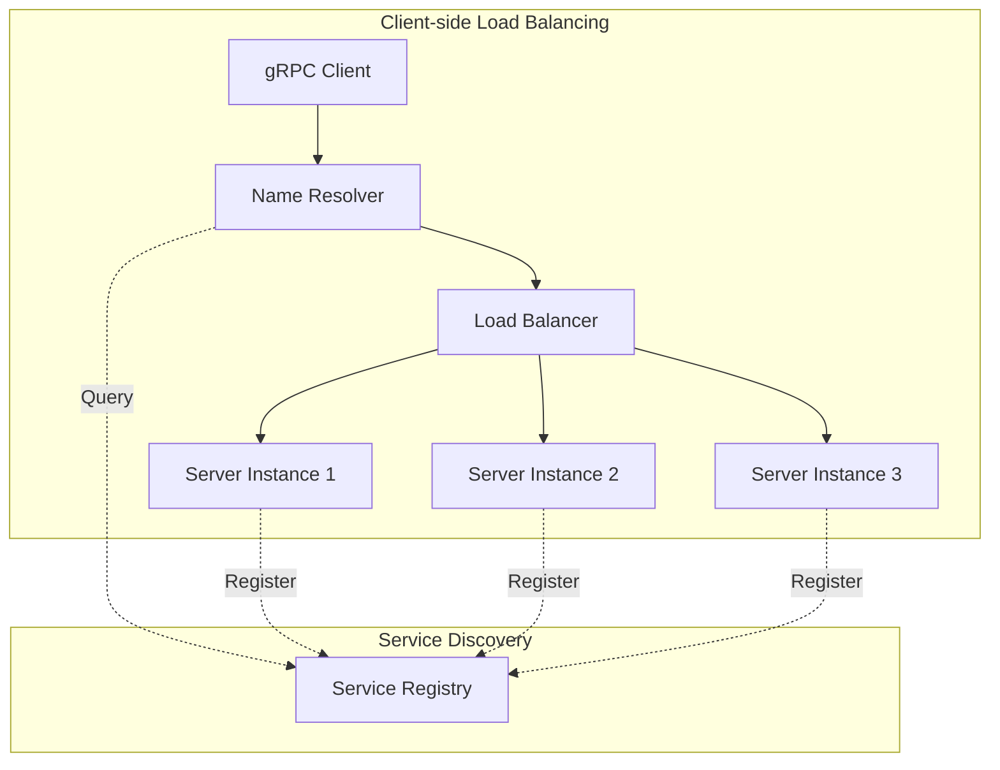
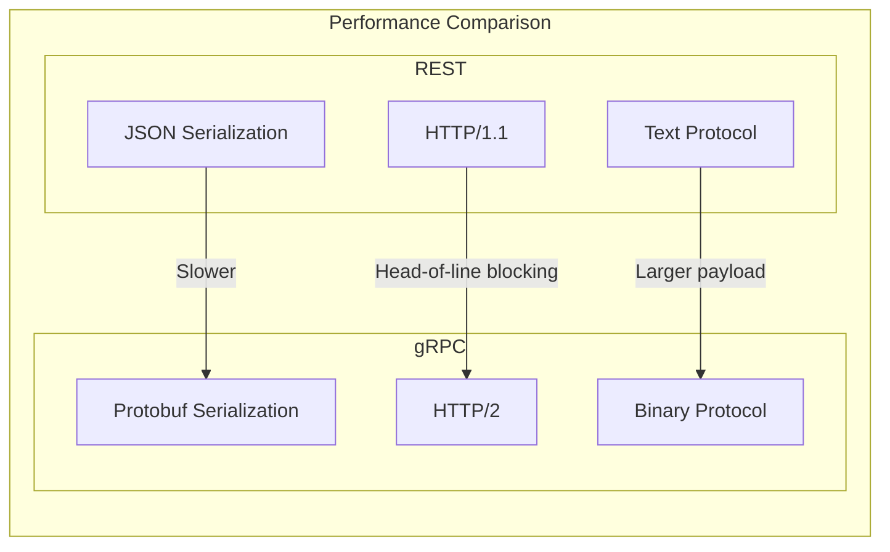
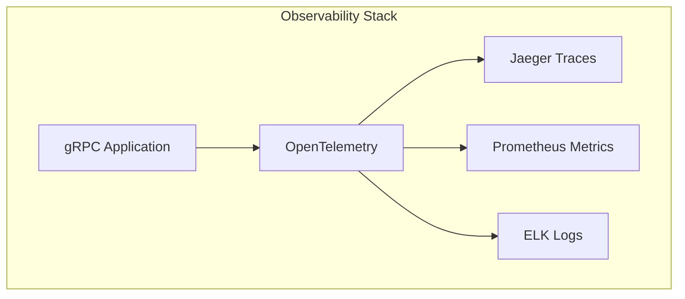

# gRPC

gRPCは、Googleが開発したオープンソースのリモートプロシージャコール（RPC）フレームワークである。2015年に公開されたgRPCは、その名称が示すとおり「gRPC Remote Procedure Calls」の再帰的な頭字語として定義されている[^1]。このフレームワークは、Googleが内部で10年以上使用してきたStubbyと呼ばれるRPCインフラストラクチャの設計思想を基に、オープンスタンダードと現代的なプロトコルを組み合わせて構築された。

分散システムにおけるサービス間通信は、その複雑性と重要性から常に技術的な課題となってきた。従来のRESTful APIは、HTTPの単純性とブラウザとの親和性により広く採用されてきたが、マイクロサービスアーキテクチャの普及に伴い、より高速で効率的な通信メカニズムの必要性が高まった。gRPCは、このような背景の中で、サービス間の高速かつ型安全な通信を実現するために設計された。



## Protocol Buffersとの統合

gRPCの中核を成すのは、Google Protocol Buffers（protobuf）との緊密な統合である。Protocol Buffersは、構造化データをシリアライズするための言語中立的なメカニズムであり、XMLやJSONと比較して、より小さなペイロードサイズと高速なシリアライゼーション/デシリアライゼーションを実現する[^2]。

Protocol Buffersの設計哲学は、スキーマファーストアプローチに基づいている。開発者は`.proto`ファイルにサービスインターフェースとメッセージ型を定義し、protobufコンパイラ（protoc）がこの定義から各プログラミング言語用のコードを生成する。この仕組みにより、異なる言語で実装されたサービス間でも型安全な通信が保証される。

```protobuf
syntax = "proto3";

package example;

service GreetingService {
    rpc SayHello (HelloRequest) returns (HelloResponse);
    rpc SayHelloStreaming (stream HelloRequest) returns (stream HelloResponse);
}

message HelloRequest {
    string name = 1;
    int32 age = 2;
}

message HelloResponse {
    string message = 1;
    int64 timestamp = 2;
}
```

Protocol Buffersのワイヤーフォーマットは、フィールド番号とワイヤータイプを組み合わせたタグ・長さ・値（TLV）エンコーディングを使用する。各フィールドは`(field_number << 3) | wire_type`という形式でエンコードされ、これにより後方互換性を保ちながらスキーマの進化が可能となる。例えば、新しいフィールドを追加しても、古いクライアントはそのフィールドを単に無視することで動作を継続できる。

## HTTP/2プロトコルの活用

gRPCがHTTP/2を採用した理由は、このプロトコルが提供する多重化、ストリーミング、ヘッダー圧縮、そしてサーバープッシュといった機能にある[^3]。HTTP/1.1では、各リクエストが独立したTCP接続を必要とするか、あるいはHTTPパイプライニングによる制限された並列性しか実現できなかった。これに対して、HTTP/2は単一のTCP接続上で複数のストリームを多重化し、ヘッドオブラインブロッキング問題を解決する。



HTTP/2のフレーミング層は、gRPCのメッセージをDATAフレームとして送信し、メタデータをHEADERSフレームとして送信する。各gRPCメッセージは、5バイトのプレフィックス（1バイトの圧縮フラグと4バイトのメッセージ長）を持つ。この設計により、ストリーミングRPCの実装が自然に可能となり、大きなメッセージの分割送信も効率的に行える。

HTTP/2の優先度制御機能により、gRPCは異なるRPCに対して異なる優先度を設定できる。これは、レイテンシセンシティブな操作とスループット重視の操作が混在する環境で特に有用である。また、フロー制御メカニズムにより、受信側の処理能力に応じて送信レートが自動的に調整される。

## サービス定義の4つのパターン

gRPCは、クライアントとサーバー間の通信パターンとして、4つの基本的なサービスメソッドタイプを定義している。これらのパターンは、異なるユースケースに対応し、開発者に柔軟な選択肢を提供する。

**Unary RPC**は、最も単純なパターンであり、クライアントが単一のリクエストを送信し、サーバーが単一のレスポンスを返す。これは従来のHTTP RESTful APIに最も近い形式であり、同期的な操作に適している。



**Server Streaming RPC**では、クライアントが単一のリクエストを送信し、サーバーがレスポンスのストリームを返す。このパターンは、大量のデータを段階的に送信する場合や、リアルタイムの更新を配信する場合に有用である。例えば、ファイルのダウンロードや、株価のリアルタイム配信などが典型的なユースケースとなる。

**Client Streaming RPC**は、クライアントがリクエストのストリームを送信し、サーバーが単一のレスポンスを返すパターンである。大量のデータをアップロードする場合や、複数の操作をバッチ処理する場合に適している。ファイルのアップロードや、センサーデータの集約処理などが代表的な使用例である。

**Bidirectional Streaming RPC**は、最も柔軟なパターンであり、クライアントとサーバーの両方が独立してメッセージストリームを送受信できる。このパターンは、チャットアプリケーション、協調編集システム、またはゲームのリアルタイム通信など、真の双方向通信が必要な場合に使用される。

```go
// Bidirectional streaming example in Go
func (s *server) Chat(stream pb.ChatService_ChatServer) error {
    for {
        msg, err := stream.Recv()
        if err == io.EOF {
            return nil
        }
        if err != nil {
            return err
        }
        
        // Process message and send response
        response := processMessage(msg)
        if err := stream.Send(response); err != nil {
            return err
        }
    }
}
```

## ストリーミング通信の内部実装

gRPCのストリーミング機能は、HTTP/2のストリーム多重化を基盤として実装されている。各RPCは独立したHTTP/2ストリームとして扱われ、ストリームIDによって識別される。この設計により、単一のTCP接続上で複数のRPCを並行して実行できる。

ストリーミングRPCの実装において重要なのは、バックプレッシャーの処理である。gRPCは、HTTP/2のフロー制御メカニズムを活用して、受信側の処理速度に応じて送信側のレートを調整する。これにより、高速な送信側が低速な受信側を圧倒することを防ぐ。



ストリームの状態管理は、HTTP/2の仕様に従って行われる。各ストリームは、Idle、Open、Half-Closed、Closedの状態を遷移する。gRPCは、これらの状態遷移を適切に管理し、エラー発生時の graceful shutdown を実現する。

メッセージの境界保持も重要な機能である。TCPは本質的にストリーム指向のプロトコルであるため、メッセージの境界情報は上位層で管理する必要がある。gRPCは、各メッセージに長さプレフィックスを付加することで、受信側でメッセージを正確に再構築できるようにしている。

## 認証とセキュリティ機構

gRPCのセキュリティモデルは、トランスポート層とアプリケーション層の両方でセキュリティを提供する多層防御アプローチを採用している。トランスポート層では、TLS/SSLによる暗号化と相互認証をサポートし、アプリケーション層では、トークンベースの認証やカスタム認証メカニズムの実装が可能である[^4]。

トランスポート層セキュリティにおいて、gRPCはTLS 1.2以上を推奨し、Perfect Forward Secrecy（PFS）をサポートする暗号スイートの使用を促進する。サーバー認証は標準的なX.509証明書を使用し、クライアント認証（mTLS）もオプションとして利用可能である。

```go
// TLS configuration example
creds, err := credentials.NewServerTLSFromFile("server.crt", "server.key")
if err != nil {
    log.Fatalf("Failed to load TLS credentials: %v", err)
}

server := grpc.NewServer(grpc.Creds(creds))
```

アプリケーション層の認証では、gRPCはメタデータを通じて認証トークンを伝播する仕組みを提供する。これにより、OAuth 2.0トークン、JWTトークン、またはカスタム認証スキームを柔軟に実装できる。インターセプター機能を使用することで、認証ロジックをサービス実装から分離し、横断的な関心事として管理できる。



認可の実装においては、gRPCは細粒度のアクセス制御を可能にする。メソッドレベルでの認可チェック、リクエストパラメータに基づく動的な認可、そしてコンテキスト情報を利用した複雑な認可ロジックの実装が可能である。

## エラーハンドリングとステータスコード

gRPCのエラーハンドリングモデルは、明確に定義されたステータスコードと、構造化されたエラー詳細情報の伝達メカニズムを提供する。このモデルは、分散システムにおける障害の診断と対処を容易にする[^5]。

gRPCは17種類の標準ステータスコードを定義しており、それぞれが特定のエラー状況を表現する。これらのステータスコードは、HTTP/2のステータスコードとは独立しており、より細かい粒度でエラーの性質を表現できる。

| ステータスコード | 説明 | 使用場面 |
|---|---|---|
| OK (0) | 成功 | 正常終了 |
| CANCELLED (1) | 操作がキャンセルされた | クライアントによる明示的なキャンセル |
| UNKNOWN (2) | 不明なエラー | 予期しないエラー |
| INVALID_ARGUMENT (3) | 無効な引数 | クライアントの入力エラー |
| DEADLINE_EXCEEDED (4) | デッドライン超過 | タイムアウト |
| NOT_FOUND (5) | リソースが見つからない | 存在しないエンティティへのアクセス |
| ALREADY_EXISTS (6) | リソースが既に存在 | 重複作成の試行 |
| PERMISSION_DENIED (7) | 権限がない | 認可エラー |
| RESOURCE_EXHAUSTED (8) | リソース枯渇 | レート制限、クォータ超過 |
| FAILED_PRECONDITION (9) | 前提条件の失敗 | システムが操作に適した状態でない |
| ABORTED (10) | 操作が中止された | 同時実行の競合 |
| OUT_OF_RANGE (11) | 範囲外 | 無効なページ番号など |
| UNIMPLEMENTED (12) | 未実装 | サポートされていない操作 |
| INTERNAL (13) | 内部エラー | サーバー側の予期しないエラー |
| UNAVAILABLE (14) | サービス利用不可 | 一時的な障害 |
| DATA_LOSS (15) | データ損失 | 回復不能なデータ損失 |
| UNAUTHENTICATED (16) | 認証されていない | 認証エラー |

エラーの詳細情報は、`google.rpc.Status`メッセージを使用して伝達される。このメッセージには、エラーコード、人間が読めるメッセージ、そして任意の詳細情報を含めることができる。詳細情報は`Any`型のメッセージとして格納され、型安全な方法で追加のコンテキスト情報を提供できる。

```protobuf
message Status {
    int32 code = 1;
    string message = 2;
    repeated google.protobuf.Any details = 3;
}
```

## デッドラインとタイムアウトの伝播

gRPCの特徴的な機能の一つは、デッドラインの自動伝播である。クライアントがRPCにデッドラインを設定すると、そのデッドラインは自動的にサーバーに伝播され、さらにサーバーが他のサービスを呼び出す場合には、残り時間が計算されて伝播される。この仕組みにより、分散システム全体でタイムアウトの一貫性が保たれる。

デッドラインは絶対時刻として表現され、`grpc-timeout`HTTPヘッダーを通じて伝達される。サーバー側では、コンテキストを通じてデッドラインにアクセスでき、長時間実行される操作を適切に中断できる。

```go
func (s *server) LongRunningOperation(ctx context.Context, req *Request) (*Response, error) {
    deadline, ok := ctx.Deadline()
    if ok {
        log.Printf("Operation must complete by %v", deadline)
    }
    
    // Periodically check if context is cancelled
    for i := 0; i < 100; i++ {
        select {
        case <-ctx.Done():
            return nil, ctx.Err()
        default:
            // Continue processing
            processChunk(i)
        }
    }
    
    return &Response{}, nil
}
```

## メタデータとヘッダーの処理

gRPCのメタデータシステムは、RPCに関連する追加情報を伝達するメカニズムを提供する。メタデータは、キー・値のペアとして表現され、HTTPヘッダーと類似の概念である。しかし、gRPCのメタデータは、バイナリ値もサポートし、より柔軟な情報伝達を可能にする。

メタデータは、初期メタデータ（ヘッダー）と末尾メタデータ（トレーラー）の2種類に分類される。初期メタデータはRPCの開始時に送信され、認証トークンやトレーシング情報などを伝達するのに使用される。末尾メタデータは、RPCの完了時に送信され、処理結果に関する追加情報を提供する。



バイナリメタデータは、キー名が`-bin`で終わることで識別される。これらの値は自動的にbase64エンコードされ、HTTPヘッダーとして安全に転送される。この機能により、protobufメッセージやその他のバイナリデータをメタデータとして送信できる。

## インターセプターによる横断的関心事の実装

インターセプターは、gRPCにおけるミドルウェアパターンの実装であり、ログ記録、認証、メトリクス収集、リトライロジックなどの横断的関心事を、サービス実装から分離して管理できる。gRPCは、Unary RPCとStreaming RPCの両方に対してインターセプターをサポートする。

Unaryインターセプターは、リクエスト・レスポンスのライフサイクル全体を制御できる。複数のインターセプターをチェーンすることで、複雑な処理パイプラインを構築できる。

```go
func loggingInterceptor(
    ctx context.Context,
    req interface{},
    info *grpc.UnaryServerInfo,
    handler grpc.UnaryHandler,
) (interface{}, error) {
    start := time.Now()
    
    // Pre-processing
    log.Printf("RPC started: %s", info.FullMethod)
    
    // Call the handler
    resp, err := handler(ctx, req)
    
    // Post-processing
    duration := time.Since(start)
    log.Printf("RPC completed: %s, duration: %v, error: %v", 
        info.FullMethod, duration, err)
    
    return resp, err
}
```

Streamingインターセプターは、ストリームのラッパーを提供し、各メッセージの送受信に介入できる。これにより、メッセージレベルでのログ記録や変換が可能となる。

## ロードバランシングとサービスディスカバリー

gRPCのロードバランシング機構は、クライアントサイドとプロキシベースの両方のアプローチをサポートする。クライアントサイドロードバランシングでは、クライアントが利用可能なサーバーのリストを維持し、適切なアルゴリズムに基づいて接続先を選択する[^6]。



gRPCは、DNSベースのサービスディスカバリーをネイティブでサポートし、カスタムネームリゾルバーの実装も可能である。これにより、Consul、etcd、ZooKeeperなどの外部サービスレジストリとの統合が容易になる。

ロードバランシングアルゴリズムとして、ラウンドロビン、ランダム、最小接続数、重み付けラウンドロビンなどが実装可能である。また、ヘルスチェック機能により、障害のあるサーバーを自動的に接続プールから除外できる。

## パフォーマンス最適化とチューニング

gRPCのパフォーマンスは、多くの要因に依存する。メッセージサイズ、並行接続数、ストリーミングの使用、そしてネットワークレイテンシなどが主要な要因である。適切なチューニングにより、gRPCは極めて高いスループットと低レイテンシを実現できる。

接続プーリングは、パフォーマンス最適化の重要な要素である。gRPCは、HTTP/2の多重化機能により、単一の接続で多数の並行RPCをサポートするが、CPU負荷の分散のために複数の接続を使用することが有益な場合もある。

```go
// Connection pool configuration
opts := []grpc.DialOption{
    grpc.WithDefaultServiceConfig(`{
        "loadBalancingConfig": [{"round_robin": {}}],
        "methodConfig": [{
            "name": [{"service": "example.Service"}],
            "retryPolicy": {
                "maxAttempts": 4,
                "initialBackoff": "0.1s",
                "maxBackoff": "1s",
                "backoffMultiplier": 2,
                "retryableStatusCodes": ["UNAVAILABLE"]
            }
        }]
    }`),
}
```

メッセージサイズの最適化も重要である。Protocol Buffersは効率的なシリアライゼーションを提供するが、大きなメッセージは分割して送信することでメモリ使用量を削減できる。また、圧縮アルゴリズム（gzip、snappy）の使用により、ネットワーク帯域幅を節約できる。

## 実装言語とエコシステム

gRPCは、多言語対応を前提として設計されており、C++、Java、Python、Go、C#、Node.js、Ruby、PHP、Dart、Kotlinなど、幅広いプログラミング言語をサポートする。各言語の実装は、その言語の慣用的なパターンに従いながら、一貫したAPIセマンティクスを提供する。

言語間の相互運用性は、Protocol Buffersによって保証される。同じ`.proto`ファイルから生成されたコードは、言語に関係なく相互に通信できる。これにより、ポリグロット環境でのマイクロサービス開発が容易になる。

エコシステムの観点では、gRPCは豊富なツールとライブラリに支えられている。grpc-gateway は RESTful JSON API から gRPC サービスへのリバースプロキシを提供し、既存のRESTクライアントとの互換性を維持できる。grpcurl は コマンドラインから gRPC サービスを呼び出すツールであり、デバッグとテストに有用である。

## ベンチマークとRESTとの比較

gRPCとRESTful APIの性能比較は、多くの要因に依存するが、一般的にgRPCは以下の点で優位性を示す。レイテンシの観点では、Protocol Buffersの効率的なシリアライゼーションとHTTP/2の多重化により、gRPCは特に小さなメッセージの高頻度通信において優れた性能を発揮する。

スループットの面では、バイナリプロトコルの使用とヘッダー圧縮により、gRPCはJSONベースのRESTful APIと比較して、20-30%高いスループットを実現することが多い。ただし、この差は、メッセージのサイズと複雑性、ネットワークの特性などによって変動する。



CPU使用率においても、gRPCは優位性を示す。バイナリプロトコルの処理は、JSONのパースと比較してCPU効率が良く、大規模なシステムでは顕著な差となって現れる。

## 実装の詳細と内部アーキテクチャ

gRPCの内部アーキテクチャは、複数の層から構成される。最下層はトランスポート層であり、HTTP/2プロトコルの実装を担当する。その上に、フレーミング層があり、gRPCメッセージとHTTP/2フレームの変換を行う。さらに上層には、シリアライゼーション層があり、Protocol Buffersのエンコード/デコードを処理する。

チャネル抽象化は、gRPCの重要な設計要素である。チャネルは、特定のホストとポートへの仮想接続を表現し、実際のHTTP/2接続の管理、再接続ロジック、そしてロードバランシングを担当する。チャネルは、複数のサブチャネルを管理し、各サブチャネルは個別のバックエンドサーバーへの接続を表す。

```go
// Channel state transitions
type ConnectivityState int

const (
    Idle ConnectivityState = iota
    Connecting
    Ready
    TransientFailure
    Shutdown
)
```

コールオブジェクトは、個々のRPCを表現する。各コールは、独自のメタデータ、デッドライン、キャンセレーション状態を持つ。コールオブジェクトは、HTTP/2ストリームと1対1で対応し、ストリームのライフサイクルを管理する。

## 実運用における考慮事項

gRPCを本番環境で運用する際には、いくつかの重要な考慮事項がある。監視とオブザーバビリティは、分散システムの健全性を維持する上で不可欠である。gRPCは、OpenTelemetryとの統合により、分散トレーシング、メトリクス収集、そしてログ相関を容易にする。



エラーバジェットとSLOの設定も重要である。gRPCのステータスコードを活用して、エラーを分類し、各カテゴリに対して適切なSLOを設定する。例えば、DEADLINE_EXCEEDEDエラーは、レイテンシSLOの違反を示し、UNAVAILABLEエラーは可用性SLOに影響する。

キャパシティプランニングでは、接続数、並行RPC数、メッセージサイズなどの要因を考慮する必要がある。gRPCサーバーは、最大接続数、最大並行ストリーム数、そして最大メッセージサイズを設定できる。これらの設定は、リソース使用量とパフォーマンスのバランスを取るために調整する必要がある。

## 移行戦略とベストプラクティス

既存のシステムからgRPCへの移行は、段階的なアプローチが推奨される。grpc-gatewayを使用したRESTful APIとの共存により、クライアントの移行を段階的に進めることができる。また、サービスメッシュ（Istio、Linkerdなど）との統合により、既存のインフラストラクチャとの互換性を維持しながら、gRPCの利点を活用できる。

APIのバージョニング戦略も重要である。Protocol Buffersの後方互換性機能を活用し、フィールドの追加は新しいフィールド番号を使用し、フィールドの削除は避ける。必要に応じて、サービスレベルでのバージョニング（例：v1、v2）を実装し、段階的な移行パスを提供する。

エラーハンドリングのベストプラクティスとして、適切なステータスコードの使用、詳細なエラー情報の提供、そしてクライアント側でのリトライロジックの実装が挙げられる。また、サーキットブレーカーパターンの実装により、障害の連鎖的な伝播を防ぐことができる。

gRPCは、現代の分散システムにおける効率的な通信を実現する強力なフレームワークである。その設計は、Googleの大規模システムでの経験に基づき、パフォーマンス、型安全性、そして言語間の相互運用性を重視している。HTTP/2とProtocol Buffersの組み合わせにより、従来のRESTful APIと比較して、より高速で効率的な通信を実現する。ストリーミング、デッドライン伝播、そして豊富なエラーハンドリング機能により、複雑な分散システムの構築が容易になる。適切な設計と実装により、gRPCは、マイクロサービスアーキテクチャにおける信頼性の高い基盤となる。

[^1]: gRPC Authors. "gRPC Documentation." https://grpc.io/docs/
[^2]: Google. "Protocol Buffers Documentation." https://developers.google.com/protocol-buffers
[^3]: IETF. "RFC 7540: Hypertext Transfer Protocol Version 2 (HTTP/2)." May 2015.
[^4]: gRPC Authors. "gRPC Authentication." https://grpc.io/docs/guides/auth/
[^5]: Google. "Google Cloud APIs - Error Model." https://cloud.google.com/apis/design/errors
[^6]: gRPC Authors. "gRPC Load Balancing." https://grpc.io/blog/grpc-load-balancing/