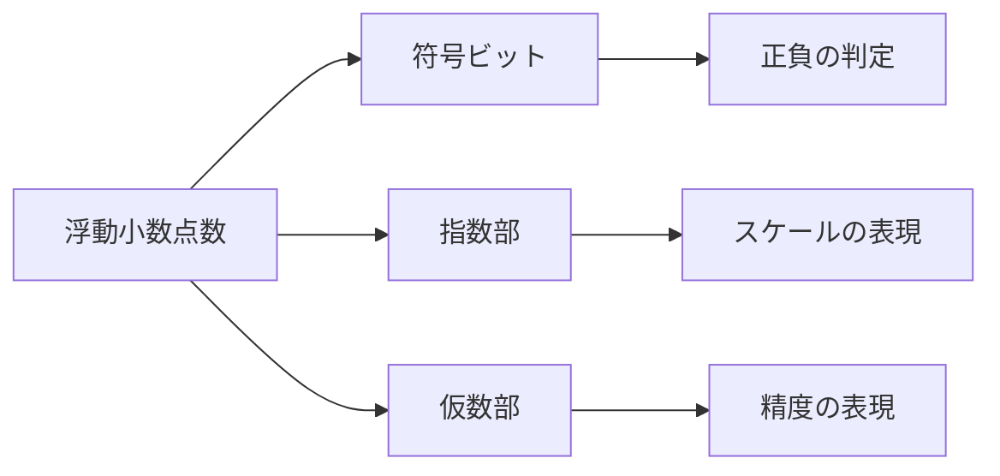
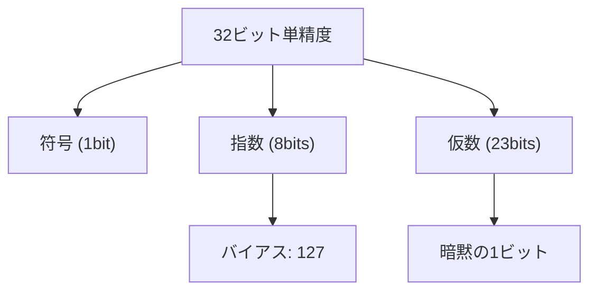
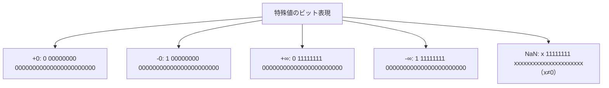
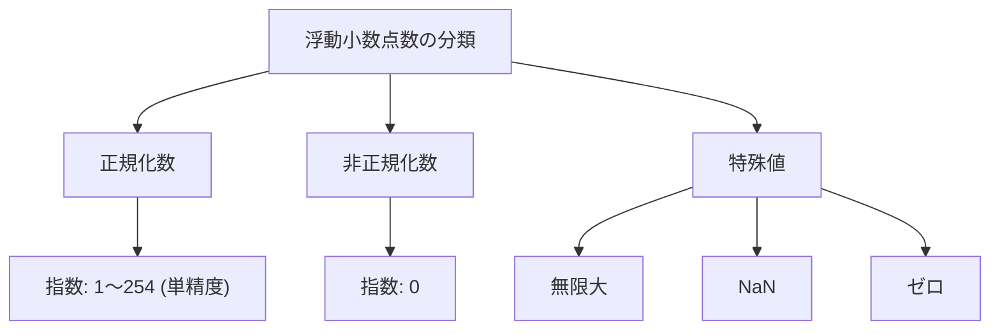
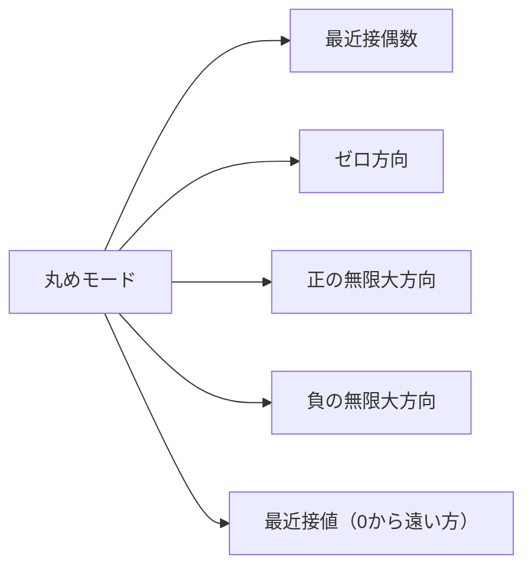
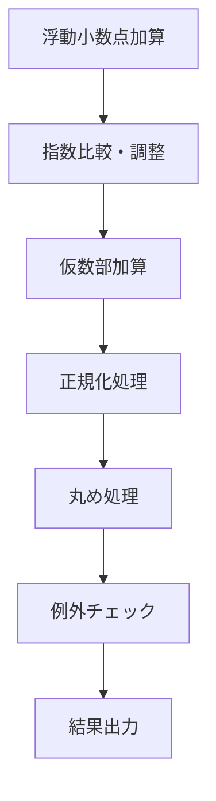
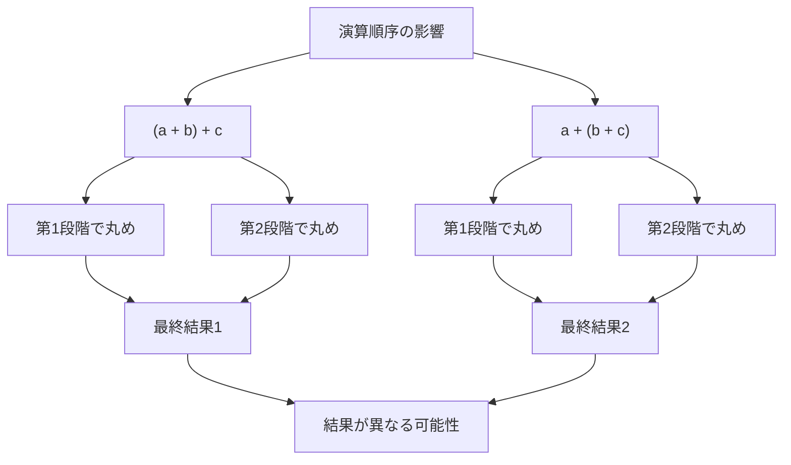
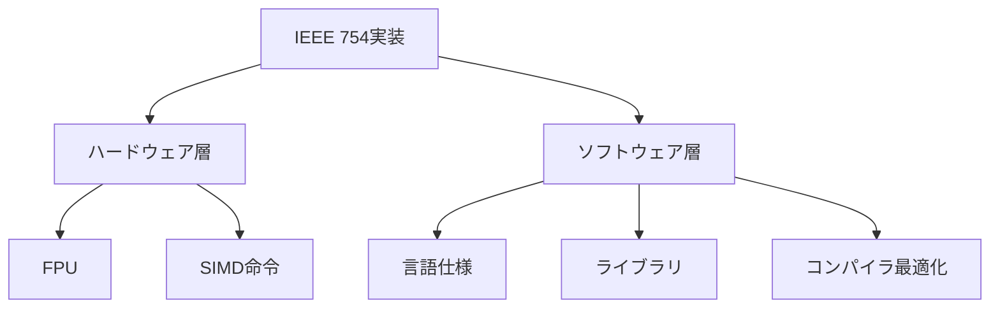

# IEEE 754

IEEE 754は、コンピュータにおける浮動小数点数の表現と演算を定めた国際標準規格である。1985年に初版が制定され、現在ではほぼすべてのプロセッサとプログラミング言語で採用されている。この規格は、異なるハードウェアやソフトウェア間での数値計算の互換性を保証し、数値計算の予測可能性を大幅に向上させた。

コンピュータにおける実数の表現は、有限のビット数で無限の精度を持つ実数を近似するという根本的な制約を抱えている。IEEE 754は、この制約の中で最大限の精度と演算の一貫性を実現するため、ビット表現から演算規則、例外処理まで、浮動小数点数に関するあらゆる側面を詳細に規定している。

## 歴史的背景

IEEE 754の策定以前、各コンピュータメーカーは独自の浮動小数点数表現を採用していた。IBM System/360、DEC VAX、Cray-1などは、それぞれ異なる形式と演算規則を持っていた。この状況は、プログラムの移植性を著しく損ない、数値計算結果の再現性を困難にしていた。

1970年代後期、Intel社が8087数値演算コプロセッサの開発を進める中で、標準化の必要性が認識された。William Kahanをはじめとする専門家グループが、厳密な数学的基盤に基づいた浮動小数点数規格の策定に着手した。Kahanは後にこの功績により、計算機科学のノーベル賞とも言われるチューリング賞を受賞している。

規格策定過程では、様々な設計上のトレードオフが議論された。特に、段階的アンダーフロー（gradual underflow）の採用は大きな論争となった。ハードウェア実装の複雑さとコストに対する懸念から反対意見もあったが、数値計算の安定性向上という利点が認められ、最終的に規格に含まれることとなった。

## 浮動小数点数の基本概念

浮動小数点数は、科学記数法の考え方をコンピュータに適用したものである。実数を符号、仮数部（有効数字）、指数部の3つの要素で表現し、広い範囲の数値を限られたビット数で効率的に表現する。この表現方法は、絶対値が非常に大きい数や非常に小さい数を扱う科学技術計算において特に有効である。



IEEE 754では、浮動小数点数を次の形式で表現する：

$$(-1)^s \times M \times 2^E$$

ここで、$s$は符号ビット（0なら正、1なら負）、$M$は仮数部（mantissa）または有効数字（significand）、$E$は指数である。規格では、この基本形式をビット列にエンコードする方法を厳密に定義している。

## IEEE 754の形式

IEEE 754は複数の精度レベルを定義しているが、最も広く使用されているのは単精度（32ビット）と倍精度（64ビット）である。

### 単精度浮動小数点数（binary32）

単精度は32ビットで構成され、以下のように配分される：
- 符号ビット：1ビット
- 指数部：8ビット
- 仮数部：23ビット



### 倍精度浮動小数点数（binary64）

倍精度は64ビットで構成され、以下のように配分される：
- 符号ビット：1ビット
- 指数部：11ビット
- 仮数部：52ビット

単精度と倍精度の主な違いは、表現可能な数値の範囲と精度である。倍精度は指数部が3ビット多いため、より広い範囲の数値を表現でき、仮数部が29ビット多いため、より高い精度を持つ。

## ビット表現の詳細

IEEE 754のビット表現を具体例で見てみよう。例えば、10進数の-13.375を単精度浮動小数点数で表現する過程を追う。

まず、13.375を2進数に変換する：
- 整数部: 13 = 1101₂
- 小数部: 0.375 = 0.011₂
- 結果: 13.375 = 1101.011₂

次に、正規化形式に変換する：
- 1101.011₂ = 1.101011₂ × 2³

したがって：
- 符号ビット: 1（負数なので）
- 指数部: 3 + 127（バイアス） = 130 = 10000010₂
- 仮数部: 101011（隠れビットの1は省略）

最終的なビット表現：
```
1 10000010 10101100000000000000000
```

このような具体的な変換プロセスを理解することで、浮動小数点数の内部表現に対する直感的な理解が深まる。

### 特殊ケースのビット表現



## 正規化数と非正規化数

IEEE 754では、浮動小数点数を正規化数（normalized numbers）と非正規化数（denormalized numbers、またはsubnormal numbers）に分類する。

### 正規化数

正規化数は、仮数部の最上位ビットが1である数値である。IEEE 754では、この最上位の1を「隠れビット」として扱い、実際のビット表現には含めない。これにより、1ビット分の精度を追加で確保できる。

正規化数の仮数部は、$1.f$の形式で表現される（$f$は小数部分）。指数部は「バイアス表現」を使用し、実際の指数値にバイアス値を加えた値を格納する。単精度ではバイアスが127、倍精度では1023である。

### 非正規化数

非正規化数は、指数部がすべて0の場合に使用される特殊な表現である。この場合、仮数部は$0.f$の形式で解釈され、隠れビットは0となる。非正規化数により、0に非常に近い小さな数値を表現できる「段階的アンダーフロー」が実現される。



## 特殊な値

IEEE 754は、通常の数値以外に、いくつかの特殊な値を定義している。

### ゼロ

IEEE 754では、正のゼロ（+0）と負のゼロ（-0）を区別する。両者は等価として扱われるが、特定の演算（例：1/0と1/(-0)）では異なる結果を生成する。ゼロは指数部と仮数部がすべて0で表現される。

### 無限大

正の無限大（+∞）と負の無限大（-∞）は、オーバーフローや0による除算などの結果として生成される。無限大は指数部がすべて1、仮数部がすべて0で表現される。

### NaN（Not a Number）

NaNは「数値ではない」ことを表す特殊な値で、0/0や√(-1)などの未定義の演算結果として生成される。NaNは指数部がすべて1、仮数部が0でない任意の値で表現される。

IEEE 754では、Quiet NaN（qNaN）とSignaling NaN（sNaN）の2種類のNaNを定義している。qNaNは演算を通じて伝播し、sNaNは浮動小数点例外を発生させる。

## 丸め処理

有限精度の浮動小数点数では、すべての実数を正確に表現することはできない。そのため、表現可能な最も近い値への丸め処理が必要となる。IEEE 754は5つの丸めモードを定義している[^1]。

### 最近接偶数への丸め（Round to Nearest, Ties to Even）

デフォルトの丸めモードで、最も近い表現可能な値に丸める。ちょうど中間の場合は、最下位ビットが0（偶数）になる方向に丸める。このモードは統計的なバイアスを最小化する。

### その他の丸めモード

- ゼロ方向への丸め（Round toward Zero）：切り捨て
- 正の無限大方向への丸め（Round toward +∞）：切り上げ
- 負の無限大方向への丸め（Round toward -∞）：切り下げ  
- 最近接値への丸め、同値は0から遠い方へ（Round to Nearest, Ties Away from Zero）



## 演算規則と例外処理

IEEE 754は、基本的な算術演算（加算、減算、乗算、除算）に加えて、平方根、剰余演算、融合積和演算（FMA: Fused Multiply-Add）などの演算を定義している。各演算は、無限精度で計算した後、指定された丸めモードで丸めるという原則に従う。

### 加算・減算アルゴリズム

浮動小数点数の加算は、以下の手順で実行される：

1. **指数の調整**: 2つの数の指数を比較し、小さい方の仮数部を右シフトして指数を揃える
2. **仮数部の加算**: 調整された仮数部を加算する
3. **正規化**: 結果が正規化形式でない場合、仮数部をシフトして正規化する
4. **丸め処理**: 結果を指定された精度に丸める
5. **例外チェック**: オーバーフロー、アンダーフローなどをチェックする



### 乗算アルゴリズム

乗算は加算より単純で、以下の手順で実行される：

1. **符号の決定**: 2つの数の符号ビットのXORで結果の符号を決定
2. **指数の加算**: 指数部を加算し、バイアスを調整
3. **仮数部の乗算**: 仮数部同士を乗算
4. **正規化と丸め**: 結果を正規化し、適切な精度に丸める

### 融合積和演算（FMA）

FMA演算は$a \times b + c$を単一の演算として実行し、中間結果の丸めを行わない。これにより、通常の乗算後加算より高い精度が得られる。FMAは多くの数値計算アルゴリズム、特に行列演算や多項式評価において重要である。

### 浮動小数点例外

IEEE 754は5つの例外条件を定義している：

1. **無効演算（Invalid Operation）**: 0/0、∞-∞、√(-1)などの数学的に未定義の演算
2. **ゼロ除算（Division by Zero）**: 有限の非ゼロ値を0で除算
3. **オーバーフロー（Overflow）**: 結果が表現可能な最大値を超える
4. **アンダーフロー（Underflow）**: 結果が表現可能な最小の正規化数より小さい
5. **不正確（Inexact）**: 丸めが発生した

各例外には対応するステータスフラグがあり、プログラムは例外の発生を検出できる。また、例外が発生した場合のデフォルトの動作も規定されている。

## 実装における注意点

IEEE 754準拠の浮動小数点演算を実装する際には、多くの微妙な問題に注意する必要がある。

### 数値の比較

浮動小数点数の等価比較は、丸め誤差のため予期しない結果を生むことがある。特に、数学的に等しいはずの式が、計算順序により異なる結果となることがある：

```c
// Example of floating-point comparison issue
float a = 0.1f + 0.2f;
float b = 0.3f;
// a == b may be false due to rounding errors
```

実用的には、イプシロン値を使用した近似比較が推奨される。

### 演算の順序依存性

浮動小数点演算は結合法則を満たさない。つまり、$(a + b) + c$と$a + (b + c)$が異なる結果となることがある。これは、各演算後に丸めが発生するためである。



### 非正規化数の性能

多くのプロセッサでは、非正規化数の演算は正規化数の演算より大幅に遅い。これは、非正規化数の処理が特殊なハードウェアパスやソフトウェアエミュレーションを必要とするためである。性能が重要なアプリケーションでは、「Flush to Zero」（FTZ）や「Denormals Are Zero」（DAZ）モードを使用して、非正規化数を0として扱うことがある。

### NaNの伝播

NaNは「感染性」を持つ。つまり、NaNを含む演算の結果は通常NaNとなる。これにより、計算のどこかで発生した数値エラーが最終結果まで伝播する。デバッグ時には、NaNの発生源を特定するため、中間結果のチェックが重要となる。

## よくある落とし穴と回避方法

### 精度の喪失（Loss of Precision）

大きさが大きく異なる数値の加算では、小さい方の数値の情報が失われることがある。これは「吸収」と呼ばれる現象である。

```python
# Example of absorption
large = 1e16
small = 1.0
result = large + small - large  # Expected: 1.0, Actual: 0.0
```

この問題を回避するには、計算順序を工夫したり、Kahan加算アルゴリズムなどの補償付き加算を使用する。

### 桁落ち（Cancellation）

近い値同士の減算では、有効桁数が大幅に減少する「桁落ち」が発生する。

```python
# Example of cancellation
a = 1.0000001
b = 1.0000000
diff = a - b  # Loss of significant digits
```

桁落ちを避けるには、アルゴリズムを数学的に変形して、減算を回避する方法が有効である。例えば、二次方程式の解の公式では、判別式が小さい場合の桁落ちを避ける変形がよく知られている。

### 比較の罠

浮動小数点数の等価比較は、予期しない結果を生むことが多い。

```c
// Common mistake
if (x == y) {  // May fail even when mathematically equal
    // ...
}

// Better approach
if (fabs(x - y) < epsilon) {
    // ...
}
```

ただし、イプシロン値の選択も重要で、比較する値のスケールに応じて適切に設定する必要がある。相対誤差を使用する方法もよく採用される。

### 無限ループの危険性

浮動小数点数をループカウンタに使用すると、丸め誤差により予期しない動作をすることがある。

```c
// Dangerous loop
for (float x = 0.0; x != 1.0; x += 0.1) {
    // May never terminate due to rounding
}

// Safe approach
for (int i = 0; i < 10; i++) {
    float x = i * 0.1;
    // ...
}
```

## 拡張形式と将来の発展

IEEE 754-2008改訂版では、16ビット半精度（binary16）、128ビット四倍精度（binary128）、さらに任意精度の10進浮動小数点形式が追加された[^2]。これらの拡張により、組み込みシステムから高精度科学計算まで、より広範なアプリケーションのニーズに対応できるようになった。

### 半精度浮動小数点数

半精度（16ビット）は、機械学習やグラフィックス処理において、メモリ帯域幅を節約しながら許容可能な精度を維持するために使用される。符号1ビット、指数5ビット、仮数10ビットで構成される。

### 10進浮動小数点数

金融計算などでは、2進浮動小数点数による10進数の近似が問題となることがある。例えば、0.1は2進浮動小数点数では正確に表現できない。IEEE 754-2008は、この問題に対処するため、10進浮動小数点形式を標準化した。

## ハードウェアとソフトウェアの協調

現代のプロセッサは、IEEE 754準拠の浮動小数点演算ユニット（FPU）を内蔵している。FPUは、基本的な演算を高速に実行し、丸めモードの制御、例外フラグの管理などを行う。

一方、プログラミング言語とコンパイラは、IEEE 754の機能をプログラマに提供する責任がある。C言語の`<fenv.h>`ヘッダーや、Javaの`strictfp`キーワードなどは、IEEE 754準拠の動作を保証するための機構である。



## 数値安定性とアルゴリズム設計

IEEE 754の特性を理解することは、数値的に安定なアルゴリズムを設計する上で不可欠である。例えば、二次方程式の解の公式では、判別式の平方根を計算する際の桁落ちを避けるため、数値的に安定な変形が使用される。

同様に、行列計算では条件数を考慮し、反復法では収束判定に適切な許容誤差を設定する必要がある。これらの技法は、IEEE 754の丸め誤差や表現範囲の制限を前提として開発されている。

## 移植性と再現性

IEEE 754は異なるシステム間での数値計算の移植性を大幅に向上させたが、完全な再現性を保証するものではない。コンパイラの最適化、演算順序の変更、拡張精度レジスタの使用などにより、同じプログラムが異なる結果を生成することがある。

### 再現性を妨げる要因

1. **拡張精度レジスタ**: x86プロセッサのFPUは80ビットの拡張精度レジスタを持ち、中間計算で使用される
2. **コンパイラ最適化**: 演算順序の変更、共通部分式の除去、ベクトル化などが結果に影響する
3. **並列処理**: 並列リダクション演算では、加算順序が実行ごとに変わる可能性がある
4. **ライブラリの実装差**: 数学関数（sin、cos、exp等）の実装はプラットフォームにより異なる

厳密な再現性が必要な場合は、演算順序を明示的に制御し、中間結果を適切な精度に丸め、コンパイラの最適化オプションを慎重に選択する必要がある。

## 性能最適化とトレードオフ

浮動小数点演算の性能は、アプリケーションの全体的なパフォーマンスに大きく影響する。現代のプロセッサは、IEEE 754準拠を維持しながら、様々な最適化技術を実装している。

### SIMD命令の活用

Single Instruction Multiple Data（SIMD）命令セットは、複数の浮動小数点演算を並列実行する。Intel AVX、ARM NEONなどの拡張命令セットは、ベクトル演算を高速化する。ただし、SIMD演算では例外処理が簡略化されることがあり、厳密なIEEE 754準拠とのトレードオフが存在する。

### GPU演算における考慮事項

GPUは大量の浮動小数点演算を並列実行するが、IEEE 754への準拠レベルはCPUより低いことが多い。特に：

- 非正規化数のサポートが限定的
- 丸めモードが固定されている場合がある
- 特殊値の扱いが簡略化されている

これらの制約を理解し、アプリケーションの要求精度に応じて適切なハードウェアを選択することが重要である。

## プログラミング言語における実装

各プログラミング言語は、IEEE 754の機能を異なる方法で露出している。

### C/C++での実装

C99以降、`<fenv.h>`ヘッダーにより、丸めモードと例外フラグの制御が可能になった。

```c
#include <fenv.h>

// Set rounding mode
fesetround(FE_UPWARD);

// Check for exceptions
feclearexcept(FE_ALL_EXCEPT);
double result = sqrt(-1.0);
if (fetestexcept(FE_INVALID)) {
    // Handle invalid operation
}
```

### 高水準言語での考慮事項

Python、JavaScript、Javaなどの高水準言語では、IEEE 754の詳細が抽象化されている。例えば、Pythonの`decimal`モジュールは、10進浮動小数点演算を提供し、金融計算などで有用である。

## 数値解析への応用

IEEE 754の特性は、数値解析アルゴリズムの設計に深く影響する。条件数、後退誤差解析、区間演算などの概念は、すべてIEEE 754の丸め誤差モデルに基づいている。

### 誤差解析の基礎

浮動小数点演算の相対誤差は、マシンイプシロン（ε）で特徴付けられる。単精度では約1.19×10⁻⁷、倍精度では約2.22×10⁻¹⁶である。この値は、隣接する浮動小数点数間の相対的な間隔を表す。

### 安定なアルゴリズムの設計原則

1. **前進誤差の最小化**: 各演算での丸め誤差の蓄積を抑える
2. **後退安定性の確保**: 計算結果が、わずかに摂動した入力の厳密解となるようにする
3. **条件数の考慮**: 問題の条件数が大きい場合、アルゴリズムの改良だけでは限界がある

## 将来の展望と課題

IEEE 754は継続的に進化している。2019年の改訂では、新しい演算や推奨事項が追加された。今後の課題として：

1. **量子コンピューティングとの統合**: 量子・古典ハイブリッドシステムでの浮動小数点演算
2. **機械学習向け最適化**: 低精度演算と高精度演算の効果的な組み合わせ
3. **エネルギー効率**: 精度とエネルギー消費のトレードオフの最適化

これらの発展により、IEEE 754は今後も数値計算の基盤として重要な役割を果たし続けるだろう。

---

[^1]: IEEE Std 754-2019 - IEEE Standard for Floating-Point Arithmetic, Section 4.3 "Rounding-direction attributes"

[^2]: IEEE Std 754-2008 - IEEE Standard for Floating-Point Arithmetic, Revision of IEEE Std 754-1985