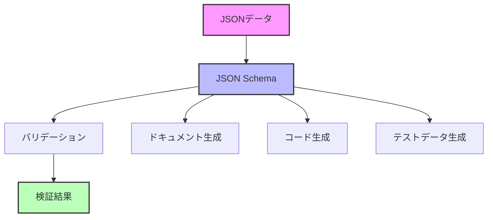
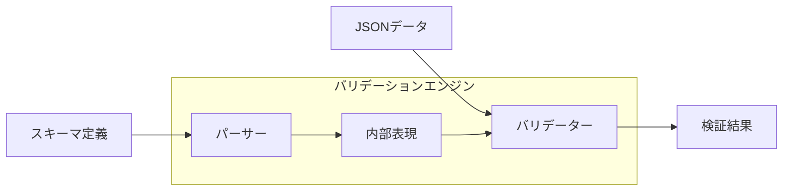
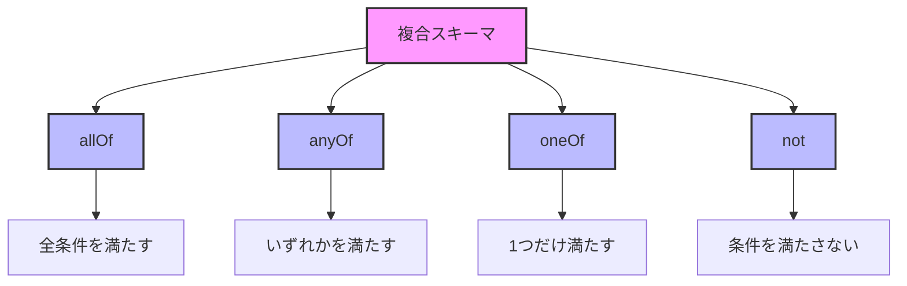
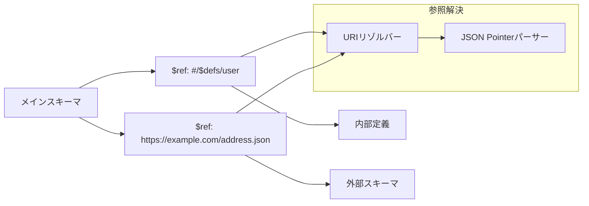
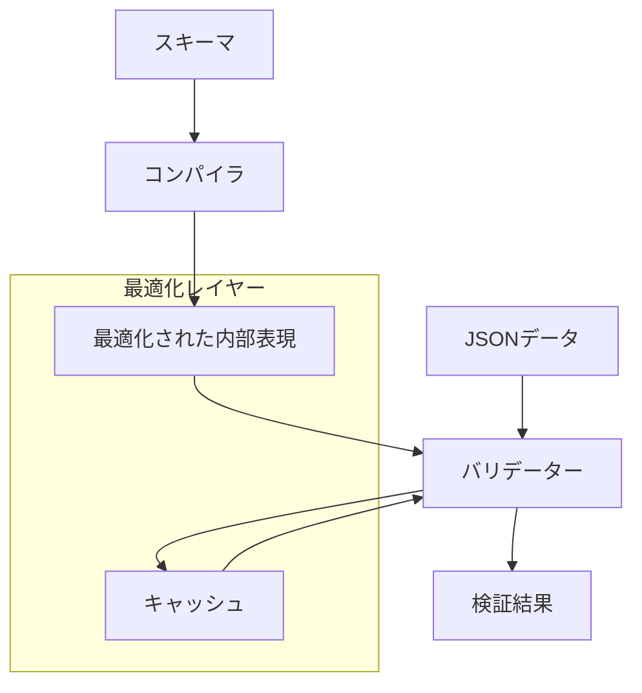
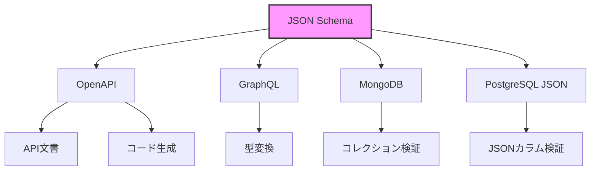
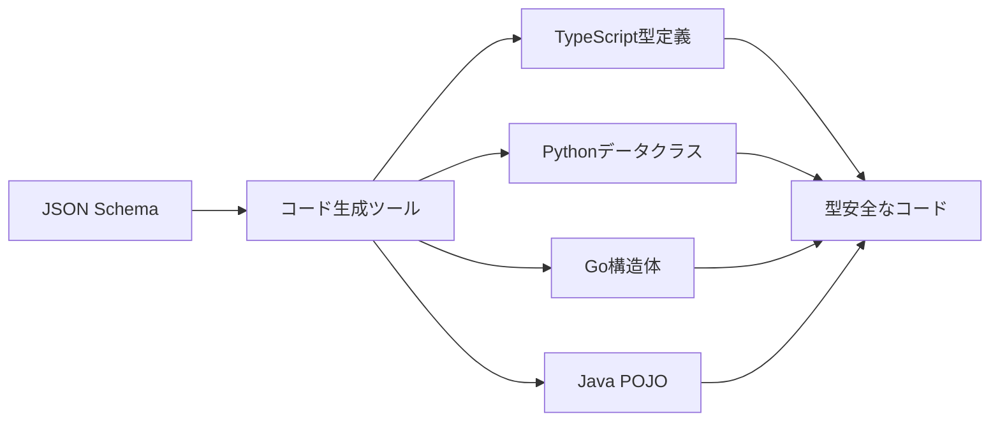

# JSON Schema

JSON Schemaは、JSONデータ構造を記述し、検証するための宣言的言語である。2009年にKris Zyp氏によって最初のドラフトが公開されて以来、JSONベースのAPIやデータ交換において、データの整合性を保証する標準的な手法として広く採用されている。本稿では、JSON Schemaの設計思想から実装の詳細まで、その技術的側面を包括的に解説する。

## JSON Schemaの本質

JSON Schemaの根本的な目的は、JSONデータに対する「型システム」を提供することにある。プログラミング言語における型システムがコンパイル時の安全性を提供するのと同様に、JSON Schemaはデータ交換時の安全性を保証する。この仕組みは、分散システムにおけるコントラクトの明示化という観点から重要な意味を持つ。



JSON Schemaの設計において特筆すべきは、その宣言的な性質である。手続き的なバリデーションロジックを記述するのではなく、データが満たすべき条件を宣言的に記述することで、実装言語に依存しない汎用的な仕様記述を実現している。この設計思想は、OpenAPI SpecificationやGraphQL Schema Definition Languageなど、他のスキーマ言語にも影響を与えている。

## 基本構造と動作原理

JSON Schema自体もJSONで記述される。この自己記述的な性質により、JSON Schemaの仕様そのものをJSON Schemaで記述することが可能となっている。これは「メタスキーマ」と呼ばれ、JSON Schemaの妥当性を検証するために使用される[^1]。

基本的なJSON Schemaの構造は以下のような形式を取る：

```json
{
  "$schema": "https://json-schema.org/draft/2020-12/schema",
  "$id": "https://example.com/product.schema.json",
  "type": "object",
  "properties": {
    "productId": {
      "type": "integer",
      "minimum": 1
    },
    "productName": {
      "type": "string",
      "minLength": 1,
      "maxLength": 100
    }
  },
  "required": ["productId", "productName"]
}
```

この例において、`$schema`キーワードは使用するJSON Schemaのバージョンを示し、`$id`はスキーマの一意な識別子を定義する。これらのメタデータは、スキーマの解決と参照において重要な役割を果たす。



## 型システムとバリデーション

JSON Schemaの型システムは、JSONの基本型（null、boolean、number、string、array、object）に対応している。しかし、単純な型チェックを超えて、より詳細な制約を表現できることがJSON Schemaの強みである。

数値型に対しては、`minimum`、`maximum`、`multipleOf`などのキーワードを使用して、値の範囲や倍数条件を指定できる。文字列型では、`pattern`キーワードによる正規表現マッチング、`format`キーワードによる定義済みフォーマット（date-time、email、uriなど）の検証が可能である。

配列型の検証では、要素の型指定だけでなく、配列の長さ（`minItems`、`maxItems`）、要素の一意性（`uniqueItems`）、各要素の個別検証（`items`、`prefixItems`）など、きめ細かい制約を設定できる。特に、タプル型の表現においては、`prefixItems`を使用して位置ごとに異なる型を指定することが可能である。

オブジェクト型の検証は最も複雑で、プロパティの存在確認（`required`）、追加プロパティの制御（`additionalProperties`）、プロパティ名のパターンマッチング（`patternProperties`）、依存関係の定義（`dependentSchemas`、`dependentRequired`）など、多様な制約を組み合わせることができる。

## 複合的なスキーマ構成

JSON Schemaの真の力は、複数のスキーマを組み合わせて複雑な検証ロジックを構築できる点にある。論理演算子に相当するキーワード（`allOf`、`anyOf`、`oneOf`、`not`）を使用することで、スキーマの合成が可能となる。



`allOf`は、指定されたすべてのスキーマを満たすことを要求する。これは、継承やミックスインのような概念を実現するために使用される。一方、`anyOf`は指定されたスキーマのうち少なくとも1つを満たせばよく、`oneOf`は厳密に1つのスキーマのみを満たすことを要求する。`oneOf`の厳密性は、相互排他的な型の定義において重要である。

条件付きスキーマは、`if`、`then`、`else`キーワードを使用して実現される。これにより、あるプロパティの値に基づいて異なる検証ルールを適用するような、動的なスキーマ定義が可能となる。例えば、支払い方法がクレジットカードの場合はカード番号を必須とし、銀行振込の場合は口座番号を必須とするような検証が実現できる。

## 参照とモジュール化

大規模なスキーマを管理する上で、参照メカニズムは不可欠である。JSON Schemaは`$ref`キーワードを通じて、他のスキーマや同一スキーマ内の定義を参照できる。参照はJSON Pointer[^2]またはURI参照として表現される。

```json
{
  "$defs": {
    "address": {
      "type": "object",
      "properties": {
        "street": { "type": "string" },
        "city": { "type": "string" },
        "country": { "type": "string" }
      }
    }
  },
  "type": "object",
  "properties": {
    "billingAddress": { "$ref": "#/$defs/address" },
    "shippingAddress": { "$ref": "#/$defs/address" }
  }
}
```

参照の解決は、相対参照と絶対参照の両方をサポートし、外部スキーマへの参照も可能である。これにより、スキーマの再利用性が向上し、保守性の高いスキーマ設計が実現される。



## バージョニングと互換性

JSON Schemaは、その仕様自体が進化を続けている。Draft-04からDraft-07、そして2019-09、2020-12へと、仕様は段階的に拡張されてきた。各バージョン間での主要な変更点を理解することは、実装の互換性を保つ上で重要である。

Draft-07からDraft 2019-09への移行では、`$vocabulary`メカニズムの導入により、JSON Schemaの拡張性が大幅に向上した。これにより、カスタムキーワードの定義と標準化がより体系的に行えるようになった。また、`$recursiveRef`と`$recursiveAnchor`（後に`$dynamicRef`と`$dynamicAnchor`に改名）の導入により、再帰的なスキーマ定義がより柔軟に行えるようになった。

バージョン間の互換性を保つため、実装は通常、複数のドラフトバージョンをサポートする。スキーマの`$schema`キーワードに基づいて、適切なバリデーションルールが選択される。しかし、異なるバージョンのスキーマを混在させる場合、予期しない動作が発生する可能性があるため、慎重な設計が必要である。

## 実装における考慮事項

JSON Schemaのバリデーターを実装する際、いくつかの技術的課題に直面する。まず、循環参照の処理である。スキーマが自己参照や相互参照を含む場合、無限ループを避けるための適切な処理が必要となる。多くの実装では、訪問済みスキーマのトラッキングや、遅延評価の仕組みを採用している。

パフォーマンスの観点では、スキーマのコンパイルが重要な最適化手法となる。頻繁に使用されるスキーマを事前にコンパイルし、内部表現に変換することで、バリデーション時のオーバーヘッドを削減できる。また、正規表現のキャッシングや、プロパティ検索の最適化など、細かな最適化も実装品質に影響する。



エラーレポーティングも重要な実装課題である。単にバリデーションの成否を返すだけでなく、どのプロパティがどのルールに違反したかを詳細に報告することで、デバッグとエラー修正が容易になる。JSON Schemaの仕様では、エラー出力の形式は規定されていないため、実装ごとに異なるアプローチが取られている。

## セキュリティとベストプラクティス

JSON Schemaを使用する際のセキュリティ考慮事項として、最も重要なのは外部参照の制御である。悪意のある外部スキーマへの参照により、機密情報の漏洩やサービス拒否攻撃が発生する可能性がある。多くの実装では、外部参照を無効化するオプションや、ホワイトリスト方式での制御機能を提供している。

正規表現による検証では、ReDoS（Regular Expression Denial of Service）攻撃に注意が必要である。複雑な正規表現や、バックトラッキングが多発するパターンは、指数関数的な計算時間を要求する可能性がある。実装では、正規表現の実行時間に制限を設けるか、安全な正規表現エンジンを使用することが推奨される。

スキーマ設計のベストプラクティスとして、過度に制限的なスキーマを避けることが挙げられる。将来の拡張性を考慮し、`additionalProperties`を適切に設定することで、後方互換性を保ちながらスキーマを進化させることができる。また、エラーメッセージのカスタマイズや、カスタムキーワードの使用により、ドメイン固有の検証ロジックを表現することも可能である。

## 実践的な設計パターン

実際のシステムでJSON Schemaを活用する際、いくつかの設計パターンが有効である。ポリモーフィックな型の表現では、`discriminator`パターンが広く使用される。これは、特定のプロパティの値に基づいて、適用するスキーマを切り替える手法である。

```json
{
  "oneOf": [
    {
      "properties": {
        "type": { "const": "dog" },
        "barkVolume": { "type": "number" }
      },
      "required": ["type", "barkVolume"]
    },
    {
      "properties": {
        "type": { "const": "cat" },
        "meowFrequency": { "type": "number" }
      },
      "required": ["type", "meowFrequency"]
    }
  ]
}
```

共通プロパティの抽出と再利用は、大規模なスキーマ管理において重要である。`$defs`セクションに共通定義を配置し、`$ref`で参照することで、DRY原則に従ったスキーマ設計が可能となる。また、外部ファイルへの分割により、チーム開発における並行作業も容易になる。

## パフォーマンス特性と最適化

JSON Schemaのバリデーションパフォーマンスは、スキーマの複雑さとデータのサイズに依存する。一般的に、バリデーション処理の計算量はO(n×m)となる。ここで、nはデータのサイズ、mはスキーマの複雑さを表す。しかし、適切な最適化により、多くの場合でこの計算量を削減できる。

早期終了の実装は、パフォーマンス向上の基本的な手法である。`allOf`の評価において、1つでも失敗した時点で評価を中断することで、不要な計算を避けることができる。同様に、`anyOf`では1つでも成功した時点で評価を完了できる。

スキーマの事前分析により、検証順序を最適化することも可能である。例えば、`required`プロパティのチェックを最初に行うことで、必須プロパティが欠けている場合に詳細な型チェックをスキップできる。また、頻繁に失敗する条件を先に評価することで、平均的なバリデーション時間を短縮できる。

## 他技術との統合

JSON Schemaは、様々な技術スタックと統合されて使用される。OpenAPI Specificationでは、リクエストとレスポンスのペイロード定義にJSON Schemaが採用されている[^3]。これにより、API仕様からクライアントコードやサーバースタブの自動生成が可能となっている。

GraphQLとの統合では、JSON SchemaをGraphQLスキーマに変換するツールや、GraphQLのイントロスペクション結果からJSON Schemaを生成するツールが開発されている。これにより、既存のJSON Schema資産を活用しながら、GraphQL APIを構築することが可能となる。

データベーススキーマとの連携も重要な応用分野である。MongoDBのようなドキュメント指向データベースでは、JSON Schemaを直接使用してコレクションレベルのバリデーションを設定できる。リレーショナルデータベースにおいても、JSONカラムの検証にJSON Schemaを活用する実装が増えている。



## 実装の詳細とアルゴリズム

JSON Schemaバリデーターの中核となるアルゴリズムは、深さ優先探索（DFS）に基づいている。スキーマツリーとデータツリーを並行して走査し、各ノードで対応する検証ルールを適用する。この過程で、コンテキスト情報（現在のパス、親スキーマ、アンカーなど）を維持することが重要である。

メモ化は、特に`$ref`による参照が多用される場合に有効な最適化手法である。一度解決した参照や、一度検証したサブスキーマの結果をキャッシュすることで、重複した計算を避けることができる。ただし、動的な参照（`$dynamicRef`）の場合は、コンテキストに依存するため、単純なメモ化では対応できない。

並列処理の活用も、大規模データの検証において検討すべき最適化である。`properties`内の各プロパティや、`items`内の各要素は独立して検証できるため、並列化の良い候補となる。ただし、エラー収集や、検証順序に依存する機能（`unevaluatedProperties`など）には注意が必要である。

## 標準化プロセスと将来展望

JSON Schemaの標準化は、IETF（Internet Engineering Task Force）のJSON Schema WGによって進められている。仕様の策定プロセスは、GitHub上でのオープンな議論を基本とし、実装者やユーザーからのフィードバックを積極的に取り入れている[^4]。

現在進行中の議論には、型システムの拡張（例：タプル型のより柔軟な表現）、バリデーション以外の用途（コード生成、ドキュメント生成）への最適化、パフォーマンスアノテーションの標準化などが含まれる。また、WebAssemblyを活用した高速バリデーターの実装や、機械学習を用いたスキーマの自動生成など、新しい技術との融合も探求されている。

JSON Type Definition（JTD）[^5]という軽量な代替仕様も登場しており、JSON Schemaの複雑さを問題視する声に応えている。JTDは、より制限的だが予測可能な型システムを提供し、コード生成に最適化されている。JSON SchemaとJTDの使い分けは、プロジェクトの要件に応じて検討すべき事項である。

## エコシステムと実装状況

JSON Schemaのエコシステムは、多様な言語と環境にわたって成熟している。主要なプログラミング言語には、少なくとも1つ以上の成熟したJSON Schemaバリデーター実装が存在する。AjvやJSON Schema Validator、Evergreenなど、各言語における代表的な実装は、仕様への準拠度とパフォーマンスの両面で競い合っている。

ツールチェーンの充実も、JSON Schemaの普及に寄与している。スキーマからのコード生成ツール、テストデータ生成ツール、スキーマの可視化ツールなど、開発効率を向上させる周辺ツールが豊富に提供されている。IDE統合も進んでおり、Visual Studio CodeやIntelliJ IDEAでは、JSON Schemaに基づく補完とバリデーションがネイティブにサポートされている。

コミュニティの活動も活発で、JSON Schema公式サイトでは、実装の互換性テストスイートが提供されている。このテストスイートは、1000以上のテストケースを含み、実装者が仕様への準拠度を検証するための重要なリソースとなっている。

## 実世界での応用事例

大規模なプロダクション環境でのJSON Schemaの活用例として、AWS CloudFormationテンプレートの検証が挙げられる。CloudFormationは、インフラストラクチャをコードとして定義するサービスであり、その複雑なテンプレート構造の検証にJSON Schemaが使用されている。リソースタイプごとに異なるプロパティセットを持つポリモーフィックな構造を、JSON Schemaの条件付きスキーマで効果的に表現している。

マイクロサービスアーキテクチャにおけるイベント駆動通信でも、JSON Schemaは重要な役割を果たす。Apache KafkaやAWS EventBridgeなどのイベントストリーミングプラットフォームでは、スキーマレジストリと組み合わせてイベントのスキーマ進化を管理している。プロデューサーとコンシューマー間の契約を明確化し、後方互換性を保ちながらスキーマを進化させる仕組みが実現されている。

設定ファイルの検証も一般的な応用例である。KubernetesのCustom Resource Definitions（CRD）では、OpenAPI v3スキーマ（JSON Schemaのサブセット）を使用してカスタムリソースの構造を定義している。これにより、kubectl applyコマンド実行時にクライアントサイドでの事前検証が可能となり、無効な設定によるデプロイメントエラーを防いでいる。

## メタプログラミングとコード生成

JSON Schemaからの型定義生成は、TypeScriptやPython、Goなど多くの言語で活用されている。json-schema-to-typescriptのようなツールは、JSON Schemaから完全な型定義を生成し、コンパイル時の型安全性を提供する。これにより、実行時のバリデーションと静的型チェックの両方の恩恵を受けることができる。



ORMやデータマッパーとの統合も進んでいる。例えば、PrismaのようなモダンなORMでは、データベーススキーマからJSON Schemaを生成し、APIレイヤーでの検証に活用している。この双方向の変換により、データベースレイヤーとAPIレイヤーの整合性が自動的に保たれる。

## デバッグとトラブルシューティング

JSON Schemaのデバッグにおいて、最も困難な課題の一つは、複雑な`oneOf`や`anyOf`の失敗理由の特定である。多くのバリデーターは、すべての候補スキーマに対するエラーを返すため、実際の問題を特定することが困難になる。この問題に対処するため、一部の実装では「最も近い」スキーマを推定し、そのエラーのみを報告する機能を提供している。

スキーマの可視化ツールも、デバッグプロセスを大幅に改善する。JSON Schema ViewerやDocsonなどのツールは、複雑なスキーマ構造を視覚的に表現し、参照関係や条件分岐を理解しやすくする。特に、大規模なスキーマや多数の`$ref`を含むスキーマの理解において、これらのツールは不可欠である。

パフォーマンスのプロファイリングも重要な側面である。大規模なデータセットに対するバリデーションでは、特定のスキーマパターンがボトルネックとなることがある。プロファイリングツールを使用して、各スキーマキーワードの実行時間を測定し、最適化の対象を特定することが推奨される。

## マイグレーション戦略

既存のシステムにJSON Schemaを導入する際、段階的なアプローチが重要である。まず、既存のデータから自動的にスキーマを推論するツールを使用して、初期スキーマを生成する。その後、ビジネスルールに基づいて制約を追加し、徐々にスキーマを厳密化していく。この過程で、既存データとの互換性を検証し、必要に応じてデータの正規化を行う。

バージョン間のマイグレーションでは、特に注意が必要である。Draft-04からDraft-07への移行では、`exclusiveMinimum`と`exclusiveMaximum`の仕様変更など、互換性を破る変更が含まれている。マイグレーションツールを使用して自動変換を行い、その後手動で検証することが推奨される。また、移行期間中は両バージョンをサポートし、段階的に新バージョンに移行する戦略が有効である。

---

[^1]: JSON Schema Core Specification, https://json-schema.org/draft/2020-12/json-schema-core.html
[^2]: RFC 6901 - JavaScript Object Notation (JSON) Pointer, https://tools.ietf.org/html/rfc6901
[^3]: OpenAPI Specification v3.1.0, https://spec.openapis.org/oas/v3.1.0
[^4]: JSON Schema GitHub Organization, https://github.com/json-schema-org
[^5]: RFC 8927 - JSON Type Definition, https://tools.ietf.org/html/rfc8927