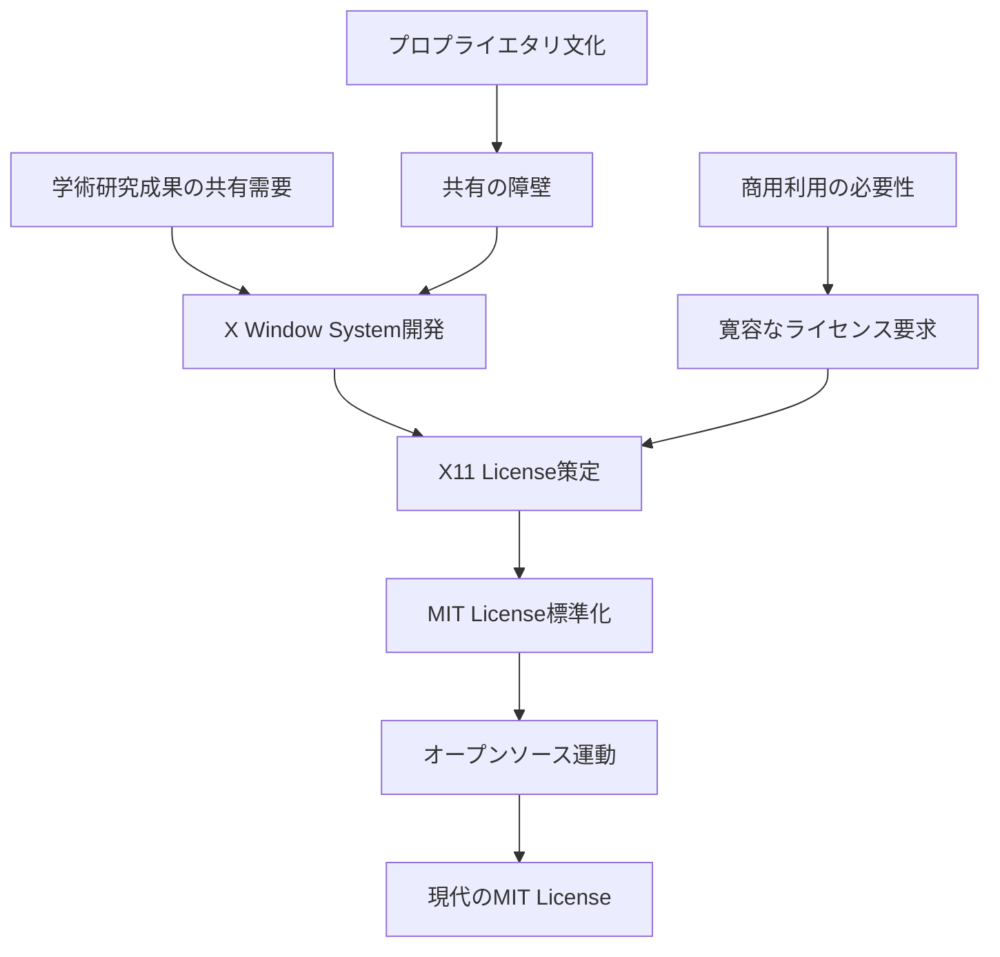
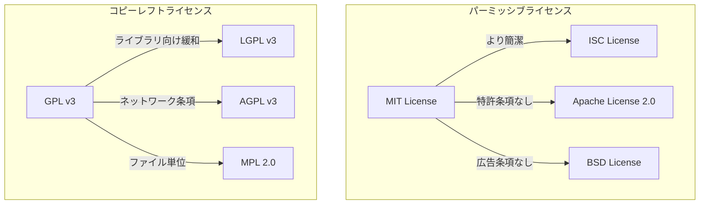
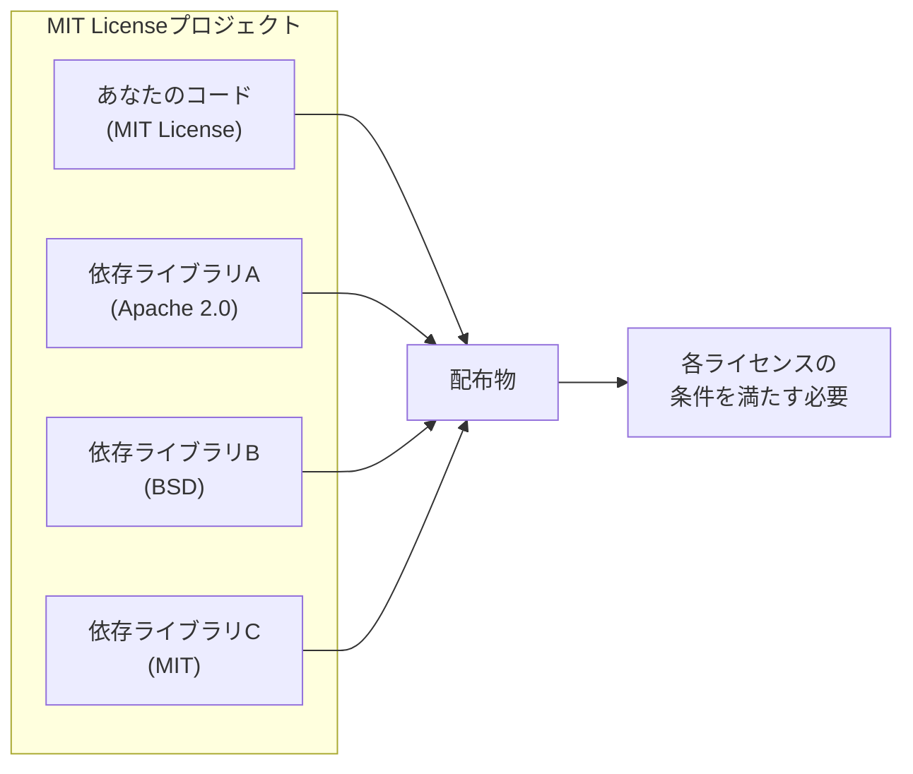
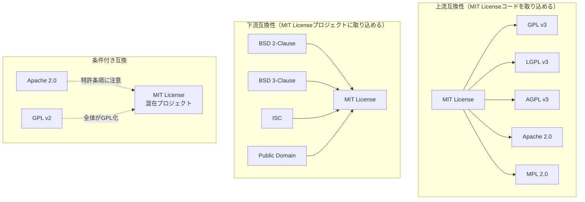
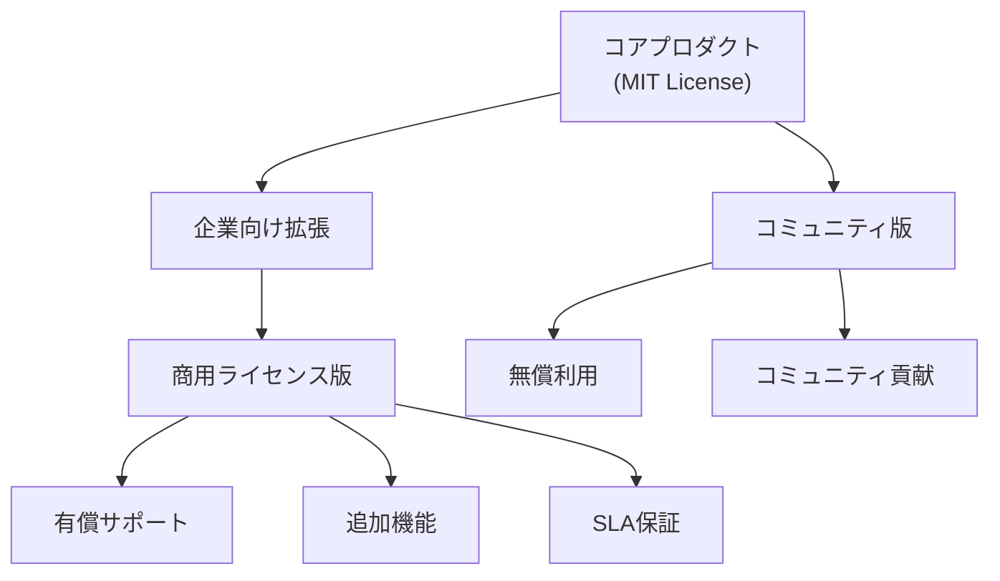
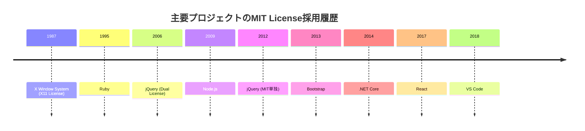

# MIT License

MIT License（マサチューセッツ工科大学ライセンス）は、現代のソフトウェア開発において最も広く採用されているオープンソースライセンスの一つです。その簡潔性、寛容性、そして法的明確性により、個人開発者から大企業まで幅広く利用されています。本稿では、MIT Licenseの成立背景から現代における実践的な適用方法まで、包括的に解説します。

## 歴史的背景と成立

MIT Licenseの起源は1980年代後半に遡ります。マサチューセッツ工科大学（MIT）において、研究成果としてのソフトウェアを広く共有するための法的枠組みが必要とされていました。当時のソフトウェア業界は、プロプライエタリなライセンスが主流であり、学術機関で開発されたソフトウェアの共有と商用利用の両立が課題となっていました。

MITは、X Window System（X11）の開発において、このライセンスモデルを初めて本格的に採用しました。X11は、UNIXワークステーション向けのグラフィカルユーザーインターフェースシステムであり、その普及には自由な利用と改変を許可するライセンスが不可欠でした。このX11 Licenseが、現在のMIT Licenseの原型となっています[^1]。

1988年にリリースされたX11R3から採用されたこのライセンスは、著作権表示とライセンス条文の保持のみを条件として、ソフトウェアの使用、複製、改変、配布、サブライセンス、販売を無制限に許可するという画期的なものでした。この寛容性は、商用ソフトウェアベンダーと学術機関の両方のニーズを満たし、X Window Systemの急速な普及に貢献しました。



## ライセンス条文の詳細解説

MIT Licenseの条文は、その簡潔性が特徴です。標準的なMIT Licenseは、わずか171語程度で構成されており、法的な専門知識がなくても理解しやすい内容となっています。以下、各部分について詳細に解説します。

### 著作権表示部分

```
Copyright (c) [year] [fullname]
```

この部分は、ソフトウェアの著作権者を明確にします。著作権表示は、ベルヌ条約加盟国においては法的に必須ではありませんが、MIT Licenseにおいては重要な意味を持ちます。著作権者の明示により、ライセンスを付与する権限の所在が明確になり、法的な有効性が担保されます。

年号の記載については、最初の公開年から現在までの範囲を示すことが一般的です。例えば、`Copyright (c) 2020-2024 John Doe`のような形式です。共同著作物の場合は、すべての著作権者を列挙するか、組織名を使用します。

### 許可条項

```
Permission is hereby granted, free of charge, to any person obtaining a copy
of this software and associated documentation files (the "Software"), to deal
in the Software without restriction, including without limitation the rights
to use, copy, modify, merge, publish, distribute, sublicense, and/or sell
copies of the Software, and to permit persons to whom the Software is
furnished to do so, subject to the following conditions:
```

この部分は、MIT Licenseの核心となる許可内容を規定しています。「without restriction」という表現により、ソフトウェアに対する権利行使に制限がないことを明確にしています。具体的に列挙されている権利は以下の通りです：

**使用（use）**: ソフトウェアを任意の目的で実行する権利。商用利用、研究利用、個人利用など、用途に制限はありません。

**複製（copy）**: ソフトウェアの複製を作成する権利。バックアップ、配布用の複製、開発環境への複製など、あらゆる形態の複製が許可されます。

**改変（modify）**: ソースコードを変更する権利。バグ修正、機能追加、最適化など、あらゆる改変が可能です。

**結合（merge）**: 他のソフトウェアと組み合わせる権利。ライブラリとしての組み込み、プラグインとしての使用など、技術的な結合方法に制限はありません。

**公開（publish）**: ソフトウェアを公に利用可能にする権利。ウェブサイトでの公開、学術論文での引用など、公開の形態は問いません。

**配布（distribute）**: 第三者にソフトウェアを提供する権利。有償・無償を問わず、あらゆる配布形態が許可されます。

**サブライセンス（sublicense）**: 第三者に対して、受け取った権利の一部または全部を再許諾する権利。これにより、ライセンスの連鎖的な適用が可能になります。

**販売（sell）**: ソフトウェアの複製を有償で提供する権利。オープンソースソフトウェアの商業化を明確に許可しています。

### 条件条項

```
The above copyright notice and this permission notice shall be included in all
copies or substantial portions of the Software.
```

MIT Licenseが課す唯一の実質的な条件は、著作権表示とライセンス条文の保持です。「substantial portions」という表現は、ある程度の解釈の余地を残していますが、一般的には以下のように理解されています：

ソフトウェア全体を配布する場合は、必ずライセンス条文を含める必要があります。部分的な利用の場合、その部分が元のソフトウェアの重要な機能を構成している場合は、ライセンス条文の保持が必要です。単純なコードスニペットや、独立性の高い小さな関数の利用については、必ずしもライセンス条文の保持は要求されないと解釈されることが多いですが、安全のためには常に保持することが推奨されます。

### 免責条項

```
THE SOFTWARE IS PROVIDED "AS IS", WITHOUT WARRANTY OF ANY KIND, EXPRESS OR
IMPLIED, INCLUDING BUT NOT LIMITED TO THE WARRANTIES OF MERCHANTABILITY,
FITNESS FOR A PARTICULAR PURPOSE AND NONINFRINGEMENT. IN NO EVENT SHALL THE
AUTHORS OR COPYRIGHT HOLDERS BE LIABLE FOR ANY CLAIM, DAMAGES OR OTHER
LIABILITY, WHETHER IN AN ACTION OF CONTRACT, TORT OR OTHERWISE, ARISING FROM,
OUT OF OR IN CONNECTION WITH THE SOFTWARE OR THE USE OR OTHER DEALINGS IN THE
SOFTWARE.
```

免責条項は、大文字で記載されることで強調されています。これは、アメリカの統一商事法典（UCC）において、保証の否認には「conspicuous」（目立つ）形式が要求されることに対応しています[^2]。

免責条項は以下の要素から構成されています：

**「AS IS」条項**: ソフトウェアが現状のまま提供されることを明示し、いかなる保証も行わないことを宣言します。

**明示的・黙示的保証の否認**: 商品性（MERCHANTABILITY）、特定目的への適合性（FITNESS FOR A PARTICULAR PURPOSE）、非侵害性（NONINFRINGEMENT）を含む、あらゆる保証を否認します。

**責任制限**: 契約責任、不法行為責任、その他のあらゆる法理論に基づく責任を制限します。

## 他のオープンソースライセンスとの比較

MIT Licenseの特徴を理解するには、他の主要なオープンソースライセンスとの比較が有効です。



### BSD Licenseとの関係

BSD License（Berkeley Software Distribution License）は、MIT Licenseと同様にパーミッシブなライセンスです。歴史的には、BSD Licenseの方が古く、1980年代初頭にカリフォルニア大学バークレー校で開発されました。

初期のBSD License（4条項BSD License）には、「広告条項」と呼ばれる要件が含まれていました。これは、ソフトウェアの広告や文書にバークレー校への謝辞を含めることを要求するものでした。この条項は後に問題視され、3条項BSD License、さらに2条項BSD License（Simplified BSD License）へと簡略化されました。

現在の2条項BSD LicenseはMIT Licenseとほぼ同等の内容ですが、免責条項の文言に若干の違いがあります。実務的には、両者の選択は主に歴史的経緯や組織の方針によるものです。

### Apache License 2.0との違い

Apache License 2.0は、MIT Licenseよりも詳細で包括的なライセンスです。主な違いは以下の通りです：

**特許権の明示的許諾**: Apache License 2.0は、著作権だけでなく特許権についても明示的に許諾を与えます。これにより、特許訴訟のリスクが軽減されます。

**特許報復条項**: ライセンシーが特許訴訟を起こした場合、ライセンスが自動的に終了する条項が含まれています。

**貢献者の定義と権利**: 貢献者（Contributor）の概念を導入し、貢献に関する権利関係を明確化しています。

**商標の扱い**: 商標権については明示的に許諾の対象外としています。

これらの追加条項により、Apache License 2.0は大規模なプロジェクトや企業での利用により適していると考えられています。一方で、MIT Licenseの簡潔性を好む開発者も多く存在します。

### GPL系ライセンスとの根本的相違

GNU General Public License（GPL）に代表されるコピーレフトライセンスは、MIT Licenseとは根本的に異なる哲学に基づいています。

GPLは「ソフトウェアの自由」を保護することを目的とし、派生物に対して同じライセンスの適用を要求します（ウイルス条項、継承条項などと呼ばれます）。これに対して、MIT Licenseは最大限の自由度を提供し、派生物のライセンス選択に制限を設けません。

この違いは、実践的には以下のような影響をもたらします：

**商用製品への組み込み**: MIT Licenseのソフトウェアは、プロプライエタリな商用製品に自由に組み込むことができます。GPLの場合、組み込んだ製品全体がGPLになる可能性があります。

**ライセンスの変更**: MIT Licenseのソフトウェアを基に、より制限的なライセンスや、異なるオープンソースライセンスを適用することが可能です。

**ソースコード開示義務**: GPLでは改変したソースコードの開示が要求されますが、MIT Licenseにはそのような義務はありません。

## 法的解釈と判例

MIT Licenseに関する直接的な判例は比較的少ないですが、その法的有効性は広く認められています。

### Jacobsen v. Katzer事件（2008年）

この事件は、オープンソースライセンスの法的拘束力を確立した重要な判例です[^3]。連邦巡回控訴裁判所は、オープンソースライセンスの条件違反が著作権侵害を構成し得ることを認めました。この判決により、MIT Licenseを含むオープンソースライセンスが、単なる契約ではなく著作権ライセンスとして機能することが確認されました。

### 著作権表示の重要性

Drauglis v. Kappa Map Group, LLC事件（2015年）では、MIT Licenseの著作権表示要件の違反が争点となりました[^4]。裁判所は、著作権表示とライセンス条文の保持がMIT Licenseの核心的な条件であり、これらの違反は著作権侵害を構成する可能性があると判断しました。

この判例は、MIT Licenseの唯一の実質的条件である著作権表示の保持が、法的に重要な意味を持つことを示しています。開発者や企業は、この条件を軽視することなく、確実に遵守する必要があります。

## 実践的な適用方法

MIT Licenseを実際のプロジェクトに適用する際には、いくつかの実践的な考慮事項があります。

### ライセンスファイルの配置

プロジェクトのルートディレクトリに`LICENSE`または`LICENSE.md`というファイル名で配置することが一般的です。GitHubやGitLabなどのコードホスティングサービスは、これらのファイル名を自動的に認識し、リポジトリページに表示します。

```
project-root/
├── LICENSE
├── README.md
├── src/
│   └── ...
└── tests/
    └── ...
```

### ソースファイルへのヘッダー追加

個々のソースファイルにライセンスヘッダーを追加することは、MIT Licenseでは必須ではありませんが、推奨される実践です。特に、ファイル単位で配布される可能性がある場合は重要です。

```javascript
/*
 * Copyright (c) 2024 Your Name
 * 
 * This software is licensed under the MIT License.
 * See LICENSE file in the project root for full license information.
 */
```

### 依存関係の管理

MIT Licenseのプロジェクトが他のライセンスのソフトウェアに依存する場合、ライセンスの互換性を確認する必要があります。MIT Licenseは非常に寛容なため、ほとんどのライセンスと互換性がありますが、以下の点に注意が必要です：

**GPL系ライセンスへの組み込み**: MIT LicenseのコードをGPLプロジェクトに組み込むことは可能ですが、結果として生成される派生物はGPLに従う必要があります。

**Apache License 2.0との組み合わせ**: 特許条項の違いにより、注意深い取り扱いが必要な場合があります。

**プロプライエタリライセンスとの組み合わせ**: MIT Licenseは制限を設けないため、自由に組み合わせることができます。



### バージョン管理での取り扱い

Gitなどのバージョン管理システムを使用する際、ライセンスファイルは最初のコミットに含めることが推奨されます。これにより、プロジェクトの全履歴においてライセンスが明確になります。

```bash
git init
echo "# My Project" > README.md
curl -o LICENSE https://opensource.org/licenses/MIT
git add README.md LICENSE
git commit -m "Initial commit with MIT License"
```

## 企業での利用における考慮事項

企業がMIT Licenseのソフトウェアを利用する際、または自社のソフトウェアにMIT Licenseを適用する際には、特有の考慮事項があります。

### コンプライアンス体制の構築

大規模な企業では、オープンソースソフトウェアの利用を管理するためのコンプライアンス体制が必要です。MIT Licenseは条件が少ないため管理は比較的容易ですが、以下の点に注意が必要です：

**ライセンス条文の保持確認**: 製品に組み込まれたMIT Licenseのソフトウェアについて、著作権表示とライセンス条文が適切に保持されているか定期的に確認する必要があります。

**依存関係の追跡**: サプライチェーン全体でMIT Licenseのコンポーネントを追跡し、それぞれについて条件を満たしていることを確認します。

**ドキュメント化**: 使用しているオープンソースコンポーネントとそのライセンスを文書化し、監査に備えます。

### 知的財産権の管理

企業が自社開発のソフトウェアにMIT Licenseを適用する場合、以下の点を考慮する必要があります：

**特許権の扱い**: MIT Licenseは特許権について明示的に言及していないため、特許を保有している場合は別途方針を定める必要があります。

**商標の保護**: MIT Licenseはソフトウェアの著作権のみを対象とするため、商標は別途保護する必要があります。

**貢献者契約**: 外部からの貢献を受け入れる場合、貢献者ライセンス契約（CLA）や開発者証明書（DCO）の導入を検討する必要があります。

### リスク評価と対策

MIT Licenseの免責条項により法的リスクは限定的ですが、ビジネス上のリスクは存在します：

**品質保証の欠如**: 「AS IS」で提供されるため、品質に関する保証はありません。重要なシステムに使用する場合は、十分なテストが必要です。

**セキュリティリスク**: セキュリティ脆弱性に関する責任も免責されるため、自己責任でセキュリティ評価を行う必要があります。

**サポートの不在**: 商用サポートが提供されない場合が多いため、内部でのサポート体制構築や、サードパーティサポートの検討が必要です。

## ライセンスの互換性と統合

複数のオープンソースライセンスが混在するプロジェクトでは、ライセンスの互換性が重要な問題となります。MIT Licenseは最も互換性の高いライセンスの一つです。



### 上流互換性

MIT Licenseのコードは、より制限的なライセンスのプロジェクトに容易に組み込むことができます。GPL、LGPL、Apache License 2.0など、主要なオープンソースライセンスはすべてMIT Licenseのコードを受け入れることができます。

ただし、組み込まれた後の派生物は、より制限的なライセンスに従うことになります。例えば、MIT LicenseのコードをGPLプロジェクトに組み込んだ場合、その部分もGPLとして扱われます。

### 下流互換性

MIT Licenseのプロジェクトに他のライセンスのコードを組み込む場合は、より慎重な検討が必要です：

**パーミッシブライセンス**: BSD License、ISC License、パブリックドメインのコードは問題なく組み込めます。

**弱いコピーレフト**: LGPLのライブラリは、動的リンクであれば組み込み可能ですが、静的リンクの場合は制約があります。

**強いコピーレフト**: GPLのコードを組み込むと、プロジェクト全体がGPLになる可能性があります。

### 実践的な統合戦略

複数ライセンスが混在する場合の実践的なアプローチ：

**モジュール境界の明確化**: 異なるライセンスのコードは、明確なモジュール境界で分離します。

**ライセンス情報の集約**: `NOTICES`や`THIRD-PARTY-LICENSES`といったファイルに、すべての依存関係のライセンス情報を集約します。

**自動化ツールの活用**: `license-checker`、`FOSSA`、`Black Duck`などのツールを使用して、ライセンスコンプライアンスを自動化します。

## デュアルライセンシングとビジネスモデル

MIT Licenseは、デュアルライセンシング戦略の一部として使用されることがあります。

### オープンコア・モデル

基本機能をMIT Licenseで公開し、追加機能や企業向け機能を商用ライセンスで提供するモデルです。このアプローチにより、コミュニティの成長と収益化を両立させることができます。



### サポート・サービスモデル

ソフトウェア自体はMIT Licenseで提供し、サポート、コンサルティング、カスタマイズなどのサービスで収益を得るモデルです。Red HatやCanonicalなどが採用している戦略に近いアプローチです。

### SaaSモデルとの組み合わせ

MIT Licenseのソフトウェアをベースに、SaaS（Software as a Service）として提供するモデルも一般的です。この場合、ソースコードは公開されていても、運用ノウハウやスケーラビリティがビジネス上の差別化要因となります。

## 国際的な視点

MIT Licenseは米国で作成されたライセンスですが、国際的に広く使用されています。各国の法制度における解釈には注意が必要です。

### 著作者人格権の問題

日本を含む多くの大陸法系の国では、著作者人格権は放棄不可能とされています。MIT Licenseはこの点について明示的に言及していないため、理論的には著作者人格権に基づく主張が可能な余地があります。

実務的には、MIT Licenseの採用が著作者人格権の不行使の黙示的な同意と解釈されることが多いですが、重要なプロジェクトでは明示的な条項の追加を検討する価値があります。

### 準拠法と管轄

MIT Licenseは準拠法や管轄について規定していません。国際的なプロジェクトでは、これらを明示的に定めることを検討する必要がある場合があります。

### 翻訳の問題

MIT Licenseの非公式な翻訳が存在しますが、法的な有効性は英語版に依存します。多言語プロジェクトでは、英語版を正式版として明記することが推奨されます。

## 将来の展望と課題

MIT Licenseは30年以上にわたって基本的に変更されていない、極めて安定したライセンスです。しかし、技術の進化に伴い、いくつかの課題も指摘されています。

### 特許権の扱い

MIT Licenseは特許権について明示的に言及していないため、特許訴訟のリスクが理論的に存在します。Apache License 2.0のような明示的な特許許諾条項の追加が議論されることがありますが、簡潔性を損なうことへの懸念から実現していません。

### SaaSループホール

MIT Licenseは、ソフトウェアの配布を伴わないSaaS利用について何も規定していません。これはAGPLが対処しようとした問題ですが、MIT Licenseの哲学からすれば、これは問題ではなく特徴と考えることもできます。

### AIとの関係

機械学習モデルの訓練データとしてMIT Licenseのコードを使用することの是非、生成されたコードの扱いなど、AI時代特有の問題については明確な指針がありません。これらは今後のオープンソースコミュニティ全体の課題となっています。

## 実装例とベストプラクティス

MIT Licenseを採用した著名なプロジェクトから、実践的なベストプラクティスを学ぶことができます。

### Node.jsの事例

Node.jsは、MIT Licenseを採用した最も成功したプロジェクトの一つです。Node.jsプロジェクトは以下のような実践を行っています：

**明確なライセンス表示**: リポジトリのルートに`LICENSE`ファイルを配置し、READMEでも言及しています。

**依存関係の管理**: `npm`エコシステムと統合し、依存関係のライセンスを自動的に管理しています。

**貢献者ガイドライン**: コントリビューションガイドでライセンスへの同意を明確にしています。

### jQueryの移行事例

jQueryは当初、MIT LicenseとGPL v2のデュアルライセンスでしたが、2012年にMIT License単独に移行しました。この決定は、企業での採用を促進し、ライセンスの複雑性を減らすためでした。

### Reactのライセンス変更

FacebookのReactは、当初独自のBSD+Patentsライセンスを使用していましたが、コミュニティからの圧力により2017年にMIT Licenseに変更されました。この事例は、MIT Licenseの普遍的な受容性を示しています。



## 技術的な統合パターン

MIT Licenseのソフトウェアを技術的に統合する際の具体的なパターンを見ていきます。

### パッケージマネージャーでの扱い

各言語のパッケージマネージャーは、MIT Licenseを標準的にサポートしています：

**npm（Node.js）**:
```json
{
  "name": "my-package",
  "version": "1.0.0",
  "license": "MIT"
}
```

**Cargo（Rust）**:
```toml
[package]
name = "my-crate"
version = "0.1.0"
license = "MIT"
```

**Maven（Java）**:
```xml
<licenses>
  <license>
    <name>MIT License</name>
    <url>https://opensource.org/licenses/MIT</url>
  </license>
</licenses>
```

### コンテナイメージでの配布

DockerなどのコンテナイメージでMIT Licenseのソフトウェアを配布する場合：

```dockerfile
FROM node:14
WORKDIR /app
COPY package*.json ./
COPY LICENSE ./
RUN npm install
COPY . .
EXPOSE 3000
CMD ["node", "server.js"]
```

ライセンスファイルをイメージに含めることで、条件を満たします。

### ビルドシステムでの自動化

ライセンスコンプライアンスをビルドプロセスに統合する例：

```javascript
// webpack.config.js
const LicenseWebpackPlugin = require('license-webpack-plugin').LicenseWebpackPlugin;

module.exports = {
  plugins: [
    new LicenseWebpackPlugin({
      perChunkOutput: false,
      outputFilename: 'third-party-licenses.txt'
    })
  ]
};
```

## まとめ

MIT Licenseは、その簡潔性と寛容性により、オープンソースソフトウェアの発展に大きく貢献してきました。わずか200語足らずの条文でありながら、複雑な現代のソフトウェア開発における法的なニーズを満たし続けています。

開発者にとっては、最小限の制約で最大限の自由を提供し、企業にとっては、法的リスクを抑えつつオープンソースの恩恵を受けることを可能にします。この絶妙なバランスが、MIT Licenseが30年以上にわたって広く採用され続けている理由です。

技術の進化とともに新たな課題も生まれていますが、MIT Licenseの根本的な価値観—シンプルさ、自由、そして実用性—は今後も変わることなく、ソフトウェア開発コミュニティの基盤であり続けるでしょう。

---

[^1]: Scheifler, R. W., & Gettys, J. (1986). The X window system. ACM Transactions on Graphics, 5(2), 79-109.

[^2]: Uniform Commercial Code § 2-316. Exclusion or Modification of Warranties.

[^3]: Jacobsen v. Katzer, 535 F.3d 1373 (Fed. Cir. 2008).

[^4]: Drauglis v. Kappa Map Group, LLC, 128 F. Supp. 3d 46 (D.D.C. 2015).