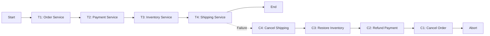
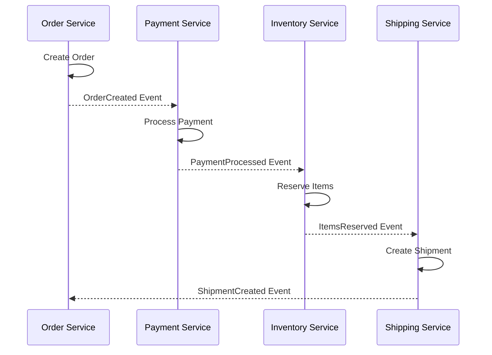
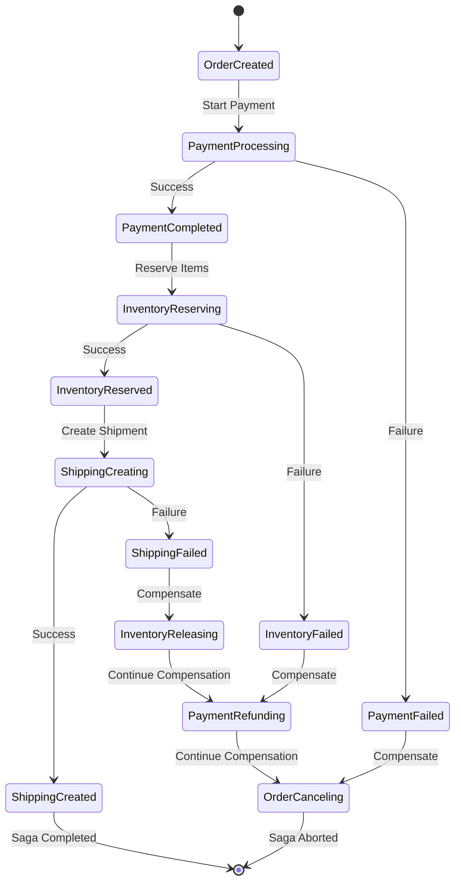
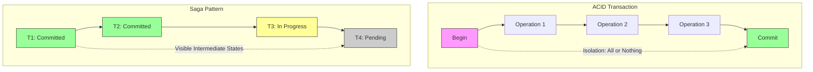
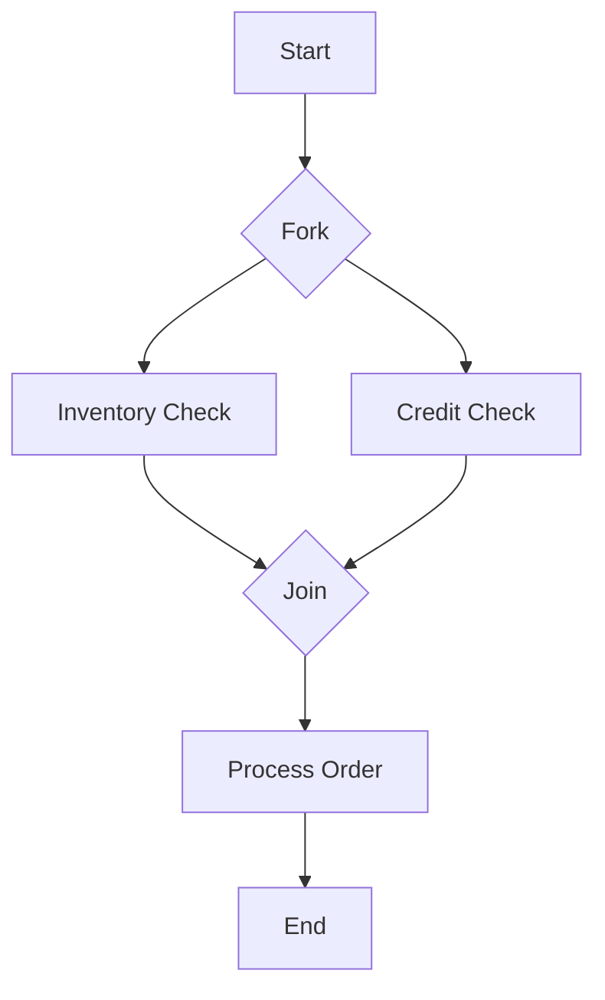

# Saga Pattern

分散システムにおけるトランザクション管理は、データの一貫性を保証する上で最も困難な課題の一つである。従来のACIDトランザクションは単一データベース内では強力な一貫性保証を提供するが、マイクロサービスアーキテクチャのような分散環境では、複数のサービスやデータベースにまたがる処理を単一のトランザクションとして扱うことは技術的に困難であり、パフォーマンスの観点からも現実的ではない。Saga Patternは、この問題に対する実践的な解決策として、長時間実行されるトランザクションを複数のローカルトランザクションの連鎖として実現する設計パターンである。

## 概念と理論的背景

Saga Patternの概念は、1987年にHector Garcia-MolinaとKenneth Salemによって発表された論文「Sagas」¹で初めて提案された。当初は長時間実行されるトランザクション（Long-Running Transactions, LRT）の問題を解決するために考案されたが、現代のマイクロサービスアーキテクチャにおいて新たな重要性を獲得している。

Sagaは、複数のローカルトランザクション（Ti）の順序付けられた集合として定義される。各ローカルトランザクションは、単一のサービス内で完結し、そのサービスのローカルデータベースを更新する。重要な特徴として、各トランザクションTiには対応する補償トランザクション（Compensating Transaction）Ciが定義されており、Tiの効果を意味的に取り消すことができる。



数学的には、Sagaは以下のように表現できる：
- 成功時：T1, T2, ..., Tn
- 失敗時（Tjで失敗）：T1, T2, ..., Tj-1, Cj-1, ..., C2, C1

この定義において重要なのは、補償トランザクションが必ずしも完全なロールバックを意味しないという点である。補償トランザクションは、ビジネスロジックの観点から見て、前のトランザクションの効果を打ち消す新しいトランザクションである。例えば、銀行口座からの引き落としに対する補償は、単純なロールバックではなく、返金という新しいトランザクションとして記録される。

## 実装パターン

Saga Patternの実装には主に２つのアプローチが存在する：コレオグラフィー（Choreography）とオーケストレーション（Orchestration）である。それぞれのアプローチには異なる特性とトレードオフが存在する。

### コレオグラフィーベースのSaga

コレオグラフィーアプローチでは、各サービスが自律的に動作し、イベントの発行と購読を通じて協調する。中央の制御機構は存在せず、各サービスは受信したイベントに基づいて次のアクションを決定する。



このアプローチの実装では、各サービスは以下の責任を持つ：

1. 自身のローカルトランザクションを実行する
2. トランザクションの結果をイベントとして発行する
3. 関連するイベントを購読し、適切なアクションを実行する
4. 失敗時には補償イベントを発行する

コレオグラフィーの主な利点は、疎結合性と拡張性である。新しいサービスを追加する際、既存のサービスを変更することなく、イベントの購読を通じてSagaに参加できる。しかし、この分散された制御は、Sagaの全体的な流れを理解することを困難にし、循環依存やデッドロックのリスクを増大させる。

### オーケストレーションベースのSaga

オーケストレーションアプローチでは、Saga Orchestratorと呼ばれる中央のコーディネーターがトランザクションの流れを制御する。Orchestratorは、各サービスに対してコマンドを発行し、その応答に基づいて次のステップを決定する。



Orchestratorの実装には、状態機械（State Machine）パターンがよく使用される。各状態は、Sagaの特定のステップを表し、状態遷移は成功または失敗の結果に基づいて行われる。このアプローチの重要な特徴は、Sagaの現在の状態を永続化する必要があることである。これにより、Orchestratorが障害から復旧した際に、中断されたSagaを再開できる。

## 補償トランザクションの設計

補償トランザクションの設計は、Saga Patternの成功において最も重要な要素の一つである。理想的には、補償トランザクションは元のトランザクションの効果を完全に取り消すべきだが、実際のビジネスシナリオでは、これは常に可能ではない。

補償可能性（Compensability）の観点から、トランザクションは以下のカテゴリーに分類できる：

### 完全補償可能（Perfectly Compensable）

元のトランザクションの効果を完全に取り消すことができる。例えば、在庫の予約は、予約の解除によって完全に補償できる。

### 部分補償可能（Partially Compensable）

ビジネスロジックの観点から見て、元の状態に戻すことはできるが、何らかの副作用が残る。例えば、送金の取り消しは可能だが、取引履歴には両方の取引が記録される。

### 補償不可能（Non-Compensable）

一度実行されると取り消すことができない。例えば、メールの送信やサードパーティAPIの呼び出しなど。これらのトランザクションは、Sagaの最後に配置するか、冪等性を持たせて再試行可能にする必要がある。

補償トランザクションの設計において考慮すべき重要な原則：

1. **冪等性**: 補償トランザクションは複数回実行されても同じ結果を生成する必要がある
2. **可換性**: 可能な限り、補償トランザクションの実行順序は結果に影響を与えないようにする
3. **セマンティックな正確性**: 補償はビジネスロジックの観点から意味のある操作である必要がある

## 分離レベルと一貫性保証

Saga Patternは、ACIDトランザクションの分離性（Isolation）を犠牲にすることで、分散環境でのトランザクション処理を可能にする。これにより、中間状態の可視性という問題が生じる。



この可視性の問題に対処するため、いくつかの技術が使用される：

### セマンティックロック

リソースに対して「処理中」のフラグを設定し、他のトランザクションがそのリソースにアクセスする際に適切な処理を行えるようにする。例えば、注文処理中の在庫アイテムに「予約済み」フラグを設定する。

### バージョニング

各エンティティにバージョン番号を付与し、楽観的並行性制御を実装する。これにより、同時実行されるSagaが互いに干渉することを防ぐ。

### コミュータティブアップデート

可能な限り、更新操作を可換にする。例えば、「残高を100に設定する」ではなく、「残高を10増やす」という操作を使用する。

## エラー処理とリトライ戦略

分散システムにおいて、一時的な障害は避けられない。Saga Patternの実装では、これらの障害に対処するための堅牢なエラー処理メカニズムが必要である。

### 障害の分類

障害は以下のカテゴリーに分類できる：

1. **一時的障害（Transient Failures）**: ネットワークタイムアウト、一時的なサービス不可など
2. **ビジネスロジック障害（Business Logic Failures）**: 残高不足、在庫切れなど
3. **技術的障害（Technical Failures）**: データベース接続エラー、不正なデータ形式など

各カテゴリーの障害には異なる対処法が必要である。一時的障害にはリトライが有効だが、ビジネスロジック障害には即座に補償を開始する必要がある。

### リトライ戦略

効果的なリトライ戦略の実装には以下の要素が含まれる：

```
RetryInterval = BaseInterval * (2^RetryCount) + Jitter
```

ここで、指数バックオフとジッターの組み合わせにより、システム全体への負荷を分散させつつ、成功の可能性を最大化する。

### サーキットブレーカーパターンとの統合

Saga Patternは、サーキットブレーカーパターンと組み合わせることで、カスケード障害を防ぐことができる。各サービス呼び出しをサーキットブレーカーでラップすることで、障害が検出された際に迅速に補償フローに移行できる。

## 実装における考慮事項

### 状態の永続化

Sagaの状態は、障害からの復旧を可能にするため、永続化される必要がある。状態の永続化には以下のアプローチがある：

1. **イベントソーシング**: Sagaの全てのイベントを記録し、現在の状態をイベントの再生によって復元する
2. **スナップショット**: 特定の時点でのSagaの状態を保存し、復旧時に使用する
3. **ハイブリッド**: イベントソーシングとスナップショットを組み合わせる

### タイムアウト管理

長時間実行されるSagaには、適切なタイムアウト管理が必要である。各ステップにタイムアウトを設定し、タイムアウトが発生した場合は補償フローを開始する。タイムアウトの設定には、ビジネス要件と技術的制約の両方を考慮する必要がある。

### 監視と可観測性

分散トランザクションの監視は複雑である。効果的な監視のために以下の要素が必要：

1. **相関ID**: Sagaの全てのトランザクションを追跡するための一意の識別子
2. **分散トレーシング**: OpenTelemetryなどのツールを使用した、エンドツーエンドのトレース
3. **メトリクス**: Sagaの成功率、平均実行時間、補償の頻度など

## パフォーマンス特性とスケーラビリティ

Saga Patternのパフォーマンス特性は、選択した実装アプローチに大きく依存する。コレオグラフィーアプローチは、各サービスが独立して動作するため、高いスケーラビリティを提供する。一方、オーケストレーションアプローチは、中央のコーディネーターがボトルネックになる可能性がある。

パフォーマンスの最適化には以下の技術が有効：

### 並列実行

依存関係のないトランザクションは並列に実行できる。例えば、在庫確認と与信確認は独立して実行可能である。



### バッチ処理

複数の小さなトランザクションをバッチ化することで、オーバーヘッドを削減できる。ただし、これは障害時の影響範囲を拡大する可能性があるため、慎重な設計が必要である。

## セキュリティ考慮事項

Saga Patternの実装において、セキュリティは重要な考慮事項である。特に以下の点に注意が必要：

### 認証と認可

各サービス間の通信には適切な認証が必要である。OAuth 2.0やmTLSなどの標準的なプロトコルを使用し、サービス間の信頼関係を確立する。また、各トランザクションの実行権限を適切に管理する必要がある。

### データの機密性

Sagaの状態には機密情報が含まれる可能性がある。状態の永続化やイベントの送信において、適切な暗号化を実施する必要がある。

### 監査ログ

規制要件を満たすため、全てのトランザクションと補償の実行を監査ログに記録する。これには、実行者、実行時刻、実行結果などの情報を含める。

## 実装例：分散注文処理システム

具体的な実装例として、eコマースシステムにおける注文処理のSagaを考える。この例では、オーケストレーションアプローチを使用する。

```python
class OrderSaga:
    def __init__(self, order_id, customer_id, items, payment_info):
        self.saga_id = generate_unique_id()
        self.order_id = order_id
        self.state = SagaState.STARTED
        self.completed_steps = []
        
    def execute(self):
        try:
            # Step 1: Create Order
            order_result = self.create_order()
            self.completed_steps.append(('create_order', order_result))
            
            # Step 2: Process Payment
            payment_result = self.process_payment()
            self.completed_steps.append(('process_payment', payment_result))
            
            # Step 3: Reserve Inventory
            inventory_result = self.reserve_inventory()
            self.completed_steps.append(('reserve_inventory', inventory_result))
            
            # Step 4: Create Shipment
            shipment_result = self.create_shipment()
            self.completed_steps.append(('create_shipment', shipment_result))
            
            self.state = SagaState.COMPLETED
            return SagaResult.SUCCESS
            
        except SagaStepException as e:
            self.compensate()
            self.state = SagaState.ABORTED
            return SagaResult.FAILED
```

このコード例は概念を示すための簡略化されたものであり、実際の実装では、各ステップの冪等性保証、状態の永続化、タイムアウト処理などが必要となる。

## ACIDトランザクションとの比較

Saga PatternとACIDトランザクションの違いを理解することは、適切な選択を行う上で重要である。ACIDトランザクションは強い一貫性保証を提供するが、分散環境では実現が困難である。一方、Saga Patternは結果整合性（Eventual Consistency）を提供し、分散環境での実用性を優先する。

トレードオフの比較：

| 特性 | ACIDトランザクション | Saga Pattern |
|------|---------------------|--------------|
| 原子性 | 完全保証 | 補償による意味的な保証 |
| 一貫性 | 強一貫性 | 結果整合性 |
| 分離性 | 完全分離 | 中間状態の可視性あり |
| 永続性 | トランザクション単位 | 各ローカルトランザクション単位 |
| スケーラビリティ | 制限あり | 高い |
| 複雑性 | 低い | 高い |

## 他のパターンとの関係

Saga Patternは、他の分散システムパターンと組み合わせて使用されることが多い。

### イベントソーシングとの統合

イベントソーシングは、Sagaの状態管理に自然に適合する。各トランザクションの実行をイベントとして記録することで、Sagaの完全な履歴を保持できる。

### CQRSとの組み合わせ

Command Query Responsibility Segregation（CQRS）パターンと組み合わせることで、読み取りと書き込みの最適化を図りながら、Sagaによる複雑な書き込み操作を管理できる。

### ドメイン駆動設計での位置づけ

Saga Patternは、ドメイン駆動設計（DDD）における集約（Aggregate）境界を越えたトランザクションを実現する手段として位置づけられる。各ローカルトランザクションは単一の集約内で完結し、Sagaが複数の集約にまたがる処理を調整する。

---

¹ Garcia-Molina, H., & Salem, K. (1987). Sagas. ACM SIGMOD Record, 16(3), 249-259.