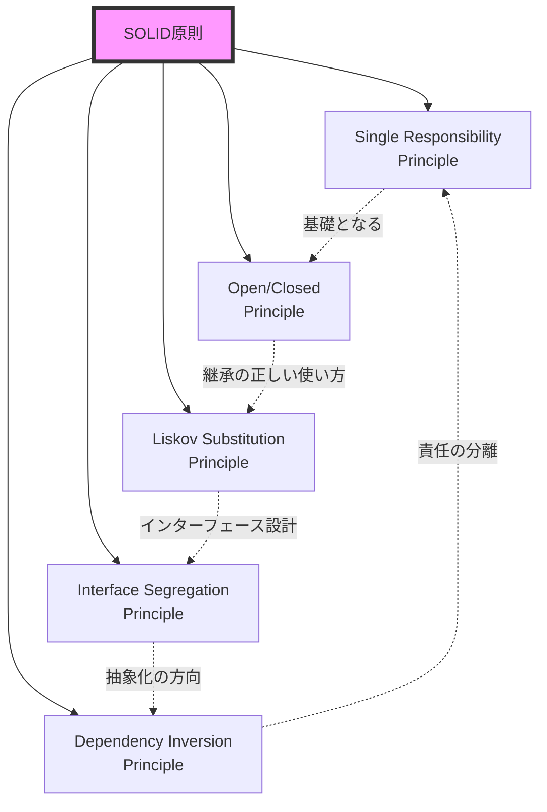
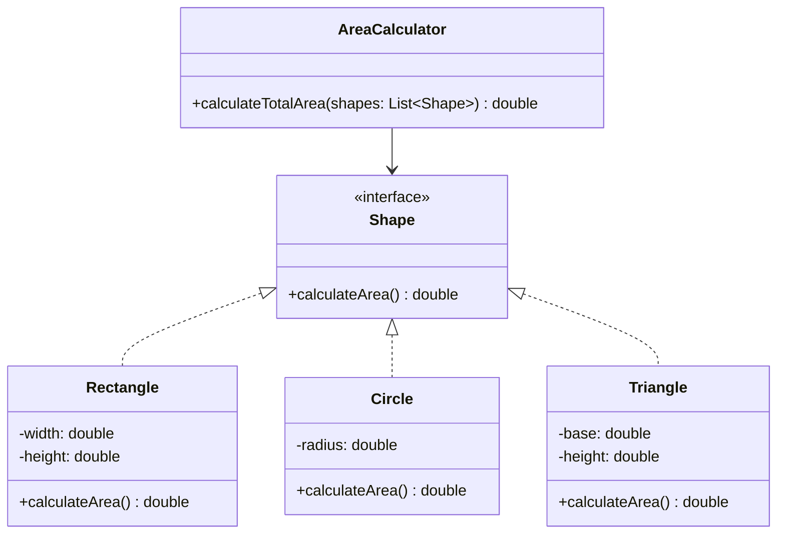
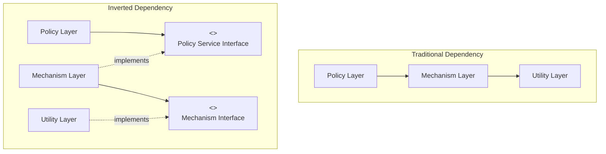
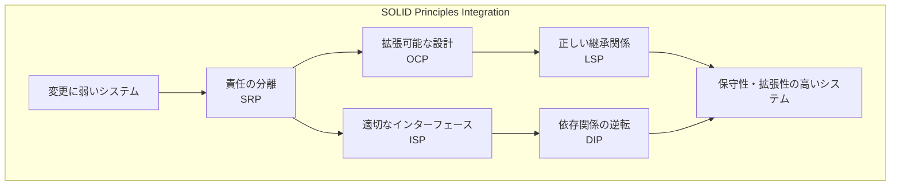

# SOLID原則：オブジェクト指向設計の基礎理論と実践

オブジェクト指向プログラミングが広く普及した現代において、保守性と拡張性に優れたソフトウェアを設計することは、エンジニアリングの最重要課題の一つである。SOLID原則は、Robert C. Martin（通称Uncle Bob）によって2000年代初頭に体系化された、オブジェクト指向設計における5つの基本原則の頭文字を取った略語である[^1]。これらの原則は、ソフトウェアの変更に対する耐性を高め、理解しやすく、かつ再利用可能なコードベースを構築するための指針として機能する。

本稿では、各原則の理論的背景から実装上の課題まで、実践的な観点から詳細に解説する。単なる原則の列挙ではなく、それぞれがどのような問題を解決し、相互にどのような関係を持ち、実際のソフトウェア開発においてどのようなトレードオフが存在するかを探求する。



## 単一責任の原則（Single Responsibility Principle）

単一責任の原則は、「クラスを変更する理由は1つ、ただ1つであるべきである」という形で表現される。この一見シンプルな原則は、実は最も理解が難しく、かつ最も重要な原則である。なぜなら、「責任」という概念自体が文脈依存的であり、システムの抽象度や粒度によって異なる解釈が可能だからである。

責任とは、本質的には「変更の理由」である。あるクラスが複数の責任を持つということは、そのクラスを変更する理由が複数存在することを意味する。例えば、従業員情報を管理するEmployeeクラスが、従業員データの永続化とビジネスロジックの両方を担当している場合、データベースの変更とビジネスルールの変更という2つの異なる理由でクラスの修正が必要になる。

```java
// Bad example - Multiple responsibilities
public class Employee {
    private String name;
    private double salary;
    
    // Business logic responsibility
    public double calculatePay() {
        // Complex salary calculation logic
        return salary * getMultiplier();
    }
    
    // Persistence responsibility
    public void save() {
        String sql = "INSERT INTO employees (name, salary) VALUES (?, ?)";
        // Database access code
    }
    
    // Report generation responsibility
    public String generateReport() {
        return String.format("Employee: %s, Salary: %.2f", name, calculatePay());
    }
}
```

このような設計は、一見すると便利に見えるが、実際には多くの問題を引き起こす。データベーススキーマの変更、給与計算ロジックの変更、レポート形式の変更という3つの異なる変更理由が存在し、それぞれが独立して発生する可能性がある。これらの責任を分離することで、変更の影響範囲を限定し、システムの保守性を向上させることができる。

責任の適切な粒度を決定するには、アクターの概念を理解することが重要である。アクターとは、システムの変更を要求する利害関係者のグループを指す。異なるアクターからの変更要求は、異なる責任として扱われるべきである。例えば、給与計算のロジックは経理部門が管理し、データベースのスキーマはDBAチームが管理し、レポートの形式は管理職が決定するかもしれない。これらは明確に異なるアクターであり、それぞれの要求に応じて独立して変更可能であるべきである。

## 開放閉鎖の原則（Open/Closed Principle）

Bertrand Meyerによって1988年に提唱された開放閉鎖の原則[^2]は、「ソフトウェアエンティティ（クラス、モジュール、関数など）は拡張に対して開いていて、修正に対して閉じているべきである」と述べている。この一見矛盾するような要求は、抽象化を通じて実現される。

この原則の核心は、既存のコードを変更することなく新しい機能を追加できるような設計を目指すことにある。これは、抽象化された安定したインターフェースと、そのインターフェースの具体的な実装を分離することで達成される。既存の実装を変更する代わりに、新しい実装を追加することで機能を拡張する。



上記の設計では、新しい図形（例えば五角形）を追加する際に、既存のAreaCalculatorクラスを修正する必要がない。新しいPentagonクラスを作成し、Shapeインターフェースを実装するだけで、システムは自動的に新しい図形を処理できるようになる。これが開放閉鎖の原則の本質である。

しかし、この原則には重要な制約がある。すべての可能な拡張を事前に予測することは不可能であり、過度な抽象化は逆にシステムを複雑にする。したがって、実践的には、最も可能性の高い変更点を特定し、それらに対してのみ開放閉鎖の原則を適用することが重要である。これは「抽象化の適切なレベル」を見極める設計スキルを要求する。

## リスコフの置換原則（Liskov Substitution Principle）

Barbara Liskovによって1987年に提唱されたこの原則[^3]は、「派生型は基底型と置換可能でなければならない」という形で表現される。より正確には、「型Sが型Tのサブタイプであるとき、プログラム内でT型のオブジェクトが使われている箇所は、プログラムの正しさを損なうことなくS型のオブジェクトで置換可能でなければならない」と定義される。

この原則は、継承関係における「is-a」関係の正しい実装を保証する。単に構文的に継承関係を定義するだけでなく、意味的にも正しい継承関係を維持することが重要である。違反の典型的な例として、正方形と長方形の関係がよく挙げられる。

```java
// LSP violation example
class Rectangle {
    protected double width;
    protected double height;
    
    public void setWidth(double width) {
        this.width = width;
    }
    
    public void setHeight(double height) {
        this.height = height;
    }
    
    public double getArea() {
        return width * height;
    }
}

class Square extends Rectangle {
    @Override
    public void setWidth(double width) {
        this.width = width;
        this.height = width; // Maintains square property
    }
    
    @Override
    public void setHeight(double height) {
        this.width = height; // Maintains square property
        this.height = height;
    }
}

// Client code that breaks with Square
public void testRectangle(Rectangle rect) {
    rect.setWidth(5);
    rect.setHeight(4);
    assert rect.getArea() == 20; // Fails for Square!
}
```

この例では、数学的には正方形は長方形の特殊なケースであるが、オブジェクト指向設計の観点からは、SquareクラスはRectangleクラスの適切なサブタイプではない。なぜなら、Rectangleクラスの契約（幅と高さを独立して設定できる）を、Squareクラスは満たすことができないからである。

リスコフの置換原則を守るためには、以下の条件を満たす必要がある：

1. **事前条件を強化してはならない**：サブクラスのメソッドは、基底クラスのメソッドよりも厳しい事前条件を要求してはならない
2. **事後条件を弱化してはならない**：サブクラスのメソッドは、基底クラスのメソッドが保証する事後条件を少なくとも満たさなければならない
3. **不変条件を保持しなければならない**：基底クラスで定義された不変条件は、サブクラスでも維持されなければならない

これらの条件は、Design by Contract（契約による設計）[^4]の概念と密接に関連している。各メソッドは、事前条件（メソッドを呼び出す前に満たされるべき条件）、事後条件（メソッドが完了した後に保証される条件）、および不変条件（オブジェクトの生存期間を通じて常に真である条件）によって定義される契約を持つ。

## インターフェース分離の原則（Interface Segregation Principle）

インターフェース分離の原則は、「クライアントは自分が使用しないメソッドに依存することを強制されるべきではない」と述べている。この原則は、大きく肥大化したインターフェースを、より小さく、より具体的な複数のインターフェースに分割することを推奨する。

この原則の背景には、不要な依存関係がシステムの結合度を高め、変更の影響範囲を拡大するという問題意識がある。クライアントが使用しないメソッドを含むインターフェースに依存している場合、それらのメソッドの変更がクライアントに影響を与える可能性がある。これは、実際には使用していない機能の変更によってクライアントの再コンパイルや再テストが必要になることを意味する。

```mermaid
graph LR
    subgraph "Bad Design - Fat Interface"
        IWorker[IWorker<br/>work()<br/>eat()<br/>sleep()]
        Human[Human]
        Robot[Robot]
        IWorker --> Human
        IWorker --> Robot
    end
    
    subgraph "Good Design - Segregated Interfaces"
        IWorkable[IWorkable<br/>work()]
        IFeedable[IFeedable<br/>eat()]
        ISleepable[ISleepable<br/>sleep()]
        Human2[Human]
        Robot2[Robot]
        IWorkable --> Human2
        IWorkable --> Robot2
        IFeedable --> Human2
        ISleepable --> Human2
    end
```

上記の例では、ロボットは食事や睡眠を必要としないにもかかわらず、IWorkerインターフェースを実装する場合、eat()とsleep()メソッドを実装する必要がある。これは明らかに不適切な設計である。インターフェースを分離することで、各クラスは必要なインターフェースのみを実装できるようになる。

インターフェース分離の原則は、役割インターフェース（Role Interface）の概念と密接に関連している。役割インターフェースは、特定のクライアントの視点から見た、オブジェクトが果たすべき役割を定義する。異なるクライアントは同じオブジェクトを異なる役割で使用する可能性があり、それぞれの役割に対して専用のインターフェースを提供することが理想的である。

しかし、過度なインターフェースの分離は、システムの複雑性を増大させる可能性がある。多数の小さなインターフェースは、理解と管理が困難になる場合がある。したがって、インターフェースの粒度は、凝集性と複雑性のバランスを考慮して決定する必要がある。

## 依存性逆転の原則（Dependency Inversion Principle）

依存性逆転の原則は、以下の2つの規則から構成される：

1. 上位モジュールは下位モジュールに依存してはならない。両者は抽象に依存すべきである
2. 抽象は詳細に依存してはならない。詳細は抽象に依存すべきである

この原則は、伝統的な手続き型プログラミングにおける依存関係の流れを「逆転」させることを意味する。手続き型プログラミングでは、上位レベルのモジュールが下位レベルのモジュールを呼び出し、下位レベルのモジュールがさらに下位のモジュールを呼び出すという、上から下への依存関係の流れが一般的である。



依存性逆転の原則を適用することで、上位レベルのポリシー層は、下位レベルの実装詳細から独立して設計・テスト・デプロイできるようになる。これは、システムの柔軟性と再利用性を大幅に向上させる。

この原則の実践的な適用として、依存性注入（Dependency Injection）パターンがある。依存性注入では、オブジェクトが必要とする依存オブジェクトを外部から提供することで、具体的な実装への直接的な依存を避ける。

```java
// Without DIP
public class EmailService {
    private SmtpClient smtpClient;
    
    public EmailService() {
        this.smtpClient = new SmtpClient(); // Direct dependency on concrete class
    }
    
    public void sendEmail(String message) {
        smtpClient.send(message);
    }
}

// With DIP
public interface EmailClient {
    void send(String message);
}

public class EmailService {
    private final EmailClient emailClient;
    
    public EmailService(EmailClient emailClient) { // Dependency injection
        this.emailClient = emailClient;
    }
    
    public void sendEmail(String message) {
        emailClient.send(message);
    }
}
```

依存性逆転の原則は、アーキテクチャレベルでの設計において特に重要である。クリーンアーキテクチャやヘキサゴナルアーキテクチャなどの現代的なアーキテクチャパターンは、この原則を中心に構築されている。これらのアーキテクチャでは、ビジネスロジックを含む中核部分が、データベースやUIなどの外部の詳細から独立して存在する。

## SOLID原則の統合的理解

SOLID原則は、それぞれが独立した概念として理解されることが多いが、実際には相互に密接に関連し、補完し合っている。これらの原則を統合的に理解し、適用することで、真に保守性と拡張性に優れたシステムを構築できる。

単一責任の原則は、他のすべての原則の基礎となる。責任が適切に分離されていなければ、開放閉鎖の原則に従った拡張可能な設計も、インターフェース分離の原則に従った適切なインターフェース設計も実現できない。逆に、インターフェース分離の原則と依存性逆転の原則を適用することで、単一責任の原則をより効果的に実現できる。



実際のソフトウェア開発において、これらの原則を適用する際には、以下のようなトレードオフを考慮する必要がある：

**複雑性とシンプルさのバランス**：SOLID原則を厳格に適用すると、多数の小さなクラスとインターフェースが生成される。これは、個々のコンポーネントの責任を明確にし、テスタビリティを向上させる一方で、システム全体の理解を困難にする可能性がある。適切な抽象化のレベルを見極め、過度な複雑化を避けることが重要である。

**パフォーマンスへの影響**：抽象化と間接参照の層を追加することで、わずかながらパフォーマンスのオーバーヘッドが発生する可能性がある。多くの場合、このオーバーヘッドは無視できるレベルであるが、パフォーマンスが critical な領域では、原則の適用を慎重に検討する必要がある。

**開発速度との兼ね合い**：初期の開発段階で過度に原則を適用すると、開発速度が低下する可能性がある。アジャイル開発においては、最初はシンプルな設計から始め、必要に応じてリファクタリングを通じて原則を適用していくアプローチが効果的である。

**チームの成熟度**：SOLID原則を効果的に適用するには、チーム全体がこれらの概念を理解し、一貫して適用する必要がある。チームの技術的な成熟度に応じて、原則の適用度合いを調整することが現実的である。

## 実装パターンと設計への応用

SOLID原則は、多くの設計パターンの基礎となっている。例えば、StrategyパターンはOCPとDIPの直接的な適用であり、DecoratorパターンはOCPとLSPを活用している。これらのパターンを理解し、適切に適用することで、SOLID原則をより実践的に活用できる。

現代のフレームワークやライブラリの多くは、SOLID原則を前提として設計されている。SpringフレームワークのDIコンテナはDIPの実装であり、多くのテスティングフレームワークはこれらの原則に従った設計を前提としている。したがって、SOLID原則を理解することは、これらのツールを効果的に使用するためにも重要である。

マイクロサービスアーキテクチャの文脈では、SOLID原則はサービス境界の設計に適用される。各マイクロサービスは単一の責任を持ち（SRP）、明確に定義されたインターフェースを通じて通信し（ISP）、実装の詳細から独立している（DIP）べきである。

テスト駆動開発（TDD）とSOLID原則は相乗効果を持つ。TDDを実践することで、自然とテスタブルな設計が促進され、これはSOLID原則に従った設計と一致することが多い。逆に、SOLID原則に従った設計は、テストの作成と保守を容易にする。

継続的な学習と実践を通じて、これらの原則を内面化し、直感的に適用できるようになることが、優れたソフトウェアエンジニアへの道である。原則は指針であり、教条的に従うべき規則ではない。常に文脈を考慮し、プラグマティックな判断を下すことが重要である。

[^1]: Martin, R. C. (2000). "Design Principles and Design Patterns". objectmentor.com
[^2]: Meyer, B. (1988). "Object-Oriented Software Construction". Prentice Hall. ISBN 0-13-629049-3
[^3]: Liskov, B. (1987). "Data abstraction and hierarchy". SIGPLAN Notices. 23 (5): 17–34
[^4]: Meyer, B. (1992). "Applying 'Design by Contract'". Computer. 25 (10): 40–51