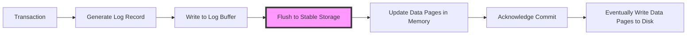
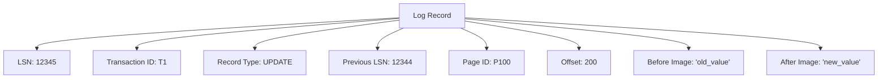
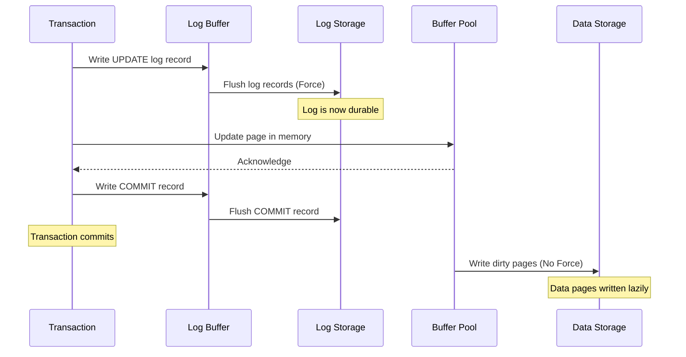
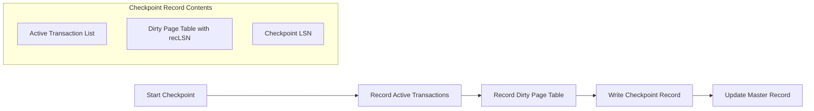
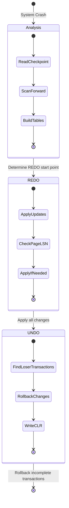
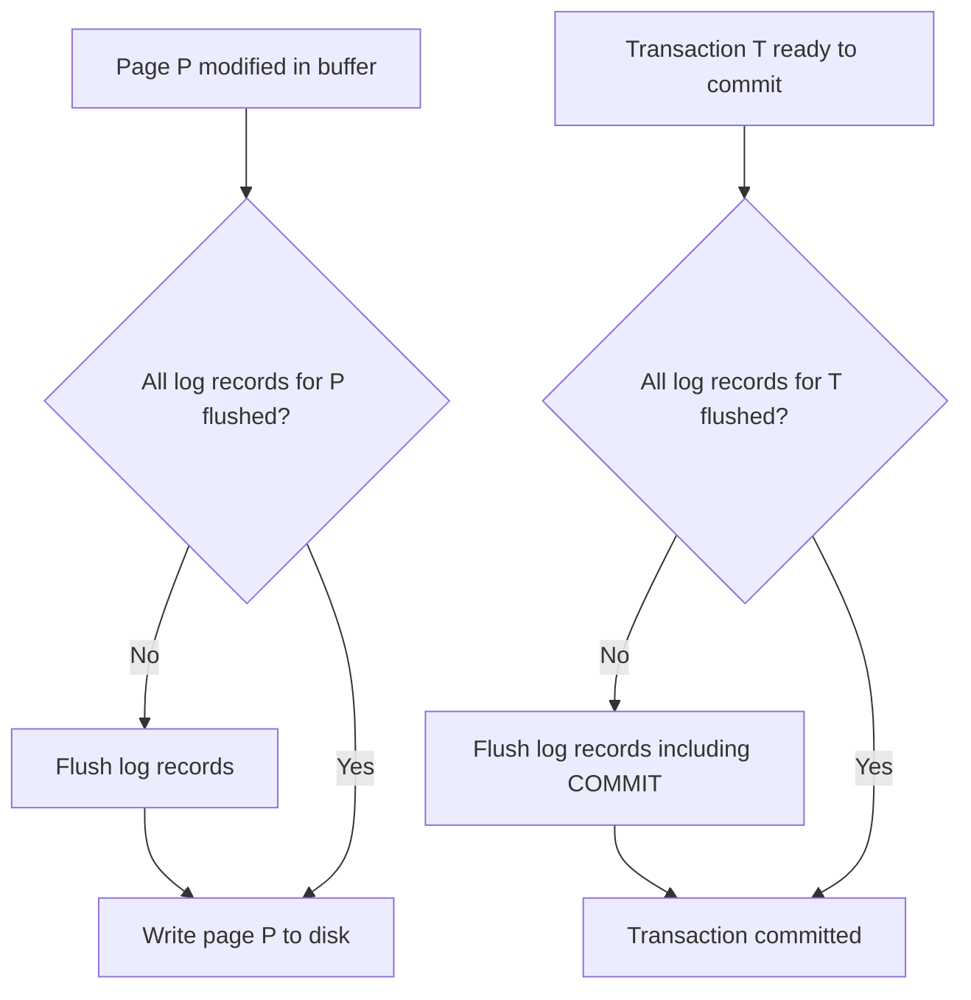
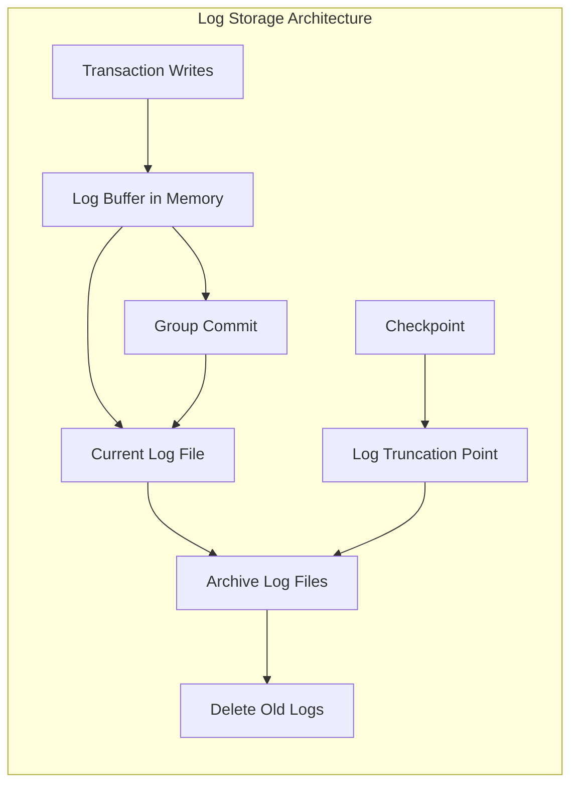
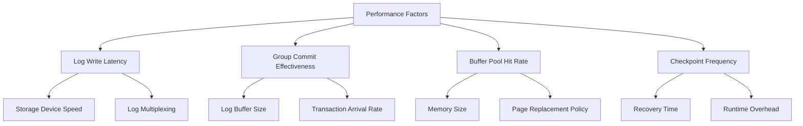
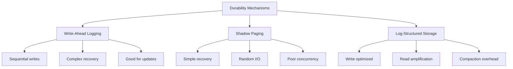

# Write Ahead Logging

Write Ahead Logging（WAL）は、データベースシステムにおいてトランザクションの原子性と永続性を保証するための基本的なメカニズムである。データの変更を実際のデータページに反映する前に、まずログレコードとして永続化することで、システムクラッシュからの確実なリカバリを可能にする。この「先書きログ」という名前は、データの変更がディスクに書き込まれる前に、必ずログが先に書き込まれることを意味している。

データベースシステムがトランザクションをコミットする際、まずそのトランザクションによる全ての変更内容をログレコードとして記録し、これを永続的なストレージに書き込む。この時点でトランザクションは「コミット済み」と見なされ、たとえシステムがクラッシュしてもログから変更内容を再構築できる。実際のデータページへの変更は、パフォーマンス上の理由から遅延して行われることが多い。

## ログレコードの構造と種類

WALシステムにおけるログレコードは、データベースの変更を正確に記録し、必要に応じて再現できるように設計されている。各ログレコードは一意のLog Sequence Number（LSN）を持ち、これによってログ内での順序が厳密に定義される。LSNは単調増加する値であり、システム全体で一意性が保証される。

基本的なログレコードの構造は以下の要素を含む：LSN、トランザクションID、レコードタイプ、前のログレコードへのポインタ、そして実際の変更内容である。変更内容の記録方式には物理ログと論理ログの二つのアプローチがある。物理ログは変更されたバイト列をそのまま記録し、論理ログは実行された操作を記録する。多くの実用的なシステムでは、両者の利点を組み合わせた物理論理ログ（physiological logging）が採用されている[^1]。

トランザクションの開始時にはBEGINレコードが、コミット時にはCOMMITレコードが記録される。更新操作に対してはUPDATEレコードが生成され、これには変更前の値（before image）と変更後の値（after image）の両方が含まれる。この二つの値を記録することで、REDOとUNDOの両方の操作が可能となる。

## ARIES: 実践的なWALアルゴリズム

ARIES（Algorithm for Recovery and Isolation Exploiting Semantics）は、IBMによって開発され、現在多くの商用データベースシステムで採用されているWALベースのリカバリアルゴリズムである[^2]。ARIESは「No Force, Steal」ポリシーを採用しており、コミット時にデータページをディスクに書き込む必要がなく（No Force）、かつコミットされていないトランザクションのデータページもディスクに書き込むことができる（Steal）。

ARIESの中核となる概念の一つがCompensation Log Record（CLR）である。トランザクションのロールバック時に、元の操作を取り消すための操作もログに記録される。これにより、ロールバック中にクラッシュが発生した場合でも、リカバリプロセスは正確にどこまでロールバックが完了していたかを把握できる。

ページLSNという概念もARIESの重要な要素である。各データページには、そのページに適用された最新のログレコードのLSNが記録される。リカバリ時には、このページLSNとログレコードのLSNを比較することで、特定の更新が既に適用されているかどうかを判断できる。これにより、同じ更新を重複して適用することを防ぐ。

## チェックポイント機構

チェックポイントは、リカバリ時間を短縮するための重要なメカニズムである。定期的にシステムの状態をログに記録することで、リカバリプロセスがログ全体をスキャンする必要をなくす。チェックポイントレコードには、その時点でアクティブなトランザクションのリスト、ダーティページのリスト、そして各ダーティページの最も古いLSN（recLSN）が含まれる。

ファジーチェックポイントと呼ばれる手法では、チェックポイント中もシステムは通常の処理を継続できる。チェックポイントの開始時点でのシステム状態を記録し、その後の変更は通常通りログに記録される。これにより、チェックポイントによるシステムの停止時間を最小限に抑えることができる。

チェックポイントの頻度は重要なチューニングパラメータである。頻繁なチェックポイントはリカバリ時間を短縮するが、通常運用時のオーバーヘッドを増加させる。一方、チェックポイントの間隔が長すぎると、リカバリ時に処理すべきログ量が増大し、リカバリ時間が長くなる。

## リカバリプロセスの詳細

ARIESのリカバリプロセスは三つのフェーズから構成される：分析（Analysis）、REDO、UNDOである。各フェーズは明確に定義された役割を持ち、システムを一貫性のある状態に復元する。

分析フェーズでは、最後のチェックポイントからログを前方向にスキャンし、クラッシュ時点でのシステム状態を再構築する。このフェーズで、どのトランザクションがアクティブだったか、どのページがダーティだったか、そしてREDOをどこから開始すべきかが決定される。トランザクションテーブルとダーティページテーブルが構築され、これらは後続のフェーズで使用される。

REDOフェーズでは、分析フェーズで決定された開始点からログを前方向にスキャンし、必要な更新を再適用する。重要なのは、コミット済みかどうかに関わらず、ログに記録された全ての更新がREDOされることである。ただし、ページLSNのチェックにより、既に適用済みの更新はスキップされる。

UNDOフェーズでは、クラッシュ時点でアクティブだったトランザクション（loser transactions）の変更を取り消す。このフェーズはログを後方向にスキャンし、各トランザクションの更新を逆順に取り消していく。CLRの存在により、部分的にロールバックされたトランザクションも正しく処理される。

## Write-Ahead Loggingプロトコル

WALプロトコルの基本原則は単純だが強力である：データページをディスクに書き込む前に、そのページに関連する全てのログレコードを先に永続化しなければならない。この原則は二つの具体的なルールとして実装される。

第一のルールは、更新されたデータページをディスクに書き込む前に、そのページに対する全ての更新のログレコード（UNDOログ）が永続的ストレージに書き込まれていなければならないというものである。これにより、コミットされていないトランザクションの変更がディスクに書き込まれた場合でも、その変更を取り消すための情報が保証される。

第二のルールは、トランザクションがコミットされたと見なされる前に、そのトランザクションの全てのログレコード（REDOログを含む）が永続的ストレージに書き込まれていなければならないというものである。これにより、一度コミットされたトランザクションの変更は、システムクラッシュ後も必ず復元できることが保証される。

ログの書き込みには、グループコミットという最適化手法がよく用いられる。複数のトランザクションのログレコードをバッファに蓄積し、一定の条件（時間経過やバッファサイズ）が満たされた時点でまとめてディスクに書き込む。これにより、ディスクI/Oの回数を削減し、スループットを向上させることができる。

## ログの物理的な実装

WALの物理的な実装には多くの工夫が必要である。ログは通常、固定サイズのログファイルのシーケンスとして実装される。新しいログレコードは現在のログファイルの末尾に追加され、ファイルが満杯になると新しいファイルが作成される。古いログファイルは、そこに含まれる全てのトランザクションがコミットまたはアボートされ、かつ関連する全てのダーティページがディスクに書き込まれた後に削除できる。

ログの書き込み性能は、システム全体のトランザクション処理性能を決定する重要な要因である。そのため、ログ専用のディスクやSSDを使用することが一般的である。また、ログの書き込みはシーケンシャルアクセスであるため、HDDでも比較的高い性能を達成できる。

ログバッファの管理も重要な実装上の課題である。複数のトランザクションが同時にログを書き込む場合、適切な同期機構が必要となる。一般的なアプローチは、各トランザクションにログバッファ内の領域を予約させ、その後並行してログレコードを書き込ませることである。

## 性能特性とトレードオフ

WALシステムの性能は、いくつかの要因によって決定される。ログの書き込み遅延は、トランザクションのコミット時間に直接影響する。そのため、低遅延のストレージデバイスの使用や、ログの多重化（複数のディスクへの並行書き込み）などの手法が採用される。

バッファプールの管理ポリシーもWALの性能に大きな影響を与える。「No Force」ポリシーにより、コミット時にデータページを書き込む必要がないため、トランザクションのレスポンスタイムが向上する。一方で、これはリカバリ時により多くのREDO作業が必要になることを意味する。

メモリ内のログバッファサイズは、グループコミットの効果とメモリ使用量のトレードオフを決定する。大きなバッファはより多くのトランザクションをグループ化できるが、クラッシュ時に失われる可能性のある作業量も増加する。

## 分散システムにおけるWAL

分散データベースシステムでは、WALの実装はさらに複雑になる。各ノードが独自のログを持つ場合、分散トランザクションのコミットには二相コミットプロトコルなどの分散合意アルゴリズムが必要となる。また、ログの順序付けにはグローバルなタイムスタンプやベクタークロックなどの仕組みが必要となる[^3]。

レプリケーションを使用するシステムでは、WALは変更を他のレプリカに伝播するための基盤としても機能する。プライマリレプリカのログをセカンダリレプリカにストリーミングすることで、効率的なレプリケーションが実現される。この方式は、PostgreSQLのストリーミングレプリケーションやMySQLのバイナリログレプリケーションなどで採用されている。

## メモリ最適化とNVMの影響

Non-Volatile Memory（NVM）の登場により、WALの設計にも新たな可能性が生まれている。NVMは、DRAMに近い性能を持ちながら永続性を提供するため、ログの書き込み遅延を大幅に削減できる。しかし、NVMの書き込み耐久性の制限や、キャッシュコヒーレンシの問題など、新たな課題も存在する[^4]。

インメモリデータベースシステムでは、WALは主にレプリケーションとリカバリのために使用される。データ自体はメモリに保持されるため、ログのみが永続的ストレージに書き込まれる。この場合、ログの圧縮や、コマンドログ（論理ログ）の使用など、異なる最適化手法が適用される。

## 実装上の詳細な考慮事項

WALシステムの実装には、多くの細かな考慮事項が存在する。ログレコードのチェックサムは、ディスクの故障やソフトウェアのバグによるログの破損を検出するために重要である。部分的に書き込まれたログレコードの検出と処理も、システムの堅牢性を保つために必要である。

ログのアーカイブとバックアップ戦略も重要な実装上の課題である。Point-in-Time Recovery（PITR）を実現するためには、ベースバックアップとその後のログファイルを適切に管理する必要がある。ログのアーカイブは、通常のログローテーションとは独立して管理され、長期保存のための圧縮や暗号化が適用されることもある。

マルチスレッド環境でのログ書き込みの同期は、特に注意が必要な領域である。Lock-freeアルゴリズムやwait-freeアルゴリズムを使用することで、高い並行性を実現できる。各スレッドがログバッファ内の領域を予約するためのatomic操作と、実際のログレコードの書き込みを分離することで、競合を最小限に抑えることができる。

## 代替アプローチとの比較

Shadow Pagingは、WALの代替となる永続性保証メカニズムである。このアプローチでは、更新されたページのコピーを作成し、全ての更新が完了した後にページテーブルをatomicに切り替える。Shadow Pagingは実装が単純で、REDOが不要という利点があるが、ランダムI/Oが多く、同時実行制御が複雑になるという欠点がある。

Log-Structured Storage（LSS）は、データベース全体をログとして構造化するアプローチである。LevelDBやRocksDBなどのLSM-treeベースのストレージエンジンがこの例である。LSSでは、全ての更新が追加のみの操作となるため、書き込み性能が優れているが、読み取り時に複数のレベルを検索する必要があり、定期的なコンパクションが必要となる。

## 最新の研究動向

最近の研究では、機械学習を使用したログサイズの予測や、自動的なチェックポイント間隔の調整などが提案されている。また、マルチコアプロセッサの性能を最大限に活用するための、スケーラブルなログ管理アルゴリズムの研究も進んでいる。

ハードウェアトランザクショナルメモリ（HTM）との統合も興味深い研究領域である。HTMを使用することで、ログバッファへのアクセスの同期オーバーヘッドを削減し、より細粒度の並行性を実現できる可能性がある。

クラウド環境でのWALの実装も新たな課題と機会を提供している。ログの保存にオブジェクトストレージを使用することで、実質的に無限のログ保存容量を得られるが、レイテンシとコストのトレードオフを慎重に管理する必要がある。Amazon Auroraのようなクラウドネイティブなデータベースは、ストレージ層でログを直接処理することで、ネットワーク転送量を削減している[^5]。

Write-Ahead Loggingは、40年以上にわたってデータベースシステムの中核技術として使用されており、その基本原理は変わっていない。しかし、新しいハードウェアや使用パターンに対応するため、実装の詳細は常に進化し続けている。NVMやクラウドストレージなどの新技術は、WALの設計に新たな最適化の機会を提供しており、今後も活発な研究開発が期待される分野である。

[^1]: Mohan, C., et al. "ARIES: A Transaction Recovery Method Supporting Fine-Granularity Locking and Partial Rollbacks Using Write-Ahead Logging." ACM Transactions on Database Systems, vol. 17, no. 1, 1992, pp. 94-162.

[^2]: Mohan, C. "ARIES/KVL: A Key-Value Locking Method for Concurrency Control of Multiaction Transactions Operating on B-Tree Indexes." Proceedings of the 16th VLDB Conference, 1990, pp. 392-405.

[^3]: Bernstein, P. A., and Goodman, N. "Concurrency Control in Distributed Database Systems." ACM Computing Surveys, vol. 13, no. 2, 1981, pp. 185-221.

[^4]: Arulraj, J., and Pavlo, A. "How to Build a Non-Volatile Memory Database Management System." Proceedings of the 2017 ACM International Conference on Management of Data, 2017, pp. 1753-1758.

[^5]: Verbitski, A., et al. "Amazon Aurora: Design Considerations for High Throughput Cloud-Native Relational Databases." Proceedings of the 2017 ACM International Conference on Management of Data, 2017, pp. 1041-1052.