# エクストリームプログラミング

エクストリームプログラミング（Extreme Programming、XP）は、1990年代後半にケント・ベックによって体系化されたアジャイルソフトウェア開発手法である。「エクストリーム」という名称は、効果的とされるソフトウェア開発プラクティスを極限まで推し進めるという思想に由来する。コードレビューが有効であればペアプログラミングで常時レビューを行い、テストが重要であれば最初にテストを書き、設計の単純性が重要であれば継続的にリファクタリングを行うという具合に、良いとされる実践を極限まで追求する。

XPは、C3プロジェクト（Chrysler Comprehensive Compensation System）での経験を基に形式化された¹。このプロジェクトは、クライスラー社の給与計算システムの再構築を目的としており、従来の開発手法では対応困難な要求の変化と品質の問題に直面していた。ベックはこの課題に対して、軽量で柔軟な開発プロセスを導入し、それがXPの原型となった。

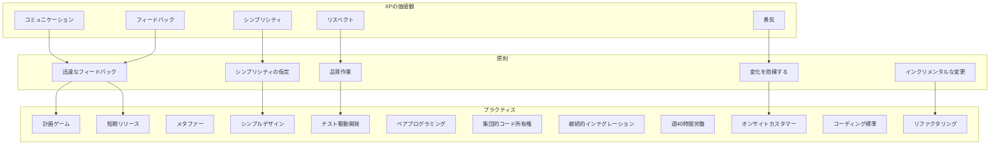

## 価値観の体系

XPの根底にある5つの価値観は、単なる理念ではなく、日々の開発活動における意思決定の基準となる。コミュニケーションは、ソフトウェア開発における多くの問題が情報伝達の不備に起因するという認識から重視される。開発者間、開発者と顧客間の対話を促進し、暗黙知を形式知に変換する継続的なプロセスが求められる。

シンプリシティは、YAGNI（You Aren't Gonna Need It）原則として具現化される。将来必要になるかもしれない機能を予測して実装することは、多くの場合無駄になるだけでなく、システムの複雑性を不必要に増大させる。現時点で必要な機能のみを、可能な限り単純に実装することで、変更への対応力を維持する。

フィードバックは、短いサイクルで頻繁に得ることで、軌道修正のコストを最小化する。単体テストは分単位、受け入れテストは日単位、イテレーションは週単位でフィードバックを提供し、問題の早期発見と対応を可能にする。このフィードバックループの短縮は、不確実性の高いプロジェクトにおいて特に重要である。

勇気は、既存のコードを改善するリファクタリング、失敗した設計の破棄、新しい技術の採用など、必要な変更を恐れずに実行する態度を指す。この勇気は、包括的なテストスイートや集団的コード所有権といった他のプラクティスによって支えられる。

リスペクトは、2004年の第2版で追加された価値観である²。チームメンバー間の相互尊重は、建設的な批判と協力的な問題解決の前提条件となる。技術的な議論が個人攻撃に発展することを防ぎ、心理的安全性の高い開発環境を構築する。

## プラクティスの相互依存性

XPの12のプラクティスは、個別に採用しても一定の効果があるが、相互に補強し合う関係にあり、全体として採用することで最大の効果を発揮する。この相互依存性は、XPの特徴的な側面である。

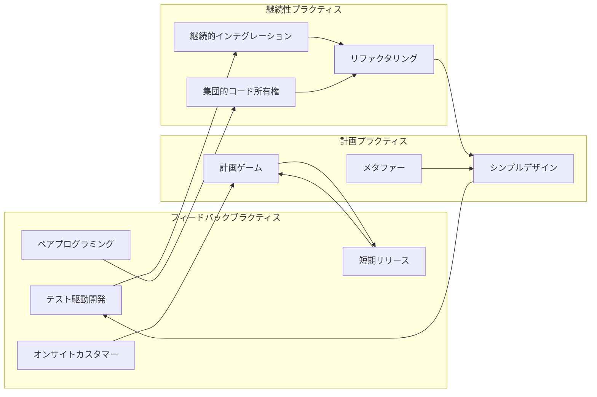

計画ゲームは、ビジネス側と開発側の責任を明確に分離しながら、協調的な計画立案を実現する。ビジネス側は機能の優先順位を決定し、開発側は技術的な実現可能性と工数を見積もる。この分離により、それぞれの専門性を最大限に活用しながら、現実的な計画を立案できる。

短期リリースは、通常2〜4週間のイテレーションで動作するソフトウェアをリリースする。これにより、顧客は早期に価値を得られ、開発チームは実際の使用状況からフィードバックを得られる。短期リリースを実現するには、継続的インテグレーションと包括的なテストスイートが不可欠である。

## テスト駆動開発の実践

テスト駆動開発（TDD）は、XPの中核的プラクティスであり、Red-Green-Refactorサイクルとして知られる³。まず失敗するテストを書き（Red）、そのテストを通過する最小限のコードを実装し（Green）、コードの品質を向上させるリファクタリングを行う（Refactor）。

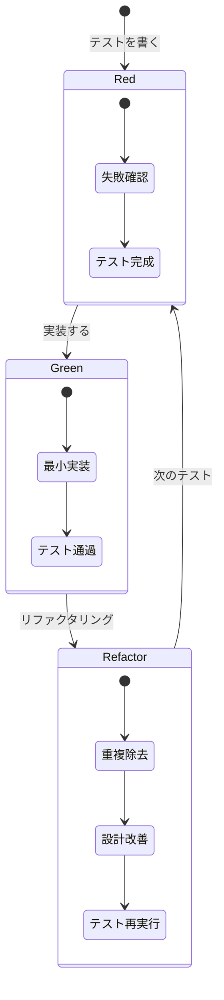

TDDの効果は、単にバグの早期発見にとどまらない。テストファーストのアプローチは、インターフェースの設計を使用者の視点から行うことを強制し、より使いやすいAPIの設計につながる。また、包括的なテストスイートは、リファクタリングの安全網として機能し、継続的な設計改善を可能にする。

テストの粒度は、単体テスト、統合テスト、受け入れテストの階層で構成される。単体テストは個々のクラスやメソッドの振る舞いを検証し、統合テストはコンポーネント間の相互作用を確認し、受け入れテストはビジネス要求の充足を保証する。この多層的なテスト戦略により、異なるレベルでの品質保証が実現される。

## ペアプログラミングの認知科学

ペアプログラミングは、2人の開発者が1台のコンピュータを共有してプログラミングを行う手法である。ドライバーがキーボードを操作してコードを書き、ナビゲーターがコードをレビューし、戦略的な思考を行う。この役割は頻繁に交代される。

認知科学的観点から、ペアプログラミングは認知負荷を分散させる効果がある⁴。プログラミングは、問題分解、アルゴリズム設計、構文記述、デバッグなど、多様な認知タスクを同時に要求する。ペアプログラミングでは、これらのタスクを2人で分担することで、各個人の認知負荷を軽減し、より高度な問題解決を可能にする。

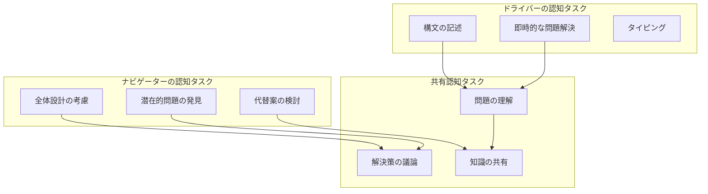

ペアプログラミングの生産性については議論があるが、実証研究では、初期の生産性低下（約15%）は、バグの減少（40-60%）とコードの品質向上によって相殺されることが示されている⁵。さらに、知識共有の促進により、チーム全体の技術力向上と、特定個人への依存リスクの軽減が実現される。

## リファクタリングと技術的負債

リファクタリングは、外部から見た振る舞いを変えずに、コードの内部構造を改善するプロセスである。マーティン・ファウラーは、リファクタリングを「ソフトウェアの外部的振る舞いを保ったまま、理解や修正が簡単になるように、内部構造を改善すること」と定義している⁶。

技術的負債の概念は、ウォード・カニンガムによって提唱された⁷。急いで実装した低品質のコードは、金融における負債と同様に「利子」を生む。この利子は、将来の変更コストの増大として現れる。XPは、継続的なリファクタリングによって技術的負債を最小化し、システムの保守性を維持する。

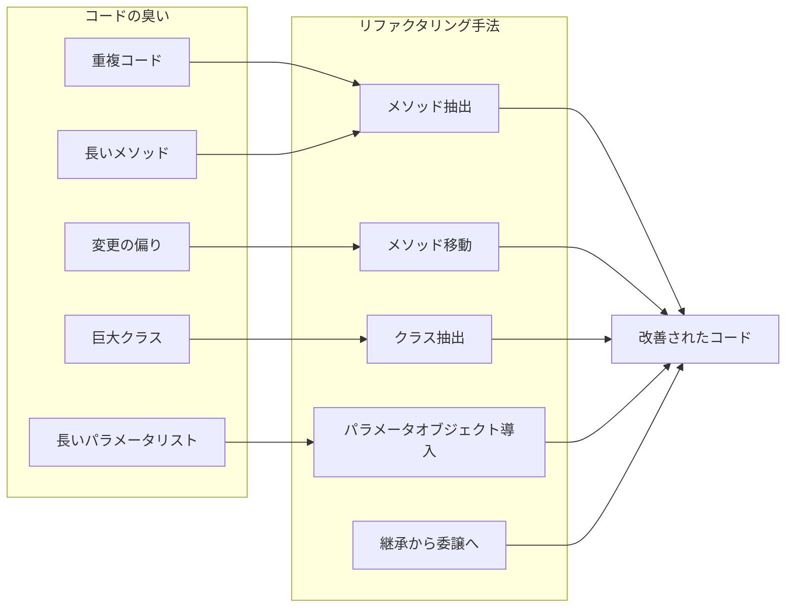

リファクタリングの実施には、包括的なテストスイートが前提となる。テストなしでのリファクタリングは、リスクが高く、結果として技術的負債を増加させる可能性がある。XPでは、TDDによって構築されたテストスイートが、リファクタリングの安全網として機能する。

## 継続的インテグレーションの進化

継続的インテグレーション（CI）は、開発者が頻繁に（少なくとも日次で）コードを統合し、自動ビルドとテストによって統合の問題を早期に発見する手法である。マーティン・ファウラーは、CIの本質を「統合地獄」の回避にあると述べている⁸。

現代のCI実践は、XPが提唱した当初の形態から大きく進化している。GitHubやGitLabなどのプラットフォームと、Jenkins、CircleCI、GitHub Actionsなどのツールにより、完全に自動化されたCIパイプラインの構築が可能になった。これらのツールは、コード品質チェック、セキュリティスキャン、パフォーマンステストなど、より包括的な検証を可能にしている。

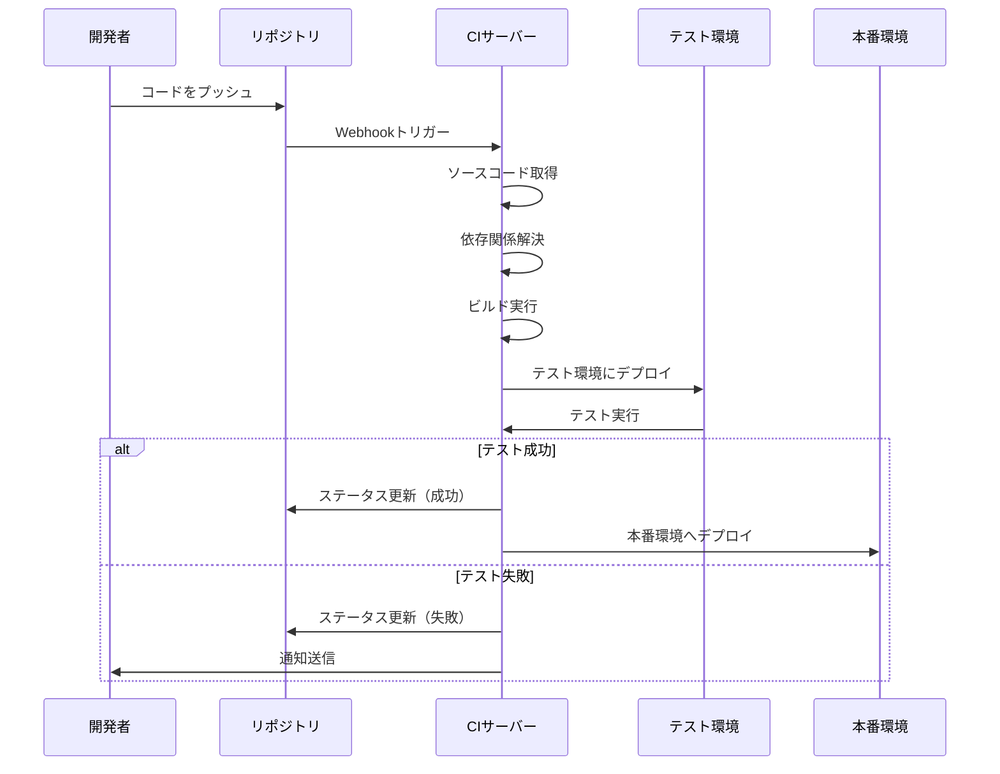

継続的デリバリー（CD）への発展は、XPの短期リリースの概念を極限まで推し進めたものである。適切に構築されたCDパイプラインでは、すべてのコミットが潜在的にリリース可能な状態となる。これにより、ビジネス価値の迅速な提供と、市場フィードバックの早期取得が可能になる。

## 組織文化への影響

XPの導入は、単なる技術的プラクティスの採用にとどまらず、組織文化の変革を要求する。階層的な意思決定構造から、自律的なチームによる協調的な意思決定への移行が必要となる。この文化的変革は、しばしば技術的な課題以上に困難である。

心理的安全性の概念は、XPの成功に不可欠である⁹。失敗を学習の機会として捉え、実験を奨励する文化がなければ、「勇気」の価値観は実現されない。グーグルの研究によれば、心理的安全性は高パフォーマンスチームの最も重要な特性である¹⁰。

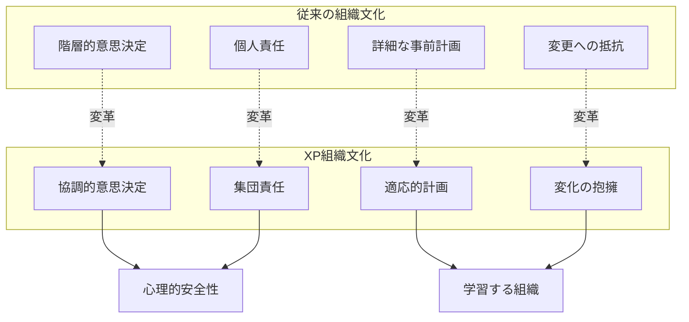

XPチームは、従来のプロジェクトマネージャーの役割を再定義する。コマンドアンドコントロール型の管理から、サーバントリーダーシップへの移行が求められる。マネージャーは、チームの障害を取り除き、必要なリソースを提供し、組織内でのチームの擁護者として機能する。

## スケーリングの課題

XPは元々小規模チーム（10人以下）を想定して設計されたが、大規模プロジェクトへの適用も試みられている。スケーリングの主な課題は、コミュニケーションパスの指数関数的増加、調整コストの増大、文化的一貫性の維持である。

Scaled Agile Framework（SAFe）やLarge-Scale Scrum（LeSS）などのフレームワークは、XPのプラクティスを大規模組織に適用する試みである¹¹。これらのフレームワークは、チーム間の調整メカニズム、アーキテクチャの事前設計、リリーストレインの概念などを導入している。

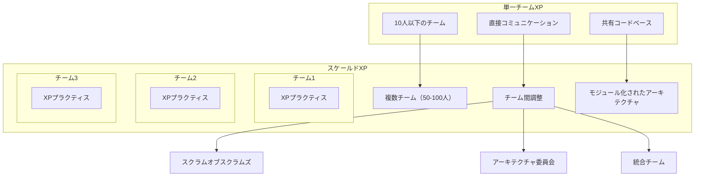

大規模化に伴う課題の一つは、ペアプログラミングの実施である。地理的に分散したチームでは、リモートペアプログラミングツールの活用が必要となる。Visual Studio CodeのLive Share、JetBrainsのCode With Meなどのツールは、リモートでの協調的プログラミングを可能にしている。

## パフォーマンスメトリクス

XPの効果測定は、従来のソフトウェアメトリクスとは異なるアプローチを要求する。コード行数や機能点数などの量的指標よりも、サイクルタイム、欠陥密度、顧客満足度などの質的指標が重視される。

リードタイム（要求から本番リリースまでの時間）とサイクルタイム（開発開始から完了までの時間）は、プロセスの効率性を測る重要な指標である¹²。XPチームは、これらの時間を継続的に短縮することで、市場への迅速な価値提供を実現する。

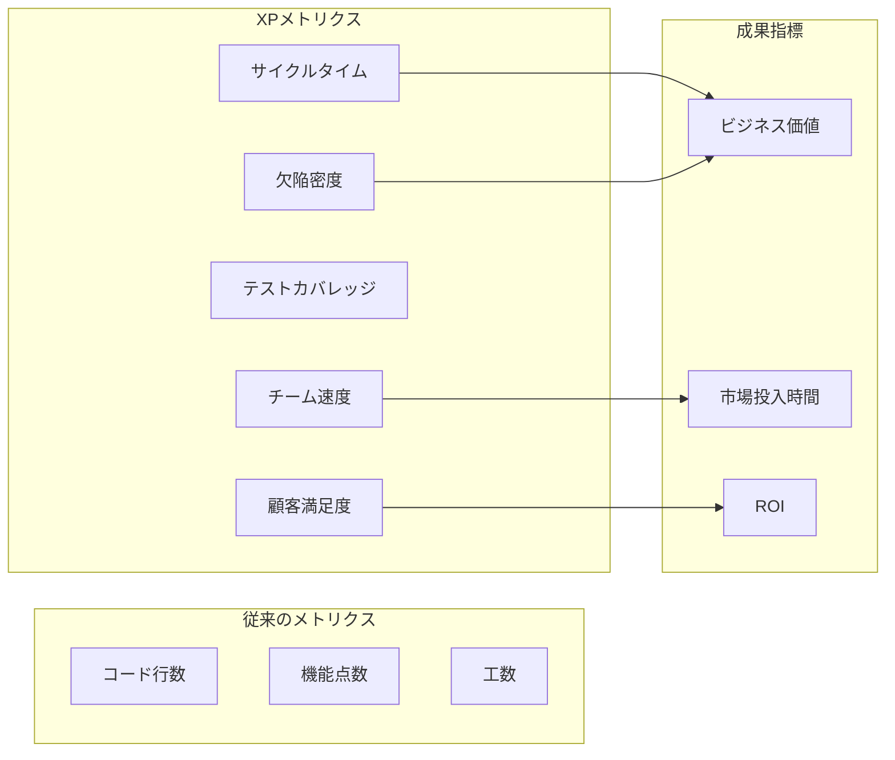

技術的負債の定量化も重要なメトリクスである。SonarQubeなどのツールは、コードの複雑性、重複、潜在的バグなどを分析し、技術的負債を「修正に必要な時間」として定量化する。この情報は、リファクタリングの優先順位付けに活用される。

## セキュリティとコンプライアンス

XPの短期リリースサイクルは、セキュリティとコンプライアンスの観点から課題を提起する。従来のウォーターフォール型開発では、セキュリティレビューは特定のフェーズで実施されたが、XPでは継続的なセキュリティ検証が必要となる。

DevSecOpsの概念は、XPのプラクティスにセキュリティを統合する試みである¹³。静的アプリケーションセキュリティテスト（SAST）、動的アプリケーションセキュリティテスト（DAST）、依存関係スキャンなどを、CIパイプラインに組み込むことで、セキュリティの継続的検証を実現する。

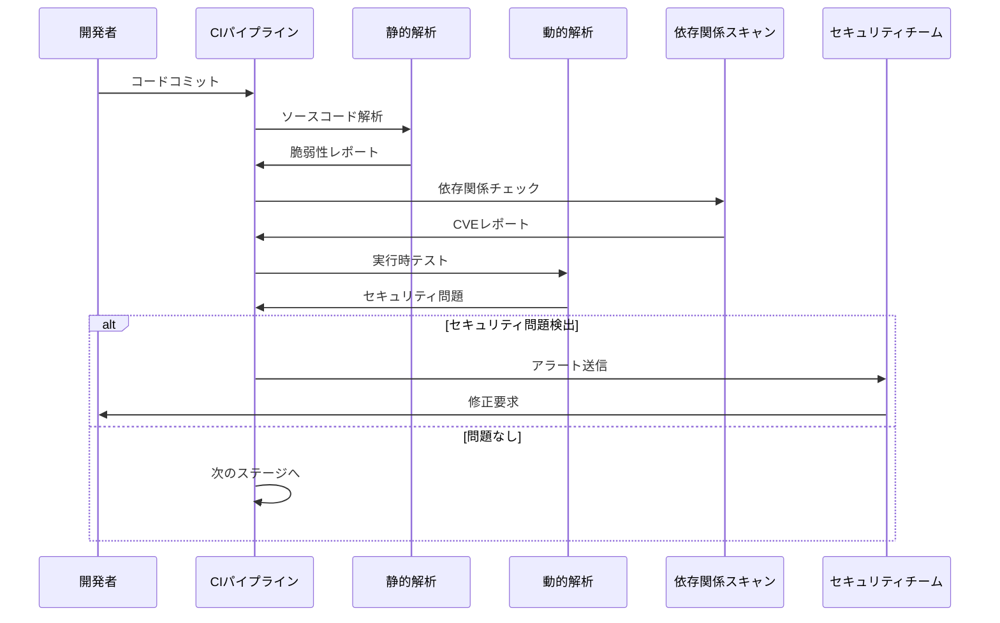

規制産業（金融、医療、航空など）でのXP適用には、追加の考慮事項がある。監査証跡の維持、変更管理プロセスの文書化、リスクアセスメントの実施など、コンプライアンス要件とアジリティのバランスを取る必要がある。

## 技術スタックとの適合性

XPの実践は、使用する技術スタックによって影響を受ける。動的型付け言語（Python、Ruby、JavaScript）は、迅速なプロトタイピングとリファクタリングを容易にするが、大規模システムでの型安全性の欠如が課題となる。静的型付け言語（Java、C#、Go）は、コンパイル時のエラー検出により安全性を提供するが、ボイラープレートコードが開発速度を低下させる可能性がある。

近年のTypeScriptの採用増加は、動的言語の柔軟性と静的型付けの安全性のバランスを求める動きとして理解できる。TypeScriptは、段階的な型付けにより、XPの反復的な開発スタイルに適合しながら、大規模システムでの保守性を確保する。

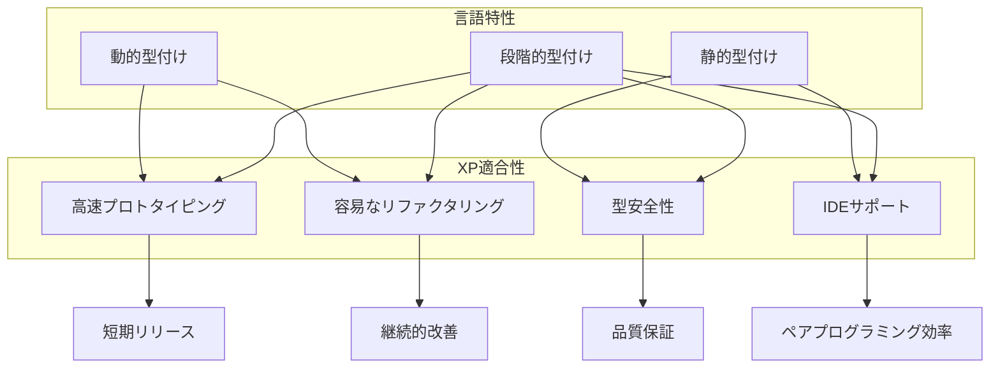

マイクロサービスアーキテクチャは、XPの原則と親和性が高い。各サービスを小規模チームが所有し、独立してデプロイできることで、短期リリースサイクルが実現しやすくなる。ただし、サービス間の統合テストの複雑性は、新たな課題を生む。

## 認知バイアスとの戦い

ソフトウェア開発における認知バイアスは、品質と生産性に重大な影響を与える¹⁴。XPのプラクティスは、これらのバイアスを軽減するメカニズムとして機能する。確証バイアス（自分の仮説を支持する情報のみに注目する傾向）は、TDDによって軽減される。失敗するテストを最初に書くことで、開発者は自分のコードが正しくないことを前提として作業を始める。

アンカリングバイアス（最初に提示された情報に過度に依存する傾向）は、計画ゲームとイテレーティブな開発によって対処される。初期の見積もりや設計決定は、各イテレーションで見直され、新しい情報に基づいて調整される。

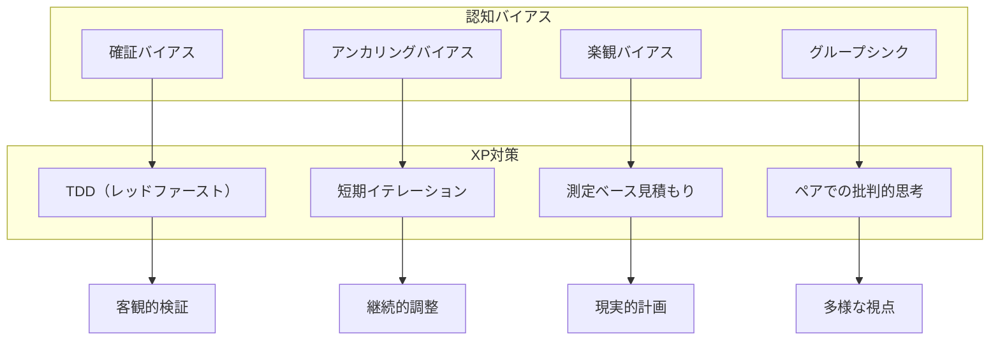

楽観バイアス（タスクの完了時間を過小評価する傾向）は、ベロシティの測定と履歴データの活用によって管理される。チームは過去のイテレーションでの実績に基づいて見積もりを行い、願望的思考を排除する。

## 分散チームでの実践

COVID-19パンデミック以降、リモートワークの普及により、分散チームでのXP実践が一般的になった。物理的な近接性を前提としたペアプログラミングやオンサイトカスタマーといったプラクティスは、デジタルツールを活用した新しい形態へと進化している。

リモートペアプログラミングは、画面共有、音声通話、協調編集ツールの組み合わせによって実現される。研究によれば、適切なツールとプロセスがあれば、リモートペアプログラミングは対面でのペアプログラミングと同等の効果を発揮する¹⁵。ただし、非言語的コミュニケーションの欠如を補うため、より明示的なコミュニケーションが必要となる。

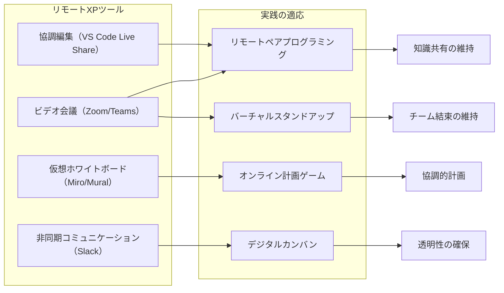

タイムゾーンの違いは、同期的なコラボレーションを困難にする。この課題に対して、「フォロー・ザ・サン」モデルや、非同期ペアプログラミング（一人が作業を行い、もう一人が後でレビューとリファクタリングを行う）などのアプローチが試みられている。

## 機械学習時代のXP

機械学習システムの開発は、従来のソフトウェア開発とは異なる課題を提示する。コードの振る舞いが訓練データに依存し、決定論的でないため、従来のテスト手法の適用が困難である。MLOps（Machine Learning Operations）は、XPの原則を機械学習開発に適用する試みである¹⁶。

データバージョン管理、実験追跡、モデルの継続的評価など、新しいプラクティスが必要となる。DVC（Data Version Control）、MLflow、Kubeflowなどのツールは、機械学習開発におけるXPプラクティスの実現を支援する。

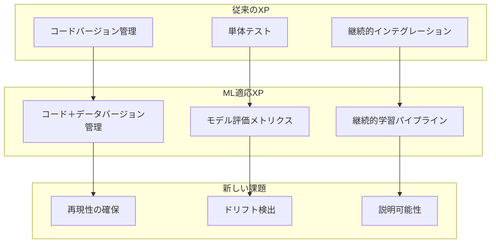

テスト駆動開発の機械学習への適用は、「期待値駆動開発」として再解釈される。開発者は、モデルが満たすべきパフォーマンス基準（精度、再現率、F1スコアなど）を事前に定義し、これらの基準を満たすようにモデルを開発する。

## 倫理的考慮事項

XPの「勇気」と「リスペクト」の価値観は、ソフトウェア開発における倫理的意思決定にも適用される。アルゴリズムバイアス、プライバシー侵害、環境への影響など、現代のソフトウェアが直面する倫理的課題に対して、XPチームはどのように対応すべきか。

継続的な倫理レビューを開発プロセスに組み込むことで、潜在的な害を早期に特定し、対処できる。これは、セキュリティレビューと同様に、各イテレーションで実施される。倫理的影響評価（Ethical Impact Assessment）は、新機能の計画段階で実施され、潜在的なリスクと緩和策を特定する¹⁷。

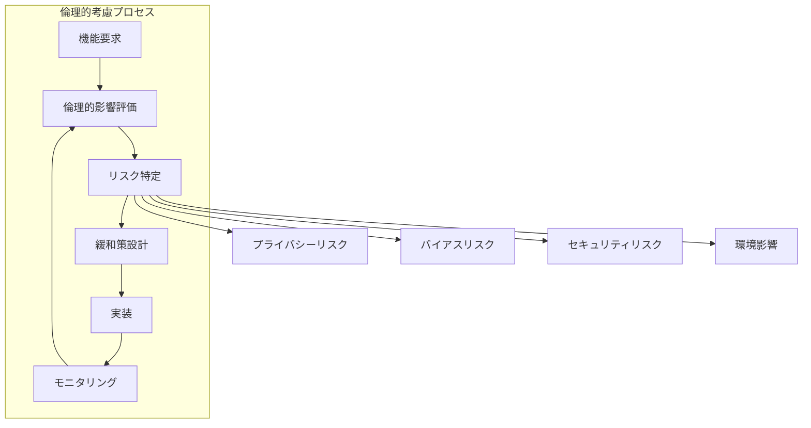

透明性とアカウンタビリティは、XPの集団的コード所有権の概念を拡張したものとして理解できる。チーム全体が、作成したソフトウェアの社会的影響に対して責任を持ち、ステークホルダーに対して説明責任を果たす。

---

¹ Beck, K. (1999). "Extreme Programming Explained: Embrace Change". Addison-Wesley.

² Beck, K., & Andres, C. (2004). "Extreme Programming Explained: Embrace Change (2nd Edition)". Addison-Wesley.

³ Beck, K. (2002). "Test Driven Development: By Example". Addison-Wesley.

⁴ Williams, L., & Kessler, R. (2002). "Pair Programming Illuminated". Addison-Wesley.

⁵ Cockburn, A., & Williams, L. (2000). "The costs and benefits of pair programming". Proceedings of the First International Conference on Extreme Programming and Flexible Processes in Software Engineering.

⁶ Fowler, M. (2018). "Refactoring: Improving the Design of Existing Code (2nd Edition)". Addison-Wesley.

⁷ Cunningham, W. (1992). "The WyCash Portfolio Management System". OOPSLA '92 Experience Report.

⁸ Fowler, M. (2006). "Continuous Integration". https://martinfowler.com/articles/continuousIntegration.html

⁹ Edmondson, A. (1999). "Psychological Safety and Learning Behavior in Work Teams". Administrative Science Quarterly, 44(2), 350-383.

¹⁰ Duhigg, C. (2016). "What Google Learned From Its Quest to Build the Perfect Team". The New York Times Magazine.

¹¹ Leffingwell, D. (2018). "SAFe 4.5 Reference Guide: Scaled Agile Framework for Lean Enterprises". Addison-Wesley.

¹² Poppendieck, M., & Poppendieck, T. (2003). "Lean Software Development: An Agile Toolkit". Addison-Wesley.

¹³ Kim, G., Humble, J., Debois, P., & Willis, J. (2016). "The DevOps Handbook". IT Revolution Press.

¹⁴ Mohanani, R., Salman, I., Turhan, B., Rodríguez, P., & Ralph, P. (2018). "Cognitive Biases in Software Engineering: A Systematic Mapping Study". IEEE Transactions on Software Engineering.

¹⁵ Stray, V., Moe, N. B., & Noroozi, M. (2019). "Slack me if you can! Using enterprise social networking tools in virtual agile teams". 2019 ACM/IEEE 14th International Conference on Global Software Engineering.

¹⁶ Sculley, D., et al. (2015). "Hidden Technical Debt in Machine Learning Systems". Proceedings of the 28th International Conference on Neural Information Processing Systems.

¹⁷ IEEE (2019). "Ethically Aligned Design: A Vision for Prioritizing Human Well-being with Autonomous and Intelligent Systems". IEEE Standards Association.