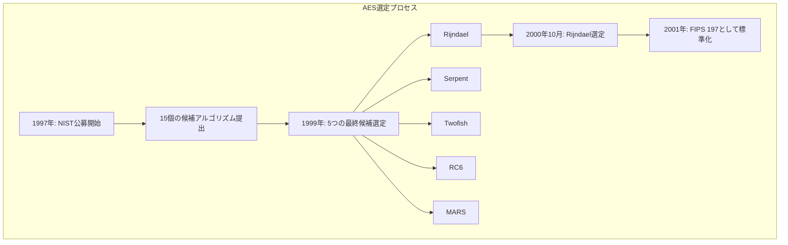
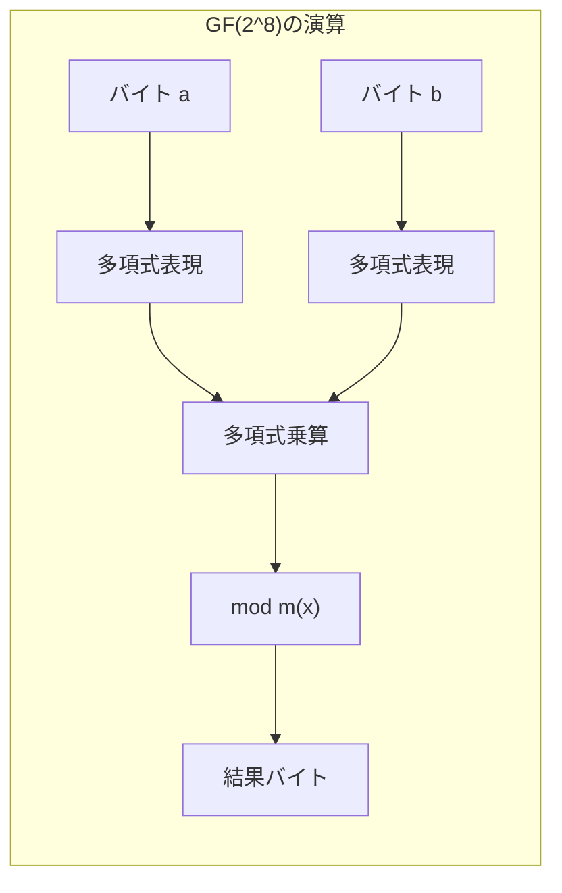
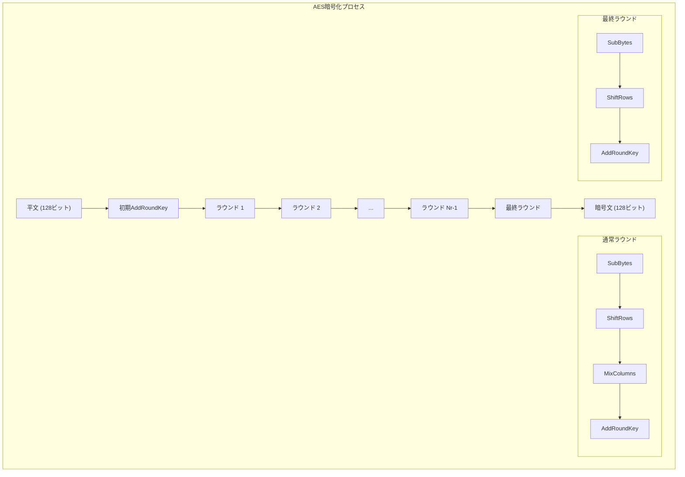
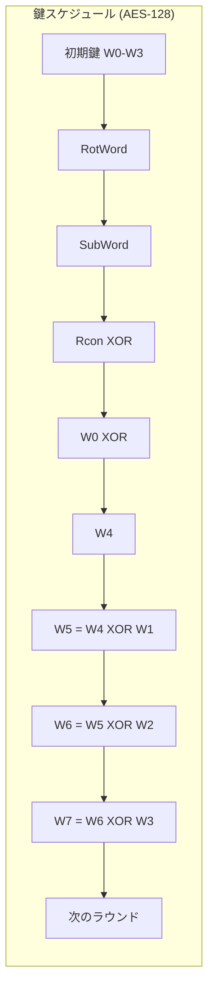
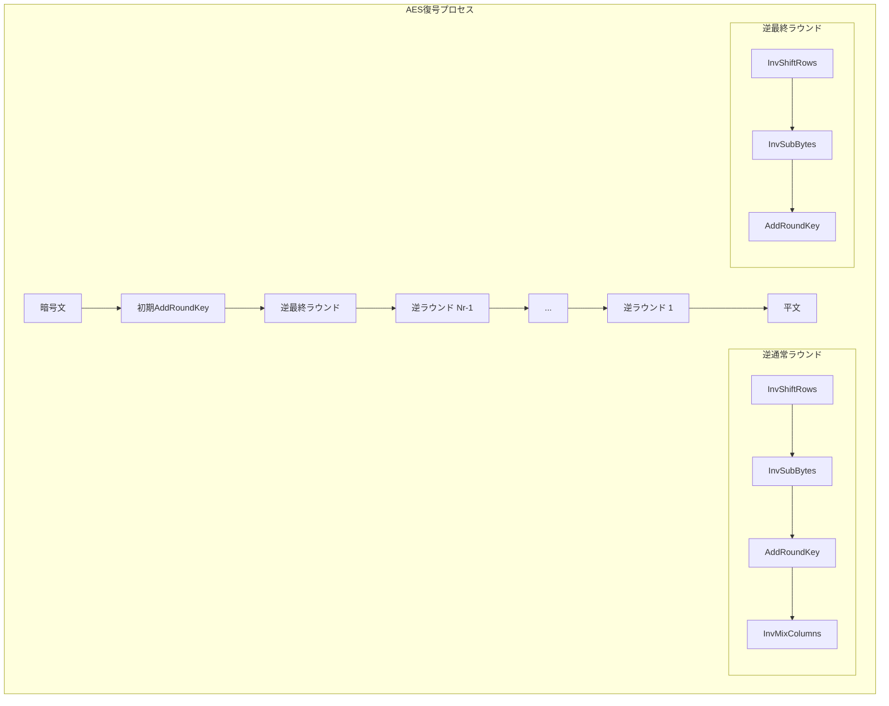
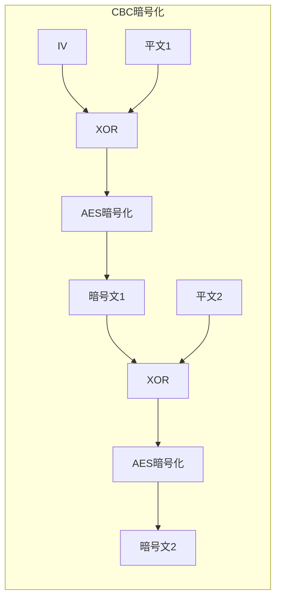

# AES (Advanced Encryption Standard)

AES（Advanced Encryption Standard）は、現代の情報セキュリティにおいて最も広く使用されている対称鍵暗号アルゴリズムである。2001年にNIST（米国国立標準技術研究所）によって標準化され、DES（Data Encryption Standard）の後継として採用された。AESは、ベルギーの暗号学者Joan DaemenとVincent Rijmenによって開発されたRijndael暗号を基にしており、その設計の優雅さと実装の効率性から、世界中で信頼されている暗号アルゴリズムとなっている[^1]。

本稿では、AESの暗号学的基礎から実装の詳細、そして実践的な利用方法まで、シニアエンジニアが完全に理解し、適切に実装・運用できるレベルまで解説する。特に、アルゴリズムの数学的基礎、各ラウンド関数の詳細な動作、鍵スケジュールの仕組み、そして様々な暗号利用モードについて、実装者の視点から深く掘り下げていく。

## 歴史的背景と標準化プロセス

1990年代後半、長年使用されてきたDESの56ビット鍵長が現実的な攻撃に対して脆弱になりつつあることが明らかになった。1997年、NISTはDESの後継となる新しい暗号標準を選定するためのコンペティション（AES選定プロセス）を開始した。このプロセスは完全に公開され、世界中の暗号学者による厳密な審査を経て、2000年10月にRijndaelが次期標準として選定された[^2]。

Rijndaelが選ばれた理由は複数ある。第一に、そのセキュリティ強度が理論的にも実践的にも十分であることが確認された。第二に、ソフトウェアおよびハードウェア実装の両方で高い効率性を示した。第三に、アルゴリズムの構造が明確で理解しやすく、実装ミスのリスクが低いことが評価された。これらの特性により、Rijndaelは他の最終候補（Serpent、Twofish、RC6、MARS）を抑えて選ばれることとなった。



## 暗号学的基礎：有限体とガロア体

AESを深く理解するためには、その数学的基礎である有限体、特にガロア体GF(2^8)の理解が不可欠である。AESのすべての演算は、この有限体上で定義されており、これによって暗号学的に望ましい性質を実現している。

有限体GF(2^8)は、256個の要素を持つ体であり、各要素は8ビットのバイトとして表現される。この体における加算は、ビット単位のXOR演算として実装される。つまり、a ⊕ b = a XOR bである。この演算は、暗号学において重要な性質を持つ。すなわち、a ⊕ a = 0（自己逆元性）および a ⊕ 0 = a（単位元の存在）である。

より複雑なのは乗算演算である。GF(2^8)における乗算は、多項式の乗算として定義され、その結果を既約多項式で剰余を取ることで実現される。AESでは、既約多項式としてm(x) = x^8 + x^4 + x^3 + x + 1（16進表記で0x11B）が使用される[^3]。



例えば、0x57と0x83の乗算を考えてみよう。これらをそれぞれ多項式として表現すると：
- 0x57 = x^6 + x^4 + x^2 + x + 1
- 0x83 = x^7 + x + 1

これらの積は：
(x^6 + x^4 + x^2 + x + 1)(x^7 + x + 1) = x^13 + x^11 + x^9 + x^8 + x^7 + x^7 + x^5 + x^3 + x^2 + x + x^6 + x^4 + x^2 + x + 1

GF(2)上では同じ項が2つあると0になるため、整理すると：
x^13 + x^11 + x^9 + x^8 + x^6 + x^5 + x^4 + x^3 + 1

これをm(x) = x^8 + x^4 + x^3 + x + 1で剰余を取ることで、最終的な結果が得られる。この計算は実装上は查表法やビットシフトを用いて効率的に行われる。

## AESの基本構造

AESは、128ビットのブロック暗号であり、鍵長として128ビット、192ビット、256ビットの3種類をサポートする。それぞれAES-128、AES-192、AES-256と呼ばれ、鍵長に応じてラウンド数が10、12、14と変化する。各ラウンドは、SubBytes、ShiftRows、MixColumns、AddRoundKeyの4つの変換から構成される（最終ラウンドではMixColumnsが省略される）。



AESの状態（State）は、4×4のバイト配列として表現される。入力される128ビットのデータは、列優先順序でこの配列に配置される。つまり、入力バイトb0, b1, ..., b15は以下のように配置される：

```
[ b0  b4  b8  b12 ]
[ b1  b5  b9  b13 ]
[ b2  b6  b10 b14 ]
[ b3  b7  b11 b15 ]
```

この表現方法は、各変換の実装を効率的にし、並列処理を可能にする重要な設計決定である。

## SubBytes変換

SubBytes変換は、AESにおける唯一の非線形変換であり、暗号の混乱（confusion）を提供する重要な要素である。この変換は、状態配列の各バイトを、S-boxと呼ばれる置換表を用いて別のバイトに置き換える。

S-boxの構築は、2段階のプロセスで行われる。まず、入力バイトのGF(2^8)における乗法逆元を計算する（0の逆元は0と定義）。次に、得られた逆元に対してアフィン変換を適用する。このアフィン変換は以下の式で表される：

b'_i = b_i ⊕ b_{(i+4) mod 8} ⊕ b_{(i+5) mod 8} ⊕ b_{(i+6) mod 8} ⊕ b_{(i+7) mod 8} ⊕ c_i

ここで、c = 0x63（01100011）は定数ベクトルである。

この構築方法により、S-boxは以下の暗号学的に望ましい性質を持つ：
- 非線形性：入力と出力の間に単純な数学的関係が存在しない
- 差分一様性：入力の小さな変化が出力に大きな変化をもたらす
- 代数的複雑性：S-boxを表現する多項式の次数が高い

実装においては、S-boxは通常256バイトの查表として実装される。これにより、高速な置換が可能となる。

## ShiftRows変換

ShiftRows変換は、状態配列の各行を左に循環シフトする単純な置換である。シフト量は行番号に依存し、第0行は0バイト、第1行は1バイト、第2行は2バイト、第3行は3バイト左にシフトされる。

```
変換前：              変換後：
[ a0  a4  a8  a12 ]   [ a0  a4  a8  a12 ]
[ a1  a5  a9  a13 ] → [ a5  a9  a13 a1  ]
[ a2  a6  a10 a14 ]   [ a10 a14 a2  a6  ]
[ a3  a7  a11 a15 ]   [ a15 a3  a7  a11 ]
```

この変換の目的は、列間でバイトを分散させることである。SubBytesが各バイトを個別に変換するのに対し、ShiftRowsは列の境界を越えてバイトを移動させる。これにより、次のMixColumns変換がより効果的に作用する。

## MixColumns変換

MixColumns変換は、状態配列の各列に対して、GF(2^8)上の行列乗算を適用する最も複雑な変換である。この変換は、各列を4次多項式として扱い、固定多項式c(x) = 3x^3 + x^2 + x + 2との乗算を、多項式x^4 + 1で剰余を取ることで実現される。

行列形式では、以下のように表現される：

```
[ b0 ]   [ 02 03 01 01 ] [ a0 ]
[ b1 ] = [ 01 02 03 01 ] [ a1 ]
[ b2 ]   [ 01 01 02 03 ] [ a2 ]
[ b3 ]   [ 03 01 01 02 ] [ a3 ]
```

ここで、すべての演算はGF(2^8)上で行われる。係数02は多項式xに、03は多項式x+1に対応する。

MixColumns変換の重要な性質は、その最大距離分離（MDS）性である。これは、入力列の任意の2つの異なるバイトが変化した場合、出力列の少なくとも3つのバイトが変化することを保証する。この性質により、局所的な変化が列全体に拡散される。

実装上の観点から、GF(2^8)における02倍（xによる乗算）は、左に1ビットシフトし、最上位ビットが1の場合は0x1Bでxorを取ることで実現できる：

```c
uint8_t xtime(uint8_t a) {
    return ((a << 1) ^ ((a & 0x80) ? 0x1B : 0x00));
}
```

## AddRoundKey変換

AddRoundKey変換は、最も単純でありながら暗号学的に重要な変換である。この変換は、状態配列の各バイトと対応するラウンド鍵のバイトとのXOR演算を行う。

```
State[i][j] = State[i][j] ⊕ RoundKey[i][j]
```

この変換の重要性は、秘密鍵の情報を暗号化プロセスに導入する唯一の手段であることにある。XOR演算の自己逆元性により、暗号化と復号で同じ操作を使用でき、実装が簡潔になる。

## 鍵スケジュール

鍵スケジュールは、初期鍵から各ラウンドで使用されるラウンド鍵を生成するプロセスである。AES-128の場合、128ビットの初期鍵から11個の128ビットラウンド鍵（初期鍵を含む）を生成する必要がある。

鍵スケジュールのアルゴリズムは、4バイトのワード単位で動作する。初期鍵はNk個のワード（AES-128ではNk=4）として扱われ、これを拡張してNb×(Nr+1)個のワード（AES-128では44個）を生成する。



鍵拡張の基本的なルールは以下の通りである：
- i mod Nk = 0の場合：W[i] = W[i-Nk] ⊕ SubWord(RotWord(W[i-1])) ⊕ Rcon[i/Nk]
- それ以外の場合：W[i] = W[i-Nk] ⊕ W[i-1]

ここで、RotWordは4バイトワードを1バイト左に循環シフトし、SubWordは各バイトにS-boxを適用する。Rconはラウンド定数であり、[02^(i-1), 00, 00, 00]の形式を持つ（GF(2^8)での累乗）。

この設計により、鍵スケジュールは以下の性質を持つ：
- 非線形性：SubWord操作により非線形性が導入される
- 拡散性：各ラウンド鍵が前のラウンド鍵に依存する
- 非対称性：Rconにより各ラウンドで異なる定数が使用される

## 復号プロセス

AESの復号は、暗号化の逆プロセスとして実装される。各変換には対応する逆変換が存在し、これらを逆順に適用することで復号が実現される。



InvSubBytesは逆S-boxを使用し、InvShiftRowsは右シフトを行い、InvMixColumnsは逆行列を使用する：

```
[ 0E 0B 0D 09 ]
[ 09 0E 0B 0D ]
[ 0D 09 0E 0B ]
[ 0B 0D 09 0E ]
```

興味深いことに、実装の最適化として、等価復号アルゴリズムが存在する。これは、InvMixColumnsとAddRoundKeyの順序を入れ替え、ラウンド鍵にInvMixColumnsを事前に適用することで、暗号化と同じ構造で復号を実行できる。

## 暗号利用モード

実際のアプリケーションでは、AESは様々な暗号利用モードと組み合わせて使用される。各モードは異なるセキュリティ特性と性能特性を持ち、用途に応じて適切に選択する必要がある。

### ECB (Electronic Codebook) モード

ECBモードは最も単純なモードであり、各ブロックを独立に暗号化する。しかし、同じ平文ブロックは常に同じ暗号文ブロックに変換されるため、パターンが露呈する危険性がある。このため、実用的なアプリケーションでは推奨されない。

### CBC (Cipher Block Chaining) モード

CBCモードは、各平文ブロックを前の暗号文ブロックとXORしてから暗号化する。初期ベクトル（IV）が最初のブロックで使用される。このモードは広く使用されているが、パディングオラクル攻撃に対する脆弱性があるため、適切な実装が必要である。



### CTR (Counter) モード

CTRモードは、AESをストリーム暗号として使用する。カウンタ値を暗号化し、その結果を平文とXORする。このモードは並列化可能であり、ランダムアクセスをサポートする。

### GCM (Galois/Counter Mode)

GCMは、CTRモードに認証機能を追加した認証付き暗号化モードである。GF(2^128)上のガロア体乗算を使用してメッセージ認証コード（GMAC）を生成する。このモードは、機密性と完全性の両方を提供し、現代的なアプリケーションで推奨される[^4]。

GCMの動作は以下の要素から構成される：
- CTRモードによる暗号化
- 暗号文と追加認証データ（AAD）のGHASH計算
- 認証タグの生成

## 実装上の考慮事項

AESの実装において考慮すべき重要な点がいくつかある。これらは、セキュリティと性能の両方に影響を与える。

### サイドチャネル攻撃への対策

実装がタイミング攻撃、電力解析攻撃、キャッシュ攻撃などのサイドチャネル攻撃に対して脆弱にならないよう注意が必要である。特に、S-boxの查表実装は、キャッシュタイミング攻撃の標的となりやすい。

対策として以下のアプローチがある：
- ビットスライス実装：データを垂直にスライスし、ビット演算で処理
- マスキング：中間値をランダムマスクで保護
- 定数時間実装：実行時間が入力に依存しない実装

### ハードウェアアクセラレーション

現代のプロセッサの多くは、AES専用の命令セット（Intel AES-NI、ARM Cryptography Extensions）を提供している。これらを使用することで、ソフトウェア実装と比較して10倍以上の性能向上が可能である。

AES-NIの例：
```c
// AES-128暗号化ラウンド
__m128i aesenc(__m128i a, __m128i RoundKey);
// AES-128最終暗号化ラウンド
__m128i aesenclast(__m128i a, __m128i RoundKey);
```

### パフォーマンス最適化

ソフトウェア実装では、以下の最適化技法が有効である：

**T-tables実装**：SubBytes、ShiftRows、MixColumnsを統合した查表を使用。各ラウンドは4つの査表と32ビットXOR演算で実装できる。ただし、キャッシュ攻撃に注意が必要。

**SIMD最適化**：複数のブロックを並列処理。特にCTRモードやECBモードで効果的。

**ループアンローリング**：ラウンドループを展開し、分岐予測ミスを削減。

## セキュリティ分析

AESは20年以上にわたり、世界中の暗号学者による厳密な分析を受けてきた。現在までに、実用的な攻撃は発見されていない。

### 既知の理論的攻撃

**Biclique攻撃**（2011年）：AES-128に対して2^126.1、AES-256に対して2^254.4の計算量で攻撃可能。しかし、これは総当たり攻撃よりわずかに効率的なだけで、実用的な脅威ではない[^5]。

**関連鍵攻撃**：特定の鍵の関係性を利用する攻撃。AES-192とAES-256の鍵スケジュールに対して理論的な弱点が発見されているが、実際のアプリケーションでは関連鍵の使用を避けることで対策可能。

### 量子コンピュータの影響

Groverのアルゴリズムにより、量子コンピュータはAESの鍵空間を√Nの計算量で探索できる。これは、AES-128の実効的なセキュリティを64ビットに、AES-256を128ビットに削減する。このため、長期的なセキュリティが必要な場合はAES-256の使用が推奨される。

## 実装例とベストプラクティス

実際のシステムでAESを使用する際の重要な指針を以下に示す。

### 鍵管理

鍵の生成、保存、配布、破棄は、暗号システムの最も重要な要素である。暗号学的に安全な乱数生成器（CSPRNG）を使用し、鍵を平文でメモリやディスクに保存しないことが重要である。可能であれば、ハードウェアセキュリティモジュール（HSM）やキー管理サービス（KMS）を使用する。

### 初期化ベクトルとノンス

CBCモードのIVやGCMモードのノンスは、予測不可能でユニークである必要がある。特にGCMでは、同じ鍵でノンスを再使用すると、認証が完全に破られる可能性がある。

### パディング

ブロック暗号モードでは、最後のブロックのパディングが必要な場合がある。PKCS#7パディングが一般的だが、パディングオラクル攻撃を防ぐため、復号時のパディング検証は慎重に実装する必要がある。認証付き暗号化（GCMなど）の使用が推奨される。

### エラー処理

暗号化・復号処理のエラーは、攻撃者に有用な情報を提供する可能性がある。エラーメッセージは最小限にし、タイミング情報を漏らさないよう注意する。

## 標準規格と相互運用性

AESは多くの標準規格に採用されており、相互運用性の確保が重要である。

**FIPS 197**：NISTによるAESの公式仕様[^1]
**SP 800-38A**：ブロック暗号の利用モードに関するNISTの推奨[^6]
**RFC 3565**：IPsecでのAES-CBCの使用
**RFC 3686**：IPsecでのAES-CTRの使用
**RFC 4106**：IPsecでのAES-GCMの使用

これらの標準に準拠することで、異なるシステム間での安全な通信が可能となる。

## まとめと将来展望

AESは、その堅牢性、効率性、実装の容易さから、現代の暗号化の基盤となっている。20年以上の実績があり、理論的・実践的な攻撃に対して十分な耐性を持つことが証明されている。

しかし、技術の進歩に伴い、新たな課題も生まれている。量子コンピュータの脅威に対しては、より大きな鍵サイズの使用や、耐量子暗号への移行が検討されている。また、IoTデバイスなどのリソース制限環境では、軽量暗号の必要性も高まっている。

エンジニアとしては、AESの基本原理を理解し、適切な利用モードを選択し、安全な実装を行うことが重要である。特に、サイドチャネル攻撃への対策、適切な鍵管理、標準規格への準拠は、実用的なシステムを構築する上で不可欠である。

暗号技術は常に進化しており、新しい攻撃手法や防御技術が継続的に研究されている。AESは当面の間、対称鍵暗号の標準として使用され続けるが、常に最新のセキュリティ情報に注意を払い、必要に応じてシステムを更新することが求められる。

[^1]: FIPS 197: Advanced Encryption Standard (AES), National Institute of Standards and Technology, 2001
[^2]: J. Nechvatal et al., "Report on the Development of the Advanced Encryption Standard (AES)," NIST, 2000
[^3]: J. Daemen and V. Rijmen, "The Design of Rijndael: AES - The Advanced Encryption Standard," Springer, 2002
[^4]: D. McGrew and J. Viega, "The Galois/Counter Mode of Operation (GCM)," Submission to NIST, 2004
[^5]: A. Bogdanov et al., "Biclique Cryptanalysis of the Full AES," ASIACRYPT 2011
[^6]: M. Dworkin, "Recommendation for Block Cipher Modes of Operation," NIST SP 800-38A, 2001