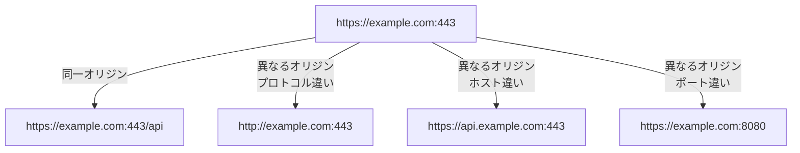
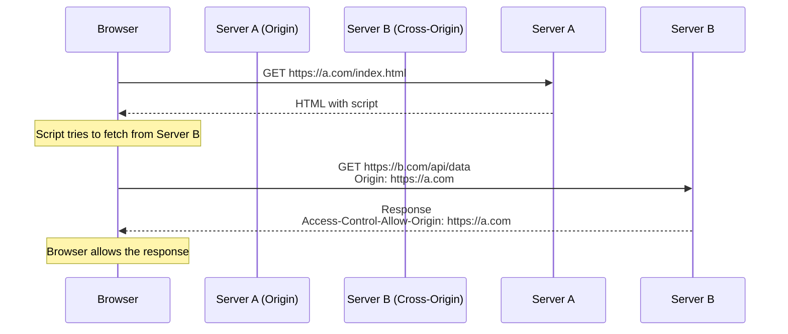
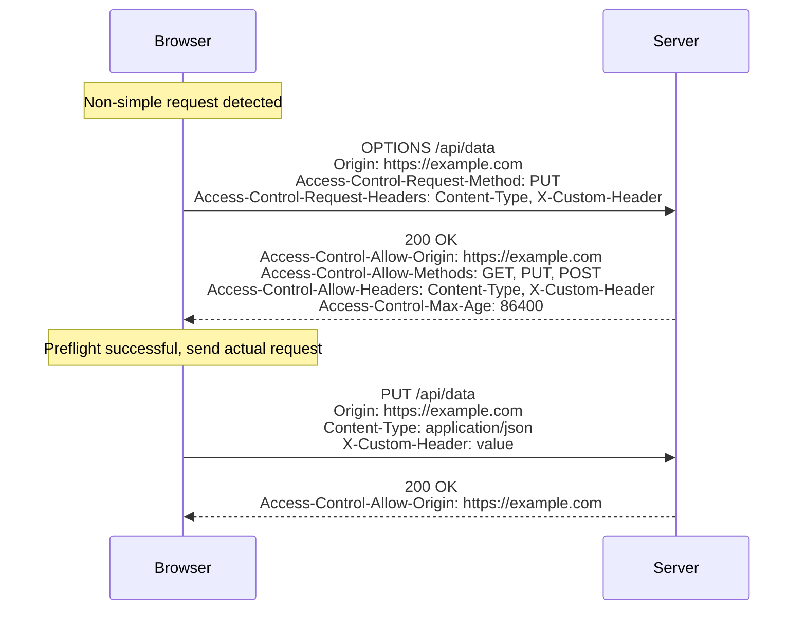

# Cross-Origin Resource Sharing (CORS)

Cross-Origin Resource Sharing（CORS）は、Webブラウザにおけるセキュリティメカニズムの一つで、異なるオリジン間でのリソース共有を安全に実現するための仕組みです。現代のWebアプリケーションにおいて、フロントエンドとバックエンドが異なるドメインやポートで動作することは一般的になっており、CORSはこのような分散型アーキテクチャを可能にする重要な技術となっています。

## 同一オリジンポリシーとCORSの必要性

Webブラウザは、セキュリティ上の理由から同一オリジンポリシー（Same-Origin Policy）[^1]を実装しています。このポリシーは、あるオリジンから読み込まれたドキュメントやスクリプトが、別のオリジンのリソースにアクセスすることを制限します。オリジンは、プロトコル（scheme）、ホスト（host）、ポート（port）の3つの要素の組み合わせで定義され、これらがすべて一致する場合にのみ同一オリジンとみなされます。



同一オリジンポリシーは、悪意のあるWebサイトが他のWebサイトのリソースに無断でアクセスすることを防ぐために設計されました。例えば、ユーザーが銀行のWebサイトにログインしている状態で、悪意のあるWebサイトを訪問した場合、同一オリジンポリシーがなければ、そのサイトのJavaScriptが銀行のAPIに対してユーザーのセッション情報を使ってリクエストを送信し、機密情報を取得できてしまう可能性があります。

しかし、正当な理由で異なるオリジン間でリソースを共有する必要がある場合も多くあります。マイクロサービスアーキテクチャでは、フロントエンドアプリケーションが複数の異なるAPIサーバーと通信する必要があり、CDNから静的リソースを読み込む場合や、サードパーティのAPIを利用する場合も同様です。CORSは、このような正当な異なるオリジン間の通信を、セキュリティを保ちながら可能にするメカニズムです。

## CORSの動作原理

CORSは、HTTPヘッダーを使用してブラウザとサーバー間で通信の許可を交渉する仕組みです。基本的な動作原理は、ブラウザがクロスオリジンリクエストを送信する際に、特定のHTTPヘッダーを付加し、サーバーがレスポンスヘッダーでそのリクエストを許可するかどうかを示すというものです。



CORSリクエストは、シンプルリクエストと呼ばれる単純なケースと、プリフライトリクエストが必要な複雑なケースの2つに分類されます。シンプルリクエストは、特定の条件を満たすリクエストで、ブラウザは直接実際のリクエストを送信します。一方、それ以外のリクエストでは、まずプリフライトリクエストと呼ばれる事前確認が行われます。

## シンプルリクエストの条件と動作

シンプルリクエストとして扱われるためには、以下のすべての条件を満たす必要があります[^2]：

HTTPメソッドが以下のいずれかであること：
- GET
- HEAD
- POST

Content-Typeヘッダーが以下のいずれかであること（POSTの場合）：
- application/x-www-form-urlencoded
- multipart/form-data
- text/plain

カスタムヘッダーを含まないこと（ブラウザが自動的に設定するヘッダーを除く）。

これらの条件は、HTMLフォームの送信で可能な操作の範囲を表しています。つまり、CORSが存在しなくても、HTMLフォームを使えば実行可能な操作については、シンプルリクエストとして扱われます。この設計により、既存のWebアプリケーションとの後方互換性が保たれています。

シンプルリクエストの場合、ブラウザは実際のリクエストにOriginヘッダーを付加して送信し、サーバーはAccess-Control-Allow-Originヘッダーを含むレスポンスを返します。ブラウザは、このヘッダーの値を確認し、現在のオリジンが許可されている場合にのみ、レスポンスをJavaScriptに渡します。

## プリフライトリクエストの詳細

シンプルリクエストの条件を満たさない場合、ブラウザは実際のリクエストを送信する前に、OPTIONSメソッドを使用したプリフライトリクエストを送信します。プリフライトリクエストは、実際のリクエストが許可されるかどうかを事前に確認するためのメカニズムです。



プリフライトリクエストには、Access-Control-Request-MethodヘッダーとAccess-Control-Request-Headersヘッダーが含まれ、実際のリクエストで使用されるメソッドとヘッダーを事前に通知します。サーバーは、これらのリクエストを許可する場合、対応するAccess-Control-Allow-*ヘッダーを返します。

プリフライトリクエストの結果は、Access-Control-Max-Ageヘッダーで指定された秒数だけブラウザにキャッシュされます。これにより、同じ条件のリクエストに対して毎回プリフライトを送信する必要がなくなり、パフォーマンスが向上します。

## CORSヘッダーの詳細仕様

CORSで使用される主要なHTTPヘッダーについて、その役割と使用方法を詳しく説明します。

### リクエストヘッダー

**Origin**: クロスオリジンリクエストを送信するページのオリジンを示します。このヘッダーはブラウザによって自動的に設定され、JavaScriptから変更することはできません。

**Access-Control-Request-Method**: プリフライトリクエストで使用され、実際のリクエストで使用されるHTTPメソッドを示します。

**Access-Control-Request-Headers**: プリフライトリクエストで使用され、実際のリクエストに含まれるカスタムヘッダーのリストを示します。

### レスポンスヘッダー

**Access-Control-Allow-Origin**: リソースへのアクセスを許可するオリジンを指定します。値は具体的なオリジン（例：https://example.com）、ワイルドカード（*）、またはnullのいずれかです。ただし、認証情報を含むリクエストの場合、ワイルドカードは使用できません。

**Access-Control-Allow-Methods**: プリフライトレスポンスで使用され、許可されるHTTPメソッドのリストを指定します。

**Access-Control-Allow-Headers**: プリフライトレスポンスで使用され、実際のリクエストで使用できるヘッダーのリストを指定します。

**Access-Control-Max-Age**: プリフライトレスポンスをキャッシュできる秒数を指定します。

**Access-Control-Allow-Credentials**: 認証情報（Cookie、HTTPベーシック認証、クライアント証明書など）を含むリクエストを許可するかどうかを示します。値はtrueまたは省略のいずれかです。

**Access-Control-Expose-Headers**: ブラウザがJavaScriptに公開してよいレスポンスヘッダーのリストを指定します。デフォルトでは、Cache-Control、Content-Language、Content-Type、Expires、Last-Modified、Pragmaの6つのヘッダーのみが公開されます。

## 認証情報を含むリクエストの処理

CORSにおいて、認証情報を含むリクエストは特別な扱いを受けます。デフォルトでは、クロスオリジンリクエストに認証情報は含まれません。認証情報を含めるためには、クライアント側でwithCredentialsオプションを設定し、サーバー側でAccess-Control-Allow-Credentialsヘッダーを返す必要があります。

```javascript
// Client-side example
fetch('https://api.example.com/data', {
    method: 'GET',
    credentials: 'include' // Include cookies and other credentials
})
```

認証情報を含むリクエストの場合、以下の制約があります：

Access-Control-Allow-Originにワイルドカード（*）を使用できません。具体的なオリジンを指定する必要があります。

Access-Control-Allow-HeadersとAccess-Control-Allow-Methodsにもワイルドカードを使用できません。

これらの制約は、認証情報が悪用されるリスクを最小限に抑えるためのものです。

## セキュリティ上の考慮事項

CORSの実装において、セキュリティは最も重要な考慮事項です。不適切なCORS設定は、深刻なセキュリティ脆弱性につながる可能性があります。

### Access-Control-Allow-Originの設定

最も一般的な誤りは、すべてのオリジンを許可するためにAccess-Control-Allow-Origin: *を使用することです。これは、公開APIや静的リソースには適切かもしれませんが、認証が必要なAPIや機密情報を扱うエンドポイントでは絶対に使用すべきではありません。

動的にOriginヘッダーの値をそのままAccess-Control-Allow-Originに設定することも危険です。これは実質的にすべてのオリジンを許可することと同じです。代わりに、許可するオリジンのホワイトリストを維持し、リクエストのOriginがリストに含まれている場合のみ許可するべきです。

### プリフライトリクエストのバイパス

一部の開発者は、パフォーマンス上の理由からプリフライトリクエストを回避しようとしますが、これはセキュリティリスクを増大させる可能性があります。プリフライトリクエストは、潜在的に危険な操作を実行する前の重要なセキュリティチェックです。

### 内部APIの露出

CORSは、内部APIを外部に公開する際の認証・認可メカニズムではありません。CORSはあくまでブラウザのセキュリティメカニズムであり、ブラウザ以外のクライアント（curlやPostmanなど）からのリクエストには適用されません。したがって、APIの保護には適切な認証・認可メカニズムを実装する必要があります。

## 実装上のベストプラクティス

CORS実装において推奨されるベストプラクティスをいくつか紹介します。

### 環境ごとの設定管理

開発環境、ステージング環境、本番環境で異なるCORS設定が必要な場合があります。環境変数や設定ファイルを使用して、環境ごとに適切な設定を管理することが重要です。

```javascript
// Example configuration approach
const corsOptions = {
    origin: process.env.NODE_ENV === 'production' 
        ? ['https://app.example.com', 'https://www.example.com']
        : ['http://localhost:3000', 'http://localhost:3001'],
    credentials: true,
    maxAge: 86400
};
```

### エラーハンドリング

CORS関連のエラーは、ブラウザのコンソールに表示されますが、JavaScriptからは詳細なエラー情報を取得できません。これはセキュリティ上の理由によるものです。開発時には、ブラウザの開発者ツールのネットワークタブでリクエストとレスポンスのヘッダーを確認することが重要です。

### プリフライトキャッシュの活用

Access-Control-Max-Ageヘッダーを適切に設定することで、プリフライトリクエストの頻度を減らし、パフォーマンスを向上させることができます。ただし、設定を変更する可能性がある場合は、キャッシュ期間を短めに設定することを検討してください。

### ログとモニタリング

CORS関連のエラーや不正なアクセス試行を検出するために、適切なログとモニタリングを実装することが重要です。特に、許可されていないオリジンからの頻繁なアクセス試行は、セキュリティ上の脅威を示している可能性があります。

## 仕様の進化と将来の展望

CORS仕様は、W3CのRecommendationとして標準化されていますが[^3]、Web技術の進化に伴い、関連する新しい仕様や提案が登場しています。

Private Network Accessは、プライベートネットワーク（ローカルホストや企業内ネットワーク）へのアクセスに対する追加のセキュリティレイヤーを提供する提案です。これにより、パブリックなWebサイトがユーザーのローカルネットワーク内のリソースにアクセスすることを防ぐことができます。

また、Storage Access APIやDocument.requestStorageAccessなど、サードパーティコンテキストでのストレージアクセスを制御する新しいAPIも登場しています。これらは、CORSと組み合わせて使用されることで、より細かいアクセス制御を可能にします。

CORSは、現代のWebアプリケーション開発において不可欠な技術です。その仕組みを正しく理解し、適切に実装することで、セキュリティを保ちながら、柔軟で拡張性の高いWebアプリケーションを構築することができます。開発者は、CORSの基本原理を理解するだけでなく、セキュリティ上のリスクと実装上のベストプラクティスを常に意識し、継続的に学習していく必要があります。

[^1]: RFC 6454 - The Web Origin Concept, https://tools.ietf.org/html/rfc6454
[^2]: Fetch Standard - CORS protocol, https://fetch.spec.whatwg.org/#cors-protocol
[^3]: Cross-Origin Resource Sharing - W3C Recommendation, https://www.w3.org/TR/cors/