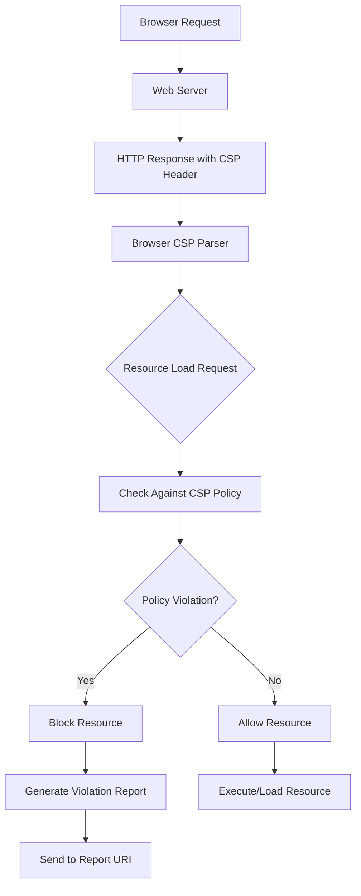
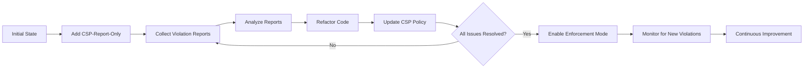

# Content Security Policy (CSP)

Content Security Policy（CSP）は、クロスサイトスクリプティング（XSS）をはじめとする様々なコンテンツインジェクション攻撃から、Webアプリケーションを保護するための強力なセキュリティメカニズムである。CSPは、ブラウザがWebページ上で実行可能なリソースの種類と、それらのリソースの取得元を厳密に制御することで、攻撃者が悪意のあるコードを注入しても実行できないようにする。

## CSPの基本概念

従来のWebセキュリティモデルは、同一オリジンポリシー（Same-Origin Policy）を基盤としているが、これだけではXSS攻撃を完全に防ぐことはできない。攻撃者がWebアプリケーションの脆弱性を突いて悪意のあるスクリプトを注入すると、そのスクリプトは正規のコンテンツと同じオリジンから実行されるため、ブラウザは区別できない。CSPは、この問題に対して「実行可能なコンテンツの出所を明示的に指定する」というアプローチを採用している[^1]。

CSPの動作原理は、HTTPレスポンスヘッダーまたはHTML meta要素を通じて、ブラウザに対してセキュリティポリシーを宣言することにある。このポリシーは、スクリプト、スタイルシート、画像、フォントなど、各種リソースの読み込み元を制限する一連のディレクティブで構成される。ブラウザは、このポリシーに違反するリソースの読み込みや実行を拒否し、必要に応じて違反をレポートする。



## CSPディレクティブの詳細

CSPポリシーは、複数のディレクティブから構成され、各ディレクティブは特定の種類のリソースに対する制約を定義する。最も重要なディレクティブの一つである`script-src`は、JavaScriptコードの実行を制御する。このディレクティブは、インラインスクリプト、外部スクリプトファイル、イベントハンドラ属性など、あらゆる形式のJavaScript実行に適用される。

`script-src`ディレクティブでは、以下のようなソース表現を使用できる：

- `'self'`: 同一オリジンからのスクリプトのみを許可
- `'unsafe-inline'`: インラインスクリプトの実行を許可（セキュリティリスクあり）
- `'unsafe-eval'`: eval()やFunction()コンストラクタの使用を許可（セキュリティリスクあり）
- `'none'`: すべてのスクリプトをブロック
- `https:`: HTTPS経由のスクリプトのみを許可
- 特定のドメイン: 例えば`https://cdn.example.com`

同様に、`style-src`はCSSの読み込みを制御し、`img-src`は画像リソース、`font-src`はWebフォント、`connect-src`はXMLHttpRequestやfetch API、WebSocketの接続先を制限する。これらのディレクティブを適切に組み合わせることで、アプリケーションのセキュリティポスチャを大幅に向上させることができる。

## nonce と hash による動的なセキュリティ

CSPレベル2以降では、インラインスクリプトやスタイルを安全に使用するための高度な機能として、nonce（number used once）とhashベースの許可メカニズムが導入された[^2]。これらの機能により、`'unsafe-inline'`を使用せずに、特定のインラインコードのみを選択的に実行できるようになった。

nonceメカニズムでは、サーバーが各レスポンスに対してランダムな値を生成し、CSPヘッダーと許可したいインライン要素の両方に同じ値を含める：

```
Content-Security-Policy: script-src 'nonce-r4nd0m123'
```

```html
<script nonce="r4nd0m123">
  // This script will execute
  console.log('Authorized inline script');
</script>
```

この方式では、攻撃者が正しいnonce値を予測することは困難であるため、XSS攻撃によって注入されたスクリプトは実行されない。ただし、nonceは各レスポンスで異なる値を使用する必要があり、キャッシュとの相性が悪いという課題がある。

hashベースの許可は、インラインコンテンツのハッシュ値をCSPポリシーに含める方式である：

```
Content-Security-Policy: script-src 'sha256-B2yPHKaXnvFWtRChIbabYmUBFZdVfKKXHbWtWidDVF8='
```

この方式は静的なインラインコードに適しており、ビルド時にハッシュ値を計算してCSPポリシーに含めることができる。SHA-256、SHA-384、SHA-512のアルゴリズムがサポートされている。

## CSPの実装戦略とトレードオフ

CSPを実装する際の最大の課題は、既存のWebアプリケーションとの互換性を保ちながら、段階的にセキュリティを強化することである。多くのレガシーアプリケーションは、インラインスクリプトやeval()を多用しており、厳格なCSPポリシーを即座に適用することは現実的でない。

実践的なアプローチとしては、まずレポート専用モード（`Content-Security-Policy-Report-Only`）を使用して、実際のブロックを行わずに違反をモニタリングすることから始める。これにより、アプリケーションの動作に影響を与えることなく、必要な調整を特定できる：

```
Content-Security-Policy-Report-Only: default-src 'self'; report-uri /csp-report
```

レポートデータを分析し、正当なリソースをホワイトリストに追加していく過程で、アプリケーションのリファクタリングも並行して進める。インラインスクリプトを外部ファイルに移動し、eval()の使用を排除し、イベントハンドラ属性をaddEventListener()に置き換えるなどの作業が必要となる。



パフォーマンスへの影響も考慮すべき重要な要素である。CSPによるリソースのブロックは、ブラウザのパース段階で行われるため、適切に実装されたCSPはパフォーマンスへの影響は最小限である。しかし、過度に複雑なポリシーや、大量のホワイトリストドメインを含むポリシーは、パース時間に影響を与える可能性がある。

## CSPレベルの進化と新機能

CSPは継続的に進化しており、各レベルで新しい機能が追加されている。CSPレベル1では基本的なディレクティブセットが定義され、レベル2でnonceとhash、`child-src`ディレクティブなどが追加された。CSPレベル3では、`strict-dynamic`や`unsafe-hashes`などの新しいキーワードが導入され、より柔軟なポリシー定義が可能になった[^3]。

`strict-dynamic`は、信頼されたスクリプトが動的に生成するスクリプトを自動的に信頼する機能である。これにより、モダンなJavaScriptフレームワークやバンドラーとの互換性が向上する：

```
Content-Security-Policy: script-src 'nonce-r4nd0m' 'strict-dynamic'
```

この設定では、nonce付きのスクリプトが動的に生成したスクリプト要素も実行が許可される。これは、WebpackやRollupなどのバンドラーが生成するコード分割されたチャンクの読み込みに特に有用である。

`unsafe-hashes`は、イベントハンドラ属性のような小さなインラインコードスニペットに対してhashベースの許可を適用できるようにする機能である。これにより、`onclick="doSomething()"`のような属性を、`'unsafe-inline'`を使用せずに許可できる。

## 実装における具体的な課題と解決策

CSPの実装において頻繁に遭遇する課題の一つは、サードパーティサービスとの統合である。Google Analytics、広告ネットワーク、ソーシャルメディアウィジェットなどは、しばしば動的にスクリプトを読み込み、インラインコードを実行する。これらのサービスとCSPを両立させるには、慎重な設計が必要である。

一つの解決策は、サードパーティサービス専用のサンドボックス化されたiframeを使用することである。`sandbox`属性と組み合わせることで、メインアプリケーションのセキュリティを損なうことなく、外部コンテンツを読み込むことができる：

```html
<iframe src="https://third-party.example.com/widget" 
        sandbox="allow-scripts allow-same-origin"
        csp="script-src https://third-party.example.com">
</iframe>
```

もう一つの一般的な課題は、開発環境と本番環境でのCSPポリシーの管理である。開発中はより緩いポリシーが必要な場合があるが、本番環境では厳格なポリシーを適用したい。これは、環境変数や設定ファイルを使用してCSPヘッダーを動的に生成することで対処できる。

CSPレポートの処理も重要な実装上の考慮事項である。大規模なWebサイトでは、CSP違反レポートが大量に生成される可能性があり、これらを効率的に収集、分析、対処する仕組みが必要である。レポートエンドポイントは、DoS攻撃の標的となる可能性もあるため、レート制限やフィルタリングの実装が推奨される。

## セキュリティと使いやすさのバランス

CSPの設計と実装において最も重要な考慮事項の一つは、セキュリティと使いやすさのバランスである。過度に制限的なポリシーは、正当な機能を破壊し、開発者の生産性を低下させる可能性がある。一方、緩すぎるポリシーは、CSPの本来の目的を達成できない。

実践的なアプローチは、リスクベースの段階的な実装である。まず、最もクリティカルなセキュリティ要件から始め、徐々により厳格なポリシーに移行する。例えば、最初は`script-src`と`object-src`に焦点を当て、XSSの主要な攻撃ベクトルをブロックする。その後、`style-src`や`img-src`などの他のディレクティブを追加していく。

また、CSPは他のセキュリティメカニズムと組み合わせて使用すべきである。入力検証、出力エスケープ、HTTPSの使用、セキュアなクッキー設定などは、CSPと相補的な関係にある。CSPは最後の防衛線として機能し、他のセキュリティ対策が失敗した場合でも攻撃を緩和する。

CSPの将来的な発展として、Trusted Typesとの統合が注目されている。Trusted Typesは、DOM XSSを防ぐための新しいブラウザAPIであり、CSPと組み合わせることで、より強力なXSS防御が可能になる[^4]。これにより、開発者は型安全なAPIを使用してDOMを操作でき、誤って危険な操作を行うリスクを減らすことができる。

Content Security Policyは、モダンなWebアプリケーションのセキュリティにおいて不可欠な要素となっている。その実装には慎重な計画と継続的な調整が必要であるが、適切に実装されたCSPは、XSSやその他のコンテンツインジェクション攻撃に対する強力な防御層を提供する。セキュリティと使いやすさのバランスを保ちながら、段階的にポリシーを強化していくことで、安全で堅牢なWebアプリケーションを構築できる。

[^1]: W3C. "Content Security Policy Level 3." W3C Working Draft. https://www.w3.org/TR/CSP3/
[^2]: Mike West. "CSP: 'nonce' and 'hash' Source Expressions." W3C. https://www.w3.org/TR/CSP2/#source-list-syntax
[^3]: W3C. "Content Security Policy: Embedded Enforcement." W3C Working Draft. https://www.w3.org/TR/csp-embedded-enforcement/
[^4]: Google. "Trusted Types API." Web.dev. https://web.dev/trusted-types/