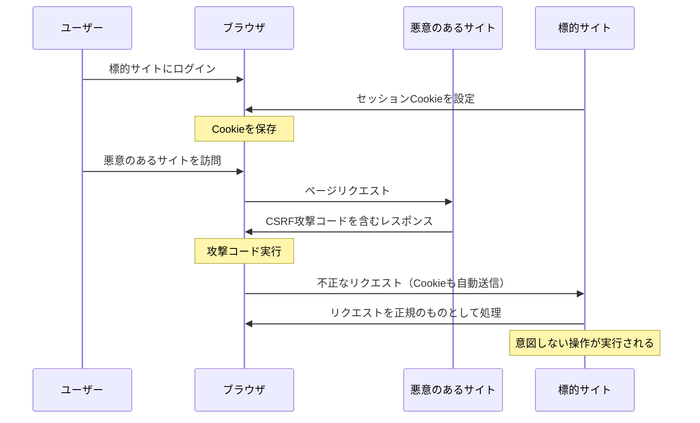
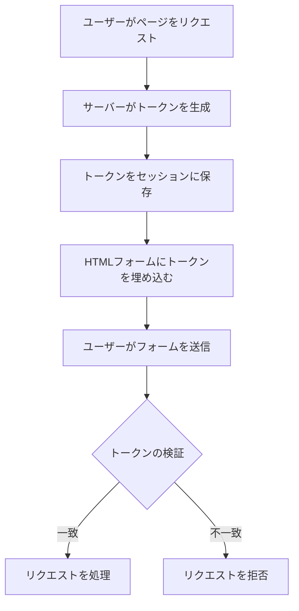
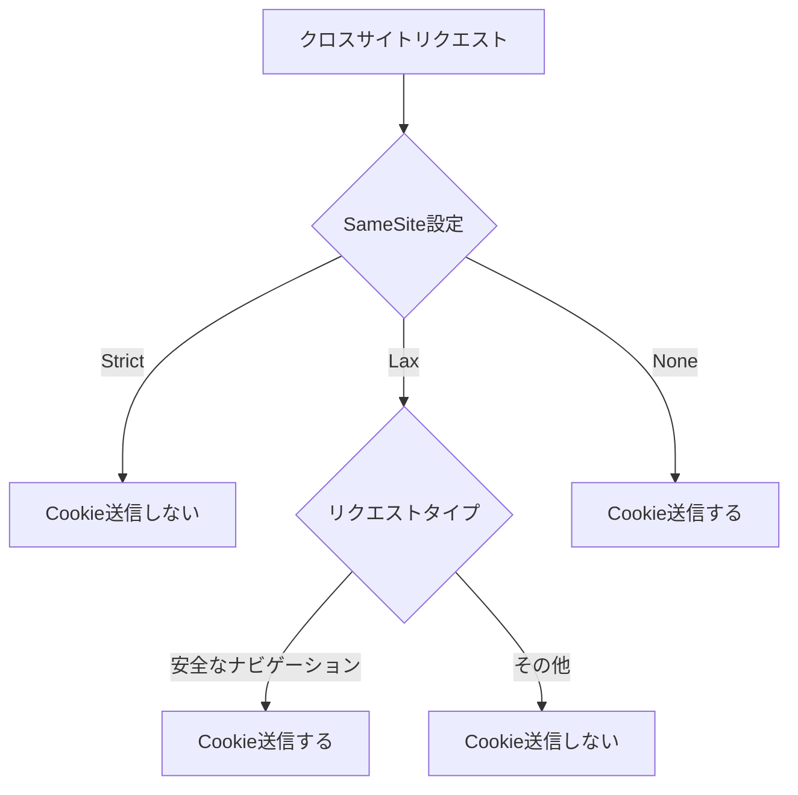

# CSRF (Cross-Site Request Forgery)

CSRF（Cross-Site Request Forgery）は、Webアプリケーションにおける代表的な脆弱性の一つであり、攻撃者が正規ユーザーの権限を悪用して意図しない操作を実行させる攻撃手法である。この攻撃は、Webアプリケーションがリクエストの正当性を適切に検証していない場合に成立し、ユーザーの認証情報（主にセッションCookie）を利用して、ユーザーの意図に反する操作を実行させることができる。

CSRFの本質は、ブラウザが自動的にCookieを送信する仕組みを悪用することにある。現代のWebブラウザは、同一オリジンポリシーによってJavaScriptからの他オリジンへのアクセスを制限しているが、フォーム送信や画像の読み込みなどの単純なHTTPリクエストについては、クロスオリジンでも許可されている。この仕様により、攻撃者は悪意のあるWebサイトから標的サイトへのリクエストを発生させることが可能となる。



## 攻撃の成立条件と仕組み

CSRF攻撃が成立するためには、いくつかの条件が揃う必要がある。まず、標的となるWebアプリケーションが、Cookie認証やBasic認証など、ブラウザが自動的に送信する認証情報のみに依存していることが前提となる。さらに、アプリケーションがリクエストの正当性を検証する仕組みを持たず、単にユーザーが認証されているかどうかのみをチェックしている必要がある。

攻撃の具体的な流れを理解するために、オンラインバンキングシステムへの送金操作を例に考えてみよう。正規の送金操作では、ユーザーがバンキングサイトにログインし、送金フォームに必要事項を入力して送信する。このとき、ブラウザは自動的にセッションCookieを含めてリクエストを送信する。

```html
<!-- 正規の送金フォーム -->
<form action="https://bank.example.com/transfer" method="POST">
    <input type="text" name="recipient" value="user123">
    <input type="number" name="amount" value="1000">
    <input type="submit" value="送金">
</form>
```

攻撃者は、この送金操作と同じリクエストを発生させる悪意のあるページを作成する。ユーザーがこのページを訪問すると、JavaScriptによって自動的にフォームが送信され、ブラウザは標的サイトのCookieを含めてリクエストを送信してしまう。

```html
<!-- 攻撃者のサイトに設置された悪意のあるコード -->
<form id="csrf-form" action="https://bank.example.com/transfer" method="POST">
    <input type="hidden" name="recipient" value="attacker">
    <input type="hidden" name="amount" value="100000">
</form>
<script>
    document.getElementById('csrf-form').submit();
</script>
```

この攻撃の巧妙な点は、ユーザーが攻撃に気づきにくいことである。フォームの送信は瞬時に行われ、iframeを使用すれば視覚的な変化も最小限に抑えることができる。また、画像タグやリンクタグを使用したGETリクエストによる攻撃も可能である。

## 防御手法の詳細

CSRF攻撃に対する防御手法は複数存在し、それぞれに特徴とトレードオフがある。最も広く採用されている手法から順に、その実装と考慮事項について詳しく見ていく。

### CSRFトークン（Synchronizer Token Pattern）

CSRFトークンは、最も一般的かつ効果的な防御手法である。この手法では、サーバー側で予測不可能なトークンを生成し、フォームやAjaxリクエストに含めることで、リクエストの正当性を検証する。



トークンの生成には、暗号学的に安全な乱数生成器を使用する必要がある。多くのWebフレームワークでは、この機能が標準で提供されている。例えば、Ruby on RailsのAuthenticityToken、DjangoのCSRF Middleware、Spring SecurityのCSRF保護機能などがある。

トークンの実装において重要なのは、トークンの生成タイミングと有効期限の管理である。セッション単位でトークンを生成する方法と、リクエスト単位で生成する方法があり、それぞれにセキュリティとユーザビリティのトレードオフが存在する。

```python
# Djangoでの実装例
def generate_csrf_token():
    """セキュアなCSRFトークンを生成"""
    return get_random_string(32)

def verify_csrf_token(request):
    """リクエストのCSRFトークンを検証"""
    token_from_request = request.POST.get('csrfmiddlewaretoken')
    token_from_session = request.session.get('csrf_token')
    
    if not token_from_request or not token_from_session:
        return False
    
    return constant_time_compare(token_from_request, token_from_session)
```

### Double Submit Cookie Pattern

Double Submit Cookie Patternは、CSRFトークンをCookieとリクエストパラメータの両方に含める手法である。この方法の利点は、サーバー側でセッション状態を管理する必要がないことである。

実装の流れは以下のようになる：

1. サーバーがランダムなトークンを生成し、Cookieとして設定する
2. クライアント側のJavaScriptがCookieからトークンを読み取り、リクエストヘッダーまたはパラメータに含める
3. サーバー側でCookieの値とリクエストに含まれる値を比較する

```javascript
// クライアント側の実装例
function getCSRFToken() {
    const cookies = document.cookie.split(';');
    for (let cookie of cookies) {
        const [name, value] = cookie.trim().split('=');
        if (name === 'csrf-token') {
            return value;
        }
    }
    return null;
}

// Ajaxリクエストにトークンを含める
fetch('/api/endpoint', {
    method: 'POST',
    headers: {
        'X-CSRF-Token': getCSRFToken(),
        'Content-Type': 'application/json'
    },
    body: JSON.stringify(data)
});
```

この手法の注意点として、Cookieのセキュリティ設定が重要である。CSRFトークンを含むCookieには、HttpOnly属性を設定してはならない。JavaScriptからアクセスできる必要があるためである。一方で、Secure属性は設定すべきであり、HTTPS環境でのみCookieが送信されるようにする。

### SameSite Cookie属性

SameSite Cookie属性は、比較的新しい防御手法であり、ブラウザレベルでCSRF攻撃を防ぐことができる[^1]。この属性は、クロスサイトリクエストにおけるCookieの送信を制御する。

```http
Set-Cookie: sessionid=abc123; SameSite=Strict; Secure; HttpOnly
Set-Cookie: sessionid=abc123; SameSite=Lax; Secure; HttpOnly
Set-Cookie: sessionid=abc123; SameSite=None; Secure; HttpOnly
```

SameSite属性には3つの値がある：

- **Strict**: クロスサイトリクエストでは一切Cookieを送信しない
- **Lax**: 一部の安全なクロスサイトリクエスト（トップレベルナビゲーション）でのみCookieを送信
- **None**: 従来通りすべてのリクエストでCookieを送信（Secure属性が必須）



SameSite=Laxは多くの場合で適切なバランスを提供する。通常のリンククリックによるサイト間の遷移ではCookieが送信されるため、ユーザビリティへの影響が最小限である一方、フォーム送信やAjaxリクエストなどの危険な操作では保護が働く。

しかし、SameSite属性にも制限がある。すべてのブラウザがサポートしているわけではなく、特に古いブラウザでは機能しない。また、正当なクロスサイトリクエストが必要な場合（例：決済サービスからのリダイレクト）には、追加の考慮が必要となる。

## 実装における考慮事項

CSRF対策を実装する際には、アプリケーションの特性に応じた細かな配慮が必要である。単一ページアプリケーション（SPA）では、初回ロード時にCSRFトークンを取得し、その後のAPIリクエストで使い回すパターンが一般的である。この場合、トークンの有効期限管理と更新メカニズムが重要になる。

```javascript
// SPAでのトークン管理例
class CSRFTokenManager {
    constructor() {
        this.token = null;
        this.tokenExpiry = null;
    }
    
    async getToken() {
        if (!this.token || Date.now() > this.tokenExpiry) {
            const response = await fetch('/api/csrf-token');
            const data = await response.json();
            this.token = data.token;
            this.tokenExpiry = Date.now() + (60 * 60 * 1000); // 1時間
        }
        return this.token;
    }
    
    async makeAuthenticatedRequest(url, options = {}) {
        const token = await this.getToken();
        return fetch(url, {
            ...options,
            headers: {
                ...options.headers,
                'X-CSRF-Token': token
            }
        });
    }
}
```

マイクロサービスアーキテクチャでは、CSRF対策の実装がより複雑になる。各サービスが独立してトークンを管理する場合、ユーザー体験を損なわないようにトークンの同期や共有メカニズムを検討する必要がある。API Gatewayでの一元的な管理や、トークンの階層的な検証などのパターンが採用されることがある。

モバイルアプリケーションとの連携も考慮事項の一つである。ネイティブアプリケーションではブラウザのCookie機構を使用しないため、通常のCSRF攻撃のリスクは低い。しかし、WebViewを使用する場合や、OAuth 2.0のような認可フローを実装する場合には、state パラメータやPKCE（Proof Key for Code Exchange）[^2]などの追加的な保護メカニズムが必要となる。

## パフォーマンスとセキュリティのトレードオフ

CSRF対策の実装には、必然的にパフォーマンスへの影響が伴う。トークンの生成、保存、検証には計算リソースが必要であり、特に高トラフィックなシステムでは無視できないオーバーヘッドとなる可能性がある。

トークンの保存方法によってもパフォーマンス特性が異なる。セッションストレージを使用する場合、分散環境でのセッション同期が課題となる。Redisなどの高速なキーバリューストアを使用することで、パフォーマンスを改善できるが、インフラストラクチャの複雑性は増加する。

```yaml
# パフォーマンス最適化の例（Redis設定）
csrf_token_config:
  storage: redis
  ttl: 3600  # 1時間
  prefix: "csrf:"
  pool_size: 10
  timeout: 5000ms
```

一方で、Double Submit Cookie Patternを採用すれば、サーバー側の状態管理が不要となり、スケーラビリティが向上する。ただし、この方法ではサブドメインを跨いだ攻撃への対策が別途必要となるなど、セキュリティ面でのトレードオフが存在する。

## 既知の攻撃パターンと対策

CSRF対策を実装していても、実装の不備により攻撃が成功する場合がある。よくある脆弱な実装パターンとその対策について理解することが重要である。

### GETリクエストでの状態変更

最も基本的でありながら、依然として見られる問題がGETリクエストでの状態変更である。RESTfulな設計原則に従い、GETリクエストは冪等であるべきで、サーバー側の状態を変更してはならない。

```python
# 脆弱な実装例
@app.route('/delete/<int:id>')  # GETリクエストで削除処理
def delete_item(id):
    Item.query.filter_by(id=id).delete()
    return redirect('/')

# 安全な実装例
@app.route('/delete/<int:id>', methods=['POST'])
@csrf_required
def delete_item(id):
    Item.query.filter_by(id=id).delete()
    return redirect('/')
```

### Content-Typeの検証不足

一部の実装では、特定のContent-Type（例：application/json）のリクエストに対してCSRF検証をスキップすることがある。これは、クロスオリジンでJSONを送信するにはCORSプリフライトが必要という前提に基づいているが、この前提は常に正しいわけではない。

```javascript
// 脆弱な実装例
if (request.headers['content-type'] === 'application/json') {
    // CSRF検証をスキップ - 危険！
    return next();
}

// より安全な実装
if (request.headers['content-type'] === 'application/json' && 
    request.headers['origin'] === config.allowedOrigin) {
    return next();
}
```

### トークンの予測可能性

CSRFトークンの生成に弱い乱数生成器を使用したり、予測可能なパターンでトークンを生成することは致命的である。常に暗号学的に安全な乱数生成器を使用し、十分なエントロピーを確保する必要がある。

```java
// 脆弱な実装例
String token = String.valueOf(System.currentTimeMillis()); // 予測可能

// 安全な実装例
SecureRandom random = new SecureRandom();
byte[] bytes = new byte[32];
random.nextBytes(bytes);
String token = Base64.getEncoder().encodeToString(bytes);
```

## ログアウト処理とCSRF

興味深いことに、ログアウト処理もCSRF攻撃の対象となり得る。攻撃者が被害者を強制的にログアウトさせることで、サービスの利用を妨害したり、再ログイン時のクレデンシャルを盗み取る機会を作ることができる。このため、ログアウト処理にもCSRF対策を実装することが推奨される。

```html
<!-- 安全なログアウトフォーム -->
<form action="/logout" method="POST">
    <input type="hidden" name="csrf_token" value="{{ csrf_token }}">
    <button type="submit">ログアウト</button>
</form>
```

## ブラウザの進化と今後の展望

Webセキュリティの分野では、ブラウザベンダーとの協調が重要である。SameSite Cookie属性の導入は、この協調の成功例と言える。Google Chromeは2020年から段階的にSameSite=Laxをデフォルト値として採用し始め[^3]、他のブラウザも追随している。

さらに、Origin-Based Securityの概念も注目されている。Sec-Fetch-*ヘッダー群[^4]により、サーバー側でリクエストの発生源をより詳細に判断できるようになった。これらのヘッダーを活用することで、CSRF対策をより堅牢にすることが可能である。

```python
def verify_sec_fetch_headers(request):
    """Sec-Fetch-*ヘッダーを使用した追加検証"""
    site = request.headers.get('Sec-Fetch-Site')
    mode = request.headers.get('Sec-Fetch-Mode')
    
    # same-origin以外からのナビゲーション以外のリクエストを拒否
    if site not in ['same-origin', 'none'] and mode != 'navigate':
        return False
    
    return True
```

## 実践的な実装ガイドライン

CSRF対策を効果的に実装するためには、以下のガイドラインに従うことが重要である：

1. **デフォルトで有効化**: CSRF保護はオプトアウト方式で実装し、明示的に無効化しない限り常に有効とする
2. **多層防御**: 単一の対策に依存せず、複数の防御層を組み合わせる
3. **監査とテスト**: 定期的なセキュリティ監査と、CSRF対策の動作を確認する自動テストを実装する
4. **ユーザビリティの考慮**: セキュリティとユーザビリティのバランスを取り、必要に応じてUXを損なわない代替手段を検討する

実装の検証には、専用のテストケースを用意することが不可欠である。以下は、CSRF対策のテスト例である：

```python
def test_csrf_protection():
    """CSRF保護が正しく機能することを確認"""
    client = TestClient(app)
    
    # トークンなしでのPOSTリクエストは拒否される
    response = client.post('/api/sensitive-action', data={'action': 'delete'})
    assert response.status_code == 403
    
    # 正しいトークンでのリクエストは成功する
    token = client.get('/api/csrf-token').json()['token']
    response = client.post('/api/sensitive-action', 
                          data={'action': 'delete'},
                          headers={'X-CSRF-Token': token})
    assert response.status_code == 200
```

CSRF攻撃は、Webアプリケーションセキュリティにおける古典的な脅威でありながら、現在でも多くのアプリケーションで適切な対策が取られていない。開発者は、この脅威の本質を理解し、アプリケーションの特性に応じた適切な防御策を実装する必要がある。技術の進化により新たな防御手法が登場する一方で、攻撃手法も巧妙化している。継続的な学習と、最新のセキュリティベストプラクティスの採用が、安全なWebアプリケーション開発の鍵となる。

[^1]: MDN Web Docs, "SameSite cookies", https://developer.mozilla.org/en-US/docs/Web/HTTP/Headers/Set-Cookie/SameSite

[^2]: RFC 7636, "Proof Key for Code Exchange by OAuth Public Clients", https://tools.ietf.org/html/rfc7636

[^3]: Google Developers, "SameSite cookie recipes", https://web.dev/samesite-cookie-recipes/

[^4]: W3C, "Fetch Metadata Request Headers", https://w3c.github.io/webappsec-fetch-metadata/