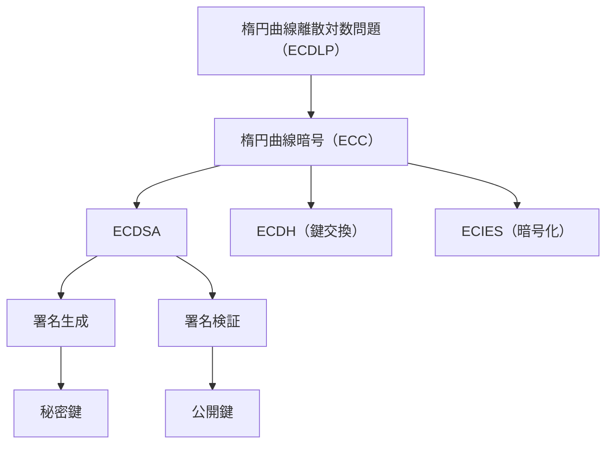
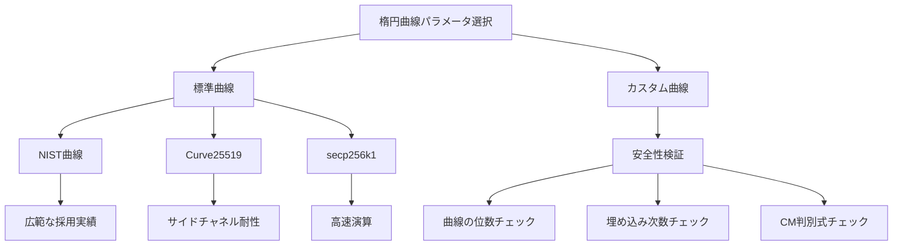
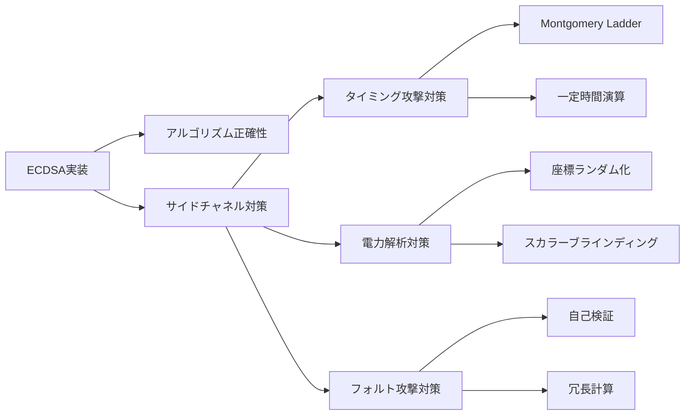

# ECDSA (Elliptic Curve Digital Signature Algorithm)

ECDSA（楕円曲線デジタル署名アルゴリズム）は、楕円曲線暗号の数学的特性を利用したデジタル署名方式である。1992年にScott VanstoneによってDSA（Digital Signature Algorithm）を楕円曲線上に適用する形で提案され、現在では暗号通貨、TLS証明書、IoTデバイスのセキュアブートなど、幅広い分野で採用されている重要な暗号技術となっている[^1]。

ECDSAの特徴は、RSAなどの従来の公開鍵暗号方式と比較して、同等のセキュリティレベルを大幅に短い鍵長で実現できる点にある。例えば、3072ビットのRSA鍵と同等のセキュリティを、わずか256ビットの楕円曲線鍵で達成できる。この効率性は、計算資源やストレージが限られた環境において特に重要な意味を持つ。



## 楕円曲線の数学的基礎

ECDSAを理解するためには、まず楕円曲線の数学的構造を把握する必要がある。楕円曲線は、一般的に以下のWeierstrass標準形で表される：

$$y^2 = x^3 + ax + b$$

ここで、$a$と$b$は曲線を定義するパラメータであり、判別式 $\Delta = -16(4a^3 + 27b^2) \neq 0$ を満たす必要がある。この条件により、曲線が特異点を持たないことが保証される。

暗号学的応用においては、この曲線を有限体 $\mathbb{F}_p$（$p$は素数）上で考える。つまり、すべての演算を $\bmod p$ で行う。有限体上の楕円曲線は離散的な点の集合となり、無限遠点 $O$（単位元）を含めて有限個の点から構成される群を形成する。

楕円曲線上の点の加法演算は、幾何学的には以下のように定義される。2つの点 $P = (x_1, y_1)$ と $Q = (x_2, y_2)$ に対して、これらを通る直線が曲線と交わる第3の点を求め、その点の$y$座標を反転させたものが $P + Q$ となる。代数的には以下の式で計算される：

$P \neq Q$ の場合：
- $\lambda = \frac{y_2 - y_1}{x_2 - x_1} \bmod p$
- $x_3 = \lambda^2 - x_1 - x_2 \bmod p$
- $y_3 = \lambda(x_1 - x_3) - y_1 \bmod p$

$P = Q$ の場合（点の2倍算）：
- $\lambda = \frac{3x_1^2 + a}{2y_1} \bmod p$
- $x_3 = \lambda^2 - 2x_1 \bmod p$
- $y_3 = \lambda(x_1 - x_3) - y_1 \bmod p$

## 楕円曲線離散対数問題とセキュリティ基盤

ECDSAのセキュリティは、楕円曲線離散対数問題（ECDLP: Elliptic Curve Discrete Logarithm Problem）の計算困難性に基づいている。この問題は、楕円曲線上の点 $P$ と $Q = kP$（$k$倍のスカラー倍算）が与えられたとき、整数 $k$ を求める問題である。

現在知られている最も効率的なECDLP解法アルゴリズムは、Pollardのρ法やPohliq-Hellmanアルゴリズムである。これらのアルゴリズムの計算量は $O(\sqrt{n})$（$n$は群の位数）であり、適切に選択された楕円曲線パラメータに対しては現実的な時間内での解法は不可能とされている。

しかし、すべての楕円曲線が暗号学的に安全というわけではない。以下のような脆弱な曲線は避ける必要がある：

**異常曲線（Anomalous Curves）**: 曲線の位数が基礎体の標数 $p$ と等しい場合、Smart攻撃により効率的にECDLPを解くことができる。

**超特異曲線（Supersingular Curves）**: MOV攻撃やFrey-Rück攻撃により、ECDLPを有限体上の離散対数問題に帰着させることができ、亜指数時間アルゴリズムで解ける可能性がある。

**小さな埋め込み次数を持つ曲線**: Weil pairingやTate pairingを用いた攻撃に対して脆弱である。

これらの脆弱性を回避するため、標準化団体は安全性が検証された曲線パラメータを推奨している。

## 標準曲線とパラメータ選択

実用的なECDSA実装では、標準化された楕円曲線パラメータを使用することが一般的である。主要な標準曲線には以下がある：

**NIST曲線**[^2]: P-256（secp256r1）、P-384、P-521など。これらは米国標準技術研究所（NIST）によって標準化され、広く採用されている。P-256の場合、以下のパラメータを持つ：
- $p = 2^{256} - 2^{224} + 2^{192} + 2^{96} - 1$
- $a = -3$
- $b$ = 0x5ac635d8aa3a93e7b3ebbd55769886bc651d06b0cc53b0f63bce3c3e27d2604b

**Curve25519**[^3]: Daniel J. Bernsteinによって設計された曲線で、実装の効率性とサイドチャネル攻撃への耐性を重視している。Montgomery形式で表現され、$y^2 = x^3 + 486662x^2 + x$ over $\mathbb{F}_{2^{255}-19}$。

**secp256k1**: ビットコインで採用されている曲線。Koblitz曲線の一種で、$y^2 = x^3 + 7$ over $\mathbb{F}_p$ where $p = 2^{256} - 2^{32} - 977$。特殊な構造により高速な演算が可能。



## ECDSA署名アルゴリズム

ECDSAの署名生成と検証プロセスは、DSAを楕円曲線上に適応させたものである。まず、システムパラメータとして以下が必要である：

- 楕円曲線 $E$ とその定義体 $\mathbb{F}_p$
- 基点 $G$（ジェネレータ）とその位数 $n$
- ハッシュ関数 $H$（通常SHA-256やSHA-512）

### 鍵生成

秘密鍵 $d$ は $[1, n-1]$ の範囲からランダムに選択される整数である。公開鍵 $Q$ は $Q = dG$ として計算される。この計算は一方向性を持ち、$Q$ から $d$ を求めることは計算困難である（ECDLP）。

### 署名生成

メッセージ $m$ に対する署名 $(r, s)$ は以下の手順で生成される：

1. メッセージのハッシュ値を計算：$e = H(m)$
2. $e$ をビット長が $n$ のビット長以下になるよう調整（左側の $\log_2 n$ ビットを取る）
3. ランダムな整数 $k \in [1, n-1]$ を生成（ノンス）
4. 点 $(x_1, y_1) = kG$ を計算
5. $r = x_1 \bmod n$ を計算。もし $r = 0$ なら手順3に戻る
6. $s = k^{-1}(e + rd) \bmod n$ を計算。もし $s = 0$ なら手順3に戻る
7. 署名は $(r, s)$

### 署名検証

署名 $(r, s)$ の検証は以下の手順で行われる：

1. $r, s \in [1, n-1]$ であることを確認
2. メッセージのハッシュ値を計算：$e = H(m)$
3. $e$ をビット長調整
4. $w = s^{-1} \bmod n$ を計算
5. $u_1 = ew \bmod n$、$u_2 = rw \bmod n$ を計算
6. 点 $(x_1, y_1) = u_1G + u_2Q$ を計算
7. $(x_1, y_1) = O$ なら署名は無効
8. $v = x_1 \bmod n$ を計算
9. $v = r$ なら署名は有効、そうでなければ無効

検証が成功する理由は以下の代数的性質による：
$$u_1G + u_2Q = ewG + rwQ = s^{-1}eG + s^{-1}rdG = s^{-1}(e + rd)G = kG$$

## ノンスの重要性とセキュリティ

ECDSAにおいて、署名生成時のノンス $k$ の扱いは極めて重要である。ノンスに関する脆弱性は、秘密鍵の完全な漏洩につながる可能性がある。

### ノンスの再利用による秘密鍵の漏洩

同じノンス $k$ を使用して2つの異なるメッセージ $m_1$、$m_2$ に署名した場合、署名 $(r_1, s_1)$、$(r_2, s_2)$ から秘密鍵 $d$ を以下のように復元できる：

$r_1 = r_2 = r$（同じ $k$ を使用したため）であり、
- $s_1 = k^{-1}(e_1 + rd) \bmod n$
- $s_2 = k^{-1}(e_2 + rd) \bmod n$

これらから：
$$k = \frac{e_1 - e_2}{s_1 - s_2} \bmod n$$
$$d = \frac{s_1k - e_1}{r} \bmod n$$

この脆弱性は、2010年にPlayStation 3のセキュリティ破りで実際に悪用された例がある[^4]。

### バイアスのあるノンス

ノンスが完全にランダムでない場合も問題となる。Lattice攻撃により、ノンスの一部のビットが既知または予測可能な場合、複数の署名から秘密鍵を復元できる可能性がある。これは、擬似乱数生成器の品質や実装の問題により発生することがある。

### 決定論的ECDSA（RFC 6979）

ノンスに関する脆弱性を回避するため、RFC 6979[^5]では決定論的にノンスを生成する方法が提案されている。この方法では、秘密鍵とメッセージからHMAC-DRBGを用いて決定論的にノンスを導出する：

```
k = HMAC-DRBG(d, H(m))
```

この方式により、同じメッセージに対しては常に同じノンスが生成されるが、メッセージが異なれば異なるノンスが生成される。また、秘密鍵を知らない攻撃者がノンスを予測することは不可能である。

## 実装上の考慮事項

ECDSAの安全な実装には、アルゴリズムの正確性だけでなく、サイドチャネル攻撃への対策も重要である。

### タイミング攻撃への対策

楕円曲線上のスカラー倍算は、ECDSAの中核となる演算であり、その実装方法によってはタイミング攻撃に脆弱となる。単純なダブル・アンド・アッド法では、スカラーのビットパターンによって実行時間が変化するため、秘密情報が漏洩する可能性がある。

対策として、以下の手法が用いられる：

**Montgomery Ladder**: 常に同じ演算シーケンスを実行することで、一定時間での計算を実現する。各ビットに対して必ず加算と2倍算の両方を実行し、条件分岐を排除する。

**ウィンドウ法の正規化**: 事前計算テーブルを用いる際も、テーブルアクセスのパターンから情報が漏れないよう、ダミーアクセスやマスキング技術を使用する。

### 電力解析攻撃への対策

スマートカードやIoTデバイスなど、物理的にアクセス可能な環境では、電力消費パターンから秘密情報を推測する攻撃が可能である。

**座標のランダム化**: 射影座標系を使用し、同じ点を異なる座標表現でランダムに表すことで、電力トレースのパターン化を防ぐ。点 $(x, y)$ を $(λx, λy, λ)$ として表現（$λ$はランダム）。

**スカラーのブラインディング**: スカラー $k$ の代わりに $k' = k + rn$（$r$はランダム、$n$は群の位数）を使用。結果は同じだが、実際の演算パターンは毎回異なる。

### フォルト攻撃への対策

計算中に意図的にエラーを注入し、誤った結果から秘密情報を推測する攻撃に対しても対策が必要である。

**署名の自己検証**: 生成した署名を即座に検証し、正しくない場合は出力しない。これにより、フォルトによる誤った署名の出力を防ぐ。

**冗長計算**: 重要な演算を複数回実行し、結果が一致することを確認する。特に、ノンスの生成や最終的な署名値の計算において有効。



## パフォーマンス最適化

ECDSAの実装において、性能は重要な考慮事項である。特に、大量のトランザクション処理やリアルタイム性が要求されるシステムでは、最適化が不可欠となる。

### 事前計算の活用

基点 $G$ に対するスカラー倍算は頻繁に実行されるため、事前計算テーブルを用いることで高速化できる。ウィンドウ法やコム法（Comb method）により、$2^w G, 2^{2w} G, ...$（$w$はウィンドウサイズ）を事前に計算しておくことで、スカラー倍算の計算量を削減できる。

### 楕円曲線の特殊形式の利用

特定の形式の楕円曲線では、より効率的な演算が可能である：

**Edwards曲線**: $ax^2 + y^2 = 1 + dx^2y^2$ の形式。加算公式が完全で例外処理が不要。

**Montgomery曲線**: $By^2 = x^3 + Ax^2 + x$ の形式。x座標のみを用いた高速なスカラー倍算が可能。

### バッチ検証

複数の署名を同時に検証する場合、バッチ検証技術により大幅な高速化が可能である。$n$個の署名 $(r_i, s_i)$ に対して、ランダムな重み $w_i$ を用いて：

$$\sum_{i=1}^{n} w_i(u_{1,i}G + u_{2,i}Q_i) = \sum_{i=1}^{n} w_i R_i$$

を検証することで、個別検証よりも効率的に複数署名の妥当性を確認できる。

## 量子コンピュータ耐性と将来の展望

現在のECDSAは、大規模な量子コンピュータが実現した場合、Shorのアルゴリズム[^6]により効率的に破られる可能性がある。量子コンピュータ上でのShorのアルゴリズムは、楕円曲線離散対数問題を多項式時間で解くことができる。

256ビットの楕円曲線鍵を破るには、約3000論理量子ビットが必要と推定されている。現在の量子コンピュータ技術（2024年時点）では、エラー訂正を含めた論理量子ビットの実現はまだ初期段階にあるが、今後10-20年での実現可能性を考慮し、耐量子暗号への移行準備が進められている。

NISTは2016年から耐量子暗号標準化プロセスを開始し、格子暗号、符号暗号、多変数多項式暗号、ハッシュベース署名などの方式が検討されている。これらの新しい署名方式は、ECDSAと比較して署名サイズや計算コストが大きくなる傾向があるため、移行期には両方式を併用するハイブリッド方式が採用される可能性が高い。

## 実装例と標準ライブラリ

実用的なECDSA実装では、十分にテストされた暗号ライブラリの使用が推奨される。主要なライブラリとその特徴は以下の通りである：

**OpenSSL**: 最も広く使用される暗号ライブラリ。豊富な楕円曲線をサポートし、FIPS認証版も提供。ただし、APIの複雑さと過去の脆弱性履歴には注意が必要。

**libsecp256k1**: Bitcoin Coreで使用される、secp256k1曲線に特化した高性能ライブラリ。定数時間実装とサイドチャネル攻撃への耐性を重視。

**Bouncy Castle**: Java/.NETの包括的な暗号ライブラリ。多様な楕円曲線と署名方式をサポート。

実装時の基本的なコード構造（概念的な擬似コード）：

```python
# Key generation
private_key = random_integer(1, n-1)
public_key = private_key * G

# Signing
def sign(message, private_key):
    e = hash(message)
    while True:
        k = random_integer(1, n-1)  # Or deterministic via RFC 6979
        R = k * G
        r = R.x mod n
        if r == 0: continue
        s = inverse(k) * (e + r * private_key) mod n
        if s == 0: continue
        return (r, s)

# Verification
def verify(message, signature, public_key):
    r, s = signature
    if not (1 <= r < n and 1 <= s < n):
        return False
    e = hash(message)
    w = inverse(s) mod n
    u1 = e * w mod n
    u2 = r * w mod n
    X = u1 * G + u2 * public_key
    if X is point_at_infinity:
        return False
    v = X.x mod n
    return v == r
```

## 標準化と相互運用性

ECDSAは複数の標準化団体によって規格化されており、実装間の相互運用性を確保するための詳細な仕様が定められている。

**FIPS 186-4**[^7]: 米国連邦情報処理標準として、ECDSAの詳細な仕様とテストベクトルを提供。承認された楕円曲線パラメータと、実装要件を規定。

**SEC 1/SEC 2**[^8]: Standards for Efficient Cryptographyグループによる規格。楕円曲線パラメータの表現形式、点の圧縮表現、署名フォーマットなどを標準化。

**X9.62**: ANSI X9による金融業界向け標準。ECDSAの基本仕様に加え、金融取引での使用に関する追加要件を規定。

これらの標準における主な相違点は、推奨される楕円曲線のセット、ハッシュ関数の選択、エンコーディング形式などにある。実装では、対象とするアプリケーションやエコシステムに応じて適切な標準を選択する必要がある。

ECDSAは、その数学的エレガンスと実用的効率性により、現代の暗号システムにおいて中心的な役割を果たしている。楕円曲線暗号の理論的基盤から実装上の詳細まで、多層的な理解が安全で効率的なシステム構築には不可欠である。量子コンピュータの脅威が現実となるまでの期間、ECDSAは引き続きデジタル署名の主要な選択肢として使用され続けるだろう。

[^1]: Vanstone, S. (1992). "Responses to NIST's proposal". Communications of the ACM, 35, 50-52.
[^2]: NIST (2013). "Digital Signature Standard (DSS)". Federal Information Processing Standards Publication 186-4.
[^3]: Bernstein, D. J. (2006). "Curve25519: new Diffie-Hellman speed records". International Workshop on Public Key Cryptography.
[^4]: Bushing, Marcan, Segher, Sven (2010). "Console Hacking 2010: PS3 Epic Fail". 27th Chaos Communication Congress.
[^5]: Pornin, T. (2013). "Deterministic Usage of the Digital Signature Algorithm (DSA) and Elliptic Curve Digital Signature Algorithm (ECDSA)". RFC 6979.
[^6]: Shor, P. W. (1997). "Polynomial-time algorithms for prime factorization and discrete logarithms on a quantum computer". SIAM Journal on Computing, 26(5), 1484-1509.
[^7]: NIST (2013). "Digital Signature Standard (DSS)". FIPS PUB 186-4.
[^8]: Certicom Research (2009). "Standards for Efficient Cryptography 1 (SEC 1)". Version 2.0.