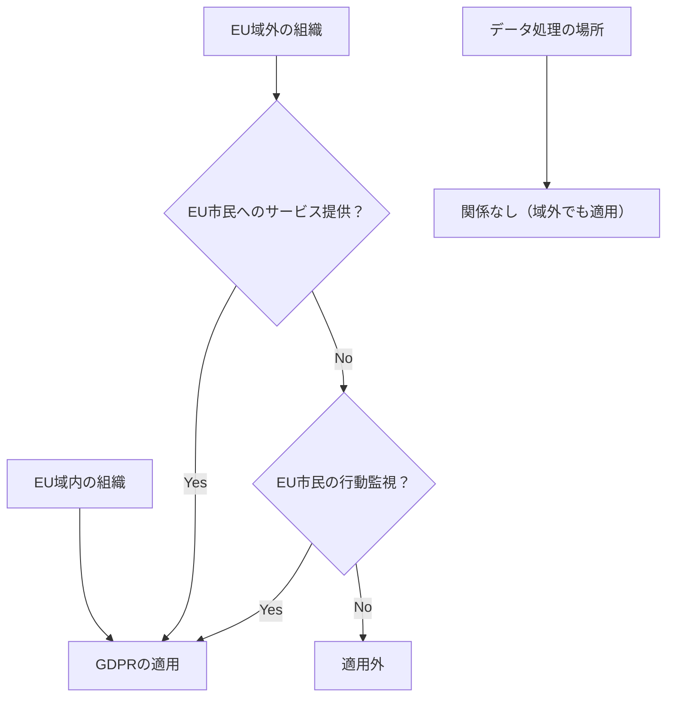
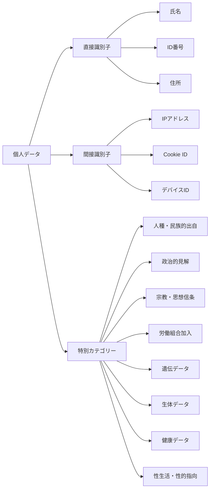
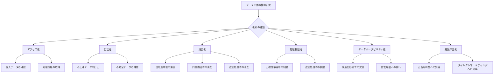
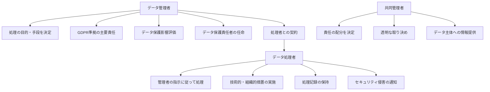
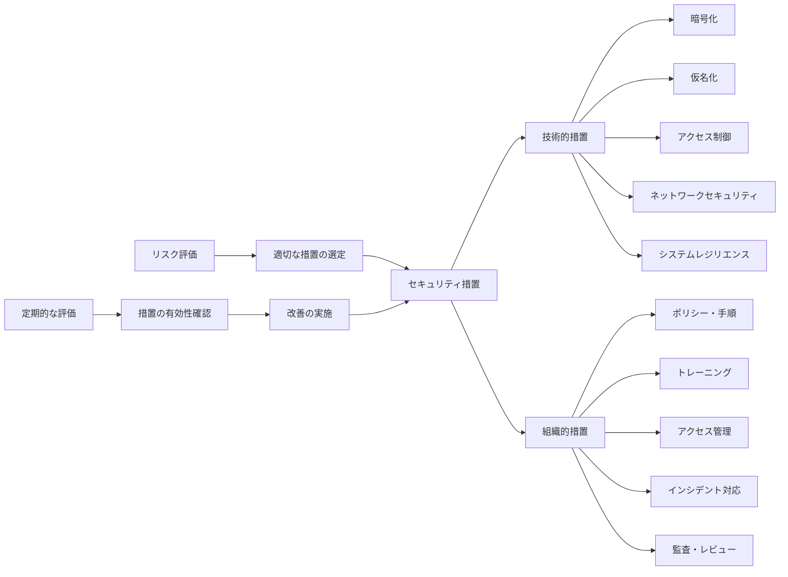
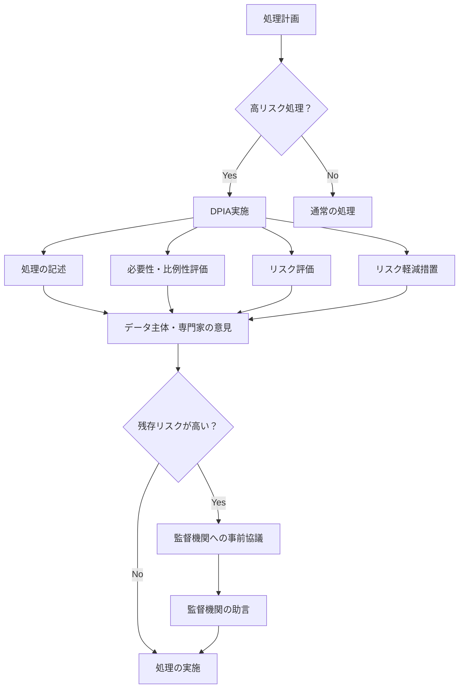
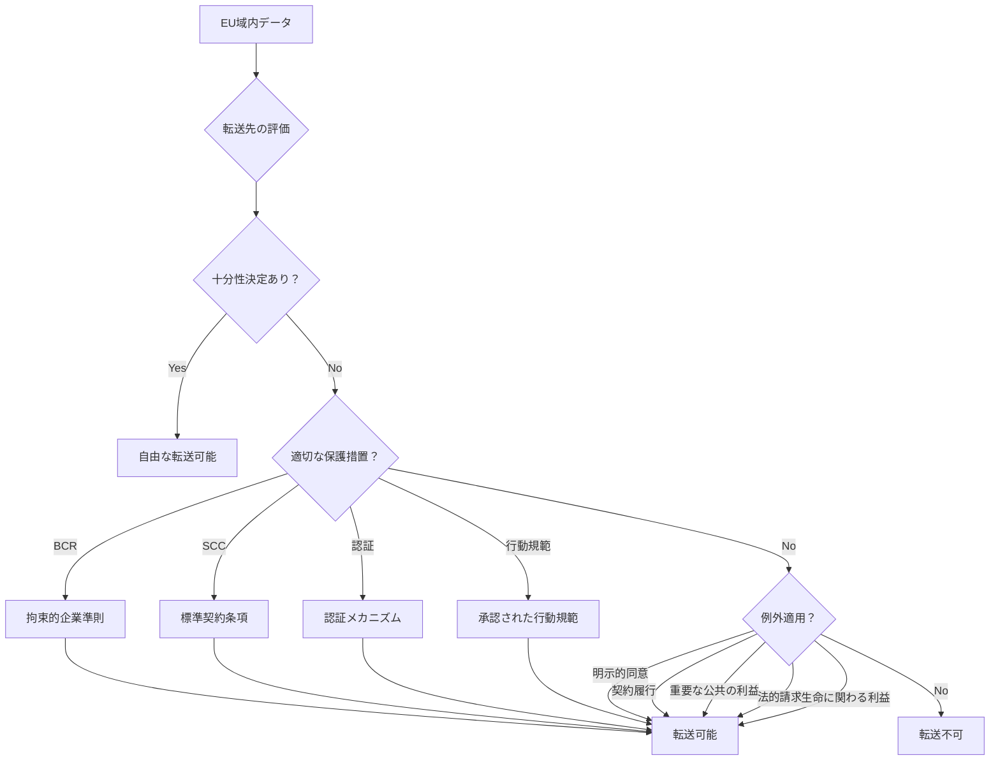
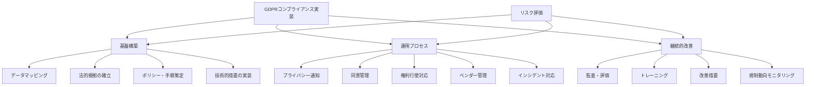

# GDPR (General Data Protection Regulation)

GDPR（一般データ保護規則）は、2018年5月25日に施行されたEUの包括的なデータ保護法規制である。個人データの処理に関する自然人の保護と、そのようなデータの自由な移動に関する規則を定めており、指令95/46/ECを廃止して統一的な法的枠組みを提供している[^1]。この規則は、EU域内で個人データを処理するすべての組織、またはEU市民のデータを扱う域外の組織にも適用される広範な影響力を持つ。

## 立法背景と適用範囲

GDPRの制定は、デジタル経済の急速な発展とグローバル化に伴う個人データ保護の必要性から生まれた。1995年のデータ保護指令では各国での実装に差異があり、また技術の進歩に対応できない部分が顕在化していた。GDPRは規則（Regulation）として直接適用されるため、EU全域で統一的な保護水準を確保している。

適用範囲は極めて広範である。第3条により、EU域内に拠点を持つ組織だけでなく、EU域内の個人に商品・サービスを提供する組織、またはEU域内の個人の行動を監視する組織も対象となる。この域外適用は、グローバルなデータ保護基準の確立という野心的な目標を反映している。

## 中核的な原則

GDPRは第5条において、個人データ処理に関する7つの基本原則を定めている。これらの原則は、すべてのデータ処理活動の基礎となる。

**適法性、公正性および透明性の原則**は、データ処理が法的根拠を持ち、データ主体に対して公正かつ透明な方法で行われることを要求する。透明性は単なる情報開示ではなく、データ主体が自己のデータ処理について真に理解し、コントロールできる状態を確保することを意味する。

**目的制限の原則**により、個人データは特定され、明示的かつ正当な目的のためにのみ収集され、それらの目的と両立しない方法でさらに処理されてはならない。ただし、公共の利益におけるアーカイブ目的、科学的もしくは歴史的研究目的、または統計目的での追加処理は、第89条に従って行われる限り、当初の目的と両立しないとはみなされない。

**データ最小化の原則**は、処理される個人データが、処理目的との関係で適切で、関連性があり、必要なものに限定されることを要求する。これは「必要最小限」という概念を具体化したものであり、データ収集の段階から処理の全過程において適用される。

**正確性の原則**により、個人データは正確であり、必要な場合には最新の状態に保たれなければならない。処理目的を考慮し、不正確な個人データが遅滞なく消去または訂正されることを確保するためのあらゆる合理的な措置が講じられなければならない。

**保存制限の原則**は、個人データが、その処理目的に必要な期間を超えて、データ主体を識別できる形式で保持されないことを要求する。より長期間の保存は、第89条に従った特定の目的のための場合にのみ許容される。

**完全性および機密性の原則**により、個人データは、無許可または違法な処理から保護され、偶発的な紛失、破壊または損傷から保護される方法で処理されなければならない。これは適切な技術的または組織的措置を用いたセキュリティの確保を意味する。

**説明責任の原則**は、データ管理者がこれらすべての原則への準拠に責任を負い、その準拠を実証できることを要求する。これは単なる遵守ではなく、遵守を証明できる体制の構築を意味する。

## 個人データの定義と特別カテゴリー

GDPRにおける個人データの定義は極めて広範である。第4条1項により、「識別された自然人または識別可能な自然人（データ主体）に関するあらゆる情報」が個人データとされる。識別可能な自然人とは、特に氏名、識別番号、位置データ、オンライン識別子などの識別子、または当該自然人の身体的、生理的、遺伝的、精神的、経済的、文化的もしくは社会的アイデンティティに特有の一つまたは複数の要素を参照することによって、直接的または間接的に識別できる者を指す。

特別カテゴリーの個人データは第9条で定義され、原則として処理が禁止される。これには人種的もしくは民族的出自、政治的見解、宗教的もしくは思想的信条、労働組合への加入を明らかにする個人データ、遺伝データ、自然人を一意に識別することを目的とした生体データ、健康に関するデータ、自然人の性生活もしくは性的指向に関するデータが含まれる。

特別カテゴリーのデータ処理が許容されるのは、明示的な同意がある場合、雇用・社会保障・社会保護法の分野における管理者または データ主体の義務の履行および特定の権利の行使のために必要な場合、データ主体の重大な利益を保護するために必要な場合など、第9条2項に列挙された特定の状況に限られる。

## データ主体の権利

GDPRは第3章（第12条から第23条）において、データ主体に対して包括的な権利を付与している。これらの権利は、個人が自己のデータに対する実質的なコントロールを行使できることを保証するものである。

**透明性のある情報提供、通知および方式**（第12条）により、データ管理者は、データ主体に対して簡潔で、透明性があり、理解しやすく、容易にアクセスできる形式で、明確かつ平易な言葉を用いて情報を提供しなければならない。データ主体による権利行使に対しては、原則として1か月以内に対応する必要がある。

**情報を受ける権利**（第13条・第14条）は、データ収集時点での包括的な情報提供を要求する。データ主体から直接収集する場合（第13条）と、データ主体以外から取得する場合（第14条）で若干の差異はあるが、いずれも処理の目的、法的根拠、正当な利益（該当する場合）、受領者のカテゴリー、保存期間、データ主体の権利などの情報提供が必要となる。

**アクセス権**（第15条）により、データ主体は自己に関する個人データが処理されているか否かを管理者から確認を得る権利を有し、処理されている場合には、当該個人データおよび特定の情報にアクセスする権利を有する。これには処理の目的、関係する個人データのカテゴリー、受領者、可能な場合は予定される保存期間などが含まれる。

**訂正権**（第16条）は、データ主体が不正確な自己に関する個人データの訂正を管理者から得る権利を保証する。処理の目的を考慮し、データ主体は、補足的な陳述の提供を含め、不完全な個人データを完全なものにする権利を有する。

**消去権（忘れられる権利）**（第17条）により、特定の条件下でデータ主体は自己に関する個人データの消去を管理者から得る権利を有する。これには、個人データが収集・処理された目的との関係でもはや必要でない場合、同意が撤回された場合、個人データが違法に処理された場合などが含まれる。

**処理の制限に対する権利**（第18条）は、個人データの正確性に異議が唱えられている場合、処理が違法でありデータ主体が消去に反対する場合、管理者が処理目的のためにもはや個人データを必要としないがデータ主体が法的主張の確立・行使・防御のために必要とする場合、第21条1項に基づく異議申立ての検証が保留中の場合に適用される。

**データポータビリティの権利**（第20条）は、データ主体が管理者に提供した自己に関する個人データを、構造化され、一般的に使用され、機械可読可能な形式で受け取る権利、および当該データを妨害されることなく他の管理者に移行する権利を保証する。この権利は、処理が同意または契約に基づいており、かつ自動化された手段によって行われている場合に限定される。

**異議申立権**（第21条）により、データ主体は、第6条1項(e)または(f)に基づく自己に関する個人データの処理に対して、自己の特定の状況に関する根拠に基づいて、いつでも異議を申し立てる権利を有する。ダイレクトマーケティング目的での処理に対する異議申立ての場合、管理者は当該目的での処理を停止しなければならない。

**自動化された個人の意思決定**（第22条）に関して、データ主体は、プロファイリングを含む、自動化された処理のみに基づいた決定であって、自己に関する法的効果を生じさせるか、または自己に同様の重大な影響を与える決定の対象とされない権利を有する。ただし、契約の締結・履行に必要な場合、EU法または加盟国法によって認められる場合、明示的な同意に基づく場合は例外となる。

## 法的根拠とその適用

個人データの処理は、第6条に定められた法的根拠のいずれかに該当する場合にのみ適法となる。これらの法的根拠は排他的なリストであり、少なくとも一つの根拠が適用されなければならない。

**同意**（第6条1項(a)）は、データ主体が一つまたは複数の特定の目的のために自己の個人データの処理に同意を与えた場合の根拠である。第7条により、同意は自由に与えられ、特定され、十分な情報を与えられた上での、明確な意思表示でなければならない。同意の立証責任は管理者にあり、同意はいつでも撤回可能でなければならない。

**契約の履行**（第6条1項(b)）は、データ主体が当事者となっている契約の履行のために処理が必要な場合、または契約締結前のデータ主体の求めに応じて措置を講じるために処理が必要な場合に適用される。この根拠は契約の履行に厳密に必要な処理に限定され、拡大解釈は許されない。

**法的義務の遵守**（第6条1項(c)）は、管理者が従うべき法的義務を遵守するために処理が必要な場合の根拠である。この法的義務はEU法または加盟国法に基づくものでなければならず、一般的または抽象的な義務では不十分である。

**データ主体または他の自然人の重大な利益の保護**（第6条1項(d)）は、生命に関わる利益の保護のために処理が必要な場合に適用される。これは例外的な状況での使用が想定されており、他の法的根拠が利用可能な場合には適用されない。

**公共の利益または公的権限の行使**（第6条1項(e)）は、公共の利益のために行われる業務の遂行、または管理者に与えられた公的権限の行使のために処理が必要な場合の根拠である。この根拠もEU法または加盟国法に基づく必要がある。

**正当な利益**（第6条1項(f)）は、管理者または第三者によって追求される正当な利益のために処理が必要な場合に適用される。ただし、特に データ主体が子どもである場合において、個人データの保護を求めるデータ主体の利益または基本的権利および自由が当該利益に優先する場合は除外される。この根拠の適用には、正当な利益の評価、処理の必要性、データ主体への影響のバランステストが必要となる。

## データ管理者とデータ処理者の責務

GDPRは、データ管理者（Controller）とデータ処理者（Processor）という二つの主要な役割を定義し、それぞれに異なる責任を課している。この区別は、データ保護における責任の所在を明確にし、適切な義務の配分を行うために重要である。

**データ管理者**は、単独でまたは他と共同で、個人データの処理の目的および手段を決定する自然人、法人、公的機関、行政機関またはその他の団体である。管理者は、GDPRの原則への準拠を確保し、それを実証する責任を負う（第5条2項）。

第24条により、管理者は処理の性質、範囲、文脈および目的、ならびに自然人の権利および自由に対する様々な可能性と重大性のリスクを考慮して、本規則に従って処理が行われることを確保し、それを実証できるようにするための適切な技術的および組織的措置を実装しなければならない。これには、適切な場合には、データ保護ポリシーの実装が含まれる。

**データ処理者**は、管理者に代わって個人データを処理する自然人、法人、公的機関、行政機関またはその他の団体である。処理者は、管理者の指示に従ってのみ行動し、第28条に定められた特定の義務を負う。

第28条は、管理者と処理者の関係を規律する詳細な要件を定めている。管理者は、適切な技術的および組織的措置を実施するための十分な保証を提供する処理者のみを使用しなければならない。処理は、EU法または加盟国法に基づく契約または他の法的行為によって規律され、これには処理の主題と期間、処理の性質と目的、個人データの種類とデータ主体のカテゴリー、管理者の義務と権利が定められなければならない。

処理者は、管理者の文書化された指示に従ってのみ個人データを処理し、個人データを処理する権限を与えられた者が機密保持を約束していることを確保し、第32条に定められたセキュリティ措置を実施し、副処理者の使用に関する条件を遵守し、データ主体の権利行使への対応において管理者を支援し、第32条から第36条に定められた義務の遵守において管理者を支援しなければならない。

## プライバシー・バイ・デザインとプライバシー・バイ・デフォルト

第25条は、データ保護バイデザインおよびバイデフォルトの原則を定めている。これは、データ保護を事後的な対応ではなく、システムやサービスの設計段階から組み込むことを要求する先進的なアプローチである。

**データ保護バイデザイン**は、処理の手段の決定時点および処理の実施時点の両方において、技術的および組織的措置を実施することを要求する。これには、データ最小化などのデータ保護原則を効果的に実施し、本規則の要件を満たし、データ主体の権利を保護するために必要な保護措置を処理に統合することが含まれる。

実装においては、最新技術、実装費用、処理の性質、範囲、文脈および目的、ならびに処理によって自然人の権利および自由にもたらされる様々な可能性と重大性のリスクを考慮する必要がある。これは、技術的中立性を維持しながら、リスクベースのアプローチを採用することを意味する。

**データ保護バイデフォルト**は、デフォルトで、各特定の処理目的に必要な個人データのみが処理されることを確保する措置の実施を要求する。この義務は、収集される個人データの量、処理の範囲、保存期間およびアクセシビリティに適用される。特に、そのような措置は、デフォルトで、個人データが、個人の介入なしに、不特定多数の自然人にアクセス可能とならないことを確保しなければならない。

## 技術的および組織的セキュリティ措置

第32条は、処理のセキュリティに関する要件を定めている。管理者および処理者は、最新技術、実装費用、処理の性質、範囲、文脈および目的、ならびに自然人の権利および自由に対する様々な可能性と重大性のリスクを考慮して、リスクに適切なセキュリティレベルを確保するための適切な技術的および組織的措置を実施しなければならない。

適切な場合、これらの措置には以下が含まれる：

個人データの仮名化および暗号化は、データの機密性を保護する基本的な技術的措置である。仮名化は、追加情報の使用なしには、個人データがもはや特定のデータ主体に帰属しえないような方法で個人データを処理することを意味する。暗号化は、適切な鍵管理と組み合わせて、データの機密性を確保する。

処理システムおよびサービスの継続的な機密性、完全性、可用性およびレジリエンスを確保する能力は、セキュリティの中核的要素である。これには、アクセス制御、認証メカニズム、監査ログ、侵入検知システムなどが含まれる。

物理的または技術的インシデントの場合に、適時に個人データへのアクセスおよび可用性を復元する能力は、事業継続性とデータ保護の観点から重要である。これには、定期的なバックアップ、災害復旧計画、インシデント対応手順が含まれる。

処理のセキュリティを確保するための技術的および組織的措置の有効性を定期的にテスト、評価および評価するプロセスは、セキュリティ態勢の継続的改善を保証する。これには、脆弱性評価、ペネトレーションテスト、セキュリティ監査が含まれる。

## データ侵害通知と対応

第33条および第34条は、個人データ侵害が発生した場合の通知義務を定めている。個人データ侵害とは、送信、保存またはその他の方法で処理された個人データの偶発的または違法な破壊、紛失、改ざん、無許可の開示またはアクセスをもたらすセキュリティ違反を意味する。

**監督機関への通知**（第33条）は、個人データ侵害が自然人の権利および自由に対するリスクをもたらす可能性が低い場合を除き、管理者は不当な遅滞なく、可能であれば侵害を認識してから72時間以内に、管轄監督機関に通知しなければならない。72時間以内に通知が行われない場合、遅延の理由を添えなければならない。

通知には少なくとも以下の情報が含まれなければならない：個人データ侵害の性質（可能であれば、関係するデータ主体のカテゴリーと概数、関係する個人データ記録のカテゴリーと概数を含む）、データ保護責任者または詳細情報を入手できる他の連絡先の名前と連絡先詳細、個人データ侵害から生じる可能性のある結果、侵害に対処するために管理者が講じたまたは講じることを提案する措置（適切な場合、起こりうる悪影響を軽減するための措置を含む）。

**データ主体への通知**（第34条）は、個人データ侵害が自然人の権利および自由に対する高いリスクをもたらす可能性がある場合、管理者は不当な遅滞なくデータ主体に通知しなければならない。この通知は、明確かつ平易な言葉で個人データ侵害の性質を説明し、少なくとも第33条3項(b)、(c)および(d)に記載された情報と勧告を含まなければならない。

データ主体への通知が不要となるのは、管理者が適切な技術的および組織的保護措置を実施しており、それらの措置が侵害の影響を受けた個人データに適用されていた場合（特に暗号化などにより、アクセス権限のない者にとってデータが理解不能となっている場合）、管理者が、データ主体の権利および自由に対する高いリスクがもはや実現する可能性がないことを確保する後続の措置を講じた場合、または、それが不均衡な努力を要する場合（この場合、代わりに公衆への通知または同様の措置が必要）である。

## データ保護影響評価とデータ保護責任者

**データ保護影響評価（DPIA）**（第35条）は、処理の種類が、特に新しい技術を使用する場合において、その性質、範囲、文脈および目的を考慮して、自然人の権利および自由に対する高いリスクをもたらす可能性がある場合に要求される。DPIAは、特に以下の場合に必要となる：

プロファイリングを含む自動化された処理に基づく、自然人に関する個人的側面の体系的かつ広範な評価であって、自然人に関する法的効果を生じさせるか、同様に自然人に重大な影響を与える決定に基づくもの、第9条1項に規定される特別カテゴリーのデータまたは第10条に規定される有罪判決および犯罪に関する個人データの大規模な処理、公衆がアクセス可能な場所の大規模な体系的監視。

DPIAには、少なくとも以下が含まれなければならない：予定される処理作業および処理目的の体系的な記述（該当する場合、管理者が追求する正当な利益を含む）、目的との関係における処理作業の必要性および比例性の評価、データ主体の権利および自由に対するリスクの評価、リスクに対処するために予定される措置（個人データの保護を確保し、本規則への準拠を実証するための保護措置、セキュリティ措置およびメカニズムを含む）。

**データ保護責任者（DPO）**（第37条から第39条）の任命は、以下の場合に義務付けられる：処理が公的機関または団体によって行われる場合（司法能力で行動する裁判所を除く）、管理者または処理者の中核的活動が、その性質、範囲および/または目的により、データ主体の定期的かつ体系的な大規模監視を必要とする処理作業で構成される場合、管理者または処理者の中核的活動が、第9条に基づく特別カテゴリーのデータおよび第10条に規定される有罪判決および犯罪に関する個人データの大規模な処理で構成される場合。

DPOは、専門的資質、特にデータ保護法および実務に関する専門知識、ならびに第39条に規定される任務を遂行する能力に基づいて指名される。DPOは管理者または処理者の職員であってもよいし、サービス契約に基づいて任務を遂行してもよい。

DPOの任務には、管理者または処理者およびデータ処理を行う従業員に対する本規則および他のEUまたは加盟国のデータ保護規定に関する情報提供と助言、本規則、他のEUまたは加盟国のデータ保護規定、および個人データ保護に関する管理者または処理者のポリシーへの準拠の監視、要請がある場合のDPIAに関する助言の提供とその実施の監視、監督機関との協力、処理に関する監督機関との連絡窓口としての行動が含まれる。

## 国際データ転送

第5章（第44条から第50条）は、第三国または国際機関への個人データの転送に関する規則を定めている。これらの規定は、EUのデータ保護水準が、データがEU域外に転送される場合にも維持されることを確保することを目的としている。

**転送の一般原則**（第44条）により、処理中または第三国もしくは国際機関への転送後に処理が予定されている個人データの転送は、管理者および処理者が本章に定められた条件を遵守する場合にのみ行われる。これには、当該第三国または国際機関からさらに他の第三国または国際機関への個人データの転送も含まれる。

**十分性決定に基づく転送**（第45条）は、欧州委員会が第三国、第三国内の地域もしくは一つ以上の特定部門、または国際機関が十分なレベルの保護を確保していると決定した場合、個人データの転送が可能となる。そのような転送には、いかなる特定の許可も必要としない。

十分性の評価においては、法の支配、人権および基本的自由の尊重、関連する一般的および分野別の立法、データ保護規則（個人データへの公的機関によるアクセスに関する規則を含む）、職業規則と安全対策、効果的で執行可能なデータ主体の権利と効果的な行政的・司法的救済、独立した監督機関の存在と効果的な機能などが考慮される。

**適切な保護措置による転送**（第46条）は、十分性決定がない場合でも、管理者または処理者が適切な保護措置を提供し、執行可能なデータ主体の権利と効果的な法的救済が利用可能である場合に転送を可能にする。適切な保護措置には、拘束的企業準則（BCR）、標準データ保護条項、承認された行動規範、承認された認証メカニズムなどが含まれる。

**特定の状況における例外**（第49条）は、十分性決定も適切な保護措置もない場合の限定的な例外を定めている。これには、データ主体が、十分性決定および適切な保護措置がないことから生じる可能性のあるリスクについて情報提供を受けた後、提案された転送に明示的に同意した場合、データ主体と管理者間の契約の履行のために転送が必要な場合、データ主体の利益のために管理者と他の自然人または法人間で締結される契約の締結または履行のために転送が必要な場合などが含まれる。

## 監督機関と執行メカニズム

第6章（第51条から第59条）は、独立した監督機関の設置と権限を定めている。各加盟国は、自然人の個人データ処理に関する基本的権利と自由を保護し、EU域内での個人データの自由な流通を促進するため、本規則の適用を監視する責任を負う一つ以上の独立した公的機関を設置しなければならない。

監督機関の独立性（第52条）は、GDPRの執行における重要な要素である。監督機関は、その任務の遂行と権限の行使において完全に独立して行動し、直接的または間接的な外部の影響を受けず、誰からも指示を求めたり受けたりしてはならない。

監督機関の権限（第58条）は、調査権限、是正権限、許可および助言権限に分類される。調査権限には、管理者および処理者に対してあらゆる情報の提供を命じる権限、データ保護監査を実施する権限、処理業務の通知をレビューする権限、管理者および処理者から処理に必要なすべての情報にアクセスする権限、データ保護法の適用を受ける事業所への立入権限が含まれる。

是正権限には、管理者または処理者に対して処理業務が本規則の規定に違反する可能性があることを警告する権限、処理業務が本規則の規定に違反していることを認定した場合に管理者または処理者を戒告する権限、データ主体の権利行使要求に応じるよう管理者に命じる権限、処理業務を本規則の規定に適合させるよう命じる権限、個人データ侵害をデータ主体に通知するよう管理者に命じる権限、処理の一時的または確定的な制限（禁止を含む）を課す権限、第三国または国際機関の受領者へのデータ流通の停止を命じる権限、第83条に従って行政制裁金を課す権限が含まれる。

## 制裁と行政制裁金

第83条は、GDPRの特徴的な執行メカニズムである行政制裁金について定めている。行政制裁金は、各個別の事案において、効果的で、比例的で、抑止力のあるものでなければならない。

行政制裁金を課すか否か、その金額を決定する際には、以下の要素が考慮される：違反の性質、重大性および期間（処理の性質、範囲または目的、影響を受けたデータ主体の数と被害の程度を考慮）、違反の故意または過失の性質、データ主体の被害を軽減するために管理者または処理者が講じた措置、技術的および組織的措置の実施における管理者または処理者の責任の程度、管理者または処理者による以前の関連違反、違反を是正し悪影響を軽減するための監督機関との協力の程度、違反によって影響を受ける個人データのカテゴリー、監督機関が違反を知った方法（特に管理者または処理者が違反を通知したか否か）、同じ事項に関して当該管理者または処理者に対して以前に命じられた措置の遵守、承認された行動規範または認証メカニズムの遵守、違反から直接的または間接的に得られた金銭的利益または回避された損失などの悪化または軽減要因。

制裁金の上限は違反の種類により二つのレベルに分けられる。第83条4項に列挙される違反（子どもの同意、データ処理の法的根拠、特別カテゴリーのデータ処理の条件、データ主体の権利、国際転送の条件などに関する違反）については、1,000万ユーロまたは企業の場合は前会計年度の全世界年間売上高の2%のいずれか高い方が上限となる。

第83条5項および6項に列挙される、より重大な違反（基本原則違反、同意の条件違反、データ主体の権利侵害、国際転送規定違反、第9章に基づく加盟国法の義務違反、監督機関の命令への不遵守など）については、2,000万ユーロまたは企業の場合は前会計年度の全世界年間売上高の4%のいずれか高い方が上限となる。

## 実装における実践的考慮事項

GDPRコンプライアンスの実装は、技術的、組織的、法的側面を包含する包括的なアプローチを必要とする。組織は、データ保護を単なる法的要件としてではなく、信頼構築とリスク管理の中核的要素として位置づける必要がある。

**データマッピングとインベントリ**は、コンプライアンスの基礎となる。組織は、どのような個人データを、どこで、どのような目的で、どのような法的根拠に基づいて処理しているかを完全に把握する必要がある。これには、データフロー図の作成、処理活動の記録（第30条）の維持、第三者との共有関係の文書化が含まれる。

**プライバシー通知とコンセント管理**は、透明性原則の実装において重要である。プライバシー通知は、階層的アプローチを採用し、重要な情報を最初に提示し、詳細情報へのアクセスを提供することが推奨される。同意管理においては、同意の記録、撤回メカニズムの実装、同意の定期的な更新が必要となる。

**データ主体の権利行使への対応**プロセスは、自動化と人的レビューのバランスを取る必要がある。本人確認プロセス、要求の正当性評価、技術的実装（データのエクスポート、削除、訂正など）、例外の適用判断などを含む包括的なワークフローの確立が必要である。

**セキュリティ対策の実装**においては、リスクベースアプローチが重要となる。データの分類、リスク評価、適切な技術的対策（暗号化、アクセス制御、ログ記録など）と組織的対策（ポリシー、トレーニング、インシデント対応）の組み合わせが必要である。特に、クラウドサービスの利用、リモートワーク環境、モバイルデバイスの使用など、現代的なIT環境における特有のリスクへの対応が求められる。

**ベンダー管理とデータ処理契約**は、データ処理者を使用する際の重要な要素である。第28条の要件を満たす契約条項の整備、処理者の評価とモニタリング、サブプロセッサーの管理、監査権の行使などが含まれる。特に、クラウドサービスプロバイダーやSaaSベンダーとの関係においては、標準契約条項の使用と追加的な保護措置の検討が必要となる。

**国際データ転送メカニズム**の選択と実装は、グローバル企業にとって特に重要である。Schrems II判決[^2]以降、標準契約条項（SCC）の使用においても、転送先国の法制度の評価と追加的保護措置の実装が必要となっている。これには、技術的措置（転送時の暗号化、仮名化など）と組織的措置（アクセス制限、透明性レポートなど）が含まれる。

**データ保護影響評価（DPIA）**の実施は、高リスク処理において不可欠である。DPIAは、プライバシー・バイ・デザインの原則を実践する機会でもあり、ステークホルダーの関与、リスクの特定と評価、軽減措置の設計、残存リスクの受容判断を含む体系的なプロセスとして実施される必要がある。

**インシデント対応と侵害通知**のプロセスは、72時間の通知期限を考慮して設計される必要がある。インシデントの検知、分類、エスカレーション、影響評価、通知判断、是正措置の実施を含む明確な手順と、関係者の役割と責任の定義が不可欠である。

GDPRコンプライアンスは、一度達成すれば終わりというものではなく、継続的な努力を要する。技術の進化、ビジネスモデルの変化、規制解釈の発展に応じて、データ保護プログラムを適応させていく必要がある。組織は、コンプライアンスを負担としてではなく、顧客信頼の構築、データガバナンスの向上、競争優位性の確立の機会として捉えることが重要である。

監督機関のガイドライン、欧州データ保護会議（EDPB）の意見、裁判所の判例は、GDPRの解釈と適用において重要な役割を果たしている。組織は、これらの動向を継続的にモニタリングし、自らのコンプライアンスプログラムに反映させる必要がある。特に、新技術（AI、IoT、ブロックチェーンなど）の使用、新しいビジネスモデル（データ共有、プラットフォームエコノミーなど）の採用においては、プライバシー影響の慎重な評価と適切な保護措置の実装が求められる。

[^1]: Regulation (EU) 2016/679 of the European Parliament and of the Council of 27 April 2016 on the protection of natural persons with regard to the processing of personal data and on the free movement of such data, and repealing Directive 95/46/EC (General Data Protection Regulation)

[^2]: Case C-311/18, Data Protection Commissioner v Facebook Ireland Limited and Maximillian Schrems (Schrems II), Judgment of the Court (Grand Chamber) of 16 July 2020