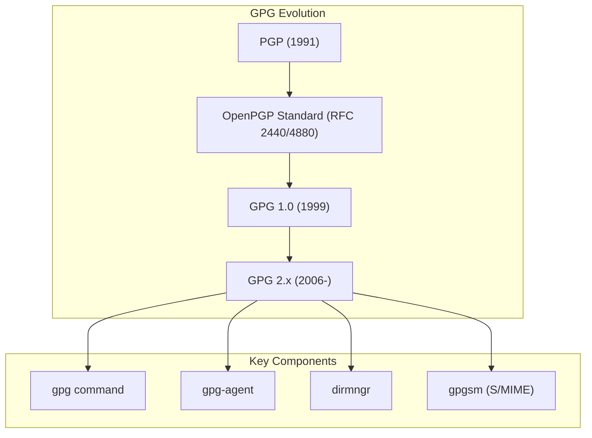
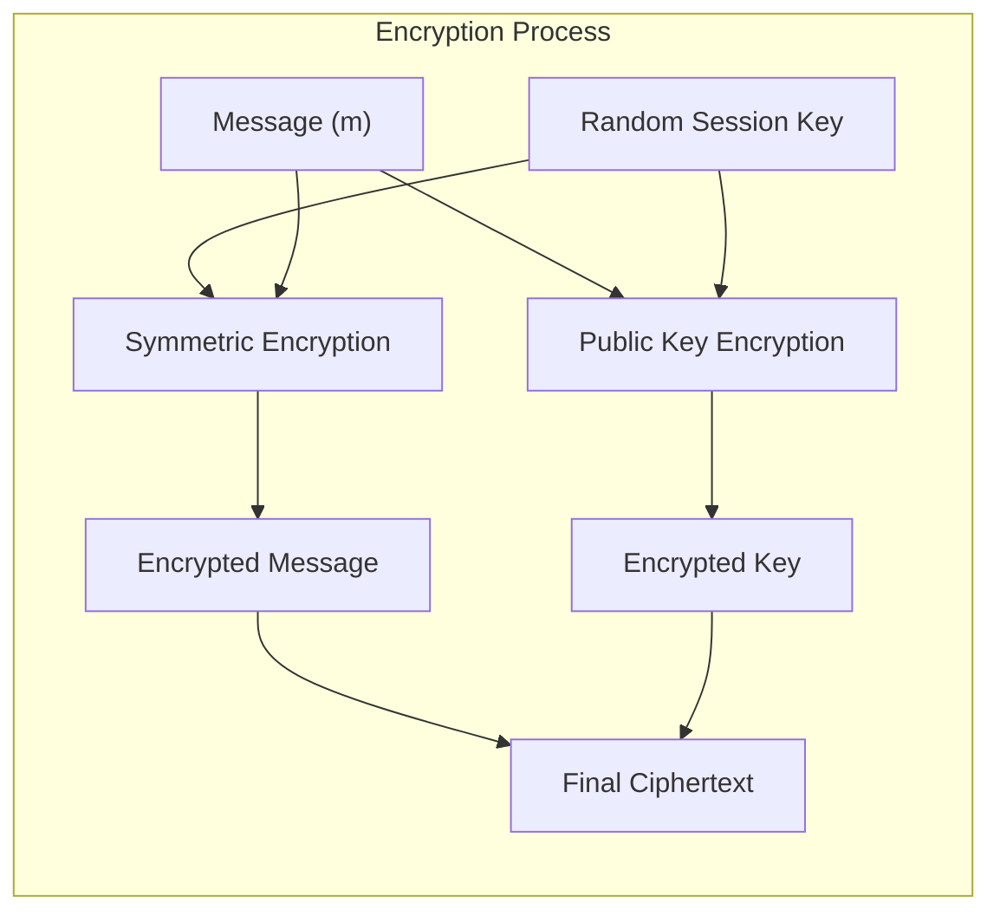
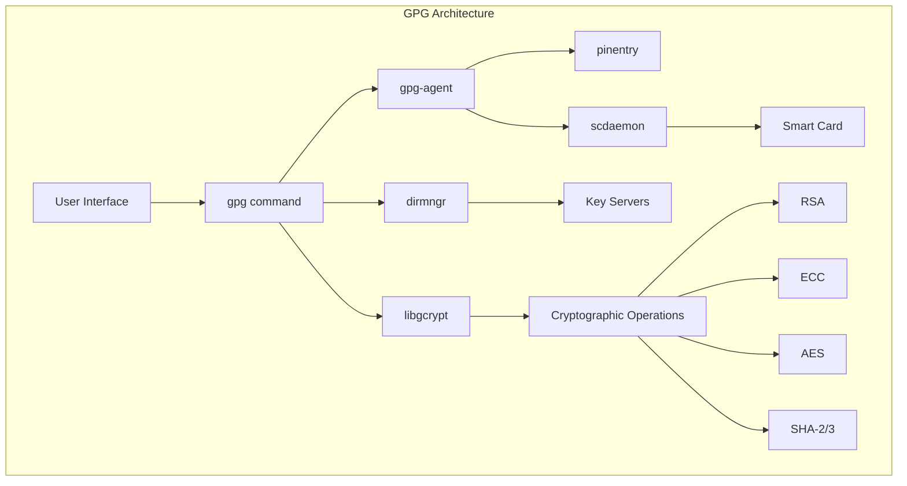
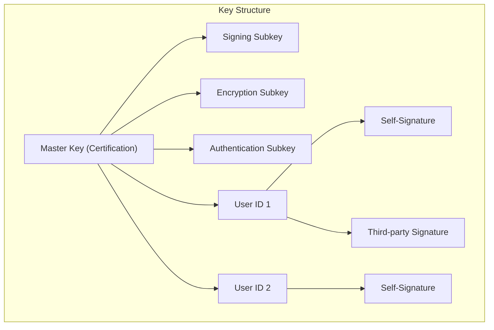
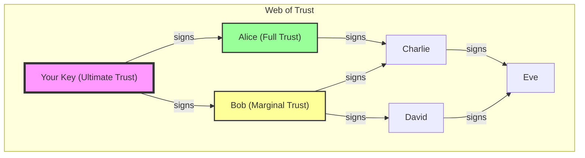
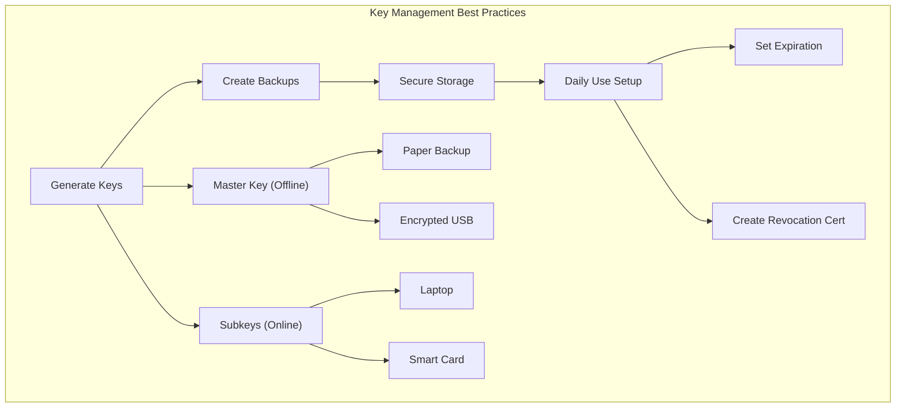

# GPG (GNU Privacy Guard)

GPG（GNU Privacy Guard）は、Philip Zimmermannが開発したPGP（Pretty Good Privacy）の思想を継承し、GNU Projectの一環として開発されたオープンソースの暗号化ソフトウェアである。1999年にWerner Kochによって最初のバージョンがリリースされて以来、GPGは電子メールの暗号化、ファイルの保護、そしてデジタル署名の作成において、世界中で最も広く使用される暗号化ツールの一つとなっている。

GPGの本質を理解するためには、まずその前身であるPGPの歴史的背景を把握する必要がある。1991年、Philip Zimmermannは個人のプライバシーを保護する目的でPGPを開発した。当時、強力な暗号化技術は政府機関や大企業のみが利用可能であり、一般市民がアクセスできる暗号化ツールは限られていた。PGPは、RSA暗号アルゴリズムとIDEA対称暗号を組み合わせたハイブリッド暗号システムを採用し、一般ユーザーでも軍事レベルの暗号化を利用できるようにした革新的なソフトウェアであった。

しかし、PGPには法的な問題が存在した。RSAアルゴリズムの特許問題と、米国の暗号輸出規制により、PGPの配布と使用には制限があった。これらの問題を解決するため、1997年にOpenPGP標準[^1]が策定され、PGPの暗号化フォーマットと処理手順が公開標準として定義された。GPGは、このOpenPGP標準の完全な実装として開発され、特許フリーの暗号アルゴリズムを使用することで、法的制約を回避しながらPGPと互換性を持つソフトウェアとして誕生した。

## 公開鍵暗号方式の理論的基礎

GPGの中核をなすのは公開鍵暗号方式である。この暗号方式は、1976年にWhitfield DiffieとMartin Hellmanによって提唱された画期的な概念であり[^2]、それまでの対称鍵暗号方式が抱えていた鍵配送問題を根本的に解決した。公開鍵暗号方式では、数学的に関連した一対の鍵（公開鍵と秘密鍵）を使用する。公開鍵は誰でも知ることができるが、秘密鍵は所有者のみが保持する。この非対称性により、事前の安全な鍵交換なしに暗号化通信が可能となる。

GPGで主に使用される公開鍵暗号アルゴリズムはRSA、DSA、ElGamal、そして近年ではECDSAやEdDSAなどの楕円曲線暗号である。RSAアルゴリズムは、大きな素数の積の素因数分解が計算量的に困難であることを安全性の根拠としている。具体的には、二つの大きな素数 $p$ と $q$ を選び、その積 $n = pq$ を計算する。公開鍵は $(n, e)$ の組であり、秘密鍵は $(n, d)$ の組である。ここで、$e$ と $d$ は $ed \equiv 1 \pmod{\phi(n)}$ を満たす関係にある（$\phi(n)$ はオイラーのトーシェント関数）。

メッセージ $m$ の暗号化は $c = m^e \bmod n$ で行われ、復号化は $m = c^d \bmod n$ で行われる。RSAの安全性は、$n$ から $p$ と $q$ を求めることが計算量的に困難であることに依存している。現在、2048ビット以上のRSA鍵が推奨されているが、これは現在の計算能力では素因数分解が現実的な時間内に不可能なサイズである。

ElGamalアルゴリズムは、離散対数問題の困難性に基づいている。大きな素数 $p$ と、その原始根 $g$ を選び、秘密鍵として乱数 $x$ を選ぶ。公開鍵は $y = g^x \bmod p$ である。メッセージの暗号化には一時的な乱数 $k$ を使用し、暗号文は $(c_1, c_2) = (g^k \bmod p, m \cdot y^k \bmod p)$ となる。復号化は $m = c_2 \cdot c_1^{-x} \bmod p$ で行われる。

楕円曲線暗号（ECC）は、楕円曲線上の離散対数問題の困難性を利用する。楕円曲線は $y^2 = x^3 + ax + b$ の形で表される曲線であり、この曲線上の点に対して定義される加法演算を基礎とする。ECCの利点は、RSAやElGamalと同等の安全性をより短い鍵長で実現できることである。例えば、256ビットのECC鍵は、3072ビットのRSA鍵と同等の安全性を提供する。

GPGにおける暗号化プロセスは、実際にはハイブリッド暗号システムを採用している。公開鍵暗号は計算コストが高いため、実際のメッセージは高速な対称鍵暗号（AES、Camellia、Twofishなど）で暗号化される。この対称鍵（セッション鍵）は乱数として生成され、受信者の公開鍵で暗号化される。受信者は自身の秘密鍵でセッション鍵を復号化し、そのセッション鍵を使用してメッセージを復号化する。

## GPGのアーキテクチャと実装

GPGのアーキテクチャは、モジュール化された設計により、柔軟性とセキュリティを両立している。GPG 2.xシリーズでは、主要なコンポーネントが分離され、それぞれが特定の役割を担っている。中核となるgpgコマンドは、ユーザーインターフェースとして機能し、実際の暗号化操作はlibgcryptライブラリを通じて実行される。

gpg-agentは、秘密鍵の管理とパスフレーズのキャッシングを担当する重要なデーモンプロセスである。このエージェントは、秘密鍵へのアクセスを仲介し、パスフレーズの入力回数を減らしながらセキュリティを維持する。gpg-agentは、秘密鍵をメモリ上で保護し、必要に応じてピンエントリプログラムを呼び出してユーザーからパスフレーズを取得する。

dirmngrは、証明書やCRLの取得、キーサーバーとの通信を管理するデーモンである。このコンポーネントは、ネットワーク関連の操作を一元化し、プロキシ設定やタイムアウト処理を統一的に管理する。scdaemonは、スマートカードとの通信を担当し、秘密鍵をハードウェアトークンに保存する場合のインターフェースを提供する。

GPGの鍵管理システムは、公開鍵リングと秘密鍵リングという概念を中心に構築されている。GPG 2.1以降では、秘密鍵の保存形式が変更され、各秘密鍵は個別のファイルとして~/.gnupg/private-keys-v1.d/ディレクトリに保存される。ファイル名は鍵のキーグリップ（鍵の内容から導出される一意の識別子）に基づいている。

鍵の構造は階層的であり、主鍵（マスターキー）と副鍵（サブキー）から構成される。主鍵は通常、他のユーザーの鍵への署名と副鍵の管理に使用され、副鍵は日常的な暗号化と署名操作に使用される。この分離により、副鍵が漏洩した場合でも、主鍵を保護し、信頼の網（Web of Trust）への影響を最小限に抑えることができる。

## 暗号化と署名のプロセス

GPGにおける暗号化プロセスは、複数の段階を経て実行される。まず、平文メッセージは圧縮アルゴリズム（ZIP、ZLIB、BZIP2など）により圧縮される。圧縮は暗号文のパターン分析を困難にし、転送効率を向上させる効果がある。次に、乱数生成器を使用してセッション鍵が生成される。GPGの乱数生成器は、/dev/randomや/dev/urandomなどのシステムエントロピーソースを利用し、暗号学的に安全な乱数を生成する。

セッション鍵を用いて、圧縮されたメッセージは対称鍵暗号アルゴリズムで暗号化される。GPGはAES（128/192/256ビット）、Camellia、Twofish、3DESなど複数の対称鍵暗号をサポートしている。暗号化にはCFB（Cipher Feedback）モードが標準的に使用され、これによりストリーム暗号のような動作を実現している。

デジタル署名の作成プロセスでは、まずメッセージのハッシュ値が計算される。GPGはSHA-256、SHA-512、SHA-3などの暗号学的ハッシュ関数をサポートしている。計算されたハッシュ値は、署名者の秘密鍵を用いて暗号化され、デジタル署名となる。署名の検証では、署名者の公開鍵を用いて署名を復号化し、得られたハッシュ値とメッセージから独立に計算したハッシュ値を比較する。

GPGの署名には複数の形式が存在する。クリア署名（clearsign）は、元のテキストを保持したまま署名を付加する形式であり、主にテキストメッセージに使用される。分離署名（detached signature）は、署名を別ファイルとして保存する形式であり、バイナリファイルやソフトウェアパッケージの検証に適している。

## Web of Trustモデル

GPGの信頼モデルは、中央集権的な認証局（CA）に依存するPKIとは異なり、分散型のWeb of Trustを採用している。このモデルでは、各ユーザーが他のユーザーの公開鍵の正当性を個別に検証し、署名することで信頼のネットワークを構築する。信頼の度合いは、完全信頼（full）、準信頼（marginal）、信頼しない（none）の段階で表現される。

鍵の有効性は、信頼パスの存在によって決定される。ある鍵が有効と見なされるためには、自身が完全に信頼する鍵からの署名パス、または準信頼する複数の鍵からの署名パスが必要である。デフォルトでは、3つの準信頼パスが1つの完全信頼パスと同等と見なされる。この閾値はtrust-modelとmax-cert-depthパラメータで調整可能である。

鍵署名パーティー（Key Signing Party）は、Web of Trustを構築する重要なイベントである。参加者は物理的に集まり、政府発行の身分証明書などを用いて互いの身元を確認した後、それぞれの鍵のフィンガープリントを交換する。フィンガープリントは鍵の内容から生成される一意の識別子であり、中間者攻撃を防ぐ役割を果たす。

GPGは、信頼データベース（trustdb）を維持し、各鍵に対する信頼レベルと有効性の計算結果をキャッシュする。このデータベースは定期的に更新され、新しい署名や失効した鍵の情報が反映される。trust-modelオプションにより、classicモデルの他に、pgp（PGP互換）、direct（直接信頼のみ）、always（常に信頼）などのモデルを選択できる。

## 鍵の管理とベストプラクティス

効果的な鍵管理は、GPGを安全に使用するための基礎である。鍵の生成時には、十分なエントロピーを確保することが重要である。GPGは鍵生成中にマウスの動きやキーボード入力などからエントロピーを収集する。鍵のサイズは、RSAの場合は最低2048ビット、推奨は4096ビットである。楕円曲線暗号の場合、Curve25519（Ed25519/X25519）やNIST P-256などの標準的な曲線が使用される。

鍵の有効期限を設定することは、セキュリティ上重要な実践である。主鍵には長期間（例：2-5年）の有効期限を設定し、副鍵にはより短期間（例：1年）の有効期限を設定することが推奨される。期限切れの鍵は、新しい自己署名により延長可能であるが、これは鍵が漏洩していないことを定期的に確認する機会となる。

秘密鍵のバックアップは、paperkey ツールを使用して紙に印刷する方法や、暗号化されたUSBドライブに保存する方法がある。主鍵は安全な場所（例：銀行の貸金庫）に保管し、日常的な使用には副鍵のみを使用することで、セキュリティリスクを最小化できる。

鍵の失効証明書は、鍵生成直後に作成し、安全に保管すべきである。失効証明書により、秘密鍵が漏洩した場合や、パスフレーズを忘れた場合でも、公開鍵を無効化できる。失効理由には、鍵の漏洩（compromised）、鍵の置き換え（superseded）、使用停止（no longer used）などがある。

## 高度な機能と実装の詳細

GPGは、基本的な暗号化・署名機能に加えて、多くの高度な機能を提供している。スマートカード（OpenPGPカード、YubiKeyなど）のサポートにより、秘密鍵をハードウェアセキュリティモジュールに保存できる。スマートカードは、秘密鍵がデバイスから抽出されることを防ぎ、PIN入力により不正使用を防止する。

GPGのS/MIME実装であるgpgsmは、X.509証明書を使用した暗号化と署名をサポートする。これにより、企業環境で一般的なPKIインフラストラクチャとの統合が可能となる。gpgsmは、証明書チェーンの検証、CRLとOCSPによる失効確認、証明書の自動更新などの機能を提供する。

対称鍵暗号化モードでは、公開鍵を使用せずにパスフレーズのみでファイルを暗号化できる。この機能は、--symmetricオプションで利用可能であり、パスフレーズから鍵導出関数（S2K: String-to-Key）を使用して暗号鍵を生成する。GPGは、反復回数を調整可能なIterated and Salted S2Kを使用し、パスフレーズ攻撃への耐性を高めている。

## 性能特性と最適化

GPGの性能は、使用する暗号アルゴリズムと鍵のサイズに大きく依存する。RSA暗号化・復号化の計算量は鍵長の3乗に比例するため、4096ビットRSA鍵は2048ビット鍵と比較して約8倍の処理時間を要する。一方、楕円曲線暗号は、より短い鍵長で同等の安全性を提供するため、性能面で有利である。

大容量ファイルの暗号化では、対称鍵暗号の性能が支配的となる。AES-NIなどのハードウェア暗号化支援機能を持つプロセッサでは、AES暗号化の性能が大幅に向上する。GPGは、利用可能な場合これらのハードウェア機能を自動的に使用する。

メモリ使用量の観点では、GPGは大きなファイルをストリーミング処理するため、ファイルサイズに関わらず一定のメモリ使用量で動作する。ただし、署名検証では、署名対象のデータ全体のハッシュ値を計算する必要があるため、大容量ファイルの処理には時間がかかる場合がある。

## セキュリティ考察

GPGのセキュリティは、使用する暗号アルゴリズムの強度だけでなく、実装の品質と運用方法にも依存する。サイドチャネル攻撃への対策として、GPGは暗号演算の実行時間を一定化する技術や、メモリアクセスパターンを隠蔽する技術を実装している。

量子コンピュータの脅威に対して、現在の公開鍵暗号アルゴリズムは脆弱である。Shorのアルゴリズムにより、十分な規模の量子コンピュータはRSAやECCを効率的に破ることができる。GPGコミュニティは、耐量子暗号アルゴリズムの標準化を待ちながら、将来的な移行計画を検討している。現時点では、対称鍵暗号のキーサイズを増やす（AES-256の使用）ことで、量子コンピュータに対する耐性を高めることができる。

鍵管理の観点から、最も一般的なセキュリティリスクは、不適切なパスフレーズの使用である。GPGは、パスフレーズの品質チェック機能を提供しているが、最終的にはユーザーの判断に委ねられる。また、マルウェアによるキーロガーは、パスフレーズを盗む可能性があるため、信頼できる環境でのみ秘密鍵を使用することが重要である。

GPGの実装には、過去にいくつかのセキュリティ脆弱性が発見されている。EFAIL攻撃[^3]は、暗号化されたメールの内容を漏洩させる可能性があったが、これは主にメールクライアントの実装の問題であり、GPG自体の根本的な欠陥ではなかった。定期的なセキュリティアップデートの適用は、既知の脆弱性から保護するために不可欠である。

現代の暗号システムにおいて、GPGは依然として重要な役割を果たしている。エドワード・スノーデンが使用したことで有名になったように、適切に使用されたGPGは、国家レベルの監視に対しても効果的な保護を提供する。しかし、その複雑性ゆえに、一般ユーザーには使いにくいという課題も残されている。Signal ProtocolやWireGuardなど、より使いやすい暗号化技術が登場している中で、GPGは主に技術者やセキュリティ専門家のツールとして位置づけられつつある。

GPGの将来は、OpenPGP標準の進化と密接に関連している。現在策定中のOpenPGP v5では、より現代的な暗号アルゴリズムのサポートと、使いやすさの向上が図られている。また、分散型アイデンティティシステムとの統合や、ブロックチェーン技術を使用した鍵管理など、新しいアプローチも検討されている。これらの発展により、GPGは今後も情報セキュリティの重要なツールとして進化を続けるであろう。

[^1]: RFC 4880: OpenPGP Message Format, J. Callas et al., 2007
[^2]: New Directions in Cryptography, W. Diffie and M. Hellman, IEEE Transactions on Information Theory, 1976
[^3]: Efail: Breaking S/MIME and OpenPGP Email Encryption using Exfiltration Channels, D. Poddebniak et al., USENIX Security Symposium, 2018