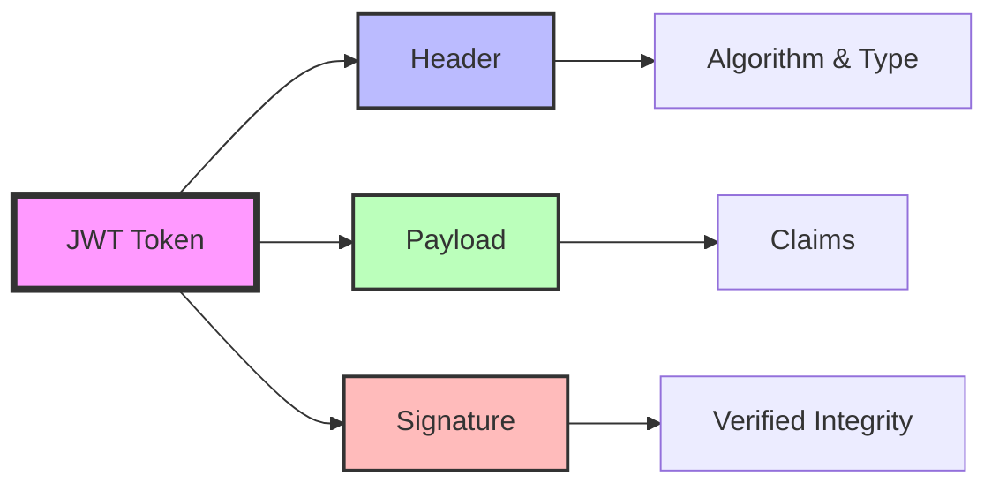
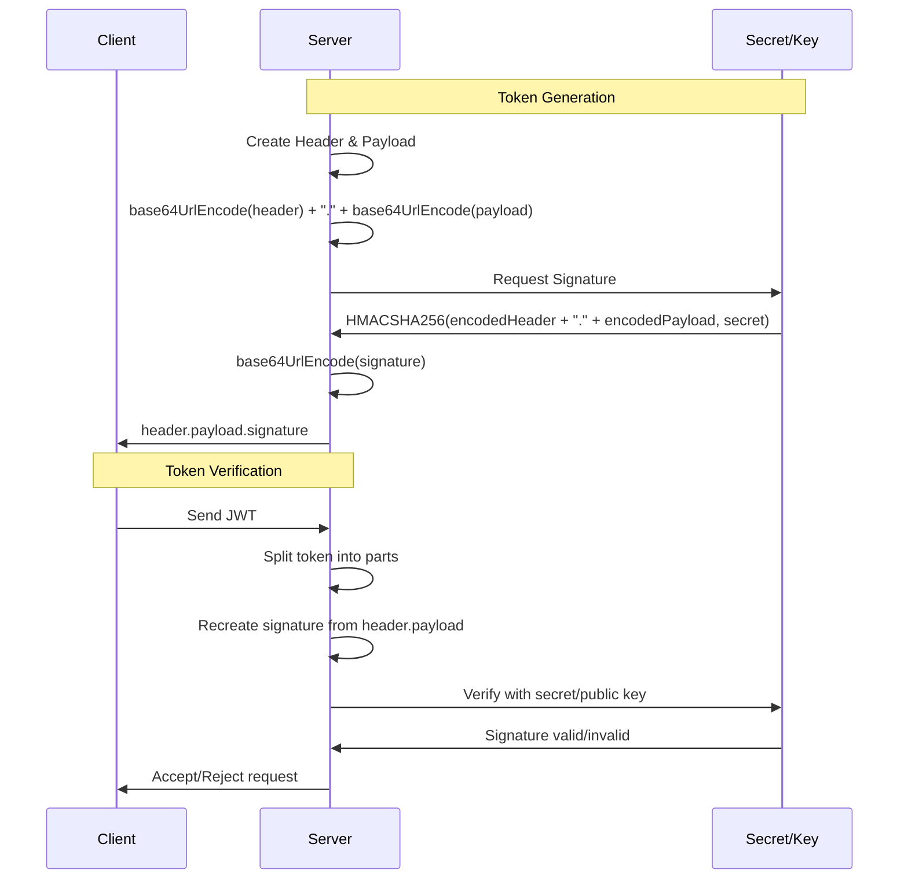
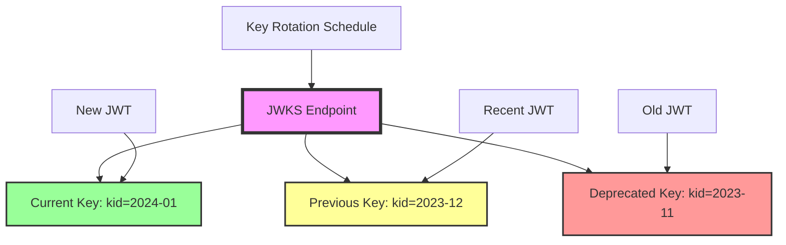

# JWT（JSON Web Token）

分散システムにおける認証・認可は、システム全体のセキュリティを左右する重要な要素である。従来のセッションベース認証では、サーバー側でセッション情報を管理する必要があり、水平スケーリングやステートレスなアーキテクチャの実現において課題となっていた。JWT（JSON Web Token）は、これらの課題に対する一つの解として2015年にRFC 7519[^1]として標準化された、自己完結型のトークンフォーマットである。

JWTの本質は、デジタル署名により完全性が保証された情報を、Base64URLエンコーディングによりURLセーフな形式で表現することにある。この設計により、トークン自体に必要な情報を含めることができ、サーバー側でのセッション管理を不要にする。しかし、この利便性の裏には、適切に理解し実装しなければセキュリティホールとなりうる多くの落とし穴が潜んでいる。

## JWTの構造と仕様

JWTは、ピリオド（.）で区切られた3つの部分から構成される。それぞれHeader、Payload、Signatureと呼ばれ、各部分はBase64URLエンコーディングされている。この構造は単純に見えるが、各部分には厳密な仕様が定められており、実装においては細心の注意が必要である。



### Header

HeaderはJOSE（JSON Object Signing and Encryption）Header[^2]とも呼ばれ、トークンのメタデータを含むJSON オブジェクトである。最も重要なパラメータは`alg`（algorithm）フィールドで、署名アルゴリズムを指定する。RFC 7518[^3]では、HS256（HMAC with SHA-256）、RS256（RSA Signature with SHA-256）、ES256（ECDSA using P-256 and SHA-256）などの標準的なアルゴリズムが定義されている。

```json
{
  "alg": "HS256",
  "typ": "JWT"
}
```

`typ`フィールドは省略可能だが、メディアタイプパラメータとして"JWT"を指定することで、アプリケーションレベルでの型安全性を向上させることができる。重要な点として、`alg`フィールドに"none"を指定することで署名なしのトークンを作成できるが、これは極めて限定的な用途でのみ使用すべきであり、多くの実装では明示的に無効化されている。

### Payload

Payloadには、エンティティ（通常はユーザー）に関する情報と追加のメタデータが含まれる。これらの情報はClaimsと呼ばれ、Registered Claims、Public Claims、Private Claimsの3種類に分類される。

Registered Claimsは、RFC 7519で定義された標準的なクレームである。`iss`（issuer）、`sub`（subject）、`aud`（audience）、`exp`（expiration time）、`nbf`（not before）、`iat`（issued at）、`jti`（JWT ID）の7つが定義されており、それぞれ特定の意味と検証ルールを持つ。

```json
{
  "iss": "https://auth.example.com",
  "sub": "1234567890",
  "aud": ["https://api.example.com", "https://app.example.com"],
  "exp": 1516239022,
  "iat": 1516235422
}
```

時刻関連のクレーム（`exp`、`nbf`、`iat`）は、NumericDate形式（1970年1月1日からの秒数）で表現される。この形式の選択は、タイムゾーンの問題を回避し、システム間での一貫性を保つためである。ただし、実装においては時刻の同期ずれを考慮し、通常は数分程度のclock skewを許容する設計が推奨される。

Public ClaimsはIANA JSON Web Token Registry[^4]に登録されているか、衝突を避けるためにURIとして定義されるべきクレームである。Private Claimsは、トークンの発行者と利用者の間で合意された任意のクレームであり、名前空間の衝突に注意する必要がある。

### Signature

SignatureはHeaderとPayloadの完全性を保証する最も重要な部分である。署名の生成プロセスは、選択されたアルゴリズムによって異なるが、基本的な流れは以下の通りである。



HMAC系アルゴリズム（HS256、HS384、HS512）では、発行者と検証者が同じ秘密鍵を共有する必要がある。これは実装が単純である一方、鍵の配布と管理に課題がある。一方、RSAやECDSAなどの公開鍵暗号系アルゴリズムでは、秘密鍵で署名し公開鍵で検証するため、検証者は秘密鍵を持つ必要がない。

## 暗号学的基盤と安全性

JWTの安全性は、使用される暗号アルゴリズムの強度に依存する。RFC 7518では、各アルゴリズムの実装要件とセキュリティ考慮事項が詳細に定められている。

HS256（HMAC with SHA-256）は、最も広く使用されているアルゴリズムの一つである。HMACは、メッセージ認証コード（MAC）の一種で、以下の数式で表される：

$$HMAC(K, m) = H((K' \oplus opad) || H((K' \oplus ipad) || m))$$

ここで、$K$は秘密鍵、$m$はメッセージ、$H$はハッシュ関数（SHA-256）、$opad$と$ipad$は定数、$K'$は適切な長さに調整された鍵である。この構造により、長さ拡張攻撃に対する耐性を持つ。

RS256（RSA Signature with SHA-256）は、RSA-PKCS1-v1_5署名スキームを使用する。RSAの安全性は、大きな合成数の素因数分解の困難性に基づいている。現在の推奨では、最低でも2048ビットの鍵長が必要とされ、より高いセキュリティレベルでは3072ビットまたは4096ビットが推奨される。

ES256（ECDSA using P-256 and SHA-256）は、楕円曲線暗号を使用し、同等のセキュリティレベルをより短い鍵長で実現できる。P-256曲線は、NIST（米国国立標準技術研究所）によって標準化された楕円曲線であり、256ビットの鍵長でRSA 3072ビットと同等のセキュリティを提供する。

## セキュリティ上の考慮事項

JWTの実装において最も重要なのは、適切なセキュリティ対策を講じることである。RFC 8725[^5]では、JWTの使用におけるベストプラクティスが詳細に記載されている。

### アルゴリズム混同攻撃

最も深刻な脆弱性の一つは、アルゴリズム混同攻撃である。攻撃者がHeaderの`alg`フィールドを改ざんし、例えば"RS256"から"HS256"に変更することで、公開鍵を秘密鍵として使用させる攻撃が可能になる。この攻撃を防ぐため、検証側では許可されたアルゴリズムのホワイトリストを明示的に定義し、トークンのHeaderに記載されたアルゴリズムではなく、事前に設定されたアルゴリズムで検証を行うべきである。

```python
# Vulnerable implementation
def verify_token(token, key):
    header = decode_header(token)
    algorithm = header['alg']  # Don't trust user input!
    return jwt.verify(token, key, algorithm=algorithm)

# Secure implementation
def verify_token(token, key, allowed_algorithms=['RS256']):
    return jwt.verify(token, key, algorithms=allowed_algorithms)
```

### トークンの有効期限とリフレッシュ

JWTはステートレスであるため、一度発行されたトークンをサーバー側で無効化することは原理的に不可能である。これは、ユーザーのログアウトや権限の即時取り消しが必要な場合に課題となる。この問題に対する一般的なアプローチは、短い有効期限を設定し、リフレッシュトークンと組み合わせることである。

アクセストークンの有効期限は、セキュリティとユーザビリティのトレードオフを考慮して決定する必要がある。一般的には15分から1時間程度が推奨されるが、アプリケーションの性質によって適切な値は異なる。リフレッシュトークンは、より長い有効期限を持ち、新しいアクセストークンを取得するためにのみ使用される。

### トークンサイズと性能への影響

JWTの自己完結性は利点である一方、トークンサイズの増大という課題も生む。特に多くのクレームを含む場合、トークンは数キロバイトに達することがある。これは、HTTPヘッダーのサイズ制限（多くのサーバーで8KB程度）や、モバイルネットワークでの帯域幅の問題を引き起こす可能性がある。

実装においては、必要最小限のクレームのみを含めることが重要である。また、頻繁にアクセスされる情報については、トークンに含めるのではなく、サーバー側でキャッシュすることも検討すべきである。

## 実装における落とし穴と対策

実際のシステムでJWTを実装する際には、仕様の理解だけでなく、実装の詳細にも注意を払う必要がある。

### Base64URLエンコーディングの罠

JWTで使用されるBase64URLエンコーディングは、通常のBase64エンコーディングとは異なり、URLセーフな文字セットを使用する。具体的には、`+`を`-`に、`/`を`_`に置換し、パディング文字`=`を除去する。この違いを理解せずに実装すると、トークンの検証に失敗する。

### 時刻の取り扱い

時刻関連のクレームでは、システム間の時刻同期のずれを考慮する必要がある。RFC 7519では、実装者に対して「reasonable leeway」（合理的な余裕）を持たせることを推奨している。一般的には、60秒から300秒程度のclock skewを許容する実装が多い。

```python
# Example of time validation with leeway
def validate_expiration(exp_claim, leeway=60):
    current_time = time.time()
    if current_time > exp_claim + leeway:
        raise TokenExpiredError("Token has expired")
```

### 鍵管理とローテーション

長期間同じ署名鍵を使用することは、セキュリティリスクを増大させる。定期的な鍵のローテーションは必須であるが、JWTのステートレス性により、古い鍵で署名されたトークンの検証も一定期間必要となる。

JWK（JSON Web Key）[^6]とJWKS（JSON Web Key Set）を使用することで、複数の鍵を管理し、スムーズな鍵のローテーションを実現できる。各鍵には`kid`（Key ID）を付与し、JWTのHeaderで使用する鍵を指定する。



## 他の認証方式との比較

JWTは万能の解決策ではなく、適切な使用場面を理解することが重要である。

### セッションベース認証との比較

従来のセッションベース認証では、セッションIDをクッキーに保存し、実際のセッション情報はサーバー側で管理する。この方式の利点は、セッションの即時無効化が可能であること、機密情報をクライアントに送信しないことである。一方、欠点として、サーバー側でのセッション管理が必要であり、水平スケーリングが複雑になることが挙げられる。

JWTは、これらの課題を解決する一方で、トークンの即時無効化ができない、トークンサイズが大きくなりがちといった新たな課題を生む。適切な選択は、システムの要件によって決まる。

### OAuth 2.0との関係

OAuth 2.0[^7]は認可フレームワークであり、JWTはその中で使用されるトークンフォーマットの一つである。RFC 9068[^8]では、OAuth 2.0のアクセストークンとしてJWTを使用する際の仕様が定められている。

OAuth 2.0のベアラートークンとしてJWTを使用する場合、`typ`ヘッダーパラメータに"at+jwt"を指定し、特定のクレーム（`iss`、`exp`、`aud`、`sub`、`client_id`、`iat`、`jti`）を含める必要がある。

### PASETO（Platform-Agnostic Security Tokens）

PASETOは、JWTの設計上の問題を解決することを目的として開発された代替トークンフォーマットである。主な違いは、アルゴリズムの選択をトークンから分離し、バージョンによって使用するアルゴリズムを固定することで、アルゴリズム混同攻撃を原理的に防いでいる点である。

PASETOは、より安全なデフォルト設定を提供する一方で、JWTほど広くサポートされていない。エコシステムの成熟度とセキュリティのトレードオフを考慮する必要がある。

## 現実世界での実装課題

理論と実践の間には常にギャップが存在する。JWTの実装においても、現実のシステムで直面する課題がある。

### マイクロサービスアーキテクチャでの利用

マイクロサービス環境では、サービス間の認証・認可にJWTが頻繁に使用される。各サービスが独立してトークンを検証できるため、認証サービスへの依存を減らすことができる。しかし、これは同時に、すべてのサービスで適切な検証ロジックを実装する必要があることを意味する。

サービスメッシュやAPIゲートウェイを使用することで、トークン検証を中央集権化し、個々のサービスの実装を簡素化できる。Istio、Kong、AWS API Gatewayなどの製品は、JWTの検証機能を標準で提供している。

### モバイルアプリケーションでの考慮事項

モバイルアプリケーションでは、トークンの安全な保存が課題となる。iOSのKeychain、AndroidのKeyStoreなど、プラットフォーム固有の安全なストレージを使用することが推奨される。また、デバイスの紛失や盗難に備えて、デバイス固有のクレームを含めることで、トークンの不正使用を防ぐことができる。

### パフォーマンスの最適化

JWTの検証は、特に公開鍵暗号を使用する場合、計算コストが高い。高トラフィックなシステムでは、検証結果のキャッシュや、JWKSのキャッシュが必要となる。ただし、キャッシュの有効期限は、セキュリティとパフォーマンスのバランスを考慮して設定する必要がある。

## 実装チェックリスト

JWTを実装する際の重要なチェックポイントを整理する。

1. **アルゴリズムの検証**: 許可されたアルゴリズムのホワイトリストを使用し、"none"アルゴリズムは明示的に拒否する
2. **署名の検証**: すべてのトークンで署名を検証し、検証に失敗したトークンは即座に拒否する
3. **有効期限の検証**: `exp`クレームを必須とし、適切なclock skewを設定する
4. **発行者の検証**: `iss`クレームで信頼できる発行者からのトークンであることを確認する
5. **対象者の検証**: `aud`クレームで、トークンが自サービス向けであることを確認する
6. **鍵管理**: 定期的な鍵のローテーションを実施し、古い鍵の適切な廃棄を行う
7. **エラーハンドリング**: セキュリティに関わるエラーの詳細を露出しない
8. **監査ログ**: トークンの発行、検証失敗などのイベントを記録する

これらの基本的な対策に加えて、アプリケーション固有の要件に応じた追加の検証を実装することが重要である。JWTは強力なツールであるが、その力を安全に活用するには、深い理解と慎重な実装が不可欠である。

[^1]: Jones, M., Bradley, J., and N. Sakimura, "JSON Web Token (JWT)", RFC 7519, DOI 10.17487/RFC7519, May 2015, <https://www.rfc-editor.org/info/rfc7519>.

[^2]: Jones, M. and J. Hildebrand, "JSON Web Encryption (JWE)", RFC 7516, DOI 10.17487/RFC7516, May 2015, <https://www.rfc-editor.org/info/rfc7516>.

[^3]: Jones, M., "JSON Web Algorithms (JWA)", RFC 7518, DOI 10.17487/RFC7518, May 2015, <https://www.rfc-editor.org/info/rfc7518>.

[^4]: IANA, "JSON Web Token (JWT)", <https://www.iana.org/assignments/jwt/jwt.xhtml>.

[^5]: Sheffer, Y., Hardt, D., and M. Jones, "JSON Web Token Best Current Practices", RFC 8725, DOI 10.17487/RFC8725, February 2020, <https://www.rfc-editor.org/info/rfc8725>.

[^6]: Jones, M., "JSON Web Key (JWK)", RFC 7517, DOI 10.17487/RFC7517, May 2015, <https://www.rfc-editor.org/info/rfc7517>.

[^7]: Hardt, D., Ed., "The OAuth 2.0 Authorization Framework", RFC 6749, DOI 10.17487/RFC6749, October 2012, <https://www.rfc-editor.org/info/rfc6749>.

[^8]: Bertocci, V., "JSON Web Token (JWT) Profile for OAuth 2.0 Access Tokens", RFC 9068, DOI 10.17487/RFC9068, October 2021, <https://www.rfc-editor.org/info/rfc9068>.