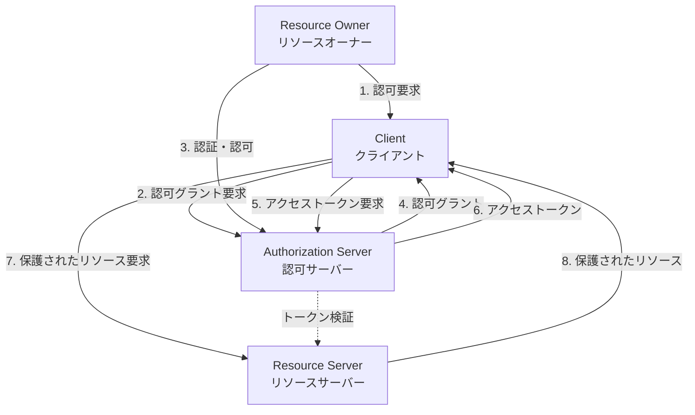
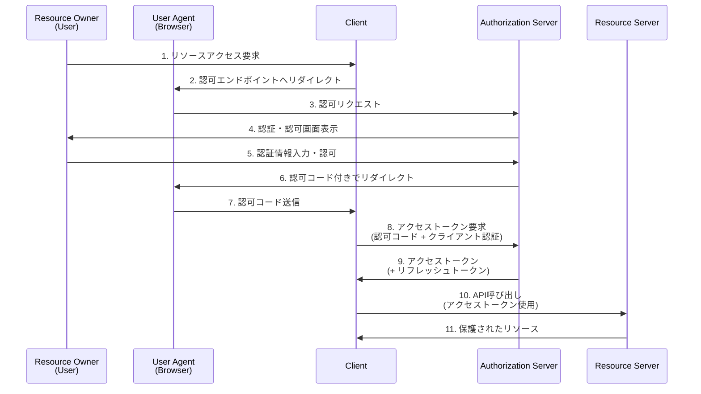
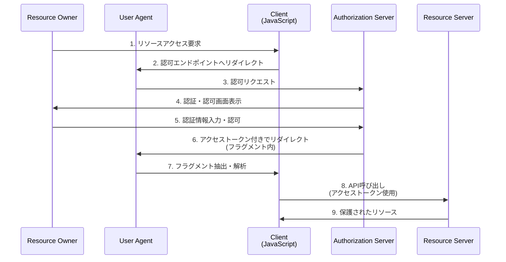
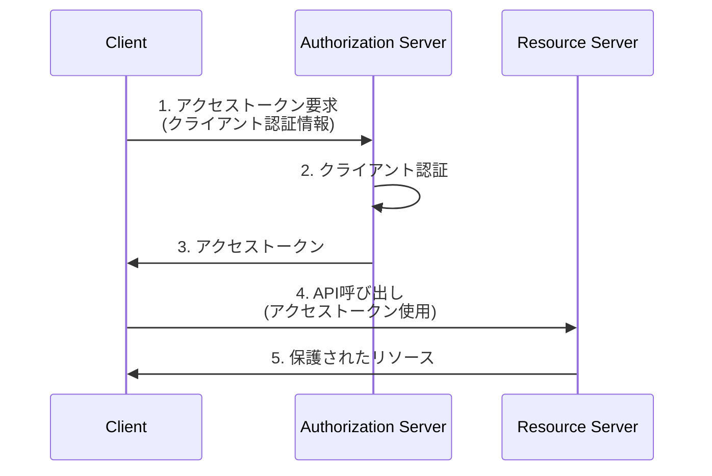
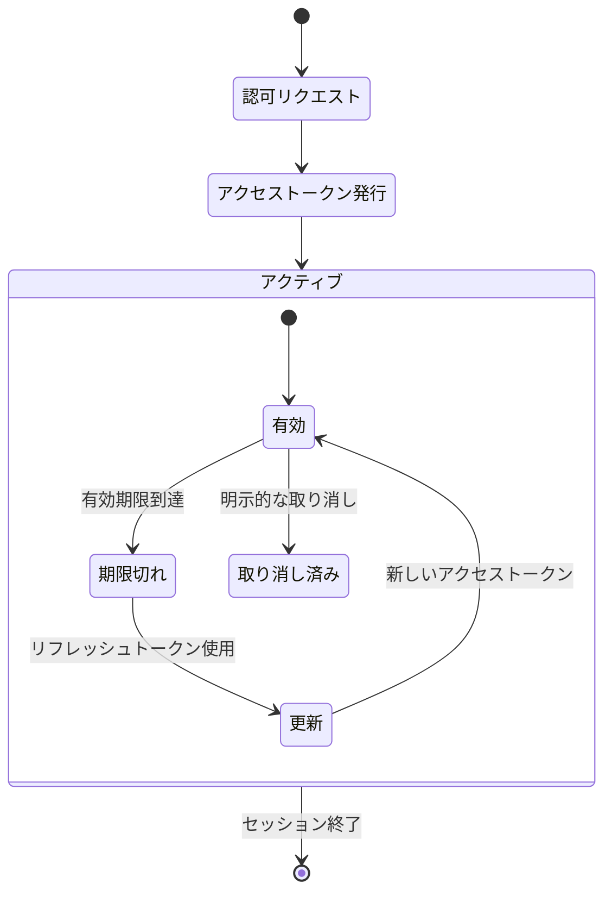
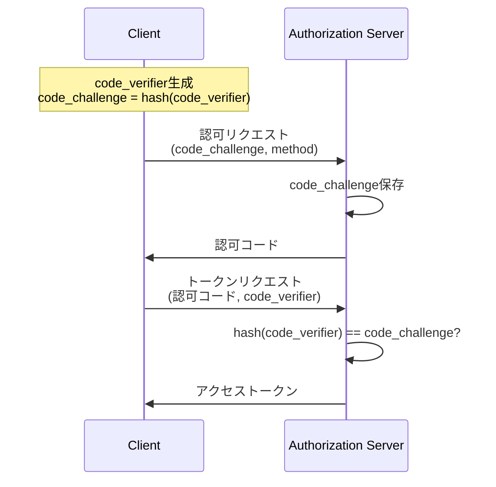
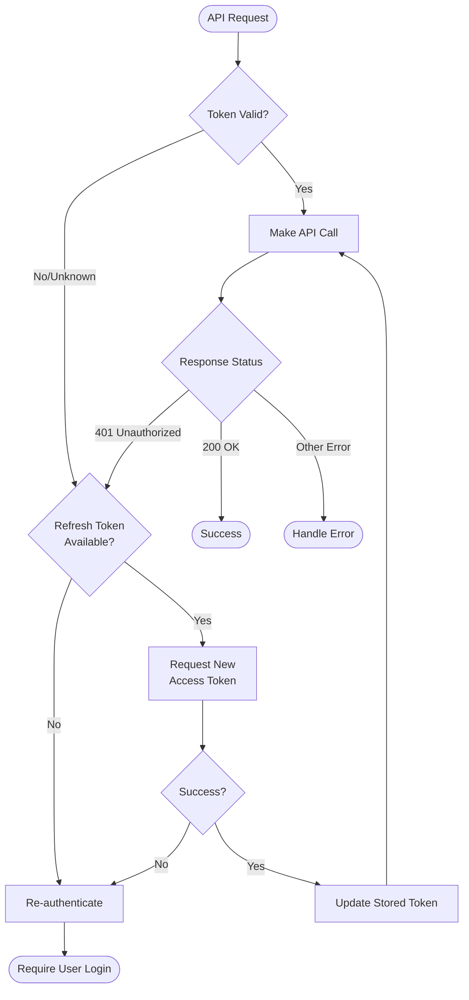

# OAuth 2.0

OAuth 2.0は、リソースオーナーに代わってHTTPサービスへの限定的なアクセスをサードパーティアプリケーションに許可するための認可フレームワークである[^1]。従来のクライアント・サーバー認証モデルでは、クライアントがリソースオーナーの認証情報を使用してサーバー上の保護されたリソースにアクセスしていたが、これにはリソースオーナーの認証情報をサードパーティと共有しなければならないという根本的な問題があった。OAuth 2.0は、リソースオーナーとクライアントの間に認可レイヤーを導入することで、この問題を解決している。

OAuth 2.0の設計思想は、アクセス権限の委譲を安全かつ柔軟に実現することにある。リソースオーナーは自身の認証情報をクライアントに渡すことなく、特定のスコープ、有効期限、その他の属性によって制限されたアクセス権限をクライアントに付与できる。この仕組みにより、ユーザーは自分のデータへのアクセスを細かく制御でき、必要に応じていつでもアクセス権限を取り消すことが可能となる。

## アーキテクチャとロール

OAuth 2.0のアーキテクチャは、4つの主要なロールによって構成される。それぞれのロールは明確に定義された責任を持ち、相互に連携して安全な認可プロセスを実現する。

**リソースオーナー（Resource Owner）**は、保護されたリソースへのアクセスを許可できるエンティティである。リソースオーナーが人間である場合、エンドユーザーと呼ばれる。例えば、ソーシャルメディアプラットフォームにおいて、自分のプロフィール情報や投稿データを所有するユーザーがリソースオーナーに該当する。

**クライアント（Client）**は、リソースオーナーに代わって、その認可を得て保護されたリソースに対してリクエストを行うアプリケーションである。クライアントという用語は特定の実装特性を示すものではなく、サーバー、デスクトップ、その他のデバイス上で動作するアプリケーションを指す。OAuth 2.0では、クライアントの種類を機密性の維持能力に基づいて分類している。

**認可サーバー（Authorization Server）**は、リソースオーナーを認証し、認可を取得した後、クライアントにアクセストークンを発行するサーバーである。認可サーバーとリソースサーバーの相互作用は、OAuth 2.0の仕様の範囲外であるが、実装においては同一のサーバーである場合もあれば、別々のエンティティである場合もある。単一の認可サーバーが複数のリソースサーバーによって受け入れられるアクセストークンを発行することも可能である。

**リソースサーバー（Resource Server）**は、保護されたリソースをホストし、アクセストークンを使用した保護されたリソースへのリクエストを受け入れ、応答するサーバーである。リソースサーバーは、アクセストークンを検証し、その有効性とスコープに基づいてリクエストを処理する。

## 認可フロー

OAuth 2.0は、異なるユースケースに対応するため、4つの認可フロー（グラントタイプ）を定義している。それぞれのフローは、特定のシナリオに最適化されており、セキュリティと利便性のバランスを考慮して設計されている。

### Authorization Code Grant

認可コードグラントは、最も一般的で安全な認可フローである。このフローは、クライアントが機密情報を安全に保持できる場合（サーバーサイドアプリケーション）に適している。認可コードは、クライアントと認可サーバー間の仲介として機能し、リソースオーナーの認証情報がクライアントに渡されることを防ぐ。

認可コードフローの重要な特徴は、アクセストークンがユーザーエージェント（通常はブラウザ）を経由せずに、クライアントと認可サーバー間で直接交換されることである。これにより、アクセストークンが第三者に露出するリスクを最小限に抑えることができる。また、クライアント認証を必須とすることで、認可コードの不正使用を防いでいる。

このフローでは、`state`パラメータを使用してCSRF攻撃を防ぐことが推奨される。クライアントは認可リクエスト時にランダムな値を生成し、認可サーバーからのレスポンスで同じ値が返されることを確認する必要がある。

### Implicit Grant

インプリシットグラントは、JavaScriptなどを使用してブラウザ内で動作するクライアント向けに最適化されたフローである[^2]。このフローでは、認可コードの交換ステップを省略し、認可サーバーから直接アクセストークンが発行される。ただし、このフローはセキュリティ上の懸念から、現在では推奨されていない。

インプリシットグラントの主な問題は、アクセストークンがURLフラグメントに含まれるため、ブラウザの履歴やリファラーヘッダーを通じて漏洩する可能性があることである。また、リフレッシュトークンが発行されないため、アクセストークンの有効期限が切れた場合は、再度認可フロー全体を実行する必要がある。

### Resource Owner Password Credentials Grant

リソースオーナーパスワードクレデンシャルグラントは、リソースオーナーがクライアントを高度に信頼している場合にのみ使用されるべきフローである。このフローでは、リソースオーナーの認証情報（通常はユーザー名とパスワード）を直接クライアントに提供し、クライアントがそれを使用してアクセストークンを取得する。

このフローは、レガシーアプリケーションの移行や、クライアントとリソースサーバーが同じ組織によって運営されている場合など、限定的なシナリオでのみ適切である。クライアントは取得した認証情報を保存してはならず、アクセストークンの取得後は直ちに破棄する必要がある。

### Client Credentials Grant

クライアントクレデンシャルグラントは、クライアント自身の認証情報を使用してアクセストークンを取得するフローである。このフローは、クライアントが自身の管理下にあるリソースにアクセスする場合や、リソースオーナーとの事前の取り決めに基づいてリソースへのアクセスが許可されている場合に使用される。

このフローは、マシン間の通信やバックグラウンドサービスなど、ユーザーの介在なしに動作するアプリケーションに適している。クライアントは、事前に登録された認証情報（クライアントIDとクライアントシークレット）を使用して認証される。

## トークンの種類と管理

OAuth 2.0では、主に2種類のトークンが使用される：アクセストークンとリフレッシュトークンである。これらのトークンは、それぞれ異なる目的と特性を持ち、適切に管理される必要がある。

**アクセストークン**は、保護されたリソースへのアクセスを許可する認証情報である。アクセストークンは、特定のスコープと有効期限を持ち、リソースサーバーによって検証される。OAuth 2.0の仕様では、アクセストークンの形式を規定していないが、実装では多くの場合、ランダムな文字列やJWT（JSON Web Token）[^3]が使用される。

アクセストークンの設計において重要な考慮事項は、有効期限の設定である。短い有効期限は、トークンが漏洩した場合の影響を限定できるが、頻繁な更新が必要となる。一方、長い有効期限は利便性を向上させるが、セキュリティリスクを増大させる。一般的には、数分から数時間の有効期限が設定される。

**リフレッシュトークン**は、新しいアクセストークンを取得するために使用される認証情報である。リフレッシュトークンは、通常、アクセストークンよりも長い有効期限を持ち、クライアントによって安全に保存される必要がある。リフレッシュトークンを使用することで、ユーザーの再認証なしにアクセストークンを更新できる。

トークンの管理において、以下の点が重要である：

1. **トークンの保存**：クライアントは、トークンを安全に保存する必要がある。ブラウザベースのアプリケーションでは、localStorageよりもメモリ内での保存が推奨される。

2. **トークンの伝送**：アクセストークンは、通常、HTTPのAuthorizationヘッダーにBearerトークンとして含められる。`Authorization: Bearer <token>`の形式が標準的である。

3. **トークンの取り消し**：OAuth 2.0 Token Revocation[^4]仕様では、トークンを明示的に取り消すためのエンドポイントが定義されている。これにより、ユーザーやクライアントは、不要になったトークンを無効化できる。

## セキュリティ考慮事項

OAuth 2.0の実装において、セキュリティは最も重要な考慮事項である。RFC 6819[^5]では、OAuth 2.0の脅威モデルとセキュリティ考慮事項が詳細に記述されている。

**認可コードインジェクション攻撃**は、攻撃者が正当なクライアントに対して、攻撃者が取得した認可コードを注入する攻撃である。この攻撃を防ぐため、PKCE（Proof Key for Code Exchange）[^6]の使用が推奨される。PKCEでは、クライアントが認可リクエスト時にcode_verifierから生成したcode_challengeを送信し、トークンリクエスト時にcode_verifierを送信することで、認可コードの正当性を検証する。

**トークン漏洩**は、アクセストークンやリフレッシュトークンが意図しない第三者に露出することである。これを防ぐため、以下の対策が必要である：

1. TLS/HTTPSの使用を必須とし、すべての通信を暗号化する
2. トークンをURLパラメータに含めない（特にGETリクエスト）
3. リダイレクトURIの厳密な検証を行う
4. トークンの有効期限を適切に設定する

**クライアント認証**の強化も重要である。公開クライアント（ネイティブアプリケーションやSPA）では、クライアントシークレットを安全に保存できないため、PKCEの使用が必須となる。機密クライアントでは、クライアントシークレットの安全な管理に加えて、相互TLS認証[^7]の使用も検討すべきである。

**スコープの適切な設計と実装**は、最小権限の原則を実現するために重要である。スコープは、アクセストークンが許可する操作を制限するメカニズムである。例えば、`read:profile`、`write:posts`のように、リソースと操作を明確に定義することで、過剰な権限付与を防ぐことができる。

## 実装上の注意点とベストプラクティス

OAuth 2.0の実装において、仕様の理解だけでなく、実践的な知識も重要である。以下に、実装時の主要な注意点とベストプラクティスを示す。

**エラーハンドリング**は、セキュリティと使いやすさの両面で重要である。OAuth 2.0では、エラーレスポンスの形式が標準化されている。エラーコード（`invalid_request`、`unauthorized_client`、`access_denied`など）と、オプションでエラーの説明とURIを含めることができる。ただし、エラーメッセージには機密情報を含めないよう注意が必要である。

**リダイレクトURIの検証**は、認可コードやトークンの不正な取得を防ぐために重要である。認可サーバーは、クライアント登録時に指定されたリダイレクトURIと、認可リクエスト時のリダイレクトURIを厳密に比較する必要がある。部分一致やワイルドカードの使用は避け、完全一致による検証を行うべきである。

**トークンのライフサイクル管理**では、アクセストークンの自動更新メカニズムの実装が重要である。クライアントは、APIレスポンスから401 Unauthorizedエラーを受け取った場合、リフレッシュトークンを使用して新しいアクセストークンを取得し、リクエストをリトライする仕組みを実装すべきである。

**クライアントタイプの適切な選択**も重要である。OAuth 2.0では、クライアントを「機密」と「公開」に分類している。サーバーサイドアプリケーションは機密クライアントとして実装し、クライアントシークレットを安全に管理する。一方、SPAやモバイルアプリケーションは公開クライアントとして扱い、PKCEを必須とする。

**監査とロギング**は、セキュリティインシデントの検出と対応に不可欠である。認可イベント、トークンの発行と使用、異常なアクセスパターンなどをログに記録し、定期的に監査する必要がある。ただし、トークンやパスワードなどの機密情報はログに含めないよう注意が必要である。

OAuth 2.0は、現代のWebアプリケーションにおける認可の標準として広く採用されている。その柔軟性と拡張性により、様々なユースケースに対応できる一方で、適切な実装には深い理解と慎重な設計が必要である。セキュリティベストプラクティスの遵守、適切なフローの選択、そして継続的な監視と改善により、安全で使いやすい認可システムを構築することができる。

[^1]: Hardt, D., "The OAuth 2.0 Authorization Framework", RFC 6749, October 2012. https://tools.ietf.org/html/rfc6749

[^2]: OAuth 2.0 Security Best Current Practice draft-ietf-oauth-security-topics-19では、Implicit Grantの使用を推奨していない。代わりにAuthorization Code Grant with PKCEの使用が推奨されている。

[^3]: Jones, M., Bradley, J., and N. Sakimura, "JSON Web Token (JWT)", RFC 7519, May 2015. https://tools.ietf.org/html/rfc7519

[^4]: Lodderstedt, T., Dronia, S., and M. Scurtescu, "OAuth 2.0 Token Revocation", RFC 7009, August 2013. https://tools.ietf.org/html/rfc7009

[^5]: Lodderstedt, T., McGloin, M., and P. Hunt, "OAuth 2.0 Threat Model and Security Considerations", RFC 6819, January 2013. https://tools.ietf.org/html/rfc6819

[^6]: Sakimura, N., Bradley, J., and N. Agarwal, "Proof Key for Code Exchange by OAuth Public Clients", RFC 7636, September 2015. https://tools.ietf.org/html/rfc7636

[^7]: Campbell, B., Bradley, J., Sakimura, N., and T. Lodderstedt, "OAuth 2.0 Mutual-TLS Client Authentication and Certificate-Bound Access Tokens", RFC 8705, February 2020. https://tools.ietf.org/html/rfc8705