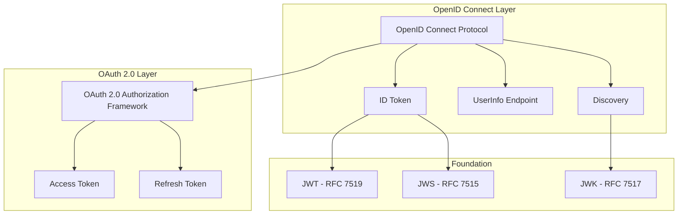
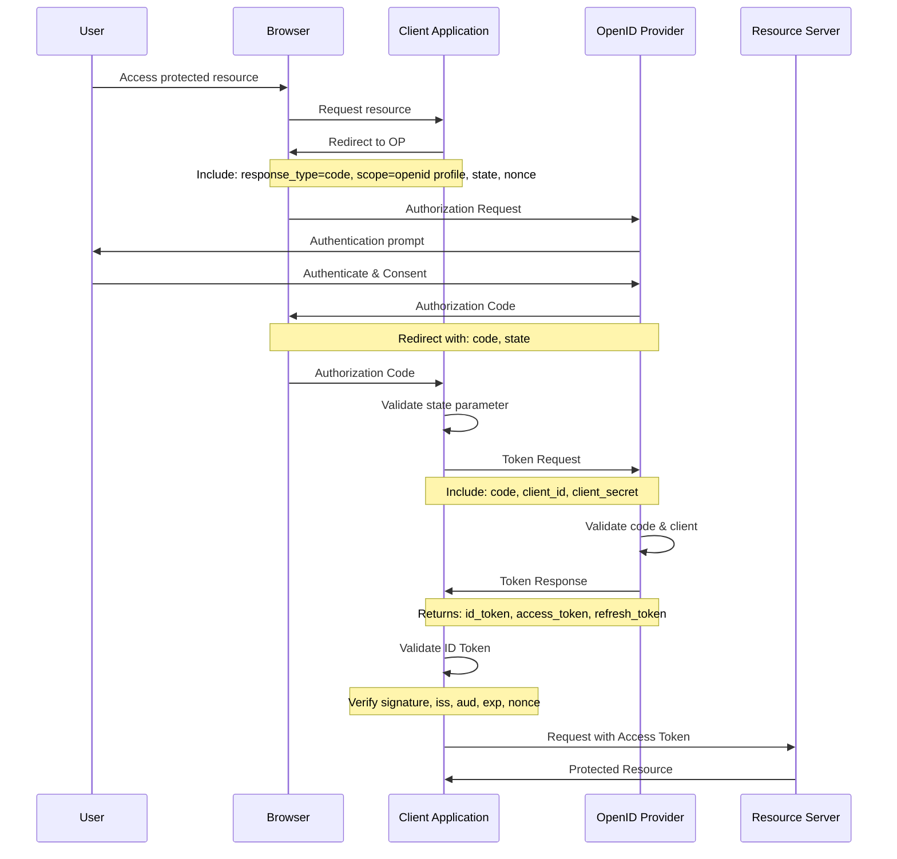
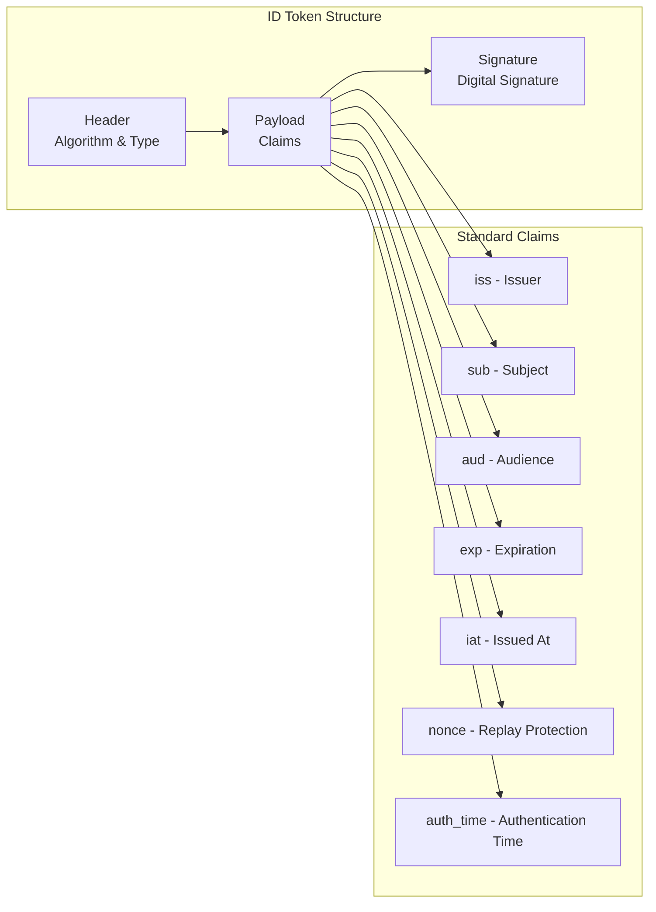

# OpenID Connect

OpenID Connect（OIDC）は、OAuth 2.0プロトコルの上に構築されたアイデンティティレイヤーであり、クライアントアプリケーションがユーザーの身元を検証し、基本的なプロファイル情報を取得できるようにする仕組みです[^1]。OAuth 2.0が認可（Authorization）に焦点を当てているのに対し、OpenID Connectは認証（Authentication）を提供することで、現代のWebアプリケーションにおける包括的なアイデンティティソリューションを実現しています。

歴史的に見ると、OpenID Connectは2014年2月に最終仕様が公開され、それ以前のOpenID 2.0やSAMLといった認証プロトコルの課題を解決する形で登場しました。特に、開発者にとってシンプルでありながら、エンタープライズレベルのセキュリティ要件を満たすという設計思想が、その普及の鍵となっています。

## OAuth 2.0との関係性

OpenID ConnectとOAuth 2.0の関係を理解することは、プロトコルの本質を把握する上で極めて重要です。OAuth 2.0[^2]は、リソースオーナー（通常はユーザー）の代わりに、クライアントアプリケーションがリソースサーバー上の保護されたリソースにアクセスすることを可能にする認可フレームワークです。しかし、OAuth 2.0自体は「誰が」アクセスしているかを検証する標準的な方法を提供していません。



OpenID Connectは、OAuth 2.0の認可フローを拡張し、IDトークンという新しい概念を導入することで認証を実現しています。IDトークンは、ユーザーの認証イベントに関する情報を含むセキュリティトークンであり、JSON Web Token（JWT）[^3]形式でエンコードされます。この設計により、OAuth 2.0の既存のインフラストラクチャとエコシステムを活用しながら、認証機能を追加できるという利点があります。

重要な点は、OpenID Connectが単にOAuth 2.0の上に認証を追加しただけではないということです。プロトコルは、ディスカバリー、動的クライアント登録、セッション管理など、完全なアイデンティティソリューションに必要な多くの機能を標準化しています。

## 認証フローの詳細

OpenID Connectは、異なるユースケースに対応するため、複数の認証フローを定義しています。最も一般的で推奨されるのはAuthorization Code Flowです。

### Authorization Code Flow

Authorization Code Flowは、機密クライアント（クライアントシークレットを安全に保管できるサーバーサイドアプリケーション）に適した最も安全なフローです。以下のシーケンス図は、このフローの詳細を示しています：



このフローにおける重要なセキュリティパラメータとして、`state`と`nonce`があります。`state`パラメータはCSRF（Cross-Site Request Forgery）攻撃を防ぐために使用され、認可リクエストとレスポンスを関連付けます。一方、`nonce`（number used once）はIDトークン内に含まれ、リプレイ攻撃を防ぐ役割を果たします。

Authorization Code Flowの利点は、アクセストークンがブラウザに露出しないことです。認可コードは一度しか使用できず、短期間で有効期限が切れるため、傍受されてもリスクが限定的です。また、クライアントの認証が可能なため、より高いセキュリティレベルを実現できます。

### Implicit Flow（非推奨）

Implicit Flowは、JavaScriptアプリケーションのような公開クライアント向けに設計されましたが、現在では非推奨となっています。このフローでは、認可エンドポイントから直接トークンが返されるため、以下のようなセキュリティ上の懸念があります：

1. アクセストークンがURLフラグメントに含まれるため、ブラウザの履歴やリファラーヘッダーを通じて漏洩する可能性
2. トークンの有効期限を短くせざるを得ず、リフレッシュトークンも使用できない
3. 中間者攻撃に対して脆弱

現在では、公開クライアントに対してもPKCE（Proof Key for Code Exchange）[^4]を使用したAuthorization Code Flowが推奨されています。

### Hybrid Flow

Hybrid Flowは、Authorization Code FlowとImplicit Flowの特徴を組み合わせたフローです。このフローでは、認可エンドポイントから一部のトークン（通常はIDトークン）を取得し、残りのトークンはトークンエンドポイントから取得します。これにより、早期にユーザー認証を検証しながら、アクセストークンのセキュリティを保つことができます。

## IDトークンの構造と検証

IDトークンは、OpenID Connectの中核となる要素であり、ユーザーの認証情報を含むセキュリティトークンです。JWT形式でエンコードされ、以下の3つの部分から構成されます：



IDトークンの標準的なクレームには以下があります：

- `iss`（Issuer）: トークンを発行したOpenID Providerの識別子
- `sub`（Subject）: ユーザーの一意な識別子
- `aud`（Audience）: トークンの対象となるクライアントのclient_id
- `exp`（Expiration Time）: トークンの有効期限
- `iat`（Issued At）: トークンが発行された時刻
- `auth_time`: ユーザーが認証された時刻
- `nonce`: リプレイ攻撃を防ぐためのランダム値

IDトークンの検証は、セキュリティの観点から極めて重要です。クライアントは以下の手順でIDトークンを検証する必要があります：

1. **署名の検証**: JWS[^5]に従って、トークンの署名を検証します。OpenID Providerの公開鍵は、JWKSエンドポイントから取得できます。

2. **発行者の検証**: `iss`クレームが期待されるOpenID Providerと一致することを確認します。

3. **対象者の検証**: `aud`クレームに自身のclient_idが含まれていることを確認します。複数の値が含まれる場合は、`azp`（Authorized Party）クレームも検証する必要があります。

4. **有効期限の検証**: 現在時刻が`iat`より後で`exp`より前であることを確認します。クロックスキューを考慮して、通常は数分の猶予を設けます。

5. **nonceの検証**: 認証リクエストで送信したnonceと一致することを確認します。

```
// Pseudocode for ID token validation
function validateIdToken(idToken, clientId, nonce, issuer) {
    // Parse JWT
    const [header, payload, signature] = parseJWT(idToken);
    
    // Verify signature
    const publicKey = fetchPublicKey(issuer, header.kid);
    if (!verifySignature(idToken, publicKey, header.alg)) {
        throw new Error("Invalid signature");
    }
    
    // Verify claims
    if (payload.iss !== issuer) {
        throw new Error("Invalid issuer");
    }
    
    if (payload.aud !== clientId && !payload.aud.includes(clientId)) {
        throw new Error("Invalid audience");
    }
    
    const now = getCurrentTime();
    if (now < payload.iat || now > payload.exp) {
        throw new Error("Token expired");
    }
    
    if (payload.nonce !== nonce) {
        throw new Error("Invalid nonce");
    }
    
    return payload;
}
```

## UserInfoエンドポイント

UserInfoエンドポイントは、認証されたユーザーに関する追加のクレーム（属性）を取得するためのOAuth 2.0で保護されたリソースです。クライアントは、有効なアクセストークンを使用してこのエンドポイントにアクセスし、ユーザーのプロファイル情報を取得できます。

UserInfoエンドポイントから返される標準的なクレームには以下があります：

- `sub`: ユーザーの識別子（IDトークンのsubと一致する必要がある）
- `name`: ユーザーのフルネーム
- `given_name`: 名
- `family_name`: 姓
- `email`: メールアドレス
- `email_verified`: メールアドレスが検証済みかどうか
- `picture`: プロフィール画像のURL
- `locale`: ユーザーの言語設定

クライアントは、認証リクエストの`scope`パラメータで要求するクレームを指定します。例えば、`scope=openid profile email`を指定すると、基本的なプロファイル情報とメールアドレスを取得できます。

UserInfoエンドポイントのレスポンスは、通常JSON形式ですが、署名や暗号化されたJWT形式で返すこともできます。これは、転送中の改ざんを防ぎ、機密性の高い情報を保護する場合に有用です。

## Discovery機能

OpenID Connect Discovery[^6]は、クライアントがOpenID Providerの設定情報を動的に発見できるメカニズムです。これにより、エンドポイントURLや対応している機能などの設定をハードコーディングする必要がなくなります。

Discovery機能は以下の2つの主要なコンポーネントから構成されます：

1. **WebFinger**: ユーザー識別子からOpenID ProviderのURLを発見
2. **Provider Configuration**: OpenID Providerのメタデータを取得

Provider Configurationは、`/.well-known/openid-configuration`パスで公開され、以下のような情報を含みます：

```json
{
    "issuer": "https://accounts.example.com",
    "authorization_endpoint": "https://accounts.example.com/oauth/authorize",
    "token_endpoint": "https://accounts.example.com/oauth/token",
    "userinfo_endpoint": "https://accounts.example.com/oauth/userinfo",
    "jwks_uri": "https://accounts.example.com/oauth/discovery/keys",
    "registration_endpoint": "https://accounts.example.com/oauth/register",
    "scopes_supported": ["openid", "profile", "email", "phone"],
    "response_types_supported": ["code", "token", "id_token", "code token", "code id_token", "token id_token", "code token id_token"],
    "grant_types_supported": ["authorization_code", "implicit", "refresh_token"],
    "subject_types_supported": ["public", "pairwise"],
    "id_token_signing_alg_values_supported": ["RS256", "ES256"],
    "claims_supported": ["sub", "iss", "aud", "exp", "iat", "name", "email"]
}
```

Discovery機能の利点は、OpenID Providerが設定を変更しても、クライアントの再設定が不要になることです。また、複数のOpenID Providerをサポートするマルチテナントアプリケーションの実装が容易になります。

## セッション管理

OpenID Connectは、シングルサインオン（SSO）環境でのセッション管理を標準化しています。これには、セッションの確立、監視、終了が含まれます。

### セッション管理の仕組み

OpenID Providerとクライアントアプリケーション間でセッションを同期するため、以下のメカニズムが提供されています：

1. **Session Management Endpoint**: クライアントがiframeを使用してユーザーのセッション状態を監視
2. **Check Session Endpoint**: OpenID Providerでのセッション状態を確認
3. **End Session Endpoint**: ユーザーのログアウトを処理

セッション管理では、`session_state`という値を使用してセッションの状態を追跡します。この値は、クライアントIDとOpenID Providerのセッション情報から生成されるハッシュ値です。

### Front-Channel Logout

Front-Channel Logoutは、ブラウザのリダイレクトを使用してログアウトを伝播する方式です。ユーザーがOpenID Providerからログアウトすると、登録されているすべてのクライアントにログアウト要求が送信されます。

### Back-Channel Logout

Back-Channel Logoutは、サーバー間の直接通信を使用してログアウトを通知する、より信頼性の高い方式です。OpenID Providerは、影響を受けるクライアントに対してログアウトトークンを含むHTTP POSTリクエストを送信します。

## セキュリティ考慮事項

OpenID Connectの実装において、以下のセキュリティ考慮事項は極めて重要です。

### トークンの取り扱い

トークンは機密情報であり、適切に保護する必要があります。アクセストークンとリフレッシュトークンは、安全なストレージ（HTTPOnlyクッキーやセキュアなサーバーサイドセッション）に保存し、クライアントサイドのJavaScriptからアクセスできないようにすることが重要です。

IDトークンは認証の証明として使用されますが、APIアクセスには使用すべきではありません。これは、IDトークンがクライアント向けであり、リソースサーバーでの検証を想定していないためです。

### PKCE（Proof Key for Code Exchange）

PKCEは、認可コードの横取り攻撃を防ぐための拡張仕様です。特に、ネイティブアプリケーションやSingle Page Applicationのような公開クライアントでは必須となっています。PKCEでは、クライアントが`code_verifier`という高エントロピーの文字列を生成し、そのハッシュ値である`code_challenge`を認可リクエストに含めます。

### トークンバインディング

トークンバインディングは、トークンを特定のTLSコネクションにバインドすることで、トークンの盗用を防ぐメカニズムです。これにより、攻撃者が正規のトークンを取得しても、異なるTLSコネクションからは使用できなくなります。

### Claim の最小化

プライバシー保護の観点から、IDトークンやUserInfoレスポンスに含まれるクレームは必要最小限にすべきです。特に、機密性の高い情報（社会保障番号、銀行口座情報など）は、適切な暗号化なしに含めるべきではありません。

## 実装における実践的指針

OpenID Connectを実装する際の実践的な指針を以下に示します。

### ライブラリの選択

OpenID Connectの仕様は複雑であり、セキュリティに関わる多くの詳細があるため、実績のあるライブラリを使用することを強く推奨します。各言語で以下のようなライブラリが利用可能です：

- **JavaScript/Node.js**: openid-client, passport-openidconnect
- **Python**: pyoidc, authlib
- **Java**: Spring Security, Nimbus OAuth + OIDC SDK
- **Go**: coreos/go-oidc, ory/fosite

### エラーハンドリング

認証フローにおけるエラーは、ユーザーエクスペリエンスとセキュリティの両方に影響します。エラーレスポンスは適切に処理し、ユーザーに分かりやすいメッセージを表示する必要があります。同時に、攻撃者に有用な情報を提供しないよう、エラーメッセージは慎重に設計する必要があります。

### パフォーマンス最適化

JWKSエンドポイントからの公開鍵の取得は、適切にキャッシュすることでパフォーマンスを向上させることができます。ただし、鍵のローテーションに対応するため、キャッシュの有効期限を適切に設定し、署名検証に失敗した場合は鍵を再取得する仕組みを実装する必要があります。

### 監査とロギング

認証イベントは、セキュリティ監査とトラブルシューティングのために適切にログに記録する必要があります。ただし、トークンやパスワードなどの機密情報はログに含めないよう注意が必要です。

OpenID Connectは、現代のアプリケーションアーキテクチャにおいて、安全で標準化された認証メカニズムを提供します。OAuth 2.0の堅牢な基盤の上に構築されたこのプロトコルは、開発者の利便性とエンタープライズレベルのセキュリティ要件のバランスを取ることに成功しています。適切に実装されたOpenID Connectは、ユーザーエクスペリエンスを向上させながら、組織のセキュリティポスチャーを強化する強力なツールとなります。

[^1]: OpenID Connect Core 1.0, OpenID Foundation, https://openid.net/specs/openid-connect-core-1_0.html

[^2]: The OAuth 2.0 Authorization Framework, RFC 6749, IETF, https://tools.ietf.org/html/rfc6749

[^3]: JSON Web Token (JWT), RFC 7519, IETF, https://tools.ietf.org/html/rfc7519

[^4]: Proof Key for Code Exchange by OAuth Public Clients, RFC 7636, IETF, https://tools.ietf.org/html/rfc7636

[^5]: JSON Web Signature (JWS), RFC 7515, IETF, https://tools.ietf.org/html/rfc7515

[^6]: OpenID Connect Discovery 1.0, OpenID Foundation, https://openid.net/specs/openid-connect-discovery-1_0.html