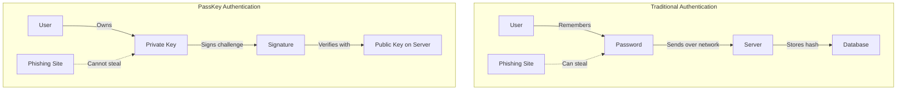
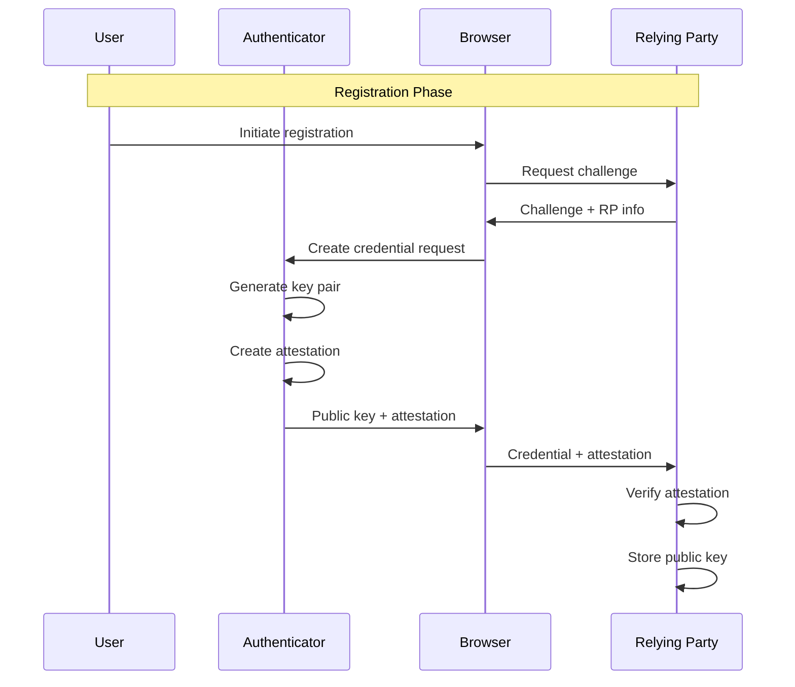
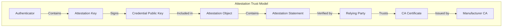
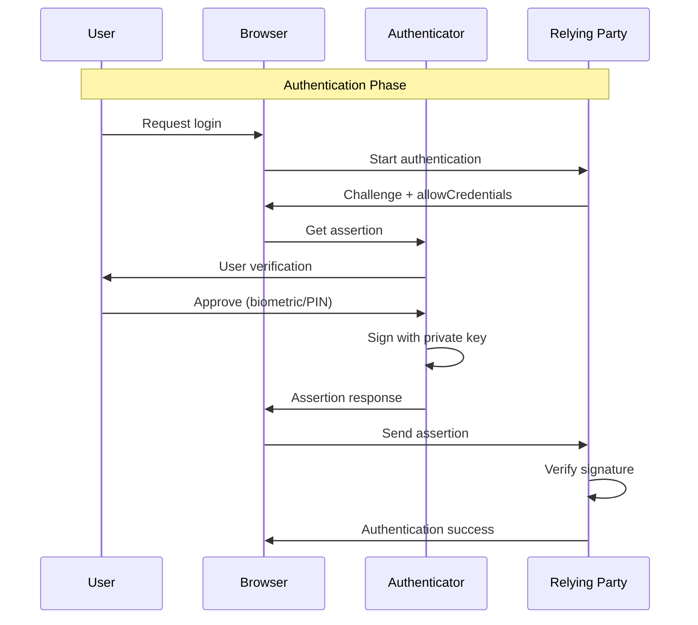
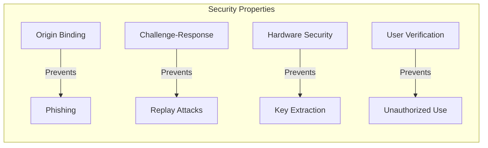
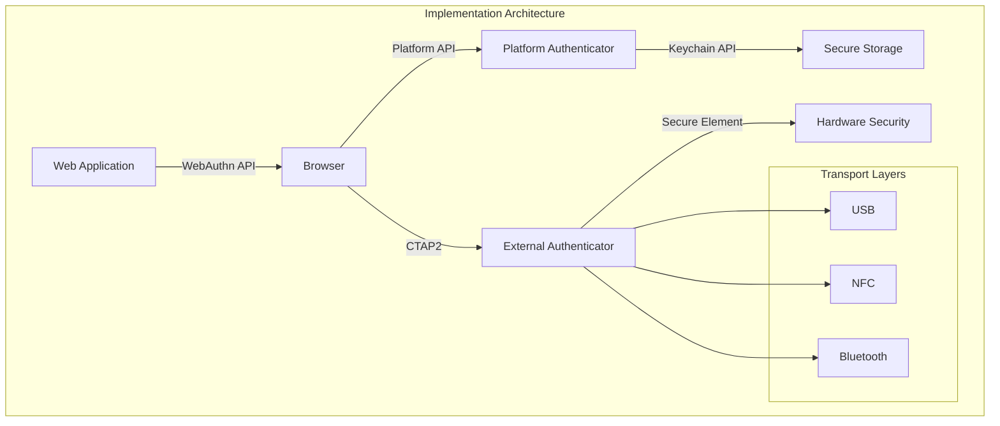
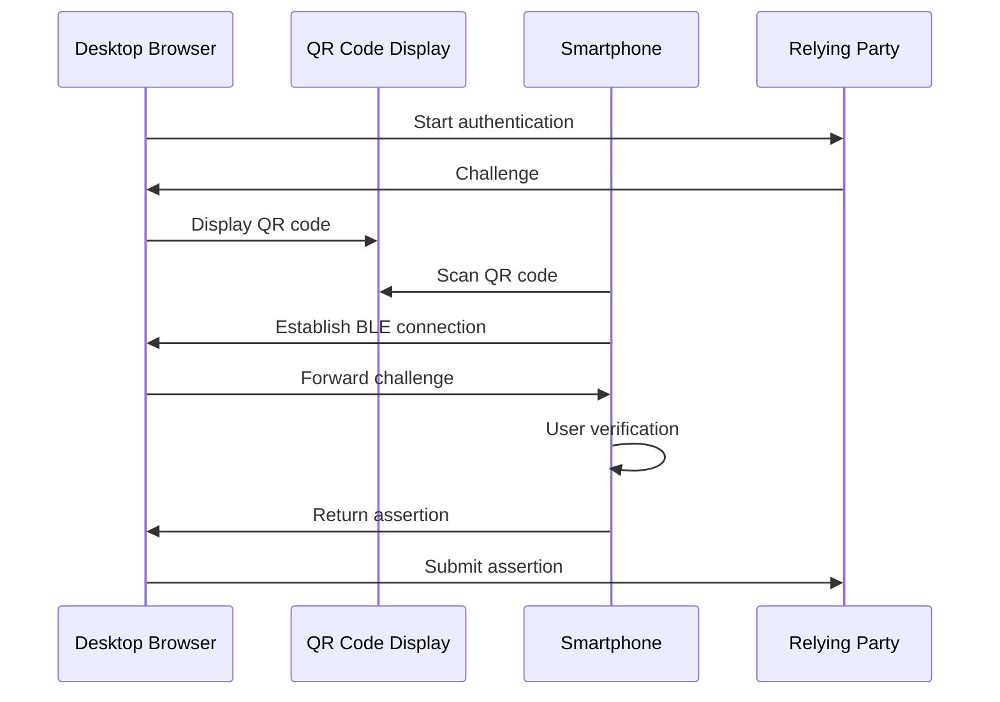
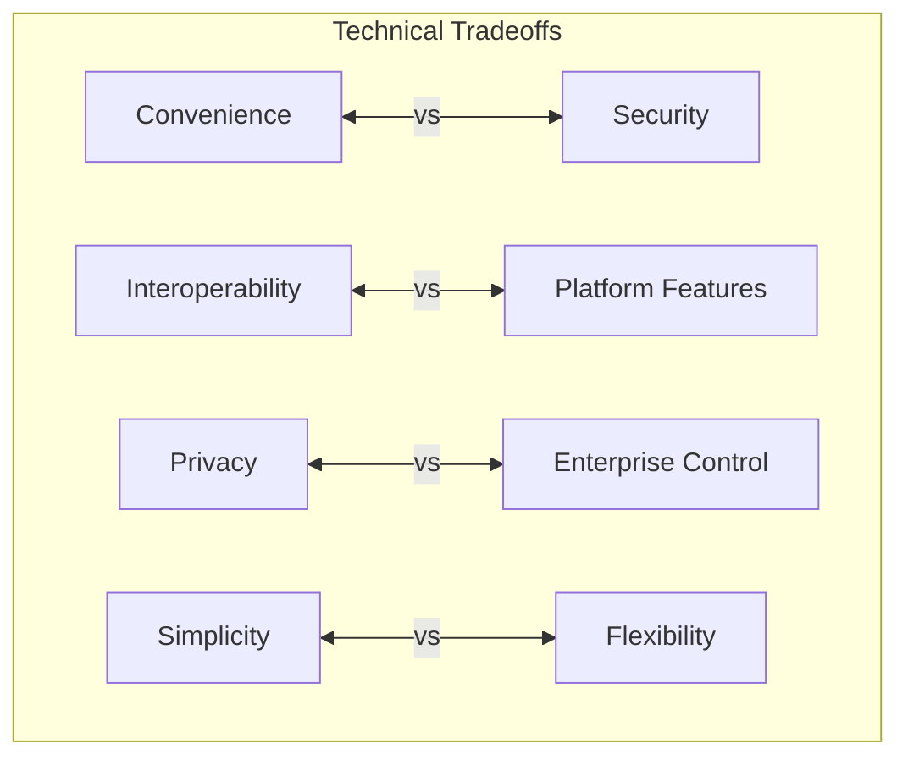

# PassKey

PassKeyは、パスワードに代わる新しい認証方式として、FIDO AllianceとW3Cによって標準化されたWebAuthn仕様[^1]に基づく技術である。従来のパスワード認証が抱える根本的な問題、すなわちフィッシング攻撃への脆弱性、パスワードの使い回しによるリスク、そして人間の記憶力に依存する本質的な限界を、公開鍵暗号技術を用いることで解決する。PassKeyは、単なるパスワードの代替手段ではなく、認証という行為そのものを再定義する試みとして理解されるべきである。

## 技術的背景と進化

PassKeyの技術的基盤は、FIDO2プロジェクトの成果物であるWebAuthn（Web Authentication）とCTAP（Client to Authenticator Protocol）の2つの仕様に立脚している。WebAuthnはW3Cによって標準化され[^2]、ブラウザとRelyingParty（認証を要求するWebサービス）間のインターフェースを定義する。一方、CTAPはFIDO Allianceによって策定され、クライアントデバイス（ブラウザ）と認証器（Authenticator）間の通信プロトコルを規定する[^3]。

歴史的に見ると、FIDO U2F（Universal 2nd Factor）からFIDO2への進化は、単なる二要素認証から完全なパスワードレス認証への移行を可能にした重要な転換点であった。U2Fでは物理的なセキュリティキーが必須であったが、FIDO2ではプラットフォーム認証器（デバイスに組み込まれた認証機能）の利用が可能となり、これがPassKeyの普及を促進する技術的基盤となっている。

## 暗号学的基盤

PassKeyの中核となる暗号学的メカニズムは、楕円曲線暗号（ECC）またはRSAによる公開鍵暗号方式である。WebAuthn仕様では、以下のアルゴリズムがCOSE（CBOR Object Signing and Encryption）[^4]形式で定義されている：

- ES256（ECDSA with P-256 and SHA-256）
- RS256（RSASSA-PKCS1-v1_5 with SHA-256）
- EdDSA（Ed25519）

認証器は、各RelyingPartyごとに異なる鍵ペアを生成し、秘密鍵を安全に保管する。この鍵生成プロセスにおいて重要なのは、認証器がハードウェアベースのセキュアエレメント（Trusted Platform Module、Secure Enclave等）を利用できる場合、秘密鍵は物理的に抽出不可能な形で保護されることである。

## Attestationメカニズム

Attestationは、認証器の真正性を証明するメカニズムであり、PassKeyのセキュリティモデルにおいて重要な役割を果たす。WebAuthn仕様では、以下のAttestation形式が定義されている：

**Basic Attestation**: 認証器製造者によって発行された証明書チェーンを用いて、認証器の型式と製造元を証明する。この形式では、同一モデルの認証器が同じAttestation証明書を共有するため、個々のデバイスの追跡は不可能である。

**Self Attestation**: 認証器が生成した鍵ペアの秘密鍵を用いて自己署名を行う。この形式は認証器の真正性を証明しないが、プライバシーを最大限に保護する。

**Attestation CA**: 認証器ごとに異なる証明書を発行する方式。エンタープライズ環境では有用だが、一般的なコンシューマー向けサービスではプライバシーの観点から推奨されない。

**None**: Attestationを提供しない。クライアントは空のAttestation文を返す。

## 認証フロー詳細

PassKeyによる認証プロセスは、チャレンジ・レスポンス方式に基づいている。このプロセスは以下の段階で構成される：

**1. 認証要求フェーズ**: RelyingPartyは、ランダムに生成されたチャレンジ（最小16バイト）と、許可されたクレデンシャルのリスト（allowCredentials）を含む認証オプションを生成する。このチャレンジは、リプレイ攻撃を防ぐための一回限りの値である。

**2. 認証器選択フェーズ**: ブラウザは利用可能な認証器を列挙し、allowCredentialsに含まれるクレデンシャルIDと照合する。複数の認証器が該当する場合、ユーザーに選択を促す。

**3. ユーザー検証フェーズ**: 選択された認証器は、設定されたユーザー検証要件に基づいて、生体認証（指紋、顔認証等）またはPIN入力を要求する。ユーザー検証の結果は、Authenticator Dataのフラグビットに記録される。

**4. アサーション生成フェーズ**: 認証器は、保存された秘密鍵を用いて、クライアントデータハッシュとAuthenticator Dataを含む署名を生成する。

## セキュリティ特性と脅威モデル

PassKeyのセキュリティモデルは、複数の脅威に対する防御メカニズムを提供する。各脅威に対する防御策を詳細に検討する：

**フィッシング耐性**: PassKeyの最も重要なセキュリティ特性は、フィッシング攻撃に対する完全な耐性である。これは、WebAuthnプロトコルがオリジン（origin）バインディングを強制することによって実現される。認証器は、登録時のオリジンと異なるオリジンからの認証要求を拒否する。このメカニズムは、クライアントデータ構造に含まれるオリジン情報がAuthenticator Dataと共に署名されることで保証される。

**中間者攻撃（MITM）への対策**: TLS接続の使用が前提となっているため、ネットワーク層での中間者攻撃は防御される。さらに、Token Binding[^5]をサポートする実装では、TLSセッションと認証セッションの結合により、より強固な防御が可能となる。

**リプレイ攻撃への対策**: 各認証セッションで新しいチャレンジが生成され、このチャレンジが署名対象に含まれるため、過去の認証レスポンスの再利用は不可能である。チャレンジの有効期限は実装依存だが、一般的に数分程度に設定される。

**クレデンシャル窃取への対策**: 秘密鍵は認証器内部に保存され、WebAuthn APIを通じて取得することは不可能である。ハードウェアベースの認証器では、物理的な攻撃に対しても耐タンパー性を持つ。

## 実装アーキテクチャ

PassKeyの実装は、複数のコンポーネントの協調によって実現される。各コンポーネントの責務と実装上の考慮事項を詳述する：

**ブラウザ実装**: 主要なブラウザ（Chrome、Safari、Firefox、Edge）は、WebAuthn APIを実装している。ブラウザは、JavaScript APIを通じてWebアプリケーションからの要求を受け取り、適切な認証器との通信を仲介する。実装において重要なのは、認証器の発見と選択のメカニズムである。

**プラットフォーム認証器**: Windows Hello、Touch ID/Face ID、Android Biometric APIなど、OSレベルで提供される認証機能である。これらの認証器は、デバイスのセキュアエレメントを利用して鍵を保護する。実装上の課題として、異なるプラットフォーム間での鍵の同期がある。AppleのiCloud Keychain、GoogleのPassword Managerは、エンドツーエンド暗号化を用いた同期機能を提供している。

**外部認証器**: USB、NFC、Bluetoothを介して接続される物理的なセキュリティキーである。CTAP2プロトコルを実装し、PINやバイオメトリクスによるユーザー検証をサポートする。実装において考慮すべきは、トランスポート層の違いによる通信特性の差異である。

## メタデータサービスとエコシステム

FIDO Alliance Metadata Service（MDS）[^6]は、認証器のメタデータを集中管理するサービスである。MDSは、認証器の認定状態、セキュリティ評価レベル、既知の脆弱性情報を提供する。RelyingPartyは、MDSを利用することで、受け入れる認証器のポリシーを動的に管理できる。

メタデータには以下の情報が含まれる：
- 認証器の認定レベル（FIDO認定のレベル）
- サポートされる暗号アルゴリズム
- キーの保護方法（ソフトウェア、ハードウェア、TEE等）
- バイオメトリクスの性能指標（FAR、FRR）

## 性能特性とスケーラビリティ

PassKeyの性能特性は、従来のパスワード認証と比較して、いくつかの重要な違いがある：

**登録時の性能**: 鍵ペア生成は計算量が多い操作であり、特にRSA鍵の場合は顕著である。楕円曲線暗号（P-256）の使用により、鍵生成時間は大幅に短縮される。典型的な実装では、P-256鍵ペアの生成は10-50ミリ秒程度で完了する。

**認証時の性能**: 署名生成と検証は、パスワードハッシュの計算と比較して高速である。ECDSA署名の生成は通常5-20ミリ秒、検証は10-30ミリ秒程度である。ネットワークラウンドトリップを含めても、全体の認証時間は100-200ミリ秒程度に収まる。

**ストレージ要件**: 各ユーザーアカウントごとに公開鍵（P-256の場合64バイト）とクレデンシャルID（通常16-32バイト）の保存が必要である。これは、パスワードハッシュ（通常60-120バイト）と同程度のストレージ要件である。

## 相互運用性の課題

PassKeyの実装において、相互運用性は重要な技術的課題である。異なるプラットフォーム、ブラウザ、認証器間での互換性を確保するため、以下の標準化が進められている：

**CTAP 2.1の拡張機能**: 大きなBlobの保存、認証器の設定管理、エンタープライズAttestation等の機能が追加された。これらの拡張により、より柔軟な認証シナリオのサポートが可能となった。

**ハイブリッドトランスポート**: QRコードとBluetoothを組み合わせた、デバイス間での認証器共有メカニズムである。これにより、スマートフォンを認証器として、別のデバイスでの認証が可能となる。

## プライバシー設計

PassKeyのプライバシー保護設計は、以下の原則に基づいている：

**クレデンシャルの非連結性**: 異なるRelyingParty間でユーザーを追跡することは不可能である。各RPごとに異なる鍵ペアが生成され、クレデンシャルID間に数学的な関連性は存在しない。

**Attestationのプライバシー**: Basic Attestationでは、同一モデルの認証器が同じ証明書を共有することで、個体識別を防ぐ。さらに、多くの実装ではAttestation情報の送信自体をオプトインとしている。

**ユーザー情報の最小化**: WebAuthn APIは、必要最小限の情報のみを要求する。ユーザー名やディスプレイ名は、ローカルでの表示にのみ使用され、認証プロトコルには含まれない。

## 実装上の推奨事項

実際にPassKeyを実装する際の技術的推奨事項を以下に示す：

**アカウントリカバリー**: PassKeyの紛失に備えた回復メカニズムの実装が重要である。複数の認証器の登録を推奨し、バックアップコードやアカウント回復用の代替手段を提供すべきである。

**後方互換性**: 既存のパスワードベースシステムからの移行期間中は、両方の認証方式をサポートする必要がある。プログレッシブエンハンスメントの考え方で、PassKey対応ブラウザでは自動的にPassKey認証を提示し、非対応環境では従来の認証にフォールバックする実装が推奨される。

**エラーハンドリング**: WebAuthn APIは様々なエラー条件を返す可能性がある。タイムアウト、ユーザーによるキャンセル、認証器の不在など、各エラーケースに対する適切なユーザーフィードバックの実装が必要である。

**セッション管理**: PassKey認証後のセッション管理は、従来のパスワード認証と同様である。ただし、高セキュリティ要求のトランザクションでは、ステップアップ認証としてPassKeyの再認証を要求することが推奨される。

## 技術的制約とトレードオフ

PassKeyの採用には、以下の技術的制約とトレードオフが存在する：

**クロスデバイス体験**: デバイス固有の認証器を使用する場合、デバイス間での認証情報の共有が課題となる。クラウド同期機能は利便性を向上させるが、新たなセキュリティリスクを導入する可能性がある。

**認証器の可用性**: 認証器の故障や紛失は、アカウントへのアクセス喪失につながる。冗長性の確保とリカバリーメカニズムの実装が必須となるが、これはシステムの複雑性を増大させる。

**レガシーシステムとの統合**: 既存の認証インフラストラクチャとの統合は、技術的に複雑である。特に、SAMLやOAuthなどの既存のフェデレーション認証システムとの連携には、追加のプロトコル変換層が必要となる場合がある。

**規制要件への対応**: 特定の業界や地域では、認証に関する規制要件が存在する。例えば、金融業界では多要素認証が義務付けられている場合があり、PassKeyの実装においてもこれらの要件を満たす必要がある。

PassKeyは、パスワード認証の根本的な問題を解決する革新的な技術である。公開鍵暗号技術を基盤とし、フィッシング耐性、強固なセキュリティ、優れたユーザー体験を提供する。実装には技術的な課題が存在するが、標準化の進展と実装の成熟により、これらの課題は徐々に解決されつつある。エンジニアリングの観点から、PassKeyは認証システムの設計において考慮すべき重要な選択肢となっている。

[^1]: W3C Web Authentication: An API for accessing Public Key Credentials Level 2, https://www.w3.org/TR/webauthn-2/
[^2]: W3C Recommendation 04 April 2021, https://www.w3.org/TR/2021/REC-webauthn-2-20210408/
[^3]: FIDO Alliance Client to Authenticator Protocol (CTAP), https://fidoalliance.org/specs/fido-v2.1-ps-20210615/fido-client-to-authenticator-protocol-v2.1-ps-20210615.html
[^4]: IETF RFC 8152: CBOR Object Signing and Encryption (COSE), https://tools.ietf.org/html/rfc8152
[^5]: IETF RFC 8471: The Token Binding Protocol Version 1.0, https://tools.ietf.org/html/rfc8471
[^6]: FIDO Alliance Metadata Service, https://fidoalliance.org/metadata/